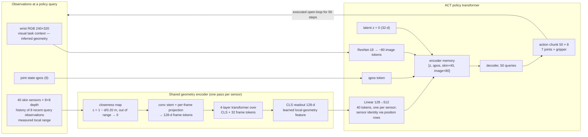
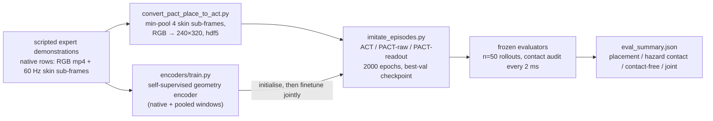

# PACT: Learning Collision-Aware Manipulation with Proximity Skin

*Vision infers geometry. A proximity skin measures it.*

Writing reference for the paper. Main text (§1–§9) is the storyline in readable prose; every
number is on this disk and carries an experiment-set tag in its table caption (Appendix A
defines the tags). Appendices B–F hold exact configuration, statistics, figure provenance,
glossary and proposed studies. Revised 2026-09-13 against `reports/paper_narrative_review.txt`
and the author's narrative note.

Main model **PACT-readout**. Design comparison **PACT-raw**. Baseline **ACT**.

---

## 1. The story in one page

**The question.** Does live proximity sensing at inference improve collision avoidance in
learned manipulation policies when task-relevant hazards are unavailable or ambiguous to RGB —
occluded by the arm itself, outside the camera's view, or visually indistinguishable from their
surroundings?

**The distinction that carries the paper.** A camera gives a policy geometry, but that geometry
is *inferred*: from appearance, from learned priors, from one viewpoint that the arm itself
blocks as it reaches. A proximity skin gives geometry that is *measured*: a range reading taken
at the surface of the link that would make contact, from forty viewpoints spread along the arm.
RGB supplies visual task context — where the cup is, where the tray is, what to do next.
Proximity supplies the local clearance that near-contact manipulation needs and that a single
camera cannot reliably provide inside a fume hood, a cabinet, or a cluttered shelf. Range is
measured; the useful representation of it is learned. PACT is the policy that learns to combine
the two.

**What we show, in order.**

1. *The skin supplies real geometry.* Forty 8×8 depth grids on links 1–6 sample the surfaces
   nearest each link. Six link-6 sensors alone, accumulated over one approach, reconstruct the
   hood walls and a protruding obstacle with no camera, mesh, or fitting. A learned encoder
   recovers nearest-surface points from a sensor's recent frames to 20.6 mm (set S).
2. *When a hazard is excluded from RGB, proximity is what avoids it.* In an archived controlled
   study, a bar rendered to the skin and to physics but not to the policy's camera raised the
   camera-only contact rate to 66 %; adding raw proximity brought it to 40 % (p = 0.016), the
   largest gap of the three visibility conditions (set O-INV).
3. *A policy trained with the skin makes less contact during confined manipulation.* On corridor
   pick-and-place through a fume-hood aperture with a wall-coloured bar entering from the side,
   PACT-readout cut hazard contact by 22 percentage points relative to ACT in two independent
   evaluation sets (34 % → 12 %; 40 % → 18 %; paired McNemar p = 0.00098 in the matched set) while
   placing the cup at least as often (28 % → 40 %; 30 % → 42 %) (sets H-A, H-B).
4. *Proximity is a clearance sense, not a task sense.* On a spaced-bench variant with two
   cameras, the skin arms did not improve — and lost — task completion while contact rates
   stayed flat (set T-107). The benefit is collision avoidance, bounded by task; it is not a
   general lift in manipulation success.

**The thesis, stated plainly.** Proximity does not make a manipulation policy better at the
task. It gives the policy a geometric representation the camera alone cannot provide, and the
policy uses it to stop hitting things. That is a stronger and more defensible claim than "PACT
beats ACT", and every experiment in the paper is arranged to support exactly that claim and
nothing more.

**Contributions.**

1. **Distributed range sensing and its pipeline.** A MuJoCo Franka FR3 with forty verified
   8×8 depth sensors along links 1–6 (38 of 40 pass a per-sensor plate/aim check), recorded at
   60 Hz with cameras and joint state, converted for imitation learning with a contact audit
   that separates hazard contact from incidental contact and from task completion.
2. **A learned geometry representation fused into the policy.** A shared per-sensor history
   encoder, pretrained self-supervised on skin data, whose 128-d readout enters ACT as forty
   sensor-identified tokens and is finetuned jointly with the action loss (PACT-readout). A
   training-free peak-closeness front end (PACT-raw) as the design comparison.
3. **An empirical investigation of what proximity buys.** Repeated hazard-contact reduction in
   confined manipulation; a controlled camera-hidden condition; a representation comparison;
   and a task-dependence result that bounds the benefit.

**Title.** *PACT: Learning Collision-Aware Manipulation with Proximity Skin.* Tighter
alternative: *PACT: Proximity Skin for Collision-Aware Manipulation in Confined Spaces.* Do not
title on "invisible obstacles": the hallway bar is wall-coloured and side-entering, not
excluded from rendering; the excluded-from-RGB evidence is the archived study.

---

## 2. Introduction (the argument in prose)

**Near-contact manipulation needs clearance, not just context.** Reaching into a fume hood,
a cabinet, or a packed shelf is a problem of two halves. The policy must understand the task —
which object, which target, which phase — and it must keep every link of the arm clear of the
geometry it is threading through. Learned visuomotor policies are good at the first half. The
second half is where they collide.

**Camera geometry is inferred.** A wrist camera looks forward at the object. It sees the world
from one viewpoint that the robot's own forearm and elbow do not share. Whatever the policy
knows about clearance at the elbow it must infer from appearance, from context, and from what
it has seen in training. That inference fails in three ordinary ways: the hazard is occluded by
the arm or the workspace; it lies outside the camera's field of view while a link sweeps past
it; or it is visually ambiguous — a matte bar the same colour as the hood wall, a shelf edge in
shadow, a glass sash. In a fume hood all three are common. Glass is the motivating extreme:
present to physics, nearly absent to RGB. We do not simulate glass; we simulate the underlying
condition, a hazard that physics enforces and the camera does not report (§7.2).

**Skin geometry is measured.** A proximity sensor mounted on a link returns the range to the
nearest surface in its cone, from that link's own viewpoint, at the moment it matters. It knows
nothing about what the surface is. It cannot plan. But the one thing near-contact manipulation
needs — how much room this link has, right now — is exactly the thing it measures rather than
guesses. Forty such sensors along the arm turn "where is the arm relative to the world" from an
inference into an observation.

**The research question.** Does live proximity sensing at inference improve collision avoidance
in learned manipulation policies when task-relevant hazards are unavailable or ambiguous to RGB?
We separate two cases that motivate the same sensing but need different evidence: hazards whose
appearance is genuinely absent from the policy's camera, and hazards that may enter the frame
but whose local clearance is hard to estimate from a single forward view.

**The approach.** PACT augments an off-the-shelf action-chunking transformer (ACT) with forty
extra tokens, one per sensor. In PACT-readout each token is the 128-d summary of a small
transformer that reads the sensor's last eight depth grids; the encoder is pretrained to
recover local geometry from skin data alone, then finetuned with the policy so that action
prediction shapes the representation. Sensor identity enters through the policy's position
embedding. Cameras keep their job — task context — and the skin supplies clearance.

**What we find.** The policy uses the skin for what the skin is good at. Hazard contact falls
by 22 points in two independent hallway evaluations and placement does not fall. When a bar is
excluded from RGB, proximity is the only sense that avoids it. And when the task itself gets
harder on a spaced bench, the skin does not rescue it: contact stays flat and completion drops.
Proximity buys clearance. The paper is careful to claim that and only that.

**Design hypothesis, not a theorem.** Imitation learning copies demonstrations. A policy will
lean on a modality to the extent that it helps predict the expert's actions. A hand-made
closeness scalar frozen at the input may not be the representation the action loss wants;
letting the loss finetune a learned encoder is our hypothesis for how a policy comes to use
measured geometry. The results are consistent with it; they do not isolate it (§7.3).

---

## 3. System overview

**One policy query** (every 50 control steps, 3.3 s at the 66 ms step):

**Data and evaluation flow:**

---

## 4. What the skin makes available: measured geometry

**Inferred versus measured, concretely.**

| | camera (RGB) | proximity skin |
|---|---|---|
| what it reports | appearance from one viewpoint | range to the nearest surface, per sensor |
| how geometry arises | inferred by the network from appearance and priors | measured at the link surface |
| viewpoint | wrist (hallway) or wrist + one external camera | forty, distributed over links 1–6 |
| fails when | occluded, out of view, low contrast, transparent | nothing within the cone; beyond the cap |
| cannot give | clearance at links it does not see | object identity, task phase, anything far away |

**The sensors.** Forty 8×8 depth cameras with a 45° square cone, mounted 9 mm off a
non-colliding skin shell on links 1–6 (7 / 7 / 5 / 5 / 6 + 4 / 6; none on the hand). Each returns
planar depth in metres along its own axis at 60 Hz, four sub-frames per control step. Aim was
repaired by ray casting so no sensor stares into its own arm; a per-sensor check (a plate at
0.15 m must read ≈ 0.145 m; the axis must point outward; no self-hit) passes 38 of 40. Raw
depth in the hallway data spans 0.10 m to 3.27 m.

**Why distributed.** The elbow, forearm and wrist housing sweep past surfaces the wrist camera
never frames. A sensor on a link measures the clearance of *that* link. Distributed viewpoints
are as much the contribution as range instead of appearance.

**Why a grid and not one number.** A single scalar says "something is close". An 8×8 grid also
carries local surface shape and orientation: a wall reads as a gradient, an edge as a step, a
bar as a band across the cone. Figure `images/link6_reconstruction/` accumulates only the six
link-6 grids over 106 approach steps (384 samples per snapshot) and recovers the hood surfaces
and a protruding obstacle with no camera, mesh, or fitted surface. That figure shows the
information the skin carries; it is not learned avoidance, and the policy never sees a
world-frame point cloud — it consumes per-sensor features.

**Why recent frames.** Local geometry changes as the arm moves. Eight recent grids show
approach direction and rate, which one frame cannot.

**Encoder evaluation (set S).** The self-supervised geometry encoder (§5.2), trained on hallway
skin recordings, recovers the nearest valid surface point from a sensor's recent frames with
mean Euclidean endpoint error **20.62 mm** on valid held-out targets, validity F1 1.0, and 8×8
reconstruction precision / recall 0.874 / 0.953. This grades the encoder's geometry prediction.
It is not sensor accuracy, not robot clearance error, and not the accuracy of the finetuned
policy representation; keep those four apart.

**Preprocessing cap.** The encoder maps depth to closeness `c = 1 − d / 0.20 m` and zeroes
anything outside 5 mm–20 cm. The 20 cm cap is a design choice of the learned front end — the
band where clearance decisions happen — not the sensors' range. PACT-raw uses 50 cm (§5.4).

---

## 5. Method

### 5.1 Task and data: confined manipulation with a visually ambiguous hazard

Corridor pick-and-place (`pact_place_corridor_v2` scene; dataset `pact_place_corridor_v5`).
The arm enters a fume-hood aperture 0.85 m wide and 0.70 m high, grasps a cup on the bench,
brings it back out and places it on a tray outside. A hazard bar (11 × 48 × 18 cm, inner face
10 cm from the centreline) intrudes into the passage from the left or right. Two properties of
the bar are deliberate:

- It is **matte and the same colour as the hood walls** (identical RGBA in the scene file) —
  visually ambiguous even when in frame.
- It **enters from the side**, into the path of the wrist and link 6, from a direction the
  forward-looking wrist camera is not framing while it tracks the cup (scene design comment:
  "outside the wrist camera's useful view").

It is **not** excluded from RGB rendering; on some approaches the wrist camera may see it. This
is the *partial observability and ambiguity* case of the research question. The
*excluded-from-RGB* case is the archived study (§7.2). Keep the two labelled.

A scripted expert that reads the true bar pose from the scene parameters produced 152
demonstrations (72 left / 80 right; 243–634 control steps, median 480; padded to 636). Per
episode: bar side and small pose jitter, cup lateral position (±4 cm), robot base horizontal
position and yaw. Observation: wrist RGB (624×352 → 240×320), 9 joint values, 40 × 8×8 depth
(min over four sub-frames). Action: 7 joint targets + binary gripper. The expert's oracle
geometry is not an input; the policy must learn clearance from sensors.

### 5.2 The geometry encoder (why each part exists)

*Purpose:* turn each sensor's recent depth grids into one feature the policy can attend to,
with weights shared across sensors so forty sensors need one encoder.

| component | purpose | specification |
|---|---|---|
| closeness map | put "touching" at 1 and "nothing near" at 0; fold invalid pixels into the value | `c = 1 − d/0.20`, valid 5 mm–20 cm, else 0 |
| recent frames | show approach direction and rate, not just presence | 8 observations × 4 sub-frames = 32 frames (pooled frames repeated ×4) |
| conv stem | keep 8×8 spatial structure — edges, gradients — before flattening | `Conv(1→32,3)→GELU→Conv(32→32,3)→GELU`, then `Linear(2048→128)` per frame |
| transformer with CLS | pool 32 frames into one summary token | 4 pre-norm layers, d = 128, 4 heads, ff 256, dropout 0.1, sinusoidal positions |
| readout | the feature handed to ACT | CLS hidden state, 128-d, no extra projection; gradients flow during finetuning |

Pretraining is self-supervised on hallway skin recordings — no RGB, no human labels: from each
window predict the nearest valid surface point and its validity, reconstruct the latest grid,
and predict the next. Windows mix native four-sub-frame and pooled inputs, sampled with a 50/50
valid/empty balance. AdamW 3e-4, cosine, batch 512, 20 epochs; 122 / 15 / 15 episode split;
837,700 parameters. One checkpoint initialises every readout run on every dataset. Twenty-four
of the 31 episodes that later form ACT's validation split were in this pretraining; that
concerns validation independence, not rollout results.

### 5.3 Fusion with ACT: how measured geometry reaches the action

*Purpose:* let the policy attend to each sensor's feature beside image and joint tokens, and
know which sensor produced it.

- Each 128-d readout passes through one shared `Linear(128 → 512)` to become a token.
- A learned position embedding with `2 + 40` rows (latent z, qpos, one per sensor) is added.
  This is the only place sensor identity lives; the encoder is sensor-agnostic.
- Encoder memory: `[z, qpos, skin₁ … skin₄₀, image tokens]` (≈ 80 image tokens per camera).
- Proximity off ⇒ bit-identical to vanilla ACT.

*Why joint training.* The encoder was pretrained to predict geometry, not to help act.
Finetuning it under the L1 action loss lets action prediction shape the representation:
features that change the predicted chunk are reinforced; features irrelevant to the
demonstrations fade. This is the design hypothesis behind "measured range, learned
representation". The raw/readout comparison (§7.3) changes several components together and
does not isolate it.

ACT: ResNet-18 backbone (ImageNet, frozen BatchNorm, one backbone shared across cameras),
hidden 512, feed-forward 3200, 4 encoder / 7 decoder layers, 8 heads, chunk 50, CVAE latent 32
(training only; z = 0 at test), loss = masked L1 + 10 × KL, AdamW 1e-5 for policy, backbone and
skin encoder alike, weight decay 1e-4, batch 8, 2000 epochs, best-validation checkpoint on a
121 / 31 split (seed 1; normalisation over all episodes). No image or proximity dropout and no
blur in any run reported. Exact tables in Appendix B.

### 5.4 The design comparison: PACT-raw

PACT-raw is a complete alternative front end — measured range with no learned representation:

| | PACT-raw | PACT-readout |
|---|---|---|
| feature per sensor | max over 64 pixels of `clip(1 − d/0.50)` (one scalar) | 128-d CLS readout of the geometry encoder |
| temporal input | current observation only | 8 recent observations |
| closeness cap | 50 cm | 20 cm |
| tokens in ACT | 8 per sensor → 320 | 1 per sensor → 40 |
| learned skin weights | none | pretrained, then finetuned with ACT |

### 5.5 Inference

One forward pass per 50 control steps, executed open-loop (3.3 s). Latent z = 0; gripper
snapped at the midpoint. Cameras and the forty skin renders are produced only at those queries
(about 17 per 800-step episode; "chunk-gated"). The skin history at evaluation is the last eight
*query* observations (23.1 s span once full); training windows were eight *consecutive* steps
(0.462 s). The evaluator records this as `history_mode: query_steps_train_mismatch`. Evaluation
skin is one sub-frame; training data a minimum over four. Both are protocol facts for Methods.
The evaluated policy re-observes every 3.3 s; it is not a reflex.

---

## 6. Evaluation protocol

Frozen scripts write checkpoint, encoder and script hashes, simulator commit, sampler, scene,
seeds and protocol block into every `eval_summary.json`.

| | H-A (historical random-house) | H-B (frozen evaluator, house 1) | H-C | T-107 (spaced bench) |
|---|---|---|---|---|
| checkpoints | Aug 25–29, one seed | Sep 10 retrain; ACT seed 1, PACT seed 0 | H-A readout ckpt | Sep 11, seed 0 |
| evaluator | legacy `eval_act_place_corridor.py` | `eval_act.py` | `eval_act.py` | `eval_act_v107spaced.py` |
| rollouts | 50 | 50, seeds 2026–2075, sides matched across arms | 50, same seeds | 50, seeds 2026–2075 |
| scene | random house | house 1 | house 1 | 24 condition indices cycled |
| horizon / chunk | 800 / 50 | 800 / 50 | 800 / 50 | 1050 / 50 |
| cameras | wrist | wrist | wrist | table + wrist |

**Metrics, separated on purpose.** *Placement* (task completion): at the final step the cup rests
on the tray (≥ 50 % weight supported, or a cached resting pose within 5 mm / 10°), the robot is
not touching it, the tray has not moved > 10 cm or tilted > 45°. *Hazard contact*: any physics
contact between robot and hazard bar, audited every 2 ms, penetration only. *Contact-free*: no
contact with bar, clutter or other environment (cup and tray allowed; floor ignored).
*Placement without counted collisions*: placement ∧ contact-free. *Gripper close commanded* is
intent, not a grasp. In the hallway runs contact-free is the complement of hazard contact (no
other contacts in the PACT arms; one ACT episode), so it is not an independent confirmation.

**Statistics.** Where scenarios are matched (H-B: identical seeds and sides) report the paired
exact McNemar test on discordant episodes, with unpaired Fisher alongside. H-A rows are not
scenario-matched (sides differ in 24 of 50), so Fisher only. Rollout uncertainty at n = 50 is
distinct from variation over training seeds, which is not measured.

---

## 7. Results

### 7.1 Main result: a policy with measured geometry makes less contact (H-A, H-B)

**Question.** Can a learned policy use live proximity features to reduce hazard contact during
confined manipulation, without giving up the task?

**Observation.** Across two independent hallway evaluation sets, PACT-readout reduced hazard
contact by **22 percentage points** relative to ACT (34 % → 12 %; 40 % → 18 %; relative reductions
≈ 65 % and 55 %), with placement at or above baseline.

*Historical random-house evaluation (H-A; Aug checkpoints, legacy evaluator, n = 50 each).*

| arm | hazard contact ↓ | placement ↑ | placement without counted collisions ↑ | contact-free |
|---|---|---|---|---|
| ACT | 17/50 (34 %) | 14/50 (28 %) | 13/50 | 33/50 |
| PACT-raw | 18/50 (36 %) | 21/50 (42 %) | 17/50 | 32/50 |
| **PACT-readout** | **6/50 (12 %)** | **20/50 (40 %)** | **20/50** | 44/50 |

Fisher: readout vs ACT hazard contact p = 0.016; readout vs raw p = 0.009; placement readout vs
ACT p = 0.29. Every readout placement was contact-free; every readout contact was the bar.

*Frozen-evaluator replication, house 1, matched scenarios (H-B; Sep retrain, n = 50 each).*

| arm (training seed) | hazard contact ↓ | placement ↑ | placement without counted collisions ↑ | contact-free |
|---|---|---|---|---|
| ACT (1) | 20/50 (40 %) | 15/50 (30 %) | 12/50 | 30/50 |
| PACT-raw (0) | 13/50 (26 %) | 21/50 (42 %) | 19/50 | 37/50 |
| **PACT-readout (0)** | **9/50 (18 %)** | **21/50 (42 %)** | **19/50** | 41/50 |

Paired on identical scenarios: ACT contacted the bar in **11** scenarios where readout did not;
readout in **none** where ACT did not — exact McNemar p = 0.00098 (unpaired Fisher p = 0.027).
ACT vs raw 8 vs 1, p = 0.039. Raw vs readout 6 vs 2, p = 0.29. Placement readout vs ACT p = 0.30.

*Second evaluation of the historical readout checkpoint (H-C; house 1, same seeds as H-B).*
Hazard contact 7/50 (14 %), placement 18/50 (36 %), placement without collisions 18/50. A
re-evaluation of the H-A checkpoint on the frozen protocol, not a third training replication;
it has no matched ACT of its own.

**Interpretation.** The reduction repeats across an independent retrain, a different evaluator
and a different house schedule, and it costs nothing in task completion: the readout policy
that avoids the bar also places the cup. In the matched set the effect is one-directional —
there is no scenario where the skin policy hit the bar and the camera policy did not. The
hallway bar is wall-coloured and side-entering but not excluded from rendering, so this result
establishes contact reduction under partial observability and visual ambiguity; it does not by
itself isolate camera unobservability as the cause. §7.2 supplies that condition. Do not pool
sets into n = 150.

**Evidence.** `reports/eval_summaries/place_corridor_{vanilla_s0_n50,raw_s0_n50,readout_s0_n50_fast}.json`;
`reports/eval_summaries/pact_place_corridor_v5_{ACT_s1,PACT_RAW_s0,PACT_READOUT_s0}_bs8_cs50_lr1e-5_e2000.json`;
`reports/eval_summaries/simple_hallway_n50.json`.

### 7.2 Controlled visual unobservability: when RGB cannot see it, the skin avoids it (O-INV)

**Question.** Does proximity help when the hazard is excluded from the policy's RGB?

**Setup.** An earlier fume-hood pick task (105 demonstrations) with a bar in one of three
conditions: absent, visible, or *camera-hidden* — excluded from the policy's RGB rendering while
retained in the proximity rendering and in collision physics. This is the simulator's clean
version of the glass sash: the hazard exists to physics and to the skin, not to the camera. It
is a controlled visibility condition, not a physical transparency experiment. The proximity arm
was an older PACT-raw design (global 40-vector mash, 8 tokens, chunk 100). The metric is any
robot–environment contact, which includes hood brushing (about 60 % with no bar); it is not
hazard-specific. Training data and checkpoints were deleted; the evaluation JSONs survive.

| condition | ACT contacts | PACT-raw contacts | observed difference | task success ACT / raw |
|---|---|---|---|---|
| no bar | 30/50 (60 %) | 29/50 (58 %) | 2 points | 11 / 9 |
| visible bar | 32/50 (64 %) | 25/50 (50 %) | 14 points | 14 / 8 |
| **camera-hidden bar** | **33/50 (66 %)** | **20/50 (40 %)** | **26 points** | 18 / 15 |

Camera-hidden Fisher p = 0.016. Success differences are not significant; that does not
establish equivalence.

**Interpretation.** The camera-only policy collides as much with a hidden bar as with a visible
one (66 % vs 64 %): it never learned clearance from appearance. The skin policy's advantage is
smallest with no bar, larger with a visible bar, and largest when the bar is excluded from RGB.
This ordering is what the complementary-sensing thesis predicts. It is consistent with the
thesis, not a statistical proof that visibility modulates the effect — that needs an interaction
analysis across conditions — and the high background contact limits mechanistic reading. Role in
the paper: the excluded-from-RGB evidence, supplied by an older method on a different task.

**Evidence.** `reports/eval_summaries/{vanilla,pact_raw}_v2_{free,visible,invisible}.json`;
visibility implementation `submodules/molmospaces/molmo_spaces/env/env.py:352`,
`tasks/enclosure_reach.py:1175`.

### 7.3 Measured range, learned representation (raw vs readout)

Both proximity arms receive measured range; only readout learns what to make of it. Readout has
fewer hazard contacts than raw in both hallway sets — clearly in H-A (6 vs 18, p = 0.009),
uncertainly in H-B (9 vs 13, McNemar p = 0.29). Raw reduced contact relative to ACT in H-B
(13 vs 20, p = 0.039) but not in H-A (18 vs 17). Raw and readout differ in feature type,
temporal input, cap, token count, and whether any skin weights are learned (§5.4); the
comparison ranks two complete front ends and does not attribute the gap to joint finetuning or
any single component. What it does show: measured range alone is not reliably enough; the
representation matters.

### 7.4 Task dependence: proximity is a clearance sense, not a task sense (T-107)

**Setup.** A spaced-bench variant of the corridor task (`pact_place_corridor_v107_spaced`;
210 demonstrations, 111 left / 99 right; table + wrist cameras; horizon 1050; 24 condition
indices encoding a task grid, not 24 household scenes). Same three arms, same recipe, one seed
each, n = 50.

| arm | placement | placement without counted collisions | hazard contact | contact-free | gripper close commanded |
|---|---|---|---|---|---|
| ACT | 13/50 (26 %) | 7/50 | 8/50 | 19/50 | 50 |
| PACT-raw | 0/50 | 0/50 | 9/50 | 19/50 | 42 |
| PACT-readout | 2/50 (4 %) | 2/50 | 6/50 | 20/50 | 50 |

**Interpretation.** The hallway contact reduction did not extend to improved manipulation here:
both proximity arms complete the task far less often than ACT (readout vs ACT placement
p = 0.004) while contact rates are indistinguishable and dominated by clutter (26–28 of 50
episodes in every arm). Additional proximity observations therefore do not provide a uniform
task-performance benefit under the evaluated recipes. This is the boundary of the claim, and it
is the reason the paper does not say "PACT beats ACT": the skin supplies clearance, and where the
difficulty is elsewhere, clearance does not help. The cause is unresolved — two cameras giving
vision more capacity to explain the demonstrations, an encoder pretrained only on hallway skin,
clutter saturating the 20 cm cap are hypotheses for future work, not findings, and this result
is not proof that proximity is useful *only* for avoidance.

**Evidence.** `reports/eval_summaries/pact_place_corridor_v107_spaced_{ACT,PACT_RAW,PACT_READOUT}_s0_bs8_cs50_lr1e-5_e2000.json`.

### 7.5 What "live at inference" does and does not yet mean

The saved runs establish that PACT-readout receives proximity observations at every query and
that a policy trained with them makes less contact. They do not isolate how much of the benefit
depends on the *current* readings versus the complete training recipe and learned policy
differences. The older v1 skin-zeroing result does not establish dependence for this model, and
a zeroed-skin readout checkpoint is not an ACT baseline. The study that closes this gap —
freeze the policy, hold scenarios fixed, swap live readings for controlled stale ones — is
specified in Appendix F as future work.

---

## 8. Limitations

**Scope.** One training seed per arm; rollout uncertainty at n = 50 is measured, seed variation
is not. Simulation only; no hardware skin; the camera-hidden condition is a renderer mask, not
transparent-object sensing. The spaced-bench result bounds the benefit to confined hallway
manipulation under the evaluated recipes.

**Comparison design.** H-B pairs ACT seed 1 with PACT seed 0. Raw and readout differ in several
components at once. Twenty-four of ACT's 31 validation episodes were used in encoder
pretraining; normalisation statistics use all episodes. H-A scenarios are not matched. Placement
differences are within rollout uncertainty.

**Deployment fidelity.** Evaluation skin history is query-spaced (23.1 s) while training windows
are consecutive (0.462 s); evaluation skin is one sub-frame while training data is a
four-sub-frame minimum. The policy re-observes every 3.3 s. Rendering cost (about 15 min per
PACT episode) bounded the number of seeds and sets.

---

## 9. Conclusion

Vision infers geometry; a proximity skin measures it. Distributed proximity sensing supplies
local range observations that complement visual task context during confined manipulation.
PACT-readout integrates those observations through a jointly trained geometry representation.
In two hallway evaluation sets it reduced hazard contacts by 22 percentage points relative to
ACT without reducing placement, and in a controlled camera-hidden condition proximity was the
sense that avoided the hazard. The broader experiments show that this benefit is task
dependent and does not imply a general increase in manipulation success: proximity buys
clearance, not competence. These findings motivate policies that combine visual inference with
local range sensing around the arm — and, next, a direct test of how much the policy's
avoidance depends on the readings it receives at the moment of acting.

---

## Appendix A. Experiment sets and inventory

| tag | set | evaluator / protocol | status | source |
|---|---|---|---|---|
| H-A | hallway, Aug 25–29 checkpoints, three arms, random house, n = 50 | legacy `eval_act_place_corridor.py`, `--temp_agg_off`, horizon 800 | complete | `reports/eval_summaries/place_corridor_*_n50*.json` |
| H-B | hallway, Sep 10 retrain, three arms, house 1, seeds 2026–2075, n = 50 | frozen `eval_act.py` | complete for ACT s1, raw s0, readout s0; ACT s0 n = 2 only; raw s1 and readout s1 checkpoints trained, evaluation dirs empty | `reports/eval_summaries/pact_place_corridor_v5_*.json` |
| H-C | H-A readout checkpoint on the frozen evaluator, house 1, n = 50 | frozen `eval_act.py` | complete | `reports/eval_summaries/simple_hallway_n50.json` |
| T-107 | spaced bench, three arms, table + wrist, n = 50 | `eval_act_v107spaced.py`, horizon 1050 | complete | `reports/eval_summaries/pact_place_corridor_v107_spaced_*.json` |
| T-1011d | randomised clutter, exo + wrist, PACT-raw only | `eval_act_v1011d.py`, horizon 1050 | full randomise 7/10/20 (placement / hazard / contact-free), ever 10; easy (`--clutter_xy_scale 0.25`, eval-time shrink) 14/3/22; wrist-only 4/50 completed, 0/4 placed | `reports/eval_summaries/simple_v1011d_*.json`; `eval_output/simple_v1011d_wrist_only_n50/` |
| T-OOD | v1011d checkpoint on the four-object sampler (wrong clutter family) | historical | 0/48 at horizon 800 and 1050; `v1011d_speedcheck_n50` 0/50 with ray-based proximity | `reports/eval_summaries/pact_pick_n_place_v2_v1011d_raw_s0_n48_horizon*.json`; `eval_output/v1011d_speedcheck_n50/` |
| T-1010 / T-1011c | v1010 (215 demos; 6 checkpoints) and v10_11c_100 (99 demos; 3 checkpoints) | evaluation scripts not wired | checkpoints only | `submodules/act/ckpts/pact_place_corridor_{v1010,v10_11c_100}/` |
| O-INV | archived camera-hidden fume-hood study, three arms × three conditions, n = 50 | archived evaluator, any-contact metric | JSONs only; data and checkpoints deleted 2026-08-24 | `reports/eval_summaries/{vanilla,pact_raw,pact_trunk}_v2_*.json` |
| O-BLUR / O-AVOID / O-V1 | camera-blur ladder (225 rollouts, n = 25 cells); avoid-v1; first PACT | archived | null / failed; lessons in README §9 | `reports/eval_summaries/2026072*_blur*.json` |
| S | sensor verification, encoder evaluation, sensor-only reconstruction, reflex network | scripts + CSV | complete | `diagnostics_output/20260611_hybrid_sensor_verify/`, `experiments_output/default/surface_encoder_train/…/test_metrics.json`, `images/link6_reconstruction/` |

Development history (why chunk 50, open-loop execution, per-sensor tokens, the reflex CVAE that
works alone and failed as a policy feature) is in README §9 and §15.

## Appendix B. Exact configuration

**Datasets**

| dataset | demos | sides L / R | episode steps | cameras | action / qpos |
|---|---|---|---|---|---|
| `pact_place_corridor_v5` (hallway) | 152 | 72 / 80 | 243–634, median 480 | wrist | 8 / 9 |
| `pact_place_corridor_v107_spaced` | 210 | 111 / 99 | — | table + wrist | 8 / 9 |
| `pact_pick_n_place_v2/v1011d` | 200 | 100 / 100 | ≤ 559 | exo + wrist | 8 / 9 |
| `pact_place_corridor_v1010` | 215 | 107 / 108 | — | table + wrist | 8 / 9 |
| `pact_place_corridor_v10_11c_100` | 99 | 49 / 50 | — | exo + wrist | 8 / 9 |

**Skin encoder** (`encoders/surface_geometry.py:397`, config
`experiments_output/default/surface_encoder_train/pact_place_corridor_v5/config.json`)

| item | value |
|---|---|
| closeness | `c = 1 − d/0.20`; valid 0.005 ≤ d ≤ 0.20 m, else 0 |
| frames | 32 (8 control steps × 4 sub-frames) + CLS; fixed sinusoidal positions |
| conv stem | `Conv2d(1→32,3,pad 1)→GELU→Conv2d(32→32,3,pad 1)→GELU`; `Linear(2048→128)` |
| transformer | 4 × `TransformerEncoderLayer(d=128, heads=4, ff=256, dropout 0.1, GELU, pre-norm)` |
| readout | CLS state, 128-d |
| pretrain heads | embedding 32-d; XYZ + validity; 8×8 reconstruction; future frame |
| pretrain loss | BCE(valid) + 5·MSE(xyz/0.2) + recon (foreground ×10, occupancy BCE ×0.1) + 0.5·future |
| pretrain optimiser | AdamW 3e-4, wd 0.01, cosine, grad-clip 1.0, batch 512, 20 epochs, seed 0 |
| pretrain data | 122 / 15 / 15 episodes; 591,760 train windows; mixed native / pooled inputs; validity-balanced sampling |
| test | XYZ endpoint error 20.62 mm (valid targets); validity F1 1.0; recon P / R 0.874 / 0.953 |
| parameters | 837,700; checkpoint sha256 `cec5cb8e…` |

**ACT / PACT** (`submodules/act/imitate_episodes.py`, `detr/models/detr_vae.py`)

| item | value |
|---|---|
| backbone | ResNet-18, ImageNet, FrozenBN, one backbone shared across cameras |
| transformer | hidden 512, ff 3200, enc 4 / dec 7, 8 heads, dropout 0.1, post-norm, ReLU |
| chunk / queries | 50 |
| CVAE | latent 32; style encoder 4-layer transformer over `[CLS, qpos, a₁…a₅₀]`; z = 0 at test |
| loss | masked L1 + 10 × KL |
| optimiser | AdamW lr 1e-5 (policy, backbone, skin encoder), wd 1e-4, batch 8, 2000 epochs |
| split | 121 / 31 episodes, seed 1; normalisation over all episodes |
| skin tokens | ACT 0 (`additional_pos_embed` 2×512); raw K = 8 → 320 (322×512); readout K = 1 → 40 (42×512) |
| parameters | ACT 83.93 M; raw 84.10 M; readout 84.02 M + 0.84 M encoder |
| best epochs (H-B) | ACT s0 1853, s1 1736; raw s0 1740, s1 1987; readout s0 1864, s1 1913 |
| dropout / blur | none |

**Timing at the 66 ms control step**: open-loop chunk 3.3 s; eight consecutive training
timestamps 0.462 s; eight evaluation query timestamps 23.1 s once full.

**Sensors** (`assets/robots/franka_skin/model_hybrid.xml`): 40 MuJoCo 8×8 depth cameras, fovy
45°, links 1–6 (7 / 7 / 5 / 5 / 6 + 4 / 6), 9 mm offset (22 mm link5_front), dedicated 8×8 EGL
renderer with the cosmetic shell hidden, planar-z metres, 60 Hz, four sub-frames per control
step; stacking order `HYBRID_SKIN_SENSOR_ORDER` (link5_back before link5_front). The "83 % vs
10 % directional coverage" figure in older notes has no producing script and is not
claim-ready.

**Hallway scene** (`molmospaces-pact-place@977acd6`, `tasks/enclosure_reach.py`): aperture
0.85 × 0.70 m at x 0.58; bar half-extents (0.055, 0.240, 0.090) at x 0.615, z 0.89, inner face
|y| 0.10; `Cup_10` at x 0.76, y ~ U(−0.04, 0.04), z 0.72; tray at (0.35, 0.32). Expert safe gap
0.10 m inbound / 0.14 m outbound, envelope half-width 0.11 / 0.15 m; phases inbound approach /
pass / exit / grasp, grasp_settle, outbound lift / approach / pass / exit, preplace,
placement_descent, retreat.

## Appendix C. Statistics used

- Fisher exact, two-sided, on counts of 50 (unpaired; H-A, T-107, O-INV, and alongside H-B).
- Exact McNemar (binomial on discordant pairs) for H-B, where seeds and intrusion sides match
  across arms. ACT vs readout: 11 vs 0, p = 0.00098. ACT vs raw: 8 vs 1, p = 0.039. Raw vs
  readout: 6 vs 2, p = 0.29.
- 95 % Wilson intervals for H-A in `images/results/plot_data.json`.
- Primary comparison: hazard contact, readout vs ACT, in each hallway set. Placement and the
  raw comparisons are secondary; multiple comparisons are not corrected.

## Appendix D. Figure and asset inventory

All under `images/` with provenance in `images/manifest.json`.

| use | file |
|---|---|
| Figure 1 teaser (scripted v1011d demo frame) | `images/first_page/first_page{,_labelled,_no_text}.{png,pdf,svg}`; notes `images/first_page/figure_notes.txt` |
| robot renders | `images/robot/fr3_{side,three_quarter,opposite}_2400.png` |
| sensor placement, single-sensor cone | `images/sensors/{sensor_locations,forearm_sensor_locations,single_sensor_field_of_view}_2400.png` |
| skin shells | `images/skin/{skin_shells_isolated,forearm_skin_detail}_2400.png` |
| hallway scene | `images/environments/hallway_scene_2400.png`, `hallway_views.png` |
| sensor-only link-6 reconstruction | `images/link6_reconstruction/link6_{hood_scan,obstacle_detail,snapshot_384}.{png,pdf,svg}` |
| H-A result bars with Wilson CIs | `images/results/historical_hallway_{place_success,bar_hits,collision_free}.{png,svg,pdf}` |
| O-INV panels | `reports/2026-08-14/01_main_result.png`, `02_graded_benefit.png` |
| v1011d filmstrip | `images/tasks/v1011d_ep{010,022}_*.png` |
| June sensor characterisation | `experiments_output/v4/figures/*.png` |

Rebuild: `python scripts/build_paper_images.py` (H-A bars only; H-B bars are not scripted).

## Appendix E. Glossary

| term | meaning here |
|---|---|
| ACT | Action Chunking Transformer; predicts 50 future actions from cameras + joint state |
| PACT | Proximity-Aware ACT: ACT plus per-sensor proximity tokens |
| PACT-raw | proximity token = one peak-closeness scalar per sensor, no learned skin weights |
| PACT-readout | proximity token = 128-d CLS readout of the geometry encoder, finetuned with ACT |
| readout / CLS | the summary token at position 0 of a transformer |
| closeness | 1 − distance / cap; 1 = touching, 0 = nothing in range |
| chunk | the 50 actions predicted at once and executed open-loop |
| CVAE latent z | 32-d style variable used in training; zero at test |
| placement | task completion judged at the final step |
| hazard contact / bar hit | any physics contact between robot and hazard bar |
| contact-free | no contact with bar, clutter or other environment bodies |
| placement without counted collisions | placement ∧ contact-free |
| camera-hidden | excluded from the policy's RGB rendering, retained in proximity rendering and physics |
| house | one scene layout; H-B and H-C use house 1; T-107 cycles 24 condition indices |
| chunk-gated | render cameras and skin only at policy queries |

## Appendix F. Proposed studies (future work; not results)

**Inference-input dependence.** Freeze one trained readout policy and its encoder. Use the same
initial scenarios and evaluation protocol across conditions. Compare live readings with a
controlled stale or mismatched-reading condition, preserving sensor order, units, history shape
and preprocessing, and explain the disturbance (corrupted readings can themselves cause
distribution shift). Report contacts, task completion and their joint outcome for every
condition. A paired action-query diagnostic that holds RGB, joint state and weights fixed while
changing only proximity checks input dependence; action changes alone do not establish
avoidance.

**Visibility for the current model.** Either run a controlled camera-hidden condition with the
readout model, or audit hazard visibility over the approach history and all policy cameras. One
occluded frame does not show that the policy never observed the hazard.

**Pending runs on disk.**

| run | set | why | status |
|---|---|---|---|
| hallway ACT s0 n = 50 | H-B | seed-matched baseline for the s0 PACT arms | n = 2 only |
| hallway PACT-raw s1, PACT-readout s1 n = 50 | H-B | second training seed | checkpoints trained; evaluation dirs empty |
| hallway readout `--history consecutive` n = 50 | H-B | remove the history mismatch | not run |
| v1010 (3 arms × 2 seeds), v1011c (3 arms) | T-1010 / T-1011c | further task families | checkpoints only; evaluators unwired |
| v1011d ACT and readout, full randomise | T-1011d | turn the raw-only table into a comparison | not trained; launcher `scripts/exp/train_v1011d.sh` |
| v1011d wrist-only n = 50 | T-1011d | wrist-only ablation | 4/50 completed |
