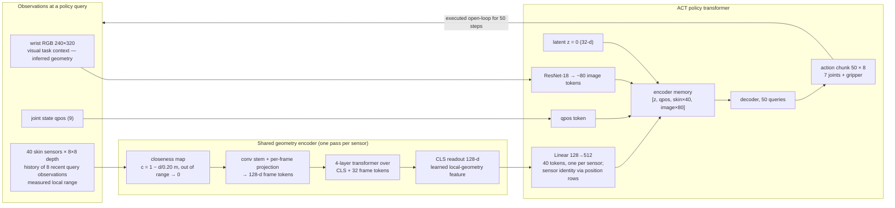
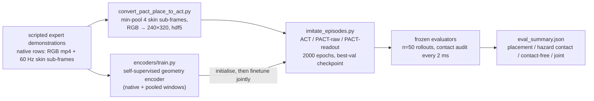

# PACT — paper reference: methods, experimental design, results

Facts only. Every number below was re-derived from disk or code on 2026-09-20 (three read-only
audits: results vs `episodes.jsonl` / summary JSONs; model and training vs code and checkpoints;
system, data and evaluator vs XML, configs and scripts). All results-table counts matched disk.
The earlier narrative version of this file is in git: `git show 656acc0:PAPER.md`.

**Arms.** ACT = baseline (cameras + joint state). PACT-raw = ACT + one peak-closeness scalar per
sensor (no learned skin weights). PACT-readout = ACT + 128-d readout of a pretrained, jointly
finetuned per-sensor encoder.

**Experiment-set tags.** H-A, H-B, H-C hallway; T-1011d randomised clutter; T-107 spaced bench;
O-INV archived camera-hidden study; S sensor / encoder characterisation. Defined in §2.2. Sets
are never pooled.

Contents: **1 Methods** · **2 Experimental design** · **3 Results** · A figures · B glossary.

---

## 1. Methods

### 1.1 System overview

**One policy query** (every 50 control steps, 3.3 s at the 66 ms step):

**Data and evaluation flow:**

### 1.2 Robot, sensors, cameras, control

**Robot and actuation** (`assets/robots/franka_skin/model_hybrid.xml`): Franka FR3 + Robotiq
2F-85; 13 joints (7 arm + 6 gripper linkage), 8 actuators. Arm: MuJoCo position servos, kp / kd
4500 / 450 (joints 1–2), 3500 / 350 (3–4), 2000 / 200 (5–7), armature 0.1, joint damping 1,
gravity compensation on. Gripper: one tendon actuator, command 0 (open) – 255 (closed), force
± 5 N. Action = 7 **absolute** joint-position targets (rad) + gripper command; demonstrations
label the gripper exactly 0 or 255. qpos = 7 arm joints + the two gripper driver joints. Actuator
noise is disabled in data generation and in evaluation.

**Sensors**: 40 MuJoCo depth cameras, `resolution="8 8"`, fovy 45° (MuJoCo default; no attribute
in the XML), links 1–6 (7 / 7 / 5 / 5 / 6 back + 4 front / 6), none on link 7 or the hand; mounted
9.0 mm off the shell (22.0 mm for the four `link5_front` sensors). Skin shell: 7 mesh bodies,
`contype 0 conaffinity 0`, mass 1e-6, visible to RGB cameras (blue, rgba 0.27 0.46 0.85).
Dedicated 8 × 8 `mujoco.Renderer` with depth rendering: metric planar-z float32 metres, skybox
off, **robot visual group disabled — the whole robot is invisible to the skin**
(`env.py:357–361`). Near clip ≈ 9–12 mm (`znear 0.001 ×` model extent; observed minimum
0.01227 m), no effective far clip, no noise. Four sub-frames per control step, 16 ms apart.
Stacking order for data and policy is `HYBRID_SKIN_SENSOR_ORDER` (link5_back before link5_front;
`submodules/act/hybrid_skin_sensors.py`); the simulator registers link5_front first, so order
must come from that constant, never from the environment. The "83 % vs 10 % directional
coverage" figure in older notes has no producing script and is not claim-ready.

**The sensors.** Forty 8×8 depth cameras with a 45° square cone, mounted 9 mm off a
non-colliding skin shell on links 1–6 (7 / 7 / 5 / 5 / 6 + 4 / 6; none on the hand). Each returns
planar depth in metres along its own axis, four sub-frames per control step (every 16 ms at
t = 16 / 32 / 48 / 64 ms inside the 66 ms step; nominally 60 Hz, effectively 60.6 Hz). Aim was
repaired by ray casting so no sensor axis points into the arm; a per-sensor check (a plate at
0.15 m must read 0.145 ± 0.012 m; the axis must point outward; no self-hit) passes 38 of 40 — the
two failures are `link5_front_sensor_1` (0.088 m) and `link5_front_sensor_2` (0.051 m); the check
was run on 2026-06-14, one day before the final robot XML was committed, and not re-run.

**What the skin renderer sees (state this in Methods).** The skin depth renderer disables the
robot's visual geom group, and collision meshes are never rendered, so **the entire robot — arm,
gripper and skin shell — is absent from skin depth**. The skin sees the environment, the bar,
clutter, the tray and the carried cup; self-occlusion and self-sensing are not modelled. There is
no range limit and no noise model in the simulator: the room is closed, so every pixel returns a
surface. Depth in the hallway data spans 0.012 m (near clip) to 3.70 m after min-pooling
(3.75 m raw); 0.26 % of raw samples are below 0.10 m and 21 of 40 sensors read below 5 cm at
some point. The 20 cm and 50 cm caps exist only in the learned front ends.

**RGB cameras** (`configs/camera_configs.py`): all rendered at 624 × 352 and resized to
320 × 240 with `cv2.INTER_AREA` (16:9 squeezed to 4:3, aspect not preserved; identical in
conversion and evaluation). `wrist_camera`: on the gripper base, pos (0.031, 0.074, 0.022) m,
fovy 56.74°. `exo_camera_1`: fixed to the robot base link (so it moves with the randomised
base), offset (−1.05, −0.55, 1.30) m, looking at (0.55, 0, 0.45), fov 58° — behind-right, whole
arm in frame. `table_camera` (T-107, v1010) is the same camera under another name. Hallway:
wrist only. T-107 / v1010: table + wrist. T-1011d / v1011c: exo + wrist. Camera order into the
policy is [exo or table, wrist]; one ResNet is shared. RGB cameras see the skin shell and the
bar; they do not see collision meshes.

**Control and physics**: policy step 66 ms (15.15 Hz); control and simulation step 2 ms;
33 control steps per policy step. MuJoCo `implicitfast` integrator, elliptic cone, impratio 10,
`noslip_iterations 4`, multi-CCD on. Horizon 800 steps = 52.8 s; 1050 steps = 69.3 s; a 50-step
chunk = 3.3 s. Demonstration horizon 900 (hallway) / 1050 (others).

**Timing at the 66 ms control step**: open-loop chunk 3.3 s; eight consecutive training
timestamps 0.462 s; eight evaluation query timestamps 23.1 s once full.

### 1.3 Tasks and scenes

**Hallway corridor pick-and-place** (scene `pact_place_corridor_v2`; dataset
`pact_place_corridor_v5`). The arm enters a fume-hood aperture 0.85 m wide and 0.70 m high,
grasps a cup on the bench, brings it back out and places it on a tray outside. A hazard bar
(11 × 48 × 18 cm, inner face 10 cm from the centreline) intrudes into the passage from the left
or right. The bar is matte and has the same RGBA as the hood walls. It enters from the side, into
the path of the wrist and link 6. It is **not** excluded from RGB rendering; the wrist camera can
see it on some approaches.

**Hallway scene** (`molmospaces-pact-place@977acd6`, `tasks/enclosure_reach.py`, scene
`pact_place_corridor_v2.xml`): room 4.5 × 4.1 × 2.8 m, bench top z 0.72, hood interior x 0.58–1.36,
|y| < 0.45; bar and hood walls share rgba (0.88, 0.89, 0.90); tray 20 × 20 cm, blue, static, two
5 cm lips, on a pedestal; three fixed lights; cup `Cup_10` (7.0 × 7.3 cm). Aperture
0.85 × 0.70 m at x 0.58; bar half-extents (0.055, 0.240, 0.090) at x 0.615, z 0.89, inner face
|y| 0.10; `Cup_10` at x 0.76, y ~ U(−0.04, 0.04), z 0.72; tray at (0.35, 0.32). Expert safe gap
0.10 m inbound / 0.14 m outbound, envelope half-width 0.11 / 0.15 m; phases inbound approach /
pass / exit / grasp, grasp_settle, outbound lift / approach / pass / exit, preplace,
placement_descent, retreat.

A scripted expert that reads the true bar pose from the scene parameters produced 152
demonstrations (72 left / 80 right; recorded retry index 0 / 1 / 2 for 109 / 34 / 9 of them; 243–634 control steps, median 480, 72,955 steps in total; stored at native length — only the
50-step action chunk is zero-padded, with a mask). Per
episode: bar side (fair coin); bar pose jitter (face ±5 mm, x ±15 mm — **in the demonstrations
only; the evaluator places the bar at its nominal pose**); cup y ~ U(−4, 4) cm at x 0.76 plus
±1.5 cm x / y jitter, random yaw and a settle (observed x 0.745–0.775, y −0.051–0.053 m); robot
base x ∈ [0.12, 0.19] m, y ∈ [−0.05, 0.05] m, yaw ∈ [−0.20, 0.20] rad (±11.5°); initial arm pose
`[0, −0.785, 0, −2.356, 0, 1.571, 0]` rad plus uniform per-joint noise growing from ±0.025 rad
(joint 1) to ±0.175 rad (joint 7). The same base and arm-pose randomisation applies to every
dataset and to evaluation. No texture or lighting randomisation. Observation: wrist RGB (624×352 → 240×320), 9 joint values, 40 × 8×8 depth
(min over four sub-frames). Action: 7 joint targets + binary gripper. The expert's oracle
geometry is not an input; the policy must learn clearance from sensors.

**Randomised-clutter variant (T-1011d; dataset `pact_pick_n_place_v2/v1011d`).** Same
pick-and-place through the aperture with the side-entering bar, plus bench clutter whose
positions are redrawn every episode. Six clutter bodies: two vessels (slots 01, 06), two plates
(slots 03, 04) and two objects on a ring around the cup (slots 08, 09; 22 cm radius, ±65°).
Palette, shapes and heights are fixed; only centres move. Vessel 01 is drawn from a 9 × 11 cm
box, vessel 06 from 5.5 × 10 cm, each plate from 32 × 64 cm. Every draw is rejection-sampled
(up to 96 candidates): it must stay inside the bench shell, clear every placed body and the
cup, and — for slot 01, which sits on the route — keep both registered route predicates true,
so a collision-free path always exists. Unlike the hallway, the **cup ranges over the full bench
width**: y ~ U(−0.375, 0.375) m at x ≈ 0.70 (observed −0.368–0.361 m), so the task also demands
far more reaching than the hallway's ±4 cm. Episodes cycle a fixed grid of 24 cells = 4 clutter
layout families (target-side, inner-panel, outer-panel, aperture-side stagger; they set the
nominal vessel seats) × 2 bar sides × 3 lateral offsets (−5 / 0 / +5 mm: `neg5`, `center`, `pos5`)
of a static overhead pendant fixture (two 2 × 2 × 6 cm lobes on stems hanging at z ≈ 1.01 m
above the bench; contact with it is classed `mounted_fixture`); the seed draws everything else
inside the cell. Clutter bodies: 01 a 9 cm × 32.6 cm primitive cylinder, 03 / 04 plates, 06 a
soap bottle, 08 a primitive cylinder, 09 a primitive box. 200 scripted demonstrations kept from 777 attempts (100 left / 100 right, 176–559 steps,
median 406, 8–9 per cell), two policy cameras
(`exo_camera_1` + `wrist_camera`), same 40-sensor skin, same observation and action spaces as
the hallway. Same three arms, same recipe (§1.6), seed 0. Evaluation can shrink the clutter
boxes toward their nominal seats (`--clutter_xy_scale`; 1 = training distribution, 0.25 = the
"easy" setting used for the three-arm table in §3.3).

**Spaced bench (T-107; dataset `pact_place_corridor_v107_spaced`).** Same aperture, bar, tray and
24-cell grid (4 layout families × 2 bar sides × 3 pendant offsets; scene files
`pact_place_corridor_v10_7_{neg5,center,pos5}.xml`) with household-object bench clutter. 210 demonstrations
kept from 288 attempts (111 left / 99 right, 322–615 steps, median 505). Cameras `table_camera` +
`wrist_camera`. Horizon 1050.

**Trained but not evaluated** (no evaluator exists; `eval_act.py --task v1010|mixed` exits "not
wired"): `pact_place_corridor_v1010` (four household objects: two soap bottles, two plates;
215 demonstrations from 499 attempts; table + wrist; 3 arms × 2 seeds) and
`pact_place_corridor_v10_11c_100` (the six V10.11d clutter bodies at fixed seats; 99 demonstrations; exo +
wrist; 3 arms × 1 seed).

### 1.4 Demonstrations and data

**Scripted expert** (`tasks/enclosure_reach.py`, `PactPlaceCorridorPolicy`): privileged — reads
the bar AABB and true cup pose; Cartesian TCP waypoints solved to joint targets by IK; no
re-planning after rollout start. Inbound safe gap 0.10 m (envelope half-width 0.11 m), outbound
0.14 m (0.15 m); pass speed 0.045 m/s; grasp pitch 50°; release clearance 5 mm. All kept
demonstrations deflect around the bar both inbound and outbound. A demonstration is kept only if
it is "clean": task success and zero hazard / environment / clutter / fixture contact (the
converter keeps rows flagged clean; the collection runners themselves ran on another machine and
are not in this repo). Kept / attempted: v107 210 / 288, v1010 215 / 499, v1011d 200 / 777,
v1011c 99 / 481; hallway 152 (attempt count not recorded). Counts and jitter ranges marked
"observed" in §1.3 were read from the raw recordings on an external mount
(`/mnt/laptop/data`), not from this repo.

**Datasets**

| dataset | demos | sides L / R | episode steps (min–max, median; total) | train / val split (val L / R) | cameras | action / qpos |
|---|---|---|---|---|---|---|
| `pact_place_corridor_v5` (hallway) | 152 | 72 / 80 | 243–634, 480; 72,955 | 121 / 31 (18 / 13) | wrist | 8 / 9 |
| `pact_place_corridor_v107_spaced` | 210 | 111 / 99 | 322–615, 505; 103,549 | 168 / 42 (18 / 24) | table + wrist | 8 / 9 |
| `pact_pick_n_place_v2/v1011d` | 200 | 100 / 100 | 176–559, 406; 77,853 | 160 / 40 (23 / 17) | exo + wrist | 8 / 9 |
| `pact_place_corridor_v1010` | 215 | 107 / 108 | 328–633, 479; 106,042 | 172 / 43 (22 / 21) | table + wrist | 8 / 9 |
| `pact_place_corridor_v10_11c_100` | 99 | 49 / 50 | 176–546, 368; 37,871 | 79 / 20 (13 / 7) | exo + wrist | 8 / 9 |

Converted hdf5 under `act_style_data/`; images 240 × 320 × 3 uint8; skin is the min over the four
sub-frames of each control step; episodes stored at native length. The raw `data/` recordings
are no longer on disk (the encoder split was re-checked through the `source_row` attribute).

Observation per control step: RGB (240 × 320 per camera), 9 joint values, 40 × 8 × 8 skin depth.
Action: 7 joint targets + gripper. The expert's privileged geometry is not an input to any policy.

### 1.5 Geometry encoder (PACT-readout front end)

| component | purpose | specification |
|---|---|---|
| closeness map | put "touching" at 1 and "nothing near" at 0; fold invalid pixels into the value | `c = 1 − d/0.20`, valid 5 mm–20 cm, else 0 |
| recent frames | show approach direction and rate, not just presence | 8 observations × 4 sub-frames = 32 frames (pooled frames repeated ×4) |
| conv stem | keep 8×8 spatial structure — edges, gradients — before flattening | `Conv(1→32,3)→GELU→Conv(32→32,3)→GELU`, then `Linear(2048→128)` per frame |
| transformer with CLS | pool 32 frames into one summary token | 4 pre-norm layers, d = 128, 4 heads, ff 256, dropout 0.1, sinusoidal positions |
| readout | the feature handed to ACT | CLS hidden state, 128-d, no extra projection; gradients flow during finetuning |

Pretraining is self-supervised on hallway skin recordings — no RGB, no human labels: from each
window predict the nearest valid surface point and its validity, reconstruct the latest grid,
and predict the next. One window per (episode, every 4th control step, sensor): 591,760 train / 73,040 val / 68,800
test windows, of which only 11.6 % contain a valid (5 mm–20 cm) return, so a weighted sampler
(with replacement) puts half the mass on valid windows. Each training sample is, with
probability 0.5, the native four sub-frames or the min-pooled frame repeated ×4 (the form the
policy sees); validation and test use the pooled form only, so the reported error is on
deployment-style input. Target: the nearest valid pixel of the latest frame, back-projected
through a 45° pinhole to sensor-local XYZ, scaled by 1/0.2. AdamW 3e-4, weight decay 0.01,
cosine to zero over 20 epochs, grad-clip 1.0, batch 512, seed 0; 122 / 15 / 15 episode split
stratified by bar side; checkpoint = lowest validation loss among epochs passing a validity
gate (epoch 20). 837,700 parameters, of which 801,888 form the readout path used by the policy
(conv stem 9,568, frame projection 262,272, CLS 128, transformer 529,920); the 35,812 in the
pretraining heads receive no gradient during policy training. The CLS readout is the
un-normalised residual stream (pre-norm layers, no final LayerNorm). One checkpoint initialises every readout run on every dataset. Twenty-four
of the 31 episodes that later form ACT's validation split were in this pretraining; that
concerns validation independence, not rollout results.

**Skin encoder** (`encoders/surface_geometry.py:390`, config
`experiments_output/default/surface_encoder_train/pact_place_corridor_v5/config.json`)

| item | value |
|---|---|
| closeness | `c = 1 − d/0.20`; valid 0.005 ≤ d ≤ 0.20 m, else 0 |
| frames | 32 (8 control steps × 4 sub-frames) + CLS; fixed sinusoidal positions |
| conv stem | `Conv2d(1→32,3,pad 1)→GELU→Conv2d(32→32,3,pad 1)→GELU`; `Linear(2048→128)` |
| transformer | 4 × `TransformerEncoderLayer(d=128, heads=4, ff=256, dropout 0.1, GELU, pre-norm)` |
| readout | CLS state, 128-d |
| pretrain heads | embedding 32-d; XYZ + validity; 8×8 reconstruction; future frame |
| pretrain loss | 1.0·BCE(valid) + 5·MSE(xyz/0.2) + recon (depth MSE with pixel weight `1 + 10·foreground`, + 0.1·occupancy BCE) + 0.5·future (same form, min-pooled t+1 frame) |
| pretrain optimiser | AdamW 3e-4, wd 0.01, cosine, grad-clip 1.0, batch 512, 20 epochs, seed 0 |
| pretrain data | 122 / 15 / 15 episodes; 591,760 train windows; mixed native / pooled inputs; validity-balanced sampling |
| test | XYZ endpoint error 20.62 mm (valid targets); validity F1 1.0; recon P / R 0.874 / 0.953 |
| parameters | 837,700; checkpoint sha256 `cec5cb8e…` |

Held-out test (pooled, deployment-style input; only 11.8 % of held-out windows have a valid
target): nearest-surface XYZ endpoint error 20.62 mm on valid targets; validity F1 / precision /
recall 1.0 at threshold 0.5; 8 × 8 reconstruction precision / recall 0.874 / 0.953; future-frame
0.858 / 0.954; validation at the selected epoch 19.72 mm. This measures the encoder's geometry
regression; it is not sensor accuracy or robot clearance error.

### 1.6 Policy: ACT and proximity fusion

- Each 128-d readout passes through one shared `Linear(128 → 512)` to become a token.
- A learned position embedding with `2 + 40` rows (latent z, qpos, one per sensor) is added.
  This is the only place sensor identity lives; the encoder is sensor-agnostic.
- Encoder memory: `[z, qpos, skin₁ … skin₄₀, image tokens]` (≈ 80 image tokens per camera).
- Proximity off ⇒ bit-identical to vanilla ACT.

ACT: ResNet-18 backbone (ImageNet, frozen BatchNorm, one backbone shared across cameras),
hidden 512, feed-forward 3200, 4 encoder / 7 decoder layers, 8 heads, chunk 50, CVAE latent 32
(training only; z = 0 at test), loss = masked L1 + 10 × KL, AdamW 1e-5 for policy, backbone and
skin encoder alike, weight decay 1e-4, batch 8, 2000 epochs, best-validation checkpoint on a
121 / 31 split (seed 1; normalisation over all episodes). No image or proximity dropout and no
blur in any run reported. Exact tables follow.

*Training details.*

- **Steps.** One "epoch" draws one random timestep per training episode. Hallway: 121 samples →
  16 iterations → 32,000 gradient steps in 2000 epochs (v1011d 40,000; v107 42,000; v1010
  44,000; v1011c 20,000). Constant learning rate; no warm-up, schedule, gradient clipping, AMP
  or EMA; weight decay on all parameters.
- **Loss.** `mean(|â − a| · not_padded)` over the 50 × 8 chunk (padded entries add zero but stay
  in the denominator) + 10 × KL (summed over 32 latent dims, batch mean).
- **Checkpoint selection.** Validation also draws one random timestep per validation episode
  each epoch and uses the posterior z (from ground-truth actions), not z = 0. "Best validation"
  is therefore the minimum of 2000 noisy draws (e.g. hallway ACT s0: best 0.0589, final 0.1053).
  It is a loss criterion, not a rollout criterion, and is identical for all arms.
- **Split.** 80 / 20 by a fixed permutation (`set_seed(1)` before the split), so every arm and
  every training seed of a task shares the same split; not stratified by bar side (hallway
  validation 18 L / 13 R). The run seed controls initialisation and sampling only.
- **Normalisation.** Images /255 then ImageNet mean / std. qpos (7 arm + 2 finger) and action
  (7 joint targets + gripper stored as 0 / 255) are z-scored over all episodes with std ≥ 0.01;
  the gripper dimension is regressed like a joint and snapped at 127.5 at evaluation.
- **No augmentation** of any kind. Dropout 0.1 is active in ACT and in the skin encoder during
  finetuning; the encoder has LayerNorm only; ResNet BatchNorm is frozen, all ResNet layers train.
- **Decoder depth (upstream ACT behaviour).** Seven decoder layers are instantiated but the
  model reads the output of the *first* decoder layer (`return_intermediate_dec=True`, index 0);
  layers 1–6 are bit-identical between epoch 0 and the best checkpoint in all arms. Effective
  policy: 4 encoder layers + 1 decoder layer; 32.3 M of the parameters never receive a gradient.
- **Train / eval image gap.** Training RGB was decoded from recorded mp4 and resized (INTER_AREA);
  evaluation RGB is rendered live and resized the same way, without codec artefacts.
- **Hardware.** One RTX 4090 (24 GB), torch 2.7.1 + cu126, Python 3.11, MuJoCo 3.6.0. A solo
  hallway run takes ≈ 55–61 min; the Sep runs shared the GPU six at a time (≈ 1 h 35–1 h 54 each).

**ACT / PACT** (`submodules/act/imitate_episodes.py`, `detr/models/detr_vae.py`)

| item | value |
|---|---|
| backbone | ResNet-18, ImageNet, FrozenBN, one backbone shared across cameras |
| transformer | hidden 512, ff 3200, enc 4 / dec 7 instantiated — **output of decoder layer 1 is used; layers 2–7 never train** (upstream ACT), 8 heads, dropout 0.1, post-norm, ReLU; image position embedding sine, 256 per axis; 240 × 320 → 8 × 10 = 80 tokens per camera |
| chunk / queries | 50 |
| CVAE | latent 32; style encoder 4-layer transformer over `[CLS, qpos, a₁…a₅₀]`; z = 0 at test |
| loss | masked L1 + 10 × KL |
| optimiser | AdamW lr 1e-5 (policy, backbone, skin encoder), wd 1e-4, batch 8, 2000 epochs |
| split | 80 / 20, fixed permutation seed 1 (hallway 121 / 31), identical for every arm and training seed; not saved in the run dir (reproduced from code); normalisation over all episodes |
| skin tokens | ACT 0 (`additional_pos_embed` 2×512); raw K = 8 → 320 (322×512); readout K = 1 → 40 (42×512) |
| parameters (trainable) | ACT 83,886,217; raw 84,058,249 (+172,032); readout 83,972,745 (+86,528) + 837,700 encoder. Receiving gradient: ACT 51,576,712 (+ the same increments). The older "83.93 / 84.10 / 84.02 M" figures were state-dict sizes including 45,824 buffer entries |
| loss | `mean(L1 · not_padded)` + 10 × KL; constant lr, no clip / schedule / AMP / EMA; one random timestep per episode per epoch |
| dropout / blur | none |

### 1.7 PACT-raw

| | PACT-raw | PACT-readout |
|---|---|---|
| feature per sensor | max over 64 pixels of `clip(1 − d/0.50)` (one scalar) | 128-d CLS readout of the geometry encoder |
| temporal input | current observation only | 8 recent observations |
| closeness cap | 50 cm | 20 cm |
| tokens in ACT | 8 per sensor → 320 | 1 per sensor → 40 |
| learned skin weights | none | pretrained, then finetuned with ACT |
| invalid pixels | d < 5 mm zeroed; beyond 50 cm → 0 | outside 5 mm–20 cm → 0 |
| how a token is formed | the scalar c passes through one shared `Linear(1 → 8·512)`, so the 8 tokens are 8 affine copies `w_k·c + b_k`; 320 learned position rows added | `Linear(128 → 512)` of the readout; 40 learned position rows added |
| added parameters vs ACT | 172,032 | 86,528 + 837,700 encoder |

### 1.8 Inference

One forward pass per 50 control steps, executed open-loop (3.3 s). Latent z = 0; gripper
snapped at the midpoint. Cameras and the forty skin renders are produced only at those queries
(about 17 per 800-step episode; "chunk-gated"). The skin history at evaluation is the last eight
*query* observations (23.1 s span once full); training windows were eight *consecutive* steps
(0.462 s). The evaluator records this as `history_mode: query_steps_train_mismatch`. Evaluation
skin is one sub-frame; training data a minimum over four.

**T-1011d history.** `eval_act_v1011d.py --history consecutive` renders
the skin on the eight *consecutive* control steps that end at each query (0.462 s, the training
window), recorded as `history_mode: consecutive_prefetch_8`. With horizon 1050 and chunk 50 that
is 21 queries and 169 skin renders per readout episode = 21 queries + 21 × 7 prefetch steps +
the reset observation (22 for raw, which uses the current observation only; 0 for ACT; field
`snapshot_renders`). RGB is still rendered only at queries. At the first query only one frame
exists and the window is left-padded by repeating it. The JSON shows the same `history_mode`
for ACT and raw, where the flag has no effect. Still one sub-frame per step (`--skin_substeps snapshot`), still
open-loop 50-step chunks, z = 0, no temporal aggregation.

**Evaluator cost and the speed patch.** A PACT episode on this evaluator took ≈ 1370 s against
≈ 115 s for ACT. A profile showed the skin renders were not the cost. Two simulator chores that
exist only when the forty skin cameras are registered were: (a) a dataset-annotation sensor that
segmentation-renders every task object through every camera on every control step (126 renders
per step), and (b) a camera-registry pose refresh of all forty skin cameras after each of the 33
physics substeps per control step (≈ 1.4 M per episode). Neither output is read by the policy,
the encoder, the success judge or the contact audit; skin depth is rendered from the simulator
camera by name, not from the registry pose. An evaluation-side patch drops (a) and computes (b)
only on read (`scripts/pact_eval_lazy_cameras.py`; `--eager_cameras --keep_export_sensors`
restores the original). Policy cameras keep the original per-substep update. Measured episodes now take
92–99 s (failed placements) and 420–770 s (successful ones; cause of the gap not profiled). The T-1011d table in §3.3
was produced on the **original** path; the patch is for iteration speed and changes no protocol
field. Since 2026-09-20 the same patch is in the hallway and T-107 evaluators (150-step check: 175 s → 5.6 s and 189 s → 15 s, first frames byte-identical, records equal up to the known ≈ 1 % contact-count drift); every H-A / H-B / H-C / T-107 number in this document predates it and was produced on the original path. Each `eval_summary.json` records which path ran (`lazy_prox_cameras`, `export_sensors_dropped`).

### 1.9 Training runs

**Training runs** (all: batch 8, chunk 50, lr 1e-5 for policy, backbone and encoder, KL 10,
2000 epochs, one RTX 4090; every readout run starts from the single hallway-pretrained encoder
`pact_surface_embedding_encoder_v1.pt`, sha256 `cec5cb8e…`, recorded in each run's
`prox_config.json` — the Aug H-A readout run points at the same file but did not record the sha;
args live only in `wandb-metadata.json`). Best = epoch of minimum validation loss; wall-clock is
inflated where runs shared the GPU.

| set | arm | seed | date | best epoch | best val | final train | wall |
|---|---|---|---|---|---|---|---|
| H-A hallway | ACT | 0 | 08-25 | 1853 | 0.0614 | 0.0724 | 55 min |
| H-A hallway | raw | 0 | 08-25 | 1916 | 0.0677 | 0.0821 | 57 min |
| H-A hallway | readout | 0 | 08-28 | 1864 | 0.0577 | 0.0851 | 61 min |
| H-B hallway | ACT | 0 / 1 | 09-10 | 1853 / 1736 | 0.0589 / 0.0566 | 0.0738 / 0.0806 | 1 h 36 / 1 h 45 |
| H-B hallway | raw | 0 / 1 | 09-10 | 1740 / 1987 | 0.0679 / 0.0659 | 0.0822 / 0.0837 | 1 h 51 / 1 h 51 |
| H-B hallway | readout | 0 / 1 | 09-10 | 1864 / 1913 | 0.0588 / 0.0576 | 0.0868 / 0.0747 | 1 h 54 / 1 h 52 |
| T-107 | ACT / raw / readout | 0 | 09-11 | 1997 / 1835 / 1799 | 0.0472 / 0.0720 / 0.0540 | 0.0551 / 0.0617 / 0.0579 | 2 h 34 / 2 h 49 / 2 h 46 |
| T-1011d | ACT / raw / readout | 0 | 09-17 | 1970 / 1979 / 1653 | 0.0776 / 0.0965 / 0.0733 | 0.0605 / 0.0753 / 0.0639 | 1 h 50 / 1 h 55 / 1 h 58 |
| T-1011d-old | raw | 0 | 09-03 | 1974 | 0.0930 | 0.0708 | 1 h 20 |
| T-1010 | ACT | 0 / 1 | 09-11 | 1973 / 1726 | 0.0508 / 0.0517 | 0.0523 / 0.0565 | 3 h 18 / 3 h 15 |
| T-1010 | raw | 0 / 1 | 09-11 | 1857 / 1734 | 0.0766 / 0.0710 | 0.0630 / 0.0646 | 3 h 45 / 3 h 46 |
| T-1010 | readout | 0 / 1 | 09-11 | 1825 / 1772 | 0.0582 / 0.0516 | 0.0569 / 0.0567 | 3 h 40 / 3 h 40 |
| T-1011c | ACT / raw / readout | 0 | 09-11 | 1679 / 1796 / 1594 | 0.0935 / 0.1295 / 0.1215 | 0.0943 / 0.0989 / 0.0972 | 1 h 35 / 1 h 52 / 1 h 48 |

### 1.10 Hardware and software

**Hardware / software**: one NVIDIA RTX 4090 (24 GB, driver 580.178), AMD Threadripper 2970WX
(48 threads), 62 GB RAM, Ubuntu 22.04.5; Python 3.11.15, torch 2.7.1 + cu126 (cuDNN 9.5.1),
torchvision 0.22.1, MuJoCo 3.6.0, numpy 2.4.3, OpenCV 4.13; EGL off-screen rendering.

---

## 2. Experimental design

### 2.1 Comparison

Three arms per set, identical recipe, identical train / validation split within a task, one
training seed per arm per set. H-B pairs ACT seed 1 with PACT seed 0. H-A and H-B were trained
separately (Aug 25–28 vs Sep 10, different code revisions) on the same dataset and split; their
PACT arms both use training seed 0 (readout best epoch 1864 in both; raw 1916 vs 1740), the ACT
arm is seed 0 in H-A and seed 1 in H-B. H-A and H-B differ fully in evaluator (legacy vs frozen),
house schedule (random vs index 1) and rollout seeds. Variation over training seeds is not
measured in any set. Hallway second-seed checkpoints (raw s1, readout s1, ACT s0) are trained;
ACT s0 has n = 2, the other two have no evaluation.

### 2.2 Experiment sets

| | H-A (historical random-house) | H-B (frozen evaluator, house 1) | H-C | T-107 (spaced bench) | T-1011d (randomised clutter) |
|---|---|---|---|---|---|
| checkpoints | Aug 25–29, one seed | Sep 10 retrain; ACT seed 1, PACT seed 0 | H-A readout ckpt | Sep 11, seed 0 | Sep 2026, seed 0, all three arms |
| evaluator | legacy `eval_act_place_corridor.py` | `eval_act.py` | `eval_act.py` | `eval_act_v107spaced.py` | `eval_act_v1011d.py` |
| rollouts | 50 | 50, seeds 2026–2075, sides matched across arms | 50, same seeds | 50, seeds 2026–2075 | 50, seeds 0–49, same seeds and cells across arms |
| scene | random house | house 1 | house 1 | 24 condition indices cycled | 24 cells cycled (`i % 24`); clutter scale 0.25 |
| horizon / chunk | 800 / 50 | 800 / 50 | 800 / 50 | 1050 / 50 | 1050 / 50 |
| cameras | wrist | wrist | wrist | table + wrist | exo + wrist |
| skin history at eval | not recorded in the JSON | 8 query-spaced | 8 query-spaced | 8 query-spaced | 8 consecutive (train-matched) |

| tag | set | evaluator / protocol | status | source |
|---|---|---|---|---|
| H-A | hallway, Aug 25–29 checkpoints, three arms, random house, n = 50 | legacy `eval_act_place_corridor.py`, `--temp_agg_off`, horizon 800 | complete | `reports/eval_summaries/place_corridor_*_n50*.json` |
| H-B | hallway, Sep 10 retrain, three arms, house 1, seeds 2026–2075, n = 50 | frozen `eval_act.py` | complete for ACT s1, raw s0, readout s0; ACT s0 n = 2 only; raw s1 and readout s1 checkpoints trained, evaluation dirs empty | `reports/eval_summaries/pact_place_corridor_v5_*.json` |
| H-C | H-A readout checkpoint on the frozen evaluator, house 1, n = 50 | frozen `eval_act.py` | complete | `reports/eval_summaries/simple_hallway_n50.json` |
| H-B-keep | H-B readout checkpoint with inference-time sensor dropout, house 1, seeds 2026–2075 | frozen `eval_act.py --sensor_keep_frac` | keep 0.75 complete (23/14/36); keep 0.5 at 6/50; keep 0.25, keep 0 and all raw cells not run | `reports/eval_summaries/pact_place_corridor_v5_PACT_READOUT_s0_bs8_cs50_lr1e-5_e2000_keep75.json` |
| T-107 | spaced bench, three arms, table + wrist, n = 50 | `eval_act_v107spaced.py`, horizon 1050 | complete | `reports/eval_summaries/pact_place_corridor_v107_spaced_*.json` |
| T-1011d | randomised clutter, exo + wrist, **three arms**, seed 0, easy scale 0.25, seeds 0–49, consecutive history, n = 50 | `eval_act_v1011d.py`, horizon 1050, original path | complete 2026-09-17: ACT 13/18/15, raw 12/3/26, readout 13/10/22 (placement / hazard / contact-free); dirs repaired 2026-09-20 to the 50 `seed == episode_idx` records (52-record originals in `*.bak_52records_20260920`) | `reports/eval_summaries/pact_pick_n_place_v2_v1011d_{ACT,PACT_RAW,PACT_READOUT}_s0_bs8_cs50_lr1e-5_e2000.json`; per-episode `eval_output/<same>/episodes.jsonl` |
| T-1011d-old | same task, PACT-raw only, Sep 3 checkpoint | `eval_act_v1011d.py`, horizon 1050 | full randomise 7/10/20, ever 10; easy 0.25 14/3/22; wrist-only 4/50 completed, 0/4 placed | `reports/eval_summaries/simple_v1011d_*.json`; `eval_output/simple_v1011d_wrist_only_n50/` |
| T-OOD | v1011d checkpoint on the four-object sampler (wrong clutter family) | historical | 0/48 at horizon 800 and 1050; `v1011d_speedcheck_n50` 0/50 with ray-based proximity | `reports/eval_summaries/pact_pick_n_place_v2_v1011d_raw_s0_n48_horizon*.json`; `eval_output/v1011d_speedcheck_n50/` |
| T-1010 / T-1011c | v1010 (215 demos; 6 checkpoints) and v10_11c_100 (99 demos; 3 checkpoints) | evaluation scripts not wired | checkpoints only | `submodules/act/ckpts/pact_place_corridor_{v1010,v10_11c_100}/` |
| O-INV | archived camera-hidden fume-hood study, three arms × three conditions, n = 50 | archived evaluator, any-contact metric | JSONs only; data and checkpoints deleted 2026-08-24 | `reports/eval_summaries/{vanilla,pact_raw,pact_trunk}_v2_*.json` |
| O-BLUR / O-AVOID / O-V1 | camera-blur ladder (225 rollouts, n = 25 cells); avoid-v1; first PACT | archived | null / failed; lessons in README §9 | `reports/eval_summaries/2026072*_blur*.json` |
| S | sensor verification, encoder evaluation, sensor-only reconstruction, reflex network | scripts + CSV | complete | `diagnostics_output/20260611_hybrid_sensor_verify/`, `experiments_output/default/surface_encoder_train/…/test_metrics.json`, `images/link6_reconstruction/` |

### 2.3 Metrics

**Metrics.** *Placement* (task completion): judged once, after the final
step (no early termination): the cup is supported by the tray — ≥ 50 % of its weight carried by
tray contact force, or a geometric on-receptacle fallback, or a previously cached supported pose
within 5 mm and 10° — and the robot is not touching the cup. (The judge also bounds tray motion
to 10 cm / 45°, but the tray is a static body, so that term never binds.) *Ever placed*: the
judge was true at any step. *Hazard contact*: any robot–bar contact pair with signed distance
≤ 0 (touching counts), audited after every 2 ms control step, not just at policy steps.
*Contact-free*: zero contact with bar, clutter, other environment (hood, bench, pedestal, walls)
and — in T-107 / T-1011d — the mounted pendant; cup and tray contacts are allowed, floor and robot
self-contact ignored; a carried cup touching clutter counts as clutter contact.
*Placement without counted collisions*: placement ∧ contact-free. *Gripper close commanded* is
intent, not a grasp. In the hallway runs contact-free is the complement of hazard contact (no
other contacts in the PACT arms; one ACT episode), so it is not an independent confirmation.

### 2.4 Seeds, scenes, matching

**Seeds and scenes.** Episode i uses seed `seed_base + i` for the sampler and all RNGs. "House 1"
in H-B / H-C is only a sampler index (the scene list is two copies of the same hallway file); the
bar side is a fair coin from the seed (22 L / 28 R for seeds 2026–2075). In T-107 / T-1011d the
cell is `i mod 24`, and a scene that fails construction (settle or placement) is redrawn with
`seed + k · 1,000,003`, up to 64 times: 13 of 50 T-1011d episodes and 33 of 50 T-107 episodes
were redrawn, identically across arms, so scenes stay matched. The hallway evaluator has no
retry. cuDNN deterministic, benchmark off.

### 2.5 Statistics

**Statistics.** Where scenarios are matched (H-B: identical seeds and sides) report the paired
exact McNemar test on discordant episodes, with unpaired Fisher alongside. H-A rows are not
scenario-matched (no seed recorded; by episode index the intrusion side differs in 24 of 50
between ACT and readout, 23 for the other two pairs; left / right counts ACT 33 / 17, raw 28 / 22,
readout 23 / 27), so Fisher only. T-107 and T-1011d are seed-, cell- and side-matched across
arms, so McNemar applies there too. Rollout uncertainty at n = 50 is
distinct from variation over training seeds, which is not measured.

- Fisher exact, two-sided, on counts of 50 (unpaired; H-A, O-INV, and alongside the paired sets).
- Exact McNemar for T-107 (seeds, cells and sides match): placement ACT vs readout 12 vs 1,
  p = 0.0034; ACT vs raw 13 vs 0, p = 0.00024; hazard contact 6 vs 4 (p = 0.75), 4 vs 5 (p = 1.0),
  6 vs 3 (p = 0.51); placement without counted collisions ACT vs readout 7 vs 2 (p = 0.18), ACT vs
  raw 7 vs 0 (p = 0.016).
- H-B sensor dropout, readout keep 1.0 vs keep 0.75: hazard contact 1 vs 6, p = 0.125; placement
  5 vs 7, p = 0.77.
- Exact McNemar (binomial on discordant pairs) for H-B, where seeds and intrusion sides match
  across arms. ACT vs readout: 11 vs 0, p = 0.00098. ACT vs raw: 8 vs 1, p = 0.039. Raw vs
  readout: 6 vs 2, p = 0.29.
- Exact McNemar for T-1011d (seeds 0–49 and cells match across arms), hazard contact: ACT vs
  readout 8 vs 0, p = 0.0078; ACT vs raw 15 vs 0, p = 0.000061; raw vs readout 1 vs 8, p = 0.039.
  Contact-free: 2 vs 9 (p = 0.065), 3 vs 14 (p = 0.013), 8 vs 4 (p = 0.39). Placement: 8 vs 8,
  6 vs 5, 5 vs 6 (all p = 1.0). Placement without counted collisions: 5 vs 7 (p = 0.77), 4 vs 6
  (p = 0.75), 5 vs 5 (p = 1.0). Unpaired Fisher on hazard contact: 0.12, 0.00039, 0.071.
- Rerun noise floor (T-1011d readout, 24 episodes × 3 runs): placement 5 / 4 / 2, hazard contact
  6 / 6 / 6, contact-free 11 / 11 / 11.
- 95 % Wilson intervals for H-A in `images/results/plot_data.json`.
- Primary comparison: hazard contact, readout vs ACT, in each hallway set. Placement and the
  raw comparisons are secondary; multiple comparisons are not corrected.

### 2.6 Evaluator implementation

**Evaluator implementation** (`eval_act.py`, `eval_act_v107spaced.py`, `eval_act_v1011d.py`):
- *Chunk gating*: the observation suite is patched so RGB, depth and skin render only on policy
  query steps; between queries cached frames are returned and only proprioception refreshes.
  Hallway: 17 renders per 800-step episode (16 queries + reset).
- *Skin at evaluation*: one frame per observation (`--skin_substeps snapshot` in every reported
  run) versus the minimum over four sub-frames in training data.
- *Contact audit*: a hook observes MuJoCo contacts after every 2 ms control step. A pair counts
  if exactly one body belongs to the robot, the other is not the floor, and distance ≤ 0. Class by
  body name: `pact_intrusion_*` hazard bar; `pact_clutter_mount_*` mounted fixture;
  `pact_clutter_*` clutter; `place_receptacle` tray; `cavity_obj_*` grasp target; anything else
  other-environment. `hit_bar` = any hazard-bar frame; `collision_free` = zero non-target entries;
  per-class frame counts, first contact step and max penetration are stored per episode.
- *Policy*: z = 0, one chunk executed open-loop, no temporal aggregation, gripper snapped at
  127.5; `gripper_close_commanded` = any 255 sent.
- *Provenance*: every summary stores checkpoint / encoder / script sha256, simulator commit
  (hallway `977acd6`; T-107 / T-1011d `4c6a215`), protocol block, package versions; since
  2026-09-20 also `lazy_prox_cameras` / `export_sensors_dropped`, and resume refuses foreign or
  duplicate records.

### 2.7 Rollout reproducibility (measured)

**Reproducibility of a rollout (measured on T-1011d, 2026-09-18).** The evaluator is seeded but
not bit-reproducible. Same code, same seed, alone on the GPU: the first RGB frame differs by one
grey level in a handful of pixels (GPU rasterisation), and open-loop 50-step chunks amplify it.
Three runs of the same 24 readout episodes (the original run and two repeats) gave placement
5 / 4 / 2, hazard contact 6 / 6 / 6, contact-free 11 / 11 / 11; per-episode contact-frame
*counts* drift ≈ 1 %. So hazard contact and contact-free are stable under rerun at this n;
placement carries about ± 3 episodes of rerun noise on top of binomial uncertainty. Two rules
follow. (1) An episode also depends on what the process ran before it (seed 8 run alone ≠ seed 8
as the ninth episode), so every n = 50 set is one uninterrupted process into a fresh output
directory — no sharding, no resume. (2) Paired tests treat "same seed" as "same initial scene",
which holds; they do not make the two rollouts noise-free.

### 2.8 Record hygiene

**Record hygiene (T-1011d).** As written on 2026-09-17, each of the three T-1011d output directories held 52 records: the
50 of the n = 50 run (`seed == episode_idx`, 0–49) plus two left by an earlier 2-episode
default-argument run (`episode_idx` 0 / 1 with seeds 2026 / 2027; both failed and hit the bar in
every arm). The evaluator's resume path loaded them into the metric list, so the original
`eval_summary.json` and the W&B runs report rates over 52. All T-1011d numbers in this document
are over the 50 records with `seed == episode_idx`. On 2026-09-20 the two lines were removed on
disk and the summaries recomputed (originals kept as `*.bak_52records_20260920`; W&B not
corrected), and all three evaluators now refuse to resume into a directory holding records from
another seed base or duplicate episodes. No rollout was rerun or altered.

### 2.9 Differences between training data and evaluation

| item | training data | evaluation |
|---|---|---|
| skin frame | minimum over four sub-frames per control step | one frame per observation (`--skin_substeps snapshot`) |
| skin history (readout) | 8 consecutive control steps (0.462 s) | H-B, H-C, T-107: last 8 *query* observations (23.1 s span once full), recorded as `query_steps_train_mismatch`; T-1011d: 8 consecutive (`consecutive_prefetch_8`); H-A: not recorded |
| hallway bar pose | jittered (face ±5 mm, x ±15 mm) | nominal pose, no jitter |
| T-1011d clutter range | full proposal boxes (scale 1) | scale 0.25 for the three-arm set |
| RGB path | decoded from recorded mp4, resized INTER_AREA | rendered live, resized INTER_AREA |
| observation rate | every control step | policy re-observes every 50 steps (3.3 s), executes the chunk open-loop |

### 2.10 Properties of the simulated setup

Simulation only; no hardware skin. The robot (arm, gripper, skin shell) is invisible to the skin
renderer: no self-occlusion or self-returns. Skin depth is noise-free with no range limit;
returns are geometric. Two of forty sensors fail the plate check. RGB is squeezed 16:9 → 4:3.
The geometry encoder was pretrained on hallway skin only and initialises every readout run on
every task; 24 of the 31 hallway ACT-validation episodes were in its pretraining split. One
training seed per arm. The camera-hidden condition in O-INV is a renderer mask, not
transparent-object sensing.

---

## 3. Results

Counts are of 50 episodes unless stated. "Placement" is terminal. "Strict" = placement ∧
contact-free. Fisher = two-sided exact on marginal counts; McNemar = exact binomial on discordant
seed-matched episodes, written "A-only vs B-only".

### 3.1 Hallway, H-A / H-B / H-C

*Historical random-house evaluation (H-A; Aug checkpoints, legacy evaluator, n = 50 each).*

| arm | hazard contact ↓ | placement ↑ | placement without counted collisions ↑ | contact-free |
|---|---|---|---|---|
| ACT | 17/50 (34 %) | 14/50 (28 %) | 13/50 | 33/50 |
| PACT-raw | 18/50 (36 %) | 21/50 (42 %) | 17/50 | 32/50 |
| **PACT-readout** | **6/50 (12 %)** | **20/50 (40 %)** | **20/50** | 44/50 |

Fisher: readout vs ACT hazard contact p = 0.016; readout vs raw p = 0.009; placement readout vs
ACT p = 0.29. No seed recorded; intrusion sides L / R: ACT 33 / 17, raw 28 / 22, readout 23 / 27.

*Frozen evaluator, house index 1, seeds 2026–2075, sides 22 L / 28 R identical across arms (H-B; Sep retrain, n = 50 each).*

| arm (training seed) | hazard contact ↓ | placement ↑ | placement without counted collisions ↑ | contact-free |
|---|---|---|---|---|
| ACT (1) | 20/50 (40 %) | 15/50 (30 %) | 12/50 | 30/50 |
| PACT-raw (0) | 13/50 (26 %) | 21/50 (42 %) | 19/50 | 37/50 |
| **PACT-readout (0)** | **9/50 (18 %)** | **21/50 (42 %)** | **19/50** | 41/50 |

Paired on identical scenarios: ACT contacted the bar in **11** scenarios where readout did not;
readout in **none** where ACT did not — exact McNemar p = 0.00098 (unpaired Fisher p = 0.027).
ACT vs raw 8 vs 1, p = 0.039 (unpaired Fisher on 20 vs 13: p = 0.20). Raw vs readout 6 vs 2,
p = 0.29 (Fisher 0.47). Placement readout vs ACT: McNemar 9 vs 15, p = 0.31; Fisher p = 0.30.
Not in the table: ever-placed 15 / 21 / 24, gripper close commanded 48 / 48 / 50.

*Second evaluation of the historical readout checkpoint (H-C; house 1, same seeds as H-B).*
Hazard contact 7/50 (14 %), placement 18/50 (36 %), ever placed 19, placement without counted
collisions 18/50, contact-free 43/50. Same checkpoint as the H-A readout row (no new training);
no ACT or raw run exists under this exact protocol other than the H-B rows.

Evidence: `reports/eval_summaries/place_corridor_{vanilla_s0_n50,raw_s0_n50,readout_s0_n50_fast}.json`;
`reports/eval_summaries/pact_place_corridor_v5_{ACT_s1,PACT_RAW_s0,PACT_READOUT_s0}_bs8_cs50_lr1e-5_e2000.json`;
`reports/eval_summaries/simple_hallway_n50.json`. H-A: in the readout arm every placement was
contact-free and every contact was the bar (0 clutter, 0 other-environment episodes). H-A and H-B
ACT each have one episode with other-environment contact, inside the bar-hit episodes.

### 3.2 Hallway sensor dropout at inference (H-B readout checkpoint)

Rule (`submodules/act/sensor_keep.py`): per link keep `k = clip(Poisson(p·n), 0, n)` sensors
chosen uniformly, new mask each episode; a dropped sensor reads 0.5 m (never 0); 40-token layout
unchanged. Same checkpoint, seeds 2026–2075 and sides as H-B.

| keep (nominal) | realised sensors kept | hazard contact | placement | strict | contact-free | status |
|---|---|---|---|---|---|---|
| 1.0 (= H-B) | 40 | 9/50 | 21/50 | 19/50 | 41/50 | complete |
| 0.75 | 28.8 ± 4.3 (range 16–38) | 14/50 | 23/50 | 22/50 | 36/50 | complete |
| 0.5 | — | — | — | — | — | stopped at 6/50 |
| 0.25, 0 | — | — | — | — | — | not run |

Keep 1.0 vs 0.75: hazard contact McNemar 1 vs 6, p = 0.125 (Fisher 0.34); placement 5 vs 7,
p = 0.77. ACT s1 (20/50) vs readout keep 0.75: hazard contact 12 vs 6, p = 0.24; placement 7 vs
15, p = 0.13. No PACT-raw dropout run exists (keep-0.75 directory empty; two 4-record smoke dirs
with duplicated episodes). Evidence:
`reports/eval_summaries/pact_place_corridor_v5_PACT_READOUT_s0_bs8_cs50_lr1e-5_e2000_keep75.json`.

### 3.3 Randomised clutter, T-1011d

Three arms, seed 0, exo + wrist, clutter scale 0.25, consecutive skin history, seeds 0–49 and
cells identical across arms, original (unpatched) evaluator path, 2026-09-17.

| arm | placement | ever placed | hazard contact | contact-free | placement without counted collisions | episodes with clutter contact | episodes with other-environment contact |
|---|---|---|---|---|---|---|---|
| ACT | 13/50 (26 %) | 13 | 18/50 (36 %) | 15/50 (30 %) | 9/50 | 26 | 15 |
| PACT-raw | 12/50 (24 %) | 12 | **3/50 (6 %)** | 26/50 (52 %) | 11/50 | 24 | 1 |
| PACT-readout | 13/50 (26 %) | 14 | 10/50 (20 %) | 22/50 (44 %) | 11/50 | 26 | 0 |

Paired exact McNemar on matched seeds (discordant episodes, first arm only vs second arm only):

| comparison | hazard contact | contact-free | placement |
|---|---|---|---|
| ACT vs PACT-readout | 8 vs 0, p = 0.0078 | 2 vs 9, p = 0.065 | 8 vs 8, p = 1.0 |
| ACT vs PACT-raw | 15 vs 0, p = 0.000061 | 3 vs 14, p = 0.013 | 6 vs 5, p = 1.0 |
| PACT-raw vs PACT-readout | 1 vs 8, p = 0.039 | 8 vs 4, p = 0.39 | 5 vs 6, p = 1.0 |

Placement without counted collisions, McNemar: ACT vs readout 5 vs 7 (p = 0.77); ACT vs raw
4 vs 6 (p = 0.75); raw vs readout 5 vs 5 (p = 1.0). Unpaired Fisher on hazard contact: ACT vs
readout 0.12; ACT vs raw 0.00039; raw vs readout 0.071. In no episode did a proximity arm hit the
bar where ACT did not. Construction redraws: 13 of 50 episodes, identical across arms.
Evidence: `reports/eval_summaries/pact_pick_n_place_v2_v1011d_{ACT,PACT_RAW,PACT_READOUT}_s0_bs8_cs50_lr1e-5_e2000.json`;
per-episode `eval_output/<same>/episodes.jsonl`.

Same task, older PACT-raw checkpoint (Sep 3), query-spaced history: clutter scale 1 (full
randomisation) placement 7/50, ever 10, hazard contact 10/50, contact-free 20/50; scale 0.25
14/50, 3/50, 22/50; wrist-only ablation stopped at 4/50 (0 placed). No three-arm run at scale 1.
Evidence: `reports/eval_summaries/simple_v1011d_*.json`.

### 3.4 Spaced bench, T-107

Three arms, seed 0, table + wrist, query-spaced skin history, seeds 2026–2075, cells and sides
identical across arms, horizon 1050. Construction redraws: 33 of 50 episodes, identical across arms.

| arm | placement | ever placed | placement without counted collisions | hazard contact | contact-free | episodes with clutter contact | gripper close commanded |
|---|---|---|---|---|---|---|---|
| ACT | 13/50 (26 %) | 14 | 7/50 | 8/50 | 19/50 | 26 | 50 |
| PACT-raw | 0/50 | 0 | 0/50 | 9/50 | 19/50 | 28 | 42 |
| PACT-readout | 2/50 (4 %) | 3 | 2/50 | 6/50 | 20/50 | 28 | 50 |

Seeds (2026–2075), cells and intrusion sides are identical across the three arms, so paired
tests apply. Placement: ACT vs readout 12 vs 1 discordant, McNemar p = 0.0034 (Fisher 0.004);
ACT vs raw 13 vs 0, p = 0.00024. Hazard contact: ACT vs readout 6 vs 4, p = 0.75; ACT vs raw
4 vs 5, p = 1.0; raw vs readout 6 vs 3, p = 0.51. Contact-free: 10 vs 11 and 11 vs 11, p = 1.0.

Placement without counted collisions, McNemar: ACT vs readout 7 vs 2 (p = 0.18); ACT vs raw
7 vs 0 (p = 0.016). Unpaired Fisher, placement readout vs ACT: p = 0.004. Other-environment
contact episodes 1 / 1 / 0; no mounted-fixture contact in any arm.
Evidence: `reports/eval_summaries/pact_place_corridor_v107_spaced_{ACT,PACT_RAW,PACT_READOUT}_s0_bs8_cs50_lr1e-5_e2000.json`.

### 3.5 Archived camera-hidden study, O-INV

Earlier fume-hood pick task; bar absent, visible, or camera-hidden (excluded from the policy's
RGB rendering, retained in skin rendering and collision physics; implementation
`env.py:352`, `tasks/enclosure_reach.py:1175`). Metric: any robot–environment contact (not
hazard-specific; includes hood brushing). Horizon 200, house 1, n = 50 per cell. The proximity arm
is an older PACT-raw design. Surviving JSONs record horizon, house, sampler and n only; the
demonstration count (105), chunk size (100) and token layout (global 40-vector, 8 tokens) come
from README prose and cannot be re-verified; data and checkpoints were deleted 2026-08-24.

| condition | ACT contacts | PACT-raw contacts | observed difference | task success ACT / raw |
|---|---|---|---|---|
| no bar | 30/50 (60 %) | 29/50 (58 %) | 2 points | 11 / 9 |
| visible bar | 32/50 (64 %) | 25/50 (50 %) | 14 points | 14 / 8 |
| **camera-hidden bar** | **33/50 (66 %)** | **20/50 (40 %)** | **26 points** | 18 / 15 |

Camera-hidden Fisher p = 0.016 (visible-bar p = 0.23, no-bar p = 1.0). Success differences are
not significant (p = 0.80 / 0.23 / 0.67); that does not establish equivalence.

Contacts, Fisher ACT vs raw: camera-hidden p = 0.016; visible p = 0.23; no bar p = 1.0. Success,
Fisher: 0.80 / 0.23 / 0.67. Third archived arm `pact_trunk` (ACT + frozen trunk embedding of a
separately trained reflex safety-CVAE; weights deleted): contacts 32 / 29 / 36 of 50 (no bar /
visible / hidden), success 17 / 16 / 17.
Evidence: `reports/eval_summaries/{vanilla,pact_raw,pact_trunk}_v2_{free,visible,invisible}.json`.

### 3.6 Rerun noise

T-1011d readout, episodes 0–23, three runs of the same seeds (the original run and two repeats
on the fast path): placement 5 / 4 / 2; hazard contact 6 / 6 / 6; contact-free 11 / 11 / 11;
per-episode contact-frame counts drift ≈ 1 %. Evidence: `eval_output/_ab_lazy24_{a,b}/`.

### 3.7 Evaluator speed patch check (not a result about the policy)

PACT-readout, same seeds, original vs patched path. T-1011d, 2 episodes × 1050 steps: 1363–1378 s
vs 92–99 s per episode; outcome fields equal. Hallway, 1 × 150 steps: 175.2 s vs 5.6 s; first
frame byte-identical; records equal except a contact-frame count (5628 vs 5667). T-107,
1 × 150 steps: 189.3 s vs 14.9 s; first frame byte-identical; records identical. All numbers in
§3.1–3.5 were produced on the original path.

### 3.8 Out-of-distribution check

v1011d PACT-raw checkpoint evaluated on the four-object (V10.10) sampler: 0/48 placement at
horizon 800 and at 1050; ray-based proximity speed check 0/50.
Evidence: `reports/eval_summaries/pact_pick_n_place_v2_v1011d_raw_s0_n48_horizon*.json`.

### 3.9 Runs not done

| run | set | why | status |
|---|---|---|---|
| hallway ACT s0 n = 50 | H-B | seed-matched baseline for the s0 PACT arms | n = 2 only |
| hallway PACT-raw s1, PACT-readout s1 n = 50 | H-B | second training seed | checkpoints trained; evaluation dirs empty |
| hallway readout `--history consecutive` n = 50 | H-B | remove the history mismatch | not run |
| hallway sensor dropout: readout keep 0.5 / 0.25 / 0, raw keep 0.75 / 0.5 / 0.25 / 0, n = 50 each | H-B-keep | inference-time dependence on the skin; keep 0 is the mandatory control | readout keep 0.75 done; keep 0.5 at 6/50; rest not run. ≈ 1 h per cell on the fast path (`SENSOR_KEEP_FRACS="0.5 0.25 0" EXP=PACT_READOUT ./scripts/exp/eval_v1_hallway.sh`; the partial keep50 dir must be moved aside first — no resume) |
| v1010 (3 arms × 2 seeds), v1011c (3 arms) | T-1010 / T-1011c | further task families | checkpoints only; evaluators unwired |
| v1011d three arms, full randomise (`--clutter_xy_scale 1`) n = 50 | T-1011d | the easy-scale table is optimistic vs the training distribution | checkpoints trained; not run. ≈ 2 h per PACT arm on the fast path |
| v1011d three arms, easy scale, fast-path repeat n = 50 | T-1011d | rerun noise at full n; confirms the fast path on paper seeds | not run |
| v1011d wrist-only n = 50 | T-1011d | wrist-only ablation | 4/50 completed |

---

## Appendix A. Figures and assets

| use | file |
|---|---|
| Figure 1 teaser (scripted v1011d demo frame) | `images/first_page/first_page{,_labelled,_no_text}.{png,pdf,svg}`; notes `images/first_page/figure_notes.txt` |
| robot renders | `images/robot/fr3_{side,three_quarter,opposite,no_skin}_2400.png` |
| sensor placement, single-sensor cone | `images/sensors/{sensor_locations,forearm_sensor_locations,single_sensor_field_of_view}_2400.png` |
| skin shells | `images/skin/{skin_shells_isolated,forearm_skin_detail}_2400.png` |
| hallway scene | `images/environments/hallway_scene_2400.png`, `hallway_views.png` |
| sensor-only link-6 reconstruction | `images/link6_reconstruction/link6_{hood_scan,obstacle_detail,snapshot_384}.{png,pdf,svg}` |
| H-A result bars with Wilson CIs | `images/results/historical_hallway_{place_success,bar_hits,collision_free}.{png,svg,pdf}` |
| O-INV panels | `reports/2026-08-14/01_main_result.png`, `02_graded_benefit.png` |
| v1011d filmstrip | `images/tasks/v1011d_ep{010,022}_*.png` |
| system overview and readout architecture (labelled / unlabelled; Canva source) | `images/system_diagram/{system_overview,system_overview_unlabelled,readout_architecture}.{png,pdf,svg}`; caption `images/system_diagram/caption.txt`; builders `scripts/build_system_diagram.py`, `scripts/render_system_diagram.py` |
| whole-body sensing examples (cabinet cavity, fume-hood clutter, kitchen items; collision pair, contact dynamics, motion sequences, sensor-guard point cloud) | `images/whole_body/` (index `images/whole_body/index.html`); builders `scripts/export_whole_body_examples.py`, `scripts/export_kitchen_*.py`, `scripts/export_sensor_guard_pointcloud.py`, `scripts/package_whole_body_figure.py` |
| table occlusion pair (table with / without robot; lowered-robot link-6 sensor views with RGB, depth, 8×8 readout) | `images/table_occlusion/`; builders `scripts/export_table_occlusion_pair.py`, `scripts/export_lowered_sensor_views.py`, `scripts/export_sensor_modalities.py` || June sensor characterisation | `experiments_output/v4/figures/*.png` |

Rebuild: `python scripts/build_paper_images.py` (H-A bars only; H-B bars are not scripted).

## Appendix B. Glossary

| term | meaning here |
|---|---|
| ACT | Action Chunking Transformer; predicts 50 future actions from cameras + joint state |
| PACT | Proximity-Aware ACT: ACT plus per-sensor proximity tokens |
| PACT-raw | proximity token = one peak-closeness scalar per sensor, no learned skin weights |
| PACT-readout | proximity token = 128-d CLS readout of the geometry encoder, finetuned with ACT |
| readout / CLS | the summary token at position 0 of a transformer |
| closeness | 1 − distance / cap; 1 = touching, 0 = nothing in range |
| chunk | the 50 actions predicted at once and executed open-loop |
| CVAE latent z | 32-d style variable used in training; zero at test |
| placement | task completion judged at the final step |
| hazard contact / bar hit | any physics contact between robot and hazard bar |
| contact-free | no contact with bar, clutter or other environment bodies |
| placement without counted collisions | placement ∧ contact-free |
| camera-hidden | excluded from the policy's RGB rendering, retained in proximity rendering and physics |
| house | one scene layout; H-B and H-C use house 1; T-107 cycles 24 condition indices |
| chunk-gated | render cameras and skin only at policy queries |
