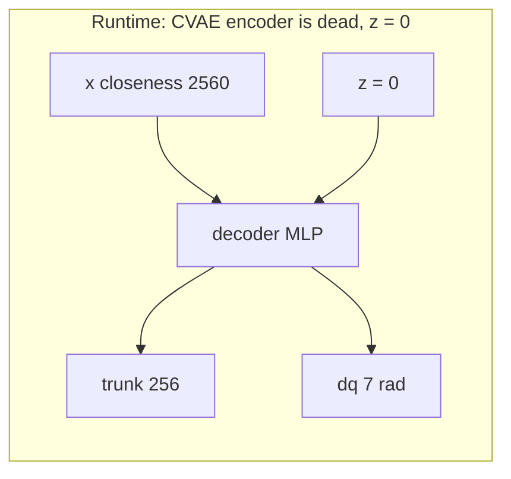

# prox_learning — proximity-skin sensing & safety for the Franka FR3

A Franka FR3 wearing **40 proximity sensors** in MuJoCo, plus the policies and analysis that
answer one question: *does a proximity skin make a robot arm safer than cameras alone?*

<p align="center">
  <a href="experiments_output/default/environment_viz/FrankaSkinCabinetCavitySmokeConfig/cabinet_cavity_house_0/sample_00/01_robot_scene.png">
    
  </a>
</p>
<p align="center">
  <sub>Canonical 40-sensor hybrid skin in a cabinet-cavity task — three automatically selected, text-free views.</sub>
</p>

**Current answer (2026-09-03, hallway n=50 — the live paper MVP):** yes. On pick-and-place
corridor v5, cameras-only ACT places in **28%** of rollouts, hits the bar in **34%**, and is
collision-free in **66%**. The same policy with a finetuned 128-d CLS skin token
(**PACT-readout**) places in **40%**, hits the bar in **12%**, and is collision-free in **88%**.
Better on **both** axes versus ACT. Bar-hit / collision-free vs ACT: Fisher p = **0.016**; vs
PACT-raw (36% bar / 64% free) p = **0.009**. Frozen peak-closeness (**PACT-raw**) does **not**
cut hallway bar hits (36% vs 34%) and places at 42% (tied with readout). The 2026-07-05
invisible-cell 66%→40% grid is archived and wiped; it is not this checkout's reproducible result.

This file is the whole project document: what we built, what the numbers say, what you may claim,
how to run every experiment, and what will bite you. Figures with PNGs from the 2026-08-14 weekly
writeup live in [`reports/2026-08-14/report.md`](reports/2026-08-14/report.md). Agent protocol is
[`CLAUDE.md`](CLAUDE.md); session log is [`CURSOR.md`](CURSOR.md).

---

## Contents

1. [Now — disk truth, 2026-09-03](#1-now--disk-truth-2026-09-03)
2. [Routing table — "I want to…"](#2-routing-table--i-want-to)
3. [Setup](#3-setup)
4. [How to run](#4-how-to-run) — v1011d train/eval walkthrough: [§4.17](#417-new-clones-2026-09-03--not-act-ready)
5. [What this is](#5-what-this-is)
6. [Headline result](#6-headline-result)
7. [Every experiment, one line](#7-every-experiment-one-line)
8. [Paper claims](#8-paper-claims)
9. [Failed / retracted](#9-failed--retracted)
10. [Method](#10-method)
11. [Repo map](#11-repo-map)
12. [Recipe detail](#12-recipe-detail)
13. [Every number in one place](#13-every-number-in-one-place)
14. [Traps](#14-traps)
15. [Decision log](#15-decision-log)
16. [Housekeeping](#16-housekeeping)

---

<a id="1-now--disk-truth-2026-09-03"></a>
<a id="1-now--disk-truth-2026-08-27"></a>
## 1. Now — disk truth, 2026-09-03

| Item | Status |
|---|---|
| **Hallway PACT-readout n=50** (place 40%, collision-free 88%, bar 12%) | **The live paper MVP.** Reproducible from this checkout. Ckpt `20260828_003136_pact_place_corridor_readout_s0`. Eval `eval_output/place_corridor_readout_s0_n50_fast/` (gitignored) and `reports/eval_summaries/place_corridor_readout_s0_n50_fast.json`. vs ACT: place **28%→40%**, bar **34%→12%** (p = 0.016), collision-free **66%→88%**. vs PACT-raw: place 42% vs 40%, bar **36%→12%** (p = 0.009). Report both axes. [§4.4](#44-live--corridor-skin-fire--compress-skin) [§6](#6-headline-result) |
| Hallway ACT vs PACT-raw n=50 | **Done. Control, not the MVP.** Place 28% vs 42% (p = 0.21); bar 34% vs 36% (p = 1.0). Raw closeness does not cut hallway bar hits. n=20 smoke was luck. |
| Archived 66% → 40% (invisible-cell, 2026-07-05) | **Wiped.** Source datagen + `obstacle_prox_v2` + July ckpts gone 2026-08-24. Metrics only in `reports/eval_summaries/`. Not retrainable here. Do not mix with the hallway MVP. |
| **New HF clones (v1010 / v12 / mixed v10.11c / …)** | **Viz except v1011d.** v1011d: convert + train **done**. Smoke n=2 eval **done** (0/2 place; not a result). Next: `--spread_cells` n=48. Do **not** throw raw clones at `imitate_episodes.py`. [§4.17](#417-new-clones-2026-09-03--not-act-ready). |
| Gate-bar v3.1 collect | **Parked.** Only `assets/datagen/hybrid_gate_bar_check` (and clutter check). Do not collect 200 until the Visible check shows a tall pole in the doorway and an ~18 cm veer. |
| Surface-embedding bake into ACT | **Parked** as an ablation. Compressor gate passed (20.6 mm XYZ). Do not bake 32-d HDF5 tokens. |
| Surface readout finetune | **Done. This is the paper arm.** Unfreeze the pretrained geometry net. ACT sees 128-d CLS readout tokens at train and eval. `--finetune_prox_encoder`. n=50 numbers above. |
| Safety-CVAE `cvae_v3/model.pt` | **Deleted 2026-08-24.** PACT-raw never needed it. Retrain from `assets/safety/sweep_v3.h5` if you want the reflex demos. `--prox_feature trunk` / `delta` need those weights and are negative controls. |
| Live training set | **Paper:** `act_style_data/pact_place_corridor_v5` (152 eps, wrist). **v1011d:** `act_style_data/pact_pick_n_place_v2/data/v1011d` (200 eps, exo+wrist). Train done `20260903_171108_pact_pick_n_place_v2_v1011d_s0`. Smoke n=2 in `eval_output/pact_pick_n_place_v2_v1011d_raw_s0_n2/`. Real eval still missing: `--spread_cells` n=48 ([§4.17](#417-new-clones-2026-09-03--not-act-ready)). |

Proximity is redundant when vision already explains the demonstration. On this hallway, frozen
peak-closeness (**PACT-raw**) is not enough. Finetuning the surface encoder and feeding live
CLS tokens (**PACT-readout**) is. The wiped invisible-cell grid was a different task. New
tabletop clones (cluttered place, table cam) are not yet on the train/eval pipe.

---

<a id="2-routing-table--i-want-to"></a>
## 2. Routing table — "I want to…"

| I want to… | jump |
|---|---|
| run anything | [§3 Setup](#3-setup) then [§4 How to run](#4-how-to-run) |
| train v1011d PACT (exo+wrist hdf5) | [§4.17](#417-new-clones-2026-09-03--not-act-ready) |
| eval v1011d ckpt (what it means + commands) | [§4.17](#417-new-clones-2026-09-03--not-act-ready) |
| walk convert → train → eval (skeptic) | [§4.17](#417-new-clones-2026-09-03--not-act-ready) |
| cite the hallway paper MVP (readout n=50) | [§4.4](#44-live--corridor-skin-fire--compress-skin) [§6](#6-headline-result) [§8](#8-paper-claims) |
| reproduce hallway ACT vs PACT | [§4.3](#43-live--hallway-act-vs-pact) |
| run Amine's 40-row place protocol on local ckpts | [§4.3.1](#431-live--amine-40-row-place-protocol) |
| finetune the skin encoder into ACT | [§4.4](#44-live--corridor-skin-fire--compress-skin) |
| collect the next obstacle set (gate-bar) | [§4.7](#47-parked--gate-bar-v31) |
| understand the live MVP / archived 66% → 40% | [§6](#6-headline-result) |
| see every test in one line | [§7](#7-every-experiment-one-line) |
| paste a paper-writing brief | [§8](#8-paper-claims) |
| know the tensors | [§10](#10-method) |
| inspect a scene before collecting | [§4.2](#42-live--inspect-scenes) |
| visualize a cloned h5 folder | [§4.2.1](#421-live--visualize-a-dataset-folder) |
| browse every viz as a dashboard | [§4.2.1](#421-live--visualize-a-dataset-folder) |
| free disk | [§16](#16-housekeeping) |

---

<a id="3-setup"></a>
## 3. Setup

```bash
conda activate mlspaces
cd /home/jaydv/code/prox_learning
export OMP_NUM_THREADS=2 MUJOCO_GL=egl PYOPENGL_PLATFORM=egl
```

Prefix every render / datagen / train / eval command with that EGL pair. One GPU. Eval is
**serial** (one arm, one cell at a time).

`~/.bashrc` exports `MLSPACES_ASSETS_DIR=/home/jaydv/code/prox_learning/assets`. This repo's
`assets/` **is** the MolmoSpaces asset root. Datagen output lands here.
`assets/{scenes,objects,grasps,test_data,benchmarks}` are symlink farms into
`~/.cache/molmo-spaces-resources/`.

`pyproject.toml` is **not installed**. It declares an empty package — scripts plus assets. The
`mlspaces` conda env supplies dependencies. Scripts import siblings via `sys.path.insert`.

One-time extras `mlspaces` is missing for ACT:

```bash
pip install ipython
pip install wandb && wandb login    # --no_wandb opts out
```

Sanity:

```bash
conda activate mlspaces
cd /home/jaydv/code/prox_learning
python -m encoders                                          # names + dummy-tensor shapes
python -m pytest tests/test_encoders.py tests/test_prox_raw.py tests/test_convert_pact_place.py tests/test_eval_pact_pick_n_place.py
```

Never `python imitate_episodes.py --eval` on a PACT checkpoint. That path calls
`policy(qpos, image)` with no skin and now `SystemExit`s if `--use_proximity` is set. Real eval is
`eval_act_obstacle.py`, `eval_act_place_corridor.py` (hallway v5), or
`eval_act_pact_pick_n_place.py` (v1011d).

---

<a id="4-how-to-run"></a>
## 4. How to run

Shared flags first. Then copy-paste per experiment. Each block is marked **live** (data on this
disk), **parked** (commands ready; do not skip preflight), or **needs datagen** (source wiped;
collect or restore first). New HF clones under `data/` (v12, v1010, mixed v10.11c, …) are
**viz-only** except v1011d, which is convert + train + eval ([§4.17](#417-new-clones-2026-09-03--not-act-ready)). Do not start
from [§4.3](#43-live--hallway-act-vs-pact) and swap the folder.

### 4.0 Shared ACT train / eval / stats

From `submodules/act`:

```bash
conda activate mlspaces
cd /home/jaydv/code/prox_learning/submodules/act
export PYTHONPATH="$PWD:$PYTHONPATH"
export OMP_NUM_THREADS=2 MUJOCO_GL=egl PYOPENGL_PLATFORM=egl

python imitate_episodes.py --task_name <TASK> --policy_class ACT --ckpt_dir ckpts \
    --kl_weight 10 --chunk_size <50|100> --hidden_dim 512 --dim_feedforward 3200 \
    --batch_size 8 --lr 1e-5 --seed 0 --num_epochs 2000 --wandb_run_name <name>
# PACT: add  --use_proximity --prox_feature raw --prox_layout per_sensor
```

CLI default is `--prox_feature raw` and `--prox_layout per_sensor`. **Train `raw`.** `trunk` /
`delta` are negative controls and need deleted CVAE weights.

Obstacle eval (fumehood pick, three cells):

```bash
python eval_act_obstacle.py \
    --ckpt_dir ckpts/<task>/<dated>_<run> \
    --output_dir /home/jaydv/code/prox_learning/eval_output/<run>_<cell> \
    --num_rollouts 50 --chunk_size <50|100> --temp_agg_off \
    --eval_cell <visible|invisible|free>
# gate-bar ckpts also need:  --eval_sampler gate
```

`--eval_cell` pins every rollout:

| cell | bar present | cameras see bar | skin feels bar | what it tests |
|---|---|---|---|---|
| `visible` | yes | yes | yes | ordinary case |
| `invisible` | yes | **no** | yes | **causal / paper cell** |
| `free` | no | — | — | background brushing; statue check |

Invisible bar = MuJoCo geom group 4: camera renderer skips it, skin renderer includes it. Physics
is unchanged.

Stats (you type counts; it reads no files):

```bash
cd /home/jaydv/code/prox_learning
python scripts/compare_pact.py vanilla=<S>/50,<C>/50 pact_raw=<S>/50,<C>/50
```

Floor for any claim: **n = 50**. n = 25 is inside a measured ±40-point noise band. Always report
**strict success** (task done **and** contact-free) next to collisions. A low collision rate can
mean "broken" (barely moves), not "careful."

### 4.1 Live — tests

```bash
conda activate mlspaces
cd /home/jaydv/code/prox_learning
python -m pytest tests/test_encoders.py tests/test_prox_raw.py tests/test_convert_pact_place.py tests/test_eval_pact_pick_n_place.py
```

<a id="42-live--inspect-scenes"></a>
### 4.2 Live — inspect scenes

Place-corridor XML for v1011d / v12 lives in **this repo**: `custom_scenes/`.
Include chain: `v12.xml` → `v10_7_center.xml` → `v5.xml` → `v3.xml`. Eval and viz
both resolve that folder first. Hallway v5 / fumehood / cabinet XML stay in
molmospaces `custom_scenes/` (submodule or the `977acd6` worktree). Sampler
**code** for V10.10 still needs `/home/jaydv/code/molmospaces-pact-v1010`.

| File | What |
|---|---|
| `custom_scenes/pact_place_corridor_v12.xml` | 7d1ea35 wrapper. Include of local center. Not a sampler path (hash). |
| `custom_scenes/pact_place_corridor_v10_7_{neg5,center,pos5}.xml` | Frozen hashed pendant poses. **Eval scene files.** |
| `custom_scenes/pact_place_corridor_v5.xml` | Include of v3. Do not edit. |
| `custom_scenes/pact_place_corridor_v3.xml` | Hood / bench / tray shell. Do not edit. |
| `submodules/molmospaces/.../custom_scenes/fumehood*.xml` | Obstacle / gate-bar family. Viz `--scope project` from submodule. |
| `molmospaces-pact-place/.../pact_place_corridor_v2.xml` | Hallway v5 eval XML (`977acd6`). |

Visualizer: repo wrapper `scripts/visualize_environment.py` (rewrites scene paths to
`custom_scenes/`, then calls the molmospaces renderer). No policy. 40-sensor hybrid
skin. `--show-hidden` reveals geom group 4. Each XML needs a sibling
`*_metadata.json` (`{"objects": {}}`) or sampling dies with `NoneType` subscript.

```bash
conda activate mlspaces
cd /home/jaydv/code/prox_learning
export OMP_NUM_THREADS=2 MUJOCO_GL=egl PYOPENGL_PLATFORM=egl

python scripts/visualize_environment.py --list --scope project

# v1011d / V10.10 four-object place (house 1 = F0 left center). Default if no config.
python scripts/visualize_environment.py --show-hidden

# Same renderer, other datagen configs (fumehood, cabinet, …)
python scripts/visualize_environment.py FrankaSkinHybridClutterPnPCheckConfig \
    --format both --show-hidden
```

Outputs: `experiments_output/default/environment_viz/<Config>/<scene>_house_<id>/sample_00/`.
Open `01_robot_scene.png`. Useful switches: `--format png|mp4|both`, `--keep-scene-lighting`,
`--keep-config-robot`, `--show-sensors`.

v12 kitchen overlay (not in the v1011d dump; preview only):

```bash
python scripts/render_pact_place_v12_clutter.py
```

PNG under `diagnostics_output/pact_place_v12/`.

Submodule entry still works for old obstacle configs:

```bash
cd /home/jaydv/code/prox_learning/submodules/molmospaces
python scripts/datagen/visualize_environment.py --list --scope project
```

That path does **not** see `custom_scenes/` v10_7 files unless you use the repo wrapper.

<a id="421-live--visualize-a-dataset-folder"></a>
### 4.2.1 Live — visualize a dataset folder

`scripts/dataset_viz.py` reads a folder of trajectory HDF5s and writes one Foxglove `.mcap`
(3D FK, RGB, skin heatmap, joint plots — still one concatenated timeline) plus **one short
tiled MP4 per episode** and an `index.html` that browses them. The MP4 layout is
wrist | table | **live prox 3D**, then the 8×8 mosaic **fills** the leftover left
panel (tiles stretch; no blank band). qpos / qvel / HUD sit below. Missing wrist /
table / heatmap tiles are **dropped** (no slate). Leftover RGB grows; heatmap takes
the whole left column when no RGB. Hallway v5 has **no table / exo** — that slot is
gone, wrist uses the full left width. **v10.10** (`data/pact_place_corridor/data/v1010`)
**does** ship table + wrist; the sidecar names are `episode_{sha}_{wrist,table}_camera.mp4`,
not `episode_00000000_exo_camera_1.mp4`. A glob that only knew the padded-int / `exo`
names dropped both RGB tiles (heatmap + 3D only). `glob_mp4` now accepts the hash
name and `table_camera`. Skin comes from the tensor, not the sidecar
heatmap mp4. dt defaults to `obs_scene.policy_dt_ms` or **66 ms** (not ACT's train
`DT=0.02`).
ACT hdf5 has no saved `cam2world`; the 3D panel uses MuJoCo FK camera poses. Datagen /
HF rows use saved `cam2world_gl` when present.

All live clones sit under `data/`. Do **not** pass that parent without `--list` / `--each` —
it is a mixed tree (hallway rows + the `molmo-pi0-eval-videos` dump). `--list` prints one
row per dataset (`DUP` = nested copy of openfront 52 / raw_h5). `--each` writes one viz
dir per **unique** row and rebuilds the root dashboard (`index.html` + `audit.json`).
**Incremental by default:** datasets already on the dashboard are skipped. A new
clone `e` next to `a,b,c,d` encodes **only** `e`. Extra episodes after a `git pull`
into an existing clone are appended (old clips stay). `--force` is the full
redo of every dataset — do not pass it for a dashboard update. `results/` eval
rollouts stay out unless `--include-eval`. `--keep-dups` keeps the copies.
Full-folder audit skips Foxglove (`--no-mcap`) and uses `--stride 2` so encode
finishes. Open the root `index.html` in VS Code (Simple Browser). No local HTTP server.

**The output location is fixed — there is no `--out` flag (removed 2026-08-31).** Every run
writes under `experiments_output/default/dataset_viz/`, in a folder that mirrors the dataset
path with the `data/` prefix removed:

| dataset path | output folder |
|---|---|
| `data/molmo-pi0-eval-videos/data/fumehood/pick` | `…/dataset_viz/molmo-pi0-eval-videos/data/fumehood/pick/` |
| `data/pact_place_corridor_v5` | `…/dataset_viz/pact_place_corridor_v5/` |
| `act_style_data/foo` (in the checkout, not under `data/`) | `…/dataset_viz/act_style_data/foo/` |
| `/mnt/scratch/ds` (outside the checkout) | `…/dataset_viz/mnt/scratch/ds/` |

A single `.h5` file maps to `<parent>/<stem>/`. The root
`experiments_output/default/dataset_viz/index.html` is a **dashboard**: catalog
baked into the page (one metadata row per dataset), **one** clip at a time,
plots from `timeline.js` (a `<script>` payload — VS Code / file preview cannot
`fetch` JSON). Open that HTML in VS Code Simple Browser. After new encodes:

```bash
python scripts/dataset_viz.py --dashboard   # rewrite catalog + timeline.js, no encode
```

`--each` also rewrites the catalog after every dataset. The dashboard shows
**collected** date/time when the dump saved it (`started_utc` in a sidecar JSON)
or when the path carries a datagen stamp (`…/20260824_231030/…` or `…_20260622`).
H5 files in this repo usually have no time attr — then the card is omitted (file
mtime is clone time, not collection). Folders written
before 2026-08-31 use the old flat `a_b_c` slug; they still show in the index —
delete them or re-run to get the nested layout. `--force` redoes a dataset that
already has an audit plus at least one video (layout flag changes, glob fixes).

**Video is one clip per episode, filed by trajectory type (changed 2026-08-31).** The old
single hour-long `dataset.mp4` is gone by default. Each dataset folder now holds:

```
<dataset>/episodes/<trajectory type>/<idx>_<episode label>.mp4   # e.g. free/0007_house_1_traj_3.mp4
<dataset>/index.html                                             # clip list, grouped by type
<dataset>/dataset.mcap                                           # still the whole timeline
```

The type is the first attribute the episode carries out of `behavior_class`,
`intrusion_side`, `has_bar`, `clean_success`; with none of them it falls back to
success / fail, then to `all`. `--group-by ATTR` names the folder from a different
attribute (`--group-by traj` gives one folder per trajectory index). `--one-video`
restores the old single concatenated `dataset.mp4`.

`index.html` lists the clips under a sticky per-type header. Clicking one loads that clip
and zooms the qpos / qvel / skin plots to that episode; the playhead still reads global
dataset time, so the plots line up with the `.mcap`.

Clip playback is now **wall-clock real time**: the writer divides the frame rate by
`--stride` (before, `--stride 2` silently played at 2× speed).

**`--cam3d` puts the returns in the real scene (added 2026-08-31, opt-in).** By default the
right panel is `render_view3d`: the skin returns floating beside a stick-figure arm, which
does not say *what* a point hit. With `--cam3d` the panel becomes `render_cam3d`: the table
(exo) camera's own frame with the returns drawn on top, so a point sits on the pixels of the
wall, shelf or object it bounced off. Nothing is replaced — `render_view3d` is untouched and
stays the default; drop the flag to get it back.

```bash
python scripts/dataset_viz.py --data data/molmo-pi0-eval-videos/data/fumehood/pick_and_place     --cam3d --max-episodes 2 --stride 4 --no-mcap --force
```

How it projects: `obs/sensor_param/<cam>/extrinsic_cv` (world→camera) and `intrinsic_cv` (K)
are read per frame into `Episode.cam_params`, and the world points from
`proximity_world_points` go through `K · (R·p + t)`. **Trap:** the stored `intrinsic_cv` is
the calibration of a **480×480** render (`cx = cy = 240`), but the sidecar mp4 is **624×352**
with the same *vertical* field of view. `camera_matrices` rescales the focal length by
`H_frame / (2·cy)` and re-centres the principal point; without that the points sit ~35 px low
and spread too wide. The correction is a no-op when the frame already matches the stored size.

Three limits, by design:
- **No occlusion test.** A point behind the hood wall still draws over the wall. The panel
  shows where a return *projects*, not whether the camera could see it.
- **Datagen h5 only.** ACT `episode_*.hdf5` stores no camera calibration, so `render_cam3d`
  returns `None` and the old 3D panel is drawn instead. No flag change, no error.
- **Letterboxed.** A 624×352 frame in a 400×480 panel leaves bars above and below. Ask if you
  want it cropped to the points instead.

```bash
conda activate mlspaces
cd /home/jaydv/code/prox_learning

# catalog everything under data/ (no write)
python scripts/dataset_viz.py --data /home/jaydv/code/prox_learning/data --list

# rewrite the dashboard catalog after encodes (cheap). then open
# experiments_output/default/dataset_viz/index.html in VS Code Simple Browser
python scripts/dataset_viz.py --dashboard

# smoke one viz per dataset (2 eps each)
python scripts/dataset_viz.py --data /home/jaydv/code/prox_learning/data \
    --each --max-episodes 2

# incremental dashboard update after git pull / clone into data/
# skip a,b,c,d already encoded; encode new folder e; append new episodes
python scripts/dataset_viz.py --data /home/jaydv/code/prox_learning/data \
    --each --cam3d --no-mcap --stride 2

# same, from a bash script (do not `conda activate` in .sh — use viz.sh)
./viz.sh

# redo everything (slow). only for a glob/layout fix
# python scripts/dataset_viz.py --data data/ --each --cam3d --no-mcap --stride 2 --force

# hallway HF rows (152)   -> .../dataset_viz/pact_place_corridor_v5/
python scripts/dataset_viz.py --data data/pact_place_corridor_v5 \
    --max-episodes 2

# v10.10 four-object (hash mp4 ids, table+wrist). --cam3d = wrist overlay
# (no table calib in this dump). Full set: drop --max-episodes.
#   -> .../dataset_viz/pact_place_corridor/data/v1010/accepted/
python scripts/dataset_viz.py \
    --data data/pact_place_corridor/data/v1010/accepted \
    --cam3d --no-mcap --stride 2 --force

# fumehood pick houses (datagen, exo+wrist)
#   -> .../dataset_viz/molmo-pi0-eval-videos/data/fumehood/pick/
python scripts/dataset_viz.py \
    --data data/molmo-pi0-eval-videos/data/fumehood/pick \
    --max-episodes 2

# open-front ACT hdf5 (52)
#   -> .../dataset_viz/molmo-pi0-eval-videos/data/openfrontcluttered/act_style_52/data/act_style/
python scripts/dataset_viz.py \
    --data data/molmo-pi0-eval-videos/data/openfrontcluttered/act_style_52/data/act_style \
    --max-episodes 2
```

Open `experiments_output/default/dataset_viz/index.html` in VS Code Simple Browser, or any `episodes/<type>/*.mp4` in the editor (H.264
`yuv420p` — MPEG-4 `mp4v` will not play in the IDE). Foxglove: open `dataset.mcap` in
[Foxglove](https://app.foxglove.dev) and import `foxglove_layout.json` from the same out dir.
`--no-mcap` / `--no-video` skip one side. `--stride 2` halves cost and keeps real-time
playback. `--reencode DIR` H.264-remuxes every `.mp4` under `DIR`. `--include-sensor-rgb` pulls the 256²
mosaic sidecar (large). `foxglove_viz.py` remains the older datagen-only exporter.

<p align="center">
  <a href="experiments_output/default/environment_viz/FrankaSkinCabinetCavitySmokeConfig/cabinet_cavity_house_0/sample_00/02_sensor_cones.png">
    
  </a>
  <a href="experiments_output/default/environment_viz/FrankaSkinCabinetCavitySmokeConfig/cabinet_cavity_house_0/sample_00/03_cameras_and_sensors.png">
    
  </a>
</p>

<a id="43-live--hallway-act-vs-pact"></a>
### 4.3 Live — hallway ACT vs PACT

Source: HuggingFace `Lundii/pact_place_corridor_v5` cloned to `data/pact_place_corridor_v5`.
152 recovered pick-and-place demos (`clean_success`). Wrist RGB only. Scene XML
`pact_place_corridor_v2`. Eval env is **not** molmospaces `main` — pin worktree `977acd6`.

Local n=50, metrics-only, `--temp_agg_off`, horizon 800, house 1, `PactPlaceCorridorV2Sampler`.
The **paper MVP** is PACT-readout ([§4.4](#44-live--corridor-skin-fire--compress-skin)). ACT and
PACT-raw are the controls: frozen peak-closeness does **not** cut hallway bar hits.

| arm | ckpt dir | place-success | bar hit | collision-free |
|---|---|---|---|---|
| ACT | `20260825_161821_act_place_corridor_s0` | 14/50 (**28%**) | 17/50 (**34%**) | 33/50 (66%) |
| PACT-raw | `20260825_215846_pact_place_corridor_raw_s0` | 21/50 (**42%**) | 18/50 (**36%**) | 32/50 (64%) |
| **PACT-readout** | `20260828_003136_pact_place_corridor_readout_s0` | 20/50 (**40%**) | 6/50 (**12%**) | 44/50 (**88%**) |

Fisher two-sided. ACT vs raw: place p = 0.21, bar p = 1.0. ACT vs readout: bar / collision-free
p = **0.016**; place 14/50 → 20/50. Raw vs readout: bar p = **0.009**; place 21/50 vs 20/50.
Readout beats ACT on **both** measured rates. Every readout success was collision-free (strict
20/50). All six readout collisions were bar hits (no other-env / clutter). Sides 27 right / 23
left; bar hits 1 right / 5 left. Archived JSON:
`reports/eval_summaries/place_corridor_{vanilla,raw,readout_s0_n50_fast}.json`.

```bash
conda activate mlspaces
cd /home/jaydv/code/prox_learning
export OMP_NUM_THREADS=2 MUJOCO_GL=egl PYOPENGL_PLATFORM=egl

# 0. Eval env (once). Leaves submodules/molmospaces on main.
git -C submodules/molmospaces worktree add \
    /home/jaydv/code/molmospaces-pact-place \
    977acd6719a8c05b688d3e70da356d61dd32d259

# 1. Convert (already done: 152 eps, episode_len=636). Re-run only if hdf5 gone.
python -m scripts.convert_pact_place_to_act \
    --src data/pact_place_corridor_v5 \
    --dst act_style_data/pact_place_corridor_v5 \
    --with_proximity --prox_pool min --image_h 240 --image_w 320
# paste printed num_episodes / episode_len into
# TASK_CONFIGS['pact_place_corridor_v5'] in submodules/act/constants.py

# 2. Train. Wrist-only, chunk 50, NO image dropout. One GPU — serial.
cd submodules/act
export PYTHONPATH="$PWD:$PYTHONPATH"

python imitate_episodes.py \
    --task_name pact_place_corridor_v5 --policy_class ACT --ckpt_dir ckpts \
    --kl_weight 10 --chunk_size 50 --hidden_dim 512 --dim_feedforward 3200 \
    --batch_size 8 --lr 1e-5 --seed 0 --num_epochs 2000 \
    --wandb_run_name act_place_corridor_s0

python imitate_episodes.py \
    --task_name pact_place_corridor_v5 --policy_class ACT --ckpt_dir ckpts \
    --kl_weight 10 --chunk_size 50 --hidden_dim 512 --dim_feedforward 3200 \
    --batch_size 8 --lr 1e-5 --seed 0 --num_epochs 2000 \
    --use_proximity --prox_feature raw --prox_layout per_sensor \
    --wandb_run_name pact_place_corridor_raw_s0

# 3. Eval. Metrics-only by default (no MP4/HDF5). PYTHONPATH worktree FIRST.
#    Vanilla skips 40-sensor 60 Hz depth. --temp_agg_off gates PACT 8×8 skin
#    to chunk queries (not every control step).
PYTHONPATH="/home/jaydv/code/molmospaces-pact-place:$PWD:$PYTHONPATH" \
MUJOCO_GL=egl PYOPENGL_PLATFORM=egl python eval_act_place_corridor.py \
    --ckpt_dir ckpts/pact_place_corridor_v5/20260825_161821_act_place_corridor_s0 \
    --output_dir /home/jaydv/code/prox_learning/eval_output/place_corridor_vanilla_s0_n50 \
    --num_rollouts 50 --chunk_size 50 --temp_agg_off --task_horizon 800

PYTHONPATH="/home/jaydv/code/molmospaces-pact-place:$PWD:$PYTHONPATH" \
MUJOCO_GL=egl PYOPENGL_PLATFORM=egl python eval_act_place_corridor.py \
    --ckpt_dir ckpts/pact_place_corridor_v5/20260825_215846_pact_place_corridor_raw_s0 \
    --output_dir /home/jaydv/code/prox_learning/eval_output/place_corridor_raw_s0_n50 \
    --num_rollouts 50 --chunk_size 50 --temp_agg_off --task_horizon 800
```

`--save_trajectories` restores the slow datagen path (~16 min/ep, OOM near 30). Default
metrics-only: ACT ~1 min/ep, PACT-raw ~15.5 min/ep. Place-corridor is **not** the obstacle
`--eval_cell` loop; the bar is in the sampler.

<a id="431-live--amine-40-row-place-protocol"></a>
### 4.3.1 Live — Amine 40-row place protocol on local ckpts

Amine's launcher (`run_pact_place_eval_chunk100.py` on his box) is a hashed contract:
chunk **100**, frozen **32-d** embeddings, `run_manifest.json`, encoder sha
`6fd2dd03…`, seed 3101, 10 workers, plus `PACT_PERMUTED` from a `(40, 900, 40, 32)`
token plan. That worker is `amine/act/eval_pact_place_chunk100_row.py`. It **cannot**
`strict=True` load the three local hallway ckpts (chunk 50; raw K=8 dim 1; readout
128-d CLS). `PACT_PERMUTED` stays off until a 32-d plan exists for these models.

What we **do** reuse: his frozen **40 scenes** (20 left / 20 right, master seed
`2026082101`, `PactPlaceCorridorV2Sampler`, house 1). Same XML, same contact audit.
Policy load stays `eval_act_place_corridor.py` (`prox_config.json`, `--temp_agg_off`).
Horizon 900 (his eval length). Skin stack is still `HYBRID_SKIN_SENSOR_ORDER`
(link5_back before front). His manifest names front first; that list is **not** used
to stack tokens.

One GPU. `--workers 10` is clamped to 2. Smoke = rows 0 and 1. Full = 40 per arm.

```bash
conda activate mlspaces
cd /home/jaydv/code/prox_learning
export OMP_NUM_THREADS=2 MUJOCO_GL=egl PYOPENGL_PLATFORM=egl

# smoke first (2 rows × arms). Stop if gripper never closes.
python scripts/run_pact_place_eval_chunk100.py \
    --manifest configs/pact_place_eval_chunk100_manifest.json \
    --output-root /home/jaydv/code/prox_learning/eval_output/pact_place_chunk100_jay \
    --mode smoke \
    --workers 1 \
    --arms ACT PACT PACT_READOUT

# full 40-row protocol
python scripts/run_pact_place_eval_chunk100.py \
    --manifest configs/pact_place_eval_chunk100_manifest.json \
    --output-root /home/jaydv/code/prox_learning/eval_output/pact_place_chunk100_jay \
    --mode full \
    --workers 1 \
    --arms ACT PACT PACT_READOUT
```

`--arms ACT PACT PACT_PERMUTED` (his paste) runs ACT + PACT-raw and **skips**
permuted. PACT here is **PACT-raw**, not his 32-d screen PACT. Readout is the extra
arm `PACT_READOUT`. Kill-safe: existing `result.json` with `status=complete` is
skipped. Primary local endpoints stay place-success, `collision_free_task_success`,
bar-hit, `gripper_close_commanded`. **Not the paper MVP.** Do not mix with the
random-house n=50 in [§4.3](#43-live--hallway-act-vs-pact) or with his seed-3101
chunk-100 table. The paper number is readout random-house n=50, not this 40-row
protocol.

**Why PACT is 12–15 h/model.** Measured 2026-08-29 smoke: ACT 119.5 s / 2 eps.
PACT-raw **2121 s / 2 eps (~18 min/ep)** with `renders=19 skip=883`. Chunk-gate
worked. The leftover tax is 19 × 40 EGL `update_scene` (~1.4 s/camera on this
house). Default eval skin is now `mj_multiRay` (center pixel, geom group 2
hidden). `--egl-prox` is the old rasterizer; do not use it on the inner loop.
`--fast-prox-rays` is already the default.

**18-day loop.** Ctrl+C the current PACT_READOUT EGL run. Same 18 min/ep. Logs
now stream. Inner loop: one arm, smoke (rays default). Direction:
`--mode full --limit-rows 10`. 40-row table also rays unless you pass
`--egl-prox` on a 2-row check. Train 2000 ep is a separate 12 h.

```bash
# kill the EGL readout first (Ctrl+C), then:
python scripts/run_pact_place_eval_chunk100.py \
    --manifest configs/pact_place_eval_chunk100_manifest.json \
    --output-root /home/jaydv/code/prox_learning/eval_output/pact_place_chunk100_jay \
    --mode smoke --workers 1 --arms PACT_READOUT

# 10-row direction cut
python scripts/run_pact_place_eval_chunk100.py \
    --manifest configs/pact_place_eval_chunk100_manifest.json \
    --output-root /home/jaydv/code/prox_learning/eval_output/pact_place_chunk100_jay_fast10 \
    --mode full --limit-rows 10 --workers 1 --arms PACT PACT_READOUT
```

<a id="44-live--corridor-skin-fire--compress-skin"></a>
### 4.4 Live — corridor skin fire + compress skin

Probe native rows `(T, 40, 4, 8, 8)` metres. No ACT convert needed. Without `--checkpoint` this
scores the analytic 20 cm nearest-surface **target** vs PACT-raw 50 cm peak closeness.

```bash
conda activate mlspaces
cd /home/jaydv/code/prox_learning

python -m encoders.probe \
    --src data/pact_place_corridor_v5 \
    --out experiments_output/default/surface_encoder_probe/pact_place_corridor_v5

python -m encoders.train \
    --src data/pact_place_corridor_v5 \
    --out experiments_output/default/surface_encoder_train/pact_place_corridor_v5 \
    --kind embedding --device cuda \
    --epochs 20 --batch-size 512 --stride 4 --num-workers 8

CKPT=experiments_output/default/surface_encoder_train/pact_place_corridor_v5/pact_surface_embedding_encoder_v1.pt
python -m encoders.probe \
    --src data/pact_place_corridor_v5 \
    --checkpoint "$CKPT" --split test \
    --kind embedding --device cuda --untrained-episodes 0
```

**152-episode run (2026-08-25):** 100% balanced validity and recall; recon pixel P/R 87.4 / 95.3%;
XYZ MAE **20.6 mm** (0.6 mm over the 20 mm preference). Hard gate pass. That grades the
compressor, not the robot.

**Do not bake 32-d tokens.** Frozen embedding HDF5 is an ablation. The live geometry arm
finetunes the encoder and feeds the **128-d CLS readout** (one token per sensor) into ACT at
train and at eval. Same forward. No `encode_tokens`. Live layout is `raw_causal` (last 8 pooled
steps). ACT still shuffles 80/20 vs the encoder `split_manifest.json` — this is a policy
experiment, not an honest compressor test.

```bash
conda activate mlspaces
cd /home/jaydv/code/prox_learning/submodules/act
export PYTHONPATH="$PWD:$PYTHONPATH"
export OMP_NUM_THREADS=2 MUJOCO_GL=egl PYOPENGL_PLATFORM=egl

CKPT=/home/jaydv/code/prox_learning/experiments_output/default/surface_encoder_train/pact_place_corridor_v5/pact_surface_embedding_encoder_v1.pt

python imitate_episodes.py \
    --task_name pact_place_corridor_v5 --policy_class ACT --ckpt_dir ckpts \
    --kl_weight 10 --chunk_size 50 --hidden_dim 512 --dim_feedforward 3200 \
    --batch_size 8 --lr 1e-5 --seed 0 --num_epochs 2000 \
    --use_proximity --prox_feature surface_embedding --prox_layout per_sensor \
    --prox_encoder_ckpt "$CKPT" \
    --finetune_prox_encoder \
    --wandb_run_name pact_place_corridor_readout_s0
```

**n=50 eval (2026-08-29, metrics-only) — the paper MVP.** Loads `prox_encoder_best.pt` from the
run dir. `--temp_agg_off` required. Chunk-gated sensors: ~17 RGB/skin queries / 800 steps
(`sensor_fresh_renders` / `sensor_skipped_renders` in the JSON). Wall-clock ~15 min/ep (gated
EGL). Place **20/50 (40%)**, bar **6/50 (12%)**, collision-free **44/50 (88%)**. Beats ACT on
both axes (place 28%→40%, bar 34%→12% p = 0.016, free 66%→88%). vs PACT-raw: bar 36%→12%
(p = 0.009); place 42% vs 40%.
JSON: `eval_output/place_corridor_readout_s0_n50_fast/eval_summary.json` and
`reports/eval_summaries/place_corridor_readout_s0_n50_fast.json`. Full three-arm table:
[§4.3](#43-live--hallway-act-vs-pact).

Do not re-run n=50 unless the ckpt or eval code changed. `amine/act` is gone; use the submodule
script.

```bash
conda activate mlspaces
cd /home/jaydv/code/prox_learning/submodules/act
export PYTHONPATH="/home/jaydv/code/molmospaces-pact-place:$PWD:$PYTHONPATH"
export OMP_NUM_THREADS=2 MUJOCO_GL=egl PYOPENGL_PLATFORM=egl

python eval_act_place_corridor.py \
    --ckpt_dir ckpts/pact_place_corridor_v5/20260828_003136_pact_place_corridor_readout_s0 \
    --output_dir /home/jaydv/code/prox_learning/eval_output/place_corridor_readout_s0_n50_fast \
    --num_rollouts 50 --chunk_size 50 --temp_agg_off --task_horizon 800
```

`--prox_policy_tap readout` is implied by `--finetune_prox_encoder`. Do **not** pass baked
`--prox_feature surface_embedding` without `--finetune_prox_encoder` until ACT reuses
`split_manifest.json`.

Do **not** mix closeness maps: peak-closeness `D_MAX = 0.5 m`; surface geometry
`MAX_SURFACE_RANGE_M = 0.20 m` (trap 16).

<a id="45-live--reflex-retrain-and-demos"></a>
### 4.5 Live — reflex retrain and demos

Canonical `cvae_v3` weights are gone. Retrain from committed `assets/safety/sweep_v3.h5`. This is
the reflex-head path, **not** the PACT default.

```bash
conda activate mlspaces
cd /home/jaydv/code/prox_learning
export EGL="OMP_NUM_THREADS=2 MUJOCO_GL=egl PYOPENGL_PLATFORM=egl"
RUN=experiments_output/default

env $EGL python scripts/train_safety_cvae.py \
    --data assets/safety/sweep_v3.h5 --out $RUN/cvae --epochs 60
# reference on the original obstacle sweep: val mse 0.009, close-cos 0.93

for d in flinch react sphere moving orbit; do
  env $EGL python scripts/safety_${d}_demo.py --ckpt $RUN/cvae --out $RUN/demos/${d}.mcap
done
```

To rebuild labels from a **new** obstacle datagen run (old `hybrid_obstacle_v1` path is gone):

```bash
env $EGL python scripts/safety_sweep.py --runs <datagen_run_dir> --n 15000 --out $RUN/sweep.h5
```

Demos all drive the same skin-only head. `react` is the one to show people — the arm swerves
around bars mid-motion and rejoins, clock never stopping. `sphere` proves shape/colour
agnosticism (trained on orange bars, reacts to a blue sphere). Baseline subtraction in the demos
is a **sim-only privilege PACT does not have** (trap 4).

### 4.6 Live — paper figures

```bash
conda activate mlspaces
cd /home/jaydv/code/prox_learning
OMP_NUM_THREADS=2 MUJOCO_GL=egl PYOPENGL_PLATFORM=egl python scripts/figures.py --list
OMP_NUM_THREADS=2 MUJOCO_GL=egl PYOPENGL_PLATFORM=egl \
    python scripts/figures.py --all --outdir experiments_output/default/figures
```

CLI keys, function names, and PNG filenames disagree in 12 of 29 cases. `--list` is the map.

<a id="47-parked--gate-bar-v31"></a>
### 4.7 Parked — gate-bar v3.1

Next *obstacle* collect. Both earlier obstacle datasets let cameras explain the bows. Avoid-v1
failed for that reason ([§9](#9-failed--retracted)). v3.1 snaps a **44 cm pole** onto the live
TCP line (~18 cm bow, sign = wall coin-flip, `INVIS_P=1` on collect). Detail: [§12.2](#122-gate-bar-v31).

```bash
conda activate mlspaces
cd /home/jaydv/code/prox_learning/submodules/molmospaces
export OMP_NUM_THREADS=2 MUJOCO_GL=egl PYOPENGL_PLATFORM=egl

# 1. geometry debug — pole RENDERED. You must SEE it in the doorway and a ~18 cm veer.
python -m molmo_spaces.data_generation.main FrankaSkinHybridGateBarVisibleCheckConfig
# 2. invisible preflight — same geometry, pole hidden. Videos have no pole; log still DEFLECTs.
python -m molmo_spaces.data_generation.main FrankaSkinHybridGateBarCheckConfig
# 3. full run — ONLY after both checks pass. 8 houses × 25 = 200. viz_sensor_rgb OFF.
python -m molmo_spaces.data_generation.main FrankaSkinHybridGateBarConfig
```

**Visible-check pass:** orange pole in every exo MP4, in the doorway not a stub; `GATE SNAP` then
`DEFLECT` ~18 cm, **both signs**; grasp still works.

**Invisible-check pass:** no pole in MP4s; `[InvisBar] geom group 4`; same SNAP / DEFLECT / signs.

Then convert / train / eval:

```bash
cd /home/jaydv/code/prox_learning
python -m scripts.convert_obstacle_to_act \
    --src assets/datagen/hybrid_gate_bar_v1/FrankaSkinHybridGateBarConfig/<timestamp> \
    --dst act_style_data/obstacle_gate_v1 \
    --with_proximity --prox_pool min --skip_approach_collision \
    --image_h 240 --image_w 320
# paste num_episodes / episode_len into TASK_CONFIGS['obstacle_gate_v1']

cd submodules/act
export PYTHONPATH="$PWD:$PYTHONPATH" MUJOCO_GL=egl PYOPENGL_PLATFORM=egl

python imitate_episodes.py --task_name obstacle_gate_v1 --policy_class ACT \
    --ckpt_dir ckpts --kl_weight 10 --chunk_size 50 --hidden_dim 512 \
    --dim_feedforward 3200 --batch_size 8 --lr 1e-5 --seed 0 --num_epochs 2000 \
    --wandb_run_name act_gate_s0

python imitate_episodes.py --task_name obstacle_gate_v1 --policy_class ACT \
    --ckpt_dir ckpts --kl_weight 10 --chunk_size 50 --hidden_dim 512 \
    --dim_feedforward 3200 --batch_size 8 --lr 1e-5 --seed 0 --num_epochs 2000 \
    --use_proximity --prox_feature raw --prox_layout per_sensor \
    --wandb_run_name pact_gate_raw_s0
# no --image_dropout_p on this arm — avoid-v1 dropout taxed the pick

for ARM in act_gate_s0 pact_gate_raw_s0; do
  for CELL in invisible free visible; do
    python eval_act_obstacle.py \
        --ckpt_dir ckpts/obstacle_gate_v1/<dated>_$ARM \
        --output_dir /home/jaydv/code/prox_learning/eval_output/${ARM}_${CELL} \
        --num_rollouts 50 --chunk_size 50 --temp_agg_off \
        --eval_cell $CELL --eval_sampler gate
  done
done
```

Metric: `bar_hit_rate` (contact with `protr_*`) next to blunt `collision_rate`. Pre-registered:
≥15 points on invisible-cell bar-hit, n=50, Fisher p < 0.05; free-cell similar; strict success
not worse.

Keep `num_workers <= 2` on datagen. `pkill -9 -f data_generation.main` between runs.

<a id="48-parked--test-time-camera-blur"></a>
### 4.8 Parked — test-time camera blur

Freeze a **finished** brain. Blur only RGB at eval (`--eval_blur_sigma`). Skin and qpos
untouched. Needs an obstacle ckpt; none on disk until gate-bar or a recollect.

```bash
cd /home/jaydv/code/prox_learning/submodules/act
export PYTHONPATH="$PWD:$PYTHONPATH" MUJOCO_GL=egl PYOPENGL_PLATFORM=egl

python eval_act_obstacle.py \
    --ckpt_dir ckpts/<task>/<run> \
    --output_dir /home/jaydv/code/prox_learning/eval_output/<run>_visible_blur4 \
    --num_rollouts 50 --chunk_size 50 --temp_agg_off \
    --eval_cell visible --eval_blur_sigma 4
```

Pilot σ ∈ {0, 1, 2, 4} cheaply before committing n=50 everywhere. Train-time blur is a **different,
failed** experiment ([§4.12](#412-needs-datagen--train-time-blur)).

<a id="49-needs-datagen--headline-act-vs-pact-66--40"></a>
### 4.9 Needs datagen — archived invisible-cell ACT vs PACT (66% → 40%)

**Cannot run until you collect again.** `hybrid_obstacle_v1`, `hybrid_invis_obstacle_v1`, and
`obstacle_prox_v2` are gone. Published numbers live in `reports/eval_summaries/`.

To rebuild a hidden-bar set:

```bash
conda activate mlspaces
cd /home/jaydv/code/prox_learning/submodules/molmospaces
OMP_NUM_THREADS=2 MUJOCO_GL=egl PYOPENGL_PLATFORM=egl \
    python -m molmo_spaces.data_generation.main FrankaSkinHybridInvisObstacleConfig
# num_workers <= 2. Prefer gate-bar (§4.7) over repeating this v2 design.

cd /home/jaydv/code/prox_learning
python -m scripts.convert_obstacle_to_act \
    --src assets/datagen/hybrid_invis_obstacle_v1/FrankaSkinHybridInvisObstacleConfig/<timestamp> \
    --dst act_style_data/obstacle_prox_v2 \
    --with_proximity --image_h 240 --image_w 320

cd submodules/act
export PYTHONPATH="$PWD:$PYTHONPATH" MUJOCO_GL=egl PYOPENGL_PLATFORM=egl
# vanilla: no --use_proximity; PACT: --use_proximity --prox_feature raw
# published win used global mash (n_proximity_sensors=1, K=8), chunk 100
python eval_act_obstacle.py ... --num_rollouts 50 --chunk_size 100 --temp_agg_off --eval_cell invisible
```

<a id="410-needs-datagen--dataset-contents--dodge-probes"></a>
### 4.10 Needs datagen — dataset contents / dodge probes

Needs a datagen root with `obs_scene` labels (`behavior_class`, `protrusion_present`).

```bash
python scripts/analyze_obstacle_dataset.py \
    --root assets/datagen/<obstacle_run> \
    --out diagnostics_output/obstacle_analysis

python scripts/probe_prox_decodability.py   # defaults assume wiped hybrid_obstacle_v1
```

Historical: v1 deflection from skin = coin flip. v2: swerve ~0.75, bar-presence still chance.
`trunk` probe needs CVAE weights (deleted). Raw-skin probe does not.

<a id="411-needs-datagen--avoid-v1-already-failed-do-not-treat-as-headline"></a>
### 4.11 Needs datagen — avoid-v1 (already failed; do not treat as headline)

Filter scrapes, 3× upsample bows, min-pool skin, image dropout 0.3. Invisible collisions 40% vs
30% (p ≈ 0.40); success 42% vs 24%. Bows were learnable from vision.

```bash
python -m scripts.convert_obstacle_to_act \
    --src <visible_bar_datagen> \
    --dst act_style_data/obstacle_prox_avoid_v1 \
    --with_proximity --prox_pool min \
    --skip_approach_collision --keep_deflect_collisions --upsample_deflect 3 \
    --image_h 240 --image_w 320
# PACT train extras: --image_dropout_p 0.3 --prox_dropout_p 0.1
```

Do **not** drop every deflect graze — that leaves ~5 bows.

<a id="412-needs-datagen--train-time-blur"></a>
### 4.12 Needs datagen — train-time blur

Needs `act_style_data/obstacle_prox_v2`. Negative result: no behavioural ladder; ±40 points at
n=25. If you rerun, use n=50.

```bash
./train_blur_baseline.sh 2 4 8
./eval_blur_baseline.sh 50
```

<a id="413-needs-datagen--open-table-skin-necessity"></a>
### 4.13 Needs datagen — open-table skin necessity

```bash
python scripts/proximity_necessity.py \
    --glob 'assets/datagen/**/house_*/trajectories_batch_*.h5'
```

Historical: ~0% extra value when cameras already see the object. That is why the project moved
into enclosures.

<a id="414-sensor-qa-after-xml-edits"></a>
### 4.14 Sensor QA after XML edits

No argparse. Hardcoded `assets/robots/franka_skin/model_hybrid.xml`. Re-run after **any** sensor
change. Also check depth `znear` — at room scale the default silently drops readings closer than
~10–20 cm.

```bash
python scripts/verify_hybrid_skin_sensors.py
python scripts/build_hybrid_on_franka_skin.py    # rebuilds model_hybrid.xml
```

<a id="415-cluttered-bay-collect"></a>
### 4.15 Cluttered-bay collect

Loads the whole skin, then makes the arm travel (hood → cart). Detail: [§12.1](#121-cluttered-bay-pick-and-place).

```bash
cd submodules/molmospaces
MUJOCO_GL=egl python -m molmo_spaces.data_generation.main FrankaSkinHybridClutterPnPCheckConfig
MUJOCO_GL=egl python -m molmo_spaces.data_generation.main FrankaSkinHybridClutterPnPConfig
```

### 4.16 Do not rerun as if new

June camera-only chunk-size sweep, PACT v1 skin-blanking (~0.005 action change), trunk vs raw
grid. Numbers in [§13](#13-every-number-in-one-place). JSON in `reports/eval_summaries/`.

<a id="417-new-clones-2026-09-03--not-act-ready"></a>
### 4.17 New clones (2026-09-03) — v1011d train + eval

Written so a later session / other desktop can act without the chat that produced it.

**Do not throw a raw HF clone at `imitate_episodes.py`.** Hallway v5 is still the paper set.
v1011d is the first Sep clone with convert + `TASK_CONFIGS` + in-env eval. hdf5 must have
`exo_camera_1` **and** `wrist_camera`. Do **not** run this ckpt through
`eval_act_place_corridor.py` (v2 hallway sampler / worktree `977acd6`).

This file is the cookbook. Ignore `submodules/molmospaces/docs/evaluation_guide.md` — that is
MolmoSpaces Pi / MS-bench, not this ACT/PACT pipe.

#### What v1011d eval means

Train fitted actions on 200 demos. Eval asks: on **new** sampled tasks from the same
sampler family, does the policy **place** the cup, and does it **hit the hazard bar**?
Val loss (0.093 on this run) is not that. A statue that never closes the gripper can look
"safe." Report all five:

| metric | meaning |
|---|---|
| **place-success** | task judge says the object is in the tray |
| **bar_hit** | contact audit saw the hazard bar |
| **collision_free** | audit saw no disallowed robot–env contact |
| **strict** | place-success **and** collision-free |
| **gripper_close_commanded** | policy actually issued a close (not a frozen arm) |

Same protocol as hallway random-house ([§4.3](#43-live--hallway-act-vs-pact)), different
XML/sampler/cameras. n=2 = smoke (does it boot). `--spread_cells --num_rollouts 48` = 2
rollouts on each of 24 cells (4 families × 2 sides × 3 pendant poses). Pin house 1 without
spread = **only** F0 / left / center. v1011d train is balanced left/right 100/100 across
those cells — pin is not a paper number. n=25 is ±40-point noise. Always `--temp_agg_off`.
Never `imitate_episodes.py --eval`.

Domain caveat (write it next to any number): collect dump is
`pact_place_corridor_v10_11d`. Eval XML is frozen `pact_place_corridor_v10_7_{neg5,center,pos5}`
in repo `custom_scenes/` (include chain v5→v3). Hashes match molmospaces `origin/main`
(`4bba4cb`). Sampler class is the same (`PactPlaceCorridorV1010FourObjectSampler`).
`custom_scenes/pact_place_corridor_v12.xml` includes the local center file. The sampler
hashes scene **file bytes**, so the v12 wrapper cannot be the scene path. v12
standing-kitchen overlay is **off** (not in the v1011d dump). No vanilla ACT control
ckpt for this task yet — this is PACT-raw only.

#### Verdict

| Fork | What it is | Do it? |
|---|---|---|
| **A. GPU jobs on the pipe that already works** | v5 hallway. Convert + 3 ckpts + readout n=50 **done** ([§4.4](#44-live--corridor-skin-fire--compress-skin)). Optional: Amine 40-row ([§4.3.1](#431-live--amine-40-row-place-protocol)). | Retrain v5 = wasted GPU. Paper MVP is readout 40% place / 88% collision-free. Do not overwrite that eval dir. |
| **B. v1011d PACT-raw** | Convert + train **done**. Smoke n=2 **done** (pin house 1: 0/2 place, 1/2 bar, 1/2 collision-free, 2/2 grip-close). | `--spread_cells` n=48 into a **new** dir. Do not mix with hallway JSON. Do not cite 0/2. |

Best first set for **B**: `data/pact_pick_n_place_v2/data/v1011d` (**200**). Convert writes
exo+wrist. `TASK_CONFIGS['pact_pick_n_place_v2']` points at that hdf5. v12 reconvert also keeps
exo (padded names). Skip `table_smoke`. Skip `failed/`. Hash-named v1010 mp4s now glob; still
no `TASK_CONFIGS` row for them.

One GPU. Serial. Smoke eval n=2 **before** n=48.

#### Inventory (disk, 2026-09-03)

`experiments_output/default/dataset_viz/audit.json` catalogued these (29 datasets, 1817 eps
exported). Approximate sizes; `data/` is ~262 G.

| Clone | Eps | Env / cameras | ACT-ready? |
|---|---|---|---|
| `data/pact_place_corridor_v5` | **152** | corridor v2, **wrist only** | **Yes.** Converted `act_style_data/pact_place_corridor_v5`. Three ckpts under `submodules/act/ckpts/pact_place_corridor_v5/`. Recipe [§4.3](#43-live--hallway-act-vs-pact). |
| `data/pact_place_corridor/data/v1010/accepted` | **215** | four-object; **table + wrist**; hash mp4 names | Convert now globs hash names. No `TASK_CONFIGS`. Table stem is `table_camera`. |
| `data/pact_place_corridor/data/v107_spaced/accepted` | **210** | v10.6 pendant; hash names | Same as v1010. |
| `data/pact_place_corridor/data/v107/pick_and_place/accepted` | **48** | asymmetric pendant | **No.** |
| `data/pact_place_corridor/data/v5/pick_and_place/accepted` | **193** | IDs do **not** overlap Lundii 152 | **No.** Different dump than the converted 152. |
| `data/pact_pick_n_place_v2/data/v1011d/rows` | **200** | `pact_place_corridor_v10_11d`; **exo + wrist**; padded names | **Train + eval.** hdf5 `act_style_data/pact_pick_n_place_v2/data/v1011d`. `TASK_CONFIGS['pact_pick_n_place_v2']`. Eval `eval_act_pact_pick_n_place.py`. |
| `data/pact_pick_n_place_v2/data/v12/rows` | **165** | `pact_place_corridor_v12`; exo + wrist; padded `episode_00000000_*` names | Convert keeps exo if you reconvert. No `TASK_CONFIGS` row. Do not eval the v1011d ckpt as if it were v12 kitchen overlay. |
| `data/pact_pick_n_place_v2/data/v12.1/rows` | **5** | table-cam preview | Smoke, not a train set. |
| `data/mixed_v1011_clutter_geometry/pact_place_corridor_v10_11c_100/rows` | **99** | v10.11c taller primitives; exo + wrist | **No.** Same glue gaps. Different science question (clutter geometry). |
| `data/table_smoke/...` | **10** | table-cam schema check | **Do not train.** |
| `data/molmo-pi0-eval-videos/` | mixed | fumehood / openfront dumps | Viz / archive. Not the new place line. |

`assets/datagen/`: still check-only (`hybrid_gate_bar_check`, failed clutter check). No full
gate-bar 200.

`TASK_CONFIGS` (`submodules/act/constants.py`): live rows are `pact_place_corridor_v5`
(152 / 636, wrist) and `pact_pick_n_place_v2` (200 / 561, exo+wrist). Obstacle rows point
at wiped hdf5. `obstacle_gate_v1` still 0 / 0.

Ckpts on disk: hallway vanilla `20260825_161821_act_place_corridor_s0`, PACT-raw
`20260825_215846_pact_place_corridor_raw_s0`, readout
`20260828_003136_pact_place_corridor_readout_s0`. **v1011d PACT-raw**
`ckpts/pact_pick_n_place_v2/20260903_171108_pact_pick_n_place_v2_v1011d_s0`
(`policy_best.ckpt` epoch 1974, val 0.093). Earlier `20260903_16*` dirs are aborted
shape-mismatch runs. No vanilla ACT ckpt for this task yet.

#### Eval wiring (2026-09-03)

Done for **v1011d train**: convert writes every present RGB stem (`wrist_camera`
required; `exo_camera_1` / `table_camera` if the mp4 sits next to the h5). Hash names glob.
Clean flag reads `clean_success` / `v108_clean_success` / `task_success` / `accepted`.
`TASK_CONFIGS['pact_pick_n_place_v2']` is 200 / 561 / `['exo_camera_1', 'wrist_camera']`.
Pass `--task_name pact_pick_n_place_v2` so convert prints that key. Do **not** overwrite
`act_style_data/pact_place_corridor_v5`.

Done for **v1011d eval**: `submodules/act/eval_act_pact_pick_n_place.py`. Pins molmospaces
`origin/main` (`4bba4cbcea49ca8dbaee44fb9a376568b1b3cc82`) at
`/home/jaydv/code/molmospaces-pact-v1010`. Sampler
`PactPlaceCorridorV1010FourObjectSampler`. Cameras `FrankaSkinHybridCameraSystem`
(exo + wrist). Scene files `pact_place_corridor_v10_7_*.xml` (hash-checked). 7d1ea35
`pact_place_corridor_v12.xml` is the named include of center; **not** the sampler path.
Do **not** import `eval_act_place_corridor.py` from this script (that file pins `977acd6`
at import).

Hallway v5 eval is unchanged: `/home/jaydv/code/molmospaces-pact-place` @ `977acd6`.
Local `submodules/molmospaces` `main` still lags `origin/main`. `977acd6` is **not** an
ancestor of current submodule `main`. Two worktrees. Two scripts. Do not swap them.

#### Convert → train → eval (skeptic walkthrough)

```
HF rows under data/   (trajectory.h5 + sibling mp4)
        │  convert_pact_place_to_act.py
        │  OR convert_obstacle_to_act.py   (fumehood / gate-bar family — different)
        ▼
act_style_data/<name>/episode_*.hdf5  + convert_meta.json
        │  paste counts into TASK_CONFIGS
        ▼
imitate_episodes.py   →  ckpts/<task>/<dated>_<run>/
        │  prox_config.json if PACT
        ▼
eval_act_pact_pick_n_place.py   OR   eval_act_place_corridor.py   OR   eval_act_obstacle.py
        │  NEVER imitate_episodes.py --eval
        ▼
eval_output/.../eval_summary.json
        ▼
compare_pact.py   (you type counts; it reads no files)
```

**Convert.** `scripts/convert_pact_place_to_act.py` walks `rows/*/trajectory.h5` (or a flat
folder of those dirs), stacks skin in `HYBRID_SKIN_SENSOR_ORDER` (`link5_back` before `front`),
min-pools 4 substeps (`--prox_pool min`), resizes RGB to 240×320. Writes every RGB stem that
has a sibling mp4 (`wrist_camera` required; `exo_camera_1` / `table_camera` optional). Depth
and heatmap mp4s stay out — ACT does not load them. Vanilla ACT ignores
`/observations/proximity`, so one `--with_proximity` convert serves both arms.

v1011d reconvert (overwrites the wrist-only hdf5 already on disk):

```bash
python -m scripts.convert_pact_place_to_act \
    --src data/pact_pick_n_place_v2/data/v1011d \
    --dst act_style_data/pact_pick_n_place_v2/data/v1011d \
    --with_proximity --prox_pool min --image_h 240 --image_w 320 \
    --task_name pact_pick_n_place_v2
```

Silent wrong:

- Wrist-only hdf5 from the old convert. Train then `KeyError: exo_camera_1` (or
  `table_camera` — that stem is **not** the v1011d file name). Reconvert. ACT key is
  `exo_camera_1`.
- Obstacle convert (`scripts/convert_obstacle_to_act.py`) default pool is **mean**; gate-bar
  recipe wants **min**. Wrong pool is baked into hdf5 forever. Place convert default is **min**.

**`TASK_CONFIGS`.** Train opens `episode_0 .. N-1` from `num_episodes`. N too small = silent
under-train. N too big = crash. `camera_names` must match hdf5 keys. Hallway v5 = wrist only.
v1011d = `['exo_camera_1', 'wrist_camera']`. Wrong list → missing image or a net that never
saw that camera. `episode_len` is mostly cosmetic for train (padding is `chunk_size`); still
paste it.

**Train.** `submodules/act/imitate_episodes.py`. Vanilla = cameras + qpos. PACT = add
`--use_proximity --prox_feature raw --prox_layout per_sensor`. Writes `prox_config.json`.
Eval later **rebuilds** from that file. First log line after load: `[dims] ... action_dim=8`.
If that says 14, stop (trap 31).

Live hallway flags ([§4.3](#43-live--hallway-act-vs-pact)): `--chunk_size 50`, **no**
`--image_dropout_p`, 2000 epochs, seed 0, one GPU. `--prox_feature trunk` / `delta` need
deleted CVAE weights. Train **raw**.

`--eval` on this script **hard-exits** if proximity is on. That path never feeds skin
(trap 9). New train flags must also be no-ops in `detr/main.py` (it re-parses `sys.argv`;
trap 17). Val loss does **not** predict collisions (trap 6). Wait for `eval_summary.json`.

**Token-budget lie.** [§10](#10-method) says per_sensor clamps K→1 (**40 tokens**). Live
PACT-raw `prox_config.json` still has `"prox_tokens_per_sensor": 8` and
`"n_proximity_sensors": 40`. Weights: **320 prox tokens**. Train and eval match each other.
The doc did not. Do not write “40 tokens” from §10 until someone actually clamps K.

**Eval.** Always `--temp_agg_off`. Without it, newest skin chunk is ~1.6% of the executed
action. Pre-2026-07-04 `--temp_agg_off` was a different bug (arm froze ~30 cm short). Trap 1.
Place eval only **warns** if omitted.

| ckpt family | script | molmospaces worktree | horizon |
|---|---|---|---|
| hallway v5 | `eval_act_place_corridor.py` | `/home/jaydv/code/molmospaces-pact-place` @ `977acd6` | 800 |
| **v1011d** | **`eval_act_pact_pick_n_place.py`** | **`/home/jaydv/code/molmospaces-pact-v1010` @ `origin/main` (`4bba4cb`)** | **1050** |
| obstacle / gate-bar | `eval_act_obstacle.py` | submodule / whatever collected that hdf5 | — |

Hallway: wrist only, `PactPlaceCorridorV2Sampler`, XML `pact_place_corridor_v2`. Metrics-only
default (no MP4; trap 23). Place-success + `bar_hit_rate`. **No** `--eval_cell` loop — bar
lives in the sampler. Amine frozen rows: horizon 900.

v1011d: exo + wrist, `PactPlaceCorridorV1010FourObjectSampler`, XML family
`pact_place_corridor_v10_7_*`. Env var `MOLMOSPACES_PACT_V1010` if you move the worktree.
Do **not** set `MOLMOSPACES_PACT_PLACE` for this script (that is the hallway pin).

Obstacle eval pins cells: `visible` / `invisible` / `free`. Invisible = geom group 4
(cameras skip, skin sees). Gate-bar ckpts need `--eval_sampler gate`. Source + ckpts for
that line were **wiped**. Archived 66%→40% lives only in `reports/eval_summaries/`. The live
paper MVP is hallway readout n=50 ([§4.4](#44-live--corridor-skin-fire--compress-skin)).
v1011d numbers are a **different env** — do not paste them into the hallway table.

Default PACT skin at eval is `mj_multiRay`, not the EGL rasterizer used in datagen. Not
bit-identical. `--egl-prox` is the old ~18 min/ep path (traps 25).

`scripts/run_pact_place_eval_chunk100.py` **name lies**: default chunk is **50**. Amine’s
worker `amine/act/eval_pact_place_chunk100_row.py` will not `strict=True` load local ckpts
(trap 24). That 40-row manifest is **hallway v2 scenes**. Do not run it on the v1011d ckpt.

n=50 floor for a hallway-style claim. v1011d 24-cell protocol is n=48 (2/cell) or n=72
(3/cell). n=25 sits in a ±40-point noise band. Report **strict success** next to collisions.
Low collisions can mean a statue (traps 5, 11).

`scripts/compare_pact.py` does not read JSON. You type `vanilla=14/50,17/50`. Easy to swap
success and crash counts. No vanilla v1011d arm yet — you cannot compare PACT vs ACT on this
env until that ckpt exists.

**Sensor order.** Law: `hybrid_skin_sensors.HYBRID_SKIN_SENSOR_ORDER`. Env tuple
`_HYBRID_SKIN_SENSOR_NAMES` puts **front before back**. Convert + live stack use the law.
Using the env tuple silently permutes link5 (trap 3).

**Two closeness maps** (trap 16). Peak-closeness (PACT-raw) cap 50 cm, dead `<5 mm → 0`.
Surface geometry cap 20 cm; farther = **invalid**, not a regression target. Do not mix.

#### Leftover v5 commands (old env — not the new clones)

Setup is [§3](#3-setup). Do **not** reconvert v5 (`act_style_data/pact_place_corridor_v5`
exists). Train recipes stay in [§4.3](#43-live--hallway-act-vs-pact). Readout n=50 **already
ran** ([§4.4](#44-live--corridor-skin-fire--compress-skin)). Repro eval (new output dir):

```bash
conda activate mlspaces
cd /home/jaydv/code/prox_learning/submodules/act
export PYTHONPATH="$PWD:$PYTHONPATH"
export OMP_NUM_THREADS=2 MUJOCO_GL=egl PYOPENGL_PLATFORM=egl

PYTHONPATH="/home/jaydv/code/molmospaces-pact-place:$PWD:$PYTHONPATH" \
MUJOCO_GL=egl PYOPENGL_PLATFORM=egl python eval_act_place_corridor.py \
    --ckpt_dir ckpts/pact_place_corridor_v5/20260828_003136_pact_place_corridor_readout_s0 \
    --output_dir /home/jaydv/code/prox_learning/eval_output/place_corridor_readout_s0_n50_repro \
    --num_rollouts 50 --chunk_size 50 --temp_agg_off --task_horizon 800
```

Do **not** overwrite `eval_output/place_corridor_readout_s0_n50_fast/` — that dir is the MVP
JSON. That command does **not** test v12 / v1010 / mixed / v1011d.

#### v1011d eval commands

Worktree once (origin/main, not 977acd6):

```bash
git -C /home/jaydv/code/prox_learning/submodules/molmospaces worktree add \
    /home/jaydv/code/molmospaces-pact-v1010 \
    4bba4cbcea49ca8dbaee44fb9a376568b1b3cc82
```

Smoke n=2 (house 1 = F0 left center). **Done 2026-09-03.** `eval_output/pact_pick_n_place_v2_v1011d_raw_s0_n2/eval_summary.json`. Place 0/2, bar 1/2, collision-free 1/2, grip-close 2/2. ~21 min/ep. Confirms cameras, skin, ckpt load. **Not a result.** Pin is only F0 / left / center. Ep 0 never grasped; ep 1 hit bar + clutter. Gripper closed on both — not a statue.

```bash
conda activate mlspaces
cd /home/jaydv/code/prox_learning/submodules/act
export PYTHONPATH="/home/jaydv/code/molmospaces-pact-v1010:$PWD:$PYTHONPATH"
export OMP_NUM_THREADS=2 MUJOCO_GL=egl PYOPENGL_PLATFORM=egl

python eval_act_pact_pick_n_place.py \
    --ckpt_dir ckpts/pact_pick_n_place_v2/20260903_171108_pact_pick_n_place_v2_v1011d_s0 \
    --output_dir /home/jaydv/code/prox_learning/eval_output/pact_pick_n_place_v2_v1011d_raw_s0_n2 \
    --num_rollouts 2 --chunk_size 50 --temp_agg_off --task_horizon 1050
```

Real eval: 24 cells × 2 = 48. New output dir. `episodes.jsonl` is kill-safe.

```bash
python eval_act_pact_pick_n_place.py \
    --ckpt_dir ckpts/pact_pick_n_place_v2/20260903_171108_pact_pick_n_place_v2_v1011d_s0 \
    --output_dir /home/jaydv/code/prox_learning/eval_output/pact_pick_n_place_v2_v1011d_raw_s0_n48 \
    --spread_cells --num_rollouts 48 --chunk_size 50 --temp_agg_off --task_horizon 1050
```

`--num_rollouts 50 --spread_cells` still runs **48** (2/cell). `--spread_cells` with n=2
runs **24** (1/cell) — do not use that for smoke. Read `eval_summary.json` + the printed
bar_hit / collision_free / strict / grip_close line. Train command that produced this ckpt
(already finished; do not rerun unless you want a new seed):

```bash
cd /home/jaydv/code/prox_learning/submodules/act
export PYTHONPATH="$PWD:$PYTHONPATH"
python imitate_episodes.py --task_name pact_pick_n_place_v2 --policy_class ACT --ckpt_dir ckpts \
  --kl_weight 10 --chunk_size 50 --hidden_dim 512 --dim_feedforward 3200 \
  --batch_size 8 --lr 1e-5 --seed 0 --num_epochs 2000 \
  --use_proximity --prox_feature raw --prox_layout per_sensor \
  --wandb_run_name pact_pick_n_place_v2_v1011d_s0
```

#### Morning next (other desktop)

1. Worktree `molmospaces-pact-v1010` and smoke n=2 **already exist**.
2. Run `--spread_cells` n=48 into `eval_output/pact_pick_n_place_v2_v1011d_raw_s0_n48/`.
   ~21 min/ep × 48 ≈ **17 h**. One GPU. Do not run viz/train on the same GPU.
3. When `eval_summary.json` lands, report place / bar / collision-free / strict / grip-close.
   Copy JSON under `reports/eval_summaries/` if you want it git-tracked. Do not paste into
   the hallway n=50 table.
4. Optional later: train vanilla ACT on the same hdf5 so you can vs-ACT. No control ckpt yet.
5. Do not point this ckpt at `eval_act_place_corridor.py`. Do not overwrite v5 hdf5 or
   `eval_output/place_corridor_readout_s0_n50_fast/`.

---


<a id="5-what-this-is"></a>
## 5. What this is

**The problem.** A robot arm reaches into a tight space. Cameras fail: self-occlusion, darkness,
a thin obstacle in a blind spot. A human stops looking and starts *feeling*.

**What we built.** 40 ToF-like distance sensors on the whole arm (forearm, upper arm, wrist).
Each is an 8×8 depth image, 45° cone. They answer "how close is something, right here?" — not
colour, texture, or shape.

**The question.** Does adding this skin make the robot *safer* than cameras alone? Fewer crashes.
Not smarter, not faster.

**The answer so far: yes, if the encoder trains with the policy.** On hallway pick-and-place,
frozen peak-closeness does not cut bar hits. Finetuned 128-d CLS tokens do (12% bar, 88%
collision-free, 40% place). The wiped invisible-cell grid was a different task, where raw
closeness helped when cameras could not see the bar.

**One surprise (still true).** A small network that turns skin into a "flinch" joint motion works
on its own. Feeding that polished reflex into the policy did **nothing**. On the wiped obstacle
cell, feeding 40 raw distances worked and the CVAE trunk did not. On this hallway, raw
closeness is **not** enough — the encoder has to train with ACT.

| Word | Meaning here |
|---|---|
| **policy** / **brain** | Network that looks at senses and decides how to move |
| **demonstration** | Recorded example from a scripted expert that can "cheat" (knows geometry) |
| **imitation learning** | Copy demonstrations. The brain uses a sense only if the demos *cannot be explained without it* |
| **ACT** | Off-the-shelf action-chunking transformer. Cameras + joints. Nothing about it is ours except the proximity token path |
| **vanilla** | Cameras only. The comparison point |
| **PACT-raw** | Same brain + 40 peak-closeness numbers. Won the wiped invisible-cell grid. **Does not** cut hallway bar hits |
| **PACT-readout** | Same brain + 40 live 128-d CLS tokens; encoder finetuned with ACT. **Hallway paper MVP:** 40% place, 88% collision-free |
| **PACT-trunk** | Same brain + processed reflex embedding. Did nothing. Abandoned |
| **success rate** | Fraction that completed the task (lift or place) |
| **collision rate** | Fraction that touched something they should not. Lower is better |
| **strict success** | Task done **and** never touched anything |
| **n** | Attempts behind a number. Floor is 50 |
| **p-value** | Chance of a gap this big by luck. Below 0.05 is the usual bar |

**Why "free" matters.** With no bar, every recorded collision is the arm brushing the cavity.
Background brushing is ~60%. That is the instrument's floor.

---

<a id="6-headline-result"></a>
## 6. Headline result

**PACT-readout beats cameras-only ACT on both axes:** place-success **28% → 40%**, bar hits
**34% → 12%**, collision-free **66% → 88%.** Frozen peak-closeness (PACT-raw) does not cut
hallway bar hits (36%); readout does (12%) at essentially the same place rate as raw (40% vs 42%).

Measured 2026-08-27 (ACT, PACT-raw) and 2026-08-29 (PACT-readout). 50 rollouts each. One seed.
152 coauthor demos. Wrist RGB only. Scene `pact_place_corridor_v2`. Eval:
`eval_act_place_corridor.py --temp_agg_off --task_horizon 800`. This is the **live paper MVP**.
Ckpts and JSON are on this disk.

| Brain | place-success ↑ | bar hit ↓ | collision-free ↑ |
|---|---|---|---|
| cameras only (`ACT`) | 14/50 (**28%**) | 17/50 (**34%**) | 33/50 (66%) |
| cameras + peak closeness (`PACT-raw`) | 21/50 (**42%**) | 18/50 (**36%**) | 32/50 (64%) |
| **cameras + finetuned CLS (`PACT-readout`)** | 20/50 (**40%**) | 6/50 (**12%**) | 44/50 (**88%**) |

Fisher two-sided, n=50. The **observed** readout rates beat ACT on place and on collisions.
Bar / collision-free vs ACT and vs raw clears p < 0.05. Place 14/50 vs 20/50 is a real +6
successes on this eval; n=50 is small for a 12-point place gap, so that p-value stays above
0.05 — report **40%**, do not call the lift fake or drop it from the result.

| contrast | place | bar / collision-free |
|---|---|---|
| ACT vs PACT-raw | p = 0.21 | p = 1.0 |
| ACT vs PACT-readout | p = 0.29 | p = **0.016** |
| PACT-raw vs PACT-readout | p = 1.0 | p = **0.009** |

All 20 readout successes were collision-free (strict 20/50). All 6 collisions were bar hits.
Readout n=20 smoke (25% place / 30% bar) was luck; cite n=50 only.

### Why we believe it

1. **Not luck on the bar.** p = 0.016 vs ACT, p = 0.009 vs the raw-skin control that shares the
   same cameras and demos.
2. **Not a timid statue.** Place went **up** 28% → 40% versus ACT, and every successful place
   was collision-free (strict 20/50). vs PACT-raw, place stays in the same band (42% vs 40%)
   while bar hits collapse.
3. **The frozen compressor is not enough.** PACT-raw (peak closeness, no encoder finetune) matches
   ACT on bar hits. The gain appears when ACT trains the geometry stem and reads the 128-d CLS.
4. **Same eval contract.** All three arms: `PactPlaceCorridorV2Sampler`, house 1, chunk 50,
   `--temp_agg_off`, horizon 800, worktree `977acd6`.

### Why it might be wrong

**One training seed.** One dataset (152 hallway demos). Hallway bar is in the sampler — this is
**not** the wiped geom-group-4 invisible cell. Wrist camera may see the bar on some approaches.
Do not write "hidden from cameras" for this table.

**ACT / PACT-raw eval (08-27) vs readout (08-29).** Same script family; readout used chunk-gated
sensors (~17 renders / 800). Contact audit is physics, not RGB.

**n=50 is the floor, not a multi-seed grid.**

### Archived: invisible-cell 66% → 40% (2026-07-05, wiped)

**Adding raw skin readings cut collisions from 66% to 40% where only the skin could sense the
hazard — and the robot was no worse at the task.** That grid's datagen, hdf5, and ckpts were
deleted 2026-08-24. Numbers live in `reports/eval_summaries/` (`vanilla_v2_invisible.json`,
`pact_raw_v2_invisible.json`). **Not the live MVP. Do not mix with the hallway table.**

Collisions (lower is better):

| Brain | no bar (free) | bar hidden (invisible) | bar visible |
|---|---|---|---|
| cameras only (`vanilla`) | 60% | **66%** | 64% |
| **cameras + raw skin (`pact_raw`)** | 58% | **40%** | 50% |
| cameras + reflex signal (`pact_trunk`) | 64% | **72%** | 58% |

Task success (higher is better; diffs are noise):

| Brain | no bar | bar hidden | bar visible |
|---|---|---|---|
| cameras only | 22% | 36% | 28% |
| cameras + raw skin | 18% | 30% | 16% |
| cameras + reflex signal | 34% | 34% | 32% |

Fisher on invisible collisions 66% vs 40%: **p = 0.016**. Success diffs p ≥ 0.23. Strict success
(invisible): raw **20%** vs vanilla **14%**. Graded benefit 2 / 14 / 26 (free / visible /
invisible). Vanilla did not avoid even when the bar was visible (64% vs 66%). Background
brushing with no bar ~60%; the old counter could not split bar vs cavity. One seed.

---

<a id="7-every-experiment-one-line"></a>
## 7. Every experiment, one line

**ACT** = cameras only. **PACT** = cameras + skin. Results `x% vs y%`.

| Experiment | Description | Results | Run |
|---|---|---|---|
| ACT vs PACT (archived obstacle) | 105 demos; test 50× with bar cameras cannot see | Crashes **66% vs 40%** hidden (p = 0.016); free 60% vs 58%; visible 64% vs 50%; pick 36% vs 30% noise. **Wiped. Not the live MVP.** | [§4.9](#49-needs-datagen--headline-act-vs-pact-66--40) |
| Do the skin sensors work? | Coverage, distance, blur/dark | 83% vs 10% of directions (skin vs wrist cam); 5.6 mm pipe error; skin bit-identical under blur/dark | [§4.14](#414-sensor-qa-after-xml-edits) |
| Skin on an open table? | Extra distance when cameras already see the object | ~0% extra value; project moved to tight boxes | [§4.13](#413-needs-datagen--open-table-skin-necessity) |
| Does the flinch network work? | Skin → "move away" joints, honest split | Direction 0.924 vs 0.926 (fair vs easy); closest-obstacle push only 64% of needed size | [§4.5](#45-live--reflex-retrain-and-demos) |
| Which flinch net is best? | Three trains, keep best | Error 0.009 vs 0.011 vs 0.015 (v3 / v1 / v2) | [§4.5](#45-live--reflex-retrain-and-demos) |
| How far ahead should cameras plan? | Short vs long chunk; less vs more practice | Crashes 30% vs 60% (chunk 50 vs 100); 60% vs 20% (2k vs 5k epochs). n=20 | archived |
| First try: add skin | v1 obstacle set, 50 attempts | 0% gain, p = 0.76 | archived |
| Does the brain use the skin? | Zero the skin, watch the planned move | Chunk moves ~0.005; brain ignored skin | archived |
| Can skin show a dodge? (set 1) | Swerve vs straight from skin only | Coin flip (0.50–0.56) | [§4.10](#410-needs-datagen--dataset-contents--dodge-probes) |
| Can skin show a dodge? (set 2) | Same on hidden-bar data | Swerve ~0.75; bar-presence still chance | [§4.10](#410-needs-datagen--dataset-contents--dodge-probes) |
| Skin help guess the next move? | Val error: raw vs cameras vs trunk | 0.0595 vs 0.0755 vs 0.0830; raw ~21% better | wandb / archived |
| Processed flinch instead of raw | Trunk token vs cameras | Hidden crashes 66% vs **72%**; trunk worse | archived |
| Train with blurry cameras | Train blurry, test sharp | Hidden success 36 / 0 / 40 / 24% (σ=0/2/4/8); ±40 pts at n=25; no pattern | [§4.12](#412-needs-datagen--train-time-blur) |
| What is in the training videos? | Swerves, scrapes, close skin | 43% of bar runs swerve; 40% scrape inbound; close skin 86% vs 74% | [§4.10](#410-needs-datagen--dataset-contents--dodge-probes) |
| Second try, cleaned data | Drop scrapes, 3× bows, hide cameras 30% | Hidden crashes 40% vs 30% (p = 0.40); pick 42% vs 24%. Failed | [§4.11](#411-needs-datagen--avoid-v1-already-failed-do-not-treat-as-headline) |
| Is the doorway pole in the way? | Short XML peg vs gripper path | Sideslip 1.6–7.2 cm; often misses; did not collect | [§4.7](#47-parked--gate-bar-v31) |
| Corridor skin fire | 20 cm vs 50 cm hits on hallway rows | 11% vs 40% of tiles; `link1_sensor_5` on 100% (self-view) | [§4.4](#44-live--corridor-skin-fire--compress-skin) |
| Compress the skin | 32-d embedding + XYZ | Validity 100%; XYZ 20.6 mm; pixel 87/95%. Compressor grade, not policy | [§4.4](#44-live--corridor-skin-fire--compress-skin) |
| Finetune readout into ACT | Unfreeze encoder; 128-d CLS tokens live at train/eval | Place **40%**; bar **12%**; collision-free **88%**. vs ACT bar p = 0.016. **Paper MVP** | [§4.4](#44-live--corridor-skin-fire--compress-skin) |
| Hallway pick-and-place | 152 coauthor demos, n=50, three arms | ACT 28/34/66 vs raw 42/36/64 vs **readout 40/12/88** (place / bar / free). Raw ≠ safety win. Readout is | [§4.3](#43-live--hallway-act-vs-pact) |
| Sep clones (v12 / v1010 / mixed / v1011d) | New envs + table/exo cam dumps | v1011d: convert + train **done**. Eval `eval_act_pact_pick_n_place.py` (smoke n=2 then `--spread_cells` n=48). Others viz / no task row | [§4.17](#417-new-clones-2026-09-03--not-act-ready) |
| Collect a taller doorway pole | 44 cm pole on TCP line | 0 examples collected | [§4.7](#47-parked--gate-bar-v31) |
| Blur cameras only at test time | Freeze policy, blur RGB, leave skin | 0 of these tests run | [§4.8](#48-parked--test-time-camera-blur) |

---

<a id="8-paper-claims"></a>
## 8. Paper claims

**One-sentence claim (the live MVP).** A full-body proximity skin, encoded with a geometry
transformer whose 128-d CLS readout is **finetuned with ACT** (**PACT-readout**), improves
hallway pick-and-place versus cameras-only ACT on **both** task success and collisions: place
**28% → 40%**, bar-hit **34% → 12%**, collision-free **66% → 88%** (n=50). Bar / collision-free
vs ACT: Fisher p = **0.016**; vs frozen peak-closeness PACT-raw (36% bar): p = **0.009**.
PACT-raw does not cut hallway bar hits. Place-success matches PACT-raw (42% vs 40%).

Tone: better placer **and** fewer bar hits than ACT on this eval. Not SOTA pick-and-place. Not
the wiped invisible-cell 66%→40%. Avoid "safe" in the title unless you provide formal
guarantees.

**Setup.** Franka FR3 in MuJoCo. 40 sensors, 8×8 planar-z metres, 45° cones. Wrist RGB only
(240×320). Policy = ACT (chunk 50, hidden 512, FF 3200, KL 10). Task = corridor cup pick-and-place
(`pact_place_corridor_v5`, 152 demos, XML `pact_place_corridor_v2`). Eval:
`eval_act_place_corridor.py --temp_agg_off --task_horizon 800`, n=50, worktree `977acd6`.

Copy-paste stats line:

> On a Franka FR3 in MuJoCo with 40 full-body proximity sensors, an ACT policy trained from 152
> hallway pick-and-place demonstrations succeeds in 28% of rollouts (n=50), hits a corridor
> hazard bar in 34%, and is collision-free in 66%. Finetuning a surface-geometry encoder and
> feeding its 128-d CLS token per sensor (PACT-readout) raises place-success to 40% and
> collision-free rate to 88%, and cuts bar hits to 12% (Fisher p = 0.016 vs ACT on bar /
> collision-free; p = 0.009 vs PACT-raw). Frozen peak-closeness (PACT-raw) does not cut hallway
> bar hits (36%) and places at 42%. One seed. Sim only. This is not the archived 2026-07-05
> invisible-cell grid (66%→40% collisions, data wiped).

### You may write now (hallway readout, 2026-09-03)

The three-arm table in [§6](#6-headline-result). Cite
`reports/eval_summaries/place_corridor_readout_s0_n50_fast.json`. Write **both** 40% place and
88% collision-free. vs ACT those are +12 and +22 points. Do not write "success unchanged" or
drop the place number. Do not write "PACT-raw is the hallway winner."

### Archived 2026-07-05 grid (wiped — do not lead with this)

A full-body proximity skin fused as raw per-sensor closeness (**PACT-raw**) cut **collision
rate** from **66% to 40%** (n=50, Fisher p = 0.016) when a hazard bar was physically present but
**hidden from the cameras**. Lift-success unchanged. Source datagen and ckpts deleted 2026-08-24.
JSON in `reports/eval_summaries/` (`vanilla_v2_invisible.json`, `pact_raw_v2_invisible.json`).
Trunk worse (72%). Background contact with no bar ~60%. One seed. Sim only.

### Do not claim until a new `eval_summary.json` says otherwise

- Avoid-v1 / per-sensor / image-dropout: **measured 2026-08-24 and FAILED** (40% vs 30%, p ≈ 0.40;
  success down). Do not write "PACT cut collisions 40→30". Gate-bar may replace the hallway MVP
  only after its own summaries exist.
- Place-corridor **PACT-raw** vs ACT: **do not cite as a safety win.** Place 28% vs 42% is noise
  (p = 0.21); bar 34% vs 36% (p = 1.0). Coauthor "PACT-raw beats ACT" on this hallway is not a
  collision result.
- Do **not** write "hidden from cameras" for the hallway MVP. Wrist-only corridor, bar in the
  sampler, not geom-group-4.
- Do **not** lead with 66%→40% as if it is still on disk. That grid is archived and wiped.
- Multi-seed. Real robot / hardware skin. Sim only.
- PACT uses a trained CVAE **encoder** at runtime. Runtime `z = 0`. The encoder `q(z | skin, dq)`
  is train-only. Obstacle PACT-raw **bypasses** the CVAE (`--prox_feature raw`). The live hallway
  MVP is **readout**, not raw and not the CVAE.
- Safety-CVAE is a skin autoencoder. It reconstructs 7-DoF `dq`, not 2560 pixels.
- ACT + residual `SafetyHead` at eval = a **different method** ("ACT+reflex"), not PACT.
- Train-time camera blur as evidence cameras fail. That sweep is **null**.
- Collision counter = "hit the bar." It is any contact. Say the 60% floor.
- v1 PACT "worked." Round 1 tied vanilla. Formal bar-presence probe **failed** on v2.
- Any `--temp_agg_off` number from **before 2026-07-04**. Invalid (arm froze ~30 cm short).
- Injecting crashes into behaviour cloning. Convert filters and upweights existing bows.

Limitations a reviewer will use: one seed; hallway bar may be visible to the wrist cam; sim
only; n=50 not a multi-seed grid; PACT-raw control from 08-27 vs readout 08-29; demos subtract a
parked-obstacle baseline PACT cannot use; n=25 is noise; low collisions can mean broken;
training loss does not predict behaviour. The archived invisible-cell grid adds renderer
privilege and a blunt contact counter (~60% floor) — do not launder those caveats onto the
hallway `hit_bar` split.

Related work: ACT is off-the-shelf. Position against wrist-only tactile, vision-only IL in
clutter, and CVAE safety filters that output joint retreat. Our CVAE *works as a reflex* and
*fails as a PACT feature*. That contrast is a result.

---

<a id="9-failed--retracted"></a>
## 9. Failed / retracted

**PACT v1 (2026-06-18).** Nothing beat cameras-only (p = 0.76). Blanking the entire skin moved the
predicted chunk by ~0.005. Causes: policies ignore the token, ambient saturation, temporal
aggregation washout, one skin frame vs a 100-step chunk.

**Probe gate.** v1: deflection not decodable (chance from trunk, raw, and qpos). v2: bar-presence
collapsed to chance (0.40–0.52). Deflection *became* decodable from raw (~0.75) and survived a
qpos control. Formal bar-presence gate still **failed**; training on v2 was a judgment call.

**Trunk arm (scrapped 2026-07-06).** Invisible collisions **72%**. CLI default used to be `trunk`;
it is now `raw`. Keep trunk as a negative control if you retrain CVAE weights.

**Train-time blur (2026-07-24 → 2026-08-10).** Three constant-blur vanilla arms, 225 rollouts.
Training error: 0.0755 / 0.0836 / 0.0948 / 0.1100 (σ = 0/2/4/8). Behaviour: no ladder. σ=2 ≈
statue (0% hidden success, fewest collisions). σ=8 free-cell collisions 28% vs 68% with a bar —
same policy, so that 40-point swing is **noise at n=25**. Keep the lessons; drop blur-as-camera-failure.

**Avoid-v1 (2026-08-24).** Invisible 40% vs 30% (p ≈ 0.40), lift 42% vs 24%. Cause verified in
sampler code: bar visible in training, cup coupled to bar side, bar pose barely varied. 3×
upsampled bows taught *vanilla* to bow. Motivated gate-bar.

**v3.0 gate pegs (2026-08-24 night).** XML pegs 20–24 cm; expert only added 1.6–7.2 cm. Task too
easy. Do not collect that. v3.1 is the fix.

**Hallway n=20 smoke.** 15% vs 35% place, 30% vs 20% bar. Luck. n=50 killed the bar story.

---

<a id="10-method"></a>
## 10. Method

**PACT** = ACT + proximity tokens in transformer memory:
`[latent z, qpos, prox tokens, ~160 image tokens]`.

**Published win** (use unless a later eval beats it): `--prox_feature raw`, **global** mash
(40 sensors → one 40-d vector → 8 anonymous tokens), `n_proximity_sensors = 1`, chunk 100.

**Current defaults** (not the published win): `--prox_feature raw --prox_layout per_sensor`.
The encoder metadata talks about K clamped 8→1; the **hallway PACT-raw ckpt on disk does
not**. `prox_config.json` has `n_proximity_sensors=40`, `prox_tokens_per_sensor=8` →
**320 prox tokens**. Train/eval match those weights. Do not cite “40 tokens” from an older
sentence in this file. Avoid-v1 used per_sensor plus image dropout 0.3 and **failed**.
Gate-bar recipe: per-sensor, chunk 50, **no** image dropout. New clones: [§4.17](#417-new-clones-2026-09-03--not-act-ready).

```
h5 /observations/proximity     (T, 40, 8, 8) metres
        │  one random frame per ACT sample
        ▼
PeakClosenessEncoder.featurize  closeness, once
        │  raw   → (B, 1, 40) global  or  (B, 40, 1) per_sensor
        │  trunk → (B, 1, 256)   needs cvae weights, negative control
        │  delta → (B, 1, 7)     needs cvae weights, negative control
        ▼
Linear(feat → K·hidden) → K tokens
        ▼
encoder memory                 [z, qpos, prox, ~160 image]
```

Audited clean: metres stay metres; featurize once; `dataset_stats` never z-scores skin; convert
and live eval both stack by `HYBRID_SKIN_SENSOR_ORDER` (`link5_back` before `link5_front`). Never
use the env's `_HYBRID_SKIN_SENSOR_NAMES` tuple.

Closeness: \(c = \mathrm{clip}(1 - d / 0.5,\, 0,\, 1)\); dead \(d < 5\,\mathrm{mm} \to 0\).

With proximity off, the model is bit-identical to vanilla ACT. Training writes `prox_config.json`;
eval auto-detects it. Only `input_proj_proximity` and extra positional-embedding rows train when
proximity is on.

### Why success stays flat (method vs data, not a shape bug)

1. **Wrong metric.** BC copies demos that succeed *with the bar present*. Report **invisible-cell
   collisions**, not lift-success.
2. **`trunk` is a retreat prior orthogonal to BC.** It *raised* collisions 66%→72%.
3. **40 sensors mashed to 1 vector** in the published raw run (anonymous tokens).
4. **One skin frame, 100-step chunk.** Uniform L1. Late actions barely depend on t=0 closeness.
5. **`--image_dropout_p` default 0.** ~160 image tokens vs 8 prox. Vision can fit the demos alone.
6. **Mean-pool of 4 substeps** dilutes a 1-substep graze 4×. Convert `--prox_pool min` keeps it.

Do **not** freeze the Safety-CVAE as the policy encoder for the headline method.

### Safety-CVAE (reflex, not PACT)

Not a skin autoencoder. Reconstructs a **7-DoF joint retreat** `dq`. Skin is the *condition*.
Latent `z` is a train-time dodge knob, then pinned to `0`. The CVAE encoder `q(z | skin, dq)`
**cannot run while acting** — it needs the target retreat.

| | Job A — reflex head | Job B — PACT wrapper |
|---|---|---|
| Who | `scripts/safety_*_demo.py` via `SafetyHead` | `encoders/peak_closeness.py` (`prox_cvae.ProxCVAEEncoder` shim) |
| In | `(40, 8, 8)` metres | `(B, 40, 8, 8)` metres |
| Out | `(7,)` rad | feature → K ACT tokens |
| Encoder run at policy time? | **no** (`z = 0`) | **no** |



Teacher: for every sensor with an environment return \(r < D_{\mathrm{act}}=0.18\,\mathrm{m}\),
push away in Cartesian, map through the translational Jacobian, sum over 40 sensors. Self-hits
excluded from the **label**, kept in the **input**. Labels scaled to unit RMS on the close subset
(\(\sigma \approx 11.359\) for v3). Loss = recon MSE + \(\beta\) KL, \(\beta_{\max}=10^{-2}\),
10-epoch warm-up. v3 ended with **1 of 8** latent dims alive — the "C" is mostly a regulariser.

Honest split (pose-grouped): direction 0.924. Magnitude 69% worse than the cheating split. When
the obstacle is closest, output is 64% of the needed size. A nearest-neighbour table ties
direction (0.923). Do not claim fine spatial resolution.

### Skin encoders (`encoders/`)

Two front-ends, named by **job**. Same live tensor `(B, 40, 8, 8)` metres. Run from repo root.

| name | file | job | out | weights |
|---|---|---|---|---|
| `peak_closeness` | `encoders/peak_closeness.py` | per-sensor peak closeness, 50 cm cap | `(B, 40, 1)` in `[0, 1]` | none (hallway control; archived obstacle PACT-raw) |
| `cvae_trunk` / `cvae_delta` | same | frozen Safety-CVAE retreat taps | `(B, 1, 256)` / `(B, 1, 7)` | `model.pt` (deleted) |
| `nearest_surface` | `encoders/surface_geometry.py` | nearest in-range XYZ, 20 cm cap | `(B, 40, 3)` metres | `pact_surface_encoder_v1` (frozen default) |
| `surface_embedding` | same | frozen 32-d embedding **or** 128-d CLS readout | `(B, 40, 32)` / `(B, 40, 128)` | pretrained `pact_surface_embedding_encoder_v1`; finetune writes `prox_encoder_best.pt` |

The **live geometry arm** skips bake. `--finetune_prox_encoder` loads the pretrained stem,
unfreezes it, and injects the CLS hidden state (`encoded[:, 0]`, 128-d) as `proximity_positions`
`(B, 40, 128)`. Auxiliary 32-d embedding / XYZ / recon heads stay on the net for the compressor
trainer; ACT does not use them. Eval loads `prox_encoder_best.pt` from the ACT run dir and runs
the same readout.

```python
from encoders import load_encoder

prox = ...  # (B, 40, 8, 8) metres
raw = load_encoder("peak_closeness")
feat = raw.policy_features(prox)   # (B, 40, 1)

live = load_encoder(
    "surface_embedding",
    checkpoint="…/pact_surface_embedding_encoder_v1.pt",
    frozen=False,
    policy_tap="readout",
)
tok = live.policy_features(prox)   # (B, 40, 128) CLS readout; grads on
```

Aliases: `raw` → `peak_closeness`, `xyz` → `nearest_surface`, `embedding` → `surface_embedding`.
Without a geometry checkpoint the conv-transformer is random (shapes still work).
`submodules/act/prox_cvae.py` is a shim to `encoders/peak_closeness.py`.

Bake frozen 32-d tokens (ablation only, after the split-manifest wire):

```bash
python -m encoders.encode_tokens \
    --dataset-dir act_style_data/pact_place_corridor_v5 \
    --checkpoint experiments_output/default/surface_encoder_train/pact_place_corridor_v5/pact_surface_embedding_encoder_v1.pt \
    --kind embedding
```

### Dataset facts (historical obstacle source)

From `analyze_obstacle_dataset.py` on wiped `hybrid_obstacle_v1` (151 episodes):

| fact | value |
|---|---|
| Bar present | 75% (113 / 151) |
| `behavior_class` | 49 deflect / 102 free — only **43% of bar episodes actually bow** |
| Lateral bow, bar-deflect / free | mean **3.8 cm** / **0.5 cm** |
| Skin close (`<0.10 m`), bar / no-bar | **86%** / **74%** (ambient saturation) |
| Approach (arm-vs-env) collision | **40% of episodes** |
| Approach contacts, bar-deflect | mean **5.0** |

Not "clean avoidance plus a hidden bar." Convert `--skip_approach_collision
--keep_deflect_collisions --upsample_deflect 3` tries to stop teaching scrapes without deleting
the bows.

Published PACT train set: **105** demos (47 visible / 49 hidden / 29 none).

### Training / eval flags

| flag | default | what |
|---|---|---|
| `--use_proximity` | off | turns on PACT |
| `--prox_feature` | `raw` | `raw` / `trunk` / `delta` / geometry names |
| `--finetune_prox_encoder` | off | unfreeze geometry stem; CLS readout; live `raw_causal` |
| `--prox_policy_tap` | (implied) | `embedding` (frozen 32-d) / `readout` (128-d CLS) / `xyz` |
| `--prox_encoder_lr` | same as `--lr` | encoder param group when finetuning |
| `--prox_layout` | `per_sensor` | `per_sensor` = 40 named tokens; `global` = published mash |
| `--prox_tokens_per_sensor` | 8 | K. Docs once said `per_sensor` clamps 8→1; live hallway PACT-raw did **not** (40×8 = 320 tokens). Check `prox_config.json` on the ckpt. |
| `--chunk_size` | — | 100 on published grid; **50** on hallway and gate-bar |
| `--image_dropout_p` | 0 | per-sample hard vision dropout |
| `--blur_sigma0` / `--blur_mode` | 0 / `curriculum` | train-time camera blur |
| `--temp_agg_off` | off | **required** at eval after 2026-07-04 |
| `--eval_cell` | none | `visible` / `invisible` / `free` |
| `--eval_sampler` | `invis` | `gate` for gate-bar ckpts |
| `--eval_blur_sigma` | 0 | blur cameras at **inference**; skin untouched |
| `--num_rollouts` | 25 | use **50** |
| `--no_wandb` | off | wandb is on by default |

Blur and dropout are training-only. Validation and eval see sharp frames unless you pass
`--eval_blur_sigma`.

`detr/main.py` must re-declare every fork flag as a no-op: `build_ACT_model_and_optimizer`
re-parses `sys.argv`. Eval is exempt (it shields that parser).

---

<a id="11-repo-map"></a>
## 11. Repo map

```
README.md            this file — science, claims, run cookbook
CLAUDE.md            agent working agreement
CURSOR.md            session change log (not a result)
pyproject.toml       not installed; see §3

scripts/             analysis / training / figures / housekeeping.sh
encoders/            peak closeness + surface geometry
tests/               encoder + PACT-raw unit tests
configs/             frozen eval manifests (Amine 40-row place protocol)
custom_scenes/       v1011d / v12 place XML (v10_7 hashed + v5/v3 chain + v12 wrapper)
submodules/act/      ACT fork — train and eval
submodules/molmospaces/  simulator + demonstration collection
submodules/MolmoBot/ unused

assets/              MolmoSpaces asset root AND this project's artifacts
  robots/franka_skin/model_hybrid.xml    40-sensor arm — canonical model
  safety/            sweep_v*.h5 + leftover demo mp4/mcap (weights deleted)
  datagen/           check runs only (obstacle sources wiped 2026-08-24)
franka_assets/       mesh store via symlinks — DO NOT DELETE
data/pact_place_corridor_v5/   coauthor hallway rows (live, converted)
data/pact_place_corridor/      Ekshan multi-version (v1010, v107, …) — viz only
data/pact_pick_n_place_v2/     v1011d live (converted); v12 rows viz
data/mixed_v1011_clutter_geometry/  v10.11c — viz only
act_style_data/pact_place_corridor_v5/   converted ACT hdf5 (hallway; live)
act_style_data/pact_pick_n_place_v2/     converted v1011d hdf5 (exo+wrist; live)
eval_output/         gitignored rollouts
experiments_output/  encoder trains, viz, figures
diagnostics_output/  committed legacy renders
reports/2026-08-14/  weekly report with PNGs
reports/eval_summaries/  archived eval_summary.json — only durable published numbers
train_blur_baseline.sh / eval_blur_baseline.sh
```

**`franka_assets/` has zero textual references.** It is reached only through
`assets/robots/franka_skin/{assets,skin_meshes,robotiq_2f85_v4}` →
`../../../franka_assets/fr3_skin/*`. Grep will call it dead. Deleting it breaks the 40-sensor
model.

Canonical model: `assets/robots/franka_skin/model_hybrid.xml` (40 sensors, ncam 42, nq 13).
Older `model.xml` is the 29-sensor skin. `model.xml.bak_before_orientation_fix` is provenance.
`assets/mjcf/fr3_skin.xml` fails to compile (deleted `.mesh_cache`).

### Scripts (active)

| file | job |
|---|---|
| `safety_sweep.py` | 40 SPAD depths + potential-field labels → `sweep.h5` |
| `train_safety_cvae.py` | skin → 7-DoF retreat CVAE |
| `safety_{flinch,react,moving,orbit,sphere}_demo.py` | reflex videos |
| `figures.py` | 29 paper figures (`--list`) |
| `convert_obstacle_to_act.py` | datagen → ACT hdf5 |
| `convert_pact_place_to_act.py` | hallway / v1011d rows → ACT hdf5 (wrist + exo/table RGB when present) |
| `probe_prox_decodability.py` | swerve linear probe |
| `compare_pact.py` | Wilson CI + Fisher |
| `analyze_obstacle_dataset.py` | bar / deflect / scrape stats |
| `proximity_necessity.py` | vision-vs-skin coverage |
| `verify_hybrid_skin_sensors.py` | per-sensor QA |
| `build_hybrid_on_franka_skin.py` | builds `model_hybrid.xml` |
| `housekeeping.sh` | tiered disk cleanup, dry-run default |
| `dataset_viz.py` | folder of h5 → one MCAP + tiled MP4 + HTML (ACT / HF / datagen) |
| `visualize_environment.py` | sample + render place/obstacle XML. Uses `custom_scenes/` for v10_7 |
| `foxglove_viz.py` | datagen h5 → `.mcap` (older; prefer `dataset_viz.py`) |
| `hybrid_viz_lib.py` | shared MuJoCo/EGL helpers |
| `run_pact_place_eval_chunk100.py` | Amine 40-row place protocol on local ACT/PACT ckpts |
| `pact_place_eval_chunk100_contract.py` | frozen 40-row scene hashes (vendored) |
| `run_pact_place_v12_*.py` / `pact_place_v12_contract.py` | v12 collect / cameras / publish. Env files used as the named include of v10_7_center. v1011d ACT eval is `eval_act_pact_pick_n_place.py` ([§4.17](#417-new-clones-2026-09-03--not-act-ready)) |

Visualizer: `scripts/dataset_viz.py` for a folder of h5 (MCAP + HTML). Scene inspect:
Visualizer: `scripts/visualize_environment.py` (repo wrapper → `custom_scenes/`).
Submodule: `submodules/molmospaces/scripts/datagen/visualize_environment.py`.

ARCHIVE (era over, still imported or historic): `test_and_reconstruct_hybrid.py` (library for
`figures.py` — do not delete), `analyze_dataset.py` / `dataset_probes.py` (29-sensor),
`convert_hybrid_skin_urdf.py`, `build_photoshoot_skin.py`.

### ACT fork

Upstream ends at `742c753`. This project adds proximity fusion, in-env eval, blur / dropout.
`imitate_episodes.py` trains. `eval_act_obstacle.py`, `eval_act_place_corridor.py`, and
`eval_act_pact_pick_n_place.py` evaluate.
`--manifest` on the place eval runs Amine's frozen 40-row protocol ([§4.3.1](#431-live--amine-40-row-place-protocol)).
`constants.py` `TASK_CONFIGS`:

| task | dataset | eps / len | on disk? |
|---|---|---|---|
| `obstacle_pact_v2` | `obstacle_prox_v2` | 105 / 185 | **no** (wiped) |
| `obstacle_pact_avoid_v1` | `obstacle_prox_avoid_v1` | 151 / 140 | **no** |
| `obstacle_gate_v1` | `obstacle_gate_v1` | 0 / 0 until convert | **no** |
| `pact_place_corridor_v5` | `pact_place_corridor_v5` | 152 / 636 | **yes** (wrist) |
| `pact_pick_n_place_v2` | `pact_pick_n_place_v2/data/v1011d` | 200 / 561 | **yes** (exo+wrist). Eval `eval_act_pact_pick_n_place.py`. [§4.17](#417-new-clones-2026-09-03--not-act-ready) |
| v12 / v1010 / mixed v10.11c | — | — | **no TASK_CONFIG** — clones under `data/` only; [§4.17](#417-new-clones-2026-09-03--not-act-ready) |

`SIM_TASK_CONFIGS` (ALOHA) is dead, kept because three upstream files import the name.

Both cameras share **one** ResNet18 (`# HARDCODED`). Upstream behaviour.

### MolmoSpaces

You need `data_generation/`, `tasks/` (`enclosure_reach.py`, `pick_task.py`, `fumehood_clutter.py`),
`env/`, `configs/`. Ignore isaac / maniskill / housegen / planner.

Datagen: `python -m molmo_spaces.data_generation.main <ConfigName>`. One positional argument.
No CLI field overrides — edit the class. Output:
`<output_dir>/<ConfigName>/<YYYYmmdd_HHMMSS>/`. Work is **one house per worker**.
`setup_house_dirs` skips a house whose h5 exists (resume **and** silent no-op if complete).

Live hybrid configs (all 40-sensor):

| config | what |
|---|---|
| `FrankaSkinHybridObstacleConfig` | old main ACT set (source wiped) |
| `FrankaSkinHybridInvisObstacleConfig` | v2 hidden-bar (source wiped) |
| `FrankaSkinHybridGateBarVisibleCheckConfig` | pole **rendered** preflight |
| `FrankaSkinHybridGateBarCheckConfig` | invisible preflight |
| **`FrankaSkinHybridGateBarConfig`** | **v3.1 headline collect** |
| `FrankaSkinHybridClutterPnPCheckConfig` / `…PnPConfig` | cluttered bay |

`viz_sensor_rgb` is on for the hybrid chain: 40 extra 256×256 RGB renders per step, **nothing
in the hdf5**, ~3 GB/episode. Eval forces it off. Collection configs for gate-bar and clutter
force it off. Preflights may leave it on — `num_workers <= 2`.

Sensor pipeline: 4 sub-steps per policy step (`(T, 4, 8, 8)` native). Dedicated 8×8 renderer.
`geomgroup[2]=0` (hide cosmetic skin); `geomgroup[4]=1` (invisible-bar trick). Zero-padding would
read as contact at 0 m, so the buffer left-pads by repeating the earliest frame.

Expert `ObstacleAwarePickPlannerPolicy` reads `protr_center` / `protr_half` — **never pixels** —
and stamps `behavior_class ∈ {deflect, free, abort}`.

### Data formats

Datagen hdf5: one file per house, groups `traj_*`. Skin at `obs/proximity/<sensor_name>`
`(T, 4, 8, 8)` metres. **No RGB in the hdf5** — images are sibling MP4s. `uint8 (T, 2000)`
datasets are zero-padded UTF-8 JSON. Labels live in `obs_scene`: `behavior_class`,
`protrusion_present`, `bar_invisible`, `collision_metrics`. **`scene_params["cell"]` is not a
label** on obstacle runs (always `"bar"`).

ACT hdf5: `episode_<g>.hdf5` with `/action (T, 8)`, `/observations/qpos (T, 9)`, images 240×320,
optional `/observations/proximity (T, 40, 8, 8)` raw metres, stacked in
`HYBRID_SKIN_SENSOR_ORDER`. Hallway convert writes wrist only. Dataloader reads **one random
frame** per sample. Dump a whole folder to one video / MCAP with `scripts/dataset_viz.py`
([§4.2.1](#421-live--visualize-a-dataset-folder)).

---

<a id="12-recipe-detail"></a>
## 12. Recipe detail

<a id="121-cluttered-bay-pick-and-place"></a>
### 12.1 Cluttered-bay pick-and-place

The obstacle line loads a handful of wrist sensors for a second. This task loads all six links,
then makes the arm *travel*: cup from the hood onto a rolling cart, sweeping a cluttered bay.

Scene: `fumehood_clutter.xml` — shelf left, cabinet rear, cart right, 16 mocap clutter items
re-posed per episode. Clutter is rejection-sampled off the expert path (`KEEPOUT` volumes + TCP
polyline). Expert never touches clutter; a policy that ignores the skin drifts and hits
something.

**Reach constraint.** Cart `(0.32, -0.56)` and `TRANSPORT_Z = 0.78` keep the wrist inside the
FR3's 0.855 m envelope (shoulder at `(0.08, 0, 0.35)`). A first draft at `(0.30, -0.62)`, z=1.00
was 0.925 m out — **every** episode died with `IK failed`. Change cart pose in **two** places:
the XML and `CART_XY` in `tasks/fumehood_clutter.py`.

**Segment names** must be `gripper-open / pregrasp / grasp / gripper-close / lift / preplace /
place / retreat / go_home`. Anything else writes `-1` into `obs/policy_phase`.

Success is scored at the **destination** (`PLACE_TOL = 0.12 m`), not at lift.
`[ObstacleDiag] success=False` next to `completed with success=True` is correct: inherited
diag still wants "lifted in gripper."

Check `[ClutterPnP] contacts by body:`. Any `clut_*` is `*** CLUTTER TOUCHED ***`. Sash grazes
are pre-existing hood behaviour.

Knobs on the sampler: `OBSTACLE_P` (0.60), `INVIS_P` (0.5), `N_CLUTTER` (9–15), `CLUT_MIN_GAP`,
`PLACE_TOL`.

Commands: [§4.15](#415-cluttered-bay-collect).

<a id="122-gate-bar-v31"></a>
### 12.2 Gate-bar v3.1

**Why.** Avoid-v1 failed because vision could explain the bows: cup sat on the bar's side;
bar face 0.14–0.24 m off-center so one "always bow" path cleared every bar.

**v3.1** (`GateObstacleFumehoodPickSampler`):

- `GATE_HALF_Z=0.22` (44 cm). `gate_block` snaps the pole's inner face onto the home→pregrasp TCP
  at t=0.40. Straight gripper envelope intersects the geom. Expert bow ≈ **18 cm**.
- Bow **sign** = `protr_wall` coin-flip. Cameras see the cup (where the line is), not which way
  is open. Cup y independent (`±U(0.08, 0.14)`).
- Collect `INVIS_P = 1.0`. Wide jambs `ap_w ∈ 0.66–0.85`.

100% of bar episodes deflect. Blind straight hits the pole. Fixed-side bow hits the other half.

Commands and pass criteria: [§4.7](#47-parked--gate-bar-v31). `--chunk_size 50` so the policy
re-reads skin mid-approach (chunk 100 gives ~2 blind looks; June sweep: chunk 50 halves
collisions).

---

<a id="13-every-number-in-one-place"></a>
## 13. Every number in one place

| thing | value | source |
|---|---|---|
| Skin sensors | 40 × 8×8 depth, 45° cone | `model_hybrid.xml` |
| Directional coverage | 83% vs 10% wrist camera | sensor proofs, 06-11 |
| Skin accuracy | linear; 5.6 mm pipe reconstruction | sensor proofs |
| Skin under blur / darkness | bit-for-bit identical; cameras collapse | sensor proofs |
| Reflex direction (honest split) | 0.924 | audit, 06-13 |
| Reflex magnitude (honest split) | 69% worse than cheating split | audit |
| Reflex when obstacle closest | 64% of needed size | audit |
| Lookup-table baseline | ties direction 0.923 | audit |
| Camera-only June sweep (n=20) | 40% success / 60% collisions (chunk 100, 2k ep) | June |
| First skin attempt v1, n=50 | nothing beats cameras, p = 0.76 | 06-18 |
| Deflection from skin v1 / v2 | chance / ~0.75 | probes |
| Bar presence from skin v2 | chance. Formal gate FAILED | probes |
| Dataset v2 | 105 demos (47 vis / 49 hid / 29 none) | wiped `obstacle_prox_v2` |
| Val error raw / cameras / trunk | **0.0595** / 0.0755 / 0.0830 | wandb |
| Vanilla collisions free / hid / vis | 60% / **66%** / 64% | 07-05, n=50 |
| Vanilla success | 22% / 36% / 28% | 07-05 |
| **PACT-raw collisions** | 58% / **40%** / 50% | 07-05 **archived / wiped** |
| PACT-raw success | 18% / 30% / 16% | 07-05 archived |
| Trunk collisions | 64% / **72%** / 58% | 07-05 archived |
| Archived invisible-cell headline | **26 points, Fisher p = 0.016** | 07-05 wiped |
| Strict success, invisible | raw 20% vs vanilla 14% | 07-05 archived |
| Background brushing (no bar) | ~60% | 07-05 archived |
| Bar's own add to collisions | ~4–6 points | 07-05 archived |
| Blur train-error σ=0/2/4/8 | 0.0755 / 0.0836 / 0.0948 / 0.1100 | 07-24 |
| Blur robot behaviour | no pattern | 08-10 |
| **Noise at 25 rollouts** | **±40 points** | blur grid |
| Blur saturation | σ=2 removes ~98% fine detail | preview |
| Obstacle eval throughput | ~3.56 min/rollout | blur grid |
| Obstacle eval memory | 8 GB + 0.5 GB/rollout | measured |
| Avoid-v1 invisible coll / succ | 40% vs 30% (p≈0.40) / 42% vs 24% | 08-24 **failed** |
| Place-corridor n=50 ACT vs PACT-raw | place **28% vs 42%**; bar **34% vs 36%**; p = 0.21 / 1.0 | 08-27 **control, no safety win** |
| **Place-corridor PACT-readout n=50** | place **20/50 (40%)**; bar **6/50 (12%)**; free **44/50 (88%)**; vs ACT bar p = 0.016; vs raw p = 0.009 | 08-29 **paper MVP** |
| Place-corridor eval time | ACT 119.5 s / 2 eps. PACT-raw **2121 s / 2 eps** with `renders=19 skip=883` (EGL). Readout n=50_fast ~15 min/ep gated EGL. Default eval skin is now `mj_multiRay`. `--egl-prox` restores the 18 min/ep rasterizer | smoke 2026-08-29 |
| Surface encoder test XYZ | 20.6 mm; validity 100%; pixel 87.4 / 95.3% | 08-25 |
| Corridor 20 cm / 50 cm tile hit | 11% / 40%; `link1_sensor_5` 100% at 20 cm | probe |

n=20 hallway smoke (ACT 15% vs raw 35% place; readout 25% place / 30% bar) is superseded luck.
Cite n=50 only.

---

<a id="14-traps"></a>
## 14. Traps

Every one of these has already cost real time.

1. **`--temp_agg_off` was broken until 2026-07-04.** Default temporal agg (`m=0.01`): newest chunk
   (the only one that saw current skin) carries ~1.6% of the executed action. The *original*
   `--temp_agg_off` re-queried every step and executed only `chunk[0]` (nearly a copy of current
   qpos). Arm creeps, freezes ~30 cm short, 0 successes with *low* collisions. Fixed to open-loop
   chunking. **Any `--temp_agg_off` number from before 2026-07-04 is invalid.**
2. **`viz_sensor_rgb` OOM.** ~3 GB/episode of cosmetic mosaics the policy never reads. Eval forces
   it off. Datagen: `num_workers <= 2`.
3. **Sensor order.** `hybrid_skin_sensors.HYBRID_SKIN_SENSOR_ORDER` is law. `link5_back` before
   `link5_front`.
4. **Baseline subtraction is sim-only.** Demos subtract a parked-obstacle rest reading. PACT
   cannot. In 100% of demo frames some fixture is within `D_MAX = 0.5 m`; 40–60% of steps sit
   inside `D_ACT = 0.18 m` while the action is "keep going." `corr(‖delta‖, min_depth) ≈ −0.7` on
   successful demos. BC learns to ignore retreat.
5. **Low collisions can mean broken**, not careful (blur σ=2). Report strict success.
6. **Training error does not predict behaviour.** Blur ladder vs null robot. Never ship a
   behavioural claim from wandb alone.
7. **`scene_params["cell"]` is not a label** on obstacle runs (always `"bar"`).
8. **Datagen resume is silent.** Existing h5 → skip. Re-running a complete dir does nothing.
9. **`imitate_episodes.py --eval` cannot evaluate this project.** Use `eval_act_obstacle.py`,
   `eval_act_place_corridor.py` (hallway v5), or `eval_act_pact_pick_n_place.py` (v1011d).
10. **`franka_assets/` looks dead to grep and is not.**
11. **n = 25 is inside the noise band.** ±40 points. 50 is the floor. Match sample sizes.
12. **Any new waypoint vs 0.855 m reach.** `‖p − (0.08, 0, 0.35)‖` before trusting a pose.
13. **Planner segment names are a closed vocabulary.** Unknown names write `-1` into
    `obs/policy_phase`.
14. **Deleting `assets/.lmdb` costs ~10 minutes** on the next datagen run (looks hung).
15. **Killing datagen can leave the MuJoCo worker alive** (10–12 GB). Next run slows then exits
    0 with no h5. `pkill -9 -f data_generation.main`.
16. **Two closeness maps.** Peak-closeness 50 cm + dead `<5 mm`. Surface geometry 20 cm, farther
    = **invalid**, not a regression target. Never mix `featurize_*` and `depth_to_closeness` on
    the same tensor.
17. **Two argument parsers.** New train flags must also be no-ops in `detr/main.py`.
18. **Baked 32-d tokens skip the encoder.** `proximity_layout=embeddings` sets the train-time
    encoder to `None`. `--finetune_prox_encoder` forces `raw_causal` and keeps the net. Eval of a
    finetuned run must load `prox_encoder_best.pt`, not the pretrain file.
19. **Depth minimum range** scales with scene size. At room scale the default deletes the whole
    band this project studies. Set it small and re-check datasets.
20. **Hiding something from cameras hides it from depth too** if you use transparency or the
    wrong display layer. Invisible-to-cameras, visible-to-skin needs separate geom-group masks —
    the hidden-bar mechanism.
21. **Driver mismatch is silent until GPU use.** Preflight `torch.cuda.is_available()`; reboot if
    false. A 2026-07-28 overnight run failed every attempt.
22. **Test the summary step of a long script** before the long part. Blur grid ran 13 h then
    printed an empty table (timestamp prefix vs glob).
23. **Place-corridor eval with videos on OOMs** near ~30/50 (~2 GB/ep). Metrics-only is the path.
24. **Amine `eval_pact_place_chunk100_row.py` will not load local hallway ckpts.** That worker
    wants chunk 100, frozen 32-d embeddings, `run_manifest.json`, and hashed encoder paths.
    Local models are chunk 50 (raw K=8 dim 1, or readout 128-d). Use
    `scripts/run_pact_place_eval_chunk100.py` ([§4.3.1](#431-live--amine-40-row-place-protocol)).
    `PACT_PERMUTED` needs his `(40,900,40,32)` token plan; it is not on this disk. One GPU:
    do not pass `--workers 10`.
25. **PACT 12–15 h is 40 EGL `update_scene`, even gated.** Smoke 2026-08-29: PACT-raw
    `renders=19 skip=883` and still **2121 s / 2 eps**. Default skin is `mj_multiRay`.
    `--egl-prox` is the slow rasterizer. Kill any in-flight EGL readout.
26. **v10 hallway RGB names are not v5 names.** `data/pact_place_corridor/data/v1010`
    writes `episode_{sha256}_wrist_camera.mp4` and `episode_{sha256}_table_camera.mp4`.
    Lundii v5 writes `episode_00000000_wrist_camera.mp4` and has **no table**. A viz
    glob that only knew `episode_{idx:08d}_exo_camera_1.mp4` reported `no wrist RGB`
    / `no table RGB` even though both files sat next to `trajectory.h5`. Re-run
    `scripts/dataset_viz.py --force` after the glob fix. `obs/sensor_param` on this
    dump still has wrist only — `--cam3d` projects onto wrist, not table.
27. **Root `dataset_viz/index.html` is not a video wall.** The old audit page
    put a `<video preload>` in every row and the browser fetched every clip.
    The dashboard bakes the catalog into the HTML and loads one mp4 plus
    `timeline.js` (script tag, not `fetch`, so VS Code Simple Browser works
    over SSH). `--dashboard` rebuilds that catalog without encode. There is
    no `--serve` — this box is used over SSH.
28. **`--force` re-encodes a,b,c,d plus e.** Daily path after `git pull` / a new
    clone under `data/` is `--each --cam3d --no-mcap --stride 2` with **no**
    `--force`. Finished datasets skip; only missing folders and new episodes
    encode; the dashboard catalog updates. `--force` is for a layout change
    (`--cam3d`, `--stride`) or a bad clip.
29. **v1011d wrist-only hdf5 is stale.** Old convert dropped `exo_camera_1`. Train
    `KeyError`s that key (or `table_camera`, which this dump never writes). Reconvert.
    ACT key is `exo_camera_1`. Eval is `eval_act_pact_pick_n_place.py` on worktree
    `molmospaces-pact-v1010` @ `origin/main`. `eval_act_place_corridor.py` is hallway v2
    (`977acd6`). Train v1011d / eval v2 is wrong. Full inventory:
    [§4.17](#417-new-clones-2026-09-03--not-act-ready).
30. **`run_pact_place_eval_chunk100.py` default chunk is 50.** The name is Amine’s
    protocol, not this box’s policy contract. Do not compare that table to his
    chunk-100 / 32-d numbers.
31. **Unknown `TASK_CONFIGS` name used to build ALOHA 14.** hdf5 action is Franka **8**.
    Net `Linear(14, 512)`. Crash: `400x8 and 14x512` (batch 8 × chunk 50).
    `imitate_episodes.py` now uses qpos 9 / action 8 for every non-`sim_` task.
    Look for `[dims] ... action_dim=8` before epoch 0.

---

<a id="15-decision-log"></a>
## 15. Decision log

- **Pick-and-place → enclosures (June).** `proximity_necessity.py`: under a visibility constraint
  the skin adds ~nothing. Pivoted to enclosure/obstacle scenes.
- **29 → 40 sensors.** Hybrid gentact skin (`model_hybrid.xml`). Anything citing `LINKS = 2/3/5/6`
  is pre-pivot.
- **Safety-CVAE v1 → v3.** Retrain on obstacle-only `sweep_v3.h5`: val MSE 0.009, close-cos 0.926.
  Weights deleted 2026-08-24; PACT-raw never used them.
- **PACT round 1 tied vanilla (2026-06-18).** Plumbing audited correct. Four causes: ignore token,
  ambient saturation, temp-agg washout, one snapshot vs 100-step chunk.
- **Probe gate v1 FAIL (2026-07-03).** Deflect-vs-free chance from trunk, raw, **and qpos**.
  Planner holds the bar at wall clearance.
- **v2 invisible-bar collection (2026-07-03).** 3 of 4 workers OOM; 105 usable of 200. Object
  placement decoupled from bar (removed a leak).
- **v2 probes inverted the picture.** Bar-presence → chance (v1's 0.72–0.78 was the leak).
  Deflection became decodable from raw. Formal gate still failed. Training was a judgment call.
- **v2 results (2026-07-05).** Then-headline. `pact_raw` 66% → 40% (p = 0.016). Free cell flat.
  Vanilla does not improve when the bar is visible. **Wiped 2026-08-24. Not the live MVP.**
- **`--temp_agg_off` fixed (2026-07-04).** Pre-fix numbers invalid.
- **Trunk scrapped (2026-07-06).** Inert or worse.
- **Blur sweep (2026-07-24 → 2026-08-10):** no usable pattern. Established ±40-point noise at n=25
  and "low collisions can mean broken."
- **Collision-aware convert + per-sensor layout (2026-08-23).** Defaults `raw` + `per_sensor`.
  Hard-stop `imitate_episodes.py --eval` with proximity.
- **avoid-v1 FAILED (2026-08-24).** 40% vs 30% (p ≈ 0.40), success down. Vision-predictable bows.
- **Gate-bar v3.1 (2026-08-24).** Tall pole on TCP line. Visible check first. Collect still parked.
- **User wipe (2026-08-24).** `assets/datagen/` obstacle runs, `ckpts/`, `eval_output/` cleared.
  July grid not reproducible from this disk.
- **Place-corridor ACT vs PACT-raw n=50 (2026-08-27).** 28% vs 42% place, 34% vs 36% bar. No
  safety win. Control arm only.
- **Readout finetune (2026-08-28).** Drop frozen 32-d bake. ACT consumes 128-d CLS; encoder
  trains with BC.
- **PACT-readout n=50 (2026-08-29 eval, logged 2026-09-03).** Place 20/50 (**40%**), bar 6/50
  (**12%**), collision-free 44/50 (**88%**). Beats ACT on place and on collisions (bar p =
  0.016). vs raw: bar p = 0.009, place 42% vs 40%. **Live paper MVP.** JSON
  `reports/eval_summaries/place_corridor_readout_s0_n50_fast.json`.
- **Amine 40-row place protocol (2026-08-29).** Reuse his frozen scenes, not his policy loader.
  Local launcher `scripts/run_pact_place_eval_chunk100.py`. `PACT_PERMUTED` skipped. Not the
  MVP. Do not mix with random-house n=50.
- **New HF clones landed (2026-09-01–03).** v1010 215, v12 165, mixed v10.11c 99, v1011d 200,
  plus v107_spaced / extra v5 dump / table_smoke. Convert now writes exo/table RGB when present.
  `TASK_CONFIGS['pact_pick_n_place_v2']` is v1011d. Eval is `eval_act_pact_pick_n_place.py`
  (V1010 sampler, v10_7 XML, origin/main worktree). Not hallway v2.
  [§4.17](#417-new-clones-2026-09-03--not-act-ready).
- **v1011d eval wired (2026-09-03).** `eval_act_pact_pick_n_place.py`. 7d1ea35 v12.xml is
  the named include of v10_7_center; sampler loads hashed v10_7 files from origin/main.
  Kitchen overlay off. Smoke n=2 **done** (0/2 place, pin house 1). Next: `--spread_cells` n=48.

### Unresolved

- Whether the hallway readout result holds with a different seed.
- Whether v1011d PACT-raw place/bar numbers beat a vanilla ACT control (no vanilla ckpt yet).
  Smoke n=2: 0/2 place on pin house 1. Real number is `--spread_cells` n=48, not yet run.
- Whether the wrist camera sees the corridor bar on successful vs failing approaches.
- How much of the archived invisible-cell collision number was actually the hazard (60% wall
  floor). Gate-bar eval has `bar_hit_rate`; that grid has not been run.
- Whether the policy attends to the skin (inferred, never measured). Instrument on
  `origin/encoder_eval`, never merged.
- Why the archived skin arm collides *less* with a hidden bar (40%) than with no bar (58%).
- Whether 105 demonstrations is the binding limit. The 200-episode version was never collected.
- Whether this task needs sharp vision at all (blur-4 training did not hurt success).
- Whether PACT helps on the new tabletop clones (v12 / v1010 / mixed v10.11c). Pipe not
  wired; no number. Do not cite hallway 28% vs 42% as a result on those envs.

---

<a id="16-housekeeping"></a>
## 16. Housekeeping

### What is on disk now (2026-09-03)

| path | ~size | what |
|---|---|---|
| `data/pact_place_corridor_v5` | 11 G | Lundii hallway 152 — **keep**; the only converted train set |
| `data/pact_place_corridor/` | 159 G | Ekshan multi-version (v5 dump, v107, v1010, …) — viz; **not** ACT-converted |
| `data/molmo-pi0-eval-videos/` | 74 G | Likerener fumehood / openfront — viz / archive |
| `data/pact_pick_n_place_v2/` | 12 G | v12 165 + v12.1 5 — viz; **not** ACT-converted |
| `data/mixed_v1011_clutter_geometry/` | 5.5 G | v10.11c 99 — viz; **not** ACT-converted |
| `data/table_smoke/` | 0.9 G | 10-row schema smoke — **do not train** |
| `submodules/act/ckpts` | ~22 G | v5 vanilla + PACT-raw + readout only |
| `act_style_data/pact_place_corridor_v5` | 4.4 G | converted ACT hdf5 — **keep**; still the only row |
| `custom_scenes/` | small | v10_7 hashed + v5/v3 chain + v12 wrapper. Eval + viz. |
| `assets/safety` | 342 M | `sweep_v*.h5` + demo mp4/mcap; **no `cvae_v3/`** |
| `assets/datagen` | 39 M | `hybrid_gate_bar_check`, `hybrid_clutter_pnp_check` only |
| `eval_output` | small | hallway n=50 including readout MVP (gitignored); copies in `reports/eval_summaries/` |
| `reports/` | 2.6 M | weekly report + archived `eval_summary.json` |
| `.git` | tens of GB | history still carries deleted `.h5` blobs |

**Do not delete:** `franka_assets/` · `assets/robots/franka_skin/` ·
`assets/robots/fr3_hybrid_skin/meshes/skin/` · `assets/urdf/fr3_hybrid_skin.urdf` ·
`data/pact_place_corridor_v5` · `act_style_data/pact_place_corridor_v5` · `data/` clones
(re-download is huge) · `reports/` (especially `reports/eval_summaries/`) ·
`policy_best.ckpt` / `policy_last.ckpt`.

**`policy_best.ckpt` and `policy_epoch_<best>.ckpt` are not byte-identical.** Intermediate epoch
files were purged.

**Never delete `reports/eval_summaries/`.** `eval_output/` is gitignored; those JSON files are
the surviving record of the published 66→40 grid.

### 2026-08-16 cleanup (history)

Committed the 2026-08-14 report; archived 24 `eval_summary.json` into `reports/eval_summaries/`;
purged caches; deleted dead `eval_output/` dirs and five dead ACT evaluators; pruned
`TASK_CONFIGS`; hardened `.gitignore` (`*.ckpt`, `ckpts/`, `*.log`). `housekeeping.sh` tiers 1–4
were applied.

### Commands

```bash
scripts/housekeeping.sh --tier1                 # preview
scripts/housekeeping.sh --tier1 --apply
scripts/housekeeping.sh --all --apply           # tiers 1–4, not --gitgc, not --venvs
```

`--gitgc` does not shrink blobs that are still reachable from old commits. Reclaiming ~20 GB of
deleted `.h5` means `git-filter-repo` + force-push across every branch. Deliberate non-action.

The ACT fork is a **second repository** (`git@github.com:jdvakil/act.git`). A parent commit that
bumps the submodule pointer is broken for every fresh clone until the fork itself is pushed:

```bash
cd submodules/act && git push origin main && cd ../..
git push origin main
```

`main` is the trunk. `encoder_eval` still holds Safety-CVAE ablation infrastructure (the unused
"does the head actually use the skin" instrument). `environments` should be cherry-picked, not
merged whole (drags `analysis_output/` blobs).

Pipelines:

```
MJCF arm → <Config> datagen → assets/datagen/<run>/*.h5
                ├─ safety_sweep.py → sweep.h5 → train_safety_cvae.py → reflex demos
                └─ convert_obstacle_to_act.py → act_style_data/<ds>/   (wiped / parked)

HF clone → data/<name>/rows/*/trajectory.h5 + mp4
                └─ convert_pact_place_to_act.py → act_style_data/<ds>/
                       LIVE: pact_place_corridor_v5 + pact_pick_n_place_v2 (v1011d)
                       BLOCKED: v12 / v1010 / mixed  (§4.17)
                                              ↓
                                    imitate_episodes.py → ckpts/<task>/<run>/
                                              ↓
                         eval_act_pact_pick_n_place.py   (v1011d; origin/main worktree)
                         eval_act_place_corridor.py      (hallway v5; 977acd6 worktree)
                         eval_act_obstacle.py
                         scripts/run_pact_place_eval_chunk100.py  (40 frozen v2 rows)
                                              ↓
                                    eval_output/.../eval_summary.json
                                              ↓
                                      compare_pact.py
```
