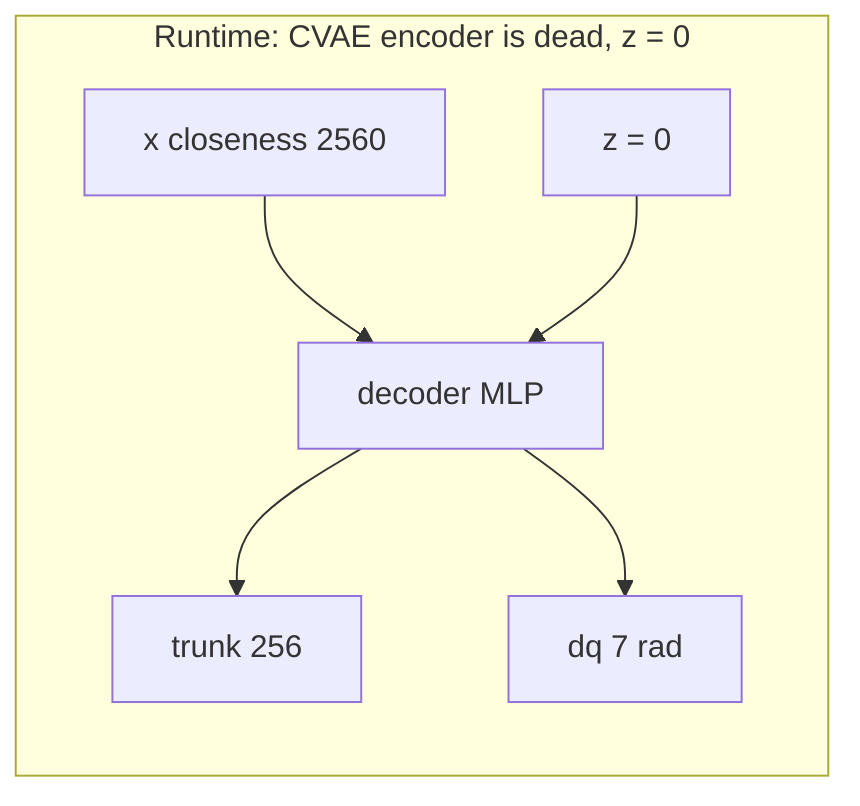

# prox_learning — proximity-skin sensing & safety for the Franka FR3

A Franka FR3 wearing **40 proximity sensors** in MuJoCo, plus the policies and analysis that
answer one question: *does a proximity skin make a robot arm safer than cameras alone?*

**Start here:** [Convert, train, eval](#start-here-dataset-to-results-with-the-wrapper)
is the operator cookbook. Convert / prepare / train use `python scripts/pact.py`
from the repository root. **Hallway eval is `eval_act.py`. v1011d eval is
`eval_act_v1011d.py`. v107_spaced eval is `eval_act_v107spaced.py`.** Wrapper `pact.py eval` / `verify` is parked. Do not collect when converted data
already exists. `train` defaults to full PACT-readout; `raw` and `act` are
explicit baselines. On this checkout `v12`, `v1011d` and `hallway` are already
converted and prepared. `v12_readout_s0` is the trained v12 readout run.

**Results on disk (2026-09-13).** Experiment-set tags (H-A, H-B, H-C, T-107, T-1011d, O-INV, S)
are defined in [`PAPER.md`](PAPER.md) §0; never pool numbers across sets.
**H-A** (Aug 25-29 ckpts, legacy evaluator, random house, n=50): ACT 14/17/33, PACT-raw 21/18/32,
**PACT-readout 20/6/44** (place / bar / collision-free of 50) —
`eval_output/place_corridor_{vanilla_s0_n50,raw_s0_n50,readout_s0_n50_fast}/`.
**H-B** (Sep 10 retrain `bs8_cs50_lr1e-5_e2000`, frozen `eval_act.py`, house 1, seeds 2026-2075,
n=50): ACT s1 15/20/30, PACT-raw s0 21/13/37, **PACT-readout s0 21/9/41** (ever 24, strict 19).
Readout vs ACT bar p = 0.027 —
`eval_output/pact_place_corridor_v5_{ACT_s1,PACT_RAW_s0,PACT_READOUT_s0}_bs8_cs50_lr1e-5_e2000/`.
Gaps: ACT s0 n=2 only; PACT-raw s1 and PACT-readout s1 eval dirs empty (ckpts trained).
**H-C** (Aug 28 readout ckpt on frozen `eval_act.py`, house 1, n=50): 18/7/43, ever 19 —
`eval_output/simple_hallway_n50/`. Same ckpt as H-A readout, different house schedule.
**T-107** (v107_spaced, table+wrist, 24 houses, horizon 1050, n=50, one seed): ACT 13/8/19,
PACT-raw **0**/9/19, PACT-readout 2/6/20. Skin arms lose the task; negative set —
`eval_output/pact_place_corridor_v107_spaced_{ACT,PACT_RAW,PACT_READOUT}_s0_bs8_cs50_lr1e-5_e2000/`.
**Experiment ledger (2026-09-20).** `python scripts/exp_tracker.py` scans `eval_output/` and
`submodules/act/ckpts/`, recomputes every count from `episodes.jsonl`, and writes
`reports/experiments_evals.csv` + `reports/experiments_ckpts.csv`. It never edits a run.
`--todo` = only what needs attention (trained ckpts with no citable eval, PARTIAL / DIRTY runs,
finished runs not yet archived). `--task <substr>` filters. `--archive` copies finished
summaries (n ≥ 20) to `reports/eval_summaries/`. `--all` includes scratch dirs (`_*`).
Status: DONE / PARTIAL (fewer records than requested; no resume, rerun into a new dir) /
DIRTY (mixed seed bases or duplicate episodes) / LEGACY (no seed field) / EMPTY. The `path`
column says whether the fast or original evaluator path ran. Week rules: one fresh
`OUTPUT_DIR` per run; n=50 in one process; run names keep the
`<task>_<ARM>_s<seed>_bs.._cs.._lr.._e..[_tag]` pattern (the ledger parses arm and seed from
it); after each batch run `python scripts/exp_tracker.py --archive`, then copy the rows you
cite into PAPER.md §3.

**PAPER.md is a facts-only paper reference (restructured 2026-09-20): 1 Methods, 2 Experimental
design, 3 Results, A figures, B glossary. No narrative, no claims. Older narrative version:
`git show 656acc0:PAPER.md`.** **PAPER.md audit 2026-09-20.** Every §7 count re-derived from disk: all matched. Corrected
facts now in PAPER.md (use it, not older README prose, for the paper): trainable params ACT
83,886,217 / raw +172,032 / readout +86,528 (+837,700 encoder), only decoder layer 1 of 7 trains
(upstream ACT), episodes are not padded to 636, skin depth spans 0.012–3.70 m, the skin renderer
hides the whole robot, `neg5/center/pos5` are ±5 mm pendant offsets, H-A / H-B PACT arms share
training seed 0, hallway eval has no bar jitter. New in PAPER.md: T-107 paired tests, O-INV
`pact_trunk` arm, hallway readout sensor-dropout keep 0.75 = 23/14/36 (n.s. vs keep 1; keep 0
control not run), per-run training table. T-1011d and keep75 summaries
copied to `reports/eval_summaries/`.
**T-v6** (2026-09-23, V10.10 two-object, 200 demos, exo+wrist, **chunk 100**, `eval_act_place.py --env v6`, seeds 2026–2075, cycle_24, consecutive history, n=50): ACT 20/5/28, PACT-raw 21/1/29, **PACT-readout 21/1/38** (place / bar / collision-free); readout vs ACT contact-free McNemar 1 vs 11, p = 0.006; placement flat — `eval_output/pact_pick_n_place_v2_v6_{ACT,PACT_RAW,PACT_READOUT}_s0_bs8_cs100_lr1e-5_e2000/`, PAPER.md §3.10. **T-v12** running (≈ 30/50 per arm).
**T-1011d-old** (PACT-raw only, Sep 3 ckpt, `eval_act_v1011d.py`): full randomize 7/10/20 (ever 10) —
`eval_output/simple_v1011d_smoke_video/`; easy 0.25 14/3/22 — `eval_output/simple_v1011d_easy025_n50/`;
wrist-only **aborted at 4/50** on 2026-09-07 (0/4) — `eval_output/simple_v1011d_wrist_only_n50/`.
**T-1011d three arms** (2026-09-17, `bs8_cs50_lr1e-5_e2000` seed 0, exo+wrist, **easy
`--clutter_xy_scale 0.25`**, `--history consecutive`, `--seed_base 0`, cycle_24, horizon 1050,
n=50, original slow path): ACT 13/18/15 (strict 9), PACT-raw 12/**3**/26 (strict 11),
PACT-readout 13/10/22 (strict 11), ever 13/12/14. Seeds match across arms; paired McNemar on
bar hit: ACT vs readout 8 vs 0 p = 0.0078, ACT vs raw 15 vs 0 p = 0.0001, raw vs readout
1 vs 8 p = 0.039 (**raw has fewer bar hits than readout here**). Placement is flat
(discordant 8 vs 8, 6 vs 5). Dirs were repaired 2026-09-20 (2 stale
`--seed_base 2026` records removed, summaries recomputed over 50, backups
`*.bak_52records_20260920`); **W&B for these runs still shows 52-record rates** —
`eval_output/pact_pick_n_place_v2_v1011d_{ACT,PACT_RAW,PACT_READOUT}_s0_bs8_cs50_lr1e-5_e2000/`.
Easy 0.25 is optimistic vs the 200 full-randomize demos; three-arm full randomize
(`--clutter_xy_scale 1`) is not run.
v1010 (6 ckpts) and v10_11c_100 (3 ckpts) are trained, not evaluated. Since 2026-09-22
`eval_act_place.py --env v1010|v1011c|v6|v107_spaced|v12` wires them (table-camera ckpts get
the train-matched fovy-58 camera, [§0.1](#env-codes)); every `/mnt/laptop/data` dump is converted (v12.1 and
table_smoke: converted only, too small to train). Frozen-eval JSON
labels `history_mode: query_steps_train_mismatch` (readout trains on 8 consecutive control
steps; eval feeds 8 query-spaced frames). Do not mix wrapper ever-success numbers with
`eval_act.py` terminal rates.

<p align="center">
  <a href="experiments_output/default/environment_viz/FrankaSkinCabinetCavitySmokeConfig/cabinet_cavity_house_0/sample_00/01_robot_scene.png">
    
  </a>
</p>
<p align="center">
  <sub>Canonical 40-sensor hybrid skin in a cabinet-cavity task — three automatically selected, text-free views.</sub>
</p>

**Current answer (2026-09-03, hallway n=50 — the live paper MVP):** yes. On pick-and-place
corridor v5, cameras-only ACT places in **28%** of rollouts, hits the bar in **34%**, and is
collision-free in **66%**. The same policy with a finetuned 128-d CLS skin token
(**PACT-readout**) places in **40%**, hits the bar in **12%**, and is collision-free in **88%**.
Better on **both** axes versus ACT. Bar-hit / collision-free vs ACT: Fisher p = **0.016**; vs
PACT-raw (36% bar / 64% free) p = **0.009**. Frozen peak-closeness (**PACT-raw**) does **not**
cut hallway bar hits (36% vs 34%) and places at 42% (tied with readout). The 2026-07-05
invisible-cell 66%→40% grid is archived and wiped; it is not this checkout's reproducible result.
**Replication (H-B, 2026-09-12, retrained ckpts, frozen `eval_act.py`, house 1):** readout again has
the fewest bar hits (9/50 = 18% vs ACT 20/50 = 40%, p = 0.027; raw 13/50 = 26%) at equal-or-better
place (42% vs 30%). Readout is the lowest-bar arm in every hallway eval on disk (6, 9, 7 of 50).

This file is the whole project document: what we built, what the numbers say, what you may claim,
how to run every experiment, and what will bite you. Figures with PNGs from the 2026-08-14 weekly
writeup live in [`reports/2026-08-14/report.md`](reports/2026-08-14/report.md). Agent protocol is
[`CLAUDE.md`](CLAUDE.md); session log is [`CURSOR.md`](CURSOR.md). **Paper brief in plain
language, every result tagged by experiment set: [`PAPER.md`](PAPER.md).**

---

## Start here: dataset to results with the wrapper

This is the convert / train cookbook. Convert / prepare / train run from the
repository root with `python scripts/pact.py`. **Hallway in-env eval is
`eval_act.py`.** **v1011d in-env eval is `eval_act_v1011d.py`.**
**v107_spaced in-env eval is `eval_act_v107spaced.py`**
([below](#eval-act-frozen)). **v1010 / v1011c / v6 / v12 / v107_spaced hub: `eval_act_place.py
--env`** ([§0.1](#env-codes); every dataset, env code, train and eval shell in one table). Wrapper `eval` / `verify` is parked (v12
construction; different protocol). A train command without a prepared manifest
is not scientifically equivalent (split, normalization).

Do **not** collect demonstrations for `v12`, `v1011d` or `hallway`. The raw
clones and converted HDF5 already exist. Collection is only for a *new* dataset
you do not have yet.

### 0. Already done on this checkout — skip these

| Step | Status | Path |
|---|---|---|
| Convert `v12` | Done | `act_style_data/pact_pick_n_place_v2/data/v12` |
| Convert `v1011d` | Done | `act_style_data/pact_pick_n_place_v2/data/v1011d` |
| Convert `hallway` | Done | `act_style_data/pact_place_corridor_v5` |
| Prepare all three | Done | `assets/pact_experiments/{v12,v1011d,hallway}/experiment.json` |
| Eval runtime `v12` / `v1011d` | Done (`setup --env`) | `assets/pact_env/{v12,v1011d}/bin/python` |
| Eval runtime `hallway` | **Not installed.** Run `setup hallway --env` before the first *wrapper* hallway eval | `assets/pact_env/hallway` |
| Pretrained surface encoder | Done (readout init) | `experiments_output/default/surface_encoder_train/pact_place_corridor_v5/pact_surface_embedding_encoder_v1.pt` |
| Trained v12 readout | Done | `runs/pact/v12_readout_s0` (`policy_best.ckpt` + `prox_encoder_best.pt`) |
| Frozen eval script | Done | hallway: `eval_act.py`. v1011d: `eval_act_v1011d.py`. v107_spaced: `eval_act_v107spaced.py`. v1010 / v1011c / v6 / v12 / v107_spaced hub: `eval_act_place.py --env` (2026-09-22). Wrapper `pact.py eval` parked |
| Hallway `eval_act.py` smoke n=2 | **Done.** Gate `17/785` both eps. Not a paper rate. EGL `__del__` noise after `eval_summary.json` is harmless. | `eval_output/simple_hallway_smoke/` |
| Hallway `eval_act.py` n=50 | **Done 2026-09-07.** House=1, seeds `2026+i`. Terminal **18/50 (36%)**, ever 19/50, bar **7/50 (14%)**, free **43/50 (86%)**. Gate `17/785`. Not the Aug 29 random-house JSON. | `eval_output/simple_hallway_n50/` |
| v1011d wrist-only smoke n=2 | **Done 2026-09-07.** Policy `--cameras wrist_camera` (train was exo+wrist). Full clutter scale 1. Terminal **0/2**, ever 0/2, bar **2/2**, free **0/2**. Never `grasp_target`. Gate `22/1030`. Not a rate. Do not mix with hallway wrist or exo+wrist v1011d. | `eval_output/simple_v1011d_wrist_only/` |
| v1011d wrist-only n=50 | **Aborted 2026-09-07 at 4/50** (0/4 place, 3/4 bar, 1/4 free). No process alive. Not a rate. Resume with the same flags if wanted. | `eval_output/simple_v1011d_wrist_only_n50/` |
| v1011d full-randomize exo+wrist n=50 | **Done 2026-09-08.** Snapshot, cycle_24, scale 1. Terminal **7/50 (14%)**, ever **10/50 (20%)**, bar **10/50 (20%)**, free **20/50 (40%)**. Grasp 25/50. Gate `22/1030`. Not hallway. Not easy 0.25. | `eval_output/simple_v1011d_smoke_video/` |
| v1011d easy 0.25 exo+wrist n=50 | **Done 2026-09-08.** Optimistic vs the 200 full-randomize demos. Terminal **14/50 (28%)**, ever 14/50, bar **3/50 (6%)**, free **22/50 (44%)**. Grasp 25/50. Gate `22/1030`. Do not mix with full randomize or hallway. | `eval_output/simple_v1011d_easy025_n50/` |
| **H-B hallway retrain grid** (`scripts/exp/train_v1_hallway.sh`, 2026-09-10) | **Six ckpts done** (ACT / RAW / READOUT × s0, s1), `bs8 cs50 lr1e-5 e2000`, best-val. | `submodules/act/ckpts/pact_place_corridor_v5/pact_place_corridor_v5_{ACT,PACT_RAW,PACT_READOUT}_s{0,1}_bs8_cs50_lr1e-5_e2000/` |
| H-B eval ACT s1 n=50 | **Done 2026-09-11.** Frozen `eval_act.py`, house 1, seeds 2026+i. Place **15/50 (30%)**, bar **20/50 (40%)**, free **30/50 (60%)**, strict 12. | `eval_output/pact_place_corridor_v5_ACT_s1_bs8_cs50_lr1e-5_e2000/` |
| H-B eval PACT-raw s0 n=50 | **Done 2026-09-12.** Place **21/50 (42%)**, bar **13/50 (26%)**, free **37/50 (74%)**, strict 19. | `eval_output/pact_place_corridor_v5_PACT_RAW_s0_bs8_cs50_lr1e-5_e2000/` |
| H-B eval PACT-readout s0 n=50 | **Done 2026-09-12.** Place **21/50 (42%)**, ever 24, bar **9/50 (18%)**, free **41/50 (82%)**, strict 19. vs ACT s1 bar p = 0.027. | `eval_output/pact_place_corridor_v5_PACT_READOUT_s0_bs8_cs50_lr1e-5_e2000/` |
| H-B eval ACT s0 | n=2 smoke only (1/2). **Not run at n=50.** | `eval_output/pact_place_corridor_v5_ACT_s0_bs8_cs50_lr1e-5_e2000/` |
| H-B eval PACT-raw s1 / readout s1 | **Empty dirs.** Ckpts exist; eval never produced output. | `eval_output/pact_place_corridor_v5_PACT_RAW_s1_bs8_cs50_lr1e-5_e2000/`, `…_PACT_READOUT_s1_n2/` |
| **T-107 v107_spaced three arms n=50** | **Done 2026-09-12.** `eval_act_v107spaced.py`, table+wrist, cycle_24, horizon 1050, one seed. ACT **13/50** place / 8 bar / 19 free; PACT-raw **0/50** / 9 / 19 (42 gripper closes); PACT-readout **2/50** / 6 / 20. Negative on task; collisions flat. | `eval_output/pact_place_corridor_v107_spaced_{ACT,PACT_RAW,PACT_READOUT}_s0_bs8_cs50_lr1e-5_e2000/` |
| T-1010 / T-1011c ckpts | **Trained 2026-09-11, never evaluated.** v1010: 3 arms × 2 seeds; v10_11c_100: 3 arms × s0. Wired 2026-09-22: `eval_v1011c.sh` / `eval_v1010.sh` → `eval_act_place.py` ([§0.1](#env-codes)). | `submodules/act/ckpts/pact_place_corridor_{v1010,v10_11c_100}/` |

Skip convert/prepare/setup when those paths already exist. Re-convert is refused
if the destination is nonempty. Re-prepare is refused if the contract would
change. Training a *new* model only needs a **new `--run` name**.

<a id="env-codes"></a>
### 0.1 Every dataset by environment code (2026-09-22)

**Status by environment and every eval number: [`README_RESULTS.md`](README_RESULTS.md).**

Raw dumps live on `/mnt/laptop/data/` (there is no `data/` link in this checkout; pass the
path). Every dump is converted. Env code = the tag in the paper table; it is in every `TASK`,
run name and `eval_output/` dir. Converted with `python -m scripts.convert_pact_place_to_act
--src <raw> --dst act_style_data/<same tree> --with_proximity --prox_pool min --image_h 240
--image_w 320` (= `pact.py convert`); logs in `runs/convert_logs/`.

| code | raw dump (`/mnt/laptop/data/…`) | eps | cams (train) | `TASK` (`constants.py`) | train | eval shell → evaluator |
|---|---|---|---|---|---|---|
| v5 (hallway) | `pact_place_corridor_v5` | 152 | wrist | `pact_place_corridor_v5` | `train_v1_hallway.sh` | `eval_v1_hallway.sh` → `eval_act.py --task hallway` |
| v5_ext | `pact_place_corridor/data/v5/pick_and_place/accepted` | 193 | wrist | `pact_place_corridor_v5_ext` | `train_v5_ext.sh` | `eval_v5_ext.sh` → `eval_act.py --task hallway` |
| v107 | `pact_place_corridor/data/v107/pick_and_place/accepted` | 48 | wrist | `pact_place_corridor_v107` | `train_v107.sh` | none (no V10.7 config in molmospaces) |
| v107_spaced (hub) | `pact_pick_n_place_v2/data/v107_spaced` | 200 | exo + wrist | `pact_pick_n_place_v2_v107_spaced` | `train_v107_spaced_hub.sh` | `eval_v107_spaced_hub.sh` → `eval_act_place.py --env v107_spaced` |
| v107_spaced (batman, T-107) | `pact_place_corridor/data/v107_spaced/accepted` | 210 | table + wrist | `pact_place_corridor_v107_spaced` | `train_v107_spaced.sh` | `eval_v107_spaced.sh` → `eval_act_v107spaced.py` (T-107, fov-45 view); `eval_v107_spaced_batman.sh` → `eval_act_place.py --env v107_spaced --cameras table_camera wrist_camera` (fov 58, `_cam58`) |
| v1010 | `pact_place_corridor/data/v1010/accepted` | 215 | table + wrist | `pact_place_corridor_v1010` | `train_v1010.sh` | `eval_v1010.sh` → `eval_act_place.py --env v1010` (table_camera fov 58, see below) |
| v1011c | `mixed_v1011_clutter_geometry/pact_place_corridor_v10_11c_100` | 99 | exo + wrist | `pact_place_corridor_v10_11c_100` | `train_v1011c.sh` | `eval_v1011c.sh` → `eval_act_place.py --env v1011c` |
| v1011d | `pact_pick_n_place_v2/data/v1011d` | 200 | exo + wrist | `pact_pick_n_place_v2_v1011d` | `train_v1011d.sh` | `eval_v1011d.sh` → `eval_act_v1011d.py` |
| v12 | `pact_pick_n_place_v2/data/v12` | 165 | exo + wrist | `pact_pick_n_place_v2_v12` | `train_v12.sh` | `eval_v12.sh` → `eval_act_place.py --env v12` |
| v6 | `pact_pick_n_place_v2/data/v6` | 200 | exo + wrist | `pact_pick_n_place_v2_v6` | `train_v6.sh` | `eval_v6.sh` → `eval_act_place.py --env v6` |
| v12.1 | `pact_pick_n_place_v2/data/v12.1` | 5 | exo + wrist | — | too small to train | — |
| table_smoke | `table_smoke/pact_place_corridor_v10_10_tablecam_validation10` | 10 | exo + wrist | — | schema check only | — |

Converted 2026-09-22 (0 skipped rows each): v6 200 (max T 622), v107_spaced hub 200 (620),
v12.1 5 (557), v5_ext 193 (650), v107 48 (609). v107: 25 of 48 table mp4s were recorded on
even control steps only (`floor(T/2)+1` frames); converted with the new
`--hold_half_rate_video` (each frame held two steps; hdf5 attr `half_rate_video_held`), off by
default. v5_ext / v107 hdf5 also carry `table_camera`, but they train wrist-only (the batman
table camera pose is not recorded; see below). The v6 / v107_spaced / v107 collection
closeouts say `authorizes_* = false` (development collections); converted on the user's call.

**`eval_act_place.py` (new, fast path).** One evaluator for the V10.x worlds without their own
script: `--env v1010 | v1011c | v6 | v107_spaced | v12` (+ `v1011d`, only for `--target_support
train` reruns). Checked 2026-09-22: same v1011d ckpt and seeds through `eval_act_v1011d.py` twice
and through this wrapper gave identical outcome fields; contact-frame counts differed between
the two original runs as much as against the wrapper. It imports `eval_act_v1011d.py` and runs
its `main()`; only the world is swapped (datagen config, sampler, environment-version check,
cell count, default cameras, video camera). Rollout loop, FrozenACTPolicy, chunk gate, lazy skin
cameras, sensor keep, resume guard and W&B are that file's own functions, so the protocol is the
T-1011d one. `eval_summary.json` keeps `script` = `eval_act_v1011d.py` (the protocol code) and
adds `wrapper_script` / `wrapper_script_sha256`, `env`, and `env` + `environment_version` in the
protocol block (resume refuses another world). v12 installs the standing kitchen after
`sample_task`, as the datagen expert does before the first observation; an extra in the motion
lane is a construction failure and is redrawn (`seed + k·1000003`, up to 64). v12 cycles 8 cells
(`cycle_8`), the others 24. `--clutter_xy_scale` stays v1011d only. v6 needs
`submodules/molmospaces` ≥ `d57f350` (v6 two-object config, pulled 2026-09-22; additive only).

New-world eval shells (`eval_v6.sh`, `eval_v12.sh`, `eval_v107_spaced_hub.sh`,
`eval_v1011c.sh`, `eval_v1010.sh`, `eval_v107_spaced_batman.sh`; `eval_v1011d_tstrain.sh` keeps
T-1011d's seeds 0–49 and clutter 0.25): n = 50, seeds `2026+i`, cells
`i % n_cells`, horizon 1050, gated EGL skin, snapshot sub-steps, `--history consecutive` (8-step
window, readout train-matched, as T-1011d), exo + wrist (table + wrist for the two batman shells), `--save_first_frame`, W&B `PC_ACT_experiments_eval`.
`eval_v5_ext.sh` = H-B hallway settings (house 1, seeds `2026+i`, query history, wrist).
`eval_v1011d.sh` now takes `CLUTTER_XY_SCALE=1` for full randomize → dir tag `_xy1` (the
untagged dirs stay the easy-0.25 T-1011d set).

**Shell guards (all `train_*.sh` / `eval_*.sh`).** `EXP`, `SEED` (and for evals `NUM_ROLLOUTS`,
`TAG`, …) can be set from the environment; defaults unchanged. A train shell exits 0 with `DONE`
when `policy_best.ckpt` exists and exits 3 (`REFUSE`) on a run dir without it (running or
crashed). An eval shell exits 4 on a missing checkpoint, 0 (`DONE`) on a finished dir, 3 on a
partial dir (no resume; rerun with `TAG=_rerun`).

**Run one job.** One train and one eval script per env, same style as before: knobs at the top,
one run per call. Set the arm with `EXP=` in the file or in front of the command (`SEED=` too;
default 0). Run from the repo root inside `conda activate mlspaces`, one tmux window per job.

```bash
EXP=PACT_READOUT ./scripts/exp/train_v12.sh
EXP=ACT ./scripts/exp/eval_v1011c.sh
EXP=PACT_RAW SEED=1 ./scripts/exp/eval_v1010.sh
```

| env | train | eval |
|---|---|---|
| v5 (hallway) | `train_v1_hallway.sh` | `eval_v1_hallway.sh` (set `SENSOR_KEEP_FRACS=1` for a full-skin run) |
| v5_ext | `train_v5_ext.sh` | `eval_v5_ext.sh` |
| v107 | `train_v107.sh` | — |
| v107_spaced (hub) | `train_v107_spaced_hub.sh` | `eval_v107_spaced_hub.sh` |
| v107_spaced (batman, T-107) | `train_v107_spaced.sh` | `eval_v107_spaced_batman.sh` (fovy 58, `_cam58`); original T-107: `eval_v107_spaced.sh` |
| v1010 | `train_v1010.sh` | `eval_v1010.sh` |
| v1011c | `train_v1011c.sh` | `eval_v1011c.sh` (`_tstrain`) |
| v1011d | `train_v1011d.sh` | `eval_v1011d_tstrain.sh` (demo-side cups); original T-1011d: `eval_v1011d.sh` |
| v12 | `train_v12.sh` | `eval_v12.sh` |
| v6 | `train_v6.sh` | `eval_v6.sh` |

Needed for the paper table: train v12, v107_spaced hub, v6 (3 arms each); eval v1011c, v1010,
v1011d_tstrain, v107_spaced_batman now, v12 / v107_spaced hub / v6 after training. Each train
writes ~7.5 GB: run `scripts/housekeeping.sh --tier2 --apply` first (~165 GB of
`policy_epoch_*.ckpt`; `policy_best` / `policy_last` / `prox_encoder_best.pt` stay). At most
~3 trainings + 3 evals at once; keep `free -g` above ~8 GB.

**Cup side, v1011c / v1011d (found 2026-09-22).** The V10.11 sampler draws the cup y uniform
on ±0.375 m whatever the bar side (`_prepare_pact_clutter_layout`), but the demos only keep
cups on the side away from the bar: v1011c 99/99, v1011d 199/200 (1 within 5 cm of centre).
The other datasets keep the cup near the centre (demo |y| ≤ 0.12 m; eval draws ±0.06 m, checked
on every cell). Rebuilding the 50 T-1011d scenes (seeds 0–49; construction retries match the
original runs in 150/150) gives 21 cups under the bar, 27 away, 2 central; placements under the
bar: ACT 0/21, raw 0/21, readout 0/21; away: 12/27, 12/27, 13/27; bar hits away / under: ACT
7 / 10, raw 1 / 2, readout 2 / 8. `eval_act_place.py --target_support train` redraws out-of-support
cups (construction retry; in-support draws untouched, so they repeat the uniform episode at
the same seed) and logs `target_start_xy` / `target_in_train_support`; the summary splits
success by support. `eval_v1011c.sh` defaults to `TARGET_SUPPORT=train` (`_tstrain`).

**Batman `table_camera` = exo pose at fovy 58; evaluators rendered 45 (found 2026-09-22).**
v1010, the 210-ep T-107 v107_spaced, v5_ext and 25 of 48 v107 rows carry a `table_camera` mp4
rendered by the collector's publish step (pose never saved). It is exactly the hybrid
`exo_camera_1` pose (`fr3_link0` offset `[-1.05, -0.55, 1.30]`, lookat `[0.55, 0, 0.45]`, up z,
robot-base mounted) at its configured **fovy 58°**. molmospaces renders `exo_camera_1` at **45°**:
`CameraManager._setup_robot_mounted_camera` drops `fov` in the lookat branch
(`camera_manager.py` ~492 → `add_robot_mounted_camera`, default 45). Fitted on 19 batman frame-0
renders rebuilt in sim: RGB MAE ~2.9 (0–255) at 58 vs ~29 at 45; fovy sweep minimum at 58.0 in
every episode; the other 23 v107 rows (collector h264, h5 `sensor_param/table_camera` present)
are 45°. Evidence (scratch, not in git): `EVIDENCE_montage.png` from this session. **Do not fix
molmospaces globally**: the hub sets (v1011d, v6, table_smoke checked via h5 intrinsics) were
recorded through the same 45° path, so `exo_camera_1` stays 45 for them. So:

- `eval_act_place.py` puts a 58° `table_camera` (same pose, quaternion mode so `fov` reaches the
  renderer) in the exo slot whenever the policy cameras include `table_camera`;
  `--table_camera_fov 45` reproduces the old rename. Protocol field `table_camera_fov`.
- **T-107 (`eval_act_v107spaced.py`) ran with the 45° view — zoomed in vs training.** Those JSONs
  stay as they are (the script is unchanged). `eval_v107_spaced_batman.sh` re-evaluates the same
  three checkpoints on `eval_act_place.py` with the 58° camera into `…_cam58` dirs (new set; also
  consecutive history, so not paired with T-107).
- `eval_v1010.sh` defaults to 58 (`TABLE_CAMERA_FOV=45` → `_fov45` dir).
- v5_ext / v107 train wrist-only (v107's two table fovs would mix).
- Recorded `intrinsic_cv` in these h5s has width / height swapped (cx 176, cy 312); do not
  project with it as-is.

### 1. Every session: environment

```bash
conda activate mlspaces
cd /home/jaydv/code/prox_learning
export OMP_NUM_THREADS=2 MUJOCO_GL=egl PYOPENGL_PLATFORM=egl
export MLSPACES_ASSETS_DIR="$PWD/assets"
```

`mlspaces` supplies PyTorch/CUDA. `setup DATASET --env` only overlays pinned
simulator packages. Readout training needs the pretrained encoder in the table
above. Configure W&B before unattended training **and** frozen eval (`wandb login`,
same as train). The three frozen eval scripts log to `PC_ACT_experiments` by
default (run name suffix `_eval` from the wired shells so eval does not share
a train run). `--no_wandb` opts out. Wrapper `pact.py train` has no
`--no_wandb`.
See [Setup](#3-setup) for assets and sanity checks.

### 2. What the names mean

```bash
python scripts/pact.py list
```

| Profile | Raw demos | Converted HDF5 | Cameras | Eval environment |
|---|---|---|---|---|
| `v12` | `data/pact_pick_n_place_v2/data/v12` | `act_style_data/pact_pick_n_place_v2/data/v12` | exo + wrist | One inbound bottle, parked outbound bottle, standing kitchen, preview XML |
| `v1011d` | `data/pact_pick_n_place_v2/data/v1011d` | `act_style_data/pact_pick_n_place_v2/data/v1011d` | exo + wrist | Randomized clutter layout sampler |
| `hallway` | `data/pact_place_corridor_v5` | `act_style_data/pact_place_corridor_v5` | wrist | Corridor v2 sampler |

A **dataset** (`v12`) is data + matching environment. A **run** (`v12_readout_s1`)
is one training job. Closed-loop eval: hallway `eval_act.py`; v1011d
`eval_act_v1011d.py`. Do not point a v12 checkpoint at a hallway or V10.10 evaluator
just because it renders. `pact.py eval --run NAME` is parked.

Registry: [`configs/pact_datasets.json`](configs/pact_datasets.json).

### 3. Convert once per dataset (skip if already converted)

```bash
python scripts/pact.py convert data/pact_pick_n_place_v2/data/v12     # already done here
python scripts/pact.py convert data/pact_pick_n_place_v2/data/v1011d  # already done here
python scripts/pact.py convert data/pact_place_corridor_v5           # already done here
# same: python scripts/pact.py --convert data/pact_pick_n_place_v2/data/v12
```

Pass a dump folder that contains `rows/*/trajectory.h5` (or `*/trajectory.h5`).
No registry name. Cameras come from sibling mp4s. Writes ACT HDF5 (RGB, joints,
actions, min-pooled proximity) under `act_style_data/` mirroring `data/`, or
`act_style_data/<folder>` if the source is outside `data/`. `--dst PATH` overrides.
All three arms share one conversion. Does not split train/val and does not train.
`--dry-run` prints the child command without writing. Live convert refuses a
nonempty destination.

If you ever see `Refusing to overwrite converted data`, reuse that folder.

### 4. Prepare once per dataset (skip if `experiment.json` exists)

```bash
python scripts/pact.py prepare v12          # already done; 132 train / 33 val
python scripts/pact.py prepare v1011d
python scripts/pact.py prepare hallway
```

Saves grouped train/val IDs and fixed smoke/dev/test scenes in
`assets/pact_experiments/DATASET/experiment.json`. Training later fits
normalization on train IDs only. The training `--seed` does **not** resplit.
Dev/test are simulator scenes, not offline val episode IDs. A different
protocol needs a **new profile name**, not an overwrite.

### 5. Setup evaluation runtime once per dataset (before simulation)

```bash
python scripts/pact.py setup v12 --env      # already done here
python scripts/pact.py setup v1011d --env   # already done here
python scripts/pact.py setup hallway --env  # do this before wrapper hallway eval
```

Exports pinned simulator code without switching your submodule. `--env` creates
`assets/pact_env/<adapter>` and installs pinned MuJoCo/Warp. `setup DATASET`
without `--env` only exports files. Setup is not required to **train**. Do not
rerun setup while an evaluation using that runtime is live.

### 6. Train a new model

Unique `--run` name every time. `v12_readout_s0` is taken.

```bash
# Full PACT (default): jointly finetune the surface encoder + ACT
python scripts/pact.py train v12 --run v12_readout_s1 --arm readout \
  --seed 1 --epochs 2000 --batch-size 8 --lr 1e-5

# Peak-closeness baseline
python scripts/pact.py train v12 --run v12_raw_s0 --arm raw --seed 0

# Cameras/joints only
python scripts/pact.py train v12 --run v12_act_s0 --arm act --seed 0

# Other registered datasets (after their convert/prepare)
python scripts/pact.py train v1011d --run v1011d_readout_s0 --arm readout --seed 0
python scripts/pact.py train hallway --run hallway_readout_s1 --arm readout --seed 1
```

Historical hallway / v1010 / v107_spaced / v1011c / v1011d ACT / PACT-raw / PACT-readout
launchers live in [`scripts/exp/`](scripts/exp/). One `EXP` per call.
`imitate_episodes.py` (not `pact.py train`); split/normalization differ from
the wrapper ([§4.20](#420-dataset-bound-training-and-evaluation)).
**T-1011d train is the exp shell**, not `pact.py train`. Edit `EXP=` in the file
(prefix `EXP=ACT ./…` is overwritten by the assignment). Writes
`submodules/act/ckpts/pact_pick_n_place_v2/<RUN>/`. Closed-loop:
`./scripts/exp/eval_v1011d.sh` (`eval_act_v1011d.py`).

```bash
EXP=ACT ./scripts/exp/train_v1_hallway.sh
EXP=PACT_RAW ./scripts/exp/train_v1010.sh
EXP=PACT_READOUT ./scripts/exp/train_v107_spaced.sh
EXP=PACT_READOUT ./scripts/exp/train_v1011c.sh
./scripts/exp/train_v1011d.sh
```

Closed-loop eval launchers (same RUN knobs → `CKPT_DIR`). Wired today:
hallway `eval_act.py`, v1011d `eval_act_v1011d.py`, v107_spaced
`eval_act_v107spaced.py`. v1010 / v1011c scripts exist and **exit**
(`--task` not wired). New `--output_dir`. W&B on by default
(`PC_ACT_experiments`, name `${RUN}_eval`). `--no_wandb` in the python
command if needed. Do not paste into `eval_output/simple_hallway_n50/`.

```bash
EXP=PACT_RAW ./scripts/exp/eval_v1_hallway.sh
EXP=PACT_READOUT ./scripts/exp/eval_v1_hallway.sh
./scripts/exp/eval_v1011d.sh
./scripts/exp/eval_v107_spaced.sh
```

**v1011d eval speed (2026-09-18).** PACT arms ran ~1290 s/episode vs ACT ~115 s
(n=50 ≈ 18 h vs 1.6 h). Skin EGL render was only 22–150 s of that. A 100-step cProfile
(`eval_output/_prof_eager/profile.txt`, 164 s rollout) split the rest in two:

| cost | share | what | who reads it |
|---|---|---|---|
| `ObjectImagePointsSensor` | 82 s | one segmentation render per task object × camera, **every** step (3 × 42 = 126), bypasses the chunk gate | nobody in eval (dataset annotation) |
| `update_all_cameras` | 68 s | registry pose of all 40 skin cameras after each of 33 ctrl substeps | nobody (skin depth renders by MJCF camera name) |
| physics + audit + rest | ~4 s | | |

`eval_act_v1011d.py` installs [`scripts/pact_eval_lazy_cameras.py`](scripts/pact_eval_lazy_cameras.py):
(1) the 40 skin-camera poses are recomputed only when read; (2) `object_image_points` is
dropped from the sensor suite (same idea as `submodules/act/eval_place_fast_hooks.py`;
`env_states` stays). `exo_camera_1` / `wrist_camera` keep the original per-substep update,
skin stays `--skin egl` with the same query schedule, policy / encoder / readout / seeds /
horizon / success judge untouched. Not protocol fields; `eval_summary.json` records
`lazy_prox_cameras` and `export_sensors_dropped` (also per episode in `episodes.jsonl`).
`--eager_cameras --keep_export_sensors` (= `EAGER_CAMERAS=1` in the shell script) restores
the original path.

Gate before paper use — `./scripts/exp/test_lazy_cameras.sh 1..5` (profile, lazy run,
original run, old-vs-new identity, new-vs-running-paper-eval identity). Manual form:

```bash
python - <<'PY'
import json, sys
a, b = (
    [json.loads(l) for l in open(f"eval_output/{d}/episodes.jsonl")]
    for d in sys.argv[1:3]
)
skip = {"video_path"}
bad = [(x["episode_idx"], k) for x, y in zip(a, b) for k in x if k not in skip and x[k] != y.get(k)]
print("IDENTICAL" if not bad and len(a) == len(b) else f"MISMATCH {bad}")
PY
cmp -s <(cd eval_output/<eager>/first_frames && sha256sum *) \
       <(cd eval_output/<lazy>/first_frames && sha256sum *) && echo FRAMES_IDENTICAL
```

Pass the two dir names as arguments to the python snippet.

**Measured 2026-09-18 (PACT_READOUT, busy GPU).** Original path 1378 / 1368 s per episode;
both hooks 95–99 s (failed episodes; successful ones run 420–770 s); `snapshot=169` in all.
n=50 ≈ 1.5–2.5 h instead of ≈ 18 h.

**Ported 2026-09-20 to `eval_act.py` (hallway) and `eval_act_v107spaced.py`.** Same two hooks,
same flags (`--eager_cameras --keep_export_sensors` = original), same provenance fields
(`lazy_prox_cameras`, `export_sensors_dropped` in the summary and per episode). Shell knob
`EAGER_CAMERAS=1` in `eval_v1_hallway.sh` / `eval_v107_spaced.sh`. The hallway worktree
(`molmospaces-pact-place@977acd6`) has byte-identical `camera_manager.py`, `sensors.py`,
`sensors_cameras.py`, so the hook applies unchanged. Wiring smoke, PACT_READOUT, 1 episode ×
150 steps, seed 2026, fast vs original (`eval_output/_port_{hall,v107}_{fast,eager}/`; not a rate):

| evaluator | original | fast | records | first frame |
|---|---|---|---|---|
| `eval_act.py` hallway | 175.2 s | 5.6 s | equal except contact-frame count 5628 vs 5667 (0.7 %, the known rerun drift) | byte-identical |
| `eval_act_v107spaced.py` | 189.3 s | 14.9 s | identical | byte-identical |

**v1010 and v1011c have no evaluator.** `eval_v1010.sh` / `eval_v1011c.sh` call
`eval_act.py --task v1010` / `--task mixed`; both exit with "not wired". Nothing to port until
an evaluator exists (both share v1011d's base config and 24 scene files).

**The eval is not bit-reproducible, with or without the hooks.** Original code vs the
original paper run, same seeds: outcome fields equal, contact-frame counts drift ~1 %.
Identical fast-path code run twice over 24 episodes: terminal success flipped in 2/24
episodes (4 vs 2 successes; paper run 5), `hit_bar` and `collision_free` equal in 24/24,
first-frame PNGs differ by ≤10 pixels of 1 gray level in about half the episodes.
Fast-vs-paper disagreements (1 and 3 success flips) are the same kind and size as
fast-vs-fast. n=24 cannot rule out a success shift below ~15 points. Treat single-run
n=50 success rates as ± a few episodes.

**Episodes depend on process history.** Seed 8 / cell 8 run as the first episode of a
fresh process gives a different scene and trajectory (success, first grasp step 97) than
the same seed as episode 8 of a sequential run (fail, step 104) — on both the original and
the fast path. So: no sharding (removed), and a resumed run is not the same experiment as
an uninterrupted one. Run n=50 in one process.

**Stale records.** `_load_resume` loads every line of `episodes.jsonl`. The three
2026-09-17 v1011d dirs start with two `--seed_base 2026` records (episode_idx 0 / 1, seeds
2026 / 2027, cells `F0|left|neg5` and `F0|left|center`; in all three arms both are
fail + bar hit + not collision-free). They match the script defaults (`--num_rollouts 2`,
`--seed_base 2026`): an earlier 2-episode run wrote into the same `--output_dir`. Resume
keys on `(episode_idx, seed)`, so `(0, 2026)` did not block `(0, 0)`: the n=50 run ran all
50 episodes, but the two old records stayed in the metric list. Each file has 52 lines and `eval_summary.json` / W&B divide by 52
(e.g. readout success 13/52 = 0.25, bar 12/52). Use records with `seed == episode_idx` only:

| arm | place | ever | bar hit | collision-free | strict | clutter-contact eps |
|---|---|---|---|---|---|---|
| ACT | 13/50 | 13 | 18/50 | 15/50 | 9/50 | 26 |
| PACT-raw | 12/50 | 12 | 3/50 | 26/50 | 11/50 | 24 |
| PACT-readout | 13/50 | 14 | 10/50 | 22/50 | 11/50 | 26 |

**Repaired 2026-09-20.** The two stale lines were removed from the three dirs (kept lines
byte-for-byte) and `eval_summary.json` recomputed over 50 (`collision`, `success`, `total`,
`completed`, rates, `sensor_keep`; note field `repair_20260920`). Originals:
`episodes.jsonl.bak_52records_20260920`, `eval_summary.json.bak_52records_20260920` in each
dir. **W&B still shows the 52-record rates for those three runs.**

**Resume guard (2026-09-20).** `_load_resume(jsonl, seed_base)` in `eval_act.py`,
`eval_act_v1011d.py` and `eval_act_v107spaced.py` now refuses the output dir if any record has
`seed != seed_base + episode_idx`, a duplicate `(episode_idx, seed)`, or no seed field
(`refuse resume into … Use a new --output_dir`). Startup check only: it reads the file, never
edits it, and touches nothing in the rollout. A scan of all 51 `eval_output/*/episodes.jsonl`
found the paper dirs clean; only `pact_place_corridor_v5_PACT_RAW_s0_keep{0,50}_smoke/` hold
duplicates (smoke, 4 lines each). Legacy H-A dirs have no seed field and are not resumed by
these scripts. Rule stays: fresh `--output_dir` per run, n=50 in one process.

**Noise floor for reading the table.** Three 24-episode READOUT runs (paper + two fast
repeats): success 5 / 4 / 2, bar hit 6 / 6 / 6, collision-free 11 / 11 / 11. Bar hit and
collision-free were stable under rerun; terminal success moved by up to 3 of 24.

Edit knobs in the file (same `RUN` string as train). Run name is
`${TASK}_${EXP}_s${SEED}_bs${BATCH_SIZE}_cs${CHUNK_SIZE}_lr${LR}_e${EPOCHS}`
(braces required in bash; `$TASK_` is empty). Writes under
`submodules/act/ckpts/<TASK>/`. A Ctrl-C run named `ACT_s2000` was the
unbraced bug — do not reuse that name.

`pact.py train --dry-run` prints the wrapper trainer command. There is **no resume**: an interrupted job needs a new name. Best weights =
lowest **validation loss**, not rollout success. `--encoder-checkpoint PATH` /
`--encoder-lr VALUE` apply only to `--arm readout`. Tensors and architecture:
[§4.21](#421-v12-training-and-evaluation).

| `--arm` | What the policy sees | What trains |
|---|---|---|
| `readout` (default) | 40 × 128-d CLS skin tokens from consecutive history | Encoder + ACT |
| `raw` | 40 peak-closeness scalars (50 cm cap) | ACT only; feature is fixed |
| `act` | No skin | ACT only |

Weights land in `runs/pact/NAME/` (`policy_best.ckpt`; readout also
`prox_encoder_best.pt`). Redirect logs **outside** that folder or the wrapper
treats the run as already used:

```bash
mkdir -p runs/pact_batch_logs
PYTHONUNBUFFERED=1 python scripts/pact.py train v12 --run v12_act_s0 --arm act --seed 0 \
  > runs/pact_batch_logs/v12_act_s0.log 2>&1
```

Serial and two-GPU batch recipes: [§4.22](#422-wrapper-reference-and-batch-training).

### 7. Evaluate a completed run

**Closed-loop eval:** hallway = `eval_act.py`. v1011d = `eval_act_v1011d.py`.
v107_spaced = `eval_act_v107spaced.py`.
`python scripts/pact.py eval` and `verify` now exit with a pointer. Convert /
train / `offline` / `check` still use the wrapper.

| `data/` dump | Script | Eval? |
|---|---|---|
| `data/pact_place_corridor_v5` | `eval_act.py --task hallway` | Wired. Paper path. |
| `data/pact_pick_n_place_v2/data/v1011d` | `eval_act_v1011d.py` | Wired. Randomized clutter. |
| `data/pact_pick_n_place_v2/data/v12` | `eval_act_place.py --env v12` | Wired 2026-09-22 (exp-shell ckpts; standing kitchen installed after `sample_task`). Wrapper overlay path stays parked. |
| `data/pact_pick_n_place_v2/data/v6` | `eval_act_place.py --env v6` | Wired 2026-09-22. V10.10 two-object. |
| `data/pact_pick_n_place_v2/data/v107_spaced` | `eval_act_place.py --env v107_spaced` | Wired 2026-09-22. Hub 200-ep set, exo+wrist. |
| `data/pact_pick_n_place_v2/data/v12.1` | — | 5-ep table-cam preview. Not a suite. |
| `data/pact_place_corridor/data/v107_spaced` | `eval_act_v107spaced.py` | Wired. Spaced bench. table+wrist. **Renders table_camera at fovy 45; training was 58** ([§0.1](#env-codes)). `eval_v107_spaced_batman.sh` = fixed re-eval. |
| `data/pact_place_corridor/data/v1010` | `eval_act_place.py --env v1010` | Wired 2026-09-22; table_camera at fovy 58 ([§0.1](#env-codes)). |
| `data/pact_place_corridor/data/v5` (v5_ext) | `eval_act.py --task hallway` | Wrist-only ckpts on the hallway protocol. |
| `data/pact_place_corridor/data/v107` | — | No V10.7 env config. Train only. |
| `data/mixed_v1011_clutter_geometry` | `eval_act_place.py --env v1011c` | Wired 2026-09-22. |
| `data/table_smoke` | — | 10-ep schema check. Converted; do not train or eval. |
| `data/molmo-pi0-eval-videos` | — | Videos. Not MuJoCo policy eval. |

```bash
# hallway (paper protocol). n=50 house=1 is done; do not paste into simple_hallway_n50/.
python eval_act.py \
  --ckpt_dir submodules/act/ckpts/pact_place_corridor_v5/20260828_003136_pact_place_corridor_readout_s0 \
  --task hallway --cameras wrist_camera --num_rollouts 2 \
  --output_dir eval_output/simple_hallway_smoke

# v1011d (PACT-raw ckpt). Snapshot + exec_horizon=chunk. n=2 is wiring, not a rate.
python eval_act_v1011d.py \
  --ckpt_dir submodules/act/ckpts/pact_pick_n_place_v2/20260903_171108_pact_pick_n_place_v2_v1011d_s0 \
  --num_rollouts 2 --skin_substeps snapshot \
  --output_dir eval_output/simple_v1011d_smoke

# v107_spaced (dedicated script; table+wrist; not v1011d). n=2 is wiring.
python eval_act_v107spaced.py \
  --ckpt_dir submodules/act/ckpts/pact_place_corridor_v107_spaced/pact_place_corridor_v107_spaced_PACT_READOUT_s0_bs8_cs50_lr1e-5_e2000 \
  --num_rollouts 2 --skin_substeps snapshot \
  --output_dir eval_output/simple_v107_spaced_smoke

# v1011d full-randomize n=50 done in simple_v1011d_smoke_video/. Do not paste.
# v1011d easy 0.25 n=50 done in simple_v1011d_easy025_n50/. Do not paste.
# v1011d wrist-only n=2 done in simple_v1011d_wrist_only/. n=50 running in
# simple_v1011d_wrist_only_n50/. Do not paste either command again.
```

**Sensor-keep ablation (hallway, paired with H-B).** `--sensor_keep_frac` 1 / 0.75 / 0.5 / 0.25 / 0, same `seed_base=2026` and `house_ind=1`. **100% column is the existing H-B n=50 dirs** (do not re-run). **0% keep must run** — train skin is already mostly far, so drop-to-0.5 m is the normal state; if 0% ≈ 100% the policy ignores skin. Poisson per link; log realized mean±sd. `--save_first_frame` writes t=0 RGB+depth+mosaic. Flags and table: [eval-act-frozen](#eval-act-frozen). v12 has no closed-loop eval.

**W&B (frozen evals).** On by default for `eval_act.py`, `eval_act_v1011d.py`,
and `eval_act_v107spaced.py`. Project `PC_ACT_experiments` (same as
`scripts/exp/train_*.sh`). Wired shells pass `--wandb_run_name "${RUN}_eval"`
so eval does not mix with train runs. `--no_wandb` opts out.
`--wandb_log_every 50` logs live episode/step/progress plus running collision
and hazard-bar frames; `0` is episode-only. No MP4s uploaded. Resume from
`episodes.jsonl` also logs current rates so a restarted job is not a blank
dashboard. W&B flags are not resume-protocol fields. `wandb login` once, same
as train.

`offline` / `check` are still diagnostics, not task success:

```bash
python scripts/pact.py offline --run v12_readout_s0 --split train --limit 8
python scripts/pact.py offline --run v12_readout_s0 --split val --limit 8
python scripts/pact.py check --run v12_readout_s0
```

**Parked wrapper eval (do not paste).** Identity `c36c30dcdefe5650` for
`v12_readout_s0 --suite test` completed 33/48 then died at row 34:
`forbidden robot/environment contact before the policy starts`. Rates **null**.
**21/33 is not a result.** Do not drop row 34. Do not cite it. Construction
history (settle-park vs overlay) stays in [§4.23](#423-results-troubleshooting-and-experiment-handoff).

### 8. Keep the GPU busy: more trains while evals run

One 24 GB GPU can hold a trainer (~2–4 GB) plus one or two evals (~1–2 GB
each). **VRAM is not the usual limiter.** Hallway `--save_trajectories` is
heavy on **system RAM**. Wrapper `eval` is metrics-only (no MP4) unless you
leave the registered path.

Rules:

- Unique `--run` names.
- Do not start a second `eval` of the **same** run and suite.
- Do not start a second `eval_act.py` into the **same** `--output_dir`.
- Do not `setup --env` or edit pinned runtime files while that eval is live.
- `CUDA_VISIBLE_DEVICES=0` is enough on a single GPU. Two physical GPUs: pin
  `0` and `1` as in §4.22.
- New tmux window per job.

Example: train ACT and raw v12 while `v12_readout_s0` test is already running:

```bash
# tmux window A — already running; do not paste again
# python scripts/pact.py verify --run v12_readout_s0
# python scripts/pact.py eval --run v12_readout_s0 --suite test

# tmux window B
conda activate mlspaces
cd /home/jaydv/code/prox_learning
export OMP_NUM_THREADS=2 MUJOCO_GL=egl PYOPENGL_PLATFORM=egl MLSPACES_ASSETS_DIR="$PWD/assets"
mkdir -p runs/pact_batch_logs
PYTHONUNBUFFERED=1 python scripts/pact.py train v12 --run v12_act_s0 --arm act --seed 0 \
  > runs/pact_batch_logs/v12_act_s0.log 2>&1

# tmux window C after B finishes, or on a second GPU
PYTHONUNBUFFERED=1 python scripts/pact.py train v12 --run v12_raw_s0 --arm raw --seed 0 \
  > runs/pact_batch_logs/v12_raw_s0.log 2>&1
```

When a train finishes: `offline` / `check` on **that** run name, then
`eval_act.py` with a new `--output_dir`. Do not paste parked `pact.py eval`.

### 9. Bind an old checkpoint directory

```bash
python scripts/pact.py adopt v12 \
  --checkpoint /absolute/path/to/old/checkpoint_directory \
  --run v12_legacy_s0
```

Then `offline` / `check`, then `eval_act.py` for that dataset’s `--task`. Adoption keeps
weights and stats, marks legacy provenance, and cannot invent a held-out split.
Only bind weights whose dataset you know.

### 10. Read a test summary

```bash
python - <<'PY'
import json
from pathlib import Path
for path in sorted(Path('runs/pact').glob('*/evaluation/*/test.json')):
    r = json.loads(path.read_text())
    print(path, r.get('complete'), r.get('successes'), r.get('planned_episodes'),
          r.get('success_rate'), r.get('collision_free_rate'))
PY
```

Field definitions: [§4.23](#423-results-troubleshooting-and-experiment-handoff).

### 11. Do not

- Collect `v12` / `v1011d` / `hallway` again (`python -m molmo_spaces.data_generation.main v12` is collection, not eval).
- `python imitate_episodes.py --eval` on a PACT checkpoint (no skin; exits).
- Run `old_eval_act_place_corridor.py` (snapshot; drifted policy import; rays default).
- Cite `--skin rays` or `--history consecutive` as the hallway n=50 protocol.
- Reuse `eval_output/simple_hallway_smoke/` for n=50 (that dir is the n=2 smoke; pick a new `--output_dir`).
- Paste the n=50 `eval_act.py` command into `eval_output/simple_hallway_n50/` (done 2026-09-07).
- Overwrite `eval_output/place_corridor_readout_s0_n50_fast/` (historical Aug 29 JSON).
- Reuse a `--run` name to “resume”.
- Convert again into a nonempty folder.
- Eval a v1011d checkpoint in the old V10.10 four-object script (OOD; see §4.17).
- Drop a failed eval row or swap its seed to chase a rate.
- Paste `python scripts/pact.py eval` or `verify` (parked; use `eval_act.py` / `eval_act_v1011d.py` / `eval_act_v107spaced.py`).
- Use `eval_act.py --task v1011d` as the experiment path (use `eval_act_v1011d.py`).
- Use `eval_act.py --task v107_spaced` (use `eval_act_v107spaced.py`).
- Mix v107_spaced rates with hallway or v1011d. Different sampler, clutter, cameras.
- Reuse `eval_output/simple_v1011d_smoke/` after changing `--skin_substeps` or `--exec_horizon`.
- Reuse `eval_output/simple_v1011d_smoke/` for `--save_video` (already complete; resume skips, no MP4s). Use a new `--output_dir`.
- New `--output_dir` after the `simple_v1011d_smoke_video/` construction crash (n=50 is done; do not paste into that dir).
- Mix `--clutter_xy_scale 0.25` rates with full-randomize. Easy n=50 is **14/50** place; full randomize is **7/50**. Optimistic vs the 200 demos. Dirs `simple_v1011d_easy025_n50/` vs `simple_v1011d_smoke_video/`.
- Mix `--cameras wrist_camera` v1011d rates with exo+wrist. Train hdf5 is both cameras. Wrist-only is a hallway-style ablation. n=2 smoke is done in `simple_v1011d_wrist_only/`. n=50 **aborted at 4/50** on 2026-09-07 in `simple_v1011d_wrist_only_n50/` — not a rate. Do not cite 4/50.
- Mix v1011d n=50 with hallway readout (40% / 12% / 88% random-house or 36% / 14% / 86% house=1). Different env, different ckpt family (PACT-raw vs readout).
- Cite 21/33 from the incomplete v12 wrapper test as a success rate.
- Claim `--task v12` works in `eval_act.py` (not wired; v12 is `eval_act_place.py --env v12`).
- Cite T-107 (fovy-45 table view) or any `--table_camera_fov 45` run as train-matched ([§0.1](#env-codes)).
- "Fix" the molmospaces `exo_camera_1` fov globally: hub datasets were recorded at 45°.
- Run `eval_act_place.py` for v1011d (stays `eval_act_v1011d.py`) or train on v12.1 / table_smoke.
- Resume a partial eval dir; the shells refuse it (`TAG=_rerun` for a fresh dir).
- Change eval code mid-suite and keep writing into the same `--output_dir`.

### 12. Outside the wrapper

| Task | Where |
|---|---|
| Collect a **new** dataset | §4.7, §4.15, §12; then add a profile and convert |
| Inspect / visualize scenes or HDF5 | [§4.2](#42-live--inspect-scenes), [§4.2.1](#421-live--visualize-a-dataset-folder) |
| Pretrain the surface encoder | [§4.4](#44-live--corridor-skin-fire--compress-skin) |
| Closed-loop eval | [`eval_act.py`](#eval-act-frozen) (hallway); [`eval_act_v1011d.py`](#eval-act-frozen) (v1011d); [`eval_act_v107spaced.py`](#eval-act-frozen) (v107_spaced) |
| Historical hallway n=50 JSON | [§4.3](#43-live--hallway-act-vs-pact); protocol snapshot `old_eval_act_place_corridor.py` |
| Flags, artifacts, errors, new profiles | [§4.22](#422-wrapper-reference-and-batch-training), [§4.23](#423-results-troubleshooting-and-experiment-handoff) |

<a id="eval-act-frozen"></a>
**Experiment eval.** Hallway: repo-root `eval_act.py`. v1011d: repo-root
`eval_act_v1011d.py` (do not use `eval_act.py --task v1011d`). v107_spaced:
repo-root `eval_act_v107spaced.py` (do not use `eval_act.py --task v107_spaced`).
v12 overlay, v12.1, v107 (unspaced), mixed, table_smoke, and pi0 videos are
**not** wired yet.
`pact.py eval` is parked. Protocol source is `old_eval_act_place_corridor.py`
at commit `1bfe693`. Do **not** run that snapshot (it imports drifted
`ACTInferencePolicy` and defaults to rays). Do **not** patch
`eval_act_place_corridor.py`, `eval_pact.py`, or `eval_place_fast_hooks.py` for
new paper numbers.

Defaults: open-loop chunk, gated **EGL** skin, last-8 **query** skins, terminal
`judge_success` at horizon. JSON `history_mode` is `query_steps_train_mismatch`
(train readout is 8 consecutive control steps). `--skin rays` and
`--history consecutive` are non-headline. **~15 min/ep with EGL is expected.**
Headline metric is terminal success; JSON also logs ever-success.

**W&B:** on by default for these three scripts. Project `PC_ACT_experiments`.
Wired shells (`eval_v1_hallway.sh`, `eval_v107_spaced.sh`)
pass `--wandb_run_name "${RUN}_eval"` so eval does not share a train run.
`eval_v1011d.sh` is a single-run config (edit knobs in the file); same W&B name.
Set `SENSOR_KEEP_FRAC` (one value, no loop) for a keep-fraction run.
`--no_wandb` skips. `--wandb_log_every 50` (chunk) ticks live progress;
`0` = episode-only. Helper: [`scripts/pact_eval_wandb.py`](scripts/pact_eval_wandb.py).
No videos to W&B. Do not put wandb keys in `_protocol_identity`.

**Sensor-keep sweep (sensor-agnostic test).** Hallway H-B paired: same ckpts, house 1, seeds `2026+i`, n=50, frozen `eval_act.py` (open-loop chunk, gated EGL, query history, terminal `judge_success`). Columns are **nominal** keep %. **100% = existing H-B numbers** (do not overwrite those dirs). Sweep **75 / 50 / 25 / 0** into new `eval_output/..._keep{pct}/`. **0% is required.** Train skin pixels are already 85–90% ≥0.5 m, so filling a dropped SPAD with 0.5 m is the normal training state. If 0% ≈ 100% on place/bar/free, the policy ignores skin and “sensor agnostic” is trivial. Vanilla ACT s1 (no prox) is the other control: if PACT at 0% ≈ ACT, skin was unused.

Keep rule ([`submodules/act/sensor_keep.py`](submodules/act/sensor_keep.py)): groups by prefix before `_sensor_` (`link5_back` and `link5_front` are two links). `p>=1` keep all exact; `p<=0` drop all; else per link `k=clip(Poisson(p*n_L),0,n_L)` then uniform sample. Clip pulls E[k] below λ; small links are noisy (`link5_front` n=4). Do not claim realized keep equals nominal p. Each `episodes.jsonl` row logs per-link counts; `eval_summary.json` `sensor_keep` is mean±sd overall and per link. Fill = `D_MAX` 0.5 m (raw closeness 0; readout >20 cm invalid → zero XYZ). Never fill 0. Architecture stays 40 tokens.

Flags: `--sensor_keep_frac` (default 1), `--sensor_mask_seed` (default `--seed_base`), `--sensor_mask_fixed` (one mask for all eps, figure), `--save_first_frame` (not a protocol field; enables `{cam}_depth` on hallway 977acd6 / submodule molmospaces — RGB uuid unchanged, policy still reads `obs[cam]`). Resume refuses `sensor_keep_frac` / `sensor_mask_fixed` mismatch. Helper: [`scripts/pact_eval_sensor_keep.py`](scripts/pact_eval_sensor_keep.py). Shell: [`scripts/exp/eval_v1_hallway.sh`](scripts/exp/eval_v1_hallway.sh) defaults `SENSOR_KEEP_FRACS="0.75 0.5 0.25 0"`. Same flags on `eval_act_v1011d.py` / `eval_act_v107spaced.py` (not the paired H-B table). `eval_v1011d.sh` is one `SENSOR_KEEP_FRAC` (edit in file), not a keep loop.

Place / bar / free of 50. Fill keep% cells after the sweep. 100% already on disk:

| ckpt | 100% | 75% | 50% | 25% | 0% |
|---|---|---|---|---|---|
| ACT s1 | 15 / 20 / 30 | — | — | — | — |
| PACT-raw s0 | 21 / 13 / 37 | | | | |
| PACT-readout s0 | 21 / 9 / 41 | | | | |

100% dirs: `eval_output/pact_place_corridor_v5_{ACT_s1,PACT_RAW_s0,PACT_READOUT_s0}_bs8_cs50_lr1e-5_e2000/`. Protocol footnote: Poisson per link, fill 0.5 m, realized keep mean±sd. ACT has no skin — only the 100% column. If readout 0% ≈ readout 100% (and ≈ ACT), stop claiming the skin is used. Paired tests on the same 50 seeds are allowed.

```bash
# hallway keep smoke (0% and 50%). n=2. Not a rate. New dirs.
CKPT=submodules/act/ckpts/pact_place_corridor_v5/pact_place_corridor_v5_PACT_RAW_s0_bs8_cs50_lr1e-5_e2000
for P in 0.5 0; do
  PCT=$(python -c "print(int(100*float('$P')))")
  python eval_act.py \
    --ckpt_dir "$CKPT" --task hallway --cameras wrist_camera --num_rollouts 2 \
    --house_ind 1 --seed_base 2026 --skin egl --history query \
    --sensor_keep_frac "$P" --save_first_frame \
    --output_dir "eval_output/pact_place_corridor_v5_PACT_RAW_s0_keep${PCT}_smoke" \
    --wandb_run_name "pact_place_corridor_v5_PACT_RAW_s0_keep${PCT}_smoke_eval"
done
```

```bash
conda activate mlspaces
cd /home/jaydv/code/prox_learning
export OMP_NUM_THREADS=2 MUJOCO_GL=egl PYOPENGL_PLATFORM=egl
export MLSPACES_ASSETS_DIR="$PWD/assets"

# hallway smoke, paper skin path
python eval_act.py \
  --ckpt_dir submodules/act/ckpts/pact_place_corridor_v5/20260828_003136_pact_place_corridor_readout_s0 \
  --task hallway --cameras wrist_camera --num_rollouts 2 \
  --output_dir eval_output/simple_hallway_smoke

# v1011d (dedicated script; snapshot + exec_horizon = chunk)
python eval_act_v1011d.py \
  --ckpt_dir submodules/act/ckpts/pact_pick_n_place_v2/20260903_171108_pact_pick_n_place_v2_v1011d_s0 \
  --num_rollouts 2 --skin_substeps snapshot \
  --output_dir eval_output/simple_v1011d_smoke

# v107_spaced smoke (table+wrist; cycle 24 houses)
python eval_act_v107spaced.py \
  --ckpt_dir submodules/act/ckpts/pact_place_corridor_v107_spaced/pact_place_corridor_v107_spaced_PACT_READOUT_s0_bs8_cs50_lr1e-5_e2000 \
  --num_rollouts 2 --skin_substeps snapshot \
  --output_dir eval_output/simple_v107_spaced_smoke

# v1011d full-randomize n=50 done in simple_v1011d_smoke_video/. Do not paste.
# v1011d easy 0.25 n=50 done in simple_v1011d_easy025_n50/. Do not paste.
# v1011d wrist-only n=2 done in simple_v1011d_wrist_only/. n=50 running in
# simple_v1011d_wrist_only_n50/. Do not paste either command again.
```

Hallway molmospaces pin is `977acd6` at `/home/jaydv/code/molmospaces-pact-place`.
`eval_act.py` talks to that worktree directly. It does **not** need
`python scripts/pact.py setup hallway --env`. `eval_act_v1011d.py` uses this
checkout's `submodules/molmospaces`,
`FrankaSkinPactPlaceV1011DRandomizedClutterConfig`, and
`PactPlaceCorridorV1011DRandomizedLayoutSampler`. Default house schedule is
`i % 24`. `--skin_substeps train` is a squeeze run (16.67 ms substeps). Resume
is `episodes.jsonl`; protocol mismatch (`exec_horizon` / `skin_substeps` /
house schedule / `clutter_xy_scale` / `cameras` / `sensor_keep_frac` /
`sensor_mask_fixed`) refuses the output dir. `--clutter_xy_scale
1` is full V10.11d (slots 01/03/04/06 wander the published boxes; 08/09 use the
22 cm / ±65° ring). `--clutter_xy_scale 0.25` is **easy eval**: those boxes
shrink toward the v1011c seats. Slots 08/09 keep the 22 cm / ±65° ring
(shrinking that max radius empties the annulus: cup + object + 2 cm gap
can exceed 11 cm). Same objects and sampler class. **Optimistic vs train** (200 demos are
full randomize). New `--output_dir`. Do not mix with
`simple_v1011d_smoke_video/` rates. `--cameras wrist_camera` is a hallway-style
ablation: policy sees only wrist. Train hdf5 is exo+wrist. DETRVAE cats cams
along width so one cam still runs. Env still has exo for `--save_video`. New
`--output_dir` (`simple_v1011d_wrist_only`). Do not mix with exo+wrist rates. `--save_video` writes
`exo_camera_1` RGB every control step to `output_dir/videos/` (fps =
`1000/policy_dt_ms` ≈ 15.15), then remuxes **H.264** `yuv420p` `+faststart`
so VS Code / Cursor can play it (OpenCV `mp4v` will not). Skin gate stays on.
Molmospaces `save_videos` stays off (obs cache wipe). Not a protocol field.

`eval_act_v107spaced.py` also uses this checkout's `submodules/molmospaces`
(`4c6a215` / `main`), `FrankaSkinPactPlaceV107SpacedBenchConfig`, and
`PactPlaceCorridorV107SpacedBenchSampler`. Cameras default `table_camera` +
`wrist_camera` (train hdf5). Same 24-cell `v10_7_*` XMLs as v1011d; clutter
layout is the spaced bench, not randomized V10.11d. No `--clutter_xy_scale`.
Do not mix rates with hallway or v1011d. Do not use `eval_act.py --task
v107_spaced`.
Construction ``ValueError`` from ``sample_task`` (settle overlap, empty
annulus, ``could not place target-relative clutter``, slot place) retries up
to 64 RNG draws; attempt 0 keeps the episode seed. Extra RGB render each step;
expect a bit slower than metrics-only. Do not reuse
`eval_output/simple_v1011d_smoke/` for video — those two eps already
finished. Resume `eval_output/simple_v1011d_smoke_video/` only for
`clutter_xy_scale=1`.

**Smoke done (2026-09-06, tmux 3).** `eval_output/simple_hallway_smoke/eval_summary.json`.
Both episodes `renders=17 skip=785` (gate on). Terminal 1/2, ever 1/2, bar 0/2,
free 2/2. **Not a paper rate.** After the JSON write, MuJoCo prints
`Exception ignored in Renderer.__del__` / `EGL_NOT_INITIALIZED` on
`eglDestroyContext`. That is interpreter shutdown: EGL display already gone
when Python GC frees the GL context. Process already exited 0. Ignore it.

**n=50 done (2026-09-07).** `eval_act.py --task hallway`, house_ind=1, seeds
`2026+i`, same readout ckpt. `eval_output/simple_hallway_n50/eval_summary.json`
(`completed: 50`). Terminal **18/50 (36%)**, ever **19/50 (38%)**, bar **7/50
(14%)**, free **43/50 (86%)**. Per-ep `renders=17 skip=785`. EGL `__del__` after
the JSON write is still shutdown noise. This is **not** a replay of the Aug 29
random-house JSON (`place_corridor_readout_s0_n50_fast/`: 20/50 place, 6/50 bar,
44/50 free). Do not overwrite that folder. Do not mix house-1 rates with the
Aug 29 ACT/raw random-house table for a new p-value. Copy:
`reports/eval_summaries/simple_hallway_n50.json`.

**v1011d full-randomize n=50 done (2026-09-08).** `eval_act_v1011d.py`, exo+wrist,
`clutter_xy_scale=1`, snapshot, cycle_24, `--save_video`.
`eval_output/simple_v1011d_smoke_video/eval_summary.json` (`completed: 50`).
Terminal **7/50 (14%)**, ever **10/50 (20%)**, bar **10/50 (20%)**, free
**20/50 (40%)**, collision-free place 4/50. Grasp-target contact 25/50. Grip
close 50/50. Gate `renders=22 skip=1030` every ep. Construction retry 6/50
(one extra draw). **Not hallway. Not paper MVP.** Copy:
`reports/eval_summaries/simple_v1011d_smoke_video.json`.

**v1011d easy 0.25 n=50 done (2026-09-08).** Same ckpt, exo+wrist, scale 0.25
(slots 01/03/04/06 shrink; 08/09 keep the 22 cm ring).
`eval_output/simple_v1011d_easy025_n50/eval_summary.json` (`completed: 50`).
Terminal **14/50 (28%)**, ever 14/50, bar **3/50 (6%)**, free **22/50 (44%)**,
collision-free place 11/50. Grasp 25/50. Gate `22/1030`. **Optimistic vs the
200 full-randomize demos.** Do not mix with `simple_v1011d_smoke_video/` or
hallway. Copy: `reports/eval_summaries/simple_v1011d_easy025_n50.json`. EGL
`__del__` after the JSON write is shutdown noise.

**v1011d wrist-only smoke done (2026-09-07).** `eval_act_v1011d.py --cameras wrist_camera`,
n=2, `clutter_xy_scale=1`, snapshot, `--save_video`.
`eval_output/simple_v1011d_wrist_only/eval_summary.json` (`completed: 2`). Terminal
**0/2**, ever **0/2**, bar **2/2**, free **0/2**. Both eps: no `grasp_target`, no
clutter contact, gripper close 2/2, bar first at steps 20 and 39. Gate
`renders=22 skip=1030 snapshot=22`. Policy cams = wrist only; train hdf5 is
exo+wrist. Exo MP4s still written for watch. **Not a rate. Not hallway wrist
protocol.** Do not mix with `simple_v1011d_smoke_video/` or easy `0.25`. EGL
`__del__` after the JSON write is shutdown noise. Do not paste n=50 into this
dir (resume would skip the two smokes). n=50 is **running** in
`eval_output/simple_v1011d_wrist_only_n50/` (tmux 5 w2). Same flags, new dir.
Do not paste that command again. Do not cite 4/50. Do not mix
with the n=2 smoke, exo+wrist `simple_v1011d_smoke_video/` (7/50 place), or
easy `0.25` (14/50 place).

**Legacy convert/train equivalents** (do not run in addition to the wrapper). Convert:
`python -m scripts.convert_pact_place_to_act --src … --dst … --with_proximity --prox_pool min --image_h 240 --image_w 320 --task_name v12`.
Train readout with the prepared manifest:
`submodules/act/imitate_episodes.py --experiment_manifest ../../assets/pact_experiments/v12/experiment.json`
plus the readout flags in [§4.21](#421-v12-training-and-evaluation).
Parked wrapper eval/verify (`eval_pact.py`) is not the experiment path.

[§4.20](#420-dataset-bound-training-and-evaluation) is the train contract;
[§4.21](#421-v12-training-and-evaluation) is v12 scene/architecture;
historical sections below are provenance, not eval defaults.

---

## Contents

1. [Now — disk truth, 2026-09-03](#1-now--disk-truth-2026-09-03)
2. [Routing table — "I want to…"](#2-routing-table--i-want-to)
3. [Setup](#3-setup)
4. [How to run](#4-how-to-run) — original experiment recipes; use the [wrapper guide](#start-here-dataset-to-results-with-the-wrapper) for new registered runs
5. [What this is](#5-what-this-is)
6. [Headline result](#6-headline-result)
7. [Every experiment, one line](#7-every-experiment-one-line)
8. [Paper claims](#8-paper-claims)
9. [Failed / retracted](#9-failed--retracted)
10. [Method](#10-method)
11. [Repo map](#11-repo-map)
12. [Recipe detail](#12-recipe-detail)
13. [Every number in one place](#13-every-number-in-one-place)
14. [Traps](#14-traps)
15. [Decision log](#15-decision-log)
16. [Housekeeping](#16-housekeeping)

---

<a id="1-now--disk-truth-2026-09-03"></a>
<a id="1-now--disk-truth-2026-08-27"></a>
<a id="1-now--disk-truth-2026-09-13"></a>
## 1. Now — disk truth, 2026-09-13

Rows dated 09-10 to 09-13 are the H-B / T-107 additions; set tags per [`PAPER.md`](PAPER.md) §0.
This table otherwise preserves the September 3 snapshot. September 5–6: v12/v1011d/hallway
are converted and prepared; wrapper convert/train/eval is in the
[start-here cookbook](#start-here-dataset-to-results-with-the-wrapper).
§4.20–4.23 remain the detailed flag reference. Earlier OOD results stay historical.

| Item | Status |
|---|---|
| **Hallway `eval_act.py` n=50** | **Done 2026-09-07.** House=1, seeds `2026+i`. Terminal **18/50 (36%)**, ever 19/50, bar **7/50 (14%)**, free **43/50 (86%)**. Out `eval_output/simple_hallway_n50/`. Copy `reports/eval_summaries/simple_hallway_n50.json`. Not the Aug 29 random-house folder (20/50 / 6/50 / 44/50). [`eval_act.py`](#eval-act-frozen) |
| **Hallway `eval_act.py` smoke n=2** | **Done 2026-09-06.** Not a rate. Gate 17/785 both. Terminal 1/2, bar 0/2, free 2/2. Out `eval_output/simple_hallway_smoke/`. EGL `__del__` after write is shutdown noise. [`eval_act.py`](#eval-act-frozen) |
| **v1011d wrist-only smoke n=2** | **Done 2026-09-07.** `--cameras wrist_camera`. Terminal 0/2, ever 0/2, bar 2/2, free 0/2. Never grasp. Gate 22/1030. Out `eval_output/simple_v1011d_wrist_only/`. Not a rate. Do not mix with hallway or exo+wrist v1011d. [`eval_act_v1011d.py`](#eval-act-frozen) |
| **v1011d wrist-only n=50** | **Aborted 2026-09-07 at 4/50** (0/4 place). `eval_output/simple_v1011d_wrist_only_n50/`. No process alive. Not a rate. [`eval_act_v1011d.py`](#eval-act-frozen) |
| **v1011d full-randomize exo+wrist n=50** | **Done 2026-09-08.** Terminal **7/50 (14%)**, ever 10/50, bar **10/50 (20%)**, free **20/50 (40%)**. Grasp 25/50. Gate 22/1030. Out `eval_output/simple_v1011d_smoke_video/`. Copy `reports/eval_summaries/simple_v1011d_smoke_video.json`. Not hallway. Not easy 0.25. [`eval_act_v1011d.py`](#eval-act-frozen) |
| **v1011d easy 0.25 exo+wrist n=50** | **Done 2026-09-08.** Terminal **14/50 (28%)**, ever 14/50, bar **3/50 (6%)**, free **22/50 (44%)**. Grasp 25/50. Optimistic vs 200 demos. Out `eval_output/simple_v1011d_easy025_n50/`. Copy `reports/eval_summaries/simple_v1011d_easy025_n50.json`. Do not mix. [`eval_act_v1011d.py`](#eval-act-frozen) |
| **H-B hallway retrain grid (2026-09-10 → 09-12)** | Six ckpts `pact_place_corridor_v5_{ACT,PACT_RAW,PACT_READOUT}_s{0,1}_bs8_cs50_lr1e-5_e2000`. Frozen `eval_act.py` house 1 n=50: **ACT s1 15/20/30**, **raw s0 21/13/37**, **readout s0 21/9/41** (place/bar/free; readout ever 24, strict 19). Readout vs ACT bar **p = 0.027**; raw vs readout bar p = 0.47; place p = 0.30 / 1.0. ACT s0 n=2 only; raw s1 + readout s1 eval dirs empty. JSON copied to `reports/eval_summaries/pact_place_corridor_v5_*.json`. |
| **T-107 v107_spaced three arms n=50 (2026-09-12)** | `eval_act_v107spaced.py`, table+wrist, cycle_24, horizon 1050, s0. **ACT 13/8/19, PACT-raw 0/9/19, PACT-readout 2/6/20.** Readout vs ACT place p = 0.004 (worse). Collision-free 38-40% all arms; 26-28/50 episodes touch clutter in every arm. Negative set; needs more seeds / diagnosis. Dirs `eval_output/pact_place_corridor_v107_spaced_ACT_s0_bs8_cs50_lr1e-5_e2000/`, `eval_output/pact_place_corridor_v107_spaced_PACT_RAW_s0_bs8_cs50_lr1e-5_e2000/`, `eval_output/pact_place_corridor_v107_spaced_PACT_READOUT_s0_bs8_cs50_lr1e-5_e2000/`; JSON in `reports/eval_summaries/pact_place_corridor_v107_spaced_*.json`. |
| **T-1010 / T-1011c ckpts (2026-09-11)** | Trained, **no eval** (`eval_v1010.sh`, `eval_v1011c.sh` unwired). 6 + 3 ckpts, ~7 GB each. |
| Hallway ACT vs PACT-raw n=50 | **Done. Control, not the MVP.** Place 28% vs 42% (p = 0.21); bar 34% vs 36% (p = 1.0). Raw closeness does not cut hallway bar hits. n=20 smoke was luck. |
| Archived 66% → 40% (invisible-cell, 2026-07-05) | **Wiped.** Source datagen + `obstacle_prox_v2` + July ckpts gone 2026-08-24. Metrics only in `reports/eval_summaries/`. Not retrainable here. Do not mix with the hallway MVP. |
| **New HF clones (v1010 / v12 / mixed v10.11c / …)** | **September 3 snapshot (v12 is now prepared; §4.21).** v1011d: convert + train **done**. Eval on V10.10 four-object sampler is **OOD**. Spread n=48 horizon 800 **and** 1050 **done**: place **0/48** both. Grasp 2/48 (800) and 1/48 (1050). Do **not** cite as a policy number. Fair eval needs `PactPlaceCorridorV1011DRandomizedLayoutSampler` @ `70dedc0`. [§4.17](#417-new-clones-2026-09-03--not-act-ready). |
| Gate-bar v3.1 collect | **Parked.** Only `assets/datagen/hybrid_gate_bar_check` (and clutter check). Do not collect 200 until the Visible check shows a tall pole in the doorway and an ~18 cm veer. |
| Surface-embedding bake into ACT | **Parked** as an ablation. Compressor gate passed (20.6 mm XYZ). Do not bake 32-d HDF5 tokens. |
| Surface readout finetune | **Done. This is the paper arm.** Unfreeze the pretrained geometry net. ACT sees 128-d CLS readout tokens at train and eval. `--finetune_prox_encoder`. n=50 numbers above. |
| Safety-CVAE `cvae_v3/model.pt` | **Deleted 2026-08-24.** PACT-raw never needed it. Retrain from `assets/safety/sweep_v3.h5` if you want the reflex demos. `--prox_feature trunk` / `delta` need those weights and are negative controls. |
| Live training set | **Paper:** `act_style_data/pact_place_corridor_v5` (152 eps, wrist). **v1011d:** `act_style_data/pact_pick_n_place_v2/data/v1011d` (200 eps, exo+wrist). Train `20260903_171108_pact_pick_n_place_v2_v1011d_s0`. In-dist n=50: full randomize 7/50 place; easy 0.25 14/50. OOD FourObject 0/48. [§4.17](#417-new-clones-2026-09-03--not-act-ready). |

Proximity is redundant when vision already explains the demonstration. On this hallway, frozen
peak-closeness (**PACT-raw**) is not enough. Finetuning the surface encoder and feeding live
CLS tokens (**PACT-readout**) is. The wiped invisible-cell grid was a different task. New
tabletop historical evaluations used mismatched environments (trap 32). The current
wrapper binds v1011d/v12 to their intended scenes. v1011d in-dist n=50 is done
(`eval_act_v1011d.py`); do not mix with hallway readout. v12 overlay eval is
still unwired.

---

<a id="2-routing-table--i-want-to"></a>
## 2. Routing table — "I want to…"

| I want to… | jump |
|---|---|
| convert / train / eval without chat | [Start here](#start-here-dataset-to-results-with-the-wrapper) |
| understand why v12 eval died with `settled clutter overlaps target` | [Start here §7](#7-evaluate-a-completed-run); [§4.23](#423-results-troubleshooting-and-experiment-handoff) |
| run anything | [Start here](#start-here-dataset-to-results-with-the-wrapper); [§3 Setup](#3-setup) |
| train another v12 seed or arm while eval runs | [Start here §8](#8-keep-the-gpu-busy-more-trains-while-evals-run) |
| train v1011d PACT (exo+wrist hdf5) | [Start here §6](#6-train-a-new-model) (`scripts/exp/train_v1011d.sh`). Wrapper alternative: `python scripts/pact.py train v1011d …` (different split) |
| train hallway ACT / raw / readout with a W&B project | [Start here §6](#6-train-a-new-model) (`scripts/exp/train_v1_hallway.sh`) |
| start a new v12 checkpoint | [Start here §6](#6-train-a-new-model); [§4.21](#421-v12-training-and-evaluation) |
| understand the wrapper / batch multiple training jobs | [§4.22](#422-wrapper-reference-and-batch-training) |
| read results / fix workflow errors / add another dataset | [§4.23](#423-results-troubleshooting-and-experiment-handoff) |
| shared dataset train/eval workflow and protocol checks | [§4.20](#420-dataset-bound-training-and-evaluation) |
| diagnose zero success / choose splits / iterate quickly | [§4.18](#418-zero-success-diagnostics-and-dataset-splits) |
| eval hallway | [`eval_act.py`](#eval-act-frozen) |
| eval v1011d | [`eval_act_v1011d.py`](#eval-act-frozen) |
| eval v107_spaced | [`eval_act_v107spaced.py`](#eval-act-frozen) |
| eval v12 / other `data/` dumps | Not wired in `eval_act.py` yet. Do not use parked `pact.py eval` |
| walk convert → train → eval (skeptic) | [Start here](#start-here-dataset-to-results-with-the-wrapper); [§4.21](#421-v12-training-and-evaluation) |
| cite the hallway paper MVP (readout n=50) | [§4.4](#44-live--corridor-skin-fire--compress-skin) [§6](#6-headline-result) [§8](#8-paper-claims) |
| reproduce hallway ACT vs PACT | [§4.3](#43-live--hallway-act-vs-pact) |
| run Amine's 40-row place protocol on local ckpts | [§4.3.1](#431-live--amine-40-row-place-protocol) |
| finetune the skin encoder into ACT | [§4.21](#421-v12-training-and-evaluation) (current); [§4.4](#44-live--corridor-skin-fire--compress-skin) (historical) |
| collect the next obstacle set (gate-bar) | [§4.7](#47-parked--gate-bar-v31) |
| understand the live MVP / archived 66% → 40% | [§6](#6-headline-result) |
| see every test in one line | [§7](#7-every-experiment-one-line) |
| paste a paper-writing brief | [§8](#8-paper-claims) |
| know the tensors | [§10](#10-method) |
| inspect a scene before collecting | [§4.2](#42-live--inspect-scenes) |
| visualize a cloned h5 folder | [§4.2.1](#421-live--visualize-a-dataset-folder) |
| browse every viz as a dashboard | [§4.2.1](#421-live--visualize-a-dataset-folder) |
| free disk | [§16](#16-housekeeping) |

---

<a id="3-setup"></a>
## 3. Setup

```bash
conda activate mlspaces
cd /home/jaydv/code/prox_learning
export OMP_NUM_THREADS=2 MUJOCO_GL=egl PYOPENGL_PLATFORM=egl
```

Prefix every render / datagen / train / eval command with that EGL pair. One GPU. Eval is
**serial** (one arm, one cell at a time).

`~/.bashrc` exports `MLSPACES_ASSETS_DIR=/home/jaydv/code/prox_learning/assets`. This repo's
`assets/` **is** the MolmoSpaces asset root. Datagen output lands here.
`assets/{scenes,objects,grasps,test_data,benchmarks}` are symlink farms into
`~/.cache/molmo-spaces-resources/`.

`pyproject.toml` is **not installed**. It declares an empty package — scripts plus assets. The
`mlspaces` conda env supplies dependencies. Scripts import siblings via `sys.path.insert`.

One-time extras `mlspaces` is missing for ACT:

```bash
pip install ipython
pip install wandb && wandb login    # --no_wandb opts out
```

Sanity:

```bash
conda activate mlspaces
cd /home/jaydv/code/prox_learning
python -m encoders                                          # names + dummy-tensor shapes
python -m pytest tests/test_encoders.py tests/test_prox_raw.py tests/test_convert_pact_place.py tests/test_eval_pact_pick_n_place.py
```

Never `python imitate_episodes.py --eval` on a PACT checkpoint. That path calls
`policy(qpos, image)` with no skin and now `SystemExit`s if `--use_proximity` is set. Real eval is
repo-root `eval_act.py` (hallway) or `eval_act_v1011d.py` (v1011d). `python scripts/pact.py eval` is parked.
The original `eval_act_obstacle.py`, `eval_act_place_corridor.py` and
`eval_act_pact_pick_n_place.py` entry points remain for their historical protocols.

---

<a id="4-how-to-run"></a>
## 4. How to run

For new registered runs, follow the [wrapper guide](#start-here-dataset-to-results-with-the-wrapper)
above. This section preserves original experiment recipes and their settings;
§4.20–4.23 provide the detailed current wrapper reference. A **live** historical
label describes available data, not certification under the current evaluation
protocol. V12 is now converted/prepared; do not follow older “viz-only” guidance
for it or substitute its folder into a hallway recipe.

### 4.0 Shared ACT train / eval / stats

From `submodules/act`:

```bash
conda activate mlspaces
cd /home/jaydv/code/prox_learning/submodules/act
export PYTHONPATH="$PWD:$PYTHONPATH"
export OMP_NUM_THREADS=2 MUJOCO_GL=egl PYOPENGL_PLATFORM=egl

python imitate_episodes.py --task_name <TASK> --policy_class ACT --ckpt_dir ckpts \
    --kl_weight 10 --chunk_size <50|100> --hidden_dim 512 --dim_feedforward 3200 \
    --batch_size 8 --lr 1e-5 --seed 0 --num_epochs 2000 --wandb_run_name <name>
# PACT: add  --use_proximity --prox_feature raw --prox_layout per_sensor
```

CLI default is `--prox_feature raw` and `--prox_layout per_sensor`. This is the historical raw baseline; new full PACT runs use wrapper `--arm readout`. `trunk` /
`delta` are negative controls and need deleted CVAE weights.

Obstacle eval (fumehood pick, three cells):

```bash
python eval_act_obstacle.py \
    --ckpt_dir ckpts/<task>/<dated>_<run> \
    --output_dir /home/jaydv/code/prox_learning/eval_output/<run>_<cell> \
    --num_rollouts 50 --chunk_size <50|100> --temp_agg_off \
    --eval_cell <visible|invisible|free>
# gate-bar ckpts also need:  --eval_sampler gate
```

`--eval_cell` pins every rollout:

| cell | bar present | cameras see bar | skin feels bar | what it tests |
|---|---|---|---|---|
| `visible` | yes | yes | yes | ordinary case |
| `invisible` | yes | **no** | yes | **causal / paper cell** |
| `free` | no | — | — | background brushing; statue check |

Invisible bar = MuJoCo geom group 4: camera renderer skips it, skin renderer includes it. Physics
is unchanged.

Stats (you type counts; it reads no files):

```bash
cd /home/jaydv/code/prox_learning
python scripts/compare_pact.py vanilla=<S>/50,<C>/50 pact_raw=<S>/50,<C>/50
```

Floor for any claim: **n = 50**. n = 25 is inside a measured ±40-point noise band. Always report
**strict success** (task done **and** contact-free) next to collisions. A low collision rate can
mean "broken" (barely moves), not "careful."

### 4.1 Live — tests

```bash
conda activate mlspaces
cd /home/jaydv/code/prox_learning
python -m pytest tests/test_encoders.py tests/test_prox_raw.py tests/test_convert_pact_place.py tests/test_eval_pact_pick_n_place.py
```

<a id="42-live--inspect-scenes"></a>
### 4.2 Live — inspect scenes

Place-corridor XML for v1011d / v12 lives in **this repo**: `custom_scenes/`.
Include chain: `v12.xml` → `v10_7_center.xml` → `v5.xml` → `v3.xml`. Eval and viz
both resolve that folder first. Hallway v5 / fumehood / cabinet XML stay in
molmospaces `custom_scenes/` (submodule or the `977acd6` worktree). Sampler
**code** for V10.10 still needs `/home/jaydv/code/molmospaces-pact-v1010`.

| File | What |
|---|---|
| `custom_scenes/pact_place_corridor_v12.xml` | 7d1ea35 wrapper. Include of local center. Not a sampler path (hash). |
| `custom_scenes/pact_place_corridor_v10_7_{neg5,center,pos5}.xml` | Frozen hashed pendant poses. **Eval scene files.** |
| `custom_scenes/pact_place_corridor_v5.xml` | Include of v3. Do not edit. |
| `custom_scenes/pact_place_corridor_v3.xml` | Hood / bench / tray shell. Do not edit. |
| `submodules/molmospaces/.../custom_scenes/fumehood*.xml` | Obstacle / gate-bar family. Viz `--scope project` from submodule. |
| `molmospaces-pact-place/.../pact_place_corridor_v2.xml` | Hallway v5 eval XML (`977acd6`). |

Visualizer: repo wrapper `scripts/visualize_environment.py` (rewrites scene paths to
`custom_scenes/`, then calls the molmospaces renderer). No policy. 40-sensor hybrid
skin. `--show-hidden` reveals geom group 4. Each XML needs a sibling
`*_metadata.json` (`{"objects": {}}`) or sampling dies with `NoneType` subscript.

```bash
conda activate mlspaces
cd /home/jaydv/code/prox_learning
export OMP_NUM_THREADS=2 MUJOCO_GL=egl PYOPENGL_PLATFORM=egl

python scripts/visualize_environment.py --list --scope project

# v1011d / V10.10 four-object place (house 1 = F0 left center). Default if no config.
python scripts/visualize_environment.py --show-hidden

# Same renderer, other datagen configs (fumehood, cabinet, …)
python scripts/visualize_environment.py FrankaSkinHybridClutterPnPCheckConfig \
    --format both --show-hidden
```

Outputs: `experiments_output/default/environment_viz/<Config>/<scene>_house_<id>/sample_00/`.
Open `01_robot_scene.png`. Useful switches: `--format png|mp4|both`, `--keep-scene-lighting`,
`--keep-config-robot`, `--show-sensors`.

v12 kitchen overlay (not in the v1011d dump; preview only):

```bash
python scripts/render_pact_place_v12_clutter.py
```

PNG under `diagnostics_output/pact_place_v12/`.

Submodule entry still works for old obstacle configs:

```bash
cd /home/jaydv/code/prox_learning/submodules/molmospaces
python scripts/datagen/visualize_environment.py --list --scope project
```

That path does **not** see `custom_scenes/` v10_7 files unless you use the repo wrapper.

<a id="421-live--visualize-a-dataset-folder"></a>
### 4.2.1 Live — visualize a dataset folder

`scripts/dataset_viz.py` reads a folder of trajectory HDF5s and writes one Foxglove `.mcap`
(3D FK, RGB, skin heatmap, joint plots — still one concatenated timeline) plus **one short
tiled MP4 per episode** and an `index.html` that browses them. The MP4 layout is
wrist | table | **live prox 3D**, then the 8×8 mosaic **fills** the leftover left
panel (tiles stretch; no blank band). qpos / qvel / HUD sit below. Missing wrist /
table / heatmap tiles are **dropped** (no slate). Leftover RGB grows; heatmap takes
the whole left column when no RGB. Hallway v5 has **no table / exo** — that slot is
gone, wrist uses the full left width. **v10.10** (`data/pact_place_corridor/data/v1010`)
**does** ship table + wrist; the sidecar names are `episode_{sha}_{wrist,table}_camera.mp4`,
not `episode_00000000_exo_camera_1.mp4`. A glob that only knew the padded-int / `exo`
names dropped both RGB tiles (heatmap + 3D only). `glob_mp4` now accepts the hash
name and `table_camera`. Skin comes from the tensor, not the sidecar
heatmap mp4. dt defaults to `obs_scene.policy_dt_ms` or **66 ms** (not ACT's train
`DT=0.02`).
ACT hdf5 has no saved `cam2world`; the 3D panel uses MuJoCo FK camera poses. Datagen /
HF rows use saved `cam2world_gl` when present.

All live clones sit under `data/`. Do **not** pass that parent without `--list` / `--each` —
it is a mixed tree (hallway rows + the `molmo-pi0-eval-videos` dump). `--list` prints one
row per dataset (`DUP` = nested copy of openfront 52 / raw_h5). `--each` writes one viz
dir per **unique** row and rebuilds the root dashboard (`index.html` + `audit.json`).
**Incremental by default:** datasets already on the dashboard are skipped. A new
clone `e` next to `a,b,c,d` encodes **only** `e`. Extra episodes after a `git pull`
into an existing clone are appended (old clips stay). `--force` is the full
redo of every dataset — do not pass it for a dashboard update. `results/` eval
rollouts stay out unless `--include-eval`. `--keep-dups` keeps the copies.
Full-folder audit skips Foxglove (`--no-mcap`) and uses `--stride 2` so encode
finishes. Open the root `index.html` in VS Code (Simple Browser). No local HTTP server.

**The output location is fixed — there is no `--out` flag (removed 2026-08-31).** Every run
writes under `experiments_output/default/dataset_viz/`, in a folder that mirrors the dataset
path with the `data/` prefix removed:

| dataset path | output folder |
|---|---|
| `data/molmo-pi0-eval-videos/data/fumehood/pick` | `…/dataset_viz/molmo-pi0-eval-videos/data/fumehood/pick/` |
| `data/pact_place_corridor_v5` | `…/dataset_viz/pact_place_corridor_v5/` |
| `act_style_data/foo` (in the checkout, not under `data/`) | `…/dataset_viz/act_style_data/foo/` |
| `/mnt/scratch/ds` (outside the checkout) | `…/dataset_viz/mnt/scratch/ds/` |

A single `.h5` file maps to `<parent>/<stem>/`. The root
`experiments_output/default/dataset_viz/index.html` is a **dashboard**: catalog
baked into the page (one metadata row per dataset), **one** clip at a time,
plots from `timeline.js` (a `<script>` payload — VS Code / file preview cannot
`fetch` JSON). Open that HTML in VS Code Simple Browser. After new encodes:

```bash
python scripts/dataset_viz.py --dashboard   # rewrite catalog + timeline.js, no encode
```

`--each` also rewrites the catalog after every dataset. The dashboard shows
**collected** date/time when the dump saved it (`started_utc` in a sidecar JSON)
or when the path carries a datagen stamp (`…/20260824_231030/…` or `…_20260622`).
H5 files in this repo usually have no time attr — then the card is omitted (file
mtime is clone time, not collection). Folders written
before 2026-08-31 use the old flat `a_b_c` slug; they still show in the index —
delete them or re-run to get the nested layout. `--force` redoes a dataset that
already has an audit plus at least one video (layout flag changes, glob fixes).

**Video is one clip per episode, filed by trajectory type (changed 2026-08-31).** The old
single hour-long `dataset.mp4` is gone by default. Each dataset folder now holds:

```
<dataset>/episodes/<trajectory type>/<idx>_<episode label>.mp4   # e.g. free/0007_house_1_traj_3.mp4
<dataset>/index.html                                             # clip list, grouped by type
<dataset>/dataset.mcap                                           # still the whole timeline
```

The type is the first attribute the episode carries out of `behavior_class`,
`intrusion_side`, `has_bar`, `clean_success`; with none of them it falls back to
success / fail, then to `all`. `--group-by ATTR` names the folder from a different
attribute (`--group-by traj` gives one folder per trajectory index). `--one-video`
restores the old single concatenated `dataset.mp4`.

`index.html` lists the clips under a sticky per-type header. Clicking one loads that clip
and zooms the qpos / qvel / skin plots to that episode; the playhead still reads global
dataset time, so the plots line up with the `.mcap`.

Clip playback is now **wall-clock real time**: the writer divides the frame rate by
`--stride` (before, `--stride 2` silently played at 2× speed).

**`--cam3d` puts the returns in the real scene (added 2026-08-31, opt-in).** By default the
right panel is `render_view3d`: the skin returns floating beside a stick-figure arm, which
does not say *what* a point hit. With `--cam3d` the panel becomes `render_cam3d`: the table
(exo) camera's own frame with the returns drawn on top, so a point sits on the pixels of the
wall, shelf or object it bounced off. Nothing is replaced — `render_view3d` is untouched and
stays the default; drop the flag to get it back.

```bash
python scripts/dataset_viz.py --data data/molmo-pi0-eval-videos/data/fumehood/pick_and_place     --cam3d --max-episodes 2 --stride 4 --no-mcap --force
```

How it projects: `obs/sensor_param/<cam>/extrinsic_cv` (world→camera) and `intrinsic_cv` (K)
are read per frame into `Episode.cam_params`, and the world points from
`proximity_world_points` go through `K · (R·p + t)`. **Trap:** the stored `intrinsic_cv` is
the calibration of a **480×480** render (`cx = cy = 240`), but the sidecar mp4 is **624×352**
with the same *vertical* field of view. `camera_matrices` rescales the focal length by
`H_frame / (2·cy)` and re-centres the principal point; without that the points sit ~35 px low
and spread too wide. The correction is a no-op when the frame already matches the stored size.

Three limits, by design:
- **No occlusion test.** A point behind the hood wall still draws over the wall. The panel
  shows where a return *projects*, not whether the camera could see it.
- **Datagen h5 only.** ACT `episode_*.hdf5` stores no camera calibration, so `render_cam3d`
  returns `None` and the old 3D panel is drawn instead. No flag change, no error.
- **Letterboxed.** A 624×352 frame in a 400×480 panel leaves bars above and below. Ask if you
  want it cropped to the points instead.

```bash
conda activate mlspaces
cd /home/jaydv/code/prox_learning

# catalog everything under data/ (no write)
python scripts/dataset_viz.py --data /home/jaydv/code/prox_learning/data --list

# rewrite the dashboard catalog after encodes (cheap). then open
# experiments_output/default/dataset_viz/index.html in VS Code Simple Browser
python scripts/dataset_viz.py --dashboard

# smoke one viz per dataset (2 eps each)
python scripts/dataset_viz.py --data /home/jaydv/code/prox_learning/data \
    --each --max-episodes 2

# incremental dashboard update after git pull / clone into data/
# skip a,b,c,d already encoded; encode new folder e; append new episodes
python scripts/dataset_viz.py --data /home/jaydv/code/prox_learning/data \
    --each --cam3d --no-mcap --stride 2

# same, from a bash script (do not `conda activate` in .sh — use viz.sh)
./viz.sh

# redo everything (slow). only for a glob/layout fix
# python scripts/dataset_viz.py --data data/ --each --cam3d --no-mcap --stride 2 --force

# hallway HF rows (152)   -> .../dataset_viz/pact_place_corridor_v5/
python scripts/dataset_viz.py --data data/pact_place_corridor_v5 \
    --max-episodes 2

# v10.10 four-object (hash mp4 ids, table+wrist). --cam3d = wrist overlay
# (no table calib in this dump). Full set: drop --max-episodes.
#   -> .../dataset_viz/pact_place_corridor/data/v1010/accepted/
python scripts/dataset_viz.py \
    --data data/pact_place_corridor/data/v1010/accepted \
    --cam3d --no-mcap --stride 2 --force

# fumehood pick houses (datagen, exo+wrist)
#   -> .../dataset_viz/molmo-pi0-eval-videos/data/fumehood/pick/
python scripts/dataset_viz.py \
    --data data/molmo-pi0-eval-videos/data/fumehood/pick \
    --max-episodes 2

# open-front ACT hdf5 (52)
#   -> .../dataset_viz/molmo-pi0-eval-videos/data/openfrontcluttered/act_style_52/data/act_style/
python scripts/dataset_viz.py \
    --data data/molmo-pi0-eval-videos/data/openfrontcluttered/act_style_52/data/act_style \
    --max-episodes 2
```

Open `experiments_output/default/dataset_viz/index.html` in VS Code Simple Browser, or any `episodes/<type>/*.mp4` in the editor (H.264
`yuv420p` — MPEG-4 `mp4v` will not play in the IDE). Foxglove: open `dataset.mcap` in
[Foxglove](https://app.foxglove.dev) and import `foxglove_layout.json` from the same out dir.
`--no-mcap` / `--no-video` skip one side. `--stride 2` halves cost and keeps real-time
playback. `--reencode DIR` H.264-remuxes every `.mp4` under `DIR`. `--include-sensor-rgb` pulls the 256²
mosaic sidecar (large). `foxglove_viz.py` remains the older datagen-only exporter.

**First-frame slideshow (not `dataset_viz.py`).** `scripts/dataset_first_frames.py`
grabs **frame 0 only** from each HF-row sidecar mp4 and concatenates them into one
H.264 `yuv420p` clip (0.5 s hold at `--fps 2`). Overlay is episode index + row
folder. Does **not** decode the rest of the trajectory. Do **not** pull stills from
converted ACT hdf5 (those RGB tensors are 240×320). On this checkout repo `data/`
is absent; the raw v1011d dump is `/mnt/laptop/data/pact_pick_n_place_v2/data/v1011d`
(200 rows, padded `episode_00000000_{exo_camera_1,wrist_camera}.mp4`). Default
camera is table/exo. Output lands under
`experiments_output/default/dataset_viz/` (outside-repo dumps keep the absolute
path, no leading `/`).

```bash
conda activate mlspaces
cd /home/jaydv/code/prox_learning
python scripts/dataset_first_frames.py \
  --data /mnt/laptop/data/pact_pick_n_place_v2/data/v1011d \
  --cameras exo_camera_1 \
  --fps 2
# -> experiments_output/default/dataset_viz/mnt/laptop/data/pact_pick_n_place_v2/data/v1011d/first_frames.mp4
# tiled exo|wrist: --cameras exo_camera_1,wrist_camera
```

<p align="center">
  <a href="experiments_output/default/environment_viz/FrankaSkinCabinetCavitySmokeConfig/cabinet_cavity_house_0/sample_00/02_sensor_cones.png">
    
  </a>
  <a href="experiments_output/default/environment_viz/FrankaSkinCabinetCavitySmokeConfig/cabinet_cavity_house_0/sample_00/03_cameras_and_sensors.png">
    
  </a>
</p>

<a id="43-live--hallway-act-vs-pact"></a>
### 4.3 Live — hallway ACT vs PACT

New hallway experiment eval is [`eval_act.py`](#eval-act-frozen). v1011d is
[`eval_act_v1011d.py`](#eval-act-frozen). Commands
below are the historical n=50 recipe that produced the table. Same protocol
(query-chunk, gated EGL, terminal success). Do not treat live
`submodules/act/eval_act_place_corridor.py` as the frozen script.

Source: HuggingFace `Lundii/pact_place_corridor_v5` cloned to `data/pact_place_corridor_v5`.
152 recovered pick-and-place demos (`clean_success`). Wrist RGB only. Scene XML
`pact_place_corridor_v2`. Eval env is **not** molmospaces `main` — pin worktree `977acd6`.

Local n=50, metrics-only, `--temp_agg_off`, horizon 800, house 1, `PactPlaceCorridorV2Sampler`.
The **paper MVP** is PACT-readout ([§4.4](#44-live--corridor-skin-fire--compress-skin)). ACT and
PACT-raw are the controls: frozen peak-closeness does **not** cut hallway bar hits.

| arm | ckpt dir | place-success | bar hit | collision-free |
|---|---|---|---|---|
| ACT | `20260825_161821_act_place_corridor_s0` | 14/50 (**28%**) | 17/50 (**34%**) | 33/50 (66%) |
| PACT-raw | `20260825_215846_pact_place_corridor_raw_s0` | 21/50 (**42%**) | 18/50 (**36%**) | 32/50 (64%) |
| **PACT-readout** | `20260828_003136_pact_place_corridor_readout_s0` | 20/50 (**40%**) | 6/50 (**12%**) | 44/50 (**88%**) |

Fisher two-sided. ACT vs raw: place p = 0.21, bar p = 1.0. ACT vs readout: bar / collision-free
p = **0.016**; place 14/50 → 20/50. Raw vs readout: bar p = **0.009**; place 21/50 vs 20/50.
Readout beats ACT on **both** measured rates. Every readout success was collision-free (strict
20/50). All six readout collisions were bar hits (no other-env / clutter). Sides 27 right / 23
left; bar hits 1 right / 5 left. Archived JSON:
`reports/eval_summaries/place_corridor_{vanilla,raw,readout_s0_n50_fast}.json`.

```bash
conda activate mlspaces
cd /home/jaydv/code/prox_learning
export OMP_NUM_THREADS=2 MUJOCO_GL=egl PYOPENGL_PLATFORM=egl

# 0. Eval env (once). Leaves submodules/molmospaces on main.
git -C submodules/molmospaces worktree add \
    /home/jaydv/code/molmospaces-pact-place \
    977acd6719a8c05b688d3e70da356d61dd32d259

# 1. Convert (already done: 152 eps, episode_len=636). Re-run only if hdf5 gone.
python -m scripts.convert_pact_place_to_act \
    --src data/pact_place_corridor_v5 \
    --dst act_style_data/pact_place_corridor_v5 \
    --with_proximity --prox_pool min --image_h 240 --image_w 320
# paste printed num_episodes / episode_len into
# TASK_CONFIGS['pact_place_corridor_v5'] in submodules/act/constants.py

# 2. Train. Wrist-only, chunk 50, NO image dropout. One GPU — serial.
cd submodules/act
export PYTHONPATH="$PWD:$PYTHONPATH"

python imitate_episodes.py \
    --task_name pact_place_corridor_v5 --policy_class ACT --ckpt_dir ckpts \
    --kl_weight 10 --chunk_size 50 --hidden_dim 512 --dim_feedforward 3200 \
    --batch_size 8 --lr 1e-5 --seed 0 --num_epochs 2000 \
    --wandb_run_name act_place_corridor_s0

python imitate_episodes.py \
    --task_name pact_place_corridor_v5 --policy_class ACT --ckpt_dir ckpts \
    --kl_weight 10 --chunk_size 50 --hidden_dim 512 --dim_feedforward 3200 \
    --batch_size 8 --lr 1e-5 --seed 0 --num_epochs 2000 \
    --use_proximity --prox_feature raw --prox_layout per_sensor \
    --wandb_run_name pact_place_corridor_raw_s0

# 3. Eval. Metrics-only by default (no MP4/HDF5). PYTHONPATH worktree FIRST.
#    Vanilla skips 40-sensor 60 Hz depth. --temp_agg_off gates PACT 8×8 skin
#    to chunk queries (not every control step).
PYTHONPATH="/home/jaydv/code/molmospaces-pact-place:$PWD:$PYTHONPATH" \
MUJOCO_GL=egl PYOPENGL_PLATFORM=egl python eval_act_place_corridor.py \
    --ckpt_dir ckpts/pact_place_corridor_v5/20260825_161821_act_place_corridor_s0 \
    --output_dir /home/jaydv/code/prox_learning/eval_output/place_corridor_vanilla_s0_n50 \
    --num_rollouts 50 --chunk_size 50 --temp_agg_off --task_horizon 800

PYTHONPATH="/home/jaydv/code/molmospaces-pact-place:$PWD:$PYTHONPATH" \
MUJOCO_GL=egl PYOPENGL_PLATFORM=egl python eval_act_place_corridor.py \
    --ckpt_dir ckpts/pact_place_corridor_v5/20260825_215846_pact_place_corridor_raw_s0 \
    --output_dir /home/jaydv/code/prox_learning/eval_output/place_corridor_raw_s0_n50 \
    --num_rollouts 50 --chunk_size 50 --temp_agg_off --task_horizon 800
```

`--save_trajectories` restores the slow datagen path (~16 min/ep, OOM near 30). Default
metrics-only: ACT ~1 min/ep, PACT-raw ~15.5 min/ep. Place-corridor is **not** the obstacle
`--eval_cell` loop; the bar is in the sampler.

<a id="431-live--amine-40-row-place-protocol"></a>
### 4.3.1 Live — Amine 40-row place protocol on local ckpts

Amine's launcher (`run_pact_place_eval_chunk100.py` on his box) is a hashed contract:
chunk **100**, frozen **32-d** embeddings, `run_manifest.json`, encoder sha
`6fd2dd03…`, seed 3101, 10 workers, plus `PACT_PERMUTED` from a `(40, 900, 40, 32)`
token plan. That worker is `amine/act/eval_pact_place_chunk100_row.py`. It **cannot**
`strict=True` load the three local hallway ckpts (chunk 50; raw K=8 dim 1; readout
128-d CLS). `PACT_PERMUTED` stays off until a 32-d plan exists for these models.

What we **do** reuse: his frozen **40 scenes** (20 left / 20 right, master seed
`2026082101`, `PactPlaceCorridorV2Sampler`, house 1). Same XML, same contact audit.
Policy load stays `eval_act_place_corridor.py` (`prox_config.json`, `--temp_agg_off`).
Horizon 900 (his eval length). Skin stack is still `HYBRID_SKIN_SENSOR_ORDER`
(link5_back before front). His manifest names front first; that list is **not** used
to stack tokens.

One GPU. `--workers 10` is clamped to 2. Smoke = rows 0 and 1. Full = 40 per arm.

```bash
conda activate mlspaces
cd /home/jaydv/code/prox_learning
export OMP_NUM_THREADS=2 MUJOCO_GL=egl PYOPENGL_PLATFORM=egl

# smoke first (2 rows × arms). Stop if gripper never closes.
python scripts/run_pact_place_eval_chunk100.py \
    --manifest configs/pact_place_eval_chunk100_manifest.json \
    --output-root /home/jaydv/code/prox_learning/eval_output/pact_place_chunk100_jay \
    --mode smoke \
    --workers 1 \
    --arms ACT PACT PACT_READOUT

# full 40-row protocol
python scripts/run_pact_place_eval_chunk100.py \
    --manifest configs/pact_place_eval_chunk100_manifest.json \
    --output-root /home/jaydv/code/prox_learning/eval_output/pact_place_chunk100_jay \
    --mode full \
    --workers 1 \
    --arms ACT PACT PACT_READOUT
```

`--arms ACT PACT PACT_PERMUTED` (his paste) runs ACT + PACT-raw and **skips**
permuted. PACT here is **PACT-raw**, not his 32-d screen PACT. Readout is the extra
arm `PACT_READOUT`. Kill-safe: existing `result.json` with `status=complete` is
skipped. Primary local endpoints stay place-success, `collision_free_task_success`,
bar-hit, `gripper_close_commanded`. **Not the paper MVP.** Do not mix with the
random-house n=50 in [§4.3](#43-live--hallway-act-vs-pact) or with his seed-3101
chunk-100 table. The paper number is readout random-house n=50, not this 40-row
protocol.

**Why PACT is 12–15 h/model.** Measured 2026-08-29 smoke: ACT 119.5 s / 2 eps.
PACT-raw **2121 s / 2 eps (~18 min/ep)** with `renders=19 skip=883`. Chunk-gate
worked. The leftover tax is 19 × 40 EGL `update_scene` (~1.4 s/camera on this
house). This legacy evaluator defaults to `mj_multiRay` (center pixel, geom group 2
hidden). `--egl-prox` is the old rasterizer; do not use it on the inner loop.
`--fast-prox-rays` is already the default.

**18-day loop.** Ctrl+C the current PACT_READOUT EGL run. Same 18 min/ep. Logs
now stream. Inner loop: one arm, smoke (rays default). Direction:
`--mode full --limit-rows 10`. 40-row table also rays unless you pass
`--egl-prox` on a 2-row check. Train 2000 ep is a separate 12 h.

```bash
# kill the EGL readout first (Ctrl+C), then:
python scripts/run_pact_place_eval_chunk100.py \
    --manifest configs/pact_place_eval_chunk100_manifest.json \
    --output-root /home/jaydv/code/prox_learning/eval_output/pact_place_chunk100_jay \
    --mode smoke --workers 1 --arms PACT_READOUT

# 10-row direction cut
python scripts/run_pact_place_eval_chunk100.py \
    --manifest configs/pact_place_eval_chunk100_manifest.json \
    --output-root /home/jaydv/code/prox_learning/eval_output/pact_place_chunk100_jay_fast10 \
    --mode full --limit-rows 10 --workers 1 --arms PACT PACT_READOUT
```

<a id="44-live--corridor-skin-fire--compress-skin"></a>
### 4.4 Live — corridor skin fire + compress skin

Probe native rows `(T, 40, 4, 8, 8)` metres. No ACT convert needed. Without `--checkpoint` this
scores the analytic 20 cm nearest-surface **target** vs PACT-raw 50 cm peak closeness.

```bash
conda activate mlspaces
cd /home/jaydv/code/prox_learning

python -m encoders.probe \
    --src data/pact_place_corridor_v5 \
    --out experiments_output/default/surface_encoder_probe/pact_place_corridor_v5

python -m encoders.train \
    --src data/pact_place_corridor_v5 \
    --out experiments_output/default/surface_encoder_train/pact_place_corridor_v5 \
    --kind embedding --device cuda \
    --epochs 20 --batch-size 512 --stride 4 --num-workers 8

CKPT=experiments_output/default/surface_encoder_train/pact_place_corridor_v5/pact_surface_embedding_encoder_v1.pt
python -m encoders.probe \
    --src data/pact_place_corridor_v5 \
    --checkpoint "$CKPT" --split test \
    --kind embedding --device cuda --untrained-episodes 0
```

**152-episode run (2026-08-25):** 100% balanced validity and recall; recon pixel P/R 87.4 / 95.3%;
XYZ MAE **20.6 mm** (0.6 mm over the 20 mm preference). Hard gate pass. That grades the
compressor, not the robot.

**Do not bake 32-d tokens.** Frozen embedding HDF5 is an ablation. The live geometry arm
finetunes the encoder and feeds the **128-d CLS readout** (one token per sensor) into ACT at
train and at eval. Same forward. No `encode_tokens`. Live layout is `raw_causal` (last 8 pooled
steps). ACT still shuffles 80/20 vs the encoder `split_manifest.json` — this is a policy
experiment, not an honest compressor test.

```bash
conda activate mlspaces
cd /home/jaydv/code/prox_learning/submodules/act
export PYTHONPATH="$PWD:$PYTHONPATH"
export OMP_NUM_THREADS=2 MUJOCO_GL=egl PYOPENGL_PLATFORM=egl

CKPT=/home/jaydv/code/prox_learning/experiments_output/default/surface_encoder_train/pact_place_corridor_v5/pact_surface_embedding_encoder_v1.pt

python imitate_episodes.py \
    --task_name pact_place_corridor_v5 --policy_class ACT --ckpt_dir ckpts \
    --kl_weight 10 --chunk_size 50 --hidden_dim 512 --dim_feedforward 3200 \
    --batch_size 8 --lr 1e-5 --seed 0 --num_epochs 2000 \
    --use_proximity --prox_feature surface_embedding --prox_layout per_sensor \
    --prox_encoder_ckpt "$CKPT" \
    --finetune_prox_encoder \
    --wandb_run_name pact_place_corridor_readout_s0
```

**n=50 eval (2026-08-29, metrics-only) — the paper MVP.** Loads `prox_encoder_best.pt` from the
run dir. `--temp_agg_off` required. Chunk-gated sensors: ~17 RGB/skin queries / 800 steps
(`sensor_fresh_renders` / `sensor_skipped_renders` in the JSON). Wall-clock ~15 min/ep (gated
EGL). Place **20/50 (40%)**, bar **6/50 (12%)**, collision-free **44/50 (88%)**. Beats ACT on
both axes (place 28%→40%, bar 34%→12% p = 0.016, free 66%→88%). vs PACT-raw: bar 36%→12%
(p = 0.009); place 42% vs 40%.
JSON: `eval_output/place_corridor_readout_s0_n50_fast/eval_summary.json` and
`reports/eval_summaries/place_corridor_readout_s0_n50_fast.json`. Full three-arm table:
[§4.3](#43-live--hallway-act-vs-pact).

**Frozen `eval_act.py` house=1 n=50 (2026-09-07).** Same readout ckpt, `eval_act.py
--task hallway`, `--house_ind 1` (script default), seeds `2026+i`. Terminal
**18/50 (36%)**, ever **19/50 (38%)**, bar **7/50 (14%)**, free **43/50 (86%)**.
Gate `renders=17 skip=785`. JSON `eval_output/simple_hallway_n50/eval_summary.json`
and `reports/eval_summaries/simple_hallway_n50.json`. Do **not** overwrite the
Aug 29 random-house folder. Do **not** mix this house-1 rate with the Aug 29
ACT/raw random-house table for a new p-value.

**2026-09-05 history correction:** these saved numbers used proximity history sampled
at policy queries. The shared evaluator now maintains consecutive control-step
history to match training (§4.21). The old numbers and timings describe that historical
protocol; a run of the corrected evaluator is a new experiment.

Do not re-run n=50 unless the ckpt or eval code changed. `amine/act` is gone; use the submodule
script.

```bash
conda activate mlspaces
cd /home/jaydv/code/prox_learning/submodules/act
export PYTHONPATH="/home/jaydv/code/molmospaces-pact-place:$PWD:$PYTHONPATH"
export OMP_NUM_THREADS=2 MUJOCO_GL=egl PYOPENGL_PLATFORM=egl

python eval_act_place_corridor.py \
    --ckpt_dir ckpts/pact_place_corridor_v5/20260828_003136_pact_place_corridor_readout_s0 \
    --output_dir /home/jaydv/code/prox_learning/eval_output/place_corridor_readout_s0_n50_fast \
    --num_rollouts 50 --chunk_size 50 --temp_agg_off --task_horizon 800
```

`--prox_policy_tap readout` is implied by `--finetune_prox_encoder`. Do **not** pass baked
`--prox_feature surface_embedding` without `--finetune_prox_encoder` until ACT reuses
`split_manifest.json`.

Do **not** mix closeness maps: peak-closeness `D_MAX = 0.5 m`; surface geometry
`MAX_SURFACE_RANGE_M = 0.20 m` (trap 16).

<a id="45-live--reflex-retrain-and-demos"></a>
### 4.5 Live — reflex retrain and demos

Canonical `cvae_v3` weights are gone. Retrain from committed `assets/safety/sweep_v3.h5`. This is
the reflex-head path, **not** the PACT default.

```bash
conda activate mlspaces
cd /home/jaydv/code/prox_learning
export EGL="OMP_NUM_THREADS=2 MUJOCO_GL=egl PYOPENGL_PLATFORM=egl"
RUN=experiments_output/default

env $EGL python scripts/train_safety_cvae.py \
    --data assets/safety/sweep_v3.h5 --out $RUN/cvae --epochs 60
# reference on the original obstacle sweep: val mse 0.009, close-cos 0.93

for d in flinch react sphere moving orbit; do
  env $EGL python scripts/safety_${d}_demo.py --ckpt $RUN/cvae --out $RUN/demos/${d}.mcap
done
```

To rebuild labels from a **new** obstacle datagen run (old `hybrid_obstacle_v1` path is gone):

```bash
env $EGL python scripts/safety_sweep.py --runs <datagen_run_dir> --n 15000 --out $RUN/sweep.h5
```

Demos all drive the same skin-only head. `react` is the one to show people — the arm swerves
around bars mid-motion and rejoins, clock never stopping. `sphere` proves shape/colour
agnosticism (trained on orange bars, reacts to a blue sphere). Baseline subtraction in the demos
is a **sim-only privilege PACT does not have** (trap 4).

### 4.6 Live — paper figures

**Live sensor guard and native 8×8 point projection:**
[points on the obstacle](images/whole_body/sensor_guard_pointcloud/side_view/points_at_trigger.png),
[actual sensor origins and rays](images/whole_body/sensor_guard_pointcloud/side_view/rays_at_trigger.png),
[guard OFF/ON comparison](images/whole_body/sensor_guard_pointcloud/side_view/comparison.png),
[original recorded HDF5 example](images/whole_body/sensor_guard_pointcloud/recorded_dataset_frame000/points_on_scene.png),
and [images, raw measurements, code and Canva deck](images/whole_body/sensor_guard_pointcloud/sensor_guard_pointcloud_assets.zip).
The paired runs use identical initial conditions and motor commands. A simple
50 Hz guard holds the current joint positions when any native link-6 depth is
at most 0.14 m. It uses no RGB, object IDs, known obstacle pose, contact flags or
time-based trigger. It activates at 0.64 s from sensor 4, pixel `(u=0,v=7)`,
reading 0.139287844 m. The disabled run contacts the panel at 3.5 s; the enabled
run has no environment contacts in all 2,501 physics steps. This demonstrates
this explicit sensor-stop guard in one simulated scene, not PACT/ACT performance
or successful task completion. The robot state and readings are exactly equal
between runs through the triggering observation.

Each snapshot preserves all **6×8×8 = 384** raw samples. XYZ is computed from
axial depth, pixel centres and the camera's calibrated pose. At the trigger,
32 rays hit the panel; the remaining samples observe other geometry/background.
The maximum panel-surface error across exported live frames is below 0.2 µm.
Points are not snapped to surfaces, interpolated, randomly sampled, or filled
in. Marker radius is 3 mm for display only. Occlusion is depth-tested. The
optional line layer connects original sensor origins to actual panel returns;
segmentation labels are used for that display and geometric validation only.
NPZ/CSV/PLY exports preserve sensor/pixel correspondence; native 8×8 grids retain
black borders. The separate `recorded_dataset_frame000` example reads unchanged
depth and calibration directly from the existing v12 HDF5. Other clouds are
fresh simulated sensor readings from the guard demonstration, not original
recorded or physical hardware measurements.

Code: [backprojection and direct HDF5 export](scripts/proximity_pointcloud.py)
and [physics, live guard, point overlays and packaging](scripts/export_sensor_guard_pointcloud.py).
The demonstration reuses the commanded approach saved by
`scripts/export_kitchen_contact_dynamics.py`; run that exporter first if its
`collision_physics_states.npz` is absent. Rebuild from the repository root:

```bash
MUJOCO_GL=egl PYOPENGL_PLATFORM=egl OMP_NUM_THREADS=2 /opt/conda/envs/mlspaces/bin/python scripts/export_sensor_guard_pointcloud.py --stop-distance 0.14
```

To export only the original recorded samples, without rendering or physics:

```bash
/opt/conda/envs/mlspaces/bin/python scripts/proximity_pointcloud.py --hdf5 /mnt/laptop/data/pact_pick_n_place_v2/data/v12/rows/000_2f77fef1863bdeb3/trajectory.h5 --frame 0 --substep 3 --out images/whole_body/link6_recorded_export
```

**Physics-stepped kitchen contact demonstration:**
[collision video](images/whole_body/kitchen_contact_dynamics/collision_motion.mp4),
[avoidance video](images/whole_body/kitchen_contact_dynamics/avoidance_motion.mp4),
[six-frame close-up comparison](images/whole_body/kitchen_contact_dynamics/side_view/comparison.png),
[contact debug image](images/whole_body/kitchen_contact_dynamics/contact_debug.png),
[simulated contact-force trace](images/whole_body/kitchen_contact_dynamics/contact_force_trace.png),
[Canva deck](images/whole_body/kitchen_contact_dynamics/kitchen_sequences_canva.pptx),
and [all assets](images/whole_body/kitchen_contact_dynamics/kitchen_contact_dynamics_assets.zip).
The previous figure sequences below set joint positions directly and did not
demonstrate an impact response. This demonstration instead steps MuJoCo using
the model's position actuators and torque limits. The wrist reaches the panel,
is blocked, and deflects as the motor target continues forward. Contact records
and `mj_contactForce` are logged at every 2 ms motion step; the avoidance run has
no robot/environment contacts throughout its 2,501 checked steps. Original props
and the panel remain static. These are new simulations with scripted commands,
not recorded dataset trials, learned-policy results, or hardware measurements.
Clean frames and videos have no overlays. Only `contact_debug.png` adds a red
marker at the detected contact point and an arrow along its normal. The separate
force plot is an evidence diagnostic. Each sequence includes six 1920×1440
frames at the same times, plus a wider context view; the deck keeps frames
independently movable. The saved states, logs and manifest support inspection.
Rebuild with `MUJOCO_GL=egl PYOPENGL_PLATFORM=egl OMP_NUM_THREADS=2 /opt/conda/envs/mlspaces/bin/python scripts/export_kitchen_contact_dynamics.py`.

**Kitchen motion sequences (six frames per case):**
[collision strip](images/whole_body/kitchen_motion_sequences/side_view/collision_strip.png),
[avoidance strip](images/whole_body/kitchen_motion_sequences/side_view/avoidance_strip.png),
[comparison](images/whole_body/kitchen_motion_sequences/side_view/comparison.png),
[editable Canva deck](images/whole_body/kitchen_motion_sequences/kitchen_sequences_canva.pptx),
and [all individual frames](images/whole_body/kitchen_motion_sequences/kitchen_sequences_assets.zip).
The new side view and an opposite-side alternative each have six 1920×1440
text-free frames per motion. Each deck slide contains 12 independently movable
images: collision on top, avoidance below, progressing left to right. Both
motions share the first two poses. The direct approach ends in verified link-7
contact with the hood panel; the avoidance path moves laterally around its edge
and advances through the opening. Each path is checked at 505 configurations
(101 per joint-interpolated segment); the avoidance path has no robot/environment
contacts at these samples. These are constructed IK paths using original scene
geometry, not policy rollouts, dynamic simulations, or evidence of a shared
task goal being reached. Checks, joint paths and camera settings accompany the
images. Rebuild with `MUJOCO_GL=egl PYOPENGL_PLATFORM=egl OMP_NUM_THREADS=2 /opt/conda/envs/mlspaces/bin/python scripts/export_kitchen_motion_sequences.py`.

**Kitchen collision/clearance pair:**
[collision](images/whole_body/kitchen_collision_pair/collision.png) and
[avoidance pose](images/whole_body/kitchen_collision_pair/avoidance.png), with
[separate scene/sensor panels](images/whole_body/kitchen_collision_pair/kitchen_collision_pair_assets.zip).
These are constructed MuJoCo poses in the same restored v12 scene as the kitchen
first-page figure, with identical camera, lighting and object transforms. The
collision pose has one verified link-7 contact with `pact_intrusion_right`
(2.78 mm penetration); the alternative pose has no robot/environment contacts
and 91.05 mm clearance from that panel. They illustrate contact versus clearance,
not recorded policy outcomes or a validated avoidance trajectory. Both versions
also have `first_page_*.png` layouts with freshly rendered sensor RGB/depth/8×8
panels, black grid borders, and all 40 native 8×8 numerical readouts. Images have
no text overlays. Exact poses and checks are in the pair's `manifest.json`.
Rebuild with `MUJOCO_GL=egl PYOPENGL_PLATFORM=egl OMP_NUM_THREADS=2 /opt/conda/envs/mlspaces/bin/python scripts/export_kitchen_collision_pair.py`.

**System diagram:** [overview PNG](images/system_diagram/system_overview.png),
[detailed readout architecture](images/system_diagram/readout_architecture.png),
[editable Canva PPTX](images/system_diagram/system_diagram_canva.pptx), and
[all formats](images/system_diagram/system_diagram_assets.zip).
The deck contains an overview, a detailed PACT-readout inference diagram, and an
unlabelled overview. Boxes, text, and connector segments are native editable
objects. SVG/PDF retain vectors; PNG previews are 3680×1520. The only thumbnails
are existing dataset RGB and previously exported sensor grids.

The diagrams follow §10 and the current source: shared per-sensor temporal
encoding → 40 CLS readouts (128-d) → projected sensor tokens (512-d), fused with
image, joint-state, and latent tokens in ACT. Geometry pretraining is shown as
initialization, not a reconstructed object map supplied to the policy. Inference
uses `z=0` and action chunks. Camera choice and history sampling are run-specific;
the overview does not imply continuously refreshed reflex control. The detailed
diagram uses the documented 50-command, 8-d-action readout configuration. See
`images/system_diagram/manifest.json` for source references and omitted details.
Rebuild with `/opt/conda/envs/mlspaces/bin/python scripts/build_system_diagram.py`,
then `/usr/bin/python3 scripts/render_system_diagram.py` (system librsvg/Cairo).

**Whole-body sensing examples, including kitchen items:**
[gallery](images/whole_body/index.html),
[kitchen first-page layout](images/whole_body/first_page_kitchen_items.png),
[editable Canva PPTX](images/whole_body/whole_body_canva.pptx), and
[complete image bundle](images/whole_body/whole_body_figure_assets.zip).
Three configurations are supplied: the recorded v12 kitchen-item layout, the
v1011d fume-hood clutter layout, and the existing cabinet-cavity experiment scene.
Every scene has external views with/without robot, a wrist view, selected sensor
RGB/depth/8×8 triptychs, all 40 bordered sensor grids, and numerical depth arrays.
All 40 sensors contribute their actual native 8×8 simulated depth, totalling
2,560 rays per pose. RGB is a diagnostic rendering from each sensor location;
the proximity hardware does not produce RGB. There are no generated objects,
invented points, or text overlays. Each PPTX panel is a separate movable image.

These are illustrative simulator renders, **not new policy results**. The v12
scene uses its existing kitchen-overlay placement routine (auxiliary kitchen
poses are absent from the frozen HDF5 config); the arm is lowered 16 cm so
`link6_sensor_3` sees the bottle, cup, and shakers. The v1011d arm is lowered 8 cm.
The cabinet is a fresh sample of `FrankaSkinCabinetCavitySmokeConfig` with the
40-sensor hybrid skin and a 0.35 m pedestal; `metadata.json` and `state.npz` live
under `images/whole_body/source_snapshots/cabinet_cavity/` for export replay.
Compiled `model.mjb` (136 MB) stays local only — GitHub rejects files over 100 MB —
and is gitignored. Original
recorded v12 arrays and video frames are saved separately from the adjusted-pose
renders. No source dataset is modified.

For the figure narrative, compare kitchen `link6_sensor_3` (bottles/cup) with
`link5_back_sensor_4` (bench/opening) and `link2_sensor_3` (tray edge). The latter
two measure nearby surfaces outside the wrist camera's field of view. Each
manifest records surface IDs and ray counts from native segmentation, including
a geometric wrist-FOV check. This supports the need for spatial coverage around
the arm; it does not establish RGB occlusion, physical glass detectability,
collision-avoidance improvement, or policy success. The sampled cabinet scene
similarly provides link-1, link-5, and link-6 views of its walls and opening.
The text-free layouts leave labels and explanatory arrows for editing in Canva.

Rebuild the images with
`/opt/conda/envs/mlspaces/bin/python scripts/export_whole_body_examples.py --kitchen --fumehood --snapshot images/whole_body/source_snapshots/cabinet_cavity --sensors link6_sensor_4 link5_back_sensor_4 link1_sensor_3`,
then run `/opt/conda/envs/mlspaces/bin/python scripts/package_whole_body_figure.py`.

**Lowered-arm sensor views:**
[sensor 4 RGB / depth / 8×8](images/table_occlusion/lowered_robot/link6_sensor_4/rgb_depth_8x8.png),
[gallery](images/table_occlusion/lowered_robot/index.html), and
[all clean images](images/table_occlusion/lowered_robot/lowered_robot_images.zip).
Link 6 is lowered 8 cm using arm-joint inverse kinematics, preserving its
orientation and leaving the robot base, original scene objects, and table camera
unchanged. This brings the orange and blue objects into the sensor view. These
are **new simulation renders at an adjusted pose**, not recorded experiment
frames. All six native 8×8 arrays are freshly rendered at that pose; no old HDF5
readouts are reused. RGB is a diagnostic view from the sensor location, not an
RGB output of the proximity sensor. Dense depth and native 8×8 share the fixed
0.05–1.0 m colour scale; NPY/CSV files retain unclipped metre values. The export
also includes matched table views with and without robot geometry. PNGs contain
no text. The manifest records pose changes and surface-hit counts for each
sensor; these counts alone do not establish table-camera occlusion. Rebuild with
`/opt/conda/envs/mlspaces/bin/python scripts/export_lowered_sensor_views.py`.
Enlarged 8×8 panels in both sensor export sets include solid black 4 px cell
boundaries and an outer border. Native 8×8 images and numerical readings remain
unchanged. Refresh these panels, triptychs, and ZIP archives without re-rendering
the scene using `/opt/conda/envs/mlspaces/bin/python scripts/sensor_grid_image.py`.

**Clean table-camera occlusion pair:**
[with robot](images/table_occlusion/table_with_robot_highres.png) and
[without robot](images/table_occlusion/table_without_robot_highres.png), both
2496×1408. These are deterministic simulator re-renders of v1011d row
`000_187ba0ce76cb3011`, initial frame 0, using the recorded table-camera calibration,
robot joints, frozen object poses, original object meshes and scene parameters.
Only robot geometry visibility changes between the pair; the pedestal remains.
No labels, overlays, inpainting, generative images or physics steps are applied.
The [original decoded frame](images/table_occlusion/table_original_recording_frame000.png)
and native-resolution paired renders are also supplied. The source reproduction
differs by about 1.91 RGB levels on average; roughly 97% of pixels differ by less
than 10 levels. The passive gripper joints use mechanical coupling because their
individual states are not stored. See [manifest](images/table_occlusion/manifest.json)
for source paths, verification and the visibility-only change. Rebuild with
`/opt/conda/envs/mlspaces/bin/python scripts/export_table_occlusion_pair.py`.

**Sensor RGB / depth / 8×8 exports:**
[sensor-view gallery](images/table_occlusion/sensor_views/index.html),
[selected sensor 4 triptych](images/table_occlusion/sensor_views/link6_sensor_4/rgb_depth_8x8.png),
and [all six sensor image sets](images/table_occlusion/sensor_views/sensor_rgb_depth_8x8.zip).
Each set is from the same frame 0 and sensor pose as the table-camera pair.
RGB and dense depth are 1024×1024 simulator diagnostic renders from the sensor
viewpoint; the proximity sensor itself does not output RGB. The third panel
uses the unchanged recorded `obs/proximity/link6_sensor_i[0,3,:,:]` values,
enlarged with nearest-neighbor only. Both depth images use the same fixed
0.05–1.0 m colour scale (near red, far blue), with unclipped numerical arrays
in NPY/CSV. All PNGs omit text and annotations. Original raw arrays were checked
against the HDF5; all six restored sensor poses agree to within 1e-6.
The [manifest](images/table_occlusion/sensor_views/manifest.json) records the
nonzero native-depth replay differences, so the dense view should not be
described as an original high-resolution sensor measurement or exact proof of
table-camera occlusion. Rebuild with
`/opt/conda/envs/mlspaces/bin/python scripts/export_sensor_modalities.py`.

**Current point-cloud asset: link-6-only, no RGB.**
[Rotate and inspect the reconstruction](images/link6_reconstruction/index.html),
including individual sensor selection and text-free PNG export.
[Paper PNG](images/link6_reconstruction/link6_hood_scan.png),
[vector SVG](images/link6_reconstruction/link6_hood_scan.svg), and
[Canva PPTX](images/link6_reconstruction/link6_canva.pptx) use actual HDF5 range data.
The complete snapshot is **6 sensors × 8 × 8 = 384 samples**, with no range cutoff.
An accumulated approach scan contains **40,704 samples from frames 0–105**, before
the grasp phase; a spatial fume-hood crop displays 29,536 of these. Full points,
including those outside the crop, remain in the NPZ and PLY files. This is a
partial reconstruction of observed surfaces, not a complete object model.

This build reads only `obs/proximity/link6_sensor_*` and their recorded calibration.
The four stored depth planes are successive substeps: it uses the **last raw
plane**, not the temporal mean used by the earlier overlay. Backprojection uses
pixel centres `(u+0.5, v+0.5)` with the recorded boundary-centred intrinsics and
stored sensor poses. No RGB, wrist/external camera depth, scene meshes, fitted
surfaces, interpolation, sensor rays or grid lines enter the point-cloud plates.
The [manifest](images/link6_reconstruction/manifest.json) records all processing
and the end-of-step pose timing limitation. The
[384-row CSV](images/link6_reconstruction/link6_snapshot_384.csv) identifies the
sensor, frame, substep, pixel, raw depth and world coordinates of every snapshot
point. Canva slide 2 has six independently editable groups of 64 points; dense
scan slides use transparent PNGs, with full vector SVGs supplied separately.

```bash
/opt/conda/envs/mlspaces/bin/python scripts/reconstruct_link6.py
# Python environment with Pillow and python-pptx:
python scripts/package_link6_figure.py
```

The older RGB triptych below remains available for context. Its camera-overlay
point cloud is superseded by the link-6-only reconstruction above.

**First-page figure from recorded data:** [preview and downloads](images/first_page/index.html).
The default [PNG](images/first_page/first_page.png), [PDF](images/first_page/first_page.pdf)
and SVG contain no text. Three panels show synchronized external RGB, wrist RGB,
and recorded proximity returns projected onto external RGB. All source images
come from the v1011d dataset, row `000_187ba0ce76cb3011`, frame 150. This is a
recorded simulated demonstration, not a newly rendered scene or a learned-policy
comparison. RGB pixels are only cropped and scaled. The earlier conceptual
illustration has been replaced; its renderer is not part of this build.

Import [first_page_canva.pptx](images/first_page/first_page_canva.pptx) into Canva:
slide 1 has no text; slide 2 has three editable labels. The three images retain
their complete source frames within editable crops. The 630 measured markers
form a separate group and can be ungrouped for individual editing. A second
editable group contains rays from calibrated sensor origins and neighboring
grid edges for four wrist sensors. The source cloud retains all **2,560 samples
(40 sensors × 8 × 8)**; the former 60 cm display cutoff is removed. Samples
outside the camera crop remain in the NPZ and
[3D PLY file](images/first_page/recorded_assets/pointcloud_40x8x8.ply).
The [point-cloud panel](images/first_page/pointcloud_panel.png) is also exported
separately as PNG, SVG and PDF. No interpolated points were added. Presentation
structure and a LibreOffice export are checked; import into Canva itself is not
verified. The PDF is 7 inches wide. Native PNG is 1284×352; the 3600-pixel export
adds no detail to the original 624×352 camera recordings.

[caption.txt](images/first_page/caption.txt) explains the sensing example without
claiming collision-reduction evidence from this single demonstration.
[figure_notes.txt](images/first_page/figure_notes.txt) and
[source_manifest.json](images/first_page/recorded_assets/source_manifest.json)
record source hashes, range filtering, pooling, calibration and crop details.
[canva_assets.zip](images/first_page/canva_assets.zip) bundles editable files and
separate source images. Rebuild:

```bash
/opt/conda/envs/mlspaces/bin/python scripts/extract_first_page_recordings.py
# Python environment with Pillow, python-pptx and cairosvg:
python scripts/build_recorded_first_page.py
```

The curated [paper image gallery](images/index.html) lives in `images/`, grouped
into `robot`, `skin`, `sensors`, `environments`, `tasks`, and `results`.
It contains 46 PNGs: 14 new MuJoCo renders, 17 original environment plates,
12 recorded task frames, and three result plots (also supplied as SVG/PDF).
New renders are 2400 pixels wide with 8-sample antialiasing. All new figures
omit text; the robot's base collar has a uniform black presentation finish
to suppress manufacturer lettering. Original source plates and video frames
retain any native manufacturer markings and their original resolution.

Use [manifest.json](images/manifest.json) for source paths, dimensions, hashes,
frame indices, and presentation changes. Environment-only renders show XML
defaults, with surrounding room walls/ceiling hidden for the cutaway. They
are setup illustrations, not sampled task outcomes. Task frames come from
collision-free successful **v1011d PACT-raw episodes 10 and 22**, at 624×352;
they have not been enlarged or generatively enhanced.

The three text-free result panels use the **historical August 2026 hallway**
JSONs, not v1011d or corrected-history evaluation. Bars left to right are
ACT, PACT-raw, PACT-readout; scale is 0–100%, grid spacing 25%, and whiskers
are 95% Wilson intervals. Counts, colors, intervals, and protocol are in
[plot_data.json](images/results/plot_data.json). Put labels in the paper layout
or caption. Original media and experiment outputs are unchanged.

Rebuild this collection (MuJoCo/NumPy/Pillow/Matplotlib and FFmpeg required):

```bash
/opt/conda/envs/mlspaces/bin/python scripts/build_paper_images.py
# Rebuild only one part:
/opt/conda/envs/mlspaces/bin/python scripts/build_paper_images.py --only native
```

```bash
conda activate mlspaces
cd /home/jaydv/code/prox_learning
OMP_NUM_THREADS=2 MUJOCO_GL=egl PYOPENGL_PLATFORM=egl python scripts/figures.py --list
OMP_NUM_THREADS=2 MUJOCO_GL=egl PYOPENGL_PLATFORM=egl \
    python scripts/figures.py --all --outdir experiments_output/default/figures
```

CLI keys, function names, and PNG filenames disagree in 12 of 29 cases. `--list` is the map.

<a id="47-parked--gate-bar-v31"></a>
### 4.7 Parked — gate-bar v3.1

Next *obstacle* collect. Both earlier obstacle datasets let cameras explain the bows. Avoid-v1
failed for that reason ([§9](#9-failed--retracted)). v3.1 snaps a **44 cm pole** onto the live
TCP line (~18 cm bow, sign = wall coin-flip, `INVIS_P=1` on collect). Detail: [§12.2](#122-gate-bar-v31).

```bash
conda activate mlspaces
cd /home/jaydv/code/prox_learning/submodules/molmospaces
export OMP_NUM_THREADS=2 MUJOCO_GL=egl PYOPENGL_PLATFORM=egl

# 1. geometry debug — pole RENDERED. You must SEE it in the doorway and a ~18 cm veer.
python -m molmo_spaces.data_generation.main FrankaSkinHybridGateBarVisibleCheckConfig
# 2. invisible preflight — same geometry, pole hidden. Videos have no pole; log still DEFLECTs.
python -m molmo_spaces.data_generation.main FrankaSkinHybridGateBarCheckConfig
# 3. full run — ONLY after both checks pass. 8 houses × 25 = 200. viz_sensor_rgb OFF.
python -m molmo_spaces.data_generation.main FrankaSkinHybridGateBarConfig
```

**Visible-check pass:** orange pole in every exo MP4, in the doorway not a stub; `GATE SNAP` then
`DEFLECT` ~18 cm, **both signs**; grasp still works.

**Invisible-check pass:** no pole in MP4s; `[InvisBar] geom group 4`; same SNAP / DEFLECT / signs.

Then convert / train / eval:

```bash
cd /home/jaydv/code/prox_learning
python -m scripts.convert_obstacle_to_act \
    --src assets/datagen/hybrid_gate_bar_v1/FrankaSkinHybridGateBarConfig/<timestamp> \
    --dst act_style_data/obstacle_gate_v1 \
    --with_proximity --prox_pool min --skip_approach_collision \
    --image_h 240 --image_w 320
# paste num_episodes / episode_len into TASK_CONFIGS['obstacle_gate_v1']

cd submodules/act
export PYTHONPATH="$PWD:$PYTHONPATH" MUJOCO_GL=egl PYOPENGL_PLATFORM=egl

python imitate_episodes.py --task_name obstacle_gate_v1 --policy_class ACT \
    --ckpt_dir ckpts --kl_weight 10 --chunk_size 50 --hidden_dim 512 \
    --dim_feedforward 3200 --batch_size 8 --lr 1e-5 --seed 0 --num_epochs 2000 \
    --wandb_run_name act_gate_s0

python imitate_episodes.py --task_name obstacle_gate_v1 --policy_class ACT \
    --ckpt_dir ckpts --kl_weight 10 --chunk_size 50 --hidden_dim 512 \
    --dim_feedforward 3200 --batch_size 8 --lr 1e-5 --seed 0 --num_epochs 2000 \
    --use_proximity --prox_feature raw --prox_layout per_sensor \
    --wandb_run_name pact_gate_raw_s0
# no --image_dropout_p on this arm — avoid-v1 dropout taxed the pick

for ARM in act_gate_s0 pact_gate_raw_s0; do
  for CELL in invisible free visible; do
    python eval_act_obstacle.py \
        --ckpt_dir ckpts/obstacle_gate_v1/<dated>_$ARM \
        --output_dir /home/jaydv/code/prox_learning/eval_output/${ARM}_${CELL} \
        --num_rollouts 50 --chunk_size 50 --temp_agg_off \
        --eval_cell $CELL --eval_sampler gate
  done
done
```

Metric: `bar_hit_rate` (contact with `protr_*`) next to blunt `collision_rate`. Pre-registered:
≥15 points on invisible-cell bar-hit, n=50, Fisher p < 0.05; free-cell similar; strict success
not worse.

Keep `num_workers <= 2` on datagen. `pkill -9 -f data_generation.main` between runs.

<a id="48-parked--test-time-camera-blur"></a>
### 4.8 Parked — test-time camera blur

Freeze a **finished** brain. Blur only RGB at eval (`--eval_blur_sigma`). Skin and qpos
untouched. Needs an obstacle ckpt; none on disk until gate-bar or a recollect.

```bash
cd /home/jaydv/code/prox_learning/submodules/act
export PYTHONPATH="$PWD:$PYTHONPATH" MUJOCO_GL=egl PYOPENGL_PLATFORM=egl

python eval_act_obstacle.py \
    --ckpt_dir ckpts/<task>/<run> \
    --output_dir /home/jaydv/code/prox_learning/eval_output/<run>_visible_blur4 \
    --num_rollouts 50 --chunk_size 50 --temp_agg_off \
    --eval_cell visible --eval_blur_sigma 4
```

Pilot σ ∈ {0, 1, 2, 4} cheaply before committing n=50 everywhere. Train-time blur is a **different,
failed** experiment ([§4.12](#412-needs-datagen--train-time-blur)).

<a id="49-needs-datagen--headline-act-vs-pact-66--40"></a>
### 4.9 Needs datagen — archived invisible-cell ACT vs PACT (66% → 40%)

**Cannot run until you collect again.** `hybrid_obstacle_v1`, `hybrid_invis_obstacle_v1`, and
`obstacle_prox_v2` are gone. Published numbers live in `reports/eval_summaries/`.

To rebuild a hidden-bar set:

```bash
conda activate mlspaces
cd /home/jaydv/code/prox_learning/submodules/molmospaces
OMP_NUM_THREADS=2 MUJOCO_GL=egl PYOPENGL_PLATFORM=egl \
    python -m molmo_spaces.data_generation.main FrankaSkinHybridInvisObstacleConfig
# num_workers <= 2. Prefer gate-bar (§4.7) over repeating this v2 design.

cd /home/jaydv/code/prox_learning
python -m scripts.convert_obstacle_to_act \
    --src assets/datagen/hybrid_invis_obstacle_v1/FrankaSkinHybridInvisObstacleConfig/<timestamp> \
    --dst act_style_data/obstacle_prox_v2 \
    --with_proximity --image_h 240 --image_w 320

cd submodules/act
export PYTHONPATH="$PWD:$PYTHONPATH" MUJOCO_GL=egl PYOPENGL_PLATFORM=egl
# vanilla: no --use_proximity; PACT: --use_proximity --prox_feature raw
# published win used global mash (n_proximity_sensors=1, K=8), chunk 100
python eval_act_obstacle.py ... --num_rollouts 50 --chunk_size 100 --temp_agg_off --eval_cell invisible
```

<a id="410-needs-datagen--dataset-contents--dodge-probes"></a>
### 4.10 Needs datagen — dataset contents / dodge probes

Needs a datagen root with `obs_scene` labels (`behavior_class`, `protrusion_present`).

```bash
python scripts/analyze_obstacle_dataset.py \
    --root assets/datagen/<obstacle_run> \
    --out diagnostics_output/obstacle_analysis

python scripts/probe_prox_decodability.py   # defaults assume wiped hybrid_obstacle_v1
```

Historical: v1 deflection from skin = coin flip. v2: swerve ~0.75, bar-presence still chance.
`trunk` probe needs CVAE weights (deleted). Raw-skin probe does not.

<a id="411-needs-datagen--avoid-v1-already-failed-do-not-treat-as-headline"></a>
### 4.11 Needs datagen — avoid-v1 (already failed; do not treat as headline)

Filter scrapes, 3× upsample bows, min-pool skin, image dropout 0.3. Invisible collisions 40% vs
30% (p ≈ 0.40); success 42% vs 24%. Bows were learnable from vision.

```bash
python -m scripts.convert_obstacle_to_act \
    --src <visible_bar_datagen> \
    --dst act_style_data/obstacle_prox_avoid_v1 \
    --with_proximity --prox_pool min \
    --skip_approach_collision --keep_deflect_collisions --upsample_deflect 3 \
    --image_h 240 --image_w 320
# PACT train extras: --image_dropout_p 0.3 --prox_dropout_p 0.1
```

Do **not** drop every deflect graze — that leaves ~5 bows.

<a id="412-needs-datagen--train-time-blur"></a>
### 4.12 Needs datagen — train-time blur

Needs `act_style_data/obstacle_prox_v2`. Negative result: no behavioural ladder; ±40 points at
n=25. If you rerun, use n=50.

```bash
./train_blur_baseline.sh 2 4 8
./eval_blur_baseline.sh 50
```

<a id="413-needs-datagen--open-table-skin-necessity"></a>
### 4.13 Needs datagen — open-table skin necessity

```bash
python scripts/proximity_necessity.py \
    --glob 'assets/datagen/**/house_*/trajectories_batch_*.h5'
```

Historical: ~0% extra value when cameras already see the object. That is why the project moved
into enclosures.

<a id="414-sensor-qa-after-xml-edits"></a>
### 4.14 Sensor QA after XML edits

No argparse. Hardcoded `assets/robots/franka_skin/model_hybrid.xml`. Re-run after **any** sensor
change. Also check depth `znear` — at room scale the default silently drops readings closer than
~10–20 cm.

```bash
python scripts/verify_hybrid_skin_sensors.py
python scripts/build_hybrid_on_franka_skin.py    # rebuilds model_hybrid.xml
```

<a id="415-cluttered-bay-collect"></a>
### 4.15 Cluttered-bay collect

Loads the whole skin, then makes the arm travel (hood → cart). Detail: [§12.1](#121-cluttered-bay-pick-and-place).

```bash
cd submodules/molmospaces
MUJOCO_GL=egl python -m molmo_spaces.data_generation.main FrankaSkinHybridClutterPnPCheckConfig
MUJOCO_GL=egl python -m molmo_spaces.data_generation.main FrankaSkinHybridClutterPnPConfig
```

### 4.16 Do not rerun as if new

June camera-only chunk-size sweep, PACT v1 skin-blanking (~0.005 action change), trunk vs raw
grid. Numbers in [§13](#13-every-number-in-one-place). JSON in `reports/eval_summaries/`.

<a id="417-new-clones-2026-09-03--not-act-ready"></a>
### 4.17 New clones (2026-09-03) — v1011d train + eval

Written so a later session / other desktop can act without the chat that produced it.

**Do not throw a raw HF clone at `imitate_episodes.py`.** Hallway v5 is still the paper set.
v1011d is the first Sep clone with convert + `TASK_CONFIGS` + in-env eval. hdf5 must have
`exo_camera_1` **and** `wrist_camera`. Do **not** run this ckpt through
`eval_act_place_corridor.py` (v2 hallway sampler / worktree `977acd6`).

This file is the cookbook. Ignore `submodules/molmospaces/docs/evaluation_guide.md` — that is
MolmoSpaces Pi / MS-bench, not this ACT/PACT pipe.

#### What v1011d eval means

Train fitted actions on 200 demos. Eval asks: on **new** sampled tasks from the same
sampler family, does the policy **place** the cup, and does it **hit the hazard bar**?
Val loss (0.093 on this run) is not that. A statue that never closes the gripper can look
"safe." Report all five:

| metric | meaning |
|---|---|
| **place-success** | task judge says the object is in the tray |
| **bar_hit** | contact audit saw the hazard bar |
| **collision_free** | audit saw no disallowed robot–env contact |
| **strict** | place-success **and** collision-free |
| **gripper_close_commanded** | policy actually issued a close (not a frozen arm) |

Same protocol as hallway random-house ([§4.3](#43-live--hallway-act-vs-pact)), different
XML/sampler/cameras. n=2 = smoke (does it boot). `--spread_cells --num_rollouts 48` = 2
rollouts on each of 24 cells (4 families × 2 sides × 3 pendant poses). Pin house 1 without
spread = **only** F0 / left / center. v1011d train is balanced left/right 100/100 across
those cells — pin is not a paper number. n=25 is ±40-point noise. Always `--temp_agg_off`.
Never `imitate_episodes.py --eval`.

Domain caveat (write it next to any number): collect dump is
`pact_place_corridor_v10_11d_randomized_clutter` (six clutter: cylinder_01, Plate_10,
Plate_22, Soap_Bottle_11, cylinder_08, box_09; slots 01/06/03/04 redrawn per episode).
Collect sampler is `PactPlaceCorridorV1011DRandomizedLayoutSampler` on molmospaces
`70dedc0` (`origin/experiment/pact-vs-act-remediation-v2`). That class is **not** on
`origin/main`. Eval XML is frozen `pact_place_corridor_v10_7_{neg5,center,pos5}`
in repo `custom_scenes/` (include chain v5→v3). Hashes match molmospaces `origin/main`
(`4bba4cb`). Eval sampler is **`PactPlaceCorridorV1010FourObjectSampler`** (four frozen
household objects; slot 01 = Soap_Bottle_30; no primitives 08/09). The 24-cell grid
is the same; the clutter family is **not**. `custom_scenes/pact_place_corridor_v12.xml`
includes the local center file. The sampler hashes scene **file bytes**, so the v12
wrapper cannot be the scene path. v12 standing-kitchen overlay is **off** (not in the
v1011d dump). No vanilla ACT control ckpt for this task yet — this is PACT-raw only.
**Do not cite the 0/48 JSONs as in-distribution.**

#### Verdict

| Fork | What it is | Do it? |
|---|---|---|
| **A. GPU jobs on the pipe that already works** | v5 hallway. Convert + 3 ckpts + readout n=50 **done** ([§4.4](#44-live--corridor-skin-fire--compress-skin)). Optional: Amine 40-row ([§4.3.1](#431-live--amine-40-row-place-protocol)). | Retrain v5 = wasted GPU. Paper MVP is readout 40% place / 88% collision-free. Do not overwrite that eval dir. |
| **B. v1011d PACT-raw** | Convert + train **done**. In-dist `eval_act_v1011d.py` n=50 **done 2026-09-08**: full randomize place **7/50**, bar 10/50, free 20/50. Easy 0.25 place **14/50**, bar 3/50, free 22/50. Do not mix those two. Historical FourObject spread 800 **and** 1050: place **0/48** both — **OOD**, do not cite. | Do not paste in-dist 7/50 or 14/50 into the hallway table. Wrist-only n=50 aborted at 4/50 (2026-09-07). No vanilla ACT ckpt yet. |

Best first set for **B**: `data/pact_pick_n_place_v2/data/v1011d` (**200**). Convert writes
exo+wrist. `TASK_CONFIGS['pact_pick_n_place_v2']` points at that hdf5. v12 reconvert also keeps
exo (padded names). Skip `table_smoke`. Skip `failed/`. Hash-named v1010 mp4s now glob; still
no `TASK_CONFIGS` row for them.

One GPU. Serial. Smoke eval n=2 **before** n=48.

#### Inventory (disk, 2026-09-03)

`experiments_output/default/dataset_viz/audit.json` catalogued these (29 datasets, 1817 eps
exported). Approximate sizes; `data/` is ~262 G.

| Clone | Eps | Env / cameras | ACT-ready? |
|---|---|---|---|
| `data/pact_place_corridor_v5` | **152** | corridor v2, **wrist only** | **Yes.** Converted `act_style_data/pact_place_corridor_v5`. Three ckpts under `submodules/act/ckpts/pact_place_corridor_v5/`. Recipe [§4.3](#43-live--hallway-act-vs-pact). |
| `data/pact_place_corridor/data/v1010/accepted` | **215** | four-object; **table + wrist**; hash mp4 names | Convert now globs hash names. No `TASK_CONFIGS`. Table stem is `table_camera`. |
| `data/pact_place_corridor/data/v107_spaced/accepted` | **210** | v10.6 pendant; hash names | Same as v1010. |
| `data/pact_place_corridor/data/v107/pick_and_place/accepted` | **48** | asymmetric pendant | **No.** |
| `data/pact_place_corridor/data/v5/pick_and_place/accepted` | **193** | IDs do **not** overlap Lundii 152 | **No.** Different dump than the converted 152. |
| `data/pact_pick_n_place_v2/data/v1011d/rows` | **200** | `pact_place_corridor_v10_11d_randomized_clutter`; **exo + wrist**; padded names | **Train done. Eval as wired is OOD** (FourObject). hdf5 `act_style_data/pact_pick_n_place_v2/data/v1011d`. `TASK_CONFIGS['pact_pick_n_place_v2']`. |
| `data/pact_pick_n_place_v2/data/v12/rows` | **165** | `pact_place_corridor_v12`; exo + wrist; padded `episode_00000000_*` names | Convert keeps exo if you reconvert. No `TASK_CONFIGS` row. Do not eval the v1011d ckpt as if it were v12 kitchen overlay. |
| `data/pact_pick_n_place_v2/data/v12.1/rows` | **5** | table-cam preview | Smoke, not a train set. |
| `data/mixed_v1011_clutter_geometry/pact_place_corridor_v10_11c_100/rows` | **99** | v10.11c taller primitives; exo + wrist | **No.** Same glue gaps. Different science question (clutter geometry). |
| `data/table_smoke/...` | **10** | table-cam schema check | **Do not train.** |
| `data/molmo-pi0-eval-videos/` | mixed | fumehood / openfront dumps | Viz / archive. Not the new place line. |

`assets/datagen/`: still check-only (`hybrid_gate_bar_check`, failed clutter check). No full
gate-bar 200.

`TASK_CONFIGS` (`submodules/act/constants.py`): live rows are `pact_place_corridor_v5`
(152 / 636, wrist) and `pact_pick_n_place_v2` (200 / 561, exo+wrist). Obstacle rows point
at wiped hdf5. `obstacle_gate_v1` still 0 / 0.

Ckpts on disk: hallway vanilla `20260825_161821_act_place_corridor_s0`, PACT-raw
`20260825_215846_pact_place_corridor_raw_s0`, readout
`20260828_003136_pact_place_corridor_readout_s0`. **v1011d PACT-raw**
`ckpts/pact_pick_n_place_v2/20260903_171108_pact_pick_n_place_v2_v1011d_s0`
(`policy_best.ckpt` epoch 1974, val 0.093). Earlier `20260903_16*` dirs are aborted
shape-mismatch runs. No vanilla ACT ckpt for this task yet.

#### Eval wiring (2026-09-03)

Done for **v1011d train**: convert writes every present RGB stem (`wrist_camera`
required; `exo_camera_1` / `table_camera` if the mp4 sits next to the h5). Hash names glob.
Clean flag reads `clean_success` / `v108_clean_success` / `task_success` / `accepted`.
`TASK_CONFIGS['pact_pick_n_place_v2']` is 200 / 561 / `['exo_camera_1', 'wrist_camera']`.
Pass `--task_name pact_pick_n_place_v2` so convert prints that key. Do **not** overwrite
`act_style_data/pact_place_corridor_v5`.

Done for **v1011d eval**: `submodules/act/eval_act_pact_pick_n_place.py`. Pins molmospaces
`origin/main` (`4bba4cbcea49ca8dbaee44fb9a376568b1b3cc82`) at
`/home/jaydv/code/molmospaces-pact-v1010`. Sampler
`PactPlaceCorridorV1010FourObjectSampler` — **wrong family vs train**. Train used
`PactPlaceCorridorV1011DRandomizedLayoutSampler` (`70dedc0`). Cameras
`FrankaSkinHybridCameraSystem` (exo + wrist). Scene files `pact_place_corridor_v10_7_*.xml`
(hash-checked). 7d1ea35 `pact_place_corridor_v12.xml` is the named include of center; **not**
the sampler path. Do **not** import `eval_act_place_corridor.py` from this script (that file
pins `977acd6` at import). Success counter is `PickAndPlaceTask.judge_success` (cup on tray
**and** released). Sparse robot-target contact and OOD scenes do not independently validate that judge.

Hallway v5 eval is unchanged: `/home/jaydv/code/molmospaces-pact-place` @ `977acd6`.
Local `submodules/molmospaces` `main` still lags `origin/main`. `977acd6` is **not** an
ancestor of current submodule `main`. Two worktrees. Two scripts. Do not swap them.

#### Convert → train → eval (skeptic walkthrough)

```
HF rows under data/   (trajectory.h5 + sibling mp4)
        │  convert_pact_place_to_act.py
        │  OR convert_obstacle_to_act.py   (fumehood / gate-bar family — different)
        ▼
act_style_data/<name>/episode_*.hdf5  + convert_meta.json
        │  paste counts into TASK_CONFIGS
        ▼
imitate_episodes.py   →  ckpts/<task>/<dated>_<run>/
        │  prox_config.json if PACT
        ▼
eval_act_pact_pick_n_place.py   OR   eval_act_place_corridor.py   OR   eval_act_obstacle.py
        │  NEVER imitate_episodes.py --eval
        ▼
eval_output/.../eval_summary.json
        ▼
compare_pact.py   (you type counts; it reads no files)
```

**Convert.** `scripts/convert_pact_place_to_act.py` walks `rows/*/trajectory.h5` (or a flat
folder of those dirs), stacks skin in `HYBRID_SKIN_SENSOR_ORDER` (`link5_back` before `front`),
min-pools 4 substeps (`--prox_pool min`), resizes RGB to 240×320. Writes every RGB stem that
has a sibling mp4 (`wrist_camera` required; `exo_camera_1` / `table_camera` optional). Depth
and heatmap mp4s stay out — ACT does not load them. Vanilla ACT ignores
`/observations/proximity`, so one `--with_proximity` convert serves both arms.

v1011d reconvert (overwrites the wrist-only hdf5 already on disk):

```bash
python -m scripts.convert_pact_place_to_act \
    --src data/pact_pick_n_place_v2/data/v1011d \
    --dst act_style_data/pact_pick_n_place_v2/data/v1011d \
    --with_proximity --prox_pool min --image_h 240 --image_w 320 \
    --task_name pact_pick_n_place_v2
```

Silent wrong:

- Wrist-only hdf5 from the old convert. Train then `KeyError: exo_camera_1` (or
  `table_camera` — that stem is **not** the v1011d file name). Reconvert. ACT key is
  `exo_camera_1`.
- Obstacle convert (`scripts/convert_obstacle_to_act.py`) default pool is **mean**; gate-bar
  recipe wants **min**. Wrong pool is baked into hdf5 forever. Place convert default is **min**.

**`TASK_CONFIGS`.** Train opens `episode_0 .. N-1` from `num_episodes`. N too small = silent
under-train. N too big = crash. `camera_names` must match hdf5 keys. Hallway v5 = wrist only.
v1011d = `['exo_camera_1', 'wrist_camera']`. Wrong list → missing image or a net that never
saw that camera. `episode_len` is mostly cosmetic for train (padding is `chunk_size`); still
paste it.

**Train.** `submodules/act/imitate_episodes.py`. Vanilla = cameras + qpos. PACT = add
`--use_proximity --prox_feature raw --prox_layout per_sensor`. Writes `prox_config.json`.
Eval later **rebuilds** from that file. First log line after load: `[dims] ... action_dim=8`.
If that says 14, stop (trap 31).

Live hallway flags ([§4.3](#43-live--hallway-act-vs-pact)): `--chunk_size 50`, **no**
`--image_dropout_p`, 2000 epochs, seed 0, one GPU. `--prox_feature trunk` / `delta` need
deleted CVAE weights. Train **raw**.

`--eval` on this script **hard-exits** if proximity is on. That path never feeds skin
(trap 9). New train flags must also be no-ops in `detr/main.py` (it re-parses `sys.argv`;
trap 17). Val loss does **not** predict collisions (trap 6). Wait for `eval_summary.json`.

**Token-budget lie.** [§10](#10-method) says per_sensor clamps K→1 (**40 tokens**). Live
PACT-raw `prox_config.json` still has `"prox_tokens_per_sensor": 8` and
`"n_proximity_sensors": 40`. Weights: **320 prox tokens**. Train and eval match each other.
The doc did not. Do not write “40 tokens” from §10 until someone actually clamps K.

**Eval.** Always `--temp_agg_off`. Without it, newest skin chunk is ~1.6% of the executed
action. Pre-2026-07-04 `--temp_agg_off` was a different bug (arm froze ~30 cm short). Trap 1.
Place eval only **warns** if omitted.

| ckpt family | script | molmospaces worktree | horizon |
|---|---|---|---|
| hallway v5 (frozen) | **`eval_act.py --task hallway`** | `/home/jaydv/code/molmospaces-pact-place` @ `977acd6` | 800 |
| v1011d (frozen) | **`eval_act_v1011d.py`** | `submodules/molmospaces` | 1050 |
| v107_spaced (frozen) | **`eval_act_v107spaced.py`** | `submodules/molmospaces` @ `4c6a215` / `main` | 1050 |
| hallway v5 (historical) | `eval_act_place_corridor.py` | `/home/jaydv/code/molmospaces-pact-place` @ `977acd6` | 800 |
| **v1011d (historical OOD)** | **`eval_act_pact_pick_n_place.py`** | **`/home/jaydv/code/molmospaces-pact-v1010` @ `origin/main` (`4bba4cb`)** | **1050** |
| obstacle / gate-bar | `eval_act_obstacle.py` | submodule / whatever collected that hdf5 | — |

Hallway: wrist only, `PactPlaceCorridorV2Sampler`, XML `pact_place_corridor_v2`. Metrics-only
default (no MP4; trap 23). Place-success + `bar_hit_rate`. **No** `--eval_cell` loop — bar
lives in the sampler. Amine frozen rows: horizon 900.

v1011d **in-dist eval** is repo-root `eval_act_v1011d.py`: exo + wrist,
`PactPlaceCorridorV1011DRandomizedLayoutSampler`, XML family
`pact_place_corridor_v10_7_*`, molmo `submodules/molmospaces`. Full-randomize
n=50: place 7/50 / bar 10/50 / free 20/50 (`simple_v1011d_smoke_video/`).
Easy 0.25 n=50: 14/50 / 3/50 / 22/50 (`simple_v1011d_easy025_n50/`). Do not
mix. Historical `eval_act_pact_pick_n_place.py` is **OOD** (FourObject
sampler, 0/48). Do **not** set
`MOLMOSPACES_PACT_PLACE` for v1011d (that is the hallway pin).

v107_spaced **in-dist eval** is repo-root `eval_act_v107spaced.py`: table +
wrist, `FrankaSkinPactPlaceV107SpacedBenchConfig` +
`PactPlaceCorridorV107SpacedBenchSampler`, same `v10_7_*` XMLs, env
`pact_place_corridor_v10_7_spaced_bench`, molmo `submodules/molmospaces`
(`4c6a215` / `main`). Do not mix with hallway or v1011d. Do not use
`eval_act.py --task v107_spaced`.

Obstacle eval pins cells: `visible` / `invisible` / `free`. Invisible = geom group 4
(cameras skip, skin sees). Gate-bar ckpts need `--eval_sampler gate`. Source + ckpts for
that line were **wiped**. Archived 66%→40% lives only in `reports/eval_summaries/`. The live
paper MVP is hallway readout n=50 ([§4.4](#44-live--corridor-skin-fire--compress-skin)).
v1011d numbers are a **different env** — do not paste them into the hallway table.

Default PACT skin at eval is `mj_multiRay`, not the EGL rasterizer used in datagen. Not
bit-identical. `--egl-prox` is the old ~18 min/ep path (traps 25).

`scripts/run_pact_place_eval_chunk100.py` **name lies**: default chunk is **50**. Amine’s
worker `amine/act/eval_pact_place_chunk100_row.py` will not `strict=True` load local ckpts
(trap 24). That 40-row manifest is **hallway v2 scenes**. Do not run it on the v1011d ckpt.

n=50 floor for a hallway-style claim. v1011d 24-cell protocol is n=48 (2/cell) or n=72
(3/cell). n=25 sits in a ±40-point noise band. Report **strict success** next to collisions.
Low collisions can mean a statue (traps 5, 11).

`scripts/compare_pact.py` does not read JSON. You type `vanilla=14/50,17/50`. Easy to swap
success and crash counts. No vanilla v1011d arm yet — you cannot compare PACT vs ACT on this
env until that ckpt exists.

**Sensor order.** Law: `hybrid_skin_sensors.HYBRID_SKIN_SENSOR_ORDER`. Env tuple
`_HYBRID_SKIN_SENSOR_NAMES` puts **front before back**. Convert + live stack use the law.
Using the env tuple silently permutes link5 (trap 3).

**Two closeness maps** (trap 16). Peak-closeness (PACT-raw) cap 50 cm, dead `<5 mm → 0`.
Surface geometry cap 20 cm; farther = **invalid**, not a regression target. Do not mix.

#### Leftover v5 commands (old env — not the new clones)

Setup is [§3](#3-setup). Do **not** reconvert v5 (`act_style_data/pact_place_corridor_v5`
exists). Train recipes stay in [§4.3](#43-live--hallway-act-vs-pact). Readout n=50 **already
ran** ([§4.4](#44-live--corridor-skin-fire--compress-skin)). Repro eval (new output dir):

```bash
conda activate mlspaces
cd /home/jaydv/code/prox_learning/submodules/act
export PYTHONPATH="$PWD:$PYTHONPATH"
export OMP_NUM_THREADS=2 MUJOCO_GL=egl PYOPENGL_PLATFORM=egl

PYTHONPATH="/home/jaydv/code/molmospaces-pact-place:$PWD:$PYTHONPATH" \
MUJOCO_GL=egl PYOPENGL_PLATFORM=egl python eval_act_place_corridor.py \
    --ckpt_dir ckpts/pact_place_corridor_v5/20260828_003136_pact_place_corridor_readout_s0 \
    --output_dir /home/jaydv/code/prox_learning/eval_output/place_corridor_readout_s0_n50_repro \
    --num_rollouts 50 --chunk_size 50 --temp_agg_off --task_horizon 800
```

Do **not** overwrite `eval_output/place_corridor_readout_s0_n50_fast/` — that dir is the MVP
JSON. That command does **not** test v12 / v1010 / mixed / v1011d.

#### v1011d eval commands

These commands are the **OOD** pin already run (V10.10 four-object on `origin/main`).
They boot, load the ckpt, and score the **wrong clutter family**. Place 0/48 at 800 and
1050. Do not re-run expecting a different rate.

Worktree once (origin/main, not 977acd6):

```bash
git -C /home/jaydv/code/prox_learning/submodules/molmospaces worktree add \
    /home/jaydv/code/molmospaces-pact-v1010 \
    4bba4cbcea49ca8dbaee44fb9a376568b1b3cc82
```

Smoke n=2 (house 1 = F0 left center). **Done 2026-09-03.** `eval_output/pact_pick_n_place_v2_v1011d_raw_s0_n2/eval_summary.json`. Place 0/2, bar 1/2, collision-free 1/2, grip-close 2/2. ~21 min/ep. Confirms cameras, skin, ckpt load. **Not a result.** Pin is only F0 / left / center. Ep 0 never grasped; ep 1 hit bar + clutter. Gripper closed on both — not a statue.

```bash
conda activate mlspaces
cd /home/jaydv/code/prox_learning/submodules/act
export PYTHONPATH="/home/jaydv/code/molmospaces-pact-v1010:$PWD:$PYTHONPATH"
export OMP_NUM_THREADS=2 MUJOCO_GL=egl PYOPENGL_PLATFORM=egl

python eval_act_pact_pick_n_place.py \
    --ckpt_dir ckpts/pact_pick_n_place_v2/20260903_171108_pact_pick_n_place_v2_v1011d_s0 \
    --output_dir /home/jaydv/code/prox_learning/eval_output/pact_pick_n_place_v2_v1011d_raw_s0_n2 \
    --num_rollouts 2 --chunk_size 50 --temp_agg_off --task_horizon 1050
```

Real eval: 24 cells × 2 = 48. New output dir. `episodes.jsonl` is kill-safe.

```bash
python eval_act_pact_pick_n_place.py \
    --ckpt_dir ckpts/pact_pick_n_place_v2/20260903_171108_pact_pick_n_place_v2_v1011d_s0 \
    --output_dir /home/jaydv/code/prox_learning/eval_output/pact_pick_n_place_v2_v1011d_raw_s0_n48 \
    --spread_cells --num_rollouts 48 --chunk_size 50 --temp_agg_off --task_horizon 1050
```

`--num_rollouts 50 --spread_cells` still runs **48** (2/cell). `--spread_cells` with n=2
runs **24** (1/cell) — do not use that for smoke. Horizon **1050** matches collect
(`TASK_HORIZON` in `scripts/pact_place_v12_contract.py`) — that is the number to cite.
**800 is hallway v5.** A late place after step 800 is a fail on that job. 2026-09-03
dual launch (user kept both as a horizon check): `..._n48/` = **800** despite the
dirname; `..._n48_horizon1050/` = **1050**. One GPU — expect ~2× wall time or OOM.
Do not mix the two JSONs. Do not paste either into the hallway n=50 table. Read
`eval_summary.json` + the printed bar_hit / collision_free / strict / grip_close
line. **Do not cite place 0/48.**

Fair eval (not wired in the script yet). User runs:

```bash
git -C /home/jaydv/code/prox_learning/submodules/molmospaces worktree add \
    /home/jaydv/code/molmospaces-pact-v1011d \
    70dedc0
```

Then rewrite `eval_act_pact_pick_n_place.py` imports like hallway: pin that worktree,
`from molmo_spaces.tasks.enclosure_reach import PactPlaceCorridorV1011DRandomizedLayoutSampler`.
`origin/main` has no that class and no `pact_place_datagen_configs` on `70dedc0` — not a
one-line swap. Smoke n=2 before n=48.

Train command that produced this ckpt (already finished; do not rerun unless
you want a new seed):

```bash
cd /home/jaydv/code/prox_learning/submodules/act
export PYTHONPATH="$PWD:$PYTHONPATH"
python imitate_episodes.py --task_name pact_pick_n_place_v2 --policy_class ACT --ckpt_dir ckpts \
  --kl_weight 10 --chunk_size 50 --hidden_dim 512 --dim_feedforward 3200 \
  --batch_size 8 --lr 1e-5 --seed 0 --num_epochs 2000 \
  --use_proximity --prox_feature raw --prox_layout per_sensor \
  --wandb_run_name pact_pick_n_place_v2_v1011d_s0
```

#### Morning next (other desktop)

1. Worktree + smoke n=2 exist.
2. Horizon **800** finished 2026-09-04 10:28. Place **0/48**, bar **3/48** (6%),
   collision-free **32/48** (67%), strict 0, grip-close **48/48**. Grasp on 2/48. JSON
   `reports/eval_summaries/pact_pick_n_place_v2_v1011d_raw_s0_n48_horizon800.json`.
   Dirname `..._n48/` **lies** — that run is 800.
3. Horizon **1050** finished 2026-09-04. Place **0/48**, bar **0/48**, collision-free
   **37/48** (77%), grip-close **48/48**. Grasp on **1/48** (ep 7: 1923 grasp contacts from
   step 119, never released, tray contact 0). JSON
   `eval_output/pact_pick_n_place_v2_v1011d_raw_s0_n48_horizon1050/eval_summary.json` and
   `reports/eval_summaries/pact_pick_n_place_v2_v1011d_raw_s0_n48_horizon1050.json`.
   Horizon was not the story. **Eval sampler is the story:** V10.10 four-object vs train
   V10.11d randomized clutter. Judge correctness and the cause of each failure remain unverified.
4. Next: pin molmospaces `70dedc0`, bind `PactPlaceCorridorV1011DRandomizedLayoutSampler`,
   smoke n=2, then `--spread_cells` n=48. Do not re-run the FourObject script expecting a
   different place rate.
5. Optional later: train vanilla ACT on the same hdf5 so you can vs-ACT. No control ckpt yet.
6. Do not point this ckpt at `eval_act_place_corridor.py`. Do not overwrite v5 hdf5 or
   `eval_output/place_corridor_readout_s0_n50_fast/`.

---


<a id="418-zero-success-diagnostics-and-dataset-splits"></a>
### 4.18 Zero-success diagnostics and dataset splits

**2026-09-04 audit; focus is the existing V10.11d checkpoint.** The horizon-1050
report has 0/48 place successes, 37/48 collision-free episodes, and only 1/48 with
robot–target contact. Contact is not proof of a grasp; a close command is not proof
of arm motion. The horizon-800 run also scored 0/48. The wrong evaluation sampler
is verified: training uses `PactPlaceCorridorV1011DRandomizedLayoutSampler` at
`70dedc0`, while the evaluator uses `PactPlaceCorridorV1010FourObjectSampler` at
`4bba4cb`. Whether fixing that mismatch restores success is **not yet measured**.
Converging action loss and collision avoidance alone do not establish task progress.

Use one matched task first: `data/pact_pick_n_place_v2/data/v1011d/rows` and its
converted `act_style_data/pact_pick_n_place_v2/data/v1011d`. All 200 raw scene records
identify randomized clutter; there are 50 episodes per family, 100 per side, and
8–10 per family×side×pose category across 24 categories. Keep hallway v5 (152,
wrist-only), v10.10, v10.11c and kitchen variants as separate experiments until
their observation/action contracts and matching samplers have been checked.
Folder names do not identify the runtime: inspected `v12` scene metadata calls
it V10.10 four-object. Its 165 rows have only center poses and a right/left split
of 110/55. Also present is `pact_pick_n_place_v2/data/v107_spaced/rows` with 200
exo+wrist episodes; it is distinct from the other clone's 210 accepted episodes.
Exclude preview/schema checks and failed demonstrations from the initial expert
imitation dataset. Evaluation must count failures.

**Splits for future checkpoints.** Keep approximately 80% of demonstrations for
training and 20% for validation, with whole episodes together. Group episodes
sharing a final selected seed or layout hash before splitting, and balance
family×side×pose coverage. Use fixed, separately reserved simulator seeds for a
small development suite and a final test suite from the same sampler. Check the
final sampled layout against demonstration layouts too: retry sampling can map
different requested seeds to the same world. Cross-family/version generalization
belongs in a separately labeled OOD suite. Use identical partitions and rollout
seeds when comparing ACT against PACT.

The current loader is a legacy baseline, not that proposed protocol:

- `imitate_episodes.py` seeds NumPy with **1** before `utils.load_data` randomly
  splits 160/40; the CLI model seed is applied later. Validation misses four
  categories and has family counts 7/14/14/5.
- Raw results have four repeated selected-seed/layout pairs, converted IDs
  `[0,21]`, `[2,22]`, `[3,23]`, `[5,47]`. IDs **2 and 22 cross train/validation**
  and share selected seed **356819472**. Distinct trajectory bytes and requested
  task seeds do not eliminate this overlap.
- Normalization currently uses all 200 episodes. Future training should fit
  statistics on the training partition only. **Keep this checkpoint's saved
  `dataset_stats.pkl` when evaluating it**; changing it would alter its inputs
  and decoded actions.
- Conversion retains `source_row` but drops environment/family/pose/selected-seed
  and layout-hash provenance. All 200 converted `episode_id` attributes are empty
  on this dump (raw records use `attempt_id`). A future conversion/split manifest
  should preserve those fields and accompany each checkpoint, along with camera
  order, action semantics, control period, sensor order/pooling, chunk length,
  sampler revision, and scene hashes. The initial audit recommended these changes; §4.20 now implements the
  split and checkpoint contract without reconverting the dataset.

**Run the inexpensive offline check first.** `eval_train_set.py` now reads chunk
length from checkpoint weights and camera order from `convert_meta.json`, accepts
a selected checkpoint and explicit episode IDs, and reports deployed (`z=0`)
masked action error, arm error in radians, and separate normalized gripper error.
It uses no simulator. It supports the current standard ACT architecture and both
current camera configurations; the shared ACT constructor still requires CUDA.
`--split train/val` reconstructs the current seed-1 split, including its limitations.
The JSON records the actual evaluated IDs. `--num_episodes` means the **total**
dataset size; `--limit_episodes` caps a partition after splitting.

From the root, run both small checks on the existing checkpoint:

```bash
cd /home/jaydv/code/prox_learning/submodules/act
for pact_split in train val; do
  OMP_NUM_THREADS=2 /opt/conda/envs/mlspaces/bin/python eval_train_set.py \
    --ckpt_dir ckpts/pact_pick_n_place_v2/20260903_171108_pact_pick_n_place_v2_v1011d_s0 \
    --data_dir /home/jaydv/code/prox_learning/act_style_data/pact_pick_n_place_v2/data/v1011d \
    --split "$pact_split" --limit_episodes 16 --passes 5 \
    --output "/home/jaydv/code/prox_learning/eval_output/v1011d_offline_${pact_split}.json"
done
```

Remove `--limit_episodes` for the complete partitions. Use `--ckpt_name` to compare
saved epochs, and `--episode_ids path/to/ids.json` for an explicit JSON list of
converted integer IDs. For old conversions missing camera metadata, pass
`--camera_names` in the training order. Chunk size is inferred; optional `--chunk`
asserts it. Compare checkpoints on the same IDs and passes. Do not compare this
deployed L1 directly against training's combined L1+KL loss. High deployed error
on training demonstrations points toward fit/inference problems; low errors on
both partitions make environment, sensor/action mismatch and rollout drift worth
investigating. Neither observation uniquely diagnoses the cause.

**Then use a tiered simulator loop.** First fix the V1011D adapter, run the expert
as a task/judge sanity check, and inspect 1–2 policy episodes at full horizon 1050.
Track approach/target contact, actual grasp/lift, transport, release, place success,
collision-free episodes, and success together with collision avoidance. The current
audit's target-contact count covers only one part of this sequence. When manipulation
works, compare checkpoints on a fixed 6–8 scene development subset covering both
sides and several families; reserve the larger 24-category evaluation for finalists.
A tiny subset is for debugging, not a reliable final success-rate estimate.

The current evaluator is **still V10.10/OOD** after this audit. Passing only a
different `--molmospaces_root` does not fix it: `70dedc0` predates both
`pact_place_datagen_configs.py` and `tasks/pact_place.py`; its V1011D sampler lives
in `tasks/enclosure_reach.py` and needs compatible configuration/runtime imports.
The contract-bound adapter and its still-pending live validation are now in §4.20.

For runtime, the old EGL path measured 2121 seconds for two PACT episodes; the
V1011D smoke log was about 21 minutes per episode. Current code already defaults
to metrics-only output and ray proximity, preloads the model, and gates camera
work with `--temp_agg_off`. Saved 1050-step results show 22 fresh observations and
1030 skipped observations, so gating was active. Historical summaries do not record
the actual ray/EGL backend. The follow-up log audit in §4.19 identifies the stage
costs and a rendering path missed by the gate; a new speedup still needs a benchmark.

After matching the environment, keep `--chunk_size 50 --temp_agg_off`, use 1–2
episodes, omit `--save_trajectories` for routine checks, and use one evaluation
process on the GPU. **Do not pass `--spread_cells` for smoke:** even
`--num_rollouts 2` becomes 24 episodes with that flag. Keep full horizon for
success measurement; short prefix runs only debug early motion. Ray proximity
approximates training's EGL sensing, so verify sensor agreement and keep final
comparisons on a documented common backend. If a two-episode ray run remains
slow, profile task sampling, physics, contact auditing, sensing, and inference
before further optimization. Existing gating alone does not establish which
stage is now dominant.

Validation: focused offline diagnostic tests cover checkpoint chunk inference,
camera order, selected checkpoint loading, and legacy/explicit episode partitions.
No checkpoint inference, simulation, retraining, or timing benchmark was run in
this audit; the commands above are for the user to run.

---

<a id="419-evaluation-runtime-and-export-sensor-fix"></a>
### 4.19 Evaluation runtime and export-sensor fix

**2026-09-04 follow-up:** the V10.11d horizon-1050
`eval_output/pact_pick_n_place_v2_v1011d_raw_s0_n48_horizon1050/running_log.log`
already contains a per-stage profile (worker summary at line 8099). Across 48
rollouts / 50,400 steps:

| Timed region | Total | Interpretation |
|---|---:|---|
| `rollout_total` | 59,966.77 s (~16.7 h) | About 20.8 minutes per episode |
| `sensor_polling` | 40,338.65 s (~11.2 h) | Observations **plus** reward, success, and info bookkeeping; ~800 ms/step |
| `physics_step` | 19,500.19 s (~5.4 h) | Control, physics, and contact audit; ~387 ms/step |
| `policy_get_action` | 41.21 s | Under 0.1% of rollout time |

These regions nest inside rollout/task/episode timers. Do not sum all profiler
rows or use the worker's printed `total_time=240887.27s` as elapsed wall time;
that summary adds overlapping timers. The new evaluator records elapsed time
around `runner.run()` directly.

**The camera gate missed dataset annotations.** `get_core_sensors` unconditionally
adds `ObjectImagePointsSensor`. It requests object segmentation masks through all
configured cameras (including the 40 skin cameras), erodes masks and samples image
points on every step. The gate classifies RGB/depth sensors as renders, but this
annotation sensor was treated as an ordinary sensor and continued running on all
the skipped steps. ACT/PACT inference consumes qpos, policy RGB cameras, and
proximity frames; it never consumes those annotations. `EnvStateSensor` also walks
all scene bodies to build a full state export. Metrics-only mode previously built
both outputs and then discarded them.

`eval_place_fast_hooks._install_metrics_only_hooks()` now filters these two sensors
out of newly created suites. This applies to both place evaluators using that shared
hook. All other sensors remain, including stateful grasp diagnostics; task success,
collision auditing, physics, and policy RGB/proximity inputs retain their existing
paths. `--save_trajectories` retains the export sensors and their cost.
V10.11d summaries now include `proximity_backend`, `metrics_only`,
`export_sensor_filter`, `evaluation_wall_seconds`, and per-episode
`rollout_wall_seconds` / `fresh_observation_seconds`. The last field times fresh
sensor-suite queries only; it is not total sensor polling or pure skin-render time.

**Benchmark one complete episode before another large evaluation:**

```bash
cd /home/jaydv/code/prox_learning/submodules/act
OMP_NUM_THREADS=2 MUJOCO_GL=egl PYOPENGL_PLATFORM=egl \
/opt/conda/envs/mlspaces/bin/python eval_act_pact_pick_n_place.py \
  --ckpt_dir ckpts/pact_pick_n_place_v2/20260903_171108_pact_pick_n_place_v2_v1011d_s0 \
  --output_dir ../../eval_output/v1011d_speedcheck_n1 \
  --num_rollouts 1 --chunk_size 50 --temp_agg_off --task_horizon 1050
```

This is a **runtime check of the existing V10.10/OOD evaluator**, not a matched
V10.11d policy result. Use a new output directory when repeating. Expect the log
`metrics-only: omit export sensors ['env_states', 'object_image_points']`.
Compare `sensor_polling` to the old ~800 ms/step and inspect the elapsed time.
No new rollout was launched here; the speedup and trajectory equivalence have
not been measured. Removing unused segmentation also removes its random point
sampling, so use explicitly controlled scene seeds when comparing runs.

Keep ray proximity (default) for iteration, `--temp_agg_off`, metrics-only output,
and one GPU process. Omit `--spread_cells` for 1–2 episode smoke; otherwise two
requested episodes become 24. Develop on a fixed small subset, reserving 48-rollout
runs for finalists. The existing 5.4 h physics/control/audit region remains a
separate cost; if it dominates after this fix, profile control computation,
`env.step`, and contact classification separately. Likewise, residual
`sensor_polling` can include repeated success/support checks. Model optimization
has little headroom given 41 seconds of action calls. Do not disable collision
checks or change physics timesteps merely to improve timing.

Validation: eight focused tests pass (export filtering and scene helpers), plus
syntax and whitespace checks. No simulator benchmark was run.

---

<a id="420-dataset-bound-training-and-evaluation"></a>
### 4.20 Dataset-bound training and evaluation

**2026-09-06: convert / train still use `scripts/pact.py`. Closed-loop eval is
`eval_act.py`. Wrapper `eval` / `verify` is parked** (v12 construction; different
success/history protocol). Do not paste `pact.py eval` as the default. Historical
recipes below still show those commands as archive; they now exit.

**2026-09-05: use `scripts/pact.py` for new ACT, raw-PACT and PACT-readout *training*.** This supersedes
§4.18's pending adapter/split work. The older FourObject evaluator remains an
explicitly OOD diagnostic. No end-to-end rollout or speedup is claimed for the
new runner until the live checks below pass.

**How `pact.py train` differs from calling `imitate_episodes.py` directly.**
It is a command wrapper: it checks the prepared dataset configuration and launches
the existing `submodules/act/imitate_episodes.py`. The ACT/PACT model, loss and
optimizer implementations remain the same. It does not automatically run simulator
evaluation or accelerate the training loop.

| Direct training without an experiment manifest | `pact.py train` |
|---|---|
| Dataset, episode count and cameras from `TASK_CONFIGS` | Loaded from the prepared dataset configuration |
| Random 80/20 episode split | Saved split groups repeated episodes/scenes and covers dataset categories |
| Normalization computed from all episodes | Normalization computed from training episodes only |
| Evaluation configuration assembled separately | Dataset/environment and architecture metadata saved with the checkpoint |
| Timestamped checkpoint directory | Named `runs/pact/NAME` directory; refuses overwrites |

Defaults are 2,000 epochs, batch size 8, learning rate `1e-5`, seed 0, KL weight
10, hidden dimension 512 and feedforward dimension 3200. Chunk size comes from the
dataset profile (currently 50). `--arm raw` enables raw proximity fusion with
per-sensor tokens and min pooling; `--arm act` uses vanilla ACT. The current wrapper
does not pass `--no_wandb`, so logging follows the trainer's default W&B settings.
The default arm is now `readout`: the surface encoder is finetuned with ACT and
provides 40 × 128-d CLS features. W&B display names now follow `--run`.
This supersedes the earlier chat descriptions of raw defaults and W&B naming.
The split and normalization changes can change the learned checkpoint; these runs
are not identical reproductions of the old training runs.

After `prepare`, inspect the exact underlying command with:

```bash
python scripts/pact.py train v12 --run v12_readout_s0 --arm readout --seed 0 --dry-run
```

Direct `imitate_episodes.py` invocation remains supported. Without
`--experiment_manifest`, it retains the legacy dataset/split/normalization path.

`configs/pact_datasets.json` maps a dataset name to converted data, raw provenance,
cameras, sampler class, exact simulator revision, horizon and control period.
`prepare` reconstructs provenance from raw `result.json` / `obs_scene`, checks the
converted shapes and environment marker, groups repeated selected seeds/layouts/
trajectory hashes, and saves a deterministic split. It also generates fixed dev
and test seeds, excluding all recorded training request/selected seeds.

| Profile | Environment | Train / validation | Smoke / dev / test | Horizon |
|---|---|---:|---:|---:|
| `v1011d` | V10.11d randomized six-object clutter, `70dedc0` | 160 / 40, all 24 categories in each | 2 / 8 / 48 | 1050 |
| `hallway` | V2 hallway, `977acd6`, pinned V2 XML | 122 / 30, both sides | 2 / 2 / 48 | 800 |
| `v12` | Preview one-bottle + standing kitchen overlay, `70dedc0` + historical XML | 132 / 33, eight center-pose family/side categories | 2 / 8 / 48 | 1050 |

Smoke is a prefix of dev; test seeds are separate. Compare models on the same
suite and preserve the test suite for final comparisons. Eight V10.11d dev
rollouts use one-sixth the episode budget of 48, before any per-episode speedup.
This is not a wall-clock benchmark or a claim that eight trials estimate success
precisely. These are new evaluation suites, not reproductions of historical seeds.

One-time setup, from the repository root with the existing training Python:

```bash
conda activate mlspaces
cd /home/jaydv/code/prox_learning
python scripts/pact.py prepare v1011d
python scripts/pact.py setup v1011d --env
```

`prepare` and code-only `setup` have been run here for these profiles.
`setup --env` still needs to run. It exports pinned code from local git objects,
without switching submodules, then overlays MuJoCo 3.5.0, mujoco-warp/mjx 3.5.0
and Warp 1.11.1 in `assets/pact_env/<adapter>`. The environment inherits the
training environment's other packages, including PyTorch. Eval automatically
selects this Python; training keeps the invoking Python. The dependency choices
come from the pinned collection's `pyproject.toml` / `runtime_compat.py`.
The September 4 audit found `mlspaces` with MuJoCo 3.6.0, mujoco-warp 3.7.0.1 and
Warp 1.13.0, which fail that V10.11d compatibility check. No packages were
installed or downgraded during this audit. The isolated setup requires network
access to install its wheels; it is not a fully independent lock of every package.

The existing checkpoint has already been bound as `v1011d_existing_s0`. Binding
writes a pointer and contract in `runs/pact/`; it leaves original weights/stats
untouched and labels the old training split as legacy. To bind another existing
checkpoint, use `python scripts/pact.py adopt v1011d --run NAME --checkpoint PATH`.
For old checkpoints without metadata, dataset binding is user-declared provenance;
matching tensor shapes alone cannot prove which dataset trained a model.

```bash
python scripts/pact.py offline --run v1011d_existing_s0 --split train
python scripts/pact.py offline --run v1011d_existing_s0 --split val
python scripts/pact.py check --run v1011d_existing_s0
python scripts/pact.py verify --run v1011d_existing_s0
python scripts/pact.py eval --run v1011d_existing_s0 --suite smoke
python scripts/pact.py eval --run v1011d_existing_s0 --suite dev
# Reserve this for the final comparison:
python scripts/pact.py eval --run v1011d_existing_s0 --suite test
```

`offline` samples eight episodes by default (`--limit` changes that) and reports
masked deployed action error. It uses the saved split for new runs and the
historical seed-1 split for legacy checkpoints. It is not a success-rate estimate.
`check` verifies file drift, runtime hashes and declared dependency compatibility.
`verify` compares reference and optimized traces on two dev rows over two chunks
plus the next query (101 steps for chunk 50): policy-input hashes, actions, robot
state, success flags and contact summaries. It records a pass only when both
workers complete and agree. An optimized test-suite run requires matching parity
evidence. This bounded check does not certify expert solvability or the success
judge, and does not replace full-horizon smoke rollouts.

Train the next checkpoint with the same entry point:

```bash
python scripts/pact.py train v1011d --run v1011d_raw_s1 --arm raw --seed 1 --epochs 2000
python scripts/pact.py train v1011d --run v1011d_readout_s1 --arm readout --seed 1 --epochs 2000
python scripts/pact.py train v1011d --run v1011d_act_s1 --arm act --seed 1 --epochs 2000
python scripts/pact.py eval --run v1011d_raw_s1 --suite smoke
```

Replace `v1011d` with `hallway` after its own `prepare` / `setup --env`. Add
`--dry-run` to train/eval/offline/verify to inspect commands. Each new training run
saves `experiment.json`, `training_config.json`, its own training-only
`dataset_stats.pkl`, proximity configuration and weights. A run name cannot
overwrite a nonempty directory. Dataset fingerprints include file size/mtime;
a copied dataset with changed timestamps needs a new prepared profile. A changed
profile cannot silently replace an existing prepared contract.

**Evaluation protocol and reference audit.** There is no single universal robot
learning evaluation script. The reference [ACT evaluator](https://github.com/tonyzhaozh/act/blob/main/imitate_episodes.py)
loads saved normalization, uses inference mode, supports both open-loop chunks
and temporal aggregation, and counts whether maximum task reward occurred during
the episode. [robomimic's evaluator](https://github.com/ARISE-Initiative/robomimic/blob/master/robomimic/scripts/run_trained_agent.py)
resets policy state and checks environment success during the rollout. Our new
runner uses open-loop chunks with length read from weights, native task success
every step, `success` meaning **ever successful**, and separate `terminal_success`.
Collision-free and strict-success metrics cover the entire declared horizon;
there is no success-based early stop. This safety window is an explicit experiment
choice, not a universal robotics convention. Unexpected early termination, invalid
actions, invalid initial scenes and worker/sampling errors make the planned suite
incomplete; success rates remain null. Failed episodes are never silently dropped
or replaced with easier policy outcomes.

**Speed without a sensor substitution.** Optimized mode removes unused export
annotations and caches rendered observations during unused open-loop steps. For
raw PACT it skips substep rendering only on steps whose resulting observation
will not be consumed, retaining the native 16.6667-ms proximity setting and
min-pooled depth buffer at every query. It does not enable ray replacement,
change physics timesteps, stop collision auditing or shorten the success horizon.
Reference mode (`eval --reference`) retains every-step sensing and annotations.
Both modes now use a single-sample classic OpenGL **RGB** framebuffer. A live GPU
control found that multisample RGB resolve produced one-level uint8 differences
even when rendering an unchanged scene repeatedly (§4.23). This explicit RGB
anti-aliasing change is recorded as `classic_opengl_single_sample_v1` in evaluation
identity and summaries. Camera geometry/resolution and native proximity rendering
retain their settings; old multisampled RGB results are a different render protocol.
Per-row subprocesses release simulator/GPU resources, and completed rows resume
only under the same checkpoint/stats, experiment, code, scene and package identity.
Results and logs live under `runs/pact/NAME/evaluation/<identity>/`; dataset
assets still need to remain consistent with the collection. Timing includes setup,
policy calls and task steps separately.

**Validation limits.** The initial September 4 audit passed 28 focused unit tests;
the readout update passed 69 (§4.21). Both pinned configuration
constructors and all 56 V10.11d / 50 hallway parameter draws were checked without
creating a simulator world. The V10.11d include chain also matches the pinned
runtime. No checkpoint inference, physics rollout, live trace parity, expert
positive-control success or speed benchmark was run here. The current incompatible
simulator stack is caught by preflight. Before a scientific result, run the
isolated setup, parity check, full-horizon smoke, and inspect a known-successful
expert/demo plus negative cases (unreleased cup, missed tray). The source audit
alone cannot establish that `judge_success` is correct. PACT-readout now retains
consecutive control-step proximity history and requires matching finetuned weights;
see §4.21 for its checks and remaining live validation. New task families require a matching adapter
and validation, not just a renamed dataset path.

---

<a id="421-v12-training-and-evaluation"></a>
### 4.21 Start a new v12 checkpoint

**2026-09-05:** `v12` is now a dataset profile in `scripts/pact.py`. Use the raw
source `data/pact_pick_n_place_v2/data/v12`, not its v12.1 or v1011d siblings.
Conversion writes to a separate `act_style_data/.../v12`. The current checkout now
has converted data and a prepared manifest (132 train / 33 validation); skip the
one-time conversion/preparation commands if using these existing assets.

**The v12 label conceals a post-sampler scene modification.** All 165 raw episode
`scene_params` retain `pact_place_corridor_v10_10_four_object`. However, the dataset
manifest declares `pact_place_corridor_v10_11_preview_onebottle`, standing kitchen
extras, and hover-then-drop expert motion. The collection code parks
`Soap_Bottle_30` and the candles, moves `Soap_Bottle_11` toward the robot relative
to the cup, and attaches/places the kitchen extras. The new `pact_v12_adapter.py`
uses those collection geometry helpers and the same extra-object contact taxonomy.
The expert's hover/drop action correction is demonstration behavior, not a
correction applied to the learned policy's actions.

**Eval crash from that same split (2026-09-06).** ACT evaluation has no expert
`reset()`, so the V1010 settle overlap check still saw `Soap_Bottle_30` on the
table and aborted construction (`settled clutter overlaps target`). The fix parks
that household before settle in `eval_place_fast_hooks.py`; it does not change
adapter files hashed into the frozen `v12_readout_s0` contract. See Start here §7
and the interruption note in §4.23.

The raw scene hash is `cb6be07e346bba2ea504858664d213c694c51c5889134a6253e7c2c7871e91ec`.
It identifies the historical `pact_place_corridor_v10_11_center_preview.xml`,
recovered from molmospaces git blob `1067d4cc0441d9abb312f037f75c506c7d320a1b`.
It is not the current `custom_scenes/pact_place_corridor_v12.xml`. Setup exports
this exact wrapper beside the pinned include chain and uses the compatible
V1010 sampler implementation in `70dedc0`. This is a selected runtime pin, not
proof of the exact unrecorded commit used to collect every episode. The prepared
contract also fingerprints the overlay helpers and nominal clutter config.

Raw inventory: 165 episodes, 163 distinct selected seeds, all center pose, eight
family/side categories. Grouping repeated seeds and trajectories gives an expected
**132 train / 33 validation** split if conversion retains all rows. Both partitions
cover every category. `F3_aperture_side_stagger|left|center` has only two examples,
so each partition gets one. The final split comes from converted clean episodes.
Static clutter families are shared; this measures new episode seeds within known
families, not generalization to unseen clutter layouts. Do not group all examples
with a shared static four-object hash into one partition: that would remove whole
families and make the stated within-family split impossible.

Run from the repository root with the existing training Python:

```bash
conda activate mlspaces
cd /home/jaydv/code/prox_learning
# One-time commands only if conversion/preparation are not already complete:
# python scripts/pact.py convert data/pact_pick_n_place_v2/data/v12
# python scripts/pact.py prepare v12
CUDA_VISIBLE_DEVICES=0 python scripts/pact.py train v12 \
  --run v12_readout_s0 --arm readout --seed 0 \
  --epochs 2000 --batch-size 8 --lr 1e-5
```

`convert PATH` includes proximity for both ACT and PACT, uses min pooling and
detected RGB cameras, and refuses to overwrite a nonempty converted directory. `train` saves
its own grouped split, training-only normalization and experiment/architecture
metadata. Add `--dry-run` to conversion or training to inspect the command.
For an ACT comparison later, use the same prepared profile with `--arm act` and a
new run name, e.g. `v12_act_s0`.

**This is the full readout architecture used by the existing hallway PACT model.**
`--arm readout` (now the default) loads
`experiments_output/default/surface_encoder_train/pact_place_corridor_v5/pact_surface_embedding_encoder_v1.pt`,
unfreezes the surface encoder, uses the `readout` tap and trains it jointly with
ACT. Each of 40 sensors contributes one 128-d CLS feature. Inputs are the last eight
consecutive min-pooled control frames (`raw_causal`), with the same initial padding
as training. V12 adds its own exo+wrist camera configuration and grouped data split.
`--encoder-checkpoint PATH` selects another pretrained surface checkpoint;
`--encoder-lr VALUE` overrides the encoder learning rate (otherwise it equals
`--lr`). The saved proximity config includes the starting checkpoint's SHA-256.
ACT and peak-closeness remain explicit `--arm act` / `--arm raw` baselines.

The encoder initialization above is the **pretrained surface checkpoint**, not the
finetuned hallway policy's `prox_encoder_best.pt`. V12 starts a new ACT policy and
finetunes the pretrained sensor representation on v12 demonstrations. Changing the
starting encoder changes the experiment and should be reflected in the run name.

```text
Skin: (B, 8 control frames, 40 sensors, 8, 8) metres
  -> left-pad short histories; repeat each pooled frame into 4 subframes
  -> per-sensor sequence of 32 frames, transformed to closeness (20 cm cap)
  -> shared convolution stem + 4-layer temporal transformer
  -> (B, 40, 128) CLS readout features -> trainable ACT proximity projection
                                                        |
RGB: exo + wrist, 240 x 320 -> visual backbone -----------+-> ACT -> (B, 50, 8) actions
Joints: 7 arm + 2 finger positions ---------------------+
```

The four repeated subframes per pooled control frame reproduce the encoder's
existing input format; they are not four independently recovered measurements.
The temporal encoder has width 128, four attention heads and feedforward width 256.
The policy consumes its CLS output, bypassing the frozen 32-d embedding and
auxiliary reconstruction/geometry heads. Imitation gradients update the active
encoder path and the ACT policy; no separate geometry loss is added by the wrapper.
Evaluation switches both networks to evaluation mode and disables gradients while
using the saved finetuned weights. Evaluation mode does not revert to the frozen
32-d feature architecture.

The old shared evaluator appended geometry history only at network queries, so
chunk size 50 made those frames 50 control steps apart. The corrected evaluator
collects skin every control step, executes the full action chunk and only runs the
encoder/policy at queries. Its optimized mode caches RGB between queries while
retaining native substep proximity. Legacy gates now also retain fresh observations
for history encoders. Historical readout results above were produced by the old
query-history protocol; their reported values are preserved, but they do not
validate this corrected protocol and must not be treated as equivalent reruns.
Readout cannot use the raw baseline's whole-chunk proximity skip unchanged.

Best, last and periodic policy weights now have matching encoder files. New runs
write `checkpoint_pairs.json` with both hashes; evaluation/offline loading rejects
missing or modified pairs instead of falling back to pretrained or unrelated best
weights. The selected encoder is included in evaluation identity. Reference/optimized
verification hashes every consumed skin frame, using actual sensor names, in
addition to comparing actions, robot state, success and contact records.

After training, `offline` / `check` then `eval_act.py` (Start here §7). Do not
paste parked `pact.py verify` / `eval`. Archive of those commands:

```bash
python scripts/pact.py offline --run v12_readout_s0 --split train
python scripts/pact.py offline --run v12_readout_s0 --split val
python scripts/pact.py setup v12 --env
python scripts/pact.py check --run v12_readout_s0
# parked:
# python scripts/pact.py verify --run v12_readout_s0
# python scripts/pact.py eval --run v12_readout_s0 --suite smoke
```

V12 uses **2 smoke / 8 dev / 48 test** episodes (six test seeds per observed
family/side category), all center pose, horizon 1050. `setup v12` has already
exported code/XML here; `--env` installation is still a user-run step. No v12
training, package installation, learned-policy rollout or live overlay
parity was run during the readout edit. Conversion and preparation were already
present when checked. Unit tests and raw metadata/nominal-layout checks
are not a substitute for full-horizon smoke and a known-successful judge control.
The workflow supports ACT, peak-closeness and the finetuned 128-d surface readout.
Other geometry taps are rejected. **69 focused tests pass**, including history,
gradient-flow, sensor-gating, checkpoint pairing and existing workflow tests.
The actual pretrained encoder was loaded on CPU and checked for 40 × 128-d output
and nonzero encoder gradients. Earlier scene validation: 39 focused tests passed. All eight v12 categories passed configuration
construction, exact preview-XML hash checks, comparison of the sampler's pre-overlay
object poses with recorded poses, and import of the overlay from the intended runtime.
These checks did not compile a scene or run physics.

**Interpret the new V1011d speed run correctly.**
`eval_output/v1011d_speedcheck_n50/eval_summary.json` records 0/50 success,
28/50 collision-free, 0/50 target-contact episodes, and 21,064.06 seconds elapsed
(5.85 hours, about 7 minutes per episode). It explicitly records `eval_is_ood=true`,
V10.10 FourObject evaluation, ray proximity, no kitchen overlay, and 50 trials
of F0/left/center. It is neither a matched V1011d evaluation nor the actual v12
scene variant. The runtime is lower than the earlier long run, but changed scene
coverage/backend prevent treating the ratio as an isolated speed benchmark.
Randomized training alone does not establish the cause of zero success. Start
v12 as a separate experiment, and use offline diagnostics and two complete
smoke episodes before committing to another 50-rollout run.

---

<a id="422-wrapper-reference-and-batch-training"></a>
### 4.22 Wrapper reference and batch training

`scripts/pact.py` gives the existing trainer and evaluator a shared experiment
configuration. A **dataset profile** describes data and its matching environment;
a **prepared manifest** freezes the split and evaluation scenes; a **run** is one
training job with its own name, parameters, normalization and checkpoints.
Many runs can share one prepared dataset. Each run trains on one dataset; listing
several datasets in a shell loop does not combine their demonstrations.

`--arm` means **experimental variant**, not a physical robot arm:

| Variant | Skin feature reaching the policy | Learning behavior |
|---|---|---|
| `readout` (default) | 40 learned 128-d CLS features from consecutive skin history | Surface encoder and ACT train jointly |
| `raw` | 40 peak-closeness scalars from the current pooled depth snapshot | Fixed feature arithmetic; ACT and its proximity projection train |
| `act` | No skin input | Camera/joint ACT baseline |
| Frozen surface embedding | 40 learned 32-d features from a fixed encoder | An existing direct-trainer ablation; not a wrapper arm |

For `raw`, each valid depth pixel becomes `clip(1 - distance / 0.5 m, 0, 1)`;
the maximum over the sensor's 8×8 pixels becomes its scalar feature. Dead pixels
contribute zero closeness. Thus “raw” is a fixed summary, not an uncompressed depth
image and not a frozen version of the learned readout encoder. Its 50 cm range
also differs from the surface encoder's 20 cm range.

The wrapper prevents recurring manual mistakes: choosing cameras from another
task, splitting repeated demonstrations across train/validation, normalizing with
validation data, or evaluating a checkpoint in an unrelated environment. These
checks establish configuration consistency; live controls are still needed to
validate the environment and success judge (§4.20–4.21).

**What every command does.** Run commands from the repository root with your
training Python active. Dataset choices currently are `v12`, `v1011d`, `hallway`.

| Command | Purpose and prerequisites | Writes / launches |
|---|---|---|
| `list` | Show registered datasets, environment labels and cameras | Prints only |
| `convert PATH` | Convert a dump of `trajectory.h5` rows; no registry name. Destination must be empty or absent unless `--dry-run` | ACT HDF5 under `act_style_data/` (mirrors `data/`) or `--dst`; all three arms share the conversion |
| `prepare DATASET` | Inspect converted data and raw provenance; validate shapes, cameras, pooling and environment metadata | `assets/pact_experiments/DATASET/experiment.json`: grouped train/validation IDs, fixed dev/test scenes, profile snapshot and fingerprints |
| `setup DATASET` | Export the pinned simulator code and any required historical scene assets from local git objects | Profile's `assets/pact_runtime/...`, with a file-hash inventory; does not switch submodule checkouts |
| `setup DATASET --env` | Also create the evaluation Python environment, install pinned simulator packages and run compatibility checks | `assets/pact_env/<adapter>`; inherits other packages from the invoking Python, including the training stack |
| `train DATASET --run NAME` | Require prepared manifest, unchanged data inventory and unused run directory | Calls the existing `submodules/act/imitate_episodes.py`, waits for completion; artifacts in `runs/pact/NAME` |
| `adopt DATASET --checkpoint PATH --run NAME` | Associate an existing checkpoint directory with a prepared dataset | Manifest plus a pointer; original weights/stats stay in place. Binding is user-declared and cannot repair an old split or normalization leakage |
| `offline --run NAME` | Diagnose action prediction on saved demonstrations, without physics | Calls `eval_train_set.py`; defaults to validation and at most 8 episodes; writes `offline_val.json` |
| `check --run NAME` | Check dataset inventory, runtime file hashes, dependency compatibility, best checkpoint/stats and the readout encoder pair | Prints checks; does not load and execute the policy or validate task success |
| `verify --run NAME` | **Parked.** Was short parity traces via `eval_pact.py` | Exits; use `eval_act.py` |
| `eval --run NAME` | **Parked.** Was wrapper suites via `eval_pact.py` | Exits; use `eval_act.py` |

`--dry-run` is supported by **convert, train, offline, verify and eval**. It prints
the child command without launching it. Convert dry-run does not require a
registry profile. Train/eval dry-run still needs the relevant manifest or run
metadata and applies command-specific guards. It is not a promise that training
or physics will succeed. `prepare`, `setup`, `adopt` and `check` have no dry-run
flag. No command automatically executes the whole pipeline.

**What happens inside `train`.** The wrapper loads and validates the prepared
manifest, checks converted files against their recorded sizes/mtimes, rejects a
nonempty run directory, builds an argument list and starts the trainer using the
same Python executable. The trainer reads dataset/camera information and explicit
split IDs from that manifest, computes normalization from training episodes only,
builds the existing ACT, raw-PACT or PACT-readout model, and runs its existing loss/optimizer loop.
The wrapper itself does not load batches, update weights or accelerate training.

| Setting | Source / current default | How to vary it |
|---|---|---|
| Dataset | Required positional profile name | `train v12`, `train hallway`, etc. |
| Output name | Required `--run`; simple name, no path | Use a unique name per dataset/arm/seed/hyperparameter combination |
| Model arm | `--arm readout` | `readout` = finetuned surface encoder; `raw` = peak-closeness baseline; `act` = cameras/joints |
| Encoder initialization | Existing hallway pretrained surface checkpoint (§4.21) | `--encoder-checkpoint PATH` for readout |
| Encoder learning rate | Same as `--lr` | `--encoder-lr VALUE` for readout |
| Epochs | `--epochs 2000` | CLI; positive integer |
| Batch size | `--batch-size 8` | CLI; positive integer; distinct from the number of jobs in a batch |
| Training seed | `--seed 0` | CLI; changes training randomness, not the prepared partition or evaluation scenes |
| Learning rate | `--lr 1e-5` | CLI |
| Chunk size | Prepared profile; all current profiles use 50 | A new profile/manifest for a different value |
| KL / hidden / feedforward dimensions | Wrapper fixes 10 / 512 / 3200 | Not exposed by wrapper CLI |
| Raw proximity | `raw`, `per_sensor`, `min` | Selected automatically for `--arm raw` |
| Cameras, horizon, environment, scene assets | Prepared profile copied into each run | Configure and validate a new profile for a changed experiment |
| GPU | Inherited process environment | `CUDA_VISIBLE_DEVICES=0`, for example |
| W&B | Trainer project default; display name equals `--run` | Wrapper currently exposes no other W&B options |

The prepared manifest is the source for training settings supplied by the profile.
Editing the registry later does not update it or existing runs. Re-preparing with
different content refuses to replace it; use a new profile name to preserve
comparisons. Preparation saves a fixed grouped partition, whereas the old direct
path without a manifest uses its legacy episode split and all-episode statistics.
Reusing a partition across seeds supports comparisons, but does not guarantee
bit-for-bit training: minibatches/crops and model initialization still vary.

The wrapper has no arbitrary trainer-argument passthrough. Readout finetuning is
exposed, but other geometry taps, blur/dropout sweeps and model-dimension overrides are not.
Those require deliberate wrapper changes or a direct trainer invocation; simulator
support must also be checked before evaluating additional model variants.

W&B uses project `act-obstacle-baseline`; the wrapper now explicitly passes
`--run` as its display name so arms/seeds are distinguishable. Configure working
W&B access before an unattended batch if logging is enabled; the wrapper does not
handle authentication. Direct trainer invocation retains its previous naming default.

**What a completed run contains.**

```text
runs/pact/NAME/
  experiment.json                 # dataset/profile, split and evaluation scenes
  training_config.json            # training arguments and policy configuration
  dataset_stats.pkl               # normalization fitted on training episodes
  prox_config.json                # raw-PACT and readout
  prox_encoder_best.pt            # readout; paired with policy_best.ckpt
  prox_encoder.pt                 # readout; paired with policy_last.ckpt
  prox_encoder_epoch_<epoch>_seed_<s>.pt  # readout periodic pair
  checkpoint_pairs.json           # readout policy/encoder file hashes
  policy_epoch_<epoch>_seed_<s>.ckpt
  policy_last.ckpt
  policy_best.ckpt
  offline_train.json              # after offline --split train
  offline_val.json                # after offline --split val
  evaluation/<identity>/          # after verify/eval; JSON, logs and traces
```

The trainer saves periodic policy weights every 100 epochs (including epoch 0).
It retains the best validation-loss state in memory and writes `policy_best.ckpt`
after training finishes. “Best” means lowest validation loss, not highest simulator
success. There is no wrapper training-resume flag or optimizer-state recovery:
an interrupted run may have periodic weights but no final best file, and repeating
its name is refused. Use a new run name for a fresh attempt. Offline checks default
to the best checkpoint and overwrite the same split's diagnostic JSON on repetition.

**One-time work before a batch.** For v12, convert and prepare once (§4.21); skip
conversion when the intended converted dataset is already complete. Run simulator
setup once before evaluation. None of these should be repeated inside the per-seed
training loop. A second dataset needs its own preparation and matching setup.

```bash
python scripts/pact.py list
python scripts/pact.py convert data/pact_pick_n_place_v2/data/v12
python scripts/pact.py prepare v12
python scripts/pact.py setup v12 --env
python scripts/pact.py train v12 --run cmp01_v12_readout_s0 --arm readout --dry-run
```

**Serial batch on one GPU.** Run this Bash block from the repository root with
your training environment active. It launches six jobs: two arms × three seeds.
Each command blocks, so the next job starts only after the previous one finishes.
Change `cmp01` for a new batch. This is a shell queue, not a built-in scheduler.

```bash
(
  set -euo pipefail
  mkdir -p runs/pact_batch_logs
  pact_batch=cmp01
  for pact_dataset in v12; do
    for pact_arm in act readout; do
      for pact_seed in 0 1 2; do
        pact_run="${pact_batch}_${pact_dataset}_${pact_arm}_s${pact_seed}"
        CUDA_VISIBLE_DEVICES=0 PYTHONUNBUFFERED=1 python scripts/pact.py train "$pact_dataset" \
          --run "$pact_run" --arm "$pact_arm" --seed "$pact_seed" \
          --epochs 2000 --batch-size 8 --lr 1e-5 \
          > "runs/pact_batch_logs/${pact_run}.log" 2>&1
      done
    done
  done
)
```

This batch stops on a failed job and returns a nonzero status. Logs are outside
the run folders so redirection cannot make a run directory nonempty before the
trainer checks it. To inspect all six commands first, add `--dry-run` to the train
invocation; prepared data is still required. To include more datasets, change the
outer list to `v12 hallway v1011d` after preparing each. If sweeping learning rates
or batch sizes too, include their values in `pact_run` to avoid name collisions.

**Two independent jobs on two GPUs.** If two GPUs are available, assign one visible
device per process. Each trainer still uses one GPU; the wrapper does not perform
distributed training, automatic GPU allocation or memory-based scheduling.

```bash
(
  set -euo pipefail
  mkdir -p runs/pact_batch_logs
  CUDA_VISIBLE_DEVICES=0 PYTHONUNBUFFERED=1 python scripts/pact.py train v12 \
    --run cmp02_v12_act_s0 --arm act --seed 0 \
    > runs/pact_batch_logs/cmp02_v12_act_s0.log 2>&1 &
  pact_pid_act=$!
  CUDA_VISIBLE_DEVICES=1 PYTHONUNBUFFERED=1 python scripts/pact.py train v12 \
    --run cmp02_v12_readout_s0 --arm readout --seed 0 \
    > runs/pact_batch_logs/cmp02_v12_readout_s0.log 2>&1 &
  pact_pid_readout=$!
  pact_status=0
  wait "$pact_pid_act" || pact_status=1
  wait "$pact_pid_readout" || pact_status=1
  exit "$pact_status"
)
```

The block waits for both jobs and reports failure if either fails. Keep run names
unique across concurrent batches. Complete conversion, preparation and shared
runtime installation before launching concurrent consumers; there is no shared
setup lock or protection against two processes targeting the same run name.

**One 24 GB GPU, several jobs.** Training (~2–4 GB) plus wrapper eval (~1–2 GB)
fit together. Pin nothing extra if only GPU 0 exists. Do not launch two `eval`
commands for the same run and suite. Do not run `setup --env` against a runtime a
live eval is using. Hallway `eval_act_place_corridor.py --save_trajectories` is
the RAM-heavy path; wrapper `pact.py eval` is metrics-only. Copy-paste for a
second train window: [Start here §8](#8-keep-the-gpu-busy-more-trains-while-evals-run).

**Evaluate each completed run in stages.** These commands inherit GPU selection
just like training. Training and offline diagnostics use the invoking Python;
simulation uses the local evaluation Python when installed, otherwise the invoking
Python, with runtime compatibility checks before launch.

```bash
python scripts/pact.py offline --run cmp01_v12_readout_s0 --split train --limit 8
python scripts/pact.py offline --run cmp01_v12_readout_s0 --split val --limit 8
python scripts/pact.py check --run cmp01_v12_readout_s0
python scripts/pact.py verify --run cmp01_v12_readout_s0
python scripts/pact.py eval --run cmp01_v12_readout_s0 --suite smoke
python scripts/pact.py eval --run cmp01_v12_readout_s0 --suite dev
# Reserve the test suite for selected final comparisons:
python scripts/pact.py eval --run cmp01_v12_readout_s0 --suite test
```

Offline error measures demonstrated-action prediction, not task completion. V12
smoke/dev/test contain 2/8/48 full-horizon episodes. Use smoke for plumbing and
obvious behavior failures, dev for iteration, test for final comparisons. Optimized
test requires a passing verification for the same evaluation identity. `verify`
compares two short reference/optimized traces (101 steps at chunk size 50); it
does not prove the success judge or full-horizon behavior correct.

For a periodic checkpoint, `eval` and `verify` accept, for example,
`--checkpoint-name policy_epoch_100_seed_0.ckpt`. The `check` command still requires
`policy_best.ckpt`; it is intended for completed runs. Evaluation identity includes
weights, normalization, configuration, relevant code, scenes and runtime details.
Repeating an unchanged evaluation reuses completed rows within the same suite;
changing the checkpoint or relevant code produces a different result directory.
Do not launch two evaluations of the same run/suite simultaneously: there is no
worker coordination lock. Incomplete suites retain error records and null success
rates rather than dropping failed episodes from the denominator.

Evaluation preserves native sensing at policy queries and skips unused RGB
between chunk queries. Readout retains proximity every control step to match its
training history; raw PACT can skip unused skin frames (§4.20–4.21). The small suites reduce
the number of episodes needed for iteration. Neither feature establishes a measured
v12 speedup or a validated success rate without live runs.

---

<a id="423-results-troubleshooting-and-experiment-handoff"></a>
### 4.23 Results, troubleshooting and experiment handoff

This section completes the current workflow in §4.20–4.22. All commands below use
`scripts/pact.py` from the repository root. Long training and simulation jobs are
run by the user; the documentation audit does not launch them.

**Complete wrapper command syntax.** Brackets denote optional arguments; this is
a reference, not a shell block to paste verbatim. `convert` takes a dump path, not
a registry name. Prepare/train/eval dataset names come from
`configs/pact_datasets.json`. Run names are simple directory names, not paths.

```text
list
convert PATH [--dst PATH] [--dry-run]
prepare DATASET
setup DATASET [--env]
train DATASET --run NAME [--arm readout|raw|act]
    [--encoder-checkpoint PATH] [--encoder-lr FLOAT]
    [--epochs INT] [--batch-size INT] [--seed INT] [--lr FLOAT] [--dry-run]
adopt DATASET --checkpoint CHECKPOINT_DIRECTORY --run NAME
offline --run NAME [--split train|val] [--limit INT] [--dry-run]
check --run NAME
verify --run NAME [--checkpoint-name FILENAME] [--dry-run]
eval --run NAME [--checkpoint-name FILENAME] [--suite smoke|dev|test]
    [--reference] [--dry-run]
```

Use `python scripts/pact.py COMMAND --help` for the installed parser. Encoder
options require `--arm readout`. The wrapper uses hyphenated `--batch-size` and
`--encoder-checkpoint` and translates them to the trainer's underscore flags.
It does not accept `--num_rollouts`, `--task_horizon`, `--temp_agg_off`, `--resume`,
`--no_wandb` or a list of dataset paths. Suite rows/horizon belong to the prepared
experiment; open-loop chunk execution is selected by the evaluator itself.

**Which checkpoint gets evaluated.** `offline`, `check`, `verify` and `eval` default
to the final `policy_best.ckpt`. Only `verify` and `eval` expose checkpoint selection
through this wrapper. A policy is selected by lowest validation loss, not by
simulator success. The best encoder is captured at that same validation state.

| Policy file | Required readout encoder file |
|---|---|
| `policy_best.ckpt` | `prox_encoder_best.pt` |
| `policy_last.ckpt` | `prox_encoder.pt` |
| `policy_epoch_100_seed_0.ckpt` | `prox_encoder_epoch_100_seed_0.pt` |

Each new readout pair is recorded in `checkpoint_pairs.json` with a policy hash,
encoder filename and encoder hash. A best encoder can appear during training
before the final best policy has been written. A lone encoder file is not a
completed training run. The trainer may overwrite the best epoch's numbered policy
and encoder with their best validation state at the end; rely on the saved pair,
not the filename alone to infer which optimizer update it contains.

To evaluate a numbered pair, keep the same filename in both commands:

```bash
python scripts/pact.py verify --run v12_readout_s0 \
  --checkpoint-name policy_epoch_100_seed_0.ckpt
python scripts/pact.py eval --run v12_readout_s0 \
  --checkpoint-name policy_epoch_100_seed_0.ckpt --suite smoke
```

Old readout runs without a pair index can load an existing best/last encoder under
the conventional filename. That proves file availability, not same-update provenance.
Old numbered policy snapshots often lack matching encoder snapshots and are refused.
Do not rename a best encoder to make a numbered checkpoint load. `adopt` only binds
an existing directory to a dataset; it does not produce missing weights or prove
the old model used the new split. Keep weights, stats, proximity configuration,
pair index and run metadata together when archiving a new run. Dataset/runtime
assets and compatible packages are still required to reproduce evaluation.

**Where to find results and what the fields mean.** New evaluations live in
`runs/pact/NAME/evaluation/<identity>/`, not the older top-level `eval_output` folder.
The identity is a 16-character directory prefix of the full hash in `identity.json`.
It incorporates the selected policy and encoder, stats/configuration, experiment,
relevant code, scenes and runtime details. Multiple identities in one run directory
can be different checkpoints or code versions; they are not additional random seeds.

| Artifact / field | Meaning |
|---|---|
| `offline_train.json`, `offline_val.json` | Action prediction on the named demonstration partition; default at most 8 episodes and 5 sampled starts per episode |
| `normalized_action_l1` | Mean absolute error in normalized action units, excluding padded steps; lower is better |
| `arm_joint_mae_rad` | Arm action error after undoing normalization, in radians |
| `gripper_normalized_l1` | Separate normalized gripper action error |
| `verification.json` | Whether two short reference/optimized trace comparisons passed for this identity |
| `smoke.json`, `dev.json`, `test.json` | Optimized suite summary; reference runs use the `_reference.json` suffix |
| `complete`, `planned_episodes`, `completed_episodes` | Whether every planned trial completed; infrastructure failures are distinct from policy failures |
| `successes`, `success_rate` | Number/fraction of trials that achieved native task success at least once |
| `collision_free_rate` | Fraction with no forbidden contact over the full declared horizon |
| `strict_success_rate` | Fraction that both succeeded and remained collision-free throughout the horizon |
| `<suite>/000.json` and `.log` | Individual episode outcome, contact audit, timings, scene provenance or error, plus its worker log |
| Episode `terminal_success` | Native success at the final step; stored per episode, not currently a separate aggregate rate |
| Episode `first_success_step` | First successful step, or null if the task never succeeded |
| Episode `policy_seconds`, `task_seconds`, `wall_seconds` | Network/action handling, task stepping, and worker timing; wall time also includes setup |
| Summary `session_wall_seconds` | Time for the current invocation; resumed sessions may reuse earlier rows, so this is not necessarily the total cost of all trials |

An episode can succeed and later lose the object: `success=true` and
`terminal_success=false`. A stationary policy may be collision-free and never
succeed. Neither low training loss nor a high collision-free rate establishes task
completion. Conversely, `complete=false` with a null success rate is an unfinished
suite, not a measured 0% success rate. The runner stops at the first erroneous row;
remaining planned rows stay in the denominator and no final rate is reported.

This read-only command lists all optimized test summaries, including incomplete
ones, without silently choosing an identity or combining different experiments:

```bash
python - <<'PY'
import json
from pathlib import Path

paths = sorted(Path('runs/pact').glob('*/evaluation/*/test.json'))
if not paths:
    print('No test summaries yet.')
for path in paths:
    result = json.loads(path.read_text())
    print(json.dumps({
        'run': path.parents[2].name,
        'identity': path.parent.name,
        'dataset': result.get('dataset'),
        'complete': result['complete'],
        'completed': result['completed_episodes'],
        'planned': result['planned_episodes'],
        'success_rate': result['success_rate'],
        'collision_free_rate': result['collision_free_rate'],
        'strict_success_rate': result['strict_success_rate'],
    }))
PY
```

Report each training seed with its dataset, arm, checkpoint, suite, planned/completed
counts and all three rates. Compare arms using the same prepared suite and protocol.
Smoke overlaps dev and must not be added to dev as independent trials. Preserve
test for final comparisons; use dev to select among checkpoints. Reusing the
pretrained hallway surface encoder for hallway policy comparisons also needs its
pretraining exposure disclosed—the grouped policy split alone does not establish
that encoder pretraining was held out from those scenes. V12's stated evaluation
scope is new episode seeds within its observed center-pose families (§4.21).

**Batch evaluation after training.** The serial and two-GPU training examples are
in §4.22. Once simulator setup is complete, this explicit list checks two completed
runs. It stops on command failure. Inspect behavior before separately launching dev
or test; neither is automatically triggered by the batch.

```bash
(
  set -euo pipefail
  for pact_run in cmp01_v12_act_s0 cmp01_v12_readout_s0; do
    CUDA_VISIBLE_DEVICES=0 python scripts/pact.py offline --run "$pact_run" --split val
    python scripts/pact.py check --run "$pact_run"
    CUDA_VISIBLE_DEVICES=0 python scripts/pact.py verify --run "$pact_run"
    CUDA_VISIBLE_DEVICES=0 python scripts/pact.py eval --run "$pact_run" --suite smoke
  done
)
```

Evaluation can reuse completed rows when run again under the same identity and
suite. Training has no equivalent resume support. Smoke and dev have separate row
directories even though smoke is a prefix of dev, so moving to dev reruns its rows.
Do not run simultaneous writers for the same run/suite or install shared simulator
packages while workers are running. One process per selected GPU is the explicit
batch recipe; this wrapper does not schedule memory, distribute a model or queue
work on a cluster.

**Troubleshooting.**

**V12 readout parity check, September 5:** user-run offline validation completed
with normalized action L1 0.1293, arm MAE 0.0390 rad and normalized gripper L1 0.0378
on eight validation episodes. Simulator installation and `check` passed. These are
action diagnostics/configuration checks, not rollout success measurements.
The saved verification under identity `4c5fd12983d9c514` completed both reference
and optimized pairs but failed strict parity. Inputs differed at reset; maximum
arm-command differences were approximately 0.000487 and 0.002596 rad across the
two 101-step pairs. Success flags and contact summaries agreed. Their shared
`success=false` does not cause parity failure and a short trace is not a full task
success evaluation. The exact input source remains unresolved from the old combined
hashes; do not retrain or loosen tolerances on that evidence alone.

Verification now saves `policy_input_components` in each trace record, with hashes
for individual cameras, skin sensors and nested state fields. `verification.json`
includes per-pair `comparisons`: first input mismatch, first differing fields/step,
maximum numeric differences, and success/contact agreement. It stops after the
first failed pair; a pass still requires all planned pairs. This diagnostic change
does not relax the hash or numeric checks. Because code participates in identity,
rerunning `verify` creates a fresh result directory and keeps the old evidence.
The wrapper preserves the failing exit status without a redundant subprocess
traceback. A failed verification continues to block optimized test evaluation.

```bash
python scripts/pact.py verify --run v12_readout_s0
```

Inspect the new report's `comparisons[0].first_component_mismatch` if the first
pair fails. At that diagnostic stage, the cause was unresolved and CUDA was
unavailable inside the agent sandbox. The following GPU investigation supersedes
that limitation; the diagnostic change alone was not the fix.

**RGB framebuffer investigation:** the next report (`8805064945e4c5e2`) isolated
`exo_camera_1` at step 50; skin and robot state matched before the second policy
query. With approved GPU access outside the sandbox, a 51-step reproduction found
two exo pixels differing by one uint8 intensity level at that step. Repeated renders
of an unchanged scene also differed. Twenty exo renders produced seven distinct
frames with dithering enabled and six with it disabled; disabling dithering alone
did not fix repeatability. A single-sample framebuffer produced exactly one distinct
frame across twenty renders for each of the exo and wrist cameras.

The evaluator now constructs the classic RGB renderer with `offsamples=0` in both
modes, then restores the model's original value immediately. The separate native
proximity renderer therefore keeps its collection setting. This changes RGB
anti-aliasing, not physics, sensor history, the learned architecture or checkpoint
weights. It is an explicit new rendering protocol, not a claim that RGB pixels are
identical to the training recordings. Episode records include the actual
`rgb_framebuffer_samples`; identity/summaries include `rgb_rendering`. Strict input
hashes and action/state tolerances are unchanged. Filament is rejected by this
specific determinism hook rather than silently treated as validated.

The numerical control is saved in
[`reports/diagnostics/v12_rgb_framebuffer_audit.json`](reports/diagnostics/v12_rgb_framebuffer_audit.json).
The new live verification report is
`runs/pact/v12_readout_s0/evaluation/3c1c6b3eab4d2d2b/verification.json`.
**It passed both 101-step pairs on the GPU.** All input hashes matched and maximum
arm/gripper/joint-state differences were exactly zero; success flags and contact
audits matched too. The verifier exited 0. There is no need to rerun verification
under this unchanged checkpoint/code/runtime identity. Bounded parity still does
not replace success-judge controls. Full-horizon smoke has now completed, as recorded below.

**Latest v12 smoke result and deadline run (2026-09-05).** The saved
[smoke summary](runs/pact/v12_readout_s0/evaluation/3c1c6b3eab4d2d2b/smoke.json)
reports 2/2 completed episodes, **0/2 success**, **1/2 collision-free**, and 0/2
strict success. Both ran 1050 steps. Both commanded gripper closure and contacted
the target; these facts do not establish a successful grasp or lift. The first
trial also contacted clutter. No full-rollout video or object-progress trace was
saved, so these records do not isolate the cause of failed placement.

Session time was 1604.27 seconds (26.7 minutes), with worker times of 767.30 and
765.17 seconds. The recorded `task.step` totals were 724.96 and 722.44 seconds;
policy action generation totaled 1.34 and 1.36 seconds. These coarse timers do not
separate physics, rendering and auditing. At comparable throughput, budget roughly
10–11 hours for the 48-episode test suite; this is an estimate, not a guarantee.

For the user's deadline, skip dev and run the final suite directly with the
already verified checkpoint. No additional diagnostics or retraining are required
to launch this evaluation:

```bash
python scripts/pact.py eval --run v12_readout_s0 --suite test
```

Keep the GPU dedicated and code/runtime/weights unchanged while it runs. Repeating
the same command resumes completed test rows; smoke rows are not reused as test
rows. No completed `test.json` was present at this documentation check. Report the
result as this checkpoint's performance under the configured v12 protocol, with
success and collision-free rates together. Parity passed; expert positive/negative
validation of the task judge remains outstanding. Do not describe 0/2 smoke as a
reliable estimate of the population success rate.

**2026-09-06 test interruption (tmux session 0).** The 48-row evaluation stopped
at row 3 during scene construction, before any policy action. Rows 1 and 2 both
completed successfully (first success at steps 545 and 447); only row 2 was
collision-free. Row 3 raised `settled clutter overlaps target` for the target
`Cup_10` and `pact_clutter_01/Soap_Bottle_30`, with contact distance
`-5.582723907908084e-06` m. The inherited V1010 sampler performs this check
before `apply_overlay` parks `Soap_Bottle_30`. Collection parks that bottle in
the expert `reset` after sampling; ACT has no expert reset.

The saved `test.json` under identity `3c1c6b3e…` is **incomplete: 2/48 completed,
2 successes**, with null aggregate rates. These are partial results, not a 100%
test success rate. Do not drop that row, replace its seed or count it as a policy
failure.

**Construction fix (same checkpoint, no new data).** Evaluation now parks the
outbound household and excludes it from the settle overlap list before that
check, then still applies the kitchen overlay. Converted
`act_style_data/pact_pick_n_place_v2/data/v12` and `runs/pact/v12_readout_s0`
are unchanged. This changes scene construction, so it needs a **new evaluation
identity and a passing `verify`**. Old rows stay under `3c1c6b3e…` and are not
reused. After verify:

```bash
python scripts/pact.py verify --run v12_readout_s0
python scripts/pact.py eval --run v12_readout_s0 --suite test
```

Stop any other GPU job first. Budget remains roughly 10–11 hours for 48
episodes. Report success and collision-free rates together.

**Changing suites or profiles.** A suite is a saved list of scene/seed rows, not a
unit-test collection. Select it with `--suite smoke|dev|test`: v12 uses 2/8/48
full-horizon episodes. To change training hyperparameters, use `train` flags. To
change data paths, horizon or environment settings, copy the registry profile to a
new name in `configs/pact_datasets.json`; do not edit an in-flight run's manifest.
Suite generation lives in `scripts/pact_workflow.py`; `test_repeats_per_cell` is a
profile setting, while dev selection and the smoke prefix are implemented in code.
The wrapper has no arbitrary episode-count override.

For example, after adding a compatible `v12_custom` profile (reuse the converted
path if demonstrations are unchanged):

```bash
python scripts/pact.py prepare v12_custom
python scripts/pact.py setup v12_custom --env
python scripts/pact.py adopt v12_custom \
  --checkpoint runs/pact/v12_readout_s0 --run v12_readout_s0_custom
python scripts/pact.py verify --run v12_readout_s0_custom
python scripts/pact.py eval --run v12_readout_s0_custom --suite smoke
```

The profile name must exist before these commands run. Keep `adapter: v12` and
its required scene/overlay fields when reusing that task family. Adoption preserves
weights/statistics, marks legacy provenance, and cannot certify a new held-out
training split. Camera/action changes may be incompatible with existing weights.
Registry edits do not update already prepared manifests or existing runs. Changed
scene distributions or horizons define a different protocol: label results separately.


| Symptom | Meaning / next action |
|---|---|
| `Refusing to overwrite converted data` | A conversion directory already exists. Reuse it if complete; inspect a partial conversion before choosing `--dst` to a fresh folder. Do not reconvert on every seed |
| Missing `experiment.json` | Run `prepare DATASET` after conversion; `--dry-run` still needs the manifest |
| `Run name already in use` | Training or adoption found a nonempty run directory. Choose a new name; repeating the name does not resume training |
| `converted dataset changed since prepare` | File size/mtime changed. Investigate drift; an intentional dataset change needs a new prepared profile rather than editing saved hashes |
| `Prepared contract differs` / adapter input changed | The existing experiment is immutable. Use a new profile name with the intended data/configuration and prepare it |
| Missing pretrained surface encoder | Pass `--encoder-checkpoint` pointing to a valid pretrained surface-embedding checkpoint; the default path is in §4.21 |
| Encoder options rejected on `raw`/`act` | Use `--arm readout` for encoder finetuning or remove the encoder options for a baseline |
| Missing matching encoder / pair hash mismatch | Restore the exact policy/encoder pair and index from that run. Do not substitute initialization weights, rename another epoch or edit hashes |
| Runtime/dependency preflight failure | Run `setup DATASET --env` using the intended training Python, then retry `check`; code-only setup does not install packages |
| `Incomplete runtime already exists` | Inspect the incomplete export and use a fresh `runtime_dir`; setup intentionally refuses to merge into an unknown export |
| Optimized test requires verification | Run `verify` with the same run and checkpoint; changed code/weights/runtime invalidate earlier evidence |
| `settled clutter overlaps target` on v12, often `Cup_10` vs `Soap_Bottle_30` | Scene-construction order, not policy. Collection parks that bottle in expert `reset()` after sampling; wrapper eval samples with the V1010 four-object sampler then overlays kitchen later. Current checkout parks before settle in `eval_place_fast_hooks._install_v12_preview_settle_park`. Do not drop the row, swap the seed, collect again, or edit `pact_v12_adapter.py` on a frozen run. After the hook, identity changes: `verify` then `eval`. Old incomplete `3c1c6b3e…` test is 2/48, not a rate. |
| `settled clutter overlaps target` on **v1011d eval** (often `pact_clutter_*` vs `Cup_10`, hairline `distance_m`) | Construction, not policy. `eval_act_v1011d.py` retries any `sample_task` ValueError up to 64 RNG draws; attempt 0 keeps the episode seed. Resume the same `--output_dir` (skips finished eps). Do not drop the row. Do not edit `pact_place.py` for a paper number. |
| `V10.11 could not place target-relative clutter in 64 deterministic candidates` | Same construction class. Slots 08/09 missed the 22 cm ring after 01/03/04/06 occupied it. Retry redraws those boxes. 2026-09-07 tmux 5 w0 died here because the live process still used the four settle-only markers. n=50 later finished in `simple_v1011d_smoke_video/` (7/50 place). Do not cite the mid-run 24/50. |
| `complete=false`, null rates or worker error | Inspect that row's JSON and `.log`, fix the cause and rerun the same suite; do not discard the trial or reinterpret it as policy failure |
| Good offline error, zero rollout success | Inspect full-horizon smoke behavior and task/judge controls. Offline imitation accuracy does not establish closed-loop task completion |
| Readout remains slow | Native skin is required every control step for its consecutive history. RGB and network calls are chunked; the raw baseline's proximity skip or legacy ray substitution changes this evaluation |
| Training runs out of GPU memory | Reduce `--batch-size`, keep encoder/history architecture unchanged and use a new run name. One 24 GB card can usually host train + wrapper eval together; two evals of the *same* run/suite cannot |

**Adding another dataset/environment.** For a dataset collected under an already
supported adapter, add a uniquely named profile to `configs/pact_datasets.json`
with the correct raw/converted paths, ordered cameras, environment marker, sampler,
runtime revision/directory, control period, horizon and chunk size. Include its
required scene/overlay fields. Convert and prepare it, inspect partition/category
coverage, export its runtime and run the same checks. Arbitrary new task families
require adapter implementation: observation/action semantics, reset, task sampling,
success judge, contacts and scene assets cannot be inferred from a folder name.

For a reviewable experiment handoff, retain the manifest, training/proximity config,
pretrained encoder provenance, paired weights/index, stats, chosen evaluation
identity and all episode/summary files. Include failures and state which live
checks ran. The current prepared manifests retain
`validation_status=runtime_verification_required`; this field is not automatically
rewritten by `verify`. Its separate verification report establishes bounded trace
parity, while full-horizon smoke and expert positive/negative judge controls remain
separate evidence. There is no `pact.py` command that automatically certifies the
success judge.

**Source and validation reference.**

| File | Responsibility |
|---|---|
| `scripts/pact.py` | CLI, named runs, process launch and runtime setup |
| `configs/pact_datasets.json`, `scripts/pact_workflow.py` | Dataset profiles, provenance, grouped splits and saved suites |
| `encoders/pact.py`, `encoders/surface_geometry.py` | Live causal features, readout architecture and encoder loading |
| `scripts/pact_checkpoint.py`, ACT `imitate_episodes.py` | Pair selection/hashes and training checkpoint writes |
| ACT `eval_pact.py`, `eval_act_obstacle.py`, `eval_place_fast_hooks.py` | Matched scenes/model, consecutive inference history, rendering and trace comparison |
| `scripts/pact_eval_protocol.py` | Full-horizon episode scoring and complete-suite aggregation |
| ACT `eval_train_set.py`, `attn_heatmap.py` | Offline action diagnostics and selected checkpoint/encoder reconstruction |
| `scripts/pact_v12_adapter.py` | V12 collection overlay and contact classification integration |

The readout implementation passed this focused suite (69 tests at the September 5
implementation check), plus the actual pretrained encoder's CPU load/output/gradient
check. These are not simulator benchmarks or a measured v12 success rate:

```bash
OMP_NUM_THREADS=2 python -m pytest -q \
  tests/test_pact_readout_workflow.py tests/test_eval_place_fast_hooks.py \
  tests/test_pact_workflow.py tests/test_eval_train_set.py \
  tests/test_encoders.py tests/test_pact_v12_adapter.py
```

---

<a id="5-what-this-is"></a>
## 5. What this is

**The problem.** A robot arm reaches into a tight space. Cameras fail: self-occlusion, darkness,
a thin obstacle in a blind spot. A human stops looking and starts *feeling*.

**What we built.** 40 short-range depth sensors on links 1–6 of the arm (7 / 7 / 5 / 5 / 10 / 6;
none on the hand). Each is an 8×8 depth image, 45° cone, rendered at 60 Hz. They answer "how close is something, right here?" — not
colour, texture, or shape.

**The question.** Does adding this skin make the robot *safer* than cameras alone? Fewer crashes.
Not smarter, not faster.

**The answer so far: yes, if the encoder trains with the policy.** On hallway pick-and-place,
frozen peak-closeness does not cut bar hits. Finetuned 128-d CLS tokens do (12% bar, 88%
collision-free, 40% place). The wiped invisible-cell grid was a different task, where raw
closeness helped when cameras could not see the bar.

**One surprise (still true).** A small network that turns skin into a "flinch" joint motion works
on its own. Feeding that polished reflex into the policy did **nothing**. On the wiped obstacle
cell, feeding 40 raw distances worked and the CVAE trunk did not. On this hallway, raw
closeness is **not** enough — the encoder has to train with ACT.

| Word | Meaning here |
|---|---|
| **policy** / **brain** | Network that looks at senses and decides how to move |
| **demonstration** | Recorded example from a scripted expert that can "cheat" (knows geometry) |
| **imitation learning** | Copy demonstrations. The brain uses a sense only if the demos *cannot be explained without it* |
| **ACT** | Off-the-shelf action-chunking transformer. Cameras + joints. Nothing about it is ours except the proximity token path |
| **vanilla** | Cameras only. The comparison point |
| **PACT-raw** | Same brain + 40 peak-closeness numbers (320 tokens). Won the wiped invisible-cell grid. Bar hits: 36% (H-A), 26% (H-B) — inconsistent |
| **PACT-readout** | Same brain + 40 live 128-d CLS tokens; encoder finetuned with ACT. **Main model.** H-A 40% place / 12% bar / 88% free; H-B 42 / 18 / 82; H-C 36 / 14 / 86 |
| **PACT-trunk** | Same brain + processed reflex embedding. Did nothing. Abandoned |
| **success rate** | Fraction that completed the task (lift or place) |
| **collision rate** | Fraction that touched something they should not. Lower is better |
| **strict success** | Task done **and** never touched anything |
| **n** | Attempts behind a number. Floor is 50 |
| **p-value** | Chance of a gap this big by luck. Below 0.05 is the usual bar |

**Why "free" matters.** With no bar, every recorded collision is the arm brushing the cavity.
Background brushing is ~60%. That is the instrument's floor.

---

<a id="6-headline-result"></a>
## 6. Headline result

The following table records the historical hallway evaluation. Its readout history
was sampled at policy queries. The consecutive-history correction in §4.21 changes
the evaluation protocol; current v12 results must come from new validated runs.

**PACT-readout beats cameras-only ACT on both axes:** place-success **28% → 40%**, bar hits
**34% → 12%**, collision-free **66% → 88%.** Frozen peak-closeness (PACT-raw) does not cut
hallway bar hits (36%); readout does (12%) at essentially the same place rate as raw (40% vs 42%).

Measured 2026-08-27 (ACT, PACT-raw) and 2026-08-29 (PACT-readout). 50 rollouts each. One seed.
152 coauthor demos. Wrist RGB only. Scene `pact_place_corridor_v2`. Eval:
`eval_act_place_corridor.py --temp_agg_off --task_horizon 800`. This is the **live paper MVP**.
Ckpts and JSON are on this disk.

| Brain | place-success ↑ | bar hit ↓ | collision-free ↑ |
|---|---|---|---|
| cameras only (`ACT`) | 14/50 (**28%**) | 17/50 (**34%**) | 33/50 (66%) |
| cameras + peak closeness (`PACT-raw`) | 21/50 (**42%**) | 18/50 (**36%**) | 32/50 (64%) |
| **cameras + finetuned CLS (`PACT-readout`)** | 20/50 (**40%**) | 6/50 (**12%**) | 44/50 (**88%**) |

Fisher two-sided, n=50. The **observed** readout rates beat ACT on place and on collisions.
Bar / collision-free vs ACT and vs raw clears p < 0.05. Place 14/50 vs 20/50 is a real +6
successes on this eval; n=50 is small for a 12-point place gap, so that p-value stays above
0.05 — report **40%**, do not call the lift fake or drop it from the result.

| contrast | place | bar / collision-free |
|---|---|---|
| ACT vs PACT-raw | p = 0.21 | p = 1.0 |
| ACT vs PACT-readout | p = 0.29 | p = **0.016** |
| PACT-raw vs PACT-readout | p = 1.0 | p = **0.009** |

All 20 readout successes were collision-free (strict 20/50). All 6 collisions were bar hits.
Readout n=20 smoke (25% place / 30% bar) was luck; cite n=50 only.

### H-B — retrained ckpts, frozen `eval_act.py`, house 1, seeds 2026-2075 (2026-09-11/12)

Independent retrain (`scripts/exp/train_v1_hallway.sh`, `bs8 cs50 lr1e-5 e2000`, best-val) and a
different evaluator / house schedule from H-A. One seed per arm; **ACT is seed 1, PACT arms seed 0.**

| Brain (seed) | place-success ↑ | ever | bar hit ↓ | collision-free ↑ | strict ↑ | gripper close |
|---|---|---|---|---|---|---|
| cameras only (`ACT`, s1) | 15/50 (**30%**) | 15 | 20/50 (**40%**) | 30/50 (60%) | 12/50 | 48 |
| cameras + peak closeness (`PACT-raw`, s0) | 21/50 (**42%**) | 21 | 13/50 (**26%**) | 37/50 (74%) | 19/50 | 48 |
| **cameras + finetuned CLS (`PACT-readout`, s0)** | 21/50 (**42%**) | 24 | 9/50 (**18%**) | 41/50 (**82%**) | 19/50 | 50 |

| contrast | place | bar / collision-free | strict |
|---|---|---|---|
| ACT vs PACT-raw | p = 0.30 | p = 0.20 | p = 0.19 |
| ACT vs PACT-readout | p = 0.30 | p = **0.027** | p = 0.19 |
| PACT-raw vs PACT-readout | p = 1.0 | p = 0.47 | p = 1.0 |

Bar hits by intrusion side (28 right / 22 left in every arm): ACT 5 R / 15 L; raw 1 R / 12 L;
readout 3 R / 6 L. No other-environment or clutter contacts in the PACT arms (one ACT episode).
JSON `reports/eval_summaries/pact_place_corridor_v5_{ACT_s1,PACT_RAW_s0,PACT_READOUT_s0}_bs8_cs50_lr1e-5_e2000.json`.

### H-C — Aug 28 readout ckpt on frozen `eval_act.py`, house 1, n=50 (2026-09-07)

Place **18/50 (36%)**, ever 19, bar **7/50 (14%)**, free **43/50 (86%)**, strict 18. vs H-B ACT s1
(same house / seeds): bar **p = 0.006**, place p = 0.67. JSON `reports/eval_summaries/simple_hallway_n50.json`.

**Across H-A, H-B, H-C:** readout has the fewest bar hits in every hallway evaluation on disk
(6, 9, 7 of 50) against ACT (17, 20), with place at or above ACT each time (40 / 42 / 36 % vs
28 / 30 %). PACT-raw is inconsistent (36 % bar in H-A, 26 % in H-B).

### Why we believe it

1. **Not luck on the bar.** p = 0.016 vs ACT, p = 0.009 vs the raw-skin control that shares the
   same cameras and demos.
2. **Not a timid statue.** Place went **up** 28% → 40% versus ACT, and every successful place
   was collision-free (strict 20/50). vs PACT-raw, place stays in the same band (42% vs 40%)
   while bar hits collapse.
3. **The frozen compressor is not enough.** PACT-raw (peak closeness, no encoder finetune) matches
   ACT on bar hits. The gain appears when ACT trains the geometry stem and reads the 128-d CLS.
4. **Same eval contract.** All three arms: `PactPlaceCorridorV2Sampler`, house 1, chunk 50,
   `--temp_agg_off`, horizon 800, worktree `977acd6`.

### Why it might be wrong

**One training seed.** One dataset (152 hallway demos). Hallway bar is in the sampler — this is
**not** the wiped geom-group-4 invisible cell. Wrist camera may see the bar on some approaches.
Do not write "hidden from cameras" for this table.

**ACT / PACT-raw eval (08-27) vs readout (08-29).** Same script family; readout used chunk-gated
sensors (~17 renders / 800). Contact audit is physics, not RGB.

**n=50 is the floor, not a multi-seed grid.**

### Archived: invisible-cell 66% → 40% (2026-07-05, wiped)

**Adding raw skin readings cut collisions from 66% to 40% where only the skin could sense the
hazard — and the robot was no worse at the task.** That grid's datagen, hdf5, and ckpts were
deleted 2026-08-24. Numbers live in `reports/eval_summaries/` (`vanilla_v2_invisible.json`,
`pact_raw_v2_invisible.json`). **Not the live MVP. Do not mix with the hallway table.**

Collisions (lower is better):

| Brain | no bar (free) | bar hidden (invisible) | bar visible |
|---|---|---|---|
| cameras only (`vanilla`) | 60% | **66%** | 64% |
| **cameras + raw skin (`pact_raw`)** | 58% | **40%** | 50% |
| cameras + reflex signal (`pact_trunk`) | 64% | **72%** | 58% |

Task success (higher is better; diffs are noise):

| Brain | no bar | bar hidden | bar visible |
|---|---|---|---|
| cameras only | 22% | 36% | 28% |
| cameras + raw skin | 18% | 30% | 16% |
| cameras + reflex signal | 34% | 34% | 32% |

Fisher on invisible collisions 66% vs 40%: **p = 0.016**. Success diffs p ≥ 0.23. Strict success
(invisible): raw **20%** vs vanilla **14%**. Graded benefit 2 / 14 / 26 (free / visible /
invisible). Vanilla did not avoid even when the bar was visible (64% vs 66%). Background
brushing with no bar ~60%; the old counter could not split bar vs cavity. One seed.

---

<a id="7-every-experiment-one-line"></a>
## 7. Every experiment, one line

**ACT** = cameras only. **PACT** = cameras + skin. Results `x% vs y%`. Set tags (H-A, H-B,
T-107, …) per [`PAPER.md`](PAPER.md) §0.

| Experiment | Description | Results | Run |
|---|---|---|---|
| ACT vs PACT (archived obstacle) | 105 demos; test 50× with bar cameras cannot see | Crashes **66% vs 40%** hidden (p = 0.016); free 60% vs 58%; visible 64% vs 50%; pick 36% vs 30% noise. **Wiped. Not the live MVP.** | [§4.9](#49-needs-datagen--headline-act-vs-pact-66--40) |
| Do the skin sensors work? | Coverage, distance, blur/dark | 83% vs 10% of directions (skin vs wrist cam); 5.6 mm pipe error; skin bit-identical under blur/dark | [§4.14](#414-sensor-qa-after-xml-edits) |
| Skin on an open table? | Extra distance when cameras already see the object | ~0% extra value; project moved to tight boxes | [§4.13](#413-needs-datagen--open-table-skin-necessity) |
| Does the flinch network work? | Skin → "move away" joints, honest split | Direction 0.924 vs 0.926 (fair vs easy); closest-obstacle push only 64% of needed size | [§4.5](#45-live--reflex-retrain-and-demos) |
| Which flinch net is best? | Three trains, keep best | Error 0.009 vs 0.011 vs 0.015 (v3 / v1 / v2) | [§4.5](#45-live--reflex-retrain-and-demos) |
| How far ahead should cameras plan? | Short vs long chunk; less vs more practice | Crashes 30% vs 60% (chunk 50 vs 100); 60% vs 20% (2k vs 5k epochs). n=20 | archived |
| First try: add skin | v1 obstacle set, 50 attempts | 0% gain, p = 0.76 | archived |
| Does the brain use the skin? | Zero the skin, watch the planned move | Chunk moves ~0.005; brain ignored skin | archived |
| Can skin show a dodge? (set 1) | Swerve vs straight from skin only | Coin flip (0.50–0.56) | [§4.10](#410-needs-datagen--dataset-contents--dodge-probes) |
| Can skin show a dodge? (set 2) | Same on hidden-bar data | Swerve ~0.75; bar-presence still chance | [§4.10](#410-needs-datagen--dataset-contents--dodge-probes) |
| Skin help guess the next move? | Val error: raw vs cameras vs trunk | 0.0595 vs 0.0755 vs 0.0830; raw ~21% better | wandb / archived |
| Processed flinch instead of raw | Trunk token vs cameras | Hidden crashes 66% vs **72%**; trunk worse | archived |
| Train with blurry cameras | Train blurry, test sharp | Hidden success 36 / 0 / 40 / 24% (σ=0/2/4/8); ±40 pts at n=25; no pattern | [§4.12](#412-needs-datagen--train-time-blur) |
| What is in the training videos? | Swerves, scrapes, close skin | 43% of bar runs swerve; 40% scrape inbound; close skin 86% vs 74% | [§4.10](#410-needs-datagen--dataset-contents--dodge-probes) |
| Second try, cleaned data | Drop scrapes, 3× bows, hide cameras 30% | Hidden crashes 40% vs 30% (p = 0.40); pick 42% vs 24%. Failed | [§4.11](#411-needs-datagen--avoid-v1-already-failed-do-not-treat-as-headline) |
| Is the doorway pole in the way? | Short XML peg vs gripper path | Sideslip 1.6–7.2 cm; often misses; did not collect | [§4.7](#47-parked--gate-bar-v31) |
| Corridor skin fire | 20 cm vs 50 cm hits on hallway rows | 11% vs 40% of tiles; `link1_sensor_5` on 100% (self-view) | [§4.4](#44-live--corridor-skin-fire--compress-skin) |
| Compress the skin | 32-d embedding + XYZ | Validity 100%; XYZ 20.6 mm; pixel 87/95%. Compressor grade, not policy | [§4.4](#44-live--corridor-skin-fire--compress-skin) |
| Finetune readout into ACT | Unfreeze encoder; 128-d CLS tokens live at train/eval | Place **40%**; bar **12%**; collision-free **88%**. vs ACT bar p = 0.016. **Paper MVP** | [§4.4](#44-live--corridor-skin-fire--compress-skin) |
| Hallway pick-and-place | 152 coauthor demos, n=50, three arms | ACT 28/34/66 vs raw 42/36/64 vs **readout 40/12/88** (place / bar / free). Raw ≠ safety win. Readout is | [§4.3](#43-live--hallway-act-vs-pact) |
| **H-B** hallway retrain grid | Sep 10 ckpts, frozen `eval_act.py`, house 1, n=50, three arms | ACT s1 **30/40/60** vs raw s0 **42/26/74** vs **readout s0 42/18/82** (place / bar / free). Readout vs ACT bar p = 0.027. Raw s1 / readout s1 / ACT s0 n=50 pending | [§6](#6-headline-result) |
| **H-C** Aug readout ckpt, frozen eval | Same ckpt as H-A readout, house 1, n=50 | **36/14/86**; vs H-B ACT bar p = 0.006 | [§4.4](#44-live--corridor-skin-fire--compress-skin) |
| **T-107** v107_spaced three arms | table+wrist, 24 houses, horizon 1050, n=50, s0 | ACT **26%** place vs raw **0%** vs readout **4%**; bar 16 / 18 / 12%; free 38 / 38 / 40%. Skin arms lose the task. Negative | [§1](#1-now--disk-truth-2026-09-13) |
| **T-1011d** wrist-only | PACT-raw, `--cameras wrist_camera`, n=50 | **Aborted 4/50** (0/4). Not a rate | [§1](#1-now--disk-truth-2026-09-13) |
| **T-1010 / T-1011c** | 6 + 3 ckpts trained 09-11 | No eval (unwired) | [§1](#1-now--disk-truth-2026-09-13) |
| Sep clones (v12 / v1010 / mixed / v1011d) | New envs + table/exo cam dumps | v1011d: convert + train + in-dist n=50 **done** (full 7/50, easy 0.25 14/50). FourObject 0/48 is **OOD**. Others viz / no task row | [§4.17](#417-new-clones-2026-09-03--not-act-ready) |
| Collect a taller doorway pole | 44 cm pole on TCP line | 0 examples collected | [§4.7](#47-parked--gate-bar-v31) |
| Blur cameras only at test time | Freeze policy, blur RGB, leave skin | 0 of these tests run | [§4.8](#48-parked--test-time-camera-blur) |

---

<a id="8-paper-claims"></a>
## 8. Paper claims

**September 5 qualification:** the wording below describes historical measurements,
including the earlier query-history readout evaluator. Any claim based on them must
identify that protocol. The corrected consecutive-history evaluator and v12 adapter
require their own live validation and measurements; the 69 unit tests are not
evidence for a new success rate. See §4.23 for result provenance and reporting.

**2026-09-13:** the plain-language paper brief with every set labelled is [`PAPER.md`](PAPER.md).
H-B (retrain + frozen eval) replicates the H-A direction: readout bar 9/50 vs ACT 20/50
(p = 0.027), place 21/50 vs 15/50. Copy-paste multi-set line:

> Across two hallway evaluation sets, PACT-readout reduces hazard-contact rates by 22 percentage
> points relative to ACT (34% → 12%, H-A; 40% → 18%, H-B; relative reductions ≈65% and 55%),
> while observed placement rises from 28% to 40% and from 30% to 42% (placement differences
> statistically uncertain). H-B scenarios are matched across arms: ACT contacted the bar in 11
> scenarios where readout did not, readout in none where ACT did not (exact McNemar p = 0.00098;
> unpaired Fisher p = 0.027). Placement without counted collisions: H-A 13 / 17 / 20, H-B
> 12 / 19 / 19 of 50 (ACT / raw / readout). An archived camera-hidden study (O-INV, older
> PACT-raw, any-contact metric) shows the largest contact difference in the camera-hidden
> condition (66% vs 40%, p = 0.016). On the spaced bench (T-107) the benefit does not extend to
> task completion (placement 26% / 0% / 4%); the cause is unresolved.

Framing per `reports/paper_narrative_review.txt` (2026-09-13): RGB supplies visual task context,
proximity supplies measured local range; the useful geometric representation is learned. Three
questions organise the paper — what geometry the skin makes available (S), whether it helps when
the hazard is excluded from RGB (O-INV, "controlled visual unobservability"), and whether a
learned policy uses it to reduce contact during manipulation (H-A, H-B). T-107 is "task
dependence", not a failure to hide. H-C is a second evaluation of the H-A readout ckpt, not a
third replication; do not pool sets into n=150. Suggested title: *PACT: Learning Collision-Aware
Manipulation with Proximity Skin.*

**One-sentence claim (the live MVP).** A full-body proximity skin, encoded with a geometry
transformer whose 128-d CLS readout is **finetuned with ACT** (**PACT-readout**), improves
hallway pick-and-place versus cameras-only ACT on **both** task success and collisions: place
**28% → 40%**, bar-hit **34% → 12%**, collision-free **66% → 88%** (n=50). Bar / collision-free
vs ACT: Fisher p = **0.016**; vs frozen peak-closeness PACT-raw (36% bar): p = **0.009**.
PACT-raw does not cut hallway bar hits. Place-success matches PACT-raw (42% vs 40%).

Tone: better placer **and** fewer bar hits than ACT on this eval. Not SOTA pick-and-place. Not
the wiped invisible-cell 66%→40%. Avoid "safe" in the title unless you provide formal
guarantees.

**Setup.** Franka FR3 in MuJoCo. 40 sensors, 8×8 planar-z metres, 45° cones. Wrist RGB only
(240×320). Policy = ACT (chunk 50, hidden 512, FF 3200, KL 10). Task = corridor cup pick-and-place
(`pact_place_corridor_v5`, 152 demos, XML `pact_place_corridor_v2`). Eval:
`eval_act_place_corridor.py --temp_agg_off --task_horizon 800`, n=50, worktree `977acd6`.

Copy-paste stats line:

> On a Franka FR3 in MuJoCo with 40 full-body proximity sensors, an ACT policy trained from 152
> hallway pick-and-place demonstrations succeeds in 28% of rollouts (n=50), hits a corridor
> hazard bar in 34%, and is collision-free in 66%. Finetuning a surface-geometry encoder and
> feeding its 128-d CLS token per sensor (PACT-readout) raises place-success to 40% and
> collision-free rate to 88%, and cuts bar hits to 12% (Fisher p = 0.016 vs ACT on bar /
> collision-free; p = 0.009 vs PACT-raw). Frozen peak-closeness (PACT-raw) does not cut hallway
> bar hits (36%) and places at 42%. One seed. Sim only. This is not the archived 2026-07-05
> invisible-cell grid (66%→40% collisions, data wiped).

### You may write now (hallway readout, 2026-09-03)

The three-arm table in [§6](#6-headline-result). Cite
`reports/eval_summaries/place_corridor_readout_s0_n50_fast.json` for the Aug 29
**random-house** paper table (20/50 place, 6/50 bar, 44/50 free). Frozen
`eval_act.py` **house=1** replicate (2026-09-07): cite
`reports/eval_summaries/simple_hallway_n50.json` — 18/50 (36%) place, 7/50 (14%)
bar, 43/50 (86%) free, ever 19/50. Same ckpt. Do not treat 36% as a replacement
of 40% or mix house schedules in one Fisher test. Write **both** place and
collision-free. Do not write "success unchanged" or drop the place number. Do
not write "PACT-raw is the hallway winner."

### Other sets — label clearly, need newer runs

- **T-107 (v107_spaced, "task dependence"):** ACT 13/8/19, PACT-raw 0/9/19, PACT-readout 2/6/20
  (place / bar / free of 50); placement without collisions 7 / 0 / 2. Readout vs ACT place
  p = 0.004. Contact reduction did not extend to improved manipulation on the spaced bench;
  cause unresolved (two cameras, hallway-only encoder pretraining, clutter saturating the 20 cm
  cap are hypotheses). 210 demos, 111 L / 99 R; 24 indices = condition grid, not 24 houses.
- **T-1011d (PACT-raw only):** full 7/10/20 (ever 10); easy 0.25 14/3/22; wrist-only aborted
  4/50. No ACT / readout arm → no comparison. Do not mix with hallway.
- **T-OOD:** 0/48 on the four-object sampler. Do not cite.
- **T-1010 / T-1011c:** ckpts only.

### Archived 2026-07-05 grid (wiped — do not lead with this)

A full-body proximity skin fused as raw per-sensor closeness (**PACT-raw**) cut **collision
rate** from **66% to 40%** (n=50, Fisher p = 0.016) when a hazard bar was physically present but
**hidden from the cameras**. Lift-success unchanged. Source datagen and ckpts deleted 2026-08-24.
JSON in `reports/eval_summaries/` (`vanilla_v2_invisible.json`, `pact_raw_v2_invisible.json`).
Trunk worse (72%). Background contact with no bar ~60%. One seed. Sim only.

### Do not claim until a new `eval_summary.json` says otherwise

- Avoid-v1 / per-sensor / image-dropout: **measured 2026-08-24 and FAILED** (40% vs 30%, p ≈ 0.40;
  success down). Do not write "PACT cut collisions 40→30". Gate-bar may replace the hallway MVP
  only after its own summaries exist.
- Place-corridor **PACT-raw** vs ACT: **do not cite as a safety win.** Place 28% vs 42% is noise
  (p = 0.21); bar 34% vs 36% (p = 1.0). Coauthor "PACT-raw beats ACT" on this hallway is not a
  collision result.
- Do **not** write "hidden from cameras" for the hallway MVP. Wrist-only corridor, bar in the
  sampler, not geom-group-4.
- Do **not** lead with 66%→40% as if it is still on disk. That grid is archived and wiped.
- Multi-seed. Real robot / hardware skin. Sim only.
- PACT uses a trained CVAE **encoder** at runtime. Runtime `z = 0`. The encoder `q(z | skin, dq)`
  is train-only. Obstacle PACT-raw **bypasses** the CVAE (`--prox_feature raw`). The live hallway
  MVP is **readout**, not raw and not the CVAE.
- Safety-CVAE is a skin autoencoder. It reconstructs 7-DoF `dq`, not 2560 pixels.
- ACT + residual `SafetyHead` at eval = a **different method** ("ACT+reflex"), not PACT.
- Train-time camera blur as evidence cameras fail. That sweep is **null**.
- Collision counter = "hit the bar." It is any contact. Say the 60% floor.
- v1 PACT "worked." Round 1 tied vanilla. Formal bar-presence probe **failed** on v2.
- Any `--temp_agg_off` number from **before 2026-07-04**. Invalid (arm froze ~30 cm short).
- Injecting crashes into behaviour cloning. Convert filters and upweights existing bows.

Limitations a reviewer will use: one seed; H-B mixes ACT seed 1 with PACT seed 0; eval skin
history is query-spaced while training used 8 consecutive steps (`history_mode:
query_steps_train_mismatch`); eval skin is a 1-substep snapshot vs 4-substep min at train;
PACT-raw uses 320 skin tokens vs readout 40; expert reads the true bar pose; encoder pretrained
on hallway skin only; skin arms fail T-107; hallway bar may be visible to the wrist cam; sim
only; n=50 not a multi-seed grid; PACT-raw control from 08-27 vs readout 08-29; demos subtract a
parked-obstacle baseline PACT cannot use; n=25 is noise; low collisions can mean broken;
training loss does not predict behaviour. The archived invisible-cell grid adds renderer
privilege and a blunt contact counter (~60% floor) — do not launder those caveats onto the
hallway `hit_bar` split.

Related work: ACT is off-the-shelf. Position against wrist-only tactile, vision-only IL in
clutter, and CVAE safety filters that output joint retreat. Our CVAE *works as a reflex* and
*fails as a PACT feature*. That contrast is a result.

---

<a id="9-failed--retracted"></a>
## 9. Failed / retracted

**PACT v1 (2026-06-18).** Nothing beat cameras-only (p = 0.76). Blanking the entire skin moved the
predicted chunk by ~0.005. Causes: policies ignore the token, ambient saturation, temporal
aggregation washout, one skin frame vs a 100-step chunk.

**Probe gate.** v1: deflection not decodable (chance from trunk, raw, and qpos). v2: bar-presence
collapsed to chance (0.40–0.52). Deflection *became* decodable from raw (~0.75) and survived a
qpos control. Formal bar-presence gate still **failed**; training on v2 was a judgment call.

**Trunk arm (scrapped 2026-07-06).** Invisible collisions **72%**. CLI default used to be `trunk`;
it is now `raw`. Keep trunk as a negative control if you retrain CVAE weights.

**Train-time blur (2026-07-24 → 2026-08-10).** Three constant-blur vanilla arms, 225 rollouts.
Training error: 0.0755 / 0.0836 / 0.0948 / 0.1100 (σ = 0/2/4/8). Behaviour: no ladder. σ=2 ≈
statue (0% hidden success, fewest collisions). σ=8 free-cell collisions 28% vs 68% with a bar —
same policy, so that 40-point swing is **noise at n=25**. Keep the lessons; drop blur-as-camera-failure.

**Avoid-v1 (2026-08-24).** Invisible 40% vs 30% (p ≈ 0.40), lift 42% vs 24%. Cause verified in
sampler code: bar visible in training, cup coupled to bar side, bar pose barely varied. 3×
upsampled bows taught *vanilla* to bow. Motivated gate-bar.

**v3.0 gate pegs (2026-08-24 night).** XML pegs 20–24 cm; expert only added 1.6–7.2 cm. Task too
easy. Do not collect that. v3.1 is the fix.

**Hallway n=20 smoke.** 15% vs 35% place, 30% vs 20% bar. Luck. n=50 killed the bar story.

---

<a id="10-method"></a>
## 10. Method

**PACT** = ACT + proximity tokens in transformer memory:
`[latent z, qpos, prox tokens, image tokens]` (≈80 image tokens per camera at 240×320).

### PACT-readout model spec (code-verified 2026-09-13; plain-language version in `PAPER.md` §6)

**Inputs per query.** Wrist RGB `1×3×240×320` (/255); qpos 9 (z-scored); skin history
`8×40×8×8` metres = last **8 consecutive control steps** (`raw_causal`, `submodules/act/utils.py:137-146`,
left-padded by repeating the first frame). hdf5 skin is min-pooled over 4 sub-frames at convert.

**Skin encoder** `encoders/surface_geometry.py:405-443` (`SurfaceEmbeddingEncoder`, 837,700 params,
weights shared across the 40 sensors, run once per sensor):

| stage | spec |
|---|---|
| closeness | `c = 1 − d/0.20`; valid 5 mm ≤ d ≤ 20 cm, else 0 (`:131-164`). No mask channel |
| sub-frames | each of 8 control steps repeated ×4 → 32 frames (`encode_pooled_history`, `:875-914`) |
| conv stem | `Conv2d(1→32,3,pad1)→GELU→Conv2d(32→32,3,pad1)→GELU`, stays 8×8 |
| frame token | `Linear(2048→128)` per frame |
| sequence | `[CLS] + 32 frame tokens` = 33, fixed sinusoidal positions |
| transformer | `TransformerEncoderLayer(d=128, heads=4, ff=256, dropout 0.1, GELU, pre-norm)` × 4 |
| readout | CLS hidden state, 128-d, **no projection**; grads on under `--finetune_prox_encoder` |
| pretrain-only heads | 32-d embedding; XYZ(3)+validity; 8×8 recon; future frame |

No spatial patchification; no per-sensor identity inside the encoder. `xyz` (3-d) and
`embedding` (32-d, frozen) taps exist for ablations.

**Token injection** (`detr/models/detr_vae.py:120-127, 228-233`; `transformer.py:66-75`):
`Linear(feat → K·512)` shared across sensors; `additional_pos_embed` = `Embedding(2 + 40·K, 512)`
(row 0 z, row 1 qpos, rows 2… one per skin token — the only place sensor identity lives);
memory = `[z, qpos, prox₁…prox_{40K}, image]`.

| arm | feat | K | skin tokens | `additional_pos_embed` | encoder trained |
|---|---|---|---|---|---|
| ACT | — | — | 0 | (2, 512) | — |
| PACT-raw | 1 (peak closeness, 50 cm cap, current frame) | 8 | **320** | (322, 512) | no |
| PACT-readout | 128 (CLS) | 1 | **40** | (42, 512) | yes, lr 1e-5 with ACT |

Token parity between raw and readout is **not** held. Say so.

**ACT** (`imitate_episodes.py:94-113`, `detr/main.py`): ResNet-18 (ImageNet, FrozenBN, **one
backbone shared across cameras**), hidden 512, ff 3200, enc 4 / dec 7, 8 heads, dropout 0.1,
post-norm ReLU, 50 queries = chunk, CVAE latent 32 (style encoder: 4-layer transformer over
`[CLS, qpos, a₁…a₅₀]`, train only), loss = masked L1 + 10·KL, AdamW lr 1e-5 (policy, backbone,
skin encoder; `prox_encoder_lr` null in every run), wd 1e-4, batch 8, 2000 epochs, random 80/20
episode split (norm stats over all episodes), best-val ckpt. qpos 9 / action 8. No image or
prox dropout, no blur, in any shipped run. Params: ACT 83.93 M, raw 84.10 M, readout 84.02 M.
Best epochs (H-B ckpts): ACT s0 1853, s1 1736; raw s0 1740, s1 1987; readout s0 1864, s1 1913.

**Skin-encoder pretraining** (`encoders/train.py`; config
`experiments_output/default/surface_encoder_train/pact_place_corridor_v5/config.json`):
hallway native rows, 122/15/15 episodes, 591,760 train windows, self-supervised targets from
depth (nearest-surface XYZ, validity, recon, future), loss = BCE(valid) + 5·MSE(xyz/0.2) + recon
(fg ×10 + 0.1 occupancy BCE) + 0.5·future, AdamW 3e-4 wd 0.01 cosine, bs 512, 20 epochs, seed 0.
Test: XYZ MAE 20.62 mm, validity F1 1.0, recon P/R 0.874/0.953. sha256 `cec5cb8e…`. Same init
for every readout run on every dataset.

**Inference** (`eval_act.py`): z = 0; one forward per 50 steps, chunk replayed open-loop, no
temporal aggregation; gripper snapped at 127.5; RGB + 40 EGL skin cameras rendered only at
queries (~17 fresh / 785 skipped per 800 steps). Skin history = last 8 **query** frames
(`--history query`, JSON `query_steps_train_mismatch`); `--history consecutive` matches train
but has no n=50 run. Skin at eval is a 1-substep snapshot (`proximity_sensor_period_ms = 0`).

**Sensors** (`assets/robots/franka_skin/model_hybrid.xml`): 40 MuJoCo 8×8 depth cameras,
fovy 45°, links 1–6 only (7/7/5/5/6+4/6; **no link7 / hand**), 9 mm off a non-colliding dermis
shell, dedicated 8×8 EGL renderer with the shell hidden, planar-z metres, 60 Hz (4 sub-frames
per 66 ms control step). Per-sensor plate check 38/40 (`scripts/verify_hybrid_skin_sensors.py`,
`diagnostics_output/20260611_hybrid_sensor_verify/`). The "83% vs 10% coverage" figure has no
producing script on disk — unverified.

**Hallway data facts:** 152 episodes, 243–634 control steps (median 480; 72,955 total; `episode_len 636`
is padding). Direct ACT split 121 / 31 (seed 1); 24 of the 31 validation episodes were also in
encoder pretraining; norm stats over all episodes. Robot base jitter is horizontal position +
yaw (z fixed). Timing at 66 ms: chunk 3.3 s; 8 consecutive train steps 0.462 s; 8 eval query
frames 23.1 s once full — the policy is not a reflex.

**Hallway task** (`molmospaces-pact-place@977acd6`, `tasks/enclosure_reach.py`): aperture
0.85 × 0.70 m at x 0.58; hazard bar half-extents (0.055, 0.240, 0.090) at x 0.615, z 0.89,
inner face |y| 0.10, one side per episode; `Cup_10` at x 0.76, y ~ U(−0.04, 0.04), z 0.72; tray
at (0.35, 0.32). Expert reads the true bar pose (`protr_center/half`) and bows with safe gap
0.10 m in / 0.14 m out; never reads the skin. Success = cup supported on tray (≥50 % weight or
cached pose) ∧ robot not touching cup ∧ tray moved < 10 cm / 45°, judged at the terminal step.
Contacts audited every 2 ms, penetration only, floor excluded; `collision_free` = no
hazard_bar + other_environment + clutter frames; `hit_bar` = any hazard_bar frame;
`gripper_close_commanded` = intent, not a grasp.


**Archived O-INV recipe** (obstacle grid, wiped; not the hallway MVP): `--prox_feature raw`, **global** mash
(40 sensors → one 40-d vector → 8 anonymous tokens), `n_proximity_sensors = 1`, chunk 100.

**Direct-trainer defaults** (not the wrapper): `--prox_feature raw --prox_layout per_sensor`.
The dataset-bound wrapper defaults to `--arm readout`; see §4.21–4.23.
The encoder metadata talks about K clamped 8→1; the **hallway PACT-raw ckpt on disk does
not**. `prox_config.json` has `n_proximity_sensors=40`, `prox_tokens_per_sensor=8` →
**320 prox tokens**. Train/eval match those weights. Do not cite “40 tokens” from an older
sentence in this file. Avoid-v1 used per_sensor plus image dropout 0.3 and **failed**.
Gate-bar recipe: per-sensor, chunk 50, **no** image dropout. New clones: [§4.17](#417-new-clones-2026-09-03--not-act-ready).

```
h5 /observations/proximity     (T, 40, 8, 8) metres
        │  one random frame per ACT sample
        ▼
PeakClosenessEncoder.featurize  closeness, once
        │  raw   → (B, 1, 40) global  or  (B, 40, 1) per_sensor
        │  trunk → (B, 1, 256)   needs cvae weights, negative control
        │  delta → (B, 1, 7)     needs cvae weights, negative control
        ▼
Linear(feat → K·hidden) → K tokens
        ▼
encoder memory                 [z, qpos, prox, ~160 image]
```

Audited clean: metres stay metres; featurize once; `dataset_stats` never z-scores skin; convert
and live eval both stack by `HYBRID_SKIN_SENSOR_ORDER` (`link5_back` before `link5_front`). Never
use the env's `_HYBRID_SKIN_SENSOR_NAMES` tuple.

Closeness: \(c = \mathrm{clip}(1 - d / 0.5,\, 0,\, 1)\); dead \(d < 5\,\mathrm{mm} \to 0\).

With proximity off, the model is bit-identical to vanilla ACT. Training writes `prox_config.json`;
eval auto-detects it. Only `input_proj_proximity` and extra positional-embedding rows train when
proximity is on.

### Why success stays flat (method vs data, not a shape bug)

1. **Wrong metric.** BC copies demos that succeed *with the bar present*. Report **invisible-cell
   collisions**, not lift-success.
2. **`trunk` is a retreat prior orthogonal to BC.** It *raised* collisions 66%→72%.
3. **40 sensors mashed to 1 vector** in the published raw run (anonymous tokens).
4. **One skin frame, 100-step chunk.** Uniform L1. Late actions barely depend on t=0 closeness.
5. **`--image_dropout_p` default 0.** ~160 image tokens vs 8 prox. Vision can fit the demos alone.
6. **Mean-pool of 4 substeps** dilutes a 1-substep graze 4×. Convert `--prox_pool min` keeps it.

Do **not** freeze the Safety-CVAE as the policy encoder for the headline method.

### Safety-CVAE (reflex, not PACT)

Not a skin autoencoder. Reconstructs a **7-DoF joint retreat** `dq`. Skin is the *condition*.
Latent `z` is a train-time dodge knob, then pinned to `0`. The CVAE encoder `q(z | skin, dq)`
**cannot run while acting** — it needs the target retreat.

| | Job A — reflex head | Job B — PACT wrapper |
|---|---|---|
| Who | `scripts/safety_*_demo.py` via `SafetyHead` | `encoders/peak_closeness.py` (`prox_cvae.ProxCVAEEncoder` shim) |
| In | `(40, 8, 8)` metres | `(B, 40, 8, 8)` metres |
| Out | `(7,)` rad | feature → K ACT tokens |
| Encoder run at policy time? | **no** (`z = 0`) | **no** |



Teacher: for every sensor with an environment return \(r < D_{\mathrm{act}}=0.18\,\mathrm{m}\),
push away in Cartesian, map through the translational Jacobian, sum over 40 sensors. Self-hits
excluded from the **label**, kept in the **input**. Labels scaled to unit RMS on the close subset
(\(\sigma \approx 11.359\) for v3). Loss = recon MSE + \(\beta\) KL, \(\beta_{\max}=10^{-2}\),
10-epoch warm-up. v3 ended with **1 of 8** latent dims alive — the "C" is mostly a regulariser.

Honest split (pose-grouped): direction 0.924. Magnitude 69% worse than the cheating split. When
the obstacle is closest, output is 64% of the needed size. A nearest-neighbour table ties
direction (0.923). Do not claim fine spatial resolution.

### Skin encoders (`encoders/`)

Two front-ends, named by **job**. Same live tensor `(B, 40, 8, 8)` metres. Run from repo root.

| name | file | job | out | weights |
|---|---|---|---|---|
| `peak_closeness` | `encoders/peak_closeness.py` | per-sensor peak closeness, 50 cm cap | `(B, 40, 1)` in `[0, 1]` | none (hallway control; archived obstacle PACT-raw) |
| `cvae_trunk` / `cvae_delta` | same | frozen Safety-CVAE retreat taps | `(B, 1, 256)` / `(B, 1, 7)` | `model.pt` (deleted) |
| `nearest_surface` | `encoders/surface_geometry.py` | nearest in-range XYZ, 20 cm cap | `(B, 40, 3)` metres | `pact_surface_encoder_v1` (frozen default) |
| `surface_embedding` | same | frozen 32-d embedding **or** 128-d CLS readout | `(B, 40, 32)` / `(B, 40, 128)` | pretrained `pact_surface_embedding_encoder_v1`; finetune writes `prox_encoder_best.pt` |

The **live geometry arm** skips bake. `--finetune_prox_encoder` loads the pretrained stem,
unfreezes it, and injects the CLS hidden state (`encoded[:, 0]`, 128-d) as `proximity_positions`
`(B, 40, 128)`. Auxiliary 32-d embedding / XYZ / recon heads stay on the net for the compressor
trainer; ACT does not use them. Eval loads `prox_encoder_best.pt` from the ACT run dir and runs
the same readout.

```python
from encoders import load_encoder

prox = ...  # (B, 40, 8, 8) metres
raw = load_encoder("peak_closeness")
feat = raw.policy_features(prox)   # (B, 40, 1)

live = load_encoder(
    "surface_embedding",
    checkpoint="…/pact_surface_embedding_encoder_v1.pt",
    frozen=False,
    policy_tap="readout",
)
tok = live.policy_features(prox)   # (B, 40, 128) CLS readout; grads on
```

Aliases: `raw` → `peak_closeness`, `xyz` → `nearest_surface`, `embedding` → `surface_embedding`.
Without a geometry checkpoint the conv-transformer is random (shapes still work).
`submodules/act/prox_cvae.py` is a shim to `encoders/peak_closeness.py`.

Bake frozen 32-d tokens (ablation only, after the split-manifest wire):

```bash
python -m encoders.encode_tokens \
    --dataset-dir act_style_data/pact_place_corridor_v5 \
    --checkpoint experiments_output/default/surface_encoder_train/pact_place_corridor_v5/pact_surface_embedding_encoder_v1.pt \
    --kind embedding
```

### Dataset facts (historical obstacle source)

From `analyze_obstacle_dataset.py` on wiped `hybrid_obstacle_v1` (151 episodes):

| fact | value |
|---|---|
| Bar present | 75% (113 / 151) |
| `behavior_class` | 49 deflect / 102 free — only **43% of bar episodes actually bow** |
| Lateral bow, bar-deflect / free | mean **3.8 cm** / **0.5 cm** |
| Skin close (`<0.10 m`), bar / no-bar | **86%** / **74%** (ambient saturation) |
| Approach (arm-vs-env) collision | **40% of episodes** |
| Approach contacts, bar-deflect | mean **5.0** |

Not "clean avoidance plus a hidden bar." Convert `--skip_approach_collision
--keep_deflect_collisions --upsample_deflect 3` tries to stop teaching scrapes without deleting
the bows.

Published PACT train set: **105** demos (47 visible / 49 hidden / 29 none).

### Direct-trainer and legacy-evaluator flags

These flags belong to `imitate_episodes.py` and the older evaluation scripts. They
are not interchangeable with `pact.py` arguments. The complete wrapper syntax and
its readout default are in §4.22–4.23; its suites replace `--num_rollouts`, and its
evaluator chooses open-loop chunks without a user-supplied `--temp_agg_off`.

| flag | default | what |
|---|---|---|
| `--use_proximity` | off | turns on PACT |
| `--prox_feature` | `raw` | `raw` / `trunk` / `delta` / geometry names |
| `--finetune_prox_encoder` | off | unfreeze geometry stem; CLS readout; live `raw_causal` |
| `--prox_policy_tap` | (implied) | `embedding` (frozen 32-d) / `readout` (128-d CLS) / `xyz` |
| `--prox_encoder_lr` | same as `--lr` | encoder param group when finetuning |
| `--prox_layout` | `per_sensor` | `per_sensor` = 40 named tokens; `global` = published mash |
| `--prox_tokens_per_sensor` | 8 | K. Docs once said `per_sensor` clamps 8→1; live hallway PACT-raw did **not** (40×8 = 320 tokens). Check `prox_config.json` on the ckpt. |
| `--chunk_size` | — | 100 on published grid; **50** on hallway and gate-bar |
| `--image_dropout_p` | 0 | per-sample hard vision dropout |
| `--blur_sigma0` / `--blur_mode` | 0 / `curriculum` | train-time camera blur |
| `--temp_agg_off` | off | **required** at eval after 2026-07-04 |
| `--eval_cell` | none | `visible` / `invisible` / `free` |
| `--eval_sampler` | `invis` | `gate` for gate-bar ckpts |
| `--eval_blur_sigma` | 0 | blur cameras at **inference**; skin untouched |
| `--num_rollouts` | 25 | use **50** |
| `--no_wandb` | off | wandb is on by default |

Blur and dropout are training-only. Validation and eval see sharp frames unless you pass
`--eval_blur_sigma`.

`detr/main.py` must re-declare every fork flag as a no-op: `build_ACT_model_and_optimizer`
re-parses `sys.argv`. Eval is exempt (it shields that parser).

---

<a id="11-repo-map"></a>
## 11. Repo map

```
README.md            this file — science, claims, run cookbook
CLAUDE.md            agent working agreement
CURSOR.md            session change log (not a result)
PAPER.md             plain-language paper brief; every result tagged by experiment set
eval_act.py          frozen hallway / v1011d eval (not v12)
old_eval_act_place_corridor.py  protocol snapshot @ 1bfe693; do not run
pyproject.toml       not installed; see §3

scripts/             analysis / training / figures / housekeeping.sh
encoders/            peak closeness + surface geometry
tests/               encoders, readout history/pairs, datasets, evaluation protocol
configs/             dataset registry, scene configs and frozen legacy eval manifests
custom_scenes/       v1011d / v12 place XML (v10_7 hashed + v5/v3 chain + v12 wrapper)
submodules/act/      ACT fork — train and eval
submodules/molmospaces/  simulator + demonstration collection
submodules/MolmoBot/ unused

assets/              MolmoSpaces asset root AND this project's artifacts
  robots/franka_skin/model_hybrid.xml    40-sensor arm — canonical model
  safety/            sweep_v*.h5 + leftover demo mp4/mcap (weights deleted)
  datagen/           check runs only (obstacle sources wiped 2026-08-24)
  pact_experiments/  prepared dataset manifests and fixed suites
  pact_runtime/      pinned simulator source and scene exports
  pact_env/          local evaluation Python environments after setup --env
franka_assets/       mesh store via symlinks — DO NOT DELETE
data/pact_place_corridor_v5/   coauthor hallway rows (live, converted)
data/pact_place_corridor/      Ekshan multi-version (v1010, v107, …) — viz only
data/pact_pick_n_place_v2/     raw v1011d and v12 rows (both converted/prepared)
data/mixed_v1011_clutter_geometry/  v10.11c — viz only
act_style_data/pact_place_corridor_v5/   converted ACT hdf5 (hallway; live)
act_style_data/pact_pick_n_place_v2/     converted v1011d/v12 HDF5 (exo+wrist)
runs/pact/           named training runs, paired checkpoints, offline/simulation results
runs/pact_batch_logs/  shell batch logs outside protected run directories
eval_output/         gitignored rollouts
experiments_output/  encoder trains, viz, figures
diagnostics_output/  committed legacy renders
reports/2026-08-14/  weekly report with PNGs
reports/eval_summaries/  archived eval_summary.json — only durable published numbers (H-A, H-B, H-C, T-107, T-1011d, O-INV)
images/              paper figure set + manifest.json (first_page teaser, robot, sensors, skin, environments, results, link6 reconstruction)
train_blur_baseline.sh / eval_blur_baseline.sh
scripts/exp/  historical train + eval launchers (`EXP=` / `NUM_ROLLOUTS=`). `train_exp.sh` moved here.
```

**`franka_assets/` has zero textual references.** It is reached only through
`assets/robots/franka_skin/{assets,skin_meshes,robotiq_2f85_v4}` →
`../../../franka_assets/fr3_skin/*`. Grep will call it dead. Deleting it breaks the 40-sensor
model.

Canonical model: `assets/robots/franka_skin/model_hybrid.xml` (40 sensors, ncam 42, nq 13).
Older `model.xml` is the 29-sensor skin. `model.xml.bak_before_orientation_fix` is provenance.
`assets/mjcf/fr3_skin.xml` fails to compile (deleted `.mesh_cache`).

### Scripts (active)

| file | job |
|---|---|
| `pact.py` | current dataset-bound train/eval CLI; readout by default |
| `eval_act.py` (repo root) | frozen hallway / v1011d experiment eval |
| `pact_workflow.py` | provenance inventory, grouped splits, immutable manifests |
| `pact_checkpoint.py` | matching policy/encoder filenames and pair hash checks |
| `pact_eval_protocol.py` | success-ever, full-horizon safety and complete-suite rates |
| `pact_v12_adapter.py` | collection-matched v12 overlay and contact integration |
| `safety_sweep.py` | 40 SPAD depths + potential-field labels → `sweep.h5` |
| `train_safety_cvae.py` | skin → 7-DoF retreat CVAE |
| `safety_{flinch,react,moving,orbit,sphere}_demo.py` | reflex videos |
| `figures.py` | 29 paper figures (`--list`) |
| `convert_obstacle_to_act.py` | datagen → ACT hdf5 |
| `convert_pact_place_to_act.py` | hallway / v1011d rows → ACT hdf5 (wrist + exo/table RGB when present) |
| `probe_prox_decodability.py` | swerve linear probe |
| `compare_pact.py` | Wilson CI + Fisher |
| `build_paper_images.py` | `images/{robot,sensors,skin,environments,tasks,results}` + `manifest.json` (results = H-A only) |
| `build_recorded_first_page.py`, `extract_first_page_recordings.py`, `render_first_page_assets.py` | `images/first_page/` teaser from a v1011d demo frame |
| `reconstruct_link6.py`, `package_link6_figure.py` | `images/link6_reconstruction/` skin-only point cloud |
| `pact_eval_wandb.py` | W&B logging hook for the three frozen evals |
| `exp/train_*.sh`, `exp/eval_*.sh` | one-arm launchers (`EXP=ACT|PACT_RAW|PACT_READOUT`); v1010 / v1011c eval unwired |
| `analyze_obstacle_dataset.py` | bar / deflect / scrape stats |
| `proximity_necessity.py` | vision-vs-skin coverage |
| `verify_hybrid_skin_sensors.py` | per-sensor QA |
| `build_hybrid_on_franka_skin.py` | builds `model_hybrid.xml` |
| `housekeeping.sh` | tiered disk cleanup, dry-run default |
| `dataset_viz.py` | folder of h5 → one MCAP + tiled MP4 + HTML (ACT / HF / datagen) |
| `dataset_first_frames.py` | HF rows → one H.264 slideshow of t=0 RGB (not full-traj viz) |
| `visualize_environment.py` | sample + render place/obstacle XML. Uses `custom_scenes/` for v10_7 |
| `foxglove_viz.py` | datagen h5 → `.mcap` (older; prefer `dataset_viz.py`) |
| `hybrid_viz_lib.py` | shared MuJoCo/EGL helpers |
| `run_pact_place_eval_chunk100.py` | Amine 40-row place protocol on local ACT/PACT ckpts |
| `pact_place_eval_chunk100_contract.py` | frozen 40-row scene hashes (vendored) |
| `run_pact_place_v12_*.py` / `pact_place_v12_contract.py` | v12 collect / cameras / publish. Env files used as the named include of v10_7_center. v1011d ACT eval is `eval_act_pact_pick_n_place.py` ([§4.17](#417-new-clones-2026-09-03--not-act-ready)) |

Visualizer: `scripts/dataset_viz.py` for a folder of h5 (MCAP + HTML). Scene inspect:
Visualizer: `scripts/visualize_environment.py` (repo wrapper → `custom_scenes/`).
Submodule: `submodules/molmospaces/scripts/datagen/visualize_environment.py`.

ARCHIVE (era over, still imported or historic): `test_and_reconstruct_hybrid.py` (library for
`figures.py` — do not delete), `analyze_dataset.py` / `dataset_probes.py` (29-sensor),
`convert_hybrid_skin_urdf.py`, `build_photoshoot_skin.py`.

### ACT fork

Upstream ends at `742c753`. This project adds proximity fusion, in-env eval, blur / dropout.
`imitate_episodes.py` trains. Hallway eval is `eval_act.py`. v1011d eval is
`eval_act_v1011d.py`. Historical: `eval_act_obstacle.py`,
`eval_act_place_corridor.py`, and `eval_act_pact_pick_n_place.py`.
Protocol snapshot: `old_eval_act_place_corridor.py` (commit `1bfe693`). Do not
run the snapshot. v12 overlay is **not** a `--task` yet. Wrapper `eval_pact.py`
is parked.
`--manifest` on the place eval runs Amine's frozen 40-row protocol ([§4.3.1](#431-live--amine-40-row-place-protocol)).
`constants.py` `TASK_CONFIGS`:

| task | dataset | eps / len | on disk? |
|---|---|---|---|
| `obstacle_pact_v2` | `obstacle_prox_v2` | 105 / 185 | **no** (wiped) |
| `obstacle_pact_avoid_v1` | `obstacle_prox_avoid_v1` | 151 / 140 | **no** |
| `obstacle_gate_v1` | `obstacle_gate_v1` | 0 / 0 until convert | **no** |
| `pact_place_corridor_v5` | `pact_place_corridor_v5` | 152 / 636 | **yes** (wrist) |
| `pact_pick_n_place_v2` | `pact_pick_n_place_v2/data/v1011d` | 200 / 561 | **yes** (exo+wrist). Eval script OOD (FourObject). [§4.17](#417-new-clones-2026-09-03--not-act-ready) |
| v12 / v1010 / mixed v10.11c | — | — | **no TASK_CONFIG** — clones under `data/` only; [§4.17](#417-new-clones-2026-09-03--not-act-ready) |

`SIM_TASK_CONFIGS` (ALOHA) is dead, kept because three upstream files import the name.

Both cameras share **one** ResNet18 (`# HARDCODED`). Upstream behaviour.

### MolmoSpaces

You need `data_generation/`, `tasks/` (`enclosure_reach.py`, `pick_task.py`, `fumehood_clutter.py`),
`env/`, `configs/`. Ignore isaac / maniskill / housegen / planner.

Datagen: `python -m molmo_spaces.data_generation.main <ConfigName>`. One positional argument.
No CLI field overrides — edit the class. Output:
`<output_dir>/<ConfigName>/<YYYYmmdd_HHMMSS>/`. Work is **one house per worker**.
`setup_house_dirs` skips a house whose h5 exists (resume **and** silent no-op if complete).

Live hybrid configs (all 40-sensor):

| config | what |
|---|---|
| `FrankaSkinHybridObstacleConfig` | old main ACT set (source wiped) |
| `FrankaSkinHybridInvisObstacleConfig` | v2 hidden-bar (source wiped) |
| `FrankaSkinHybridGateBarVisibleCheckConfig` | pole **rendered** preflight |
| `FrankaSkinHybridGateBarCheckConfig` | invisible preflight |
| **`FrankaSkinHybridGateBarConfig`** | **v3.1 headline collect** |
| `FrankaSkinHybridClutterPnPCheckConfig` / `…PnPConfig` | cluttered bay |

`viz_sensor_rgb` is on for the hybrid chain: 40 extra 256×256 RGB renders per step, **nothing
in the hdf5**, ~3 GB/episode. Eval forces it off. Collection configs for gate-bar and clutter
force it off. Preflights may leave it on — `num_workers <= 2`.

Sensor pipeline: 4 sub-steps per policy step (`(T, 4, 8, 8)` native). Dedicated 8×8 renderer.
`geomgroup[2]=0` (hide cosmetic skin); `geomgroup[4]=1` (invisible-bar trick). Zero-padding would
read as contact at 0 m, so the buffer left-pads by repeating the earliest frame.

Expert `ObstacleAwarePickPlannerPolicy` reads `protr_center` / `protr_half` — **never pixels** —
and stamps `behavior_class ∈ {deflect, free, abort}`.

### Data formats

Datagen hdf5: one file per house, groups `traj_*`. Skin at `obs/proximity/<sensor_name>`
`(T, 4, 8, 8)` metres. **No RGB in the hdf5** — images are sibling MP4s. `uint8 (T, 2000)`
datasets are zero-padded UTF-8 JSON. Labels live in `obs_scene`: `behavior_class`,
`protrusion_present`, `bar_invisible`, `collision_metrics`. **`scene_params["cell"]` is not a
label** on obstacle runs (always `"bar"`).

ACT hdf5: `episode_<g>.hdf5` with `/action (T, 8)`, `/observations/qpos (T, 9)`, images 240×320,
optional `/observations/proximity (T, 40, 8, 8)` raw metres, stacked in
`HYBRID_SKIN_SENSOR_ORDER`. Hallway convert writes wrist only. Dataloader reads **one random
frame** per sample. Dump a whole folder to one video / MCAP with `scripts/dataset_viz.py`
([§4.2.1](#421-live--visualize-a-dataset-folder)).

---

<a id="12-recipe-detail"></a>
## 12. Recipe detail

<a id="121-cluttered-bay-pick-and-place"></a>
### 12.1 Cluttered-bay pick-and-place

The obstacle line loads a handful of wrist sensors for a second. This task loads all six links,
then makes the arm *travel*: cup from the hood onto a rolling cart, sweeping a cluttered bay.

Scene: `fumehood_clutter.xml` — shelf left, cabinet rear, cart right, 16 mocap clutter items
re-posed per episode. Clutter is rejection-sampled off the expert path (`KEEPOUT` volumes + TCP
polyline). Expert never touches clutter; a policy that ignores the skin drifts and hits
something.

**Reach constraint.** Cart `(0.32, -0.56)` and `TRANSPORT_Z = 0.78` keep the wrist inside the
FR3's 0.855 m envelope (shoulder at `(0.08, 0, 0.35)`). A first draft at `(0.30, -0.62)`, z=1.00
was 0.925 m out — **every** episode died with `IK failed`. Change cart pose in **two** places:
the XML and `CART_XY` in `tasks/fumehood_clutter.py`.

**Segment names** must be `gripper-open / pregrasp / grasp / gripper-close / lift / preplace /
place / retreat / go_home`. Anything else writes `-1` into `obs/policy_phase`.

Success is scored at the **destination** (`PLACE_TOL = 0.12 m`), not at lift.
`[ObstacleDiag] success=False` next to `completed with success=True` is correct: inherited
diag still wants "lifted in gripper."

Check `[ClutterPnP] contacts by body:`. Any `clut_*` is `*** CLUTTER TOUCHED ***`. Sash grazes
are pre-existing hood behaviour.

Knobs on the sampler: `OBSTACLE_P` (0.60), `INVIS_P` (0.5), `N_CLUTTER` (9–15), `CLUT_MIN_GAP`,
`PLACE_TOL`.

Commands: [§4.15](#415-cluttered-bay-collect).

<a id="122-gate-bar-v31"></a>
### 12.2 Gate-bar v3.1

**Why.** Avoid-v1 failed because vision could explain the bows: cup sat on the bar's side;
bar face 0.14–0.24 m off-center so one "always bow" path cleared every bar.

**v3.1** (`GateObstacleFumehoodPickSampler`):

- `GATE_HALF_Z=0.22` (44 cm). `gate_block` snaps the pole's inner face onto the home→pregrasp TCP
  at t=0.40. Straight gripper envelope intersects the geom. Expert bow ≈ **18 cm**.
- Bow **sign** = `protr_wall` coin-flip. Cameras see the cup (where the line is), not which way
  is open. Cup y independent (`±U(0.08, 0.14)`).
- Collect `INVIS_P = 1.0`. Wide jambs `ap_w ∈ 0.66–0.85`.

100% of bar episodes deflect. Blind straight hits the pole. Fixed-side bow hits the other half.

Commands and pass criteria: [§4.7](#47-parked--gate-bar-v31). `--chunk_size 50` so the policy
re-reads skin mid-approach (chunk 100 gives ~2 blind looks; June sweep: chunk 50 halves
collisions).

---

<a id="13-every-number-in-one-place"></a>
## 13. Every number in one place

| thing | value | source |
|---|---|---|
| Skin sensors | 40 × 8×8 depth, 45° cone | `model_hybrid.xml` |
| Directional coverage | 83% vs 10% wrist camera | sensor proofs, 06-11 |
| Skin accuracy | linear; 5.6 mm pipe reconstruction | sensor proofs |
| Skin under blur / darkness | bit-for-bit identical; cameras collapse | sensor proofs |
| Reflex direction (honest split) | 0.924 | audit, 06-13 |
| Reflex magnitude (honest split) | 69% worse than cheating split | audit |
| Reflex when obstacle closest | 64% of needed size | audit |
| Lookup-table baseline | ties direction 0.923 | audit |
| Camera-only June sweep (n=20) | 40% success / 60% collisions (chunk 100, 2k ep) | June |
| First skin attempt v1, n=50 | nothing beats cameras, p = 0.76 | 06-18 |
| Deflection from skin v1 / v2 | chance / ~0.75 | probes |
| Bar presence from skin v2 | chance. Formal gate FAILED | probes |
| Dataset v2 | 105 demos (47 vis / 49 hid / 29 none) | wiped `obstacle_prox_v2` |
| Val error raw / cameras / trunk | **0.0595** / 0.0755 / 0.0830 | wandb |
| Vanilla collisions free / hid / vis | 60% / **66%** / 64% | 07-05, n=50 |
| Vanilla success | 22% / 36% / 28% | 07-05 |
| **PACT-raw collisions** | 58% / **40%** / 50% | 07-05 **archived / wiped** |
| PACT-raw success | 18% / 30% / 16% | 07-05 archived |
| Trunk collisions | 64% / **72%** / 58% | 07-05 archived |
| Archived invisible-cell headline | **26 points, Fisher p = 0.016** | 07-05 wiped |
| Strict success, invisible | raw 20% vs vanilla 14% | 07-05 archived |
| Background brushing (no bar) | ~60% | 07-05 archived |
| Bar's own add to collisions | ~4–6 points | 07-05 archived |
| Blur train-error σ=0/2/4/8 | 0.0755 / 0.0836 / 0.0948 / 0.1100 | 07-24 |
| Blur robot behaviour | no pattern | 08-10 |
| **Noise at 25 rollouts** | **±40 points** | blur grid |
| Blur saturation | σ=2 removes ~98% fine detail | preview |
| Obstacle eval throughput | ~3.56 min/rollout | blur grid |
| Obstacle eval memory | 8 GB + 0.5 GB/rollout | measured |
| Avoid-v1 invisible coll / succ | 40% vs 30% (p≈0.40) / 42% vs 24% | 08-24 **failed** |
| Place-corridor n=50 ACT vs PACT-raw | place **28% vs 42%**; bar **34% vs 36%**; p = 0.21 / 1.0 | 08-27 **control, no safety win** |
| **Place-corridor PACT-readout n=50** | place **20/50 (40%)**; bar **6/50 (12%)**; free **44/50 (88%)**; vs ACT bar p = 0.016; vs raw p = 0.009 | 08-29 **paper MVP, random house** |
| **Place-corridor `eval_act.py` house=1 n=50** | place **18/50 (36%)**; ever 19/50; bar **7/50 (14%)**; free **43/50 (86%)**. Same readout ckpt. Not a random-house replay | 09-07 `simple_hallway_n50` |
| **v1011d PACT-raw full randomize n=50** | place **7/50 (14%)**; ever 10/50; bar **10/50 (20%)**; free **20/50 (40%)**. Grasp 25/50. Not hallway. Not easy 0.25 | 09-08 `simple_v1011d_smoke_video` |
| **v1011d PACT-raw easy 0.25 n=50** | place **14/50 (28%)**; ever 14/50; bar **3/50 (6%)**; free **22/50 (44%)**. Optimistic vs 200 demos | 09-08 `simple_v1011d_easy025_n50` |
| v1011d PACT-raw wrist-only | **aborted 4/50**: 0/4 place, 3/4 bar | 09-07 `simple_v1011d_wrist_only_n50` |
| **H-B hallway ACT s1 n=50** | place **15/50 (30%)**; bar **20/50 (40%)**; free **30/50 (60%)**; strict 12 | 09-11 `pact_place_corridor_v5_ACT_s1_…` |
| **H-B hallway PACT-raw s0 n=50** | place **21/50 (42%)**; bar **13/50 (26%)**; free **37/50 (74%)**; strict 19 | 09-12 `pact_place_corridor_v5_PACT_RAW_s0_…` |
| **H-B hallway PACT-readout s0 n=50** | place **21/50 (42%)**; ever 24; bar **9/50 (18%)**; free **41/50 (82%)**; strict 19; vs ACT bar p = 0.027 | 09-12 `pact_place_corridor_v5_PACT_READOUT_s0_…` |
| **T-107 v107_spaced n=50 (ACT / raw / readout)** | place **13 / 0 / 2**; bar 8 / 9 / 6; free 19 / 19 / 20; gripper close 50 / 42 / 50 | 09-12 `pact_place_corridor_v107_spaced_*` |
| Skin tokens per arm | ACT 0; PACT-raw **320** (K=8, feat 1); PACT-readout **40** (K=1, feat 128) | ckpt `additional_pos_embed` shapes |
| Skin encoder | 837,700 params; 4 layers d=128 h=4; CLS 128-d; pretrain XYZ MAE 20.62 mm | `surface_encoder_train/…/config.json` |
| Best epochs (H-B ckpts) | ACT 1853 / 1736; raw 1740 / 1987; readout 1864 / 1913 (s0 / s1) | ckpt filenames |
| Sensor placement | links 1–6: 7 / 7 / 5 / 5 / 6+4 / 6; none on link7 / hand | `model_hybrid.xml` |
| Per-sensor plate check | 0.145 m read for 0.15 m plate; 38/40 pass | `diagnostics_output/20260611_hybrid_sensor_verify/` |
| Place-corridor eval time | ACT 119.5 s / 2 eps. PACT-raw **2121 s / 2 eps** with `renders=19 skip=883` (EGL). Readout n=50_fast ~15 min/ep gated EGL. Legacy evaluator defaults to `mj_multiRay`; `--egl-prox` selects EGL. Current `pact.py` uses native EGL and corrected readout history; timings are not transferable | smoke 2026-08-29 |
| Surface encoder test XYZ | 20.6 mm; validity 100%; pixel 87.4 / 95.3% | 08-25 |
| Corridor 20 cm / 50 cm tile hit | 11% / 40%; `link1_sensor_5` 100% at 20 cm | probe |

n=20 hallway smoke (ACT 15% vs raw 35% place; readout 25% place / 30% bar) is superseded luck.
Cite n=50 only.

---

<a id="14-traps"></a>
## 14. Traps

Every one of these has already cost real time.

1. **`--temp_agg_off` was broken until 2026-07-04.** Default temporal agg (`m=0.01`): newest chunk
   (the only one that saw current skin) carries ~1.6% of the executed action. The *original*
   `--temp_agg_off` re-queried every step and executed only `chunk[0]` (nearly a copy of current
   qpos). Arm creeps, freezes ~30 cm short, 0 successes with *low* collisions. Fixed to open-loop
   chunking. **Any `--temp_agg_off` number from before 2026-07-04 is invalid.**
2. **`viz_sensor_rgb` OOM.** ~3 GB/episode of cosmetic mosaics the policy never reads. Eval forces
   it off. Datagen: `num_workers <= 2`.
3. **Sensor order.** `hybrid_skin_sensors.HYBRID_SKIN_SENSOR_ORDER` is law. `link5_back` before
   `link5_front`.
4. **Baseline subtraction is sim-only.** Demos subtract a parked-obstacle rest reading. PACT
   cannot. In 100% of demo frames some fixture is within `D_MAX = 0.5 m`; 40–60% of steps sit
   inside `D_ACT = 0.18 m` while the action is "keep going." `corr(‖delta‖, min_depth) ≈ −0.7` on
   successful demos. BC learns to ignore retreat.
5. **Low collisions can mean broken**, not careful (blur σ=2). Report strict success.
6. **Training error does not predict behaviour.** Blur ladder vs null robot. Never ship a
   behavioural claim from wandb alone.
7. **`scene_params["cell"]` is not a label** on obstacle runs (always `"bar"`).
8. **Datagen resume is silent.** Existing h5 → skip. Re-running a complete dir does nothing.
9. **`imitate_episodes.py --eval` cannot evaluate this project.** Hallway: `eval_act.py`. v1011d: `eval_act_v1011d.py`. `scripts/pact.py eval` is parked. Historical: `eval_act_obstacle.py`, `eval_act_place_corridor.py`, `eval_act_pact_pick_n_place.py`.
10. **`franka_assets/` looks dead to grep and is not.**
11. **n = 25 is inside the noise band.** ±40 points. 50 is the floor. Match sample sizes.
12. **Any new waypoint vs 0.855 m reach.** `‖p − (0.08, 0, 0.35)‖` before trusting a pose.
13. **Planner segment names are a closed vocabulary.** Unknown names write `-1` into
    `obs/policy_phase`.
14. **Deleting `assets/.lmdb` costs ~10 minutes** on the next datagen run (looks hung).
15. **Killing datagen can leave the MuJoCo worker alive** (10–12 GB). Next run slows then exits
    0 with no h5. `pkill -9 -f data_generation.main`.
16. **Two closeness maps.** Peak-closeness 50 cm + dead `<5 mm`. Surface geometry 20 cm, farther
    = **invalid**, not a regression target. Never mix `featurize_*` and `depth_to_closeness` on
    the same tensor.
17. **Two argument parsers.** New train flags must also be no-ops in `detr/main.py`.
18. **Baked 32-d tokens skip the encoder.** `proximity_layout=embeddings` sets the train-time
    encoder to `None`. `--finetune_prox_encoder` forces `raw_causal` and keeps the net. Eval of a
    finetuned run must load `prox_encoder_best.pt`, not the pretrain file.
19. **Depth minimum range** scales with scene size. At room scale the default deletes the whole
    band this project studies. Set it small and re-check datasets.
20. **Hiding something from cameras hides it from depth too** if you use transparency or the
    wrong display layer. Invisible-to-cameras, visible-to-skin needs separate geom-group masks —
    the hidden-bar mechanism.
21. **Driver mismatch is silent until GPU use.** Preflight `torch.cuda.is_available()`; reboot if
    false. A 2026-07-28 overnight run failed every attempt.
22. **Test the summary step of a long script** before the long part. Blur grid ran 13 h then
    printed an empty table (timestamp prefix vs glob).
23. **Place-corridor eval with videos on OOMs** near ~30/50 (~2 GB/ep). Metrics-only is the path.
24. **Amine `eval_pact_place_chunk100_row.py` will not load local hallway ckpts.** That worker
    wants chunk 100, frozen 32-d embeddings, `run_manifest.json`, and hashed encoder paths.
    Local models are chunk 50 (raw K=8 dim 1, or readout 128-d). Use
    `scripts/run_pact_place_eval_chunk100.py` ([§4.3.1](#431-live--amine-40-row-place-protocol)).
    `PACT_PERMUTED` needs his `(40,900,40,32)` token plan; it is not on this disk. One GPU:
    do not pass `--workers 10`.
25. **PACT 12–15 h is 40 EGL `update_scene`, even gated.** Smoke 2026-08-29: PACT-raw
    `renders=19 skip=883` and still **2121 s / 2 eps**. Default skin is `mj_multiRay`.
    `--egl-prox` is the slow rasterizer. Kill any in-flight EGL readout.
26. **v10 hallway RGB names are not v5 names.** `data/pact_place_corridor/data/v1010`
    writes `episode_{sha256}_wrist_camera.mp4` and `episode_{sha256}_table_camera.mp4`.
    Lundii v5 writes `episode_00000000_wrist_camera.mp4` and has **no table**. A viz
    glob that only knew `episode_{idx:08d}_exo_camera_1.mp4` reported `no wrist RGB`
    / `no table RGB` even though both files sat next to `trajectory.h5`. Re-run
    `scripts/dataset_viz.py --force` after the glob fix. `obs/sensor_param` on this
    dump still has wrist only — `--cam3d` projects onto wrist, not table.
27. **Root `dataset_viz/index.html` is not a video wall.** The old audit page
    put a `<video preload>` in every row and the browser fetched every clip.
    The dashboard bakes the catalog into the HTML and loads one mp4 plus
    `timeline.js` (script tag, not `fetch`, so VS Code Simple Browser works
    over SSH). `--dashboard` rebuilds that catalog without encode. There is
    no `--serve` — this box is used over SSH.
28. **`--force` re-encodes a,b,c,d plus e.** Daily path after `git pull` / a new
    clone under `data/` is `--each --cam3d --no-mcap --stride 2` with **no**
    `--force`. Finished datasets skip; only missing folders and new episodes
    encode; the dashboard catalog updates. `--force` is for a layout change
    (`--cam3d`, `--stride`) or a bad clip.
29. **v1011d wrist-only hdf5 is stale.** Old convert dropped `exo_camera_1`. Train
    `KeyError`s that key (or `table_camera`, which this dump never writes). Reconvert.
    ACT key is `exo_camera_1`. Eval is `eval_act_pact_pick_n_place.py` on worktree
    `molmospaces-pact-v1010` @ `origin/main`. `eval_act_place_corridor.py` is hallway v2
    (`977acd6`). Train v1011d / eval v2 is wrong. Full inventory:
    [§4.17](#417-new-clones-2026-09-03--not-act-ready).
30. **`run_pact_place_eval_chunk100.py` default chunk is 50.** The name is Amine’s
    protocol, not this box’s policy contract. Do not compare that table to his
    chunk-100 / 32-d numbers.
31. **Unknown `TASK_CONFIGS` name used to build ALOHA 14.** hdf5 action is Franka **8**.
    Net `Linear(14, 512)`. Crash: `400x8 and 14x512` (batch 8 × chunk 50).
    `imitate_episodes.py` now uses qpos 9 / action 8 for every non-`sim_` task.
    Look for `[dims] ... action_dim=8` before epoch 0.
32. **v1011d eval on V10.10 four-object is OOD.** Train dump
    `pact_place_corridor_v10_11d_randomized_clutter` (6 clutter + primitives). Eval script
    binds `PactPlaceCorridorV1010FourObjectSampler` from `origin/main`. V1011D class lives
    only on `70dedc0`. 0/48 place at horizon 800 and 1050 is almost-never-grasp on the wrong
    clutter family, not a broken success flag. Do not cite. [§4.17](#417-new-clones-2026-09-03--not-act-ready).
33. **Skin history mismatch.** Readout trains on 8 consecutive control steps; `eval_act.py
    --history query` (headline) feeds 8 query-spaced frames. JSON says
    `query_steps_train_mismatch`. `--history consecutive` exists; no n=50 run.
34. **H-B seed mix.** ACT n=50 is seed 1; PACT-raw / readout n=50 are seed 0. ACT s0 has n=2 only.
35. **Wrist-only n=50 died silently at 4/50** (2026-09-07). README said "running" for six days.
    Check `completed` in the JSON, not the README.
36. **Eval skin is a 1-substep snapshot** (`proximity_sensor_period_ms = 0`); train hdf5 is a
    4-substep min. `eval_act_v1011d.py --skin_substeps train` reproduces the pool; hallway
    `eval_act.py` cannot.
37. **"83% vs 10% directional coverage" has no producing script or artifact.** Regenerate or drop.
38. **No link7 / hand sensors; `episode_len 636` is padding** (real T 243–634, median 480).
39. **H-A rows are not scenario-matched** (ACT / readout sides differ in 24/50) — Fisher only.
    H-B rows are matched (same seeds + sides) — report McNemar alongside Fisher.

---

<a id="15-decision-log"></a>
## 15. Decision log

- **Pick-and-place → enclosures (June).** `proximity_necessity.py`: under a visibility constraint
  the skin adds ~nothing. Pivoted to enclosure/obstacle scenes.
- **29 → 40 sensors.** Hybrid gentact skin (`model_hybrid.xml`). Anything citing `LINKS = 2/3/5/6`
  is pre-pivot.
- **Safety-CVAE v1 → v3.** Retrain on obstacle-only `sweep_v3.h5`: val MSE 0.009, close-cos 0.926.
  Weights deleted 2026-08-24; PACT-raw never used them.
- **PACT round 1 tied vanilla (2026-06-18).** Plumbing audited correct. Four causes: ignore token,
  ambient saturation, temp-agg washout, one snapshot vs 100-step chunk.
- **Probe gate v1 FAIL (2026-07-03).** Deflect-vs-free chance from trunk, raw, **and qpos**.
  Planner holds the bar at wall clearance.
- **v2 invisible-bar collection (2026-07-03).** 3 of 4 workers OOM; 105 usable of 200. Object
  placement decoupled from bar (removed a leak).
- **v2 probes inverted the picture.** Bar-presence → chance (v1's 0.72–0.78 was the leak).
  Deflection became decodable from raw. Formal gate still failed. Training was a judgment call.
- **v2 results (2026-07-05).** Then-headline. `pact_raw` 66% → 40% (p = 0.016). Free cell flat.
  Vanilla does not improve when the bar is visible. **Wiped 2026-08-24. Not the live MVP.**
- **`--temp_agg_off` fixed (2026-07-04).** Pre-fix numbers invalid.
- **Trunk scrapped (2026-07-06).** Inert or worse.
- **Blur sweep (2026-07-24 → 2026-08-10):** no usable pattern. Established ±40-point noise at n=25
  and "low collisions can mean broken."
- **Collision-aware convert + per-sensor layout (2026-08-23).** Defaults `raw` + `per_sensor`.
  Hard-stop `imitate_episodes.py --eval` with proximity.
- **avoid-v1 FAILED (2026-08-24).** 40% vs 30% (p ≈ 0.40), success down. Vision-predictable bows.
- **Gate-bar v3.1 (2026-08-24).** Tall pole on TCP line. Visible check first. Collect still parked.
- **User wipe (2026-08-24).** `assets/datagen/` obstacle runs, `ckpts/`, `eval_output/` cleared.
  July grid not reproducible from this disk.
- **Place-corridor ACT vs PACT-raw n=50 (2026-08-27).** 28% vs 42% place, 34% vs 36% bar. No
  safety win. Control arm only.
- **Readout finetune (2026-08-28).** Drop frozen 32-d bake. ACT consumes 128-d CLS; encoder
  trains with BC.
- **PACT-readout n=50 (2026-08-29 eval, logged 2026-09-03).** Place 20/50 (**40%**), bar 6/50
  (**12%**), collision-free 44/50 (**88%**). Beats ACT on place and on collisions (bar p =
  0.016). vs raw: bar p = 0.009, place 42% vs 40%. **Live paper MVP.** JSON
  `reports/eval_summaries/place_corridor_readout_s0_n50_fast.json`.
- **Amine 40-row place protocol (2026-08-29).** Reuse his frozen scenes, not his policy loader.
  Local launcher `scripts/run_pact_place_eval_chunk100.py`. `PACT_PERMUTED` skipped. Not the
  MVP. Do not mix with random-house n=50.
- **New HF clones landed (2026-09-01–03).** v1010 215, v12 165, mixed v10.11c 99, v1011d 200,
  plus v107_spaced / extra v5 dump / table_smoke. Convert now writes exo/table RGB when present.
  `TASK_CONFIGS['pact_pick_n_place_v2']` is v1011d. Eval is `eval_act_pact_pick_n_place.py`
  (V1010 sampler, v10_7 XML, origin/main worktree). **OOD vs collect.** Not hallway v2.
  [§4.17](#417-new-clones-2026-09-03--not-act-ready).
- **v1011d eval wired (2026-09-03).** `eval_act_pact_pick_n_place.py`. 7d1ea35 v12.xml is
  the named include of v10_7_center; sampler loads hashed v10_7 files from origin/main.
  Kitchen overlay off. Smoke n=2 done. Spread n=48 horizon 800 **and** 1050 **done 2026-09-04**
  (place 0/48 both). Confirmed mismatch: FourObject sampler vs V10.11d randomized clutter.
  This does not independently validate `judge_success`. Fair pin is `70dedc0` / `PactPlaceCorridorV1011DRandomizedLayoutSampler`.
- **Hallway retrain grid (2026-09-10).** `scripts/exp/train_v1_hallway.sh`, six ckpts
  (ACT / RAW / READOUT × s0, s1), `bs8 cs50 lr1e-5 e2000`. Same recipe for v1010, v107_spaced,
  v10_11c_100.
- **v1011d exp train shell (2026-09-17).** `scripts/exp/train_v1011d.sh` clones
  `train_v1011c.sh` with `TASK=pact_pick_n_place_v2_v1011d`. Eval uses the same task name and
  `CKPT_DIR` follows that RUN
  (`eval_v1011d.sh`). Does not overwrite dated `20260903_171108_…_v1011d_s0`. No ACT/readout
  ckpt until you run it.
- **H-B evals (2026-09-11/12).** Frozen `eval_act.py` house 1: ACT s1 15/20/30, raw s0 21/13/37,
  readout s0 21/9/41. Readout again lowest bar (p = 0.027 vs ACT). Set label H-B.
- **v107_spaced eval wired + run (2026-09-12).** `eval_act_v107spaced.py`. ACT 13, raw 0, readout 2
  of 50 place. Negative set T-107; collisions flat.
- **Paper docs (2026-09-13).** `PAPER.md` written; README sections 0/1/6/7/8/10/11/13/14/15/16
  refreshed with set tags; six new JSONs archived to `reports/eval_summaries/`.

### Unresolved

- Whether the hallway readout result holds with a different seed. H-B partially answers
  (independent retrain, same direction); s1 evals for raw / readout and ACT s0 n=50 are pending.
- Whether `--history consecutive` at eval changes the H-B numbers.
- Why both skin arms fail T-107 (0–4 % vs 26 %) while collision-free is flat.
- v1010 / v1011c evals (ckpts exist; scripts unwired).
- Whether v1011d PACT-raw place/bar numbers beat a vanilla ACT control (no vanilla ckpt yet).
  Current 0/48 is **OOD** (V10.10 four-object eval vs V10.11d train). Do not cite. Need
  V1011D sampler eval first, then a vanilla ckpt.
- Whether the wrist camera sees the corridor bar on successful vs failing approaches.
- How much of the archived invisible-cell collision number was actually the hazard (60% wall
  floor). Gate-bar eval has `bar_hit_rate`; that grid has not been run.
- Whether the policy attends to the skin (inferred, never measured). Instrument on
  `origin/encoder_eval`, never merged.
- Why the archived skin arm collides *less* with a hidden bar (40%) than with no bar (58%).
- Whether 105 demonstrations is the binding limit. The 200-episode version was never collected.
- Whether this task needs sharp vision at all (blur-4 training did not hurt success).
- Whether PACT helps on the new tabletop clones (v12 / v1010 / mixed v10.11c). Pipe not
  wired; no number. Do not cite hallway 28% vs 42% as a result on those envs.

---

<a id="16-housekeeping"></a>
## 16. Housekeeping

### What is on disk now (2026-09-03)

| path | ~size | what |
|---|---|---|
| `data/pact_place_corridor_v5` | 11 G | Lundii hallway 152 — **keep**; the only converted train set |
| `data/pact_place_corridor/` | 159 G | Ekshan multi-version (v5 dump, v107, v1010, …) — viz; **not** ACT-converted |
| `data/molmo-pi0-eval-videos/` | 74 G | Likerener fumehood / openfront — viz / archive |
| `data/pact_pick_n_place_v2/` | 12 G | v12 165 + v12.1 5 — viz; **not** ACT-converted |
| `data/mixed_v1011_clutter_geometry/` | 5.5 G | v10.11c 99 — viz; **not** ACT-converted |
| `data/table_smoke/` | 0.9 G | 10-row schema smoke — **do not train** |
| `submodules/act/ckpts` | ~180 G | v5: 3 Aug + 6 Sep ckpts; v1010 6; v10_11c_100 3; v107_spaced 3; v1011d 1 (+3 failed). ~7 GB each |
| `act_style_data/pact_place_corridor_v5` | 4.4 G | converted ACT hdf5 — **keep**; still the only row |
| `custom_scenes/` | small | v10_7 hashed + v5/v3 chain + v12 wrapper. Eval + viz. |
| `assets/safety` | 342 M | `sweep_v*.h5` + demo mp4/mcap; **no `cvae_v3/`** |
| `assets/datagen` | 39 M | `hybrid_gate_bar_check`, `hybrid_clutter_pnp_check` only |
| `eval_output` | small | hallway n=50 including readout MVP (gitignored); copies in `reports/eval_summaries/` |
| `reports/` | 2.6 M | weekly report + archived `eval_summary.json` |
| `.git` | tens of GB | history still carries deleted `.h5` blobs |

**Do not delete:** `franka_assets/` · `assets/robots/franka_skin/` ·
`assets/robots/fr3_hybrid_skin/meshes/skin/` · `assets/urdf/fr3_hybrid_skin.urdf` ·
`data/pact_place_corridor_v5` · `act_style_data/pact_place_corridor_v5` · `data/` clones
(re-download is huge) · `reports/` (especially `reports/eval_summaries/`) ·
`policy_best.ckpt` / `policy_last.ckpt`.

**`policy_best.ckpt` and `policy_epoch_<best>.ckpt` are not byte-identical.** Intermediate epoch
files were purged.

**Never delete `reports/eval_summaries/`.** `eval_output/` is gitignored; those JSON files are
the surviving record of the published 66→40 grid.

### 2026-08-16 cleanup (history)

Committed the 2026-08-14 report; archived 24 `eval_summary.json` into `reports/eval_summaries/`;
purged caches; deleted dead `eval_output/` dirs and five dead ACT evaluators; pruned
`TASK_CONFIGS`; hardened `.gitignore` (`*.ckpt`, `ckpts/`, `*.log`). `housekeeping.sh` tiers 1–4
were applied.

### Commands

```bash
scripts/housekeeping.sh --tier1                 # preview
scripts/housekeeping.sh --tier1 --apply
scripts/housekeeping.sh --all --apply           # tiers 1–4, not --gitgc, not --venvs
```

`--gitgc` does not shrink blobs that are still reachable from old commits. Reclaiming ~20 GB of
deleted `.h5` means `git-filter-repo` + force-push across every branch. Deliberate non-action.

The ACT fork is a **second repository** (`git@github.com:jdvakil/act.git`). A parent commit that
bumps the submodule pointer is broken for every fresh clone until the fork itself is pushed:

```bash
cd submodules/act && git push origin main && cd ../..
git push origin main
```

`main` is the trunk. `encoder_eval` still holds Safety-CVAE ablation infrastructure (the unused
"does the head actually use the skin" instrument). `environments` should be cherry-picked, not
merged whole (drags `analysis_output/` blobs).

Pipelines:

```
MJCF arm → <Config> datagen → assets/datagen/<run>/*.h5
                ├─ safety_sweep.py → sweep.h5 → train_safety_cvae.py → reflex demos
                └─ convert_obstacle_to_act.py → act_style_data/<ds>/   (wiped / parked)

HF clone → data/<name>/rows/*/trajectory.h5 + mp4
                └─ convert_pact_place_to_act.py → act_style_data/<ds>/
                       LIVE: pact_place_corridor_v5 + pact_pick_n_place_v2 (v1011d)
                       BLOCKED: v12 / v1010 / mixed  (§4.17)
                                              ↓
                                    imitate_episodes.py → ckpts/<task>/<run>/
                                              ↓
                         eval_act.py  (hallway + v1011d; frozen; not v12)
                         eval_act_pact_pick_n_place.py   (historical v1011d OOD)
                         eval_act_place_corridor.py      (historical hallway)
                         eval_act_obstacle.py
                         scripts/run_pact_place_eval_chunk100.py  (40 frozen v2 rows)
                                              ↓
                                    eval_output/.../eval_summary.json
                                              ↓
                                      compare_pact.py
```
