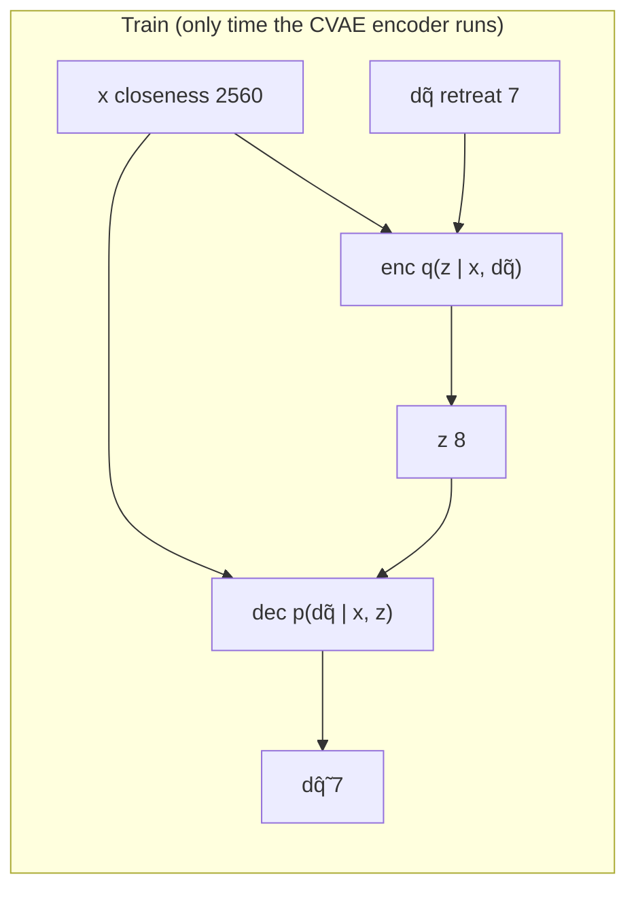
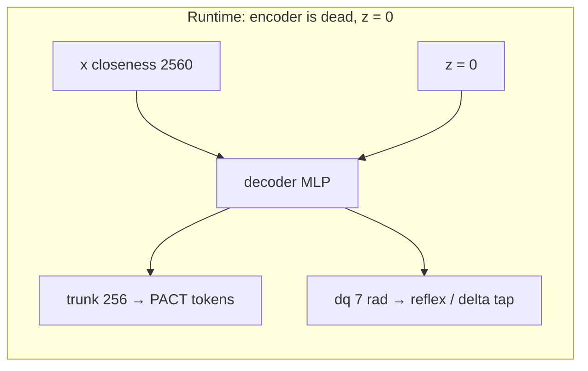
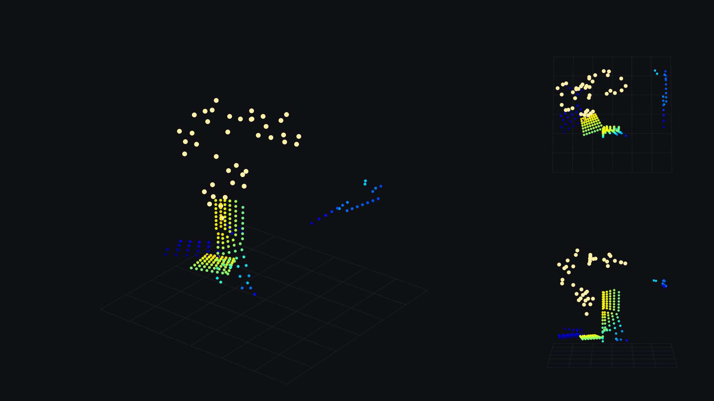
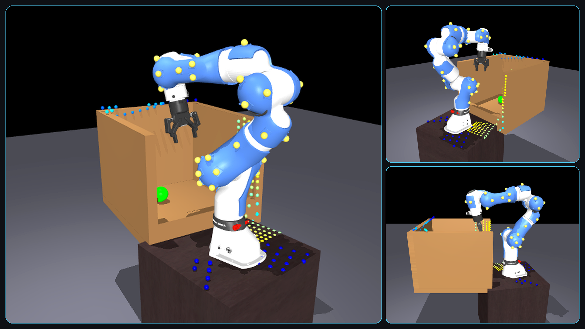

# prox_learning — proximity-skin sensing & safety for the Franka FR3

A Franka FR3 wearing **40 proximity sensors** in MuJoCo, plus the policies and analysis that
answer one question: *does a proximity skin make a robot arm safer when the cameras cannot see
the obstacle?*

<p align="center">
  <a href="experiments_output/default/environment_viz/FrankaSkinCabinetCavitySmokeConfig/cabinet_cavity_house_0/sample_00/01_robot_scene.png">
    
  </a>
</p>
<p align="center">
  <sub>Canonical 40-sensor hybrid skin in a cabinet-cavity task — three automatically selected, text-free views.</sub>
</p>

**Current answer (2026-07-05, 50 rollouts per cell):** yes, on the safety axis. A vision-only ACT
policy collides in **66%** of episodes when a hazard bar is hidden from the cameras. The same
policy with a raw-skin token collides in **40%** (Fisher p = .016). Success rate is unchanged.
Everything else in this repo is either the machinery that produced that number, or a follow-up
that did not work.

For the plain-language version of the science, read **`STATUS.md`**. For the latest written
report, read **`reports/2026-08-14/report.md`**. For why PACT success is flat and how to
beat ACT on **collision avoidance**, read **`PACT.md`**. For a copy-paste brief for a
paper-writing agent (claim fence), read **`paper.md`**. This file is the manual: what
every file is, what to run, and what will bite you.

---

## Contents

1. [Routing table — "I want to…"](#1-routing-table--i-want-to)
2. [How the three pipelines fit together](#2-how-the-three-pipelines-fit-together)
3. [Setup and environment](#3-setup-and-environment)
4. [Repo map](#4-repo-map)
5. [File-by-file: `scripts/`](#5-file-by-file-scripts)
6. [File-by-file: `submodules/act` (the policy)](#6-file-by-file-submodulesact-the-policy)
7. [File-by-file: `submodules/molmospaces` (the simulator)](#7-file-by-file-submodulesmolmospaces-the-simulator)
8. [File-by-file: models and assets](#8-file-by-file-models-and-assets)
9. [Data formats](#9-data-formats)
10. [Method & math — the Safety-CVAE](#10-method--math--the-safety-cvae)
11. [Recipe A — Safety-CVAE and the demos](#11-recipe-a--safety-cvae-and-the-demos)
12. [Recipe B — datagen](#12-recipe-b--datagen) · [12.1 Cluttered-bay pick-and-place](#121-cluttered-bay-pick-and-place)
13. [Recipe C — ACT and PACT](#13-recipe-c--act-and-pact)
14. [Every number in one place](#14-every-number-in-one-place)
15. [Traps](#15-traps)
16. [Decision log](#16-decision-log)
17. [Repo state and housekeeping](#17-repo-state-and-housekeeping)

---

## 1. Routing table — "I want to…"

| I want to… | run | section |
|---|---|---|
| understand the result in plain English | read `STATUS.md` | — |
| why PACT success is flat / beat ACT on collisions | read `PACT.md` | [13](#13-recipe-c--act-and-pact) |
| feed a paper-writing agent (claim fence) | read `paper.md` | — |
| read the latest progress report | `reports/2026-08-14/report.md` | — |
| collect new demonstrations | `python -m molmo_spaces.data_generation.main <Config>` | [12](#12-recipe-b--datagen) |
| inspect datagen environments before collecting | `python scripts/datagen/visualize_environment.py --list` | [12](#inspect-environments-before-collection) |
| render every unique datagen environment (hybrid skin + 4 text-free products) | `python scripts/datagen/visualize_environment.py --all --show-hidden` | [12](#inspect-environments-before-collection) |
| collect cluttered pick-and-place | `… main FrankaSkinHybridClutterPnPConfig` | [12.1](#121-cluttered-bay-pick-and-place) |
| convert demos into training files | `python -m scripts.convert_obstacle_to_act` | [13](#13-recipe-c--act-and-pact) |
| convert coauthor place-corridor rows | `python -m scripts.convert_pact_place_to_act` | [13.1](#131-coauthor-place-corridor-pact_place_corridor_v5) |
| train a policy | `submodules/act/imitate_episodes.py` | [13](#13-recipe-c--act-and-pact) |
| test a policy | `eval_act_obstacle.py` / `eval_act_place_corridor.py` | [13](#13-recipe-c--act-and-pact) / [13.1](#131-coauthor-place-corridor-pact_place_corridor_v5) |
| compare two result folders | `scripts/compare_pact.py` | [13](#13-recipe-c--act-and-pact) |
| train a surface encoder from native skin rows | `python -m encoders.train` | [4](#4-repo-map) |
| train the reflex net | `scripts/safety_sweep.py` → `scripts/train_safety_cvae.py` | [11](#11-recipe-a--safety-cvae-and-the-demos) |
| encode live skin (peak closeness or surface geometry) | `from encoders import load_encoder` | [4](#4-repo-map) |
| understand the CVAE (what it encodes, why, every tensor shape) | read [§10](#10-method--math--the-safety-cvae) | [10](#10-method--math--the-safety-cvae) |
| make a demo video | `scripts/safety_*_demo.py` | [11](#11-recipe-a--safety-cvae-and-the-demos) |
| make paper figures | `scripts/figures.py --list` | [5](#5-file-by-file-scripts) |
| rebuild the 40-sensor arm | `scripts/build_hybrid_on_franka_skin.py` | [8](#8-file-by-file-models-and-assets) |
| know what a file is | — | [5](#5-file-by-file-scripts)–[8](#8-file-by-file-models-and-assets) |
| free disk space | `scripts/housekeeping.sh` | [17](#17-repo-state-and-housekeeping) |

---

## 2. How the three pipelines fit together

```
             submodules/molmospaces              scripts/              submodules/act/
             ──────────────────────              ────────              ───────────────
 MJCF arm ─► <Config> datagen run ─► assets/datagen/<run>/*.h5
   │                                        │
   │                                        ├─► safety_sweep.py ─► sweep.h5 ─► train_safety_cvae.py
   │                                        │                                     └─► assets/safety/cvae_v3/
   │                                        │                                           │ (frozen)
   │                                        │                                           ▼
   │                                        └─► convert_obstacle_to_act.py ─► act_style_data/<ds>/
   │                                                   (--with_proximity)          │
   │                                                                               ▼
   └──────────────── same env reused for eval ◄─── imitate_episodes.py ─► ckpts/<task>/<run>/
                                  │                                               │
                                  └──────────► eval_act_obstacle.py ◄─────────────┘
                                                        │
                                                        ▼
                                        eval_output/<run>_<cell>/eval_summary.json
                                                        │
                                                        ▼
                                                 compare_pact.py
```

Three things share one dataset: the **Safety-CVAE** (a reflex net trained by distillation), the
**vanilla ACT baseline** (cameras + joints only), and **PACT** (ACT plus a proximity token).

---

## 3. Setup and environment

```bash
conda activate mlspaces
```

All rendering is headless offscreen EGL. Prefix every render/datagen/train/eval command with:

```bash
OMP_NUM_THREADS=2 MUJOCO_GL=egl PYOPENGL_PLATFORM=egl
```

Two facts about the environment that are not obvious and matter a lot:

- **`~/.bashrc` exports `MLSPACES_ASSETS_DIR=/home/jaydv/code/prox_learning/assets`.** This repo's
  `assets/` directory *is* the MolmoSpaces asset root. That is why datagen output lands inside
  the repo, and why `assets/{scenes,objects,grasps,test_data,benchmarks}` are symlink farms into
  `~/.cache/molmo-spaces-resources/`.
- **`pyproject.toml` is not installed and is not meant to be.** It declares
  `[tool.setuptools] py-modules = []` — "a collection of scripts + assets, not an importable
  package". The `mlspaces` conda env supplies the dependencies. Scripts import each other by
  doing `sys.path.insert(0, Path(__file__).parent)` and then importing siblings as top-level
  modules, which is what creates `scripts/__pycache__`.

One-time extras the `mlspaces` env is missing for ACT:

```bash
pip install ipython          # ACT + DETR import it
pip install wandb && wandb login   # training logs to wandb by default; --no_wandb opts out
```

`dm_control` is not needed — the ALOHA-only import is optional.

---

## 4. Repo map

```
README.md            this manual
STATUS.md            the same project in plain language — read this first if you are lost
CLAUDE.md            agent working agreement
pyproject.toml       dependency declaration (NOT installed; see §3)

scripts/             28 analysis / training / figure scripts + housekeeping.sh   §5
encoders/            skin front-ends: peak closeness + surface geometry          §4
tests/               unit tests for the skin encoders and PACT-raw math
submodules/act/      ACT fork — trains and evaluates the policies                §6
submodules/molmospaces/  the simulator + demonstration collection                §7
submodules/MolmoBot/ unused; nothing in this project imports it

assets/              MolmoSpaces asset root AND this project's artifacts         §8
  robots/franka_skin/model_hybrid.xml    the 40-sensor arm — the canonical model
  safety/                            leftover CVAE sweeps + old reflex demos (weights deleted)
  datagen/                               collected demonstration datasets
franka_assets/       mesh store; reached only through symlinks — DO NOT DELETE   §8
act_style_data/      converted ACT training sets (obstacle_prox_v2 only; see §17)
eval_output/         rollout videos — mostly pruned; the metrics live in reports/ now
experiments_output/  per-run output folders (sweep.h5, cvae/, demos/, figures/)
diagnostics_output/  committed legacy renders (242 tracked files)
reports/2026-08-14/  the current progress report
paper/               one section draft
synthetic_verify/    proximity ground-truth check (29-sensor era)

reports/eval_summaries/  all 24 eval_summary.json, archived out of eval_output/
train_blur_baseline.sh   trains one vanilla arm per constant blur sigma
eval_blur_baseline.sh    the 9-condition blur test + summary table
```

### Skin encoders (`encoders/`)

Two front-ends, named by **job**. Same live tensor `(B, 40, 8, 8)` metres. Run from the repo root
so `encoders` imports (this repo is not an installed package — §3).

| name | file | job | out | weights |
|---|---|---|---|---|
| `peak_closeness` | `encoders/peak_closeness.py` | per-sensor peak closeness, 50 cm cap | `(B, 40, 1)` in `[0, 1]` | none (headline PACT-raw) |
| `cvae_trunk` / `cvae_delta` | same file | frozen Safety-CVAE retreat taps | `(B, 1, 256)` / `(B, 1, 7)` | `model.pt` dir (deleted; negative controls) |
| `nearest_surface` | `encoders/surface_geometry.py` | nearest in-range XYZ, 20 cm cap | `(B, 40, 3)` metres | frozen `pact_surface_encoder_v1` |
| `surface_embedding` | same file | 32-d geometry embedding | `(B, 40, 32)` | frozen `pact_surface_embedding_encoder_v1` |

```python
from encoders import load_encoder, list_encoders

prox = ...  # (B, 40, 8, 8) metres — same array PACT trains on

raw = load_encoder("peak_closeness")                 # no checkpoint
feat = raw.policy_features(prox)                     # (B, 40, 1)

geom = load_encoder("nearest_surface", checkpoint="surface_v1.pt")
xyz = geom.policy_features(prox)                     # (B, 40, 3)

# datagen episodes keep 4 subframes: (T, 40, 4, 8, 8) metres
xyz_ep = geom.encode_episode(episode)                # (T, 40, 3), real causal windows
```

```bash
conda activate mlspaces
cd /home/jaydv/code/prox_learning
python -m encoders          # prints names + dummy-tensor shapes
python -m pytest tests/test_encoders.py tests/test_prox_raw.py
```

Aliases: `raw` → `peak_closeness`, `xyz` → `nearest_surface`, `embedding` → `surface_embedding`.
Without a geometry checkpoint the conv-transformer is random (shapes still work). Peak-closeness
never needs weights. **Do not mix the closeness maps:** peak-closeness uses `D_MAX = 0.5 m`;
surface geometry uses `MAX_SURFACE_RANGE_M = 0.20 m` (trap 16).

PACT train/eval still `import prox_cvae` for the raw path. `submodules/act/prox_cvae.py` is a
shim to `encoders/peak_closeness.py`. Geometry is wired through `encoders.pact.build_pact_encoder`.

Precompute frozen 32-d tokens into an already-converted ACT dataset:

```bash
python -m encoders.encode_tokens \
    --dataset-dir act_style_data/obstacle_prox_v2 \
    --checkpoint path/to/pact_surface_embedding_encoder_v1.pt \
    --kind embedding
```

Train your own 32-d surface encoder directly from native corridor rows (no ACT
convert). Labels come from each sensor's latest 8×8 depth tile: nearest XYZ
inside 20 cm, valid/empty, and latest closeness-map reconstruction. Split is
80/10/10 train/validation/test **by episode**, not by frame. Default sampler
gives valid and empty tiles equal training mass; validation uses the natural
~11% valid rate and calibrates the validity threshold. Test remains untouched
until the best checkpoint is selected.

```bash
conda activate mlspaces
cd /home/jaydv/code/prox_learning
python -m encoders.train \
    --src data/pact_place_corridor_v5 \
    --out experiments_output/default/surface_encoder_train/pact_place_corridor_v5 \
    --kind embedding --device cuda \
    --epochs 20 --batch-size 512 --stride 4 --num-workers 8
```

This uses about 3–4 GB host RAM. Outputs: best loadable
`pact_surface_embedding_encoder_v1.pt`, `last.pt`, held-out split/config,
`history.json`, `test_metrics.json`, and `curves.png`. The checkpoint stores its
calibrated validity threshold. Do not judge it by raw accuracy alone:
always-invalid already gets about 89%. Read test balanced accuracy,
precision/recall, and XYZ MAE.

```bash
CKPT=experiments_output/default/surface_encoder_train/pact_place_corridor_v5/pact_surface_embedding_encoder_v1.pt
python -m encoders.probe \
    --src data/pact_place_corridor_v5 \
    --checkpoint "$CKPT" --split test \
    --kind embedding --device cuda --untrained-episodes 0
```

First gate before baking ACT tokens: held-out balanced validity accuracy at
least 95%, recall at least 90%, and XYZ MAE preferably below 20 mm. If the gate
fails, do not call the embedding useful. `--sensor-balance` is an ablation for
rare valid sensors; `--no-balance-valid` trains on the natural class mix.

**152-episode run (2026-08-25).** Ckpt
`experiments_output/default/surface_encoder_train/pact_place_corridor_v5/pact_surface_embedding_encoder_v1.pt`.
`encoders.probe --split test` matches the trainer: 100% balanced validity and
recall, recon pixel P/R 87.4/95.3%, XYZ MAE **20.6 mm** (0.6 mm over the 20 mm
preference). Hard gate pass; bake is allowed as an **ablation** only. This does
not beat PACT-raw on policy. ACT `load_data` still shuffles 80/20 by episode
index — reuse `split_manifest.json` before any `--prox_feature surface_embedding`
train, or encoder-fit leaks into policy val. Converted hdf5 is already at
`act_style_data/pact_place_corridor_v5`. Bake after that split wire:

```bash
python -m encoders.encode_tokens \
    --dataset-dir act_style_data/pact_place_corridor_v5 \
    --checkpoint experiments_output/default/surface_encoder_train/pact_place_corridor_v5/pact_surface_embedding_encoder_v1.pt \
    --kind embedding
```

Probe the coauthor corridor rows **before convert**. Native skin is `(T, 40, 4, 8, 8)` metres — real 60 Hz subframes, so the geometry net's 32-frame causal window is honest. Without `--checkpoint`, the command scores the analytic 20 cm nearest-surface *target* vs PACT-raw 50 cm peak closeness, and optionally runs an untrained net as a wiring check.

```bash
python -m encoders.probe \
    --src data/pact_place_corridor_v5 \
    --out experiments_output/default/surface_encoder_probe/pact_place_corridor_v5
# trained net, once you have the file:
python -m encoders.probe \
    --src data/pact_place_corridor_v5 \
    --checkpoint path/to/pact_surface_embedding_encoder_v1.pt \
    --kind embedding --device cuda
```

`--untrained-episodes 0` skips the random net. Convert (wrist-only, min-pool) is still `python -m scripts.convert_pact_place_to_act` if you want ACT hdf5 after the probe.

Train with the geometry net (live causal windows from raw `/observations/proximity`, or the
precomputed groups if present):

```bash
cd submodules/act
PYTHONPATH="$PWD:$PYTHONPATH" python imitate_episodes.py \
    --task_name obstacle_pact_v2 --policy_class ACT --use_proximity \
    --prox_feature surface_embedding \
    --prox_encoder_ckpt path/to/pact_surface_embedding_encoder_v1.pt \
    ...
```

`--prox_feature nearest_surface` is the 3-d XYZ front-end. Without `--prox_encoder_ckpt` the
conv-transformer is frozen-random (shapes work, features are noise).

---

## 5. File-by-file: `scripts/`

All 28 files parse and every sibling import resolves (re-checked 2026-08-16, after the cleanup).
Status is one of **ACTIVE** (part of a current recipe) or **ARCHIVE** (worked, but its era is
over). Nothing dead is left in this directory.

The datagen environment visualizer is **not** here. It lives at
`submodules/molmospaces/scripts/datagen/visualize_environment.py` — see [§12](#inspect-environments-before-collection).

### Core pipeline

| file | what it does | entry | status |
|---|---|---|---|
| `safety_sweep.py` | Renders 40 SPAD depths over replayed postures with hazard bars planted next to random sensors, and computes the analytic potential-field retreat labels. Writes the CVAE training set. | `--runs <datagen_dir> [--n 15000] [--out sweep.h5]` | ACTIVE |
| `train_safety_cvae.py` | Trains the Safety-CVAE (40×8×8 depth → 7-DoF retreat). Writes `model.pt`, `meta.json`, 4 diagnostic PNGs. | `--data <sweep.h5> [--out cvae/] [--epochs 60] [--no-wandb]` | ACTIVE |
| `safety_flinch_demo.py` | Bar marches down a forearm sensor's view axis; arm flinches and relaxes home. | `[--ckpt assets/safety/cvae_v3] [--obstacle bar\|sphere] [--clean]` | ACTIVE |
| `safety_react_demo.py` | Reactive avoidance layered on a recorded reach-grasp-lift — deviate and rejoin. | same + `[--mode sweep\|pick]` | ACTIVE |
| `safety_moving_demo.py` | Two bars patrol wrist→shoulder; each link tinted by its own proximity. | same + `[--secs 18]` | ACTIVE |
| `safety_orbit_demo.py` | One bar sweeps a half-circle over the arm's outward face, sliding elbow→wrist. | same + `[--arc 180] [--passes 3]` | ACTIVE |
| `safety_sphere_demo.py` | Flinch demo with a blue sphere — shape/colour-agnosticism proof. | `[--ckpt …] [--radius …]` | ACTIVE but redundant¹ |
| `figures.py` | All 29 paper figures. 6672 lines. | `--list \| --all \| <name> [--outdir DIR]` | ACTIVE |
| `hybrid_viz_lib.py` | Shared MuJoCo/EGL helpers: model build, 8×8 depth render, back-projection, scene primitives, the dark `STYLE` dict. Sets `MUJOCO_GL=egl` on import. | library — the most-imported module here | ACTIVE |
| `foxglove_viz.py` | Exports a datagen `.h5` (or a whole run dir) to one `.mcap`: robot meshes, proximity cloud, RGB video, joints, phase logs. | `--h5 <path_or_dir> [--out viz.mcap]` | ACTIVE |
| `build_hybrid_on_franka_skin.py` | Builds `model_hybrid.xml`, the canonical 40-sensor arm. No argparse — paths hardcoded. | `python scripts/build_hybrid_on_franka_skin.py` | ACTIVE |
| `housekeeping.sh` | Tiered disk cleanup. Dry-run by default. | `--tier1 [--apply]`, see §17 | ACTIVE |

¹ `safety_sphere_demo.py` is 294 lines reproducing `safety_flinch_demo.py --obstacle sphere`, and
it lacks `--clean`. The only thing keeping it alive is that Recipe A's loop names `sphere`.

**Demo import chain** (deliberate, not accidental duplication):
`safety_sweep` ← `safety_flinch_demo` ← `safety_react_demo` ← `safety_moving_demo` ← `safety_orbit_demo`.
Flinch is the base library (posture pick, aperture, render, mosaic, HUD). Keep them together.

### ACT / PACT tooling

| file | what it does | entry | status |
|---|---|---|---|
| `convert_obstacle_to_act.py` | Datagen run → ACT per-episode HDF5. `--with_proximity` adds the 40-sensor group. Prints the `num_episodes`/`episode_len` you paste into `constants.py`. | `--src <run_dir> --dst <out> [--with_proximity] [--image_h 240] [--image_w 320]` | ACTIVE |
| `convert_pact_place_to_act.py` | Coauthor HF `pact_place_corridor_v5` rows → ACT HDF5. Wrist RGB only + 40-sensor skin. Prints `num_episodes`/`episode_len`. | `--src data/pact_place_corridor_v5 --dst act_style_data/pact_place_corridor_v5 --with_proximity --prox_pool min` | ACTIVE |
| `probe_prox_decodability.py` | Go/no-go gate: is the planner's deflection linearly decodable from the frozen trunk feature? Prints AUC + PASS/FAIL. | `[--act-dir …] [--gate-label deflect\|bar] [--auc-gate 0.8]` | ACTIVE |
| `compare_pact.py` | Small-N statistics: Wilson CI, rate difference, Fisher exact. Reads no files — you type the counts. | `vanilla=11/50,30/50 pact_raw=9/50,20/50` | ACTIVE |
| `train_blur_baseline.sh` | One vanilla arm per constant blur sigma on `obstacle_prox_v2`. | `./train_blur_baseline.sh [2 4 8]` | ACTIVE |
| `eval_blur_baseline.sh` | Evaluates every `*blurC*_v2` ckpt across three cells, prints a summary table. | `./eval_blur_baseline.sh [N=50] [cells…]` | ACTIVE |

### Model build and verification

| file | what it does | status |
|---|---|---|
| `test_and_reconstruct_hybrid.py` | Four-part reconstruction suite. **Its `main()` is archive, but `figures.py` imports `gt_boxes`/`cloud_error`/`cloud_panel` from it at module scope** — do not delete. | ACTIVE as library |
| `verify_hybrid_skin_sensors.py` | Per-sensor QA of all 40 SPADs: self-hit, outward normal, known-distance plate, cloud-vs-geometry error. Re-run after any sensor change. | ARCHIVE |
| `convert_hybrid_skin_urdf.py` | URDF → visual-only MJCF with 40 cameras. Superseded by `build_hybrid_on_franka_skin.py`; its output model has no consumer. | ARCHIVE |
| `build_photoshoot_skin.py` | Cosmetic model with red SPAD dots for paper renders. | ARCHIVE |
| `photoshoot_sweep.py` | Studio renders of `model_photoshoot.xml`: turntable, pose strip, hero shot. | ARCHIVE |

### Dataset analysis (all pre-`figures.py` era)

| file | what it does | status |
|---|---|---|
| `analyze_obstacle_dataset.py` | Six-check validation of `hybrid_obstacle_v1`: bar rate, deflect-vs-free, prox separation, contact safety. | ARCHIVE |
| `analyze_dataset.py` | Generic 6-domain sweep of a pick-and-place run. **29-sensor era** (`LINKS = 2/3/5/6`). | ARCHIVE |
| `dataset_probes.py` | Four advisor-spec probes on the enclosure dataset. **29-sensor era.** Superseded by `probe_prox_decodability.py`. | ARCHIVE |
| `decorr_heatmap.py` | Per-scene correlation heatmap: hidden geometry vs camera-visible params. Hardcoded three-run study. | ARCHIVE |
| `plot_mindist_traces.py` | Min-skin-distance traces per behavior class. **Same three hardcoded runs and same output dir as `decorr_heatmap.py`** — these two should be one script. | ARCHIVE |
| `proximity_necessity.py` | How often vision loses the target while the skin still has signal. Its own docstring records the conclusion that pushed the project from pick-and-place to enclosures. | ARCHIVE |
| `enclosure_report.py` | Date-tagged report bundle for an enclosure run. Shells out to `dataset_probes.py`. | ARCHIVE |
| `cavity_scene.py` | Cabinet/drawer-cavity MJCF generator. Loads the **29-sensor** `model.xml`. Its geometry logic was absorbed into the MolmoSpaces cavity sampler. | ARCHIVE |
| `wandb_upload_dataset.py` | One-time upload of the frozen 2026-06-10 dataset to wandb. | ARCHIVE |

**Deleted 2026-08-16** (recoverable from git history at `f6a3085`):
`assemble_overnight_report.py` (read `20260610_hybrid_skin_rich/` — the directory is `20260611_…`,
and two of its inputs had no generator anywhere in the repo), `pointcloud.ipynb` (read
`assets/datagen/pick_planner_v1/…`, which does not exist; `ilab` kernel; superseded by
`foxglove_viz.py`), `blur_eval.log` (5.3 MB run log that should never have been committed).

### `figures.py` — the 334 KB file

Structurally trivial despite the size: **29 top-level `fig_*()` functions + a `REGISTRY` dict +
`main()`**. Every figure function is entirely self-contained — all its constants, scene geometry
and helpers are local to the function body (200–390 lines each). There is no shared internal
layer, which is the whole reason for the file size.

It was assembled by concatenating ~29 standalone scripts: lines 27–89 hold **24 separate
`from hybrid_viz_lib import …` statements**, `import sys` three times, and `from collections
import defaultdict` twice. Harmless, but that is the fingerprint.

**All 29 registry keys map to real functions, and all 30 output PNGs exist in
`experiments_output/v4/figures/`. Nothing in it is dead.**

CLI: `--list`, `--all`, positional names, `--outdir` (rebinds the module-global `_FIGROOT`, which
every function reads as its `OUT`). Undocumented env override: `PROX_FIG_OUT`. Unknown keys warn
and are skipped rather than erroring. With no arguments at all it falls through to `--list`.

**Naming is inconsistent in 12 of 29 cases** — the registry key, the function name and the output
filename disagree, and the `make_` / `fig_` / `panel_` / `env_` / `proof_` / `viz_` / `render_`
prefixes carry no meaning. You cannot predict the output filename from the CLI key. Examples:

| CLI key | output PNG |
|---|---|
| `proof_whole_arm_clearance` | `use_whole_arm_clearance.png` |
| `make_pipe_tunnel_fig` | `env_pipe_tunnel.png` |
| `viz_peg_forest` | `env_peg_forest.png` |
| `make_acc_range_linearity` | `acc_range_linearity_perlink.png` |
| `fig_hood_narrow` | `hood_narrow.png` (function is `fig_fig_hood_narrow()`) |

Groups: sensor characterisation (`panel_single_sensor_anatomy`, `panel_plane_distance_sweep`,
`panel_plane_tilt_sweep`, `panel_range_accuracy_scatter`, `acc_angular_resolution`,
`make_acc_range_linearity`, `proof_acc_repeat`) · why skin is needed (`panel_coverage_behind`,
`panel_need_vision_vs_skin`, `panel_need_blur_and_dark`) · use cases (`proof_whole_arm_clearance`,
`panel_clearance_controller`) · reconstruction (`panel_known_shapes_cloud`,
`panel_cavity_reconstruction_3d`, `test_reconstruct_fumehood` — the only two-output figure) ·
environments (`make_pipe_tunnel_fig`, `panel_env_cluttered_shelf`, `env_corner_cavity_hero`,
`env_narrow_slot`, `env_overhang_fig`, `viz_peg_forest`) · fume hoods (`fig_hood_narrow`,
`fig_hood_tall`, `fumehood_std_fig`, `fumehood_short_low_sash_fig`,
`fumehood_var_hood_deep_tunnel`) · galleries (`panel_sensor_gallery`, `render_hybrid_skin_rich`,
`render_hybrid_skin_viz`).

### Known duplication in `scripts/`

| group | what actually differs | verdict |
|---|---|---|
| `safety_sphere_demo.py` vs `safety_flinch_demo.py --obstacle sphere` | Nothing meaningful. Sphere-demo uses a dedicated mocap body; flinch converts bar geoms in place and also supports `--clean`. | delete the sphere script |
| `decorr_heatmap.py` + `plot_mindist_traces.py` | Identical hardcoded run dict, identical output dir, both re-implement `decode_scene`/`decode_blob`. Only the plot differs. | merge behind `--plot {decorr,mindist}` |
| `analyze_dataset.py` + `analyze_obstacle_dataset.py` | ~120 lines of copy-pasted HDF5 decode helpers. The checks genuinely differ. | extract the helpers, keep both |
| `build_hybrid_on_franka_skin.py` + `convert_hybrid_skin_urdf.py` | Both parse the same URDF and place 40 cameras. The converter builds visual-only from scratch; the builder grafts onto the proven functional base. | converter is superseded |
| depth-render helpers | `hybrid_viz_lib`, `verify_hybrid_skin_sensors`, `photoshoot_sweep`, `safety_sweep`, `foxglove_viz` each carry their own `build`/`set_pose`/`backproject`. | low priority — refactoring risks the demos |

### Dead references (verified by `stat`, not inferred)

- `fov_coverage_map.png`, `use_cloud_accumulation.png` — the PNGs exist but **no generator survives
  anywhere in the repo**; these two figures cannot be rebuilt. (They were the outputs of the
  now-deleted `assemble_overnight_report.py`, which could not run either.)
- `foxglove_viz.py:5` docstring → `scripts/foxglove_layout.json` — does not exist (docs only).
- `safety_sweep.py:32` usage example → `assets/datagen/hybrid_pnp5_mass/…` — the data actually
  lives under `assets/prox_learning_data/`.
- `scripts/__pycache__/` holds `.pyc` for 7 deleted scripts (`convert_pla_to_act`,
  `convert_smoke_to_act`, `foxglove_dashboard`, `lock_clutter_bins`,
  `panel_env_cluttered_shelf`, `sensor_usage_timeline`, `visualize_skin_test_data`) — fossils of
  the June cleanup.

---

## 6. File-by-file: `submodules/act` (the policy)

Fork of Tony Zhao's ACT. Upstream ends at `742c753` (2024-01-28); every commit after it belongs to
this project. The fork adds proximity fusion (PACT), a real in-env evaluator, and the blur /
modality-dropout curricula.

> **The parent repo's submodule pointer is stale:** it records `ec44793`, the checkout is at
> `830fc2b`. That is the `M submodules/act` in `git status`. Fix with `git add submodules/act`.

### Fork-touched files

| file | what it is | status |
|---|---|---|
| `imitate_episodes.py` | **Training entry point.** All ACT + PACT training. | modified (+360) |
| `eval_act_obstacle.py` | **Canonical in-env evaluator** for the fumehood obstacle pick. | fork-new |
| `eval_act_place_corridor.py` | In-env evaluator for `pact_place_corridor_v5`. Wrist-only. Needs molmospaces worktree at 977acd6. | fork-new |
| `prox_cvae.py` | Shim → `encoders/peak_closeness.py`. PACT still imports this name. | fork-new |
| `constants.py` | `TASK_CONFIGS` lookup table. | modified (+102) |
| `utils.py` | `EpisodicDataset`, `get_norm_stats`, `load_data`. Pads to `num_queries`, not `episode_len`, so variable-length episodes work. | modified |
| `policy.py` | `ACTPolicy` wrapper; gains `proximity_positions=` and `image_dropped=`. | modified (+31) |
| `detr/main.py` | DETR argparse. **Must re-declare every fork flag as a no-op**, because `build_ACT_model_and_optimizer` re-parses all of `sys.argv`. | modified (+50) |
| `detr/models/detr_vae.py` | The CVAE policy; `input_proj_proximity`, sized `additional_pos_embed`. | modified (+135) |
| `detr/models/transformer.py` | Where prox tokens are concatenated into encoder memory. | modified (+17) |
| `detr/models/backbone.py`, `position_encoding.py` | Cosmetic: relative imports, optional IPython. | modified |
| `eval_train_set.py` | Open-loop train-set L1 — separates underfitting from covariate shift. | fork-new, works |
| `attn_heatmap.py` | Decoder cross-attention overlays on failure rollouts. | fork-new, works |

### Upstream ALOHA files, unused here

`sim_env.py`, `ee_sim_env.py`, `scripted_policy.py`, `record_sim_episodes.py`,
`visualize_episodes.py` (only `save_videos` is imported), `detr/models/__init__.py`,
`detr/setup.py`, `detr/util/*`.

### The eval scripts — there is now exactly one

**`eval_act_obstacle.py`** is the only evaluator. It has PACT support, collision metrics,
`--eval_cell`, `--eval_blur_sigma`, `--end_on_collision`, the `viz_sensor_rgb=False` OOM guard,
`eval_summary.json` output, and the fixed `--temp_agg_off`.

**Deleted 2026-08-16** (recoverable from the ACT fork's history at `20cfa94`). All five referenced
only each other; `eval_act_obstacle.py` imports none of them and still runs.

| file | why it went |
|---|---|
| `eval_act_with_prox.py` | **Was broken.** Imported `pla.prox_residual_head`; no `pla/` package exists, so it had not been runnable since that package was removed. It implemented the superseded design — a residual head bolted onto the action chunk, rather than in-transformer conditioning. |
| `eval_act_house1.py` | The abandoned mug task. |
| `eval_act_house1_dup250.py` | One-off; its dataset is gone. |
| `eval_act_house10_cup.py` | Copy of house1, different house/object. Never had a `TASK_CONFIGS` entry. |
| `eval_act_mug_random.py` | Mug task, `samples_per_house=1`. |

`constants.py` was pruned in the same commit: seven of its ten `TASK_CONFIGS` entries pointed at
`act_style_data/` directories that no longer exist. The three obstacle tasks remain, and their
dataset paths are now derived from the file's own location instead of a hardcoded
`/home/jaydv/code/prox_learning`.

### How proximity actually enters the network

The CVAE is **not** a skin autoencoder. Full story, every tensor, and *why* the skin is
encoded at all: [§10](#10-method--math--the-safety-cvae). Short version used by PACT:

1. `(B, 40, 8, 8)` raw depths **in metres** come out of the dataloader.
2. `PeakClosenessEncoder` (`ProxCVAEEncoder` alias in `encoders/peak_closeness.py`) featurises to closeness `c = clip(1 − d/0.5, 0, 1)`, with `c[d < 0.005] = 0`.
3. One of three taps:

| `--prox_feature` | computation | shape | dim |
|---|---|---|---|
| `raw` | per-sensor peak closeness — **bypasses the CVAE entirely** | `(B,1,40)` | 40 |
| `trunk` | CVAE decoder trunk hidden activation at `z=0` | `(B,1,256)` | 256 |
| `delta` | CVAE output × `label_scale` — the literal 7-DoF joint retreat | `(B,1,7)` | 7 |

4. `input_proj_proximity = Linear(feat_dim, K*hidden_dim)` reshaped to K tokens
   (`--prox_tokens_per_sensor`, default 8).
5. `transformer.py` **concatenates** them into encoder memory:
   `[latent, proprio, prox_1..prox_K, image_tokens…]`. With two 240×320 cameras the image side is
   160 tokens, so proximity is 8 of 170.
6. Position info is a **learned** `additional_pos_embed = Embedding(2 + N*K, hidden)`, added to
   queries and keys only (standard DETR), never to values.

Only `input_proj_proximity` and the extra positional-embedding rows train. The CVAE is frozen,
`eval()`, `requires_grad_(False)`, and lives *outside* the policy checkpoint. With
`n_proximity_sensors=0` the model is bit-identical to vanilla ACT. Training writes
`prox_config.json` into the checkpoint dir and `eval_act_obstacle.py` auto-detects it, so
train/eval parity needs no flags.

### `TASK_CONFIGS` — what actually resolves

| task name | dataset dir | eps | len | on disk? |
|---|---|---|---|---|
| `obstacle_baseline` | `act_style_data/obstacle_v1` | 100 | 169 | **yes** |
| `obstacle_pact` | `act_style_data/obstacle_prox_v1` | 100 | 168 | **yes** |
| `obstacle_pact_v2` | `act_style_data/obstacle_prox_v2` | 105 | 185 | **yes** |
| `pact_place_corridor_v5` | `act_style_data/pact_place_corridor_v5` | paste from convert | paste from convert | after convert |
| `SIM_TASK_CONFIGS` (4 ALOHA tasks) | `DATA_DIR` | — | — | **no — dead, kept only because three upstream files import the name** |

Seven further entries (`test`, `proximity_learning`, `pla_house1_mug`, `pla_smoke`,
`pla_house1_mug_random`, `pla_house3_mug_random`, `pla_houses_1_3_mug_random`) all pointed at
deleted `act_style_data/` directories and were removed on 2026-08-16. Paths are now built from
`ACT_DATA_DIR = REPO_ROOT / 'act_style_data'` rather than hardcoded.

`episode_len` is only read by the dead `--eval` path; the dataloader pads to `chunk_size`. The
169-vs-168 discrepancy for the same source run is a harmless off-by-one.

### Training flags worth knowing

| flag | default | what it does |
|---|---|---|
| `--use_proximity` | off | turns on the PACT path |
| `--prox_feature` | `raw` | `raw` / `trunk` / `delta` (see above). **Train `raw`.** `trunk` is a negative control. |
| `--prox_layout` | `per_sensor` | `per_sensor` = 40 named tokens; `global` = one mashed vector (old published run) |
| `--prox_encoder_ckpt` | empty | only for trunk/delta; raw needs none |
| `--prox_tokens_per_sensor` | 8 | K. `per_sensor` clamps 8 → 1 unless you pass another K |
| `--blur_sigma0` | 0 | Gaussian blur strength on camera frames at training time |
| `--blur_mode` | `curriculum` | `curriculum` anneals `σ·(1 − n/N)`; `constant` holds σ all run |
| `--blur_curriculum_steps` | half of total | N |
| `--image_dropout_p` | 0 | per-sample hard vision dropout. Headline PACT run: **0.3** |
| `--prox_dropout_p` | 0 | per-sample skin dropout, sampled disjointly from vision |
| `--image_dropout_mode` | `all` | `all` cameras or a `single` random one |
| `--no_zero_latent_on_drop` | off | ablation: keep the CVAE style latent on dropped samples |
| `--no_wandb` | off | wandb is ON by default |

Blur and dropout are **training-only**. Validation, best-checkpoint selection and eval always see
clean sharp frames.

### Eval flags worth knowing

| flag | default | what it does |
|---|---|---|
| `--ckpt_dir` | baseline path | the dated run folder holding `policy_best.ckpt` + `dataset_stats.pkl` |
| `--num_rollouts` | 25 | episodes in this process |
| `--eval_cell` | none | `visible` / `invisible` / `free` — pins every rollout to one obstacle cell |
| `--temp_agg_off` | off | open-loop chunking (see the trap in §15) |
| `--temp_agg_m` | 0.01 | temporal-aggregation weight when it is on |
| `--eval_blur_sigma` | 0 | blurs cameras at **inference**; skin and qpos untouched |
| `--end_on_collision` | off | strict safety: any contact is a failure and ends the episode |
| `--eval_sampler` | `invis` | which check sampler provides `--eval_cell`: `invis` (shallow side bars — v2/avoid ckpts) or `gate` (corridor pole — `obstacle_gate_v1` ckpts). Match the ckpt's training data. |
| `--live` | off | opens a MuJoCo viewer (desktop only, forces single-process) |
| `--house_ind` | 1 | ProcTHOR house; 1 (≡ 1 mod 24) is the red cup the data used |
| `--task_horizon` | 200 | max policy steps |

### Breakage and gotchas in the fork

Items 1–3 were fixed on 2026-08-16 (dead evaluators deleted, `TASK_CONFIGS` pruned to the three
tasks that resolve, the `build_combined_h1_h3.py` citation removed with its entry). What remains:

4. `imitate_episodes.py --eval` is dead for every fork task: it takes the real-robot branch and
   ImportErrors, and it never passes `proximity_positions`. **Always use
   `eval_act_obstacle.py` (obstacle pick) or `eval_act_place_corridor.py`
   (place-corridor).**
5. `detr/main.py` comments reference a `pact.act_prox` package that does not exist;
   `--prox_mapping_json` is a pure no-op consumed by nobody.
6. `prox_cvae.py`'s docstring says "two feature taps" — there are three; `raw` was added later.
7. Both cameras share **one** ResNet18 backbone (`build()` appends one, `forward` uses
   `backbones[0]`, marked `# HARDCODED`). Upstream behaviour, not a fork bug.
8. Upstream per-epoch train-summary slice bug at `imitate_episodes.py:626`.

---

## 7. File-by-file: `submodules/molmospaces` (the simulator)

A large library. You need about four of its sixteen packages.

| package | what you need from it |
|---|---|
| **`data_generation/`** | `main.py` (entry), `pipeline.py` (workers, rollout loop, saving), `config_registry.py`, **`config/object_manipulation_datagen_configs.py` — every config in this project**, `custom_scenes/` (the MJCF scenes: `fumehood.xml`, `fumehood_clutter.xml`, `enclosure_param.xml`, `panel_slalom.xml`, `cubby_overreach.xml`) |
| **`tasks/`** | `enclosure_reach.py` (samplers + experts + the obstacle policy), `house_embed.py`, `cavity_pick_task_sampler.py`, `pick_task.py`, `task.py` (step loop / sub-step recorder). The other ~27 files are unrelated tasks. |
| **`env/`** | `env.py` (`CPUMujocoEnv`, owns the proximity renderers), `sensors_cameras.py`, `sensors.py` |
| **`configs/`** | `abstract_exp_config.py` (global flags incl. `viz_sensor_rgb`), `camera_configs.py` (skin layouts), `robot_configs.py`, `task_sampler_configs.py`, `base_pick_config.py`, `policy_configs.py` |

Ignore: `molmo_spaces_isaac/`, `molmo_spaces_maniskill/`, `mlspaces_tests/`, `docs/`, `bin/`,
and within `molmo_spaces/`: `planner/`, `robots/`, `renderer/`, `controllers/`, `kinematics/`,
`grasp_generation/`, `housegen/`, `resources/`.

### Datagen configs relevant to this project

All live in `config/object_manipulation_datagen_configs.py`. **Every registered config is
concrete and runnable** — the "base" ones are simply configs that others also subclass.

**The live line — 40-sensor hybrid skin:**

| config | line | inherits | what it collects | output dir |
|---|---|---|---|---|
| `FrankaSkinHybridFumehoodSmokeConfig` | 2088 | `FrankaSkinFumehoodSmokeConfig` | fumehood reach; **switches to the 40-sensor hybrid skin**; turns on `viz_sensor_rgb` @256×256 | `datagen/hybrid_fumehood_smoke` |
| `FrankaSkinHybridPnP5Config` | 2104 | ↑ | fumehood pick with grasp-file grasps | `datagen/hybrid_pnp5` |
| `FrankaSkinHybridPnP5MassConfig` | 2153 | ↑ | 24 objects × 10 — fed `sweep_v1.h5` | `datagen/hybrid_pnp5_mass` |
| `FrankaSkinHybridObstacleCheckConfig` | 2190 | `HybridPnP5` | preflight, bar forced on | `datagen/hybrid_obstacle_check` |
| **`FrankaSkinHybridObstacleConfig`** | 2222 | ↑ | **the main ACT dataset.** 8 house indices × 25 | `datagen/hybrid_obstacle_v1` |
| `FrankaSkinHybridInvisObstacleCheckConfig` | 2262 | `HybridObstacleCheck` | preflight, bar present and invisible | `datagen/hybrid_invis_obstacle_check` |
| **`FrankaSkinHybridInvisObstacleConfig`** | 2293 | ↑ | **the v2 invisible-bar dataset** | `datagen/hybrid_invis_obstacle_v1` |
| `FrankaSkinHybridGateBarVisibleCheckConfig` | — | `InvisObstacleCheck` | **geometry debug.** Pole on and **rendered**. Run this before collect. | `datagen/hybrid_gate_bar_visible_check` |
| `FrankaSkinHybridGateBarCheckConfig` | — | ↑ | invisible preflight, same geometry | `datagen/hybrid_gate_bar_check` |
| **`FrankaSkinHybridGateBarConfig`** | — | ↑ | **v3.1 headline collect.** 8×25, INVIS_P=1, tall pole snapped onto the TCP line (§12.2) | `datagen/hybrid_gate_bar_v1` |
| `FrankaSkinHybridClutterPnPCheckConfig` | 2349 | `HybridObstacleCheck` | preflight, max clutter, bar on and invisible | `datagen/hybrid_clutter_pnp_check` |
| **`FrankaSkinHybridClutterPnPConfig`** | 2390 | ↑ | **cluttered-bay pick-and-place** (§12.1). Different scene: `fumehood_clutter.xml` | `datagen/hybrid_clutter_pnp_v1` |

Full chain: `HybridObstacle ← HybridObstacleCheck ← HybridPnP5 ← HybridFumehoodSmoke ←
FumehoodSmoke ← EnclosureSmoke ← CabinetCavitySmoke ← PickBaseConfig`. The two ClutterPnP configs
hang off `HybridObstacleCheck` as well, so they inherit the same 40-sensor robot and camera rig.

**The 29-sensor task-shape line** (`FrankaSkinEnclosureSmokeConfig` :1886,
`FrankaSkinEnclosureGenConfig` :1916, `FrankaSkinFumehoodSmokeConfig` :1944,
`FrankaSkinPanelSlalomSmokeConfig` :1969, `FrankaSkinCubbySmokeConfig` :1993, plus the three
`House*` variants at :2040/:2054/:2068 that embed the same task inside ProcTHOR rooms) produced the
June diagnostic datasets. Historic.

**Older lines still registered but with no data and no references:** the cavity/shelf/clutter/
pillar/real-table family (:1458–:1828) and the iTHOR pick-and-place family (:238–:743). Only
`FrankaSkinProxNecessityPilotConfig` from that era still has data on disk.

### Task samplers — the knobs you override

Chain: `PickTaskSampler → CavityPickTaskSampler → EnclosureReachSampler → FumehoodSampler →
BigFumehoodPickSampler → ObstacleFumehoodPickSampler → InvisibleObstacleFumehoodPickSampler →
ClutteredFumehoodPickPlaceSampler`. All in `tasks/enclosure_reach.py` except the last, which is in
`tasks/fumehood_clutter.py` (§12.1) — it inherits the whole chain, so `OBSTACLE_P` and `INVIS_P`
still work there unchanged.

| sampler | line | key class attributes (defaults) |
|---|---|---|
| `EnclosureReachSampler` | 113 | `MIXTURE=(("free",.28),("hidden",.33),("visible",.28),("abort",.11))`, `POOL_SIZE=24` |
| `FumehoodSampler` | 694 | `MIXTURE=(("free",.40),("hidden",.30),("visible",.15),("abort",.15))` |
| `BigFumehoodPickSampler` | 1025 | `MIXTURE=(("free",1.0),)`, `BASE_FWD=0.08`, `PICK_CATEGORIES=(mug,cup,apple,…)` |
| **`ObstacleFumehoodPickSampler`** | 1109 | **`OBSTACLE_P=0.75`**, `BAR_FACE_Y=(0.14,0.24)`, `BAR_X_FRAC=(0.20,0.55)`, `OBJ_GAP=(0.12,0.20)` |
| `ObstacleFumehoodPickCheckSampler` | 1169 | `OBSTACLE_P=1.0` |
| **`InvisibleObstacleFumehoodPickSampler`** | 1175 | **`INVIS_P=0.5`** (inherits `OBSTACLE_P=0.75`); hides bars by moving the geom to **group 4**; decouples object placement from bar presence (the v1 leak fix) |
| `InvisibleObstacleFumehoodPickCheckSampler` | 1237 | `OBSTACLE_P=1.0`, `INVIS_P=1.0` — this is what `--eval_cell` drives without `--eval_sampler gate` |
| **`GateObstacleFumehoodPickSampler`** | 1244 | **v3.1 headline.** `OBSTACLE_P=0.75`, `INVIS_P=1.0`, `GATE_HALF_Z=0.22`, `gate_block` snaps the pole onto the TCP line. Cup y decoupled; bow **sign** = wall coin-flip. |
| `GateObstacleFumehoodPickCheckSampler` | — | `OBSTACLE_P=1.0`, `INVIS_P=1.0` — `--eval_sampler gate` |
| `GateObstacleFumehoodPickVisibleCheckSampler` | — | `OBSTACLE_P=1.0`, `INVIS_P=0.0` — geometry-debug preflight only |

The matching expert is `ObstacleAwarePickPlannerPolicy` (`enclosure_reach.py`):
`GRIP_HALF=0.10`, `SAFE_GAP=0.08`, `PASS_SPEED=0.05`. On gate-bar episodes it first
snaps the pole onto the TCP line (`GATE SNAP` in the log), then bows. It reads
`scene_params["protr_center"]` and `["protr_half"]` — **never pixels** — and stamps
`behavior_class = "deflect"`; otherwise `"free"`.

### The sensor pipeline

1. **Declaration.** Each sensor is an MJCF camera with `is_proximity_sensor=True`
   (`configs/camera_configs.py:28`), `fov=45.0`, `record_depth=True`.
   - 29-sensor skin: `_SKIN_SENSOR_LINK_COUNTS = {2:7, 3:8, 5:6, 6:8}` (`camera_configs.py:389`).
   - **40-sensor hybrid:** `_HYBRID_SKIN_SENSOR_NAMES` (`:417`) = link1×7, link2×7, link3×5,
     link4×5, link5_front×4, link5_back×6, link6×6.
2. **Sub-step recording.** `_n_sim_steps_per_proximity = round(proximity_sensor_period_ms /
   sim_dt_ms)` (`tasks/task.py:56`). With `policy_dt_ms=66`, `sim_dt_ms=2`,
   `proximity_sensor_period_ms=16.6667` → 33 sim steps per policy step ÷ 8 = **4 sub-steps**.
   That is the `4` in the stored shape.
3. **Render.** `CPUMujocoEnv.record_proximity_depths` (`env/env.py:376`) uses a **dedicated 8×8
   renderer**, deliberately bypassing the 624×352 global one (wrong FOV on a non-square aspect).
   Scene option: `geomgroup[2]=0` (hide the cosmetic skin so sensors do not see themselves) and
   **`geomgroup[4]=1`** — which is exactly the mechanism the invisible-bar sampler exploits.
4. **Packaging.** `ProximityDepthBufferSensor` stacks to `(max_substeps, 8, 8)` float32 metres,
   left-padding by repeating the earliest frame rather than zeros (a zero would read as contact
   at 0 m).
5. **Written to** `obs/proximity/<sensor_name>` with shape `(T, 4, 8, 8)`.

### `viz_sensor_rgb` — the memory bomb

Defined at `configs/abstract_exp_config.py:57` (default `False`), turned **on** at
`object_manipulation_datagen_configs.py:2094` with `viz_sensor_resolution=(256,256)` — and
therefore inherited by every config in the hybrid/obstacle chain.

It adds 40 extra 256×256 RGB renders plus 40 depth reads **per policy step**, purely to produce
cosmetic skin mosaic videos. **It adds nothing to the HDF5** (verified: identical key sets with it
on and off). The pipeline retains each episode's full observation history in RAM until the whole
house finishes saving, so this costs **~3 GB/episode instead of ~0.5 GB** — enough to OOM-kill a
30-rollout eval on a 62 GB box. `eval_act_obstacle.py` forces it off; datagen does not, which is
why `num_workers <= 2` is the standing advice.

### Entry point

`main.py` takes **exactly one positional argument**, the config name — either `ConfigName` (which
imports every config module so the decorators fire) or `module.path:ClassName` (faster, avoids
unrelated import side-effects). **There is no way to override a config field from the command
line today**; edit the class or subclass it.

Output lands at `<output_dir>/<ConfigName>/<YYYYmmdd_HHMMSS>/`, plus
`experiment_config_<ts>.pkl` and `running_log.log`. Parallelism is `exp_config.num_workers`, and
work is distributed **at house granularity** — one house start-to-finish per worker. That is why
the obstacle configs list 8 wrap-around house indices (`1, 25, 49, …`, all ≡ 1 mod 24) for what is
really a single task: it is the only way to use more than one worker.

`setup_house_dirs` **skips a house whose h5 already exists** — that is the resume mechanism, and
also why re-running into an existing timestamped dir silently does nothing.

**Inspect the scene before collecting.** The script lives in the submodule, not under this
repo's `scripts/`: `submodules/molmospaces/scripts/datagen/visualize_environment.py`. It samples
the same config and task sampler as datagen, then renders. Full recipe in [§12](#inspect-environments-before-collection).

---

## 8. File-by-file: models and assets

### Robot models — verified by compiling each with MuJoCo, not by grep

| file | sensors | what makes it different | verdict |
|---|---|---|---|
| **`assets/robots/franka_skin/model_hybrid.xml`** | **40** (nsite 42, ncam 42, ngeom 71, nu 8) | The gentact hybrid dermis on links 1–6 with the link5 front/back split. Inlined Robotiq 2F-85. | **LIVE — the canonical model** |
| `assets/robots/franka_skin/model.xml` | 29 | The older skin (links 2/3/5/6). Attaches Robotiq by reference. | LIVE (legacy path — all non-hybrid configs) |
| `assets/robots/franka_skin/model_photoshoot.xml` | 0 cameras, 40 red decal geoms | Visual-only paper render. | LIVE, single consumer |
| `assets/robots/fr3_hybrid_skin/model.xml` | 40 cams, **nu=0**, no gripper | URDF→MJCF intermediate with hardcoded absolute `meshdir`. Its `meshes/skin/` is live build input; the model itself is loaded by nothing. | build intermediate |
| `assets/urdf/fr3_hybrid_skin.urdf` | — | Source of truth for the 40 sensor poses. | LIVE (build input) |
| `assets/robots/franka_skin/model.xml.bak_before_orientation_fix` | 29 | Byte-identical to `model.xml` except one attribute on all 29 cameras: `quat="0 1 0 0"` → `quat="0 0 1 0"`. That is the entire "orientation fix". | DEAD (keep as provenance) |
| `assets/mjcf/fr3_skin.xml`, `fr3_robotiq.xml` | 29 | **Fail to compile** — meshes point at a deleted `.mesh_cache`. | DEAD / broken |
| `assets/urdf/fr3_full_skin.urdf`, `fr3_full_skin_fixed.urdf`, `robotiq.urdf` | — | 29-sensor era. Zero references. | DEAD |
| `franka_assets/fr3_skin/model.xml` | 29 | Pre-orientation-fix copy with local mesh paths. | DEAD |
| `franka_assets/fr3_skin/scene.xml` | — | **Fails to compile** (self-referential relative path). | DEAD / broken |
| **`franka_assets/fr3_skin/{assets,skin_meshes,robotiq_2f85_v4}/`** | — | The actual 117 MB mesh store. | **LIVE — see warning below** |

> **`franka_assets/` has zero textual references in the entire repo.** It is reached only through
> symlinks: `assets/robots/franka_skin/{assets,skin_meshes,robotiq_2f85_v4}` →
> `../../../franka_assets/fr3_skin/*`. Any grep-based cleanup will conclude it is dead. Deleting it
> breaks the 40-sensor model.

**Build chain:** `assets/urdf/fr3_hybrid_skin.urdf` → `convert_hybrid_skin_urdf.py` →
`assets/robots/fr3_hybrid_skin/` (dermis STLs) → `build_hybrid_on_franka_skin.py` (rewrites
`franka_skin/model.xml`, deleting the four old `link*_skin` bodies) → **`model_hybrid.xml`** →
`build_photoshoot_skin.py` → `model_photoshoot.xml`.

*Open question:* `build_photoshoot_skin.py`'s docstring claims dense farthest-point tiling
(`TARGET_SPACING=0.02`, `MAX_PER_MESH=90` → hundreds of dots), but the committed
`model_photoshoot.xml` has exactly 40 and is smaller than `model_hybrid.xml`. Either the file
predates the dense version or the sampler silently fell back. Needs a re-run to settle.

### The Safety-CVAE weights (historical — checkpoints deleted 2026-08-24)

All three `model.pt` are 11,598,939 bytes with distinct md5s — same architecture
(`n_in=2560`, `n_out=7`, `z_dim=8`, `d_max_input=0.5`), different training runs.

| version | trained on | `label_scale` | best val MSE | close-cos | far-quiet |
|---|---|---|---|---|---|
| `cvae_v1` | `sweep_v1.h5` | 16.7436 | 0.011126 | 0.8912 | 0.03258 |
| `cvae_v2` | `sweep_v2.h5` | 14.6776 | 0.014584 | 0.8654 | 0.03603 |
| **`cvae_v3`** | `sweep_v3.h5` | **11.3593** | **0.009069** | **0.9255** | 0.03101 |

`cvae_v3/config.json`: `epochs=60, bs=512, lr=1e-3, beta=0.01, z_dim=8, d_max=0.5, seed=0,
n_train=13500, n_val=1500, active_latent_dims=1`.

**Sensor order** lives in `submodules/act/hybrid_skin_sensors.py`
(`HYBRID_SKIN_SENSOR_ORDER`). `link5_back` precedes `link5_front` — opposite the
env's `_HYBRID_SKIN_SENSOR_NAMES` tuple. Convert, train, and eval all use that
list. Never hand-roll it.

Safety-CVAE **weights were dropped 2026-08-24**. PACT-raw never ran them (peak
closeness). `trunk`/`delta` lost as policy features. Demos under
`scripts/safety_*_demo.py` need a retrain if anyone wants the reflex job back.
Sweep hdf5s in `assets/safety/sweep_v*.h5` are leftover training data for that
abandoned head.

Sweep provenance, read from the h5 attrs (all 15,000 samples, `d_act=0.18`, `mount_z=0.35`):

| sweep | source datagen run(s) |
|---|---|
| `sweep_v1.h5` | `prox_learning_data/FrankaSkinHybridPnP5MassConfig/20260612_023111` |
| `sweep_v2.h5` | `hybrid_obstacle_v1/…/20260612_183855` + `…/20260612_162142` + the PnP5Mass run |
| `sweep_v3.h5` | `hybrid_obstacle_v1/FrankaSkinHybridObstacleConfig/20260612_183855` only |

Demo artifacts in `assets/safety/`: each demo writes `<out>.mcap` plus a matching `.mp4`.
`flinch_demo_v1/_v2.mcap` are the same demo run against the v1/v2 weights. The four
`eval_*_sphere.*` files are the flinch/react/moving/orbit demos run with `--obstacle sphere`
(inferred — no script emits that prefix, but exactly those four declare the flag, which is also
why there is no `eval_sphere_sphere`).

### Datasets on disk

| dir | size | what | verdict |
|---|---|---|---|
| `assets/datagen/hybrid_obstacle_v1` | 1.19 GB | **The hot dataset.** 125 trajectories. Referenced by all five demos, `safety_sweep.py`, `convert_obstacle_to_act.py`, `probe_prox_decodability.py`, `constants.py`, and every README recipe. | **IN USE** |
| `assets/datagen/hybrid_invis_obstacle_v1` | 0.99 GB | The invisible-bar v2 collection (125 collected, 105 usable). | **IN USE** |
| `assets/prox_learning_data/FrankaSkinHybridPnP5MassConfig` | 1.26 GB | Source of `sweep_v1.h5` and part of `sweep_v2.h5` — both superseded. | historic |
| `assets/datagen/{cubby,panel_slalom,fumehood}_smoke` | 3.24 GB | June diagnostic three-scene study. | orphaned |
| `assets/datagen/{enclosure,house_fumehood,hybrid_fumehood,house_panel}_smoke` | 1.66 GB | Same era. | orphaned |
| `assets/datagen/enclosure_v1` | 0.86 MB | **Contains zero `.h5`** — only `.pkl`/`.log`. The 2160-episode run never produced trajectories. | failed collection |
| `assets/datagen/hybrid_{obstacle,invis_obstacle}_check` | 0.04 GB | Two-episode preflights. | orphaned |
| `assets/prox_learning_data/FrankaSkinProxNecessityPilotConfig` | 0.63 GB | Source for the `paper/` draft — whose analysis script `pla/audit_proximity.py` is deleted. | orphaned |
| `assets/prox_learning_data/.git` | **2.60 GB** | This directory is a clone of the HuggingFace dataset repo `git@hf.co:datasets/jdvakil/prox_learning_data`. Its LFS object store duplicates its own working tree. | re-cloneable |
| `assets/.lmdb` | **1.3 GB** | MolmoSpaces LMDB caches (objathor metadata 1.1 GB, scenes 215 MB). | rebuilt on demand |

### Everything else

| path | what it is |
|---|---|
| `assets/{scenes,objects,grasps,test_data,benchmarks}` | MolmoSpaces asset farm — real dirs or symlinks into `~/.cache/molmo-spaces-resources/`. **Live, keep.** |
| `assets/benchmark` (singular) | A different thing entirely from `benchmarks`: 57 MB of local datagen output from June. Orphaned. |
| `assets/eval_subsets` | Two hand-cut benchmark JSON subsets. Zero references. |
| `assets/mjthor_data_type_to_source_to_versions.json` | Asset-version manifest (live). The `.bak` beside it is byte-identical — delete. |
| `assets/README.md` | **Entirely stale** — describes a flow through `pla.sim.build_mjcf`, `pla.viz.sensor_overlay`, `scripts/verify_skin.py`, all three deleted. |
| `synthetic_verify/` | Proximity ground-truth check: ~40 mm mean abs error, ~−12 mm bias. Output dir of a molmospaces script. **29-sensor era**, not hybrid. |
| `paper/section3_proximity_signal_draft.md` | CoRL section draft. Cites `pla/audit_proximity.py`, which is deleted — **unreproducible as written**. |
| `.claude/` | Empty directory. |
| `.vscode/settings.json` | Two lines; the dir is gitignored anyway. |

---

## 9. Data formats

### Datagen HDF5 (what MolmoSpaces writes)

One file per house per batch: `house_<id>/trajectories_batch_1_of_1.h5`, top-level groups
`traj_0 … traj_{N-1}`. `T` = episode length, `S` = 4 sub-steps.

```
traj_<i>/
  obs/
    agent/qpos, agent/qvel                    (T, 2000)     uint8   ← zero-padded JSON
    extra/obj_start|obj_end|tcp_pose|
          grasp_pose|robot_base_pose          (T, 7)        float32  xyz + wxyz quat
    extra/grasp_state_pickup_obj              (T, 2000)     uint8   ← JSON
    extra/task_info                           (T, 4000)     uint8   ← JSON
    extra/policy_phase                        (T,)          int64    legend in obs_scene
    extra/policy_num_retries                  (T,)          int64
    extra/object_image_points/…/points        (T, 10, 2)    float32  84 subgroups
    proximity/<sensor_name>                   (T, 4, 8, 8)  float32  × 40  ← THE SKIN
    sensor_param/<cam>/intrinsic_cv           (T, 3, 3)     float64  × 42
    sensor_param/<cam>/extrinsic_cv           (T, 3, 4)     float64  × 42
    sensor_param/<cam>/cam2world_gl           (T, 4, 4)     float64  × 42
  actions/commanded_action|ee_pose|ee_twist|
          joint_pos|joint_pos_rel             (T, 2000)     uint8   ← JSON
  env_states/articulations/panda              (T, 31)       float32
  obs_scene                                   scalar        bytes   ← JSON, ~20 KB
  success|fail|terminated|truncated           (T,)          bool
  rewards                                     (T,)          float32
```

Three things that will bite you:

- **The `uint8 (T, 2000)` datasets are zero-padded UTF-8 JSON, not arrays.** Decode with
  `bytes(row).rstrip(b"\x00")` then `json.loads`.
- **There is no RGB or camera depth in the HDF5** — deliberate. Images live only as sibling MP4s
  in the same house dir.
- **`obs_scene` is where all the labels live**: `scene_params` (the sampler's θ — including
  `protrusion_present`, `bar_face_y`, `protr_center`, `protr_half`, `cam_visible`, and
  `bar_invisible` on invis runs), `behavior_class` ∈ `{free, deflect, abort}`, and
  `collision_metrics`. **`scene_params["cell"]` is NOT a usable label on obstacle runs** — the
  sampler sets it to `"bar"` to skip a raycast rejection loop. Use `protrusion_present` /
  `bar_invisible` / `behavior_class` instead.

### ACT-style HDF5 (what `convert_obstacle_to_act.py` writes)

`<dst>/episode_<g>.hdf5`, `g` contiguous across houses.

| key | shape | note |
|---|---|---|
| attr `sim` | bool | |
| `/action` | `(T, 8)` | arm 7 + gripper command (FR3 hand actuator at {0, 255}) |
| `/observations/qpos` | `(T, 9)` | arm 7 + 2 fingers |
| `/observations/qvel` | `(T, 9)` | read but unused |
| `/observations/images/exo_camera_1` | `(T, 240, 320, 3)` uint8 | |
| `/observations/images/wrist_camera` | `(T, 240, 320, 3)` uint8 | |
| `/observations/proximity` | `(T, 40, 8, 8)` float32 | only with `--with_proximity`; **raw metres**, un-normalised |

Sensors are stacked in `HYBRID_SKIN_SENSOR_ORDER` (`hybrid_skin_sensors.py`). The dataloader reads a single random frame per
sample, not the whole episode.

---

## 10. Method & math — the Safety-CVAE

This is the section that answers: *the proximity sensors are encoded — but encoded into what,
why, and with which shapes?*

### Read this first — two jobs, one set of weights

The Safety-CVAE is **not** an autoencoder of the skin. A vanilla VAE would compress the 2560
depth pixels into a latent `z` and then try to reconstruct those 2560 pixels. This network never
reconstructs the skin.

What it reconstructs is a **7-DoF joint-space retreat** `dq`. The skin is the *condition* (the
thing the decoder is allowed to look at). The latent `z` is a small extra knob for "which way to
dodge" during training. At runtime `z` is pinned to `0` and the encoder is not even run.

The same frozen weights then do a second job for **PACT**: we tap a hidden layer of that
already-trained decoder and stuff it into ACT as extra transformer tokens. *That* is the only
sense in which "the sensors are encoded" for the policy.

| job | who uses it | input | output | encoder run? |
|---|---|---|---|---|
| **A. Reflex head** | `scripts/safety_*_demo.py` via `SafetyHead` | raw skin `(40, 8, 8)` metres | joint retreat `(7,)` rad | **no** (`z = 0`) |
| **B. Frozen PACT encoder** | `encoders/peak_closeness.py` `PeakClosenessEncoder` (ACT still imports `prox_cvae.ProxCVAEEncoder`) | raw skin `(B, 40, 8, 8)` metres | 1 feature vector, then K ACT tokens | **no** (decoder trunk / delta / raw) |

Code: `scripts/train_safety_cvae.py` (`SafetyCVAE`, `SafetyHead.load`). Canonical weights:
`assets/safety/cvae_v3/` (`meta.json`: `n_in=2560`, `n_out=7`, `z_dim=8`,
`label_scale≈11.359`). PACT bridge: `encoders/peak_closeness.py` (ACT import path
`submodules/act/prox_cvae.py` is a shim). Surface-geometry front-end:
`encoders/surface_geometry.py` — see [§4](#4-repo-map).

The word *encoder* is doing two different things in this repo and that is why it feels
confusing:

- **CVAE encoder** (`SafetyCVAE.enc`) — train-only. Compresses `(skin, retreat)` into an 8-d
  Gaussian `z`. It is **not** a skin compressor. It never runs in the demos or in PACT.
- **PACT "encoder"** (`ProxCVAEEncoder`) — a frozen wrapper around the **decoder**. It turns
  live skin into a 256-d (or 7-d, or 40-d) vector that ACT attends to. No `z` sampling.





```
Job A — reflex (demos)
  (40,8,8) m  →  closeness (2560,)  →  Dec([x, z=0])  →  (7,) scaled  × σ  →  dq (7,) rad

Job B — PACT (default --prox_feature trunk)
  (B,40,8,8) m → closeness (B,2560) → Dec trunk at z=0 → (B,256)
               → Linear(256 → K·256) → K tokens in ACT encoder memory
```

Why not just concatenate the 2560 closeness numbers into ACT? Three reasons:

1. **2560 is a lot of mostly-empty pixels.** Most sensors see infinity / self-hits / floor. ACT
   would have to re-learn "this blob means dodge *this* joint" from 100 demos. The CVAE already
   spent 13.5k labelled near-contacts learning that map.
2. **The CVAE encoder cannot run at policy time.** Its encoder is `q(z | skin, dq)` — it needs
   the *target retreat* as input. That target is exactly what you do not have while acting. The
   only skin-only path is the **decoder** at the prior mean `z = 0`.
3. **The trunk is a safety-shaped embedding.** Training forced the 256-d hidden state to be
   useful for predicting a potential-field retreat. That is a better inductive bias for "don't
   hit the hidden bar" than a generic CNN on the depth tiles.

`--prox_feature raw` skips the CVAE entirely (40 peak-closeness scalars). `--prox_feature delta`
uses the literal 7-DoF retreat. `--prox_feature trunk` (default) uses the 256-d hidden state —
the richest skin-only representation the CVAE learned.

### Tensor dictionary (every shape)

| name | shape | units / range | where |
|---|---|---|---|
| raw SPAD depths | `(40, 8, 8)` or `(B, 40, 8, 8)` | metres, planar-z | env / h5 `/observations/proximity` |
| closeness `x` | `(2560,)` or `(B, 2560)` | `[0, 1]`, dead pixels `0` | `featurize` |
| teacher label `dq` | `(N, 7)` | rad, unscaled | `sweep.h5["label_dq"]` |
| scaled label `dq̃` | `(N, 7)` | `dq / σ`, `σ ≈ 11.359` | train target |
| encoder input (train only) | `(B, 2567)` | `concat(x, dq̃)` | `2560 + 7` |
| `μ`, `log σ²` | each `(B, 8)` | latent posterior | encoder last layer |
| sampled `z` | `(B, 8)` | `μ + ε ⊙ exp(½ log σ²)` | train |
| `z` at inference | `(B, 8)` **zeros** | prior mean | demos + PACT |
| decoder input | `(B, 2568)` | `concat(x, z)` | `2560 + 8` |
| decoder h1 | `(B, 512)` | SiLU | `dec[0]` → `dec[1]` |
| decoder **trunk** | `(B, 256)` | SiLU | `dec[2]` → `dec[3]` — PACT default |
| decoder out `dq̂̃` | `(B, 7)` | scaled label space | `dec[4]` |
| real retreat `dq` | `(B, 7)` | rad, `σ · dq̂̃` | `SafetyHead`, `--prox_feature delta` |
| PACT tap `raw` | `(B, 1, 40)` | peak closeness per sensor | **bypasses CVAE** |
| PACT tap `trunk` | `(B, 1, 256)` | decoder trunk | default |
| PACT tap `delta` | `(B, 1, 7)` | real `dq` | literal steering |
| ACT prox tokens | `(K, B, 256)` | `K=8` default, `hidden_dim=256` | `input_proj_proximity` |
| ACT encoder memory | 170 tokens | 1 latent + 1 proprio + 8 prox + 160 image | two 240×320 cams |

`cvae_v3` ended with **`active_latent_dims=1`**: seven of eight latent axes collapsed to the
prior. The retreat direction is almost fully determined by the skin, so the "C" in CVAE is
mostly a training regulariser, not a sampling mechanism you use at test time.

Constants: $D_{\max}=0.5\,\text{m}$ (closeness), $D_{\text{act}}=0.18\,\text{m}$ (teacher range),
close $<0.12\,\text{m}$, far $>0.25\,\text{m}$. Dead pixel $d<5\,\text{mm} \to c=0$.

### 1. Skin sensor → network input

40 SPAD-style sensors, each rendering an $8\times8$ planar-z depth patch in metres → raw input is
$40\times8\times8 = 2560$ values. Pinhole intrinsics with focal length $f = 4/\tan(\text{FOVY}/2)$,
$\text{FOVY}=45^\circ$, principal point $c_x=c_y=3.5$.

Depths map to a **closeness** feature so "far / no return" is exactly zero (the head stays silent
when nothing is near):

$$c = \mathrm{clip}\!\left(1 - \frac{d}{D_{\max}},\; 0,\; 1\right), \qquad D_{\max}=0.5\,\text{m}$$

Pixels with $d<5\,\text{mm}$ (dead/invalid) are forced to $0$. Flattening gives
$x \in [0,1]^{2560}$.

### 2. Analytic potential-field teacher (the labels)

For every sensor whose nearest pixel sees an **environment** return at range $r < D_{\text{act}}$:
back-project that pixel to a world hit-point $p_o$; let $p$ be the sensor origin.

$$r = \lVert p - p_o\rVert, \qquad \hat{u} = \frac{p - p_o}{r}, \qquad w(r) = \frac{1}{r} - \frac{1}{D_{\text{act}}}$$

Each push is mapped from Cartesian to joint space through the sensor body's translational
Jacobian $J_p$, and summed over all 40 sensors. The 7 arm-DoF entries are the label:

$$dq \;=\; \sum_{s\,:\,r_s < D_{\text{act}}} J_{p,s}^{\top}\, \hat{u}_s\, \left(\frac{1}{r_s} - \frac{1}{D_{\text{act}}}\right)$$

Self-hits (returns on the robot's own arm) are detected against the analytic scene boxes and
**excluded from the label**, but kept in the input — the trained head must cope with them at
runtime.

### 3. Label scaling

Labels are normalized to unit RMS over the close subset $C$ (min depth $<0.12\,\text{m}$); the
scale $\sigma$ is stored in `meta.json` and folded back in at inference:

$$\sigma = \sqrt{\frac{1}{|C|}\sum_{i\in C}\lVert dq_i\rVert^2}, \qquad \widetilde{dq} = dq/\sigma$$

### 4. Conditional VAE (distillation)

A small MLP CVAE ($512\to256$, SiLU; latent $z\in\mathbb{R}^{8}$). At train time the encoder sees
both the skin input $x$ and the target $\widetilde{dq}$; the decoder reconstructs $\widetilde{dq}$
from $x$ and a latent $z$:

$$q(z\mid x, \widetilde{dq}) = \mathcal{N}\!\big(\mu,\, \mathrm{diag}\,e^{\log\sigma^2}\big), \qquad z = \mu + \epsilon\odot e^{\tfrac12\log\sigma^2},\ \ \epsilon\sim\mathcal{N}(0,I)$$

$$\widehat{dq} = \mathrm{Dec}([x, z]), \qquad \mathcal{L} = \underbrace{\big\lVert \widehat{dq} - \widetilde{dq}\big\rVert^2}_{\text{recon MSE}} + \beta\, D_{\mathrm{KL}}\!\big(q(z\mid x,\widetilde{dq})\,\Vert\,\mathcal{N}(0,I)\big)$$

with the closed-form Gaussian KL and a 10-epoch $\beta$ warm-up ($\beta_{\max}=10^{-2}$):

$$D_{\mathrm{KL}} = -\tfrac12\sum_{j}\big(1 + \log\sigma_j^2 - \mu_j^2 - \sigma_j^2\big), \qquad \beta = \beta_{\max}\cdot\min\!\Big(1,\ \tfrac{\text{ep}+1}{10}\Big)$$

The latent only shapes training — it lets the head represent the small ambiguity in *which way to
dodge*. Note `cvae_v3` ended with **`active_latent_dims=1`**: the latent is nearly collapsed, which
is consistent with the retreat direction being almost fully determined by the skin.

### 5. Inference (deterministic)

The latent is pinned to the prior mean $z=0$, so the head is a pure, deterministic
$\text{skin}\to dq$ map — **no scene geometry or object poses needed at runtime**:

$$dq = \sigma \cdot \mathrm{Dec}\big([\,x,\; \mathbf{0}\,]\big)$$

### 6. Metrics

- **recon MSE** — validation split, scaled label space. *ref ≈ 0.009.*
- **close direction cosine** — $\cos(\widehat{dq}, dq)$ on close samples: is it pushing the *right
  way*? This is the trustworthy signal. *ref ≈ 0.93.*
- **far-quiet RMS** — $\lVert\widehat{dq}\rVert$ on far samples: is it silent when clear?

---

## 11. Recipe A — Safety-CVAE and the demos

Run outputs go to `experiments_output/<run>/`, one consolidated folder per run. With no
`--out`/`--outdir` everything defaults to `experiments_output/default/`. Canonical
CVAE weights were **deleted 2026-08-24**; this recipe is the reflex-head retrain path
only, not the PACT default.

```bash
export EGL="OMP_NUM_THREADS=2 MUJOCO_GL=egl PYOPENGL_PLATFORM=egl"
RUN=experiments_output/v5
DS=assets/datagen/hybrid_obstacle_v1/FrankaSkinHybridObstacleConfig/20260612_183855

# 1. Build the near-contact training set (renders 40 SPAD depths + potential-field labels)
env $EGL python scripts/safety_sweep.py --runs $DS --n 15000 --out $RUN/sweep.h5

# 2. Train the Safety-CVAE (wandb + 4 diagnostic PNGs next to the weights)
env $EGL python scripts/train_safety_cvae.py --data $RUN/sweep.h5 --out $RUN/cvae --epochs 60
#   --no-wandb skips wandb (plots still written)
#   reference on this dataset: val mse 0.009, close-cos 0.93

# 3. Demos — each writes a Foxglove .mcap + an annotated .mp4
for d in flinch react sphere moving orbit; do
  env $EGL python scripts/safety_${d}_demo.py --ckpt $RUN/cvae --out $RUN/demos/${d}.mcap
done
#   common flags: --obstacle {bar,sphere}, --clean (3-metric HUD only)

# 4. Paper figures
env $EGL python scripts/figures.py --list
env $EGL python scripts/figures.py --all --outdir $RUN/figures
env $EGL python scripts/figures.py panel_coverage_behind --outdir $RUN/figures
```

On a fresh clone you can skip step 1 and train straight from the committed
`assets/safety/sweep_v3.h5`.

### What each demo shows

All five drive the **same** skin-only head; they differ only in obstacle motion and how the
head's output is applied.

- **Flinch mode** (`flinch`, `sphere`) — the arm rests at a clear posture and the head's
  baseline-subtracted output is integrated with a soft spring back to nominal, so the arm reacts
  only to the *change* a new obstacle causes.
- **Residual mode** (`react`, `moving`, `orbit`) — the head's push is low-passed and added as a
  growing/decaying correction on top of a nominal motion:

$$dq = \mathrm{head}(\text{skin with obstacle}) - \mathrm{head}(\text{skin, obstacle parked})$$

$$\text{correction} \mathrel{+}= (\text{gain}\cdot dq - \text{decay}\cdot\text{correction})\,\Delta t, \qquad q_{\text{exec}} = q_{\text{nom}} + \mathrm{clip}(\text{correction},\,\pm\,\text{max\_dev})$$

The baseline subtraction is the key trick: the head fires on *any* close surface (hood walls, the
arm's own links), so subtracting its rest output makes each demo react only to the obstacle.
**This is also a sim-only privilege that PACT does not have** — see trap 4 in §15.

| demo | what it demonstrates |
|---|---|
| `flinch` | Single bar marches down a forearm sensor's view axis; arm flinches away and relaxes home. |
| `sphere` | Identical motion with a blue sphere — the head, trained only on orange box bars, reacts the same, proving it is shape- and colour-agnostic (it only ever sees an 8×8 depth blob). |
| `react` | Reactive avoidance layered on a recorded reach-grasp-lift: the clock never stops, the arm bulges around bars and rejoins. |
| `moving` | Two bars patrol the whole chain (wrist→shoulder); each link tinted by its own obstacle-induced proximity. |
| `orbit` | One bar sweeps a half-circle over the outward face and slides elbow→wrist; sensors light up in turn. |

---

## 12. Recipe B — datagen

```bash
conda activate mlspaces
cd submodules/molmospaces
OMP_NUM_THREADS=2 MUJOCO_GL=egl PYOPENGL_PLATFORM=egl \
    python -m molmo_spaces.data_generation.main <ConfigName>
```

Keep `num_workers <= 2` or workers get OOM-killed (15–29 GB RSS each on a 62 GB box — the
`viz_sensor_rgb` issue in §7). Output lands under `assets/datagen/<name>/<ConfigName>/<timestamp>/`.

| config | what it collects |
|---|---|
| `FrankaSkinHybridObstacleConfig` | The main obstacle dataset (v1) |
| `FrankaSkinHybridInvisObstacleConfig` | The invisible-bar dataset (v2) |
| **`FrankaSkinHybridGateBarConfig`** | **The gate-bar dataset (v3.1 — see §12.2). The current headline collection. Do not launch until the Visible check shows a pole in the doorway.** |
| **`FrankaSkinHybridClutterPnPConfig`** | **Cluttered-bay pick-and-place (see §12.1)** |
| `FrankaSkinHybridFumehoodSmokeConfig` | Fumehood whole-arm-clearance reach, 40-sensor skin |
| `FrankaSkinEnclosureGenConfig`, `FrankaSkinEnclosureSmokeConfig` | General enclosure reach (full / smoke) |

To backfill houses that a crashed run missed, re-run the config with `num_workers` lowered —
`setup_house_dirs` skips houses that already have an h5, so it resumes rather than restarting.
The corollary: re-running into a directory that is already complete does nothing at all.

### Inspect environments before collection

The visualizer is **`submodules/molmospaces/scripts/datagen/visualize_environment.py`**. It is a
datagen tool, so it lives next to the other MolmoSpaces scripts, not under this repo's `scripts/`.
It samples the same config and task sampler as collection, then (by default) **forces the
canonical 40-sensor hybrid full-body skin** (`model_hybrid.xml` + `FrankaSkinHybridCameraSystem`)
onto every FrankaSkin config — including older 29-sensor smoke configs — so every panel shows the
live robot. Pass `--keep-config-robot` to keep a config's own robot/camera stack.

It stops before policy execution. Each sample writes four presentation-ready, **text-free**
products. Raster plates are fixed at 1920×1080; optional turntable MP4s are also text-free.
Numeric context stays in `metadata.json`, and names stay in `gallery.html` captions rather than
being burned into image pixels.

#### Output preview

<p align="center">
  <a href="experiments_output/default/environment_viz/FrankaSkinCabinetCavitySmokeConfig/cabinet_cavity_house_0/sample_00/02_sensor_cones.png">
    
  </a>
  <a href="experiments_output/default/environment_viz/FrankaSkinCabinetCavitySmokeConfig/cabinet_cavity_house_0/sample_00/03_cameras_and_sensors.png">
    
  </a>
</p>
<p align="center">
  <sub><strong>Left:</strong> link-coloured SPAD fields of view. <strong>Right:</strong> exocentric/wrist RGB plus all 40 depth and RGB tiles.</sub>
</p>

<p align="center">
  <a href="experiments_output/default/environment_viz/FrankaSkinCabinetCavitySmokeConfig/cabinet_cavity_house_0/sample_00/04_sensor_pointcloud.png">
    
  </a>
  <a href="experiments_output/default/environment_viz/FrankaSkinCabinetCavitySmokeConfig/cabinet_cavity_house_0/sample_00/04_sensor_pointcloud_in_scene.png">
    
  </a>
</p>
<p align="center">
  <sub><strong>Left:</strong> skin-only world-frame reconstruction. <strong>Right:</strong> reconstructed points and sensor origins placed back in the scene. Click any image for full resolution.</sub>
</p>

The presentation pass does the following:

- Computes a scene-aware look-at point and framing distance.
- Probes a full 360° orbit every 15° with MuJoCo segmentation, scores robot visibility,
  centering, size, and edge clipping, then keeps three clear and distinct views.
- Builds an asymmetric hero triptych with rounded panels instead of a labelled montage.
- Applies a restrained gamma, contrast, colour, and sharpness grade to external scene views and
  turntables.
- Encodes sensor anatomy visually: each robot link has one border/cone colour, and currently
  active depth tiles receive a stronger border. No legend or sensor name appears inside an image.

For readability, the visualizer floors MuJoCo's camera headlight at ambient `0.45`, diffuse
`0.75`, and specular `0.18` **after** the task sampler applies per-episode lighting
randomization. This changes presentation pixels only; scene geometry, camera poses, and proximity
depth stay unchanged. Pass `--keep-scene-lighting` to disable this headlight floor for an already
bright or washed-out scene. External scene views still receive the standard presentation grade.

| file | content |
|---|---|
| `01_robot_scene.png` | asymmetric hero triptych; a segmentation sweep scores the full orbit and rejects wall-occluded views |
| `02_sensor_cones.png` | same scored views with short, link-coloured SPAD 45° FOV frusta |
| `03_cameras_and_sensors.png` | exo+wrist RGB above compact paired 40-sensor depth/RGB atlases; link identity is encoded by border colour |
| `04_sensor_pointcloud.ply` / `.npz` | **skin-only** world-frame point cloud (8×8 back-projection per SPAD; cosmetic skin hidden) |
| `04_sensor_pointcloud.png` | text-free three-angle 3D reconstruction plate (sensor origins in warm white) |
| `04_sensor_pointcloud_in_scene.png` | scored hero triptych with reconstructed points overlaid in the scene |
| `01_robot_scene_turntable.mp4` / `02_sensor_cones_turntable.mp4` | optional clean 360° orbits produced by `--format mp4` or `--format both` |

Each sample also gets `metadata.json`, including config/scene/house identity, robot and sensor
details, camera look-at/distance, selected presentation azimuths, headlight settings, output
paths, and `image_text_overlays: false`. Every render run writes root `index.json` with successful
renders and failures. If at least one PNG exists it also writes a responsive dark
`gallery.html`, using panel 01 as each tile. An `environment.png` alias of panel 01 is kept for
older paths.

The live hybrid family uses two static scene files: `fumehood.xml` for the
reach/obstacle/invisible-obstacle line, and `fumehood_clutter.xml` for cluttered pick-and-place.
The registry also contains older enclosure / cavity / shelf / panel / cubby / pillar /
realistic-table / ProcTHOR-house environments. `--list` prints the config-to-scene map;
`--all` renders one sample per unique `(scene, robot)` pair (with hybrid force, 29- vs 40-sensor
duplicates of the same XML collapse to one job).

```bash
conda activate mlspaces
cd /home/jaydv/code/prox_learning/submodules/molmospaces

# Inventory (hybrid robot label by default).
python scripts/datagen/visualize_environment.py --list --scope project

# One cluttered-bay sample: robot / cones / cameras+sensors.
# --show-hidden reveals geom group 4 (invisible hazard bars).
OMP_NUM_THREADS=2 MUJOCO_GL=egl PYOPENGL_PLATFORM=egl \
    python scripts/datagen/visualize_environment.py \
    FrankaSkinHybridClutterPnPCheckConfig \
    --format both --show-hidden

# Every unique project environment.
OMP_NUM_THREADS=2 MUJOCO_GL=egl PYOPENGL_PLATFORM=egl \
    python scripts/datagen/visualize_environment.py --all \
    --format both --show-hidden --attempts 10
```

Outputs default to `experiments_output/default/environment_viz/<Config>/<scene>_house_<id>/sample_00/`
(under the prox_learning repo, because `MLSPACES_ASSETS_DIR` points at this repo's `assets/`).
Open `gallery.html` after `--all` (tiles panel 01). Without `--show-hidden`, external views match
policy-visible geometry; proximity tiles always see group 4 (same as datagen skin renders).
`--all` already dedupes and refuses `--house` / `--all-houses`. It keeps successful renders when
one sampled house fails, records the error in `index.json`, finishes the gallery, and exits with
status 1 so automation still notices the incomplete inventory. Raise `--attempts` for transient
`HouseInvalidForTask` sampling failures.

Useful switches:

- `--format png|mp4|both`: still plates, turntables, or both.
- `--keep-scene-lighting`: remove the presentation headlight floor.
- `--no-randomization`: disable generic texture, lighting, robot-texture, and dynamics randomizers.
- `--keep-config-robot`: use the config's original robot/camera stack instead of forced hybrid skin.
- `--show-hidden`: reveal sensor-only geom group 4 in external views.
- `--show-sensors`: draw MuJoCo camera markers for wrist and skin sensors.
- `--dry-run --all`: print the deduplicated render plan without sampling or writing images.

### 12.1 Cluttered-bay pick-and-place

**What it is.** The obstacle line puts one hazard bar beside the approach corridor and ends the
episode at the lift. That loads a handful of wrist and hand sensors for a second or two; the rest
of the skin reads empty room for the rest of the episode. This task loads all six links for the
whole episode and then makes the arm *travel*: it retrieves the cup from inside the fume hood and
sets it down on a rolling cart on the robot's other side, sweeping the full width of a cluttered
lab bay on the way.

**Run it:**

```bash
conda activate mlspaces
cd submodules/molmospaces
MUJOCO_GL=egl python -m molmo_spaces.data_generation.main FrankaSkinHybridClutterPnPCheckConfig  # preflight, 2 episodes
MUJOCO_GL=egl python -m molmo_spaces.data_generation.main FrankaSkinHybridClutterPnPConfig       # 200 episodes
```

**The three new files:**

| file | what it holds |
|---|---|
| `data_generation/custom_scenes/fumehood_clutter.xml` | `fumehood.xml` plus the bay: a three-tier shelving unit on the robot's left, a floor cabinet behind it, the cart on its right, and 16 mocap clutter items |
| `tasks/fumehood_clutter.py` | `ClutteredFumehoodPickPlaceSampler` (+ `…CheckSampler`), `ClutteredPickPlacePolicy`, `ClutteredPickPlaceTask` |
| configs `FrankaSkinHybridClutterPnP{Check,}Config` | preflight (2 episodes, max clutter, bar forced on and invisible) and the collection run (200 episodes, 4 workers) |

**Scene layout** — world coords, pedestal near `(0.08, 0)`, top at `z = 0.35`:

| element | where | why |
|---|---|---|
| shelving unit | left, boards at `z = 0.40 / 0.80 / 1.20`, near face `y = +0.46` | constant structured return across the whole arm height, ~0.21 m outside the swept surface |
| floor cabinet | rear, front face `x = -0.35`, top `z = 0.86` | rear-facing link1/link2 sensors when J1 rotates |
| rolling cart | right, top `z = 0.62`, centre `(0.32, -0.56)` | **the place destination** — position is reach-constrained, see below |
| 16 mocap items | on those surfaces + the bench inside the hood | re-posed per episode: 5 shelf bottles, 4 in-hood bottles, 3 cabinet boxes, 2 floor drums, 2 full-height gas cylinders |

**Two design rules, both load-bearing:**

1. **Nothing floats.** Every item's `z` is pinned to `surface height + its own half-height`. Rejected
   alternatives — a floating grid of cubes like `custom_scenes/clutter_reach.xml` — produce depth a
   real SPAD could never return, and the advisor has rejected abstract clutter before.
2. **Clutter is never on the demonstrated path.** Poses are rejection-sampled twice: against three
   coarse keep-out volumes (`KEEPOUT_BASE_R` cylinder around the pedestal, the reach corridor into
   the hood, the transport corridor across to the cart) at `CLUT_MIN_GAP = 0.06 m`, **and** against
   the episode's own nominal TCP polyline (`nominal_tcp_path`) at `PATH_CLEAR = 0.10 + 0.07 m` —
   the open gripper's half-extent plus margin. So the expert never touches clutter and every
   demonstration is clean, while the skin stays loaded throughout. A policy that ignores the skin
   drifts off the corridor and hits something, and `PickTask._accumulate_obstacle_diag` already
   counts that: each clutter item is its own body.

**Measured over 400 simulated episodes** in the final configuration (`_place_clutter` driven in
isolation against a coarse arm-volume proxy): **11.4 items placed per episode, zero keep-out
violations**, clutter surface-to-arm distance median 0.43 m / p10 0.26 m / min 0.12 m — **70%
inside the skin's `D_MAX = 0.5 m`** and 18% in the 0.03–0.30 m band where closeness is strong. The
proxy is coarse, so treat these as an order-of-magnitude check; the real number is whatever the
collected `obs/proximity` shows.

The first draft of the placement code scored far worse and the failures are worth knowing about,
because both are silent:

- **In-hood clutter never placed at all.** Every candidate was rejected, and nothing said so — the
  family was simply always parked off-scene. Two causes: the reach corridor was ±0.34 wide (it is
  the hand's 0.18 m envelope plus margin, so ±0.22), and an item resting exactly on the bench
  shares a face with it, which put the AABB test on a floating-point tie. Items are now lifted
  4 mm for the furniture check only.
- **Everything sat too far out.** `KEEPOUT_BASE_R` was 0.30 with a 0.07 gap, so nothing could come
  within 0.37 m of the pedestal axis; combined with drums that top out at 0.56 — below the arm's
  working height — the median distance was 0.55 m and *nothing* landed in the strong band. Now
  0.26/0.06, and two of the four floor items are full-height gas cylinders that present a surface
  across the whole span the arm occupies.
- **Box keep-outs alone left a thin collision tail.** With only the coarse volumes, 400 sampled
  episodes produced no outright collision but a worst-case clearance of 0.001 m, and a live rollout
  did register `obstacle_contact_steps=22/319`. Raising `CLUT_MIN_GAP` to fix that pushes *all*
  clutter away and costs signal everywhere, so the sampler now also rejects against the episode's
  actual TCP polyline. Re-measured against a **perturbed** path (±0.05 m jitter at every waypoint,
  so the test is not just checking the sampler against its own construction): **0 collisions in
  1200 episodes**, and the in-range fraction is unchanged at 70%.

**The expert's place leg** (`ClutteredPickPlacePolicy`) appends to the inherited pick:
`retract` straight back out of the hood before any lateral motion (else the object swings into a
jamb) → `swing` across the bay at `TRANSPORT_Z` → `descend` onto the cart → release → `retreat`.
The descent reuses the grasp's height above its own support surface rather than inventing a new
approach height, so the geometry that is known to grasp is the geometry that places.

> **The cart position and `TRANSPORT_Z` are a reach constraint, not a styling choice.** Carrying
> the object *high* and *wide* at the same time puts the wrist outside the FR3's 0.855 m envelope.
> The first draft put the cart at `(0.30, -0.62)` and swept across at `z = 1.00` — 0.925 m from the
> shoulder at `(0.08, 0, 0.35)` — and **every** episode died mid-swing with `⚠️ IK failed, holding
> current position` followed by `ValueError: IK failed for pregrasp pose`. Cart `(0.32, -0.56)` with
> `TRANSPORT_Z = 0.78` keeps the whole sequence inside 0.75 m (over-cart 0.746, release 0.707). If
> you move the cart, re-check both, and change it in **two** places: the geoms in
> `fumehood_clutter.xml` and `CART_XY` in `tasks/fumehood_clutter.py`.

> **Segment names must come from the phase vocabulary.**
> `BaseObjectManipulationPlannerPolicy.get_all_phases()` allows only `gripper-open / pregrasp /
> grasp / gripper-close / lift / preplace / place / retreat / go_home`. `PolicyPhaseSensor` writes
> `-1` into `obs/policy_phase` for anything else and logs `Unknown phase …` once per step. The
> first draft named its segments `retract` and `transport`, which silently blanked the phase
> channel every downstream analysis reads. The legs now map to `lift → preplace → place → retreat`.

**Success** is scored at the destination, not at the lift: `ClutteredPickPlaceTask.judge_success`
requires the object within `PLACE_TOL = 0.12 m` of the cart-top centre and resting, not still in
the gripper.

> **`[ObstacleDiag] success=False` next to `completed with success=True` is correct here, not a
> contradiction.** The `ObstacleDiag` line prints the *inherited* criterion from
> `PickTask.get_info` — lift height with the object touching only robot geoms — which is
> necessarily False once the object has been released onto the cart. The episode's recorded
> outcome comes from `judge_success`, which scores the placement. On a successful pick-and-place
> you should expect exactly that pairing.

**Verified end to end** on `FrankaSkinHybridClutterPnPCheckConfig` (2026-08-16): `Success count: 2,
Total count: 2`, zero `Unknown phase` warnings, and the collected `obs/proximity` shows the skin
genuinely loaded rather than staring at empty room:

| measured on the collected h5 | episode 1 | episode 2 |
|---|---|---|
| sensor-steps with a return closer than `D_MAX = 0.50 m` | **79.0%** | **72.4%** |
| sensor-steps closer than `D_ACT = 0.18 m` | 1.9% | 10.0% |
| mean closeness `c = 1 − d/0.5` over all 40 sensors | 0.270 | 0.300 |
| **sensors loaded for >25% of the episode** | **37 / 40** | **34 / 40** |
| steps with ≥8 sensors in range | 100% | 100% |

That is the whole point of the task: on the obstacle line most of the skin reads empty room for
most of the episode, and here 34–37 of the 40 sensors carry signal for most of it.

**No clutter is touched, and that is measured rather than assumed.** Episode 1 ran
`obstacle_contact_steps=0/240`; episode 2 ran `17/249`, which looked alarming until it was
attributed. `PickTask._accumulate_obstacle_diag` counts *any* non-robot body, so that number alone
cannot separate brushing the cart while setting the object down, clipping the hazard bar, and
hitting a clutter item — and only the last one would mean the placement rules had failed.
`ClutteredPickPlaceTask` therefore extends the diagnostic to name the bodies:

```
[ClutterPnP] contacts by body: sash:34   (no clutter touched)
```

Every contact in that episode was the **sash rail**, not clutter. That is pre-existing fume-hood
behaviour rather than anything this task introduced: the sash bottom sits at `0.72 + ap_h`
(1.17–1.34 m), well above the TCP, but the elbow rides higher than the hand on the way out of the
hood, so link3/link4 can graze it during extraction. It is precisely the whole-arm-clearance
hazard the fumehood scene exists to pose. Raise `ap_h` in the sampler if you want it gone.

Any `clut_*` name in that line is flagged as `*** CLUTTER TOUCHED ***`. Static scene geometry
(bench, hood, shelf, cabinet, cart) hangs off the world body, so it is named by its geom rather
than reported as `world`. Check that line before trusting a collection run.

**Knobs**, all class attributes on the sampler: `OBSTACLE_P` (0.60 — hazard bar as well as
clutter; set 0.0 for clutter only), `INVIS_P` (0.5, inherited — bar hidden from RGB but not the
skin), `N_CLUTTER` (9–15), `CLUT_MIN_GAP`, `PLACE_TOL`.

**`viz_sensor_rgb` is forced off on the collection config** and left on for the preflight. It adds
nothing to the h5 and costs ~3 GB/episode; the place leg makes episodes longer, and this is the
setting that OOM-killed 3 of 8 houses on the v2 run (§7, §15).

> **Kill orphaned workers before re-running.** `pkill` on the parent does not always take the
> MuJoCo worker with it, and an orphan holds its whole observation buffer — 10–12 GB each with
> `viz_sensor_rgb` on. Two survivors from earlier aborted preflights took this 62 GB box down to
> 11 GB free and stretched a rollout step from 2 s to 13 min without any error being logged; the
> run then exited 0 having written no `.h5`. If datagen is inexplicably slow, check
> `ps aux | grep data_generation.main` first, and `pkill -9 -f data_generation.main` between runs.

### 12.2 Gate-bar collection (v3.1 data design, 2026-08-24)

**Why this exists.** Both earlier obstacle datasets let a camera-only policy match PACT, and the
2026-08-24 avoid-v1 grid proved it (invisible-cell collisions 40% vanilla vs 30% PACT, Fisher
p ≈ 0.40 — a failed experiment). Two leaks were responsible, both verified in the sampler code:

1. **The cup revealed the bar.** `ObstacleFumehoodPickSampler._obj_rest` placed the object on the
   bar's side of the corridor, so the cameras could read the bar's side off the cup's position
   even when the bar itself was hidden.
2. **One path cleared every bar.** The bar face stayed 0.14–0.24 m off-center, so "always bow the
   same way" avoided every bar at zero cost — and after the avoid-v1 convert upsampled the bows
   3×, vanilla ACT learned exactly that. The skin had nothing left to explain.

**v3.0 preflight failed (2026-08-24 night).** The signed `BAR_FACE_Y=(-0.06,0.22)` sweep still
used the XML pegs (20–24 cm tall, 3.5 cm thick). The expert only added `SAFE_GAP − already-clear`
(1.6–7.2 cm). The exo videos looked like a normal pick: no pole (correct — `INVIS_P=1`) and no
visible veer (wrong — the task was too easy). A straight gripper often missed the peg, so vanilla
would not even hit it. Do not collect 200 episodes of that.

**The v3.1 fix** (`GateObstacleFumehoodPickSampler`, `molmo_spaces/tasks/enclosure_reach.py`):

- **Tall pole on the live TCP line.** `GATE_HALF_Z=0.22` (44 cm, top at 1.16 m) so the arm cannot
  fly over. At plan time `gate_block` snaps the pole's inner face onto the home→pregrasp TCP at
  fraction `GATE_APPROACH_T=0.40`. Every bar episode, the straight gripper envelope intersects
  the geom. Expert bow is then `GRIP_HALF+SAFE_GAP` ≈ **18 cm**.
- **Bow *sign* is a wall coin-flip.** Cameras see the cup, so they know *where* the line is, but
  not *which way* is open. Mixed left/right demos average to "go straight" unless the policy
  reads the skin. Cup y is still drawn independently of every bar field (`±U(0.08,0.14)`).
- **`INVIS_P = 1.0` on collect.** Free and bar RGB streams stay distributionally identical.
- Wide jambs (`ap_w` ∈ 0.66–0.85) so an 18 cm bow does not trade the pole for a jamb strike.

By construction, **100% of bar episodes deflect**. A blind straight policy hits the pole. A
fixed-side bow hits the other half. That gap is the experiment.

**Collect** — visible check first, then invisible check, then 200. Do not skip the visible check.

```bash
conda activate mlspaces
cd submodules/molmospaces
# 1. geometry debug — pole RENDERED. You must SEE it in the doorway and a ~18 cm veer.
OMP_NUM_THREADS=2 MUJOCO_GL=egl PYOPENGL_PLATFORM=egl \
    python -m molmo_spaces.data_generation.main FrankaSkinHybridGateBarVisibleCheckConfig
# 2. invisible preflight — same geometry, pole hidden. Videos have no pole; log still DEFLECTs.
OMP_NUM_THREADS=2 MUJOCO_GL=egl PYOPENGL_PLATFORM=egl \
    python -m molmo_spaces.data_generation.main FrankaSkinHybridGateBarCheckConfig
# 3. full run — ONLY after both checks pass. 8 houses x 25 = 200. viz_sensor_rgb OFF (no OOM).
OMP_NUM_THREADS=2 MUJOCO_GL=egl PYOPENGL_PLATFORM=egl \
    python -m molmo_spaces.data_generation.main FrankaSkinHybridGateBarConfig
```

**Visible-check pass criteria** (this is the one that answers "is the task too simple?"):

- orange pole visible in every exo MP4, standing in the doorway, not a stub on the bench;
- `[ObstaclePick] GATE SNAP` then `DEFLECT` with bow **~18 cm** and **both signs** across 4 eps;
- arm veer is obvious in the video (not a 3 cm nudge);
- grasp still succeeds on most episodes.

**Invisible-check pass criteria** (same motion, no pixels):

- no pole in any exo/wrist MP4; `[InvisBar] ... geom group 4` on every episode;
- same `GATE SNAP` / `DEFLECT ~18 cm` / both signs as the visible check;
- `[ObstacleDiag] ... bodies=` shows `protr_*` only on episodes that actually grazed.

**Convert** (no deflect-graze exception and no upsampling — every bar episode bows ~18 cm):

```bash
cd /home/jaydv/code/prox_learning
python -m scripts.convert_obstacle_to_act \
    --src assets/datagen/hybrid_gate_bar_v1/FrankaSkinHybridGateBarConfig/<timestamp> \
    --dst act_style_data/obstacle_gate_v1 \
    --with_proximity --prox_pool min --skip_approach_collision \
    --image_h 240 --image_w 320
# paste the printed num_episodes / episode_len into TASK_CONFIGS['obstacle_gate_v1']
```

**Train / eval** use Recipe C (§13) with three deltas: `--task_name obstacle_gate_v1`,
**`--chunk_size 50`** on both arms and at eval (queries land at steps 0/50/100/150, so the policy
re-reads the skin mid-approach with the pole in range; chunk 100 gives it only ~2 blind looks —
and the June sweep already showed chunk 50 halves collisions), and **`--eval_sampler gate`** so
the eval cells come from `GateObstacleFumehoodPickCheckSampler`. The headline PACT arm is
`--use_proximity --prox_feature raw --prox_layout per_sensor` with **no image dropout** — with
this data design the skin is required by construction, and the avoid-v1 grid showed the dropout
taxed the pick.

**The metric** is the new per-body split: `eval_summary.json` now carries `bar_hit_rate` (episodes
that struck `protr_*`) next to the blunt any-contact `collision_rate`, per episode and aggregated
(`pick_task.py` records contact body names — the fix STATUS §7 item 1 asked for). The claim to
test: PACT bar-hit ≪ vanilla bar-hit in the invisible cell, free-cell rates similar, strict
success not worse. Pre-registered bar: ≥15 points on invisible-cell bar-hit, n=50, Fisher p<0.05.

---

## 13. Recipe C — ACT and PACT

Working note (canvases, audit, dataset numbers, collision-aware next runs): **`PACT.md`**.

The control policy is upstream ACT trained on the one-env obstacle pick — red cup in the
fumehood, hazard bar present ~75% of episodes — using only the exo + wrist RGB cameras and joint
qpos. PACT adds the proximity token. Both are **evaluated in the exact datagen environment**, so
success rates are directly comparable.

Shapes: `qpos = 9` (arm 7 + 2 fingers), `action = 8` (arm 7 + gripper). Cameras `exo_camera_1`,
`wrist_camera` at 240×320.

```bash
conda activate mlspaces
cd /home/jaydv/code/prox_learning
DS=assets/datagen/hybrid_obstacle_v1/FrankaSkinHybridObstacleConfig/20260612_183855

# 1. Convert. One dataset serves vanilla + every PACT arm.
python -m scripts.convert_obstacle_to_act --src $DS \
    --dst act_style_data/obstacle_prox_v2 --with_proximity --image_h 240 --image_w 320
#    prints num_episodes / episode_len -> paste into submodules/act/constants.py if they differ

# 2. Train. Run from the act submodule so its local `detr` package imports.
cd submodules/act
PYTHONPATH="$PWD:$PYTHONPATH" MUJOCO_GL=egl PYOPENGL_PLATFORM=egl python imitate_episodes.py \
    --task_name obstacle_pact_v2 --policy_class ACT --ckpt_dir ckpts --kl_weight 10 \
    --chunk_size 100 --hidden_dim 512 --dim_feedforward 3200 --batch_size 8 --lr 1e-5 \
    --seed 0 --num_epochs 2000 --wandb_run_name <name> \
    [--use_proximity --prox_feature raw]      # PACT arm
    [--blur_sigma0 4 --blur_mode constant]    # degraded-vision arm
#    saves to ckpts/<task>/<datetime>_<runname>/ (printed at startup)
#    chunk_size/hidden_dim/dim_feedforward/kl_weight MUST match the eval defaults

# 3. Evaluate, one cell at a time. Proximity is auto-detected from prox_config.json.
for CELL in invisible free visible; do
  PYTHONPATH="$PWD:$PYTHONPATH" MUJOCO_GL=egl PYOPENGL_PLATFORM=egl python eval_act_obstacle.py \
      --ckpt_dir ckpts/obstacle_pact_v2/<run> \
      --output_dir /home/jaydv/code/prox_learning/eval_output/<run>_$CELL \
      --num_rollouts 50 --chunk_size 100 --temp_agg_off --eval_cell $CELL
done

# 4. Statistics.
cd /home/jaydv/code/prox_learning
python scripts/compare_pact.py vanilla=<S>/50,<C>/50 pact_raw=<S>/50,<C>/50
```

### 13.1 Coauthor place-corridor (`pact_place_corridor_v5`)

Source: HuggingFace `Lundii/pact_place_corridor_v5`, cloned to
`data/pact_place_corridor_v5`. 152 recovered pick-and-place demos (all
`clean_success`). Wrist RGB only (no exo). 40-sensor hybrid skin. Scene XML in
`result.json` is **`pact_place_corridor_v2`**; the HF name `v5` is the recovery
schema, not the MJCF version. Panel from left or right at the fumehood mouth.
`recovery.json` still says `conversion_authorized: false` — that is the
coauthor freeze gate (`next_action: run_verify_pact_place_recovery_keys`);
this checkout converts anyway so we can train. Do **not** paste coauthor
"PACT beats ACT" numbers into `paper.md` until a local `eval_summary.json`
exists.

Eval env is **not** on molmospaces `main`. Pin a worktree of
`977acd6719a8c05b688d3e70da356d61dd32d259` (first commit with
`pact_place_corridor_v2.xml`; branch `experiment/pact-vs-act-remediation-v2`).
Row JSON records molmospaces `1cbb180` (parent of v2 XML). Do not checkout
that branch onto dirty `main`.

```bash
conda activate mlspaces
cd /home/jaydv/code/prox_learning

# 0. Eval env (once). Leaves submodules/molmospaces on main.
git -C submodules/molmospaces worktree add \
    /home/jaydv/code/molmospaces-pact-place \
    977acd6719a8c05b688d3e70da356d61dd32d259

# 1. Convert. One dataset serves vanilla + PACT.
python -m scripts.convert_pact_place_to_act \
    --src data/pact_place_corridor_v5 \
    --dst act_style_data/pact_place_corridor_v5 \
    --with_proximity --prox_pool min --image_h 240 --image_w 320
# paste printed num_episodes / episode_len into
# TASK_CONFIGS['pact_place_corridor_v5'] in submodules/act/constants.py

# 2. Train. Wrist-only, chunk 50, NO image dropout.
cd submodules/act
export PYTHONPATH="$PWD:$PYTHONPATH"
export MUJOCO_GL=egl PYOPENGL_PLATFORM=egl

python imitate_episodes.py \
    --task_name pact_place_corridor_v5 --policy_class ACT --ckpt_dir ckpts \
    --kl_weight 10 --chunk_size 50 --hidden_dim 512 --dim_feedforward 3200 \
    --batch_size 8 --lr 1e-5 --seed 0 --num_epochs 2000 \
    --wandb_run_name act_place_corridor_s0

python imitate_episodes.py \
    --task_name pact_place_corridor_v5 --policy_class ACT --ckpt_dir ckpts \
    --kl_weight 10 --chunk_size 50 --hidden_dim 512 --dim_feedforward 3200 \
    --batch_size 8 --lr 1e-5 --seed 0 --num_epochs 2000 \
    --use_proximity --prox_feature raw --prox_layout per_sensor \
    --wandb_run_name pact_place_corridor_raw_s0

# 3. Eval. PYTHONPATH must put the worktree FIRST. Horizon 800 (demos are 244–635).
#    Never imitate_episodes.py --eval on the PACT ckpt.
PYTHONPATH="/home/jaydv/code/molmospaces-pact-place:$PWD:$PYTHONPATH" \
MUJOCO_GL=egl PYOPENGL_PLATFORM=egl python eval_act_place_corridor.py \
    --ckpt_dir ckpts/pact_place_corridor_v5/<dated>_<run> \
    --output_dir /home/jaydv/code/prox_learning/eval_output/<run> \
    --num_rollouts 50 --chunk_size 50 --temp_agg_off --task_horizon 800
```

Headline numbers: place-success and `bar_hit_rate` (arm vs `pact_intrusion_*`)
in `eval_summary.json`. `--temp_agg_off` is required.

### The three eval cells

`--eval_cell` swaps in `InvisibleObstacleFumehoodPickCheckSampler` and forces its class attributes:

| cell | `OBSTACLE_P` | `INVIS_P` | meaning |
|---|---|---|---|
| `visible` | 1.0 | 0.0 | bar always present and rendered to RGB |
| `invisible` | 1.0 | 1.0 | bar physically present but hidden from the cameras — **skin-only** |
| `free` | 0.0 | — | no bar |

The same sampler runs in all three, so the object-placement distribution is identical and one
checkpoint is scored per cell across three invocations. Without the flag nothing changes and the
invisible-bar sampler is never even imported.

Every run writes `<output_dir>/eval_summary.json` — checkpoint, cell, sampler class, headline
numbers, and per-episode collision records. **That file is the result**; the `.h5` and `.mp4`
beside it are never read by anything.

### What eval reports

Besides success/total: a per-episode **collision** metric counting the distinct environment bodies
the arm penetrates each step (cavity wall, shelf, hazard bar, fumehood — excluding floor and the
grasped cup). Every run prints `strict_success_rate` (grasped and lifted **and** contact-free) and
`collision_rate` (= 1 − contact-free rate), so one standard run yields both the raw and hedged
numbers. `--end_on_collision` additionally makes any contact an immediate failure.

Budget: rollouts are ~3.5 min each, dominated by the sub-stepped 8×8 render over 40 sensors.
Memory is ~8 GB base + 0.5 GB per episode (41 GB RSS for a 50-rollout run), so run cells serially.

### Why PACT success does not move (audit 2026-08-23)

The train/eval tensor path is **not** the reason. Metres stay metres until `ProxCVAEEncoder`,
sensor order is `HYBRID_SKIN_SENSOR_ORDER` on convert *and* live eval, `dataset_stats` never z-score the
skin, and the CVAE state_dict loads. If success is flat, it is because the *method* fights the
*data*, not because a shape is wrong.

What is actually wired:

```
h5 /observations/proximity  (T, 40, 8, 8) metres
        │  one random frame per ACT sample
        ▼
ProxCVAEEncoder.featurize   (B, 2560) closeness, once
        │  default tap = trunk  → (B, 1, 256)
        │  useful tap    = raw   → (B, 1, 40)
        ▼
n_proximity_sensors = 1     Linear(feat → K·hidden) → K tokens, K=8
        ▼
encoder memory              [z, qpos, 8 prox, ~160 image]
```

| finding | why it kills a success-rate paper |
|---|---|
| **Wrong metric.** Demos complete the pick with the bar present. BC copies that. Skin cannot raise success unless the expert actually *went around* the bar. The honest PACT number is **invisible-cell collision**, not lift-success. | Headline success is designed to be flat. |
| **Default tap is the worst tap.** `--prox_feature trunk` (CLI default) is a frozen *retreat* embedding. On v2, trunk *raised* invisible collisions 66%→72%. `raw` is the only arm that moved the needle (66%→40%, Fisher p=.016). | Training PACT with the default flag is a negative control. |
| **CVAE objective ⊥ BC objective.** Sweep labels say "joint-retreat when close." Expert actions say "keep going into the cavity." `‖delta‖` anti-correlates with min depth (~−0.7) on *successful* demos (trap 4). BC learns to ignore the token. | Frozen Safety-CVAE as a PACT feature is the wrong prior. |
| **40 sensors → 1 vector.** `n_proximity_sensors=1`. Which link is hot is mashed into 256 (or 40) numbers, then a Linear fans it into 8 anonymous tokens. No per-sensor identity in the transformer. | Spatial skin is thrown away before attention. |
| **One skin frame, 100-step action.** Uniform L1 over the chunk. Late actions barely depend on t=0 closeness, so the token looks like noise to the loss. | Signal-to-horizon mismatch (decision log, PACT v1). |
| **Vision is never forced off.** `--image_dropout_p` default 0. ~160 image tokens vs 8 prox. Attention can ignore skin and still fit demos. | Blanking skin moved the chunk by ~0.005 in v1. |
| **Eval protocol.** `imitate_episodes.py --eval` calls `policy(qpos, image)` — **no** `proximity_positions`. A PACT ckpt either crashes or is not what you think. `eval_act_obstacle.py` with `--temp_agg_off` is the only valid path; temp-agg-on gives the current skin ~1.6% of the executed action. | Easy to "evaluate PACT" without PACT. |
| **Mean-pool of 4 substeps.** Convert and live eval both `mean` the `(4,8,8)` buffer. A 1-substep graze is diluted 4×. Min-pool would match a safety sensor. | Transient contacts get washed out. |

None of those are silent shape bugs. They are why a correctly-wired PACT still looks like ACT on **success**.

High-leverage next experiments live in **`PACT.md`** (do these, not another trunk run). Short list:

1. **Always train `--prox_feature raw --prox_layout per_sensor --image_dropout_p 0.3`.** Treat trunk/delta as negative controls.
2. **Reconvert with `--skip_approach_collision --keep_deflect_collisions --upsample_deflect 3 --prox_pool min`.** Stop teaching scrapes; overweight real bows.
3. **Eval only** `eval_act_obstacle.py --temp_agg_off --eval_cell invisible`, n=50, report **collisions** and strict success. Never `imitate_episodes.py --eval`.

---

## 14. Every number in one place

| thing | value | source |
|---|---|---|
| Skin sensors | 40, each 8×8 depth, 45° cone | `model_hybrid.xml`, verified by compile |
| Skin directional coverage | 83% of all directions vs 10% for the wrist camera | sensor proofs, 06-11 |
| Skin accuracy | linear response; 5.6 mm error reconstructing a pipe | sensor proofs |
| Skin under blur / darkness | readings bit-for-bit identical; cameras collapse | sensor proofs |
| Reflex net direction accuracy (honest split) | 0.924 | audit, 06-13 |
| Reflex net error magnitude (honest split) | 69% worse than the cheating split | audit |
| Reflex net when obstacle is closest | outputs only 64% of the needed size | audit |
| Lookup-table baseline | ties the reflex net on direction (0.923) | audit |
| Camera-only baseline, best-success run | 40% success / 60% collisions (n=20) | June sweep |
| First skin attempt (v1), 50 rollouts | nothing beats cameras alone, p = 0.76 | 06-18 |
| Deflection decodable from skin? v1 | no — chance from every feature | v1 probes |
| Deflection decodable from skin? v2 | yes, ~0.75 | v2 probes |
| Bar presence decodable? v2 | no — chance. The formal gate FAILED. | v2 probes |
| Dataset v2 | 105 demos (47 visible / 49 hidden / 29 none) | `obstacle_prox_v2` |
| Prediction error: raw skin / cameras / reflex | **0.0595** / 0.0755 / 0.0830 | wandb |
| Cameras-only collisions (free / invisible / visible) | 60% / 66% / 64% | main grid, n=50 |
| Cameras-only success | 22% / 36% / 28% | main grid |
| **Raw-skin collisions** | 58% / **40%** / 50% | main grid |
| Raw-skin success | 18% / 30% / 16% | main grid |
| Trunk-feature collisions | 64% / 72% / 58% | main grid |
| **The headline** | **26 points better, Fisher p = 0.016** | main grid |
| Strict success (clean AND lifted), invisible | raw 20% vs vanilla 14% | main grid |
| Background brushing rate (no bar present) | ~60% | main grid |
| How much the bar itself adds to collisions | only ~4–6 points | main grid |
| Blur training-error ladder (σ = 0/2/4/8) | 0.0755 / 0.0836 / 0.0948 / 0.1100 | 07-24 |
| Blur robot behaviour | no pattern; noise dominates | 08-10 |
| **Measured noise at 25 rollouts** | **±40 points** | blur grid |
| Blur saturation | σ = 2 removes ~98% of fine detail | `blur_sweep_preview.png` |
| Test throughput | 3.56 min/rollout over 225 rollouts | blur grid |
| Test memory | 8 GB base + 0.5 GB/rollout | measured |

---

## 15. Traps

Every one of these has already cost real time.

1. **Temporal aggregation, and the `--temp_agg_off` bug.** With temporal aggregation on (default,
   `m=0.01`) the newest chunk — the only one that saw the *current* skin reading — carries ~1.6%
   of the executed action (mean staleness ~41 steps), structurally muting any reactive avoidance.
   But the *original* `--temp_agg_off` branch re-queried the policy every step and executed only
   `chunk[0]`, which is nearly a copy of the current qpos. That converges to a fixed point: the
   arm creeps toward the object, freezes ~30 cm short, and holds to timeout. Symptom: **0/N
   success with LOW collision for every checkpoint.** Fixed 2026-07-04 to standard open-loop
   chunking. **Any `--temp_agg_off` number produced before 2026-07-04 is invalid.**
2. **`viz_sensor_rgb` OOM.** Inherited `True` from the datagen chain; renders 40 × 256×256 RGB per
   policy step for cosmetic videos the policy never reads, at ~3 GB/episode. `eval_act_obstacle.py`
   forces it off. Datagen does not — keep `num_workers <= 2`.
3. **Sensor order.** `hybrid_skin_sensors.HYBRID_SKIN_SENSOR_ORDER` is authoritative, and `link5_back` precedes `link5_front`, opposite the env's tuple. Never hand-roll it.
4. **Baseline subtraction is a sim-only privilege.** The demos work because they subtract a
   per-frame obstacle-parked baseline. PACT cannot do that. In 100% of demo frames some fixture is
   within `D_MAX = 0.5 m`, and 40–60% of timesteps sit inside the `D_ACT = 0.18 m` repulsion zone
   while the demonstrated action is "proceed into the cavity" — so the danger feature fires
   constantly in collision-free demos (corr(‖delta‖, min_depth) ≈ −0.7), teaching BC to discount it.
5. **A low collision rate can mean "broken", not "careful."** The mildly-blurred policy has the
   fewest collisions of any trained, and also almost never finishes the task — it learned to barely
   move. Only the strict score (did the job **and** touched nothing) separates careful from broken.
6. **Training error does not predict behaviour.** The blurred arms' training errors form a perfect
   ladder while their actual behaviour is contradictory. Never ship a behavioural claim supported
   only by training numbers.
7. **`scene_params["cell"]` is not a label on obstacle runs.** It reads `"bar"` regardless, to skip
   a raycast rejection loop.
8. **Datagen resume is silent.** A house with an existing `.h5` is skipped. Re-running a complete
   run does nothing and prints nothing alarming.
9. **`imitate_episodes.py --eval` cannot evaluate anything in this project.** Use
   `eval_act_obstacle.py`.
10. **`franka_assets/` looks dead to grep and is not.** It is symlinked into
    `assets/robots/franka_skin/`.
11. **n = 25 is inside the noise band.** Measured noise at 25 rollouts is ±40 points. 50 is the
    declared floor for any real result.
12. **Any new waypoint must be checked against the 0.855 m reach.** The FR3 shoulder sits at
    `(0.08, 0, 0.35)`. High *and* wide is what kills it: the cluttered-place cart at
    `(0.30, -0.62)` carried at `z = 1.00` is 0.925 m out, and every episode failed with `⚠️ IK
    failed, holding current position`. Compute `‖p − (0.08, 0, 0.35)‖` before trusting a pose (§12.1).
13. **Planner segment names are a closed vocabulary.** Only `gripper-open / pregrasp / grasp /
    gripper-close / lift / preplace / place / retreat / go_home` exist. Any other name writes `-1`
    into `obs/policy_phase` and only warns (§12.1).
14. **Deleting `assets/.lmdb` costs ~10 minutes on the next datagen run.** The August cleanup
    dropped it as a regenerable cache, which it is — but the rebuild happens on the first run
    afterwards, before any episode starts, and the process looks hung while it happens.
15. **Killing a datagen run can leave the MuJoCo worker alive, holding 10–12 GB.** Nothing logs an
    error; the next run just gets slower and slower as memory runs out, and can exit 0 having
    written no `.h5`. `pkill -9 -f data_generation.main` between runs (§12.1).
16. **Two closeness maps.** Peak-closeness / PACT-raw uses `D_MAX = 0.5 m` and dead pixels
    `< 5 mm`. Surface geometry uses `MAX_SURFACE_RANGE_M = 0.20 m` and treats farther pixels as
    **invalid**, not as regression targets. Never run `featurize_*` and `depth_to_closeness` on
    the same tensor and expect comparable numbers. `load_encoder` picks the right map per name.

---

## 16. Decision log

Compressed history. The full narrative for the most recent stretch is in `STATUS.md` and
`reports/2026-08-14/report.md`.

- **Pick-and-place → enclosures (June).** `proximity_necessity.py` showed that under a
  pick-and-place visibility constraint the skin adds ~nothing, because the target must stay
  visible. The project pivoted to enclosure/obstacle scenes where geometry is genuinely hidden.
- **29 → 40 sensors.** The hybrid gentact skin (`model_hybrid.xml`) replaced the 4-link,
  29-sensor model. Anything referencing `LINKS = 2/3/5/6` is pre-pivot.
- **Safety-CVAE v1 → v3.** Retraining on the obstacle dataset alone (`sweep_v3.h5`) gave the best
  head: val MSE 0.009, close-cos 0.926. v3 is the universal default.
- **PACT round 1 (v1 data) tied vanilla (2026-06-18).** The prox-token plumbing was audited
  line-by-line and is correct. The null result traced to four confirmed causes: the trained
  policies *ignore* the token (blanking the entire skin moves the predicted chunk by ~0.005
  normalized units; val loss identical across all three arms), ambient saturation with no baseline
  subtraction, temporal-aggregation washout at eval, and a signal-to-horizon mismatch (one skin
  snapshot conditions a 100-step chunk under uniform L1).
- **PACT working note + collision-aware convert (2026-08-23).** Canvases and the wiring audit dumped to `PACT.md`. Code now defaults `--prox_feature raw --prox_layout per_sensor`, hard-stops `imitate_episodes.py --eval` when proximity is on, and convert can drop inbound scrapes / upsample deflect / min-pool skin. Paper number stays invisible-cell **collisions**, not lift-success.
- **Probe gate on v1: FAIL (2026-07-03).** Deflect-vs-free is at chance from the trunk (ep-AUC
  0.526), from raw skin (0.500), and — crucially — from qpos alone (0.34–0.56). Four rescue probes
  (ambient residual, bar-station window, qpos-incremental, full 2560-d) all failed. The planner
  holds the hazard bar at the same clearance as the ambient walls, so deflecting and free
  approaches produce statistically identical skin frames. Not a feature-engineering failure.
- **v2 invisible-bar collection (2026-07-03).** `FrankaSkinHybridInvisObstacleConfig`; 3 of 4
  workers OOM-killed, 125 of 200 episodes landed, 105 usable. The v2 sampler always draws the
  bar-geometry variables, which removed a placement leak.
- **v2 probes inverted the picture.** Bar-presence collapsed to chance (0.40–0.52, was 0.72–0.78
  on v1 — so v1's number was largely that leak), while deflection *became* decodable (raw40
  0.749–0.763) and survived a qpos control. **`raw` beat `trunk` on every v2 label**, which is why
  the third feature tap exists. The formal gate still FAILED; training on v2 was a judgment call,
  justified by the eval-cell design making even a negative result attributable.
- **v2 results (2026-07-05).** The headline. `pact_raw` cuts invisible-cell collisions 66% → 40%
  (p = .016) with success unchanged in every cell. Controls hold: the free cell shows no
  difference between arms (p = 1.0), so this is not general timidity. Vanilla does *not* improve
  when the bar is visible (64% vs 66%) — 105 episodes never taught visual avoidance, so the raw
  skin tap is the only avoidance signal in any policy.
- **Trunk arm scrapped (2026-07-06).** Inert everywhere (p ≥ .67), consistent with both the v2
  probes and the v1 attention audit. Its checkpoints and eval JSONs stay on disk as the
  negative-result record. All round-2 work iterates on the raw tap only.
- **Blur sweep (2026-07-24 → 2026-08-10): no usable pattern.** Three constant-blur vanilla arms,
  225 test runs, 13.4 hours. Training error formed a clean ladder; behaviour did not. The run
  established the ±40-point noise band at n = 25 and the "low collisions can mean broken" lesson,
  and that is what it is worth.
- **avoid-v1 grid FAILED (2026-08-24).** The filtered/3×-upsampled convert of the *visible*-bar
  v1 source, trained as vanilla vs PACT-raw-per-sensor + image dropout 0.3: invisible-cell
  collisions 40% vs 30% (Fisher p ≈ 0.40 — noise), lift 42% vs 24%, strict 28% vs 14%. The
  upsampled bows were fully predictable from vision (bar visible in training, cup coupled to bar
  side, near-constant bar pose), so vanilla learned "always bow" and the dropout taxed PACT's
  pick. Verdict: no significant safety win, real success loss. The 2026-07-05 66→40 grid stays
  the published number.
- **Gate-bar data design (2026-08-24).** Diagnosis: every dataset so far let vision explain the
  bows. v3.0 (signed face sweep of XML-height pegs) failed preflight: 1–7 cm nudges, task too
  easy. v3.1 (§12.2): 44 cm pole snapped onto the live TCP line, ~18 cm bow, sign = wall
  coin-flip, collect still `INVIS_P=1`. Visible check first
  (`FrankaSkinHybridGateBarVisibleCheckConfig`). Blind straight hits the pole; fixed-side bow
  hits the other half. `bar_hit_rate` is the metric. Headline arms train at chunk 50 with no
  image dropout; eval adds `--eval_sampler gate`.

### Unresolved

- Whether the main result holds with a different seed. One seed, one dataset.
- How much of any collision number is actually the hazard. The counter cannot tell hazard from
  wall, and the wall-brushing floor is ~60%.
- Whether the policy actually attends to the skin — inferred from indirect tests, never measured.
  **The instrument for this exists on `origin/encoder_eval` and was never merged (see §17).**
- Why the skin arm collides *less* with a hidden bar (40%) than with no bar at all (58%).
- Whether 105 demonstrations is the binding limit. The 200-episode version was never collected.

---

## 17. Repo state and housekeeping

### What the 2026-08-16 cleanup actually did

Everything below is committed and reversible from git history.

| step | result |
|---|---|
| Committed `reports/2026-08-14/` | the progress report was the only unbacked-up deliverable in the repo; it is now tracked |
| Fixed the stale `submodules/act` pointer | `git status` is clean of the phantom `M submodules/act` |
| **Archived all 24 `eval_summary.json` → `reports/eval_summaries/`** | 244 KB, now tracked. `eval_output/` is gitignored, so this is the only durable copy of every published number — and it is what makes the blob directories safe to prune |
| Purged `__pycache__` / `.egg-info` / `.pytest_cache` | 281 MB |
| Deleted 24 dead `eval_output/` run dirs | 5 GB. Smoke runs, `diag10` debug runs (n=10, below the n=50 floor), the abandoned mug task, the pre-PACT baseline, and the superseded v1 PACT evals whose `eq50_*` family ran with temporal aggregation ON |
| Deleted 3 dead files from the main repo | `pointcloud.ipynb`, `scripts/assemble_overnight_report.py`, `blur_eval.log` (a 5.3 MB run log that should never have been committed) |
| Deleted 5 dead evaluators from the ACT fork | see §6 — including `eval_act_with_prox.py`, which had been un-runnable since `pla/` was removed |
| Pruned `constants.py` | 7 of 10 `TASK_CONFIGS` pointed at deleted directories; paths are now repo-relative |
| Moved `check.md` out of the repo | a Jetson AGX security-audit checklist, unrelated to this project → `~/jetson_agx_security_audit.md` |
| Hardened `.gitignore` | `*.ckpt`, `ckpts/`, `*.log` — with an explicit un-ignore for `reports/eval_summaries/` |
| Ran all `housekeeping.sh` tiers | 285 `policy_epoch_*.ckpt` (96 GB), eval `.h5` + non-headline `.mp4` (10 GB), the two v1 ACT datasets (1.7 GB), the HF-LFS store and LMDB cache (3.8 GB), both MolmoBot venvs (8.7 GB) |

**Verified after every deletion:** `eval_act_obstacle.py --help` and `imitate_episodes.py --help`
run · `constants.py` imports · all 28 `scripts/*.py` parse · `scripts/figures.py --list` works ·
`model_hybrid.xml` compiles (nbody 29, ncam 42, nq 13) · `cvae_v3/model.pt` loads (12 tensors,
`label_scale` 11.359) · the `franka_assets/` symlinks resolve · all 24 `policy_best`/`policy_last`
and all 24 archived summaries are present · both headline invisible-cell video sets survive
(500 MP4s, 405 MB).

**One consequence to know about:** tier 4 removed `act_style_data/obstacle_v1` and
`obstacle_prox_v1`, so the `obstacle_baseline` and `obstacle_pact` task configs no longer resolve.
Their checkpoints survive, so published numbers stay reproducible; only retraining needs the data.
Both `constants.py` entries now carry the exact `convert_obstacle_to_act.py` command that rebuilds
them from `assets/datagen/hybrid_obstacle_v1/FrankaSkinHybridObstacleConfig/20260612_183855`,
which is still on disk. `obstacle_prox_v2`, the live training set, was never touched.

### Git

`main` is the trunk. The remote carries **13 branches**, but the local remote-tracking refs were
badly stale until `git fetch --prune` on 2026-08-16 — an earlier audit of this file saw only 8 and
missed the entire `causal_parked_skin/` line of work. Re-run `git fetch --prune` before trusting
any branch listing.

Once ancestry is worked out, only **five** branches matter:

| branch | unique commits | last | what is on it |
|---|---|---|---|
| `experiment/pact-valid-ablation-followup-v1` | 139 | 2026-08-07 | **The tip of the `causal_parked_skin/` line** — a full package (`abstention.py`, `activity_gate.py`, `gates.py`, `joint_gate.py`, `losses.py`, `metrics.py`, `model.py`, `threshold.py`, `engine.py`) plus `tests/` and `EVAL.md`. ~99 k lines of `.py`/`.md`. **Contains `pact-vs-act-collision-v1`, `pact-vs-act-remediation-v2`, `repair/hybrid-obstacle-canonical-selection` and `deep_cavity_v2` outright** — those four are redundant |
| `qualify/hybrid-obstacle-three-pair-live-v1` | 32 | 2026-08-02 | independent `causal_parked_skin/` line; **not** contained in the tip |
| `fumehood-env-tasks` | 3 | 2026-08-10 | the newest commit anywhere on the remote |
| `encoder_eval` | 3 | 2026-06-16 | **1756 lines of Safety-CVAE ablation infrastructure**: `safety_eval_lib.py` (546 L, batched closed-loop evaluator), `safety_ablation_eval.py` (matched-seed collision-course benchmark), `safety_openloop_ablation.py` (arm frozen, encoder direction vs the analytic oracle), `safety_sweep_ablation.py`, `safety_ablation_stats.py` (Wilson CI + **McNemar paired test**), `plot_safety_ablation.py` (figures + LaTeX table), `safety_probe_head.py`, plus a patched `safety_sweep.py` (+81/−34) |
| `environments` | 8 | 2026-06-15 | `scripts/audit_sensor_activation.py` (1482 L, read-only per-sensor activation audit) + activation audits for six datagen configs, from a collaborator |

**Disposable:** `cleanup`, `main_old` (0 commits ahead of `main`), plus the four branches contained
in the followup tip.

`encoder_eval` is the direct answer to the open question "does the head actually use the skin".
`environments` should be **cherry-picked** — merging it whole drags back `analysis_output/` blobs
and bumps the molmospaces submodule to a different commit.

**The ACT fork must be pushed separately.** It is `git@github.com:jdvakil/act.git`, a real second
repository. A parent commit that bumps the submodule pointer is broken for every fresh clone until
the fork itself is pushed:

```bash
cd submodules/act && git push origin main && cd ../..
git push origin main
```

### Disk — 48 GB, down from 166 GB

| path | size | what |
|---|---|---|
| **`.git`** | **29 G** | **now 60% of the repo.** History still carries the deleted `.h5` datasets. `git gc` was run and did **not** shrink it, and never will: gc only prunes *unreachable* objects, and these blobs are reachable from real commits. Only a history rewrite removes them |
| `assets/datagen` | 6.7 G | demo datasets — **keep**. `hybrid_obstacle_v1` and `hybrid_invis_obstacle_v1` are the sources every ACT dataset regenerates from |
| `submodules/act/ckpts` | 7.6 G | 24 `policy_best`/`policy_last`, one pair per run. The 285 intermediate epoch checkpoints (96 GB) are gone |
| `assets/prox_learning_data` | 2.0 G | older datasets; the HF-LFS `.git` that duplicated them is gone |
| `act_style_data` | 918 M | `obstacle_prox_v2` only — the live training set |
| `eval_output` | 419 M | 21 run dirs. All `.h5` gone; 500 MP4s kept for the two headline invisible-cell runs |
| `assets/safety` | 376 M | canonical CVAE weights + demo videos — **keep** |
| `diagnostics_output` | 225 M | committed legacy renders, 242 tracked files |
| `experiments_output` | 222 M | per-run outputs |
| `reports` | 2.6 M | the progress report + the 24 archived eval summaries |

`scripts/housekeeping.sh` has been run to completion. Every tier is applied; re-running it is
harmless but will report nothing. It stays in the repo because output accumulates again with each
training and eval campaign — after the next one, start at `--tier1` and work down.

### The one thing left: `.git` is 29 GB

Commits `a5ffcf4 add eval output` → `6cfb928 remove eval output` added and then removed whole
`.h5` datasets, plus `rollout_output/`, `analysis_output/` and `reports/demo_pnp/`. Deleting a file
in a later commit does not remove the blob; it stays reachable from the commit that added it.

Reclaiming it means **rewriting history** with `git-filter-repo`, then force-pushing. That is a
genuinely disruptive operation here, because the remote carries 13 branches and every one of them
would need rewriting in the same pass — including the 139-commit `causal_parked_skin/` line. It is
worth ~20 GB and it is not urgent now that the repo fits in 48 GB. Deliberate decision, not a
default.

### Deliberately left alone

- **Dead files under `assets/`.** Still present, still dead, but they are model inputs and the
  risk/reward of touching that tree is poor: `assets/mjcf/*` (broken),
  `assets/urdf/fr3_full_skin*.urdf`, `assets/urdf/robotiq.urdf`,
  `assets/robots/franka_skin/model.xml.bak_before_orientation_fix`,
  `assets/mjthor_data_type_to_source_to_versions.json.bak` (byte-identical to the live file),
  `assets/reference_images/annotated/_fr3_skin_patched.xml`.
- **`diagnostics_output/`** is 225 MB across 242 tracked files — deleting it changes the repo for
  very little disk.
- **`assets/README.md`** describes a deleted `pla/` package end to end. It should be replaced by a
  pointer to §8 of this file rather than left to mislead.

### Do not delete

`franka_assets/` (symlink target of the live model) · `assets/datagen/hybrid_obstacle_v1` ·
`assets/datagen/hybrid_invis_obstacle_v1` · `assets/safety/` · `assets/robots/franka_skin/` ·
`assets/robots/fr3_hybrid_skin/meshes/skin/` · `assets/urdf/fr3_hybrid_skin.urdf` ·
`act_style_data/obstacle_prox_v2` · `reports/` (report + the archived eval summaries) ·
every `policy_best.ckpt` and `policy_last.ckpt`.

**`policy_best.ckpt` and `policy_epoch_<best>.ckpt` are not byte-identical.** Never substitute one
for the other when reproducing a number — and the `policy_epoch_*` files no longer exist anyway.

**Never delete `reports/eval_summaries/`.** `eval_output/` is gitignored and most of it has now
been pruned; those 24 JSON files are the only surviving record of every published number.
