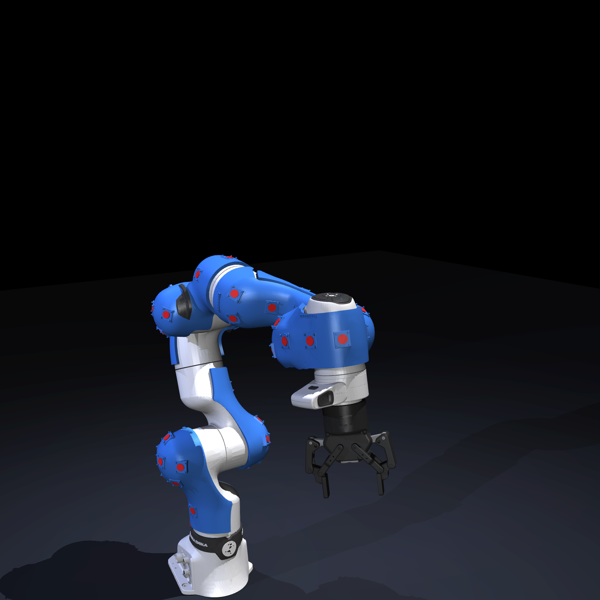
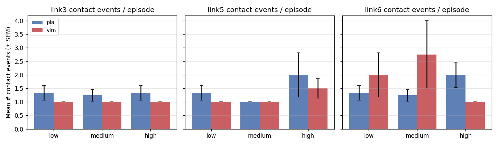
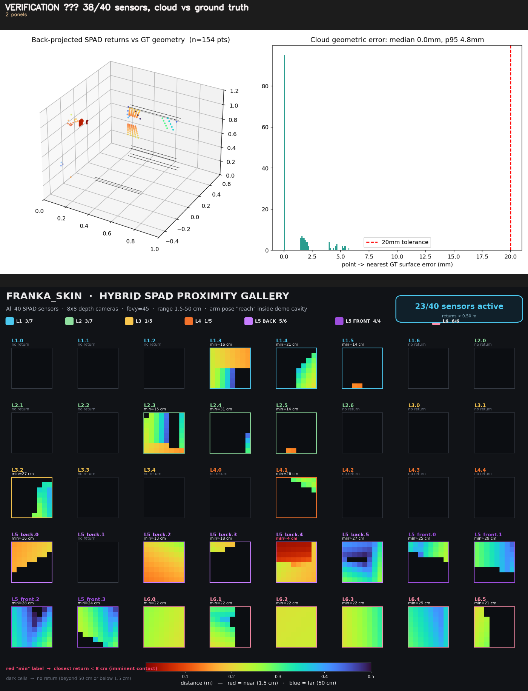
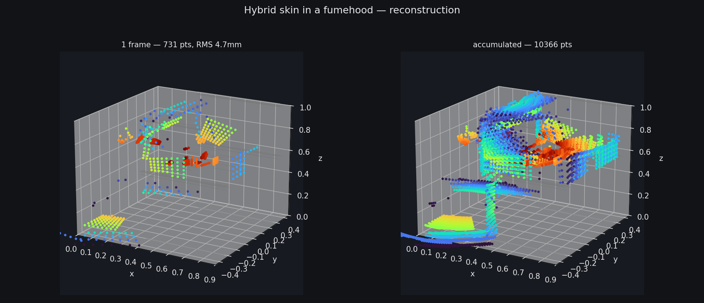
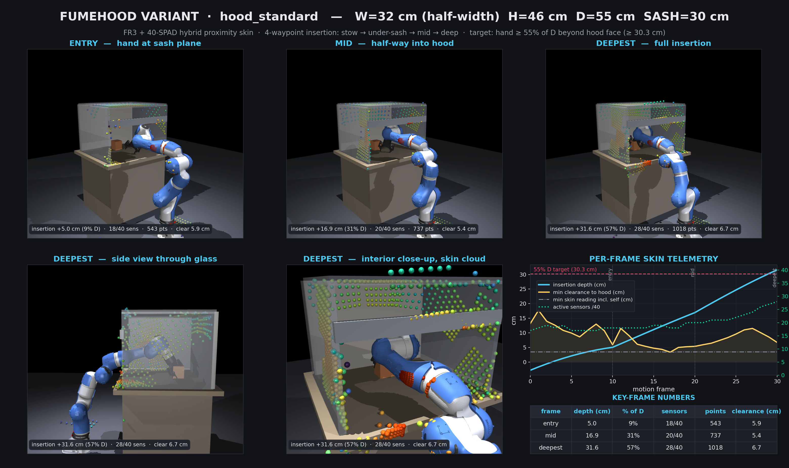
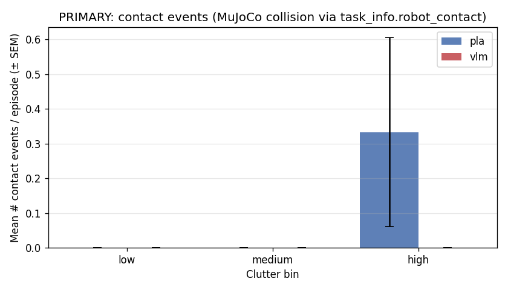
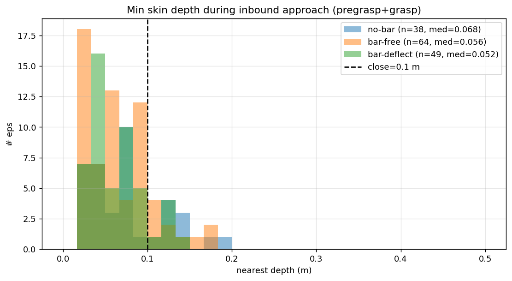
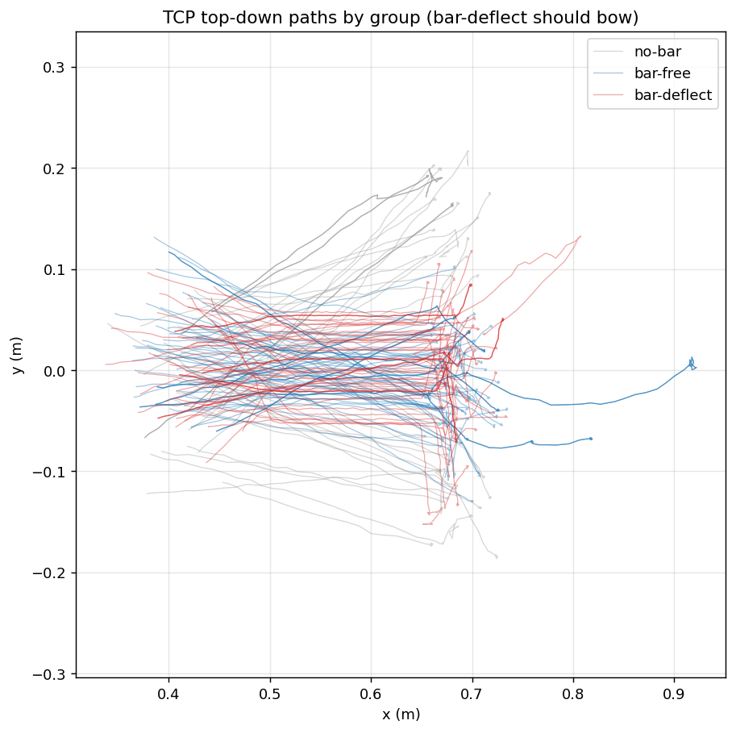
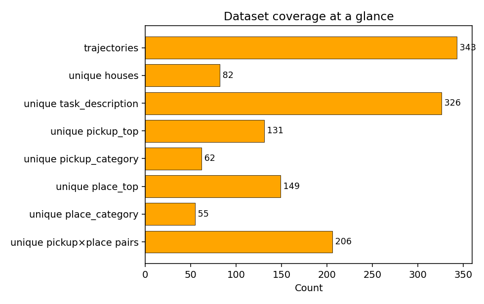
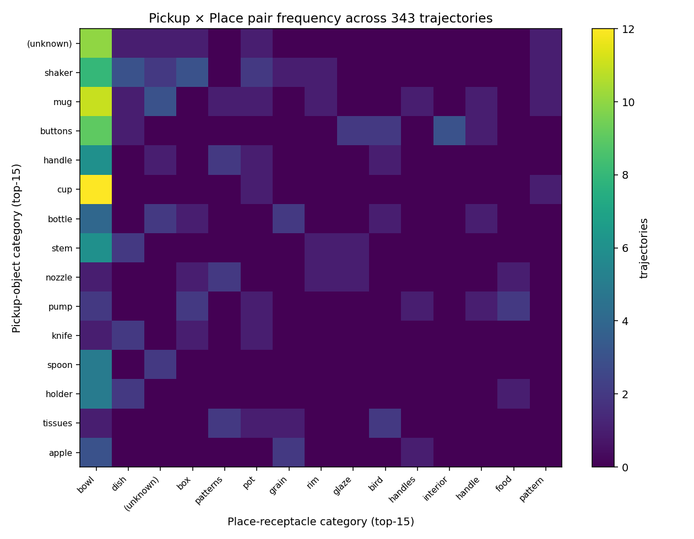

# P+ACT — Proximity-Conditioned Manipulation & Reactive Safety on a Sensorized Franka FR3

This repo wraps a Franka FR3 in a **body-distributed proximity skin** (8×8 time-of-flight depth
sensors tiled over the arm links) inside the MuJoCo / MolmoSpaces simulator, and uses that skin for
two things:

1. **P+ACT** — a manipulation policy that fuses the proximity stream into Action Chunking
   Transformer (ACT). On a household pick-and-place task it roughly **doubles success vs vanilla
   ACT (80% vs 40%)** while using less training compute, and the policy is shown to *actually read*
   the proximity tokens.
2. **Safety-CVAE** — a reactive collision-avoidance layer that turns the raw skin reading into a
   joint-space retreat, with **no scene geometry or object poses at runtime**. It bolts onto any
   nominal trajectory: the arm bows around an obstacle and rejoins its path.

Both ride on a custom **proximity skin** for the FR3 that back-projects to ground-truth geometry at
**millimetre accuracy**.



*FR3 wrapped in the 40-sensor hybrid proximity skin (red SPAD cells over the conformal dermis).*

> **Two skin generations live in this repo — do not conflate them.**
> The **29-sensor** skin (`model.xml`, links 2/3/5/6) produced the published **P+ACT** results.
> The newer **40-sensor hybrid** skin (`model_hybrid.xml`, links 1–6) produced the millimetre
> reconstruction validation and the **Safety-CVAE**. Sensor counts differ on purpose.

---

## Headline results

| Result | Number | Where |
|---|---|---|
| **P+ACT vs vanilla ACT** success (n=10) | **8/10 (80%) vs 4/10 (40%)**, +40 pp | [§5](#5-system-a--pact-proximity-conditioned-act) |
| Significance | Fisher one-sided p = 0.085, Barnard p = 0.057, odds ratio 6.0 (a prior rerun: 9/10, p = 0.029) | §5 |
| Training compute | P+ACT wins at **2.5× less** (2000 vs 5000 epochs) | §5 |
| Decoder reads the skin | prox tokens take **21.7% of attention on 15.2% of tokens** → **1.55× per-token vs image** | §5 |
| Proximity encoder accuracy | **2.0 cm** mean / 1.4 cm median Euclidean (per-axis 0.84/1.02/1.16 cm) | §5 |
| Extra parameters for proximity | **~22 k** (0.03% of an ~84 M model) | §5 |
| Skin geometric accuracy | back-projected returns land on real surfaces to **~4 mm** median | [§4](#4-the-proximity-skin) |
| **Safety-CVAE** direction accuracy | retreat points the right way **89%** of the time near obstacles, near-silent when clear | [§6](#6-system-b--reactive-proximity-safety-safety-cvae) |
| Obstacle dataset | **151 episodes, 122 success (80.8%)**, clean avoidance signal | §6 |

<table>
<tr>
<td></td>
<td></td>
<td></td>
</tr>
<tr>
<td align="center"><em>Per-link contact events: P+ACT (pla) vs ACT (vlm).</em></td>
<td align="center"><em>Encoder predicts contact-point XYZ to ~1 cm, R²&gt;0.99.</em></td>
<td align="center"><em>Decoder attention to each prox sensor over the approach.</em></td>
</tr>
</table>

---

## Table of contents

1. [What's in this repo](#1-whats-in-this-repo)
2. [Repository layout](#2-repository-layout)
3. [Installation](#3-installation)
4. [The proximity skin](#4-the-proximity-skin)
5. [System A — P+ACT (proximity-conditioned ACT)](#5-system-a--pact-proximity-conditioned-act)
6. [System B — Reactive Proximity Safety (Safety-CVAE)](#6-system-b--reactive-proximity-safety-safety-cvae)
7. [Data generation: configs, collision probe, enclosure design](#7-data-generation-configs-collision-probe-enclosure-design)
8. [File reference](#8-file-reference)
9. [Output directories & conventions](#9-output-directories--conventions)
10. [Troubleshooting & gotchas](#10-troubleshooting--gotchas)
11. [Project history (superseded)](#11-project-history-superseded)

---

## 1. What's in this repo

- **A sensorized FR3 in simulation.** The arm carries 8×8 ToF depth sensors (SPAD-style, 45° FOV,
  1.5–50 cm range). RGB is blurred at policy-training time, so the skin is the robot's
  contact-range perception.
- **System A — P+ACT.** A *frozen* proximity encoder maps each sensor's recent depth history to a
  predicted 3-D object position; those positions enter ACT as extra encoder tokens. The policy
  gets cleaner, lower-dimensional spatial cues than raw depth and improves pick-and-place success.
- **System B — Safety-CVAE.** A small conditional VAE distilled from an analytic potential field
  turns the live skin reading into a 7-DoF joint retreat. It is policy-agnostic: add it as a
  residual on any trajectory for reactive obstacle avoidance.
- **The simulator** is MolmoSpaces (iTHOR / ProcTHOR-Objaverse houses), vendored under
  `submodules/molmospaces`. ACT is vendored under `submodules/act`.

The two systems share the skin but are independent — you can run either alone.

---

## 2. Repository layout

```
prox_learning/
├── pact/                  # System A: P+ACT (canonical pipeline)
│   ├── prox_encoder/      #   encoder model + windowed cache + dataset
│   ├── act_prox/          #   ACT × proximity integration, training, eval, masking
│   ├── scripts/           #   encoder CLIs (build_cache, train, evaluate)
│   ├── analysis/          #   attention visualisation
│   └── outputs_prox/      #   encoder caches + checkpoints (gitignored)
├── scripts/               # ~60 helpers: datagen launch, ACT conversion, eval, analysis,
│                          #   the hybrid-skin build/verify tools, and the Safety-CVAE scripts
├── submodules/
│   ├── molmospaces/       #   the simulator + datagen (forked, with our task/config edits)
│   ├── act/               #   ACT model (forked, 4 backward-compatible edits)
│   └── MolmoBot/          #   (auxiliary)
├── assets/                # robot MJCF + scenes + collected datasets (most gitignored)
│   ├── robots/franka_skin/#   model.xml (29-sensor), model_hybrid.xml (40-sensor), ...
│   ├── datagen/           #   collected trajectory h5 + camera MP4s
│   └── safety/            #   Safety-CVAE data, checkpoints, demo outputs
├── franka_assets/fr3_skin/# self-contained 29-sensor skin model tree (bundled meshes)
├── analysis_output/       # result plots (P+ACT vs ACT, dataset coverage, ...)
├── diagnostics_output/    # skin verification, reconstruction, photoshoot, fumehood, obstacle
├── synthetic_verify/      # empty-room / flat-plane ground-truth checks
└── pyproject.toml         # package name "pla" (kept for history)
```

Two Python interpreters are used:

- **`/opt/conda/envs/mlspaces/bin/python`** — everything: datagen, sim, the encoder, P+ACT,
  the Safety-CVAE. Referred to below as `$PY`.
- **`/opt/conda/envs/aloha/bin/python`** — *optional*, only for the original vanilla-ACT scripts.

---

## 3. Installation

```bash
# 3.0 clone with submodules
git submodule update --init --recursive

# 3.1 primary env: datagen + sim + encoder + P+ACT + safety
conda create -n mlspaces python=3.11
conda activate mlspaces
cd submodules/molmospaces
pip install -e ".[mujoco]"          # or ".[mujoco-filament]" for the Filament renderer
cd ../..
pip install -e .                    # numpy, torch, h5py, mujoco, matplotlib, scipy, trimesh, ...

# headless rendering — required for every sim/render command in this repo
export MUJOCO_GL=egl
export PYOPENGL_PLATFORM=egl

# 3.2 optional: vanilla-ACT-only env (skip if you only run P+ACT)
conda env create -f submodules/act/conda_env.yaml   # creates env "aloha"
conda activate aloha
cd submodules/act/detr && pip install -e .          # the DETR/ACT model package
conda activate mlspaces

# 3.3 assets & scene cache
export MLSPACES_ASSETS_DIR=$PWD/assets              # where symlinks live
python -m molmo_spaces.molmo_spaces_constants       # download + symlink everything
python scripts/datagen/fetch_assets.py scene procthor-objaverse 0 --split train
python scripts/datagen/fetch_assets.py default      # default robots/objects/grasps
ls -L assets/scenes/procthor-objaverse-train/train_0.xml   # verify the symlink resolves
```

**Mesh files are not in git.** STL/DAE meshes for the skin resolve at build time from the upstream
`gentact_ros_tools`; the vendored FR3 derives from `mujoco_menagerie` (needs MuJoCo ≥ 3.1.3).

**Dangling-symlink gotcha:** a wiped asset cache makes `assets/scenes/*.xml` dangle silently →
`HouseInvalidForTask` / `ParseXML` errors. Verify with `ls -L`; repair by re-running the fetch with
`MLSPACES_FORCE_INSTALL=True`.

---

## 4. The proximity skin

The robot's contact-range sense. Two generations exist; both are MJCF FR3 + Robotiq models where
each sensor is a fixed `<camera fovy="45" resolution="8 8">` rendering planar-z depth.

| model | sensors | links | used by |
|---|---|---|---|
| `assets/robots/franka_skin/model.xml` | **29** | 2 (×7), 3 (×8), 5 (×6), 6 (×8) | **P+ACT** (§5) |
| `assets/robots/franka_skin/model_hybrid.xml` | **40** | 1 (×7), 2 (×7), 3 (×5), 4 (×5), 5-front (×4), 5-back (×6), 6 (×6) | **Safety-CVAE** (§6), reconstruction |
| `assets/robots/franka_skin/model_photoshoot.xml` | 40 markers | — | paper figures (visual only) |
| `franka_assets/fr3_skin/` | 29 (bundled meshes) | 2/3/5/6 | self-contained standalone model |

**Sensor optics & aiming.** 8×8 depth, 45° FOV (focal ≈ 10.86 mm, h-aperture 9.0 mm), clip
0.05–4.0 m. Sensors aim radially out of each link axis (outward + surface-perpendicular). The URDF
`<axis>` and dermis mesh normals are unreliable (wrong winding) — do **not** use them for aiming; a
few cramped sensors are raycast-repaired. Cameras sit **9 mm proud** of the skin so they clear the
dermis shell.

**Near-field fix (critical).** MuJoCo's depth clip is `vis.map.znear × stat.extent`; with a big
scene this silently erased every return below ~10 cm. Pinned `znear = 0.0002` (clip ≈ 2 mm). The same
render path is used by datagen, so this affects collected data too.

**Render hygiene.** Skin geoms are group 2 and hidden in the proximity render (`geomgroup[2] = 0`) so
the shell does not occlude the sensors — without this ~33% of empty-room returns came back as
self-hits.

### Verification & reconstruction

`scripts/verify_hybrid_skin_sensors.py`:

| check | result |
|---|---|
| not buried in own arm (3 poses) | **40/40** |
| outward-facing | **40/40** |
| plate @ 0.15 m reads 0.145 ± 0.012 m | 38/40 (2 link5-front legitimately see the wrist) |
| range linearity | slope 1.0, R² 0.9999999, sub-µm error |
| back-projected cloud vs ground truth | **~4 mm** median |

Back-project all sensors → point cloud, compare to every real surface:

| scene | active | RMS | within 1 cm |
|---|---|---|---|
| primitives (box+sphere+cyl+corner) | – | **4.0 mm** | 95% |
| open clutter (3 obj + table) | 14/40 | 4.7 mm | 91% |
| fumehood (1 frame) | 22/40 | 4.7 mm | 91% |
| fumehood, accumulated (14 poses) | – | 5.0 mm | 93% (10366 pts) |

<table>
<tr>
<td></td>
<td></td>
</tr>
<tr>
<td align="center"><em>Back-projected SPAD returns vs ground truth + 40-sensor gallery.</em></td>
<td align="center"><em>Reconstructing fumehood interior: single frame + accumulated cloud.</em></td>
</tr>
</table>

Every return lands on a real surface to millimetre accuracy → sensors are in the right place **and**
looking at the right thing.

### Fumehood reach variations

`diagnostics_output/20260611_fumehood_variations/` — 6 hood geometries × verified deep-insertion
motions (FK-checked hand depth, per-frame skin cloud + clearance telemetry):

| variant | interior (W×H×D, sash) | insertion (hand / TCP) | active @ deep | min clearance |
|---|---|---|---|---|
| standard | 64×46×55, 30 cm | 31.6 cm (57% D) | 28/40 | 3.4 cm |
| tall | 68×85×55, 55 cm | 35 cm + high sweep | 29/40 | 3.5 cm |
| short low-sash | 68×34×50, **17 cm** | 29.3 cm hand / 44.8 cm TCP | 26/40 | **0.3 cm** |
| narrow | **32**×50×55, 32 cm | 33.5 cm | 25/40 | 0.4 cm |
| wide big | 110×65×70, 45 cm | 39 cm + lateral ±24 cm | 31/40 | 0.5 cm |
| deep tunnel | 52×42×**95**, 28 cm | 38 cm hand / **52.6 cm TCP** | 26/40 | 0.9 cm |



*Deep-tunnel's 60 cm hand target is beyond the FR3's 855 mm reach; 52.6 cm TCP is the physical
ceiling with the elbow on the bench lip. All motions are collision-checked.*

### Build / verify / render the skin

```bash
python scripts/build_hybrid_on_franka_skin.py        # functional 40-sensor model
python scripts/build_photoshoot_skin.py              # visual model for figures
python scripts/verify_hybrid_skin_sensors.py
python scripts/test_and_reconstruct_hybrid.py
python scripts/test_reconstruct_fumehood.py
python scripts/render_hybrid_skin_viz.py             # 3D + exo + wrist + 40 tiles
python scripts/photoshoot_sweep.py                   # paper turntable
python scripts/foxglove_fumehood_tour.py             # 6-hood Foxglove tour (22.7 s, 190 frames)
```

All renders need EGL (handled in-script via the default-display patch). Open `.mcap` outputs at
[app.foxglove.dev](https://app.foxglove.dev) and import `scripts/foxglove_unified_layout.json`.

### Per-sensor MJCF construction

Each sensor is a body posed just above the collision mesh with two children: a
`<site class="skin_sensor_site">` marker (red sphere, group 2) and a
`<camera mode="fixed" pos="0 0 0" quat="0 0 1 0" fovy="45.0" resolution="8 8"/>`. Skin geoms are
`class="skin" group=2 contype=0 conaffinity=0 mass=0` (visual only — no collision, no inertia).
Sensor poses were imported from the original Isaac Sim USD placements. The camera quaternion is
`0 0 1 0` (180° about local Y): this keeps the view direction (+Z out of the body) while giving the
correct, right-side-up ToF image convention — an earlier `0 1 0 0` flipped the image vertically.

---

## 5. System A — P+ACT (proximity-conditioned ACT)

### Architecture & data flow

```
29 ToF sensors, 8×8 depth @ 60 Hz
   └─ trailing window W = 8 control steps × 4 substeps → (B, 29, 32, 8, 8)
        └─ FROZEN proximity encoder (~0.82 M params)  →  (B, 29, 3)   predicted object pos
             per sensor's local frame
                  └─ Linear(3 → hidden) → 29 extra tokens inserted into ACT encoder memory:
                       [ latent(1) | proprio(1) | prox(29) | image(160) ] = 191 tokens
                            └─ DETR decoder, 100 action queries → 8-D action chunk
```

Vanilla ACT is the same minus the 29 prox tokens (memory = 162). Image tokens are 160 (8×20 from two
480×640 RGB cameras via ResNet-18). The proximity branch adds only **~22 k** parameters and is
**gated behind `n_proximity_sensors = 0`**, so vanilla ACT stays bit-identical to upstream.

**Why predict 3-D position (not raw depth) and freeze it?** The position is interpretable (plot vs
ground truth), low-dimensional (29×3 = 87 numbers, minimal arch change), and matches the encoder's
exact training objective so ACT doesn't re-learn a readout. Freezing is safer (can't degrade a
validated encoder), faster (no backprop), and reversible — the trainer asserts
`requires_grad == False` on every encoder param at each step.

**The four ACT edits** (`submodules/act`, all gated on `n_proximity_sensors = 0`):
`detr_vae.py` adds `input_proj_proximity = Linear(3, hidden)` and extends `additional_pos_embed`;
`transformer.py` concatenates the proximity input after `[latent, proprio]`; `policy.py` threads
`proximity_positions`; `detr/main.py` declares the new flags.

### Results

| | Vanilla ACT | P+ACT |
|---|---|---|
| Success (n=10) | 4/10 = **40%** | 8/10 = **80%** |
| Wilson 95% CI | 16.8–68.7% | 49.0–94.3% |
| Train epochs / best val loss | 5000 / 0.022 | 2000 / 0.086 |
| Per-rollout | 1,0,0,0,0,1,1,1,0,0 | 1,1,1,1,1,1,1,0,1,0 |

+40 pp at **2.5× less** training compute (despite higher val loss → the gain is better-conditioned
input, not more compute). Fisher one-sided p = 0.085, Barnard p = 0.057, odds ratio 6.0; a prior
independent rerun gave 9/10 (Fisher p = 0.029).

**Proximity encoder accuracy** (held-out trajectories): **2.0 cm mean / 1.4 cm median** Euclidean,
per-axis 0.84 / 1.02 / 1.16 cm; per-sensor range 1.25 cm (link2_sensor_6) to 4.80 cm (link5_sensor_3).

<table>
<tr>
<td></td>
<td></td>
<td></td>
</tr>
<tr>
<td align="center"><em>Encoder Euclidean error (mean 2.0 cm).</em></td>
<td align="center"><em>Per-sensor MAE across the skin.</em></td>
<td align="center"><em>Contact events per episode by clutter bin.</em></td>
</tr>
</table>

**Does the policy actually use the skin?** Yes. From 160 batched forward passes capturing the
`(B, 100, 191)` decoder cross-attention across 7 layers: prox tokens take **21.7%** of attention mass
on only **15.2%** of the token budget. Per-token, prox = 0.00748 (1.43× uniform) vs image = 0.00481
(0.92×) → **1.55× more per token than image**. All 29 sensors are above uniform; the top-5 includes 3
wrist (link6) sensors as physically expected; per-link spread is only ~6%. Attention is spread across
all 7 layers (no single "proximity layer"), with a mild mid-rollout bump at episode fraction ~0.56.


**Alternatives ruled out.** More params (+22 k = 0.03%, no). Seed luck (two reruns 8/10 and 9/10,
both seed 0, largely no). Encoder as mere regulariser (1.55× per-token attention says it's actively
read, no). Under-trained vision (baseline had 2.5× more training and still lost). Future-leakage
(window `[t-W+1, t]` is strictly causal). 

**Limitations / not yet claimed.** n = 10 is small (p straddles 0.05; n = 30 would stabilise). All
evals are house-1-only (no cross-house). Single object class (mug). The frozen encoder is **OOD
post-grasp** (trained only on `held == False` frames) and is fed unchanged in v1 — ACT discounts it
via attention, but a learned per-sensor "is-valid" gate is the proposed fix. MolmoSpaces draws a
fresh task per process, so 10-rollout counts wiggle ±10 pp — read Wilson CIs, not point estimates.

### Reproduce P+ACT end-to-end

`$PY = /opt/conda/envs/mlspaces/bin/python`, run from the repo root with EGL exported.

```bash
PY=/opt/conda/envs/mlspaces/bin/python

# A. Collect demonstrations (see §7 for configs). Main P+ACT dataset = house-1 mug ×250.
cd submodules/molmospaces
PYTHONPATH=. MUJOCO_GL=egl PYOPENGL_PLATFORM=egl $PY \
  -m molmo_spaces.data_generation.main FrankaSkinPickAndPlacePilotSmokeConfig \
  2>&1 | tee ../../logs/datagen_smoke.log
cd ../..

# B. Verify the proximity stream
$PY scripts/datagen/verify_proximity_gt.py <H5> --t 10
$PY scripts/datagen/visualize_proximity.py <H5> --traj traj_0

# C. Convert to ACT per-episode format → act_style_data/<set>/
$PY scripts/convert_mug_random_to_act.py --dst act_style_data/mug_house1_random_everything \
  --image_h 240 --image_w 320 --resume

# D. Train the proximity encoder (~30 min on a 4090), then evaluate
$PY pact/scripts/build_cache.py \
  --data_glob 'assets/datagen/mug_house_1_random_everything/**/trajectories_batch_*.h5' \
  --out pact/outputs_prox/cache_full.npz --window 8 --keep_every 1
$PY pact/scripts/train.py --cache pact/outputs_prox/cache_full.npz \
  --out_dir pact/outputs_prox/runs --run_name prox_encoder_v1 --steps 10000 --batch_size 256
$PY pact/scripts/evaluate.py \
  --checkpoint pact/outputs_prox/runs/prox_encoder_v1/ckpt_best.pt --split val

# E. Map ACT episodes → source h5 (qpos signature; one-time per dataset)
$PY -m pact.act_prox.build_mapping --act_dataset_dir act_style_data/mug_house1_random_everything

# F. Train both arms with matched hyperparameters
#    baseline (no prox)
$PY -m pact.act_prox.imitate_episodes_with_prox --task_name pla_house1_mug_random \
  --policy_class ACT --ckpt_dir runs/act_mug_v1_baseline --batch_size 8 --num_epochs 5000 \
  --lr 1e-4 --seed 0 --kl_weight 10 --chunk_size 100 --hidden_dim 512 --dim_feedforward 3200
#    P+ACT (frozen encoder ON)
$PY -m pact.act_prox.imitate_episodes_with_prox --task_name pla_house1_mug_random \
  --policy_class ACT --ckpt_dir runs/act_prox_mug_v1 --batch_size 8 --num_epochs 2000 \
  --lr 1e-4 --seed 0 --kl_weight 10 --chunk_size 100 --hidden_dim 512 --dim_feedforward 3200 \
  --use_proximity --prox_encoder_ckpt pact/outputs_prox/runs/prox_encoder_v1/ckpt_best.pt \
  --prox_mapping_json act_style_data/mug_house1_random_everything/prox_mapping.json

# G. Rollout eval (fresh sim process per rollout) + significance
CKPT_DIR=runs/act_prox_mug_v1 \
  PROX_ENC=pact/outputs_prox/runs/prox_encoder_v1/ckpt_best.pt \
  PROX_MAP=act_style_data/mug_house1_random_everything/prox_mapping.json \
  N_ROLLOUTS=10 bash scripts/eval_act_prox_aggregate.sh
$PY scripts/run_act_mug_random_10x.py --n_runs 10 \
  --output_dir eval_output/act_house1_mug_random_v1_aggregate
$PY scripts/significance_pact_vs_baseline.py \
  --baseline_root eval_output/act_house1_mug_random_v1_aggregate \
  --pact_root eval_output/act_prox_mug_v1_aggregate

# H. Attention analysis (4 PNGs + raw_stats.json)
PYTHONPATH="submodules/act:.:${PYTHONPATH:-}" $PY pact/analysis/visualize_prox_attention.py \
  --ckpt_dir runs/act_prox_mug_v1 \
  --prox_encoder_ckpt pact/outputs_prox/runs/prox_encoder_v1/ckpt_best.pt \
  --prox_mapping_json act_style_data/mug_house1_random_everything/prox_mapping.json \
  --dataset_dir act_style_data/mug_house1_random_everything \
  --out_dir pact/analysis/attention_outputs --n_batches 20
```

**Masking ablations** (is ACT *causally* using the prox tokens?):
`--mask_proximity {none,zero,mean,noise,shuffle}` and `--mask_phase {approach,pregrasp,grasp_lift,
transit,place}`. Precompute the mean baseline with `pact/act_prox/precompute_prox_mean.py`; run one
condition with `scripts/run_pact_mask_experiment.py`; run the full grid with
`scripts/run_pact_exp1_exp2_all.sh`.

> **Why a custom rollout instead of the cached JsonBenchmark?** The benchmark `CameraSpec` schema
> (`molmo_spaces/evaluation/benchmark_schema.py:58-83`) has no per-camera resolution and no
> `is_proximity_sensor` flag — a single global `img_resolution` makes all 31 cameras render RGB, so a
> SPAD sensor comes back `(352,624,3)` instead of `(8,8)` and broadcasting fails. The custom rollout
> in `pact/` bypasses this; extending the schema upstream is the alternative.

---

## 6. System B — Reactive Proximity Safety (Safety-CVAE)

A reactive collision-avoidance layer built on the **40-sensor** hybrid skin. It turns the raw skin
reading into a joint-space retreat with **no scene geometry or object poses at runtime**, and adds as
a smooth residual on any nominal trajectory — the arm bows around an obstacle and rejoins ("deviate
and rejoin").

```
datagen run (real arm postures)
 └─ safety_sweep.py        synthesize near-contact samples + analytic labels   → sweep_*.h5
     └─ train_safety_cvae.py   distill the head (proximity → 7-DoF retreat)     → cvae_*/
         └─ safety_*_demo.py   residual avoidance on a trajectory               → *.mcap + *.mp4

analyze_obstacle_dataset.py    validate the hybrid_obstacle_v1 ACT dataset (independent chain)
```

### The obstacle dataset (`hybrid_obstacle_v1`)

Single-env red-cup pick with 0–2 orange hazard bars standing in the fumehood. 2 timestamped runs,
7 house-files, 906 camera MP4s, 1.2 GB. Validated by `scripts/analyze_obstacle_dataset.py`.

| check | result |
|---|---|
| episodes | **151** (2 runs × 7 house-files) |
| task success | **122 / 151 = 80.8%** (train ACT on these 122) |
| single object | yes — 1 `target_uid` (red cup) |
| bar present | 74.8% (113 bar / 38 no-bar) |
| behavior split | 49 deflect / 102 free (deflect = 43.4% of bar eps) |
| avoidance bow (lateral TCP) | **deflect 38 mm** vs no-bar 6 mm vs bar-free 5 mm (~6–7×) |
| do bars hurt success? | **no** — no-bar 76.3% succ < bar 82.3% succ |
| approach proximity | min depth ≈ 20 mm; close-return in 85.8% of bar eps vs 73.7% no-bar |
| integrity | 40 sensors consistent, dead-pixel frac 6.6e-5, 0 empty episodes, len 53–167 |

<table>
<tr>
<td></td>
<td></td>
</tr>
<tr>
<td align="center"><em>Min skin-to-obstacle depth by group vs the 0.1 m threshold.</em></td>
<td align="center"><em>Top-down TCP paths: bar-deflect bows around, no-bar goes straight.</em></td>
</tr>
</table>

*Assessment (a read of the metrics — `summary.json` has no PASS/FAIL field): usable for ACT. Bars
produce a strong, clean avoidance signal without degrading success; failures concentrate in the
no-bar group, so the bars are not the failure driver.*

### Synthetic training data (`safety_sweep.py`)

Builds the fumehood as 14 analytic box geoms + mocap sash/jambs + 3 hazard-bar sizes, with the
`model_hybrid.xml` FR3 at z = 0.35 m. It replays real arm postures sampled from datagen and, per
sample, stands 1–2 bars (80% of samples) on the bench along a random sensor's view ray at 5–25 cm to
fill the 3–15 cm depth band.

- **Render:** dedicated `mujoco.Renderer(model, 8, 8)`, `enable_depth_rendering()`, FOVY 45°
  (f ≈ 9.66, cx = cy = 3.5), skybox off, `geomgroup[2] = 0`.
- **Label** (whole-arm analytic potential field, *unscaled*): for each sensor whose nearest env hit
  is closer than `D_ACT = 0.18 m`, `dq += Jₚᵀ · unit(sensor − hit) · (1/d − 1/D_ACT)`, summed and
  projected onto the 7 arm DoFs. A back-projected hit must lie within `HIT_TOL = 0.025 m` of a scene
  surface, else it is a **self-hit** (arm seeing itself) — excluded from the label but **kept in the
  input** so the head learns to cope with it.
- **Stores** one h5: `prox (N,40,8,8) f16` raw depths + `label_dq (N,7) f32` + `qpos/grip/base_pose/
  min_depth/bar_*`.

### The head (`train_safety_cvae.py`)

Maps the 40×8×8 skin to a 7-DoF joint retreat; runtime needs only raw skin.

- **Featurize:** closeness `c = clip(1 − d/D_MAX, 0, 1)` with `D_MAX = 0.5 m`, zero pixels
  `d < 0.005`, flatten 40×8×8 → **2560**. Labels scaled to unit RMS (`label_scale` stored,
  re-multiplied at inference).
- **CVAE:** encoder `Linear(2560+7 → 512 → 256 → 2·8)`, decoder `Linear(2560+8 → 512 → 256 → 7)`,
  SiLU. Loss = MSE-recon + β·KL (β = 1e-2, warmed over 10 epochs), AdamW lr 1e-3 cosine, 60 epochs,
  batch 512, checkpoint on best val MSE.
- **Inference:** `SafetyHead.load(dir)(prox)` → deterministic decode at **z = 0** × `label_scale` →
  `(7,)` joint delta.

| head | data | val_mse ↓ | close_cos ↑ | far_quiet ↓ | label_scale |
|---|---|---|---|---|---|
| `cvae_v1` | `sweep_v1.h5` | **0.0111** | **0.891** | **0.0326** | 16.74 |
| `cvae_v2` | `sweep_v2.h5` (obstacle-aware) | 0.0146 | 0.865 | 0.0360 | 14.68 |

- **close_cos** — cosine between predicted retreat and the analytic label on *close* samples
  (`min_depth < 0.12 m`): does it push the right way? 1.0 ideal.
- **far_quiet** — L2 of the prediction on *far* samples (`min_depth > 0.25 m`): silent when clear?
  0 ideal.
- **val_mse** — recon MSE on the held-out split (scaled label space).

`v1` edges `v2` on all three held-out metrics (differences small); `v2` is the demo default,
trained on the obstacle-aware sweep.

### Demos

All default to `--ckpt cvae_v2`, render 960×540 @ 30 fps, and log a Foxglove `.mcap` plus an MP4.

| demo | shows | duration | reaction law | video |
|---|---|---|---|---|
| `safety_flinch_demo.py` | bar marches down a forearm-sensor axis; arm flinches, relaxes | bar schedule | spring-return single pose: `q += (gain·dq − spring·(q−q0))·dt` | mp4v |
| `safety_react_demo.py` | bars on a planned trajectory; arm bulges around each, rejoins | `--traj-secs 10` | leaky integrator: `corr += (gain·dq − decay·corr)·dt` | mp4v |
| `safety_moving_demo.py` | 1 bar patrols the whole arm wrist→shoulder; per-link skin lights up | `--secs 18` | leaky integrator | H.264 |
| `safety_orbit_demo.py` | 1 bar circles the forearm; the lean rotates with the orbit | `--secs 14` | leaky integrator | H.264 |

Defaults — flinch `gain 4.5 / spring 1.5 / max-dev 0.35`; react `gain 4.0 / decay 2.2 / ema 0.75 /
max-dev 0.35 / standoff 0.10`; moving `gain 3.0 / decay 2.2 / ema 0.7 / max-dev 0.30 / standoff
0.14`; orbit `gain 3.5 / decay 2.2 / ema 0.75 / max-dev 0.30 / radius 0.18`. All demos do a per-frame
double render (bars placed, then parked) and subtract the parked baseline, so the head reacts only to
the obstacle's marginal push. Hood/walls are retagged to geom group 3 — hidden in the RGB video but
kept in the depth render so the head still sees the full scene.

### Reproduce the Safety-CVAE

```bash
ENV="OMP_NUM_THREADS=2 MUJOCO_GL=egl PYOPENGL_PLATFORM=egl"
PY=/opt/conda/envs/mlspaces/bin/python

# validate the obstacle dataset (no EGL needed)
$PY scripts/analyze_obstacle_dataset.py --root assets/datagen/hybrid_obstacle_v1

# synthesize near-contact training data from real postures (EGL)
env $ENV $PY scripts/safety_sweep.py \
  --runs assets/datagen/hybrid_obstacle_v1/FrankaSkinHybridObstacleConfig/20260612_183855 \
  --n 15000 --out assets/safety/sweep_v2.h5

# distill the head (CUDA, no EGL)
$PY scripts/train_safety_cvae.py --data assets/safety/sweep_v2.h5 --out assets/safety/cvae_v2

# demos (EGL) — each writes assets/safety/<name>_demo.{mcap,mp4}
env $ENV $PY scripts/safety_flinch_demo.py --ckpt assets/safety/cvae_v2
env $ENV $PY scripts/safety_react_demo.py  --ckpt assets/safety/cvae_v2 --mode sweep
env $ENV $PY scripts/safety_moving_demo.py --ckpt assets/safety/cvae_v2
env $ENV $PY scripts/safety_orbit_demo.py  --ckpt assets/safety/cvae_v2
```

**Gotchas.** `flinch` & `react` write raw **mp4v** (stutters in some players); `moving` & `orbit`
re-encode to **H.264** via ffmpeg. `min_depth` in the demos is self-dominated (the arm sees its own
gripper at 1–4 cm) — not a bar-collision metric. link1 (base) sensors face the mount and never see
workspace obstacles. Three distances are intentionally different: `D_ACT = 0.18 m` (label activation)
≠ `D_MAX = 0.5 m` (input closeness norm) ≠ `0.12 / 0.25 m` (close/far metric thresholds).

**Artifacts.** `assets/datagen/hybrid_obstacle_v1/` (1.2 G); `assets/safety/` holds `sweep_v1.h5`
(55 M), `sweep_v2.h5` (56 M), `cvae_v1/` + `cvae_v2/` (12 M each), and `flinch/react/moving/orbit_demo.
{mcap,mp4}`. Submodule edits (unstaged): `molmo_spaces/tasks/enclosure_reach.py` (+164) and
`object_manipulation_datagen_configs.py` (`FrankaSkinHybridObstacleConfig`, +75).

**Next.** The head is policy-agnostic. To deploy on a learned policy, wrap the ACT action output with
the same leaky-integrator residual the demos use (`corr += (gain·head(prox) − decay·corr)·dt`,
clamped to `max-dev`) so the arm avoids obstacles the policy was never trained on, then rejoins.

---

## 7. Data generation: configs, collision probe, enclosure design

Demonstrations are produced by a scripted privileged planner using the `franka_skin` robot +
`FrankaSkinCameraSystem` (2 RGB cameras + the proximity sensors). Canonical launch:

```bash
cd submodules/molmospaces
PYTHONPATH=. MUJOCO_GL=egl PYOPENGL_PLATFORM=egl \
  /opt/conda/envs/mlspaces/bin/python -m molmo_spaces.data_generation.main <ConfigName>
```

Parallel single-house and the new hybrid/obstacle/cavity configs are launched the same way (swap
`<ConfigName>`). Throughput probe: `scripts/_bench_one_house_mug.py`.

> **Critical:** `proximity_sensor_period_ms` must be **16.6667** (60 Hz, 4 substeps/policy step).
> Setting it to 0 silently disables proximity recording (the substep dimension collapses to 1 and
> reads zero). Within a step, `record_proximity_depths()` appends one 8×8 frame per sensor per
> substep; `reset_proximity_depth_buffer()` clears at step start.

### Making proximity *necessary*

Default pick-and-place is a poor showcase: `check_robot_placement_visibility = True` means vision
never fails (`vision_blind_frac ≈ 0`), so the skin is decorative. Two levers:

1. `disable_collision_checks` (True on the PACT collision-probe config) bypasses placement rejection
   and records `collision_metrics` into `obs_scene` — over-generate, then curate.
2. `FrankaSkinProxNecessityPilotConfig` drops the visibility guarantee, targets low surfaces, and
   adds heavy clutter (`num_added_pickups = 60`). Curate with:

```bash
$PY scripts/proximity_necessity.py \
  --glob 'assets/datagen/pick_and_place_skin_prox_necessity_pilot_v1/**/house_*/trajectories_batch_*.h5' \
  --near_m 0.15 --out diagnostics_output/prox_necessity_pilot
```

`samples_per_house` is a **ceiling, not a quota** — the candidate pool drains on supporting-geom
failure, placement error, ≥2 grasp failures, etc., so uneven per-house yield is data distribution,
not a bug. (`max_allowed_sequential_irrecoverable_failures` is raised to 10000 on skin configs; the
default of 5 was killing workers after a few productive houses.)

<table>
<tr>
<td></td>
<td></td>
</tr>
<tr>
<td align="center"><em>Coverage: 343 trajectories, 82 houses, 326 task descriptions.</em></td>
<td align="center"><em>Pickup × place category coverage across the demos.</em></td>
</tr>
</table>

### Enclosure-reach generator (the obstacle-avoidance task design)

The advisor spec (2026-06-09) is **one parameterized scene generator**, not bespoke envs: a single
MJCF whose enclosure is oversized slabs on mocap bodies, re-posed per episode (no recompile).
Aperture = gap between slabs; protrusion = a slab inserted vs parked away.

- **Per-episode parameters (all logged):** `clearance_cm = 0.7·U(1,5) + 0.3·U(5,8)` (keeps mass in
  the 1–5 cm regime where proximity drives behaviour); `depth_m = U(0.25,0.55)`;
  `target_depth_frac = U(0.5,0.9)`; `interior_margin_cm = U(0,6)`; `protrusion_present` Bernoulli per
  mixture cell; `protrusion_wall ∈ {left,right,top}`; `protrusion_pos_frac = U(0.25,0.75)`;
  `protrusion_size_cm = U(3.5,7)` (≥ a few SPAD zones at decision distance: a zone is ~45°/8 ≈ 5.6°
  ≈ 1.2 cm at 12 cm); `light_scale = log-U(0.02,1.0)`; `target_uid` from the graspable pool. The
  derived `cam_visible` flag is **logged at t=0** (raycast from exo+wrist) because it is unrecoverable
  later and needed for stratified eval.
- **Decorrelation by construction:** protrusion params are drawn independently of clearance / depth /
  lighting / object id, and tight-but-clear episodes are included, so a narrow aperture never implies
  an obstacle. Verified post-hoc by a correlation-matrix probe.
- **Observation-realizable expert:** a privileged planner reacting to hidden geometry at t=0 is
  unlearnable from student observations (and early deflection leaks the obstacle into RGB via robot
  pose). The expert instead reacts only **after** geometry enters the skin's FOV/range. Three behaviour
  classes double as measurable sensor-use signatures: (1) graded speed modulation (continuous),
  (2) deflection-side selection (discrete, large divergence), (3) abort/retreat when the residual gap
  is too small — which counts as success for its cell, so abort-class episodes must survive
  `filter_for_successful_trajectories`.
- **Mixture & scale:** ~28% obstacle-free / ~33% hidden obstacle / ~28% visible obstacle / ~11%
  abort-infeasible; 2–5k episodes; holdouts on logged params (e.g. train ≥2.5 cm clearance, test
  1.5–2.5 cm).
- **Go/no-go probes BEFORE training:** (1) regress expert EE speed on min skin reading → expect a
  strong negative slope; (2) logistic probe of deflection side from left/right zone asymmetry → ≫
  chance; (3) hidden-obstacle × visible params correlation ≈ 0; (4) fraction of timesteps with any
  zone < 8 cm (too small ⇒ clearances too generous).

A secondary bin/drawer-descent generator (gripper self-occlusion in the last 5–10 cm + sub-cm wall
proximity RGB can't judge) provides the two-mechanism generality claim. As shipped, an early
hand-authored cavity env (`FrankaSkinCabinetCavityConfig`) reuses the stock pick planner: 25/29
sensors active, median proximity 0.19 m in-cavity vs ~0.53 m in open houses, 74% of returns within
30 cm on a real trajectory.

### Foxglove visualizer

`scripts/foxglove_export.py` converts any trajectory `.h5` to a scrubbable `.mcap`. It replays the
saved joints through the MJCF and reads each sensor pose from forward kinematics (it does **not** trust
stored extrinsics), so the world point cloud is geometrically exact (validated sub-cm against
`verify_synthetic_scenes.py`). Topics: `/tf`, `/robot`, `/proximity` (all sensors back-projected to
one cloud, red=near→blue=far), `/camera/{wrist,exo}`, `/tcp`, `/task`.

```bash
env MUJOCO_GL=egl PYOPENGL_PLATFORM=egl /opt/conda/envs/mlspaces/bin/python \
  scripts/foxglove_export.py --h5 PATH.h5 --traj all --out-dir mcaps/
```

---

## 8. File reference

### `pact/` — System A
| path | what |
|---|---|
| `prox_encoder/model.py` | `ProxEncoder` transformer (d_model 128, 4 heads, 4 layers, ~0.82 M) |
| `prox_encoder/cache.py` | windowed `.npz` cache builder (one sample = one window) |
| `prox_encoder/dataset.py` | 90/10 split *by trajectory* |
| `scripts/{build_cache,train,evaluate}.py` | encoder pipeline |
| `act_prox/build_mapping.py` | ACT-episode → source-h5 map via qpos signature (t={5,10,15,20,25}=45 floats) |
| `act_prox/prox_features.py` | `FrozenProxFeatureExtractor` (~0.82 M, frozen) |
| `act_prox/imitate_episodes_with_prox.py` | the P+ACT / baseline trainer |
| `act_prox/eval_act_with_prox_encoder.py` | rollout eval (per-sensor ring buffer, z-scored) |
| `act_prox/precompute_prox_mean.py`, `test_masking.py` | masking-ablation support |
| `analysis/visualize_prox_attention.py` | writes 4 attention PNGs + `raw_stats.json` |

### `scripts/` — helpers (~60)
Grouped: **data collection / conversion** (`convert_*`, `merge_*`, `build_combined_h1_h3.py`);
**training launchers** (`train_houses13_seeds.sh`, `launch_medium_*.sh`); **eval & aggregation**
(`eval_act_prox_aggregate.sh`, `run_act_mug_random_10x.py`, `aggregate_pact_eval.py`,
`plot_pact_vs_baseline.py`, `significance_pact_vs_baseline.py`); **diagnostics**
(`inspect_pact_trajectory.py`, `proximity_necessity.py`); **hybrid skin**
(`build_hybrid_on_franka_skin.py`, `verify_hybrid_skin_sensors.py`, `test_reconstruct_fumehood.py`,
`photoshoot_sweep.py`, `foxglove_fumehood_tour.py`); **Safety-CVAE** (`safety_sweep.py`,
`train_safety_cvae.py`, `safety_{flinch,react,moving,orbit}_demo.py`,
`analyze_obstacle_dataset.py`); **Foxglove** (`foxglove_export.py`, `foxglove_viz.py`).

### Models & assets
| path | what |
|---|---|
| `assets/robots/franka_skin/model.xml` / `model_hybrid.xml` | 29- / 40-sensor skinned FR3 |
| `assets/urdf/`, `assets/mjcf/` | URDF source of truth → `pla.sim.build_mjcf` output |
| `assets/robots/franka_fr3/` | vendored FR3 (from `mujoco_menagerie`, Apache-2.0, MuJoCo ≥ 3.1.3) |
| `franka_assets/fr3_skin/` | self-contained 29-sensor model that **bundles** its meshes |

### `submodules/act` modifications
ACT = CVAE + DETR-style transformer predicting action chunks. Four backward-compatible edits gated on
`n_proximity_sensors = 0` (see §5): `detr_vae.py`, `transformer.py`, `policy.py`, `detr/main.py`.

---

## 9. Output directories & conventions

Most outputs are gitignored.

| dir | contents |
|---|---|
| `assets/datagen/` | collected trajectory h5 + camera MP4s |
| `assets/safety/` | Safety-CVAE data, checkpoints, demo `.mcap`/`.mp4` |
| `act_style_data/` | per-episode ACT datasets + `prox_mapping.json` |
| `pact/outputs_prox/` | encoder caches + checkpoints |
| `runs/`, `eval_output/` | P+ACT/baseline checkpoints + rollout results |
| `analysis_output/`, `diagnostics_output/` | result plots, skin verification, photoshoot, obstacle |
| `synthetic_verify/` | empty-room / flat-plane ground-truth checks (incl. documented −44.6 mm 8×8 floor bias) |
| `logs/`, `wandb/` | run logs; W&B gallery `jayluvsgeography/prox-skin-dataset` |

**Conventions:** run everything from the repo root; export `MUJOCO_GL=egl PYOPENGL_PLATFORM=egl` for
any sim/render command; use `$PY = /opt/conda/envs/mlspaces/bin/python` (the `aloha` env is only for
the original ACT scripts).

---

## 10. Troubleshooting & gotchas

- **No proximity in the data** → `proximity_sensor_period_ms` was 0; must be 16.6667 (§7).
- **`HouseInvalidForTask` / `ParseXML`** → dangling scene symlinks; `ls -L` to confirm, refetch with
  `MLSPACES_FORCE_INSTALL=True` (§3).
- **Returns below ~10 cm missing** → MuJoCo depth clip `znear × extent`; pin `znear = 0.0002` (§4).
- **~33% self-hit depths** → skin shell visible to the proximity renderer; hide group 2
  (`geomgroup[2] = 0`) (§4).
- **Eval numbers wiggle ±10 pp** → MolmoSpaces draws a fresh task per process; read Wilson CIs and
  significance tests, not point estimates (§5).
- **Frozen encoder is OOD post-grasp** → trained on `held == False` only; fed unchanged in v1, ACT
  discounts via attention; a per-sensor validity gate is the proposed fix (§5).
- **Worker memory** ~6–7 GB each → `num_workers` 2–4 on a 64 GB box; single-house jobs need
  `num_workers = 1`.
- **Safety demo MP4 stutters** → `flinch`/`react` are raw mp4v; re-encode to H.264 like
  `moving`/`orbit` do (§6).

---

## 11. Project history (superseded)

Earlier work used a **29-sensor** skin and an all-in-one "pla" stack (the package name `pla` in
`pyproject.toml` is a leftover). That stack's first validation round (2026-05-10/11) is kept only as
a historical baseline and does **not** reflect the current architecture: a 36-trajectory smoke
dataset trained to memorization (PLA 96.37 M params, loss 0.0619 vs baseline 96.28 M / 0.0689) and
failed every held-out rollout (0/18 vs 0/20) — root cause was training scale + missing language
conditioning, since fixed by the P+ACT redesign (§5), which adds only ~22 k proximity parameters.

Skin-engineering notes worth keeping: an independent `mj_ray` placement check found 24/29 sensors
correctly placed (5 inward-pointing on link2/link3, still usable after skin-culling + back-face
culling); the −44.6 mm flat-plane floor bias is rasterization quantization scaling as 1/H (a tried
`cx` shift made self-hits worse and was reverted), small versus the SPAD noise floor.
