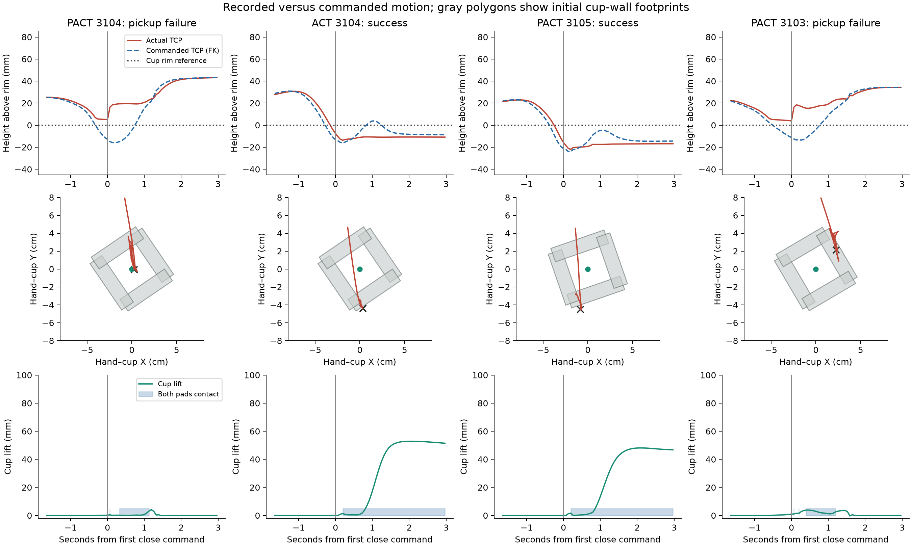
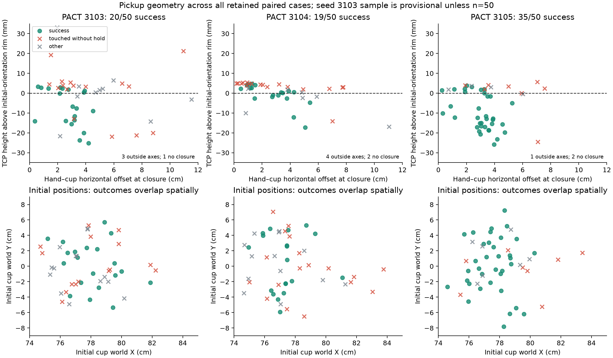

# PACT 3104 versus 3105: geometric pickup diagnosis and seed 3103 check

Generated 2026-09-08T02:16:29.730057+00:00. Source snapshot: 300 validated rollouts,
comprising 50 paired cases for seed 3103 and 50 paired cases each for 3104 and 3105.
All three seed evaluations are complete.

## Finding

The dominant observable problem is **failure to acquire a stable cup-wall grasp**.
Seed 3104 more often arrives with an unsuitable hand position relative to the cup,
contacts the upper cup geometry, and closes while the actual hand has not reached
the requested grasp depth. The hand can be displaced upward during closure, leaving
only brief pad contact and little or no cup lift. Seed 3105 more often achieves a
deeper, offset grasp that pinches a cup wall and survives lift.

This is a diagnosis of the failure mechanism visible in the recorded trajectories.
It does **not** establish a unique training bug, nor prove that a particular obstacle
layout causes the entire seed gap. Training seed and final-instance seed both change
between 3104 and 3105; a same-instance cross-checkpoint experiment is needed to separate
their causal contributions.

## Where the 16-success gap arises

| PACT outcome | Seed 3104, n=50 | Seed 3105, n=50 | Seed 3103, n=50 |
|---|---:|---:|---:|
| Final task success | 19/50 | 35/50 | 20/50 |
| Any target touch | 43/50 | 47/50 | 43/50 |
| Any contact-only hold | 24/50 | 37/50 | 25/50 |
| Cup lifted at least 1 cm | 23/50 | 38/50 | 26/50 |
| Any tray support | 20/50 | 35/50 | 20/50 |
| Collision-free task success | 10/50 | 25/50 | 16/50 |

| Mutually exclusive final outcome | 3104 | 3105 | 3103 |
|---|---:|---:|---:|
| success | 19 | 35 | 20 |
| no target interaction | 7 | 3 | 7 |
| touched without hold | 18 | 8 | 16 |
| held without lift | 2 | 1 | 1 |
| lifted without placement | 3 | 3 | 6 |
| supported without final success | 1 | 0 | 0 |

PACT gains **16 successes** in 3105. The count reaching a 1 cm lift rises by
**15**, so 15 of the 16-case difference appears before that
milestone. Failures after a lift number 4
and 3, respectively. The largest individual
loss is touch without hold: **18 versus 8**. There are also four additional
no-touch failures in 3104. Those seven 3104 no-touch failures all move an empty hand
near the tray later in the rollout; avoidance without pickup is not task success.

The `held` sensor is explicitly a contact heuristic: it asks whether the object
touches the gripper without touching another object. It is not a stable-grasp
measurement. This analysis therefore also uses actual target translation and
simultaneous finger-pad contacts sampled every 2 ms.

## The geometry and the contact mechanism

The evaluated target uses **Cup_10's five primitive collision boxes**, verified
against the saved model positions, quaternions and sizes in every analyzed episode.
It is hollow: four side-wall boxes plus a bottom box. At the settled initial
orientation, the upper collision edge is **71.98 mm above the target body origin**.
The target's body origin is not the rim or a grasp point. All TCP poses were
transformed from the robot-base frame into world coordinates before comparison.

There are two relevant facts:

1. **A successful grasp is usually a wall pinch.** Simultaneous contacts on the
   same side-wall primitive last at least one continuous second in
   **18/19** successful
   seed-3104 cases and **32/35**
   successful seed-3105 cases. Both pads touching something is insufficient: in
   the touch-without-hold failures, neither seed has a continuous bilateral pad
   contact lasting one second.
2. **Seed 3104 more often approaches the cup centre and fails to get below the
   upper edge.** Its commanded hand centre is within 2 cm horizontally of the cup
   origin at first closure in **20/50**
   cases, versus **5/50** for seed 3105.
   Of the 18 versus 8 touch-without-hold failures,
   **16 versus
   7** never put the TCP below the rim
   reference while near the cup in the defined early grasp window.

The 2 cm cutoff describes a tendency; it is not a universal failure boundary.
Cup yaw, hand orientation, approach side and the geometry of the fingers all matter.
Some centred grasps succeed, and some offset grasps fail.

| Median in PACT touch-without-hold failures | 3104 | 3105 |
|---|---:|---:|
| Minimum TCP height relative to rim in early grasp (mm) | +4.4 | +3.6 |
| Commanded TCP Z change over first two steps after closure (mm) | -2.7 | -0.7 |
| Actual TCP Z change over those two steps (mm) | +14.1 | +14.0 |

That last comparison rules out the simplistic interpretation that the immediate
upward motion is merely a commanded early lift: **the requested motion is still
downward, while the actual hand moves upward**. Recorded gripper–cup contacts and
the command/actual discrepancy support a blocked approach and closure-induced
displacement. The traces do not retain contact forces or complete passive-finger
states, so the exact force path and millimetre-level pad penetration cannot be
reconstructed uniquely.

The cup's primitive rim is also direction-dependent. Projecting its initial upper
wall corners onto the hand's closing direction gives a median span of
91.8 mm in 3104 and
89.6 mm in 3105, against
the gripper's nominal 87 mm maximum inner gap. This is a horizontal footprint
descriptor, not exact tilted-finger clearance. It explains why a wall pinch can
be more suitable than trying to surround the entire rim. **It does not explain
the result by itself**: 21
of 3105's 35 successes have a projected full-rim span above 87 mm. Cup yaw alone
is therefore not a reliable success/failure classifier.

The stricter diagnostic signature—touch, no 1 cm lift, command at least 5 mm below
the rim at closure, actual hand at least 5 mm above that command, and no achieved
TCP descent below the rim in the early window—occurs in
**14/50** seed-3104 cases and
**8/50** seed-3105 cases. This is a descriptive
flag, not a new task-success criterion or an outcome replacement rule.

## Identical-scene ACT control and representative trajectories

The strongest control available here is ACT versus PACT **within** a seed, where
the initial physics state is paired. Seed 3104 has **12 ACT-only
successes; 10** are PACT
touch-without-hold failures. Across the ACT-only group, the median paired difference
in achieved minimum grasp height is
**+18.5 mm**: PACT remains higher.
These instances are physically solvable under the unchanged task and controller.

For episode `98c64a358f22eddaba4754f97d40325e9f3e9151f6968d553123681be884a33f`:

- PACT closes at step 148, with a horizontal TCP
  offset of 2.8 mm. Its actual TCP is
  5.0 mm above the rim while
  its commanded TCP is 13.0 mm
  below it. The hand moves up during closure; the cup never reaches a 1 cm lift.
- ACT on the identical instance reaches
  13.7 mm below the rim
  in the early grasp and completes the task. No external-obstacle contact explains
  PACT's failure in this example.
- The illustrated successful PACT-3105 case is the closest successful initial cup
  XY position in the same nominal cell, **17.78 mm** away. It is an illustration,
  not an identical-state causal control.

## Is seed 3104's environment intrinsically harder?

The records do not support a single seed-specific obstacle defect as the main
explanation. All three blocks use the same sampler, scene variants, target asset,
four clutter identities, policy history and controller settings. The nominal core
contains two instances in each of the same 24 cells. After excluding the two
predeclared extras per seed, PACT still scores **19/48 versus 34/48**. The gap is
present across all four layout families, not just one family or intrusion side.

Actual target pose and robot-start jitter differ between blocks. The retained
geometry includes these values, exact initial cup boxes and the initial clutter
AABBs. A nearest-clutter AABB distance is only an origin-to-box descriptor; it is
not full-arm swept clearance. At first closure, cup visibility had occurred in
46/50 PACT-3104 cases and 48/50 PACT-3105 cases. Every touch-without-hold case in
both blocks had seen the target before closure.

Direct robot–clutter contact before the first target touch occurs in
**6/50** PACT-3104 cases versus
**10/50** PACT-3105 cases. Thus a
larger count of these collisions cannot account for the worse 3104 result.
Official hazard contact rates are also relatively low for PACT: 5/50 versus 3/50.
This does not mean obstacles never contribute; individual 3103 and 3104 failures
have clutter interference or target–bottle contact.

The apparent pendant-pose effect is not a consistent difficulty ordering:
the centre-pose cell group has PACT success 4/16 in 3104 and 14/17 in 3105.
ACT's overall success is nearly unchanged across the two blocks, 22/50 versus
23/50. These are evidence against a broad environment difficulty shift, while
still allowing policy-specific interactions with randomized target poses.

## Does seed 3103 have this issue?

**Yes, the failure mode is present.** In the 50 currently included pairs,
PACT has 16 touch-without-hold failures;
10 satisfy the achieved-height description,
and 11 episodes satisfy the stricter blocked-descent signature.
Its task result in this snapshot is **20/50**, versus
**19/50** for ACT.

The example `621d8bd12acc6e7256e2a671b85f49c0168e469e53ac02193dc8e0ba09be2d11` shows the same command/actual split: PACT
requests descent below the rim but remains above it and fails to lift, while
paired ACT succeeds. There is no concurrent robot–clutter contact in the
closure window of this example. Its earlier brief clutter contact is retained
in the record; this is not a claim of a completely collision-free rollout.

Seed 3103 is not an exact copy of 3104's distribution of errors. It also has
off-centre misses and cases involving the cup and nearby bottles. A whole
environment seed cannot be labelled as having or lacking a single geometric
defect independently of the policy trajectory.

## What is established, and the next discriminating test

Established: the large success gap is mainly pickup acquisition; a frequent
failure involves a shallow, misaligned, contact-blocked approach; successful
grasps usually maintain a cup-wall pinch; the failure also occurs in 3103.

Unresolved: why training seed 3104 learns this grasp-position tendency more often.
Plausible contributors include spatial generalization and averaging incompatible
grasp approaches. The saved final action trace does not isolate those mechanisms.
All checkpoints reached the same 60,000-update budget and use the same inference
recipe. More rollouts of a checkpoint do not change its behavior.

The most discriminating follow-up is to run the frozen 3104 and 3105 PACT
checkpoints on the **same predeclared physical instances**, including successful
and failed cases, and compare hand placement and achieved depth. A subsequent
grasp intervention could test an offset wall pinch or require achieved engagement
before lift. Merely changing the gripper threshold is not justified by these
traces: the commanded and physically achieved depths are already different.
No such interventions or additional diagnostic rollouts were launched here.

## Methods and limits

- Every included case comes from validated paired completions; actual zero-exit
  receipts and result hashes were checked. Commands were checked against all
  recorded arm/gripper actions, including the unchanged 127.5 decoder threshold.
- The command at index k follows observation k and produces observation k+1.
  Event plots align on the first close command, with 66 ms per control step.
- Cup collision geometry comes from the primitive asset actually named in
  telemetry, not its alternative mesh collision asset. All five boxes were
  matched against each saved initial model.
- The rim reference follows measured target translation while retaining initial
  target orientation. Dynamic target rotation is not retained. This is a TCP
  height reference, not an exact measure of finger insertion or penetration.
- Early grasp is through 60 control steps after first closure, restricted to
  hand–cup horizontal distance under 6 cm and cup lift below 1 cm. Missing near-cup
  samples are marked unavailable. Threshold sensitivity is retained in JSON.
- Forward kinematics uses the frozen robot asset and verifies the 35 cm mount
  offset against every recorded state. Maximum reconstruction discrepancy is
  **0.978 mm around closure** and 2.319 mm over all states;
  the centimetre-scale command/actual discrepancies exceed this error.
- Same-wall and opposite-wall contact modes use simultaneous raw physics contact
  identities. `clutter` telemetry can include target–clutter contacts, so direct
  robot–clutter contacts were separately identified for this diagnosis.
- No RGB videos were retained for these H5-only rollouts. Visibility statements
  use recorded target image-point counts; there was no video-based visual review.
- Raw trajectories, checkpoints, official scores, original reports, and current
  evaluation settings were not changed. This report is separate from the deleted
  environment audit and from the original n=50 experiment report.

Reproduction: run `extract.py`, then `augment.py features_300.json`,
`contact_modes.py geometry_300.json`, `command_geometry.py geometry_300.json`,
`summarize.py 300`, and `write_report.py 300` in this directory with
`/root/act_retrain_venv/bin/python`. Extractor snapshots can grow only as new pairs
finish; the numbered inputs pin this report's denominator. Analysis JSON, per-case
arrays, source hashes and PNG/PDF figures are retained beside this document.
