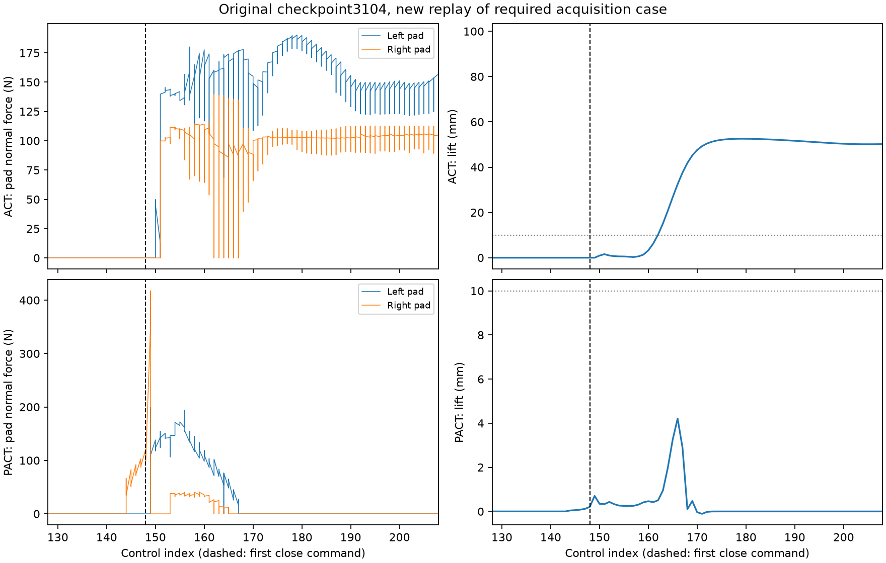
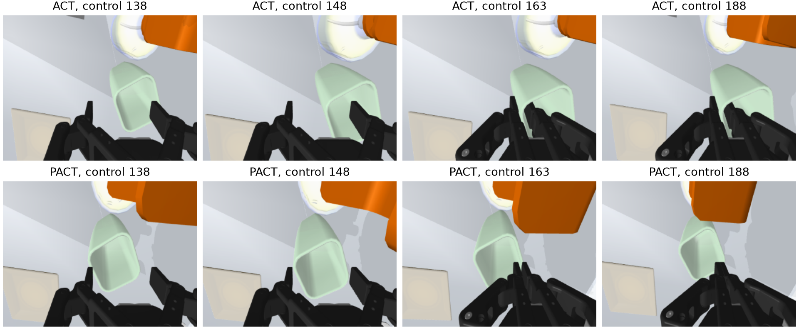

# Selected required3104 replay: descriptive contact evidence

These are **new instrumented replays**, not historical rollout videos. Both retained their original task outcomes and exclusive categories. This selected pair does not estimate failure prevalence or intervention effect.

At close command148, the PACT achieved TCP is18.048mm above the requested TCP; the local FK discrepancy is0.456mm. The measured TCP is4.672mm above the dynamically rotated collider rim, while the requested TCP is13.376mm below it. The longest continuous bilateral contact is0.582s, and the cup never lifts10mm (maximum4.210mm). Contact begins at observation144, before closure. ACT touches at150, holds at159, lifts at162 and eventually succeeds; both pads retain contact through its initial lift.

The solver-force timeline shows transient PACT contact that ends near control170, while ACT sustains pad contact and lifts the cup. The images show the PACT grasp closing with shallower rim engagement. This supports an acquisition-stage description for this replay. It does not prove that contact force, chunk averaging or a positive tracking gap alone causes failure; successful ACT also has a positive close tracking gap.

Force curves sum solver contact normal forces per pad; they are not estimates of real-world finger force. `evidence.json` binds the analysis source and raw diagnostic H5s. The displayed total bilateral-contact duration is distinct from the longest continuous interval used by the mechanism metrics.
