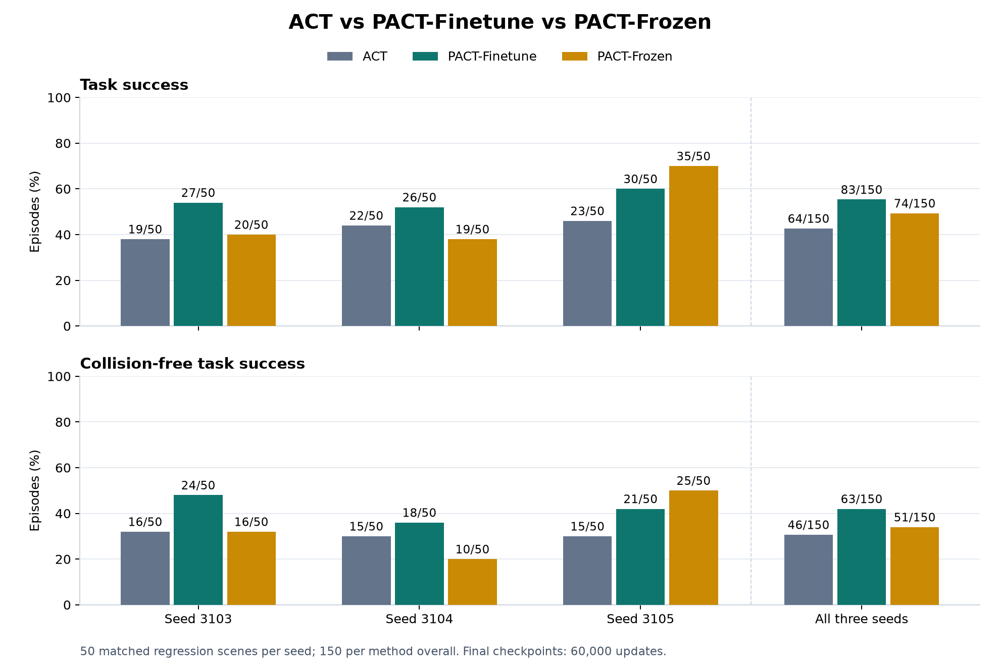

# ACT vs PACT-Finetune vs PACT-Frozen: seeds 3103, 3104 and 3105

PACT-Finetune leads on pooled task success and collision-free task success. It beats ACT on both endpoints in every seed. Against PACT-Frozen, it improves seeds 3103 and 3104; frozen PACT retains the lead on seed 3105.

Both new policies completed 60,000 committed updates, and all 100 new evaluations completed with observed exit 0. Together with retained seed3103 and the verified ACT/frozen baselines, each method has 150 matched evaluations. Independent raw reading confirmed all 450 trajectories and 150 three-way initial-state matches.

## Combined results

| Method | Task success | Collision-free success | Pickup failures | Hazard/clutter contact frames |
|---|---:|---:|---:|---:|
| ACT | 64/150 (42.7%) | 46/150 (30.7%) | 35/150 | 371,293 |
| PACT-Finetune | 83/150 (55.3%) | 63/150 (42.0%) | 26/150 | 85,933 |
| PACT-Frozen | 74/150 (49.3%) | 51/150 (34.0%) | 42/150 | 135,897 |

Compared with frozen PACT, fine-tuning adds nine task successes (+6.0 percentage points), 12 collision-free successes (+8.0 points), and removes 16 net pickup failures. Compared with ACT, it adds 19 task successes (+12.7 points) and 17 collision-free successes (+11.3 points).

Combined hazard/clutter contact frames fall by 36.8% relative to frozen PACT, while hazard-bar frames rise by 22.3%. The reduction is driven by clutter contact; it should not be read as improvement in every contact class.

## Per-seed results

Every row contains the same 50 original scenes for that seed.

| Seed | Method | Task success | Collision-free success | Pickup failures |
|---|---|---:|---:|---:|
| 3103 | ACT | 19/50 (38%) | 16/50 (32%) | 12/50 |
| 3103 | PACT-Finetune | 27/50 (54%) | 24/50 (48%) | 8/50 |
| 3103 | PACT-Frozen | 20/50 (40%) | 16/50 (32%) | 16/50 |
| 3104 | ACT | 22/50 (44%) | 15/50 (30%) | 12/50 |
| 3104 | PACT-Finetune | 26/50 (52%) | 18/50 (36%) | 7/50 |
| 3104 | PACT-Frozen | 19/50 (38%) | 10/50 (20%) | 18/50 |
| 3105 | ACT | 23/50 (46%) | 15/50 (30%) | 11/50 |
| 3105 | PACT-Finetune | 30/50 (60%) | 21/50 (42%) | 11/50 |
| 3105 | PACT-Frozen | 35/50 (70%) | 25/50 (50%) | 8/50 |

On seed3105, fine-tuned PACT loses five task successes and four collision-free successes relative to frozen PACT; pickup failures rise from eight to 11. Its combined contact count is effectively unchanged (24,604 versus 24,607 frames). The pooled advantage does not remove this seed-specific regression.

[Download the chart as PDF](figures/three_seed_comparison.pdf)

## Contact classes and engagement

| Contact class / measure | ACT | PACT-Finetune | PACT-Frozen |
|---|---:|---:|---:|
| Hazard-bar frames | 232,733 | 54,634 | 44,673 |
| Clutter frames | 160,802 | 32,207 | 92,866 |
| Grasp-target frames | 807,383 | 1,014,190 | 954,989 |
| Other-environment frames | 2,667 | 0 | 0 |
| Mounted-fixture frames | 2,596 | 0 | 0 |
| Place-receptacle frames | 0 | 0 | 0 |
| Frame avoidance | 91.666% | 98.071% | 96.950% |

| Endpoint, out of 150 | ACT | PACT-Finetune | PACT-Frozen |
|---|---:|---:|---:|
| Raw touched but never held | 37 | 27 | 47 |
| Ever held | 71 | 103 | 86 |
| Lifted at least 1 cm | 74 | 98 | 87 |
| Lift sustained at least 15 observations | 69 | 91 | 79 |
| Post-lift placement failures | 8 | 14 | 12 |
| Held without lift failures | 1 | 6 | 4 |
| No target interaction failures | 40 | 20 | 17 |
| Supported without final success | 2 | 1 | 1 |

Fine-tuned PACT shows more holding and lifting and fewer pickup failures than frozen PACT. Post-lift placement failures increase from 12 to 14; this is a failure-stage count across all scenes, not a causal or conditional placement estimate.

Each method has 4,455,150 physics-contact samples (29,701 per rollout, nominal 2 ms spacing), 900 actions and 901 observations per scene. Hazard/clutter union counts overlapping contact once. Target contact is reported separately from forbidden contacts. Exclusive pickup failure follows the existing failure-stage priority; raw touched-but-never-held is a separate descriptor.

## Paired changes

| Fine-tuned PACT compared with | Task gains / losses | Collision-free gains / losses | Pickup failures removed / introduced |
|---|---:|---:|---:|
| ACT | 33 / 14 | 30 / 13 | 25 / 16 |
| PACT-Frozen | 30 / 21 | 29 / 17 | 32 / 16 |

Gains and losses refer to the same seed and scene identity. A newly introduced pickup failure is a regression. [The CSV](paired_scene_comparison.csv) contains all 150 scene groups; [comparison.json](comparison.json) contains complete paired changes by seed and both independent and original metric rows.

## Method and verification

The intervention is unchanged from seed3103: main’s trainable encoder stem/transformer, 128-D CLS readout, minimum pooling and eight causal proximity frames. All three fine-tuned runs start with the same original pretrained encoder, not a previously fine-tuned seed. The original split (240 train / 40 validation), uniform starts, action/state statistics, wrist input, policy architecture, history100 controller and fixed final 60,000-update checkpoint rule are preserved. This measures the full main method, including its changed readout and pooling.

The upstream sources remain byte-identical to prox_learning main af286905719c939c74e6f7c9cf1cc2ed7a9e5e64 and its ACT pin d956cbcab832a39e83f7face8b533a0c1bfad06c. The [upstream manifest](../pact_place_v1010c_readout_s3103/upstream_manifest.json) retains 18 source copies; the [adapter provenance](adapter_provenance.json) and [execution plan](../../docs/PACT_PLACE_V1010C_THREE_SEED_PLAN.md) record the seed/output adaptations and resource wrapper.

Both requested seed bindings passed preflight, including actual encoder updates, live causal parity, original sample/RNG preservation and checkpoint pairing. Both new runs retained a 300-update pilot and completed the remaining 59,700 updates. Independent checkpoint inspection confirmed 2,000 consecutive epochs, all 390 optimizer states at update60,000, correct fresh seeds and original pretrained initialization. [Training verification](root_review/training_execution_verification.json).

The new runs have 104 valid observed worker exits: 100 evaluations and four training segments, with zero failed workers. Hourly manual reviews and minute resource telemetry were retained. Training ran one seed at a time; six evaluation workers used the tested capacity controls and read-only training-cache advice. The pipeline exited0 and was observed by the root through session96198. [Pipeline exit observation](root_review/pipeline_exit_observation.json) and [manual checks](manual_checks.jsonl).

All 300 original ACT/frozen results were checked against their exact seed-specific 60,000-update models, statistics and history100 horizons. [Baseline model provenance](baseline_model_provenance.json). The independent reader then verified all 450 raw outcome, pickup/lift, action-decoder and contact endpoints, all 150 three-way initial-state groups, model-pair hashes and protected source hashes. The analyzer exited0, observed by the root through session17163. The original root EVAL.md, models and completed seed3103 artifacts remain unchanged.

The earlier seed3103 run’s rendering diagnosis and training infrastructure recoveries remain disclosed in its [review](../pact_place_v1010c_readout_s3103/FINAL_REVIEW.md). The two new runs had no training interruptions or evaluation replacements.

Each seed uses its original scene block, so per-seed variation reflects both policy training and scene-block variation. These are previously exposed regression scenes. The results establish this three-seed regression comparison; they do not isolate unfreezing alone or establish fresh-test generalization.

## Saved final model pairs

| Seed | Policy | Encoder |
|---|---|---|
| 3103 | [Policy](../pact_place_v1010c_readout_s3103/checkpoint/policy_last.ckpt) | [Encoder](../pact_place_v1010c_readout_s3103/checkpoint/prox_encoder.pt) |
| 3104 | [Policy](seed3104/checkpoint/policy_last.ckpt) | [Encoder](seed3104/checkpoint/prox_encoder.pt) |
| 3105 | [Policy](seed3105/checkpoint/policy_last.ckpt) | [Encoder](seed3105/checkpoint/prox_encoder.pt) |
