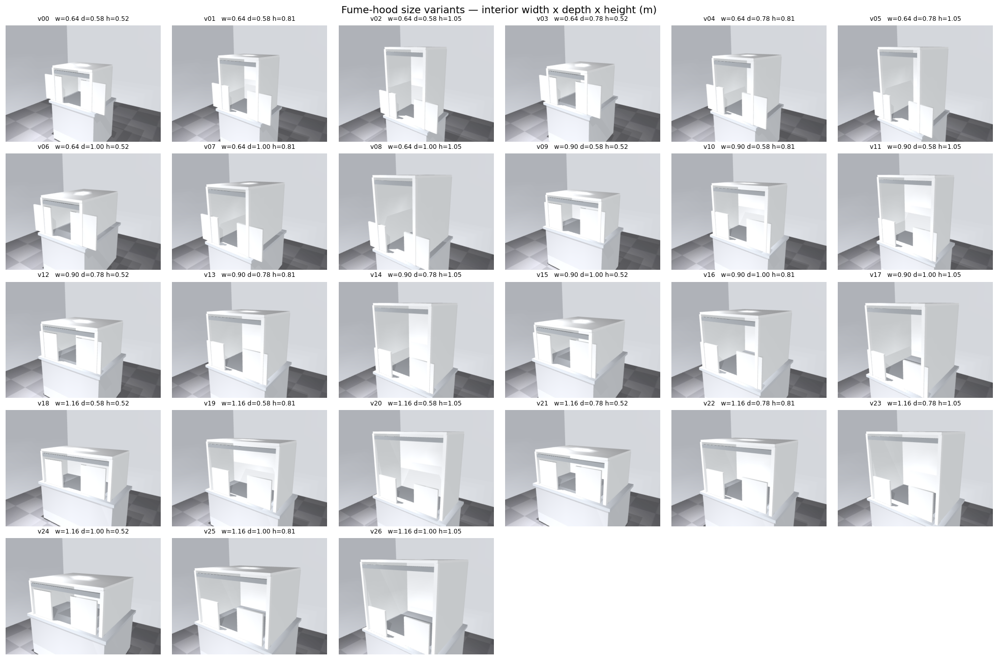
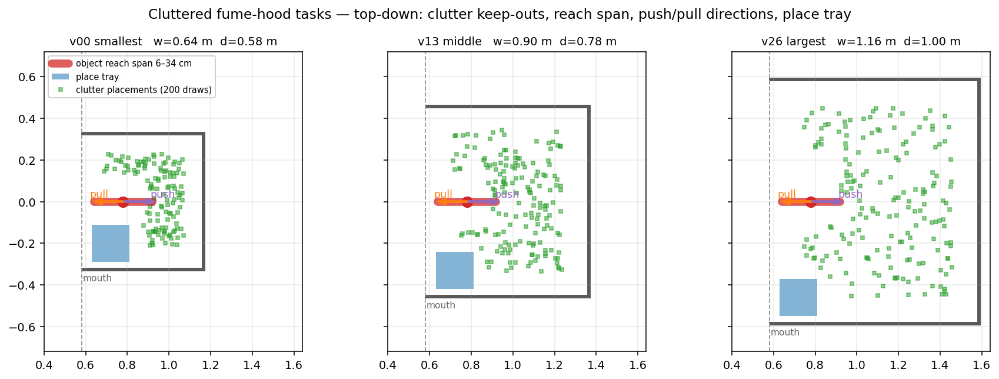

# fumehood_env — cluttered, size-varying fume-hood tasks

Builds on the fume-hood pick environment (`FrankaSkinHybridInvisObstacleConfig`,
molmospaces `main` @ `4a938b2`) with the four requested extensions:

| Item | What was done | Where |
|---|---|---|
| Clutter detected by the skin | 0–9 items per episode on the bench, kept out of the mouth→object corridor so the skin grazes them instead of them blocking the grasp; positions + AABBs logged in `scene_params` (`n_clutter_placed`, `clutter_aabbs`) | `cluttered_fumehood.py` |
| Hood size varied a lot | 27 scene variants: interior width 0.64–1.16 m × depth 0.58–1.00 m × height 0.52–1.05 m, one per house index, so a single run sweeps every geometry | `gen_fumehood_variants.py`, `custom_scenes/` |
| Motions that get the robot in more | object depth drawn 6–34 cm past the mouth every episode (`reach_frac` in `scene_params`); was pinned at ~10 cm | `cluttered_fumehood.py` |
| More tasks | **pick-and-place** (mocap `place_tray` in every scene, sampler returns a `PickAndPlaceTask`; pattern follows `FridgePickAndPlaceTaskSampler`), **push** (closed-gripper sweep toward a per-episode goal, deeper or lateral), and **pull** (grasp + drag toward the mouth). Push/pull success is displacement-based (>=8 cm along the commanded direction) | `ClutteredFumehoodPickAndPlaceSampler`, `push_pull.py` |





## Running

Everything is self-contained in this directory; molmospaces stays untouched.
Requires molmospaces `main` @ `4a938b2` (or later) importable.

```bash
cd /path/to/prox_learning
export PYTHONPATH=$PWD:$PYTHONPATH        # makes fumehood_env importable
export MUJOCO_GL=egl                       # plus MUJOCO_EGL_DEVICE_ID for your GPU

# 1. preflight, pick task: 3 hood sizes x 2 episodes (~10 min)
python fumehood_env/collect_dense.py \
    --config FrankaSkinClutteredFumehoodCheckConfig \
    --houses 1,313,625 --samples 2 --output_dir /tmp/clutter_check

# 2. preflights for the other tasks: 2 hood sizes x 2 episodes each
for CFG in PnP Push Pull; do
  python fumehood_env/collect_dense.py \
      --config FrankaSkinClutteredFumehood${CFG}CheckConfig \
      --houses 1,313 --samples 2 --output_dir /tmp/${CFG}_check
done

# 3. full runs (27 sizes x 5 episodes = up to 135 each)
H=$(python3 -c "print(','.join(str(1+24*k) for k in range(27)))")
python fumehood_env/collect_dense.py --config FrankaSkinClutteredFumehoodConfig \
    --houses "$H" --samples 5 --output_dir <out>/cluttered_v1
python fumehood_env/collect_dense.py --config FrankaSkinClutteredFumehoodPnPConfig \
    --houses "$H" --samples 5 --output_dir <out>/cluttered_pnp_v1
# likewise ...PushConfig / ...PullConfig
```

Every collection run writes per-episode multi-camera MP4s next to the h5s, so
rollout videos come for free from the preflights onward. After any run,
`analysis/plot_clutter_activation.py` produces the clutter-vs-skin-activation
figure (the quantitative "clutter is detected by the sensors" check), and
`analysis/plot_env_design.py` regenerates the design overview above.

House index ↔ variant mapping: house `1+24k` → `custom_scenes/fumehood_v{k:02d}.xml`
(indices stay ≡ 1 mod 24 so every episode remains the same red-cup task; the
spacing exists only to select scene files). To regenerate or change the size
grid, edit `WIDTHS/DEPTHS/HEIGHTS` in `gen_fumehood_variants.py` and rerun it —
it also writes the `*_metadata.json` sidecars, without which molmospaces scene
compilation fails.

## Verification status (be aware before running)

* **Pick sampler + all 27 scenes**: runtime-verified. A preflight ran 6/10
  successful episodes across three hood sizes, then a full 27-house × 5-episode
  collection (135 episodes) completed on 2026-08-06.
* **Pick-and-place sampler**: implemented and import/MRO-verified (the
  PickAndPlace branch of the MRO resolves ahead of PickTask, so
  `_sample_task` returns a `PickAndPlaceTask`). It has **not** produced data
  yet — the workstation it was built on started killing every collection
  process on Aug 7 (hardware/OS issue, not code) before a run could finish.
  Expect the first run to be a genuine first run.
* **Push / pull**: code-complete, syntax-verified, and written strictly
  against the upstream primitive API (`GripperAction` / `TCPMoveSequence` /
  `compute_grasp_pose`, same IK checks as the pick planner; every referenced
  config field verified to exist upstream). Never executed — same machine
  issue. Run their Check configs first; the most likely first-run issue is
  IK rejection of push waypoints in the smallest hood, which the sampler
  retry loop should absorb.
* `collect_dense.py` forces `num_workers=1`; see its docstring for why
  (fixed-seed workers replay identical episodes — the same defect the
  hybrid_obstacle_v1 audit found).

## Upstream issues found while building this (worth fixing in molmospaces)

1. `FumehoodSampler._apply_theta` hardcodes the default hood's wall boxes into
   the planner's `obstacle_aabbs` (`[0.95, ±0.45, 1.12]`, `[1.36, 0, 1.12]`) —
   wrong for any resized hood. `ClutteredFumehoodPickSampler` drops those
   entries and rebuilds the shell from the compiled model instead.
2. `get_valid_pickupable_obja_uids()`'s cache path
   (`VALID_PICKUPABLE_OBJA_UIDS_PATH`) points at `/weka/...`, which doesn't
   exist off-cluster — so every import re-scans ~130k annotations (10–30 min
   cold). See `patches/local_uid_cache.md` for the two-line local fallback.
3. Custom scenes silently fail compilation without a `<scene>_metadata.json`
   sidecar; the generator here always emits one.
