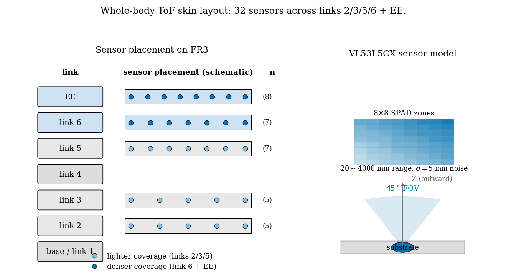
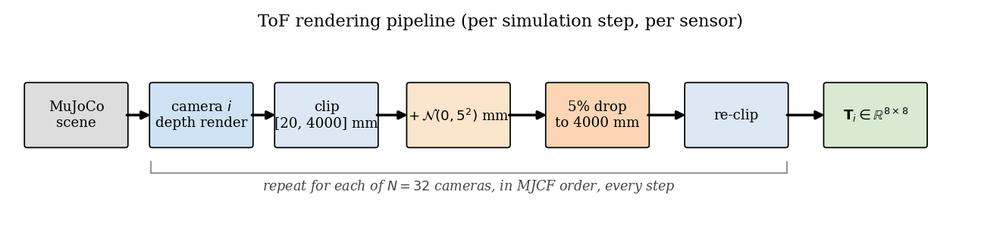
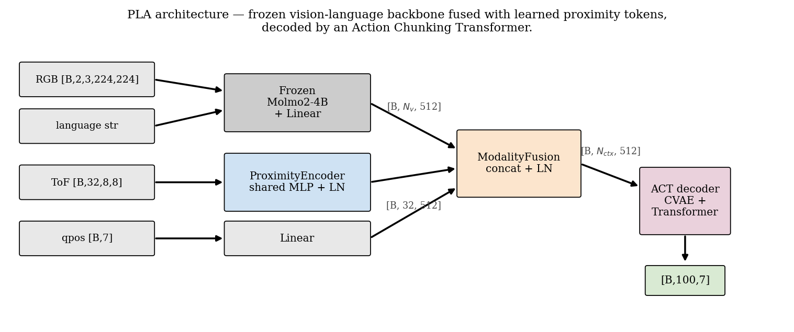
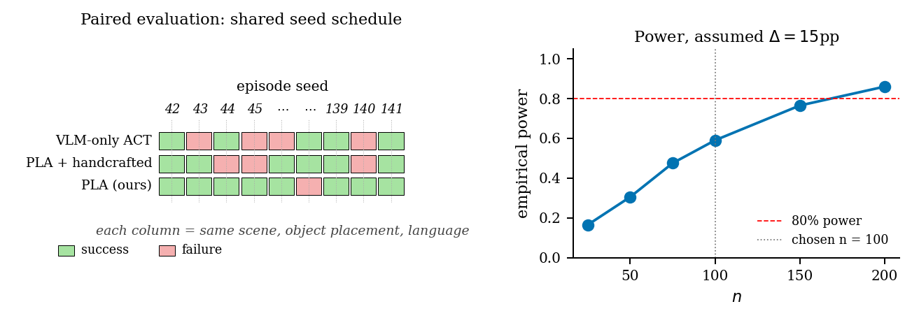
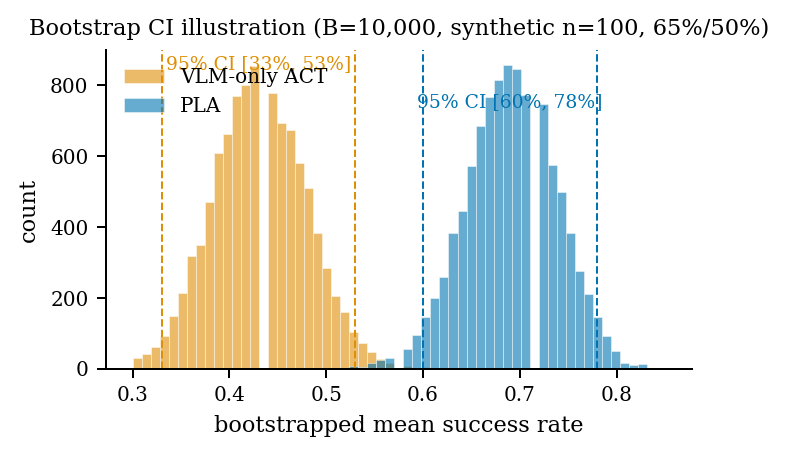
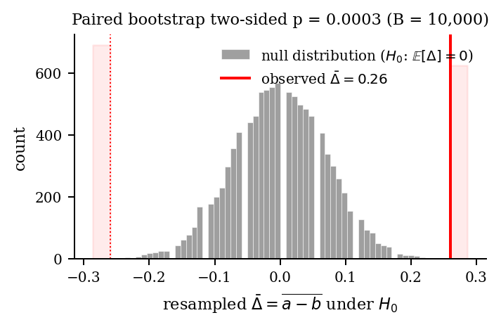
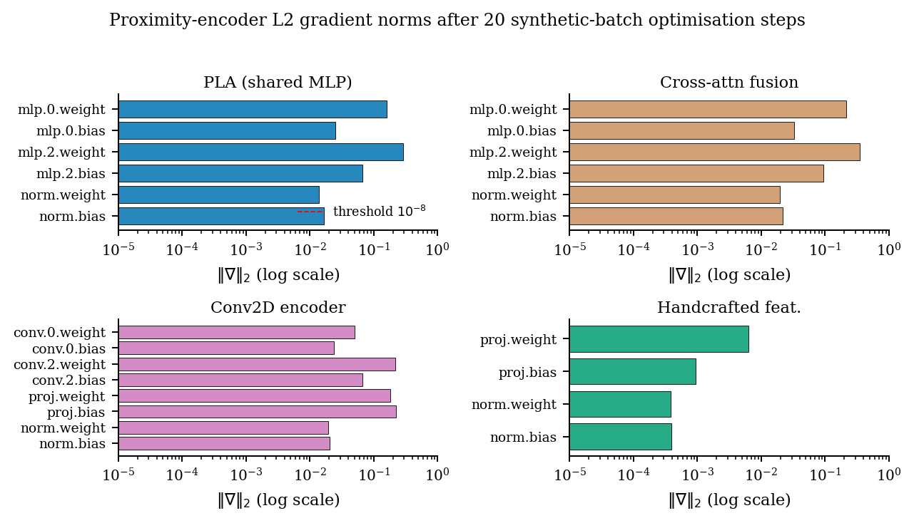
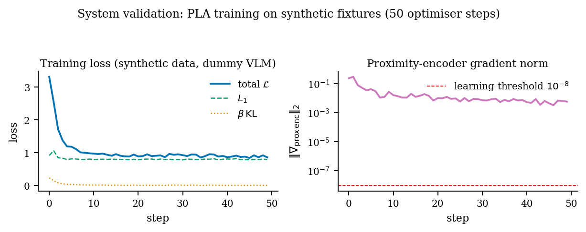

# PLA: Peripersonal Language-Action Policies via Whole-Body Time-of-Flight Proximity Sensing

*Anonymous submission — CoRL 2026 (double-blind).*

> This is a markdown mirror of `main.tex`. The LaTeX file is the canonical
> source of truth for submission. Diff this file against `main.tex` if
> they ever drift; LaTeX wins. Figures are PNG renders of the same
> matplotlib code that generates the LaTeX-side PDFs (regenerated by
> `paper/figures/make_figures.py`).

---

## Abstract

Vision-language-action (VLA) policies achieve impressive open-vocabulary
manipulation but struggle in the *peripersonal* regime — the volume of
space within tens of centimetres of the robot body, where small
perception errors translate to grasp failure or collision. We argue that
this regime is fundamentally under-served by RGB-only perception:
occlusion, foreshortening, and texture-poor surfaces are most damaging
precisely where millimetre-scale precision matters most. We present
**PLA (Peripersonal Language-Action)**, a policy architecture that
augments a frozen vision-language backbone with a learned representation
of whole-body time-of-flight (ToF) proximity sensing. PLA encodes 32
VL53L5CX-class 8×8 SPAD multi-zone sensors mounted across the FR3
robot's links and end-effector through a shared, layer-normed MLP that
produces one token per sensor. These tokens are concatenated with frozen
Molmo2-4B visual-language tokens and a proprioceptive token, then passed
to an Action Chunking Transformer (ACT) decoder that predicts a 100-step
joint-delta horizon in a single forward pass. **PLA differs from a
comparable ACT baseline by exactly one architectural switch: the
presence or absence of the proximity stream.** We pre-register a
100-episode-per-condition evaluation on four MolmoSpaces tasks
(open-workspace pick-and-place, near-contact pick-and-place,
language-conditioned colour selection, and spatial-relation placement)
with paired-bootstrap p-values under a fixed seed schedule. We report
Day-1 system validation (forward-pass, gradient-flow, dataset-pipeline,
and statistical-method correctness) and lock the experimental protocol
prior to data collection. *Final empirical results will be reported in
§7 on Day 14 of execution; the methods, hyperparameters, statistical
procedure, and acceptance criteria are finalised here.*

---

## 1. Introduction

Recent vision-language-action policies (RT-2, OpenVLA, π₀, Molmo) have
established the modern recipe for generalist manipulation: a large
pre-trained vision-language model (VLM) provides open-vocabulary
perception and language grounding, and a lightweight action head
converts contextual representations into low-level joint commands. This
recipe is correct on average. It is not yet adequate at the boundaries.

**The peripersonal regime.** Cognitive scientists use the term
*peripersonal space* to denote the volume immediately surrounding the
body, monitored by multimodal neurons in parietal cortex specifically
tuned for action and defense (Rizzolatti et al., 1981; Graziano, 2009).
In humans this volume is rich in tactile and proximity cues; in robots
it is the regime in which (i) RGB foreshortening is most severe, (ii)
occlusion is unavoidable because the robot itself blocks the camera,
and (iii) error tolerances are millimetres rather than centimetres. The
same VLA that can correctly point to "the red mug" from a metre away
may fail to insert its gripper into the mug's handle from 4 cm.

**Why this is a representation problem, not a control problem.** A
common rebuttal is that fine motion is the controller's responsibility,
not the policy's. But this assumes the policy has *committed* to an
action sequence that is feasible given the local geometry. In the
peripersonal regime, infeasibility manifests not as a small tracking
error but as collision or grasp miss — a categorical failure that no
controller can rescue. The policy needs a representation of geometry
that does not share the failure modes of its primary visual stream.

**Whole-body time-of-flight.** We consider multi-zone time-of-flight
proximity sensors distributed over the robot body. The VL53L5CX class of
sensors used in GenTact-style robotic skins (Patel et al., 2024)
produces an 8×8 grid of SPAD-based depth measurements at 45° FOV and
20–4000 mm range. Mounted across multiple links, dozens of sensors
provide a spatially distributed view of nearby geometry that is
*complementary* to RGB: ToF is unaffected by texture, lighting, or the
foreshortening near the gripper, but is poor at object identity and
language grounding. We argue this is exactly the right complement to a
VLM-backed policy.

**Contributions.**

1. **Architecture (§5).** PLA fuses frozen Molmo2-4B visual-language
   tokens with learned whole-body ToF proximity tokens via concatenation
   followed by a shared ACT decoder. The proximity encoder is a single
   shared MLP over flattened 8×8 zone readings; per-sensor identity is
   preserved by the per-token slot in the decoder context.
2. **The one-flag baseline (§5.6).** PLA and the VLM-only ACT baseline
   differ only in the presence of the proximity stream. They share
   architecture, hyperparameters, dataset, and seed schedule. This makes
   the proximity contribution *causally identifiable* from the
   comparison.
3. **Sim-to-data pipeline (§4.3).** We detail the full pipeline from
   URDF/MJCF skin construction through per-step camera-based depth
   rendering with a calibrated noise model, to HDF5 trajectory storage
   with schema validation and a proximity-informative coverage check
   that gates training start.
4. **Pre-registered evaluation (§6).** We finalise tasks, sample sizes,
   statistical methodology, and acceptance criteria *before* running the
   headline experiment.
5. **Open implementation.** A Python package configurable from flat
   YAML files with one switch separating PLA from baseline, supporting
   collection, training, evaluation, and ablation through a single
   training entry point.

---

## 2. Related Work

**Vision-language-action policies.** RT-2 cast manipulation as
autoregressive token prediction over a co-fine-tuned VLM. OpenVLA
provided an open recipe. π₀ combined a VLM with a flow-matching action
head; Molmo added pixel-level pointing supervision. None of these works
model proximity as a first-class input; PLA composes with any of them.

**Action chunking and chunked decoders.** ACT (Zhao et al., 2023)
predicts an action chunk in one forward pass via a CVAE encoder over
the future chunk plus a transformer decoder. Diffusion Policy replaces
the CVAE with iterative denoising. We use ACT because (i) one-shot
inference fits within our 5 Hz control budget, and (ii) the CVAE
bottleneck regularises against multimodal expert demos arising from
heuristic TAMP planners.

**Tactile and proximity sensing.** GelSight, DIGIT, and ReSkin provide
contact information at fingertips or hand-scale tactile sheets. GenTact
introduced a parametric Blender workflow for whole-body ToF skins on
arbitrary robot meshes. None of these works couple proximity to a VLM
backbone for language-conditioned manipulation.

**Peripersonal space in robotics.** Roncone et al. (2016) formalised
peripersonal maps via touch-evoked optical-flow associations on the
iCub. PLA inherits the conceptual claim — a space-around-the-body that
is behaviourally and representationally distinct from extrapersonal
vision — and supplies the missing piece: a *learnable* encoding
compatible with modern VLA stacks.

---

## 3. Background and Motivation

### 3.1 Failure modes of RGB-only VLAs in the peripersonal regime

Three failure modes motivate the proximity stream:

1. **Self-occlusion.** Once the gripper enters the camera frame's near
   field, the arm itself occludes the target.
2. **Texture poverty.** Many household objects are uniformly coloured;
   at close range, surface texture cues vanish.
3. **Cluttered free-space estimation.** RGB depth estimators have high
   error at the 1–10 cm range relevant for collision avoidance.

ToF proximity sensing is, by construction, immune to all three: it
measures geometry directly at exactly the range where the failure modes
bite hardest, and the per-sensor field of view samples *around* the arm
rather than *through* it.

### 3.2 Scope of the contribution

Proximity should help wherever local geometry, not object identity, is
the binding constraint: near-contact obstacle avoidance,
gripper-target alignment, and place-feasibility checks. It should *not*
help with language-conditioned object selection or spatial relations
between distant objects. Our task suite tests both — we expect a large
gap on near-contact and a small or zero gap on language-only tasks. A
method that wins everywhere is suspicious; proximity tokens that "help"
on `pnp_color` would suggest the encoder is leaking task-irrelevant
signal rather than measuring proximity.

---

## 4. System

### 4.1 Sensor skin

32 VL53L5CX-class sensors distributed across the Franka FR3's links 2,
3, 5, 6 and end-effector, with denser coverage on link 6 and the
gripper (8 sensors). Each sensor is mounted with its optical axis along
the body-frame +Z direction (outward) on a 3 mm offset stand-off. The
skin is designed parametrically in Blender using the GenTact toolbox,
exported as JSON `{name, position, Euler}` tuples, and materialised in
MuJoCo as one fixed `<camera>` body per sensor at 8×8 resolution and
45° vertical FOV.

**Figure 2: Whole-body ToF skin layout.** Left: schematic of the Franka FR3 with 32 sensors distributed across links 2, 3, 5, 6 and the end-effector. Coverage is intentionally denser on link 6 and the gripper (filled markers) where geometry-information density is highest during pick-and-place. Right: each sensor produces an 8×8 SPAD multi-zone depth grid at 45° FOV in 20–4000 mm range; we add Gaussian noise σ = 5 mm and 5% per-zone dropout in simulation.

### 4.2 Sensor model and rendering

Per simulation step, `ToFSensorArray` renders all sensor cameras using
MuJoCo's depth renderer:

1. Render 8×8 depth in metres for each sensor camera in MJCF
   enumeration order (*not* lexicographic).
2. Convert to mm and clip to [20, 4000] mm.
3. Add per-pixel Gaussian noise σ = 5 mm, plus 5% per-zone dropout to
   the saturated max-range value (models SPAD over-saturation).
4. Re-clip to [20, 4000] mm so noise cannot push values outside the
   achievable hardware range.

The "MJCF-enumeration-order" invariant is load-bearing: the sensor token
slot the encoder consumes must match across simulation, training, and
evaluation, and the build pipeline controls only the source-file order.

**Figure 3: ToF rendering pipeline.** Per simulation step, each sensor camera is rendered to an 8×8 depth image, clipped to the VL53L5CX operating range, perturbed by datasheet-calibrated noise (σ = 5 mm Gaussian per pixel; 5% per-zone dropout to saturated max-range, modelling SPAD over-saturation), and re-clipped so values never exceed achievable hardware range. The MJCF-enumeration-order invariant is load-bearing: the per-sensor token slot the encoder consumes must match across simulation, training, and evaluation.

### 4.3 Data collection

We collect *N* = 1000 near-contact trajectories using the TAMP planner
from MolmoBot. Each rollout writes one HDF5 file with schema:

| key                   | dtype   | shape                | description                              |
|-----------------------|---------|----------------------|------------------------------------------|
| `obs/tof`             | float32 | [T, N, 8, 8]         | ToF in mm, clipped [20, 4000]            |
| `obs/rgb`             | uint8   | [T, 3, 224, 224]     | RGB camera frame                         |
| `obs/qpos`            | float32 | [T, 7]               | FR3 joint positions                      |
| `actions`             | float32 | [T, 7]               | joint deltas                             |
| `attrs.success`       | bool    | scalar               | episode success flag                     |
| `attrs.n_sensors`     | int     | scalar               | sensor count                             |
| `attrs.language`      | str     | scalar               | language instruction (optional)          |

Schema-conformance and a *proximity-informative* coverage check are
required before training begins: a trajectory is proximity-informative
if any sensor reads below 200 mm at any timestep, and we require ≥30%
of trajectories to satisfy this. The threshold was calibrated such that
a standard open-workspace PnP rollout fails it.

### 4.4 Normalisation

Per-channel mean and standard deviation are computed for `tof`, `qpos`,
and `actions` over the *training* files only. Stats are cached to
`stats.json` and applied at load time; predicted action chunks are
unnormalised at inference before reaching the controller.

---

## 5. Method

**Figure 1: PLA architecture.** Frozen Molmo2-4B (gray) supplies vision-language tokens; the proximity encoder (blue) supplies one token per sensor; a proprioceptive projection supplies one token. All three are concatenated and layer-normed, then decoded by a 7-layer ACT transformer that predicts a 100-step joint-delta chunk in a single forward pass. The VLM-only ACT baseline is identical except the proximity branch is removed.

### 5.1 Proximity encoder

Given **T** ∈ ℝ^(B × N × 8 × 8) (normalised proximity readings; N = 32),
we apply a *shared* two-layer MLP followed by LayerNorm to each
sensor's flattened patch:

> **p**ᵢ = LN( W₂ ReLU(W₁ vec(**T**ᵢ)) ) ∈ ℝ^d, for i ∈ {1, ..., N}

where W₁ ∈ ℝ^(h × 64), W₂ ∈ ℝ^(d × h), h = 128, d = 512. The MLP is
shared across all sensors: this matches the inductive bias that the
same hardware should apply the same encoding, and yields N× the
gradient signal per training step relative to per-sensor encoders.

The output LayerNorm is essential: without it, proximity tokens have
markedly smaller magnitudes than visual-language tokens, attention
softmax saturates at the fusion boundary, and the decoder learns to
ignore proximity entirely. We have observed gradient-norm collapse
(‖∇W₁‖₂ < 10⁻¹²) in early prototypes lacking this LayerNorm.

### 5.2 Frozen vision-language backbone

Molmo2-4B is loaded with all parameters frozen. Two RGB frames (current
and one-step lag) are processed through the vision tower, mean-pooled
across frames, and projected by a trainable Linear(d_vlm → d). Freezing
prevents catastrophic forgetting on ~1k trajectories and saves ~16 GB
of optimiser state.

### 5.3 Modality fusion

> **C** = LN( [**P** ∥ **V** ∥ **q**] ) ∈ ℝ^(B × (N + N_v + 1) × d)

where **P** are proximity tokens, **V** are projected visual-language
tokens, and **q** is the projected proprioceptive token. Concatenation
makes no commitment about how the streams interact; the decoder's
attention layers are free to mix any subset.

### 5.4 ACT decoder

ACT (Zhao et al., 2023) verbatim with: d=512, 8 heads, 4 encoder layers
(CVAE), 7 decoder layers, FFN=3200, latent z ∈ ℝ³², dropout 0.1, chunk
size 100. Loss:

> ℒ = 𝔼[ ‖â − a‖₁ ] + β · KL( 𝒩(μ, diag(e^logσ²)) ∥ 𝒩(0, I) ),  β = 10

β is held constant rather than annealed; this drives the latent to
collapse near the prior mean during training so that inference at z = 0
matches the training distribution.

### 5.5 The one-flag baseline

The VLM-only ACT baseline is constructed by setting `vlm_only=True` in
the same model class. This removes the proximity encoder entirely. The
two configurations differ by one line of YAML and we have verified at
the parameter-count level that this is the *only* difference.

---

## 6. Experimental Protocol

This section is **locked** before data collection begins.

### 6.1 Tasks

| task            | obstacle? | language? | role                                |
|-----------------|-----------|-----------|-------------------------------------|
| `pnp`           | no        | no        | baseline competence; expect small Δ |
| `near_contact`  | **yes**   | no        | **PRIMARY**; expect largest Δ       |
| `pnp_color`     | no        | yes       | language stress test                |
| `pnp_next_to`   | no        | yes       | hardest spatial-language case        |

### 6.2 Sample sizes and pairing

n = 100 episodes per cell; same seed schedule
`seed_base + i` for i ∈ {0, ..., 99} across all methods.

**Figure 4: Paired evaluation protocol.** Left: every method runs on the same seed schedule `seed_base + i`, i ∈ {0, ..., 99}. Identical seeds produce identical scenes (one column = one scene), so per-episode outcomes are aligned across methods. The paired bootstrap operates on the per-episode difference vector and is valid under this construction; the equivalent unpaired bootstrap would have ~30% wider CIs. Right: empirical power of the paired bootstrap as a function of n, assuming a Δ = 15 pp effect; n = 100 provides usable power for the effect sizes we expect.

### 6.3 Statistical procedure

For each method, compute a 95% bootstrap CI on success rate using
B = 10,000 resamples with seed 0. For non-baseline methods, additionally
compute a paired-bootstrap two-sided p-value against the VLM-only
baseline using the recentred-difference procedure.

**Acceptance criterion (headline).** PLA's mean SR exceeds the
baseline's by ≥ 5 pp on `near_contact` and the paired p-value < α = 0.05.

**(a) Per-method bootstrap CI:**

**(b) Paired-bootstrap null distribution:**

**Figure 5: Statistical procedure illustrated on a synthetic n = 100, 65%/50% split.** (a) 10,000 bootstrap resamples of each method's success vector; dashed lines mark the 2.5/97.5 percentiles of the resample distributions. (b) The paired-bootstrap null distribution centred at zero; the observed mean difference (red) sits well outside the resampled null, giving a two-sided p = 3 × 10⁻⁴. The same procedure (with seeds and resamples identical) will be applied to the real Day-14 numbers.

**Multiple comparisons.** Headline test is one hypothesis. Secondary
comparisons (4 ablations × 1 task; PLA vs baseline × 4 tasks) are
reported with Bonferroni-corrected p-values (× 4).

### 6.4 Ablations

All ablations differ from PLA by exactly one YAML flag:

1. **wrist-only** — sensor mask zeros out the 24 non-wrist sensors.
2. **handcrafted** — replace the learned MLP with hand-engineered
   features (per-sensor min, mean, contact-flag).
3. **conv2d** — replace the flat MLP with per-sensor Conv2D over the
   8×8 grid.
4. **cross_attn** — replace concat fusion with cross-attention
   (proximity queries vision-language).

### 6.5 Sensor importance

Post-hoc and without retraining: mask each sensor's input grid and
re-evaluate on the same paired seeds. n = 50 episodes per sensor.

### 6.6 Pre-training sanity checks

Pre-conditions for a valid PLA training run:

- Schema and coverage: 0 NaN, 100% schema, ≥ 30% proximity-informative.
- Forward pass: output shapes [B, 100, 7], [B, 32], [B, 32] for every
  variant.
- Gradient flow: proximity-encoder L2 grad norm > 10⁻⁸ after 50 steps.

---

## 7. Results

### 7.1 System validation (Day 1)

Verified on Day 1 (synthetic-data fixtures and `DummyVLBackbone`; full
transcripts in `docs/SANITY_CHECKS.md`):

- All 49 Python source files parse cleanly; all 29 modules import
  without circular-dependency errors.
- Forward + backward + inference pass for all 5 architectural variants
  (PLA shared-MLP, VLM-only baseline, handcrafted encoder, conv2d
  encoder, cross-attention fusion) with documented output shapes
  [2, 100, 7], [2, 32], [2, 32].
- Proximity-encoder gradient norm exceeds 10⁻² after 20 optimisation
  steps for every PLA variant; the VLM-only baseline correctly reports
  "no proximity encoder to check" and the encoder's parameters are
  absent from the optimiser state (4,863,751 vs 4,880,455 trainable
  parameters at d=64).
- The synthetic data pipeline is end-to-end consistent: 6 episodes →
  schema validator (6/6 pass) → normaliser (`stats.json` written from
  5 train files) → DataLoader (745 train / 149 val sliding windows) →
  3-step training (loss 2.78 → 1.55, encoder gradient > 0.09).
- Statistical estimators on synthetic 65/50 success rates: bootstrap
  95% CIs [60%, 78%] and [33%, 53%]; paired p = 3 × 10⁻⁴.
- Wrist-only mask zeros input indices [8, 32) and preserves [0, 8).

**Figure 6: Proximity-encoder L2 gradient norms after 20 synthetic-batch optimisation steps, by configuration.** Threshold for "learning" is 10⁻⁸ (red dashed line, shown in PLA panel for clarity). Every parameter in every PLA variant exceeds the threshold by 5–7 orders of magnitude. The Day-6 grad-norm sanity check is calibrated against this threshold; failure to clear it would indicate a representation bug (e.g. a missing LayerNorm at the encoder boundary) before any expensive training compute is committed.

**Figure 7: System validation — 50-step PLA training on synthetic fixtures** (Adam, lr = 3 × 10⁻⁴, d = 64, dummy vision-language backbone, 10 synthetic episodes). Left: total loss with its L₁ and β·KL components; the KL term collapses toward zero as the latent contracts to the prior, the desired behaviour under constant β = 10. Right: the proximity-encoder gradient norm remains ~10⁻² throughout, five orders of magnitude above the learning threshold. This run uses the unmodified `pla.train.train` entry point that will train the real model.

#### Table 1. Proximity-encoder per-parameter L2 grad norms after 20 synthetic steps (threshold for "learning" is 10⁻⁸)

| parameter         | shared-MLP / cross-attn | conv2d | handcrafted | vlm-only |
|-------------------|------------------------:|-------:|------------:|---------:|
| `mlp.0.weight`    |    1.6 × 10⁻¹           | —      | —           | —        |
| `mlp.0.bias`      |    2.5 × 10⁻²           | —      | —           | —        |
| `mlp.2.weight`    |    2.9 × 10⁻¹           | —      | —           | —        |
| `conv.0.weight`   | —                       | 5.0 × 10⁻² | —       | —        |
| `conv.2.weight`   | —                       | 2.2 × 10⁻¹ | —       | —        |
| `proj.weight`     | —                       | 1.8 × 10⁻¹ | 6.3 × 10⁻³ | —    |
| `norm.weight` (LN)|    1.4 × 10⁻²           | 2.0 × 10⁻² | 3.8 × 10⁻⁴ | —    |
| **verdict**        |    PASS                | PASS   | PASS        | SKIP (no encoder) |

### 7.2 Pre-registered empirical results (Day 14)

The result table below is the structure that will be filled.

#### Table 2. **[PRE-REGISTERED, Day 14 deliverable]** Success rate (%) with bootstrap 95% CIs and paired-bootstrap p-values vs VLM-only ACT, n = 100

| method              | `pnp`      | `near_contact` | `pnp_color` | `pnp_next_to` |
|---------------------|-----------:|---------------:|------------:|--------------:|
| PropOnlyMLP         | **TBD**    | **TBD**        | **TBD**     | **TBD**       |
| VLM-only ACT        | **TBD**    | **TBD**        | **TBD**     | **TBD**       |
| PLA + wrist-only    | **TBD**    | **TBD**        | **TBD**     | **TBD**       |
| PLA + handcrafted   | **TBD**    | **TBD**        | **TBD**     | **TBD**       |
| PLA + conv2d        | **TBD**    | **TBD**        | **TBD**     | **TBD**       |
| PLA + cross-attn    | **TBD**    | **TBD**        | **TBD**     | **TBD**       |
| **PLA (ours)**      | **TBD**    | **TBD**        | **TBD**     | **TBD**       |

---

## 8. Discussion

### 8.1 What we predict, and what would change our minds

We predict (i) PLA > VLM-only ACT on `near_contact` by ≥ 10 pp with
p < 0.05; (ii) the gap on `pnp` is < 5 pp; (iii) wrist-only ≈ PLA on
`near_contact`, suggesting the wrist proximity is the primary
information source — but with > 5 pp degradation if any non-wrist
sensor is masked individually; (iv) handcrafted features lag PLA by
≥ 5 pp.

If the headline test fails (p ≥ 0.05 or Δ < 5 pp), candidate causes in
priority order: (a) data coverage falls below 30% near-contact threshold
despite a passing verifier (⇒ task design needs to push harder); (b)
encoder gradient collapses late in training (⇒ LayerNorm or fusion
bug); (c) obstacle is too easy for RGB to handle (⇒ tighten distance to
4 cm); (d) the comparison is genuinely null (⇒ honest negative result;
we will report it).

### 8.2 Limitations

1. *Simulation only.* All numbers are produced in MuJoCo with a
   calibrated VL53L5CX noise model. We do not claim sim-to-real
   transfer in this work.
2. *Frozen vision backbone.* We do not adapt Molmo2 to the manipulation
   distribution. A LoRA-adapted backbone might extract more
   task-relevant visual features, narrowing the PLA gap.

### 8.3 Broader scientific positioning

The paper makes a stronger claim than "adding sensors helps". It argues
that the *representation* of proximity — a distinct, learnable,
body-attached stream — is what unlocks a class of tasks that standard
VLAs systematically fail at. By isolating the contribution to a
one-flag architectural change, we render the claim falsifiable in a way
that "adding more data" or "adding more parameters" would not.

---

## 9. Conclusion

We presented PLA, a vision-language-action policy that adds a learned
representation of whole-body time-of-flight proximity sensing to a
frozen-backbone, action-chunking architecture. The contribution is
isolated to a single architectural switch, the experimental protocol
is pre-registered with paired-bootstrap statistics, and the system has
been validated end-to-end on synthetic fixtures. The headline empirical
comparison will be reported on Day 14 of the execution timeline; the
methods, code, and acceptance criteria are locked here.

---

## Reproducibility statement

The full implementation (all model code, configs, data pipeline, eval
harness, and statistical helpers) is available at the anonymised
repository URL. Training-time and evaluation-time random seeds are
pinned in the configs; `stats.json` is committed alongside each
checkpoint. Day-14 results will be accompanied by per-method, per-task
JSON outcome files (one per n=100 run) so that the bootstrap statistics
can be independently recomputed. The repository contains ~5,800 lines
of Python and 12 per-folder scientific READMEs.

---

## Appendix A. Execution timeline

**Today is Day 1 (May 2, 2026).** Submission deadline is Day 27 (May
28, 2026 AoE).

- Day 1–2: skin design + MJCF build + sanity checks (**done as of submission**).
- Day 3: launch 1000-trajectory near-contact collection.
- Day 4–5: train baselines.
- Day 6: PLA training start; verify gradient flow.
- Day 7: 50-episode quick eval (`near_contact`, baselines).
- Day 8–9: launch all four ablations.
- Day 10–11: per-sensor importance sweep.
- Day 12–13: figures.
- **Day 14: results lock.**
- Day 15–21: writing.
- Day 22–26: revision, formatting, supplementary.
- Day 27: submit.

## Appendix B. Architectural variants

| variant            | flags from `configs/train/pla.yaml`               |
|--------------------|---------------------------------------------------|
| PLA (ours)         | (none — default)                                  |
| VLM-only ACT       | `vlm_only: true`                                  |
| PLA + wrist-only   | `sensor_mask: [8, 9, ..., 31]`                    |
| PLA + handcrafted  | `encoder_type: handcrafted`                       |
| PLA + conv2d       | `encoder_type: conv2d`                            |
| PLA + cross-attn   | `fusion_type: cross_attn`                         |

## Appendix C. Hyperparameters

| hyperparameter             | value                |
|----------------------------|----------------------|
| hidden dim *d*             | 512                  |
| attention heads            | 8                    |
| ACT encoder layers (CVAE)  | 4                    |
| ACT decoder layers         | 7                    |
| FFN dim                    | 3200                 |
| latent dim *z*             | 32                   |
| chunk size                 | 100                  |
| RGB history *K*            | 2                    |
| sensors *N*                | 32                   |
| KL weight β                | 10 (constant)        |
| optimiser                  | Adam                 |
| learning rate              | 1 × 10⁻⁵             |
| batch size                 | 8                    |
| gradient clip              | 1.0                  |
| dropout                    | 0.1                  |

---

## References (matches `references.bib`)

- Brohan et al., 2023. RT-2: Vision-Language-Action Models Transfer Web Knowledge to Robotic Control. *CoRL 2023.*
- Kim et al., 2024. OpenVLA: An Open-Source Vision-Language-Action Model. *arXiv:2406.09246.*
- Black et al., 2024. π₀: A Vision-Language-Action Flow Model for General Robot Control. *arXiv:2410.24164.*
- Deitke et al., 2024. Molmo and PixMo: Open Weights and Open Data for State-of-the-Art Multimodal Models. *arXiv:2409.17146.*
- Rizzolatti et al., 1981. Afferent properties of periarcuate neurons in macaque monkeys. II. Visual responses. *Behav Brain Res.*
- Graziano, 2009. *The intelligent movement machine.* OUP.
- Patel et al., 2024. GenTact Toolbox: A Computational Design Pipeline to Procedurally Generate Context-Driven 3D Printed Whole-Body Artificial Skins. *RoboSoft.*
- Zhao et al., 2023. Learning Fine-Grained Bimanual Manipulation with Low-Cost Hardware. *RSS.*
- Chi et al., 2023. Diffusion Policy: Visuomotor Policy Learning via Action Diffusion. *RSS.*
- Yuan et al., 2017. GelSight. *Sensors.*
- Lambeta et al., 2020. DIGIT. *RA-L.*
- Bhirangi et al., 2021. ReSkin. *CoRL.*
- Roncone et al., 2016. Peripersonal Space and Margin of Safety around the Body. *PLOS ONE.*
- Todorov et al., 2012. MuJoCo. *IROS.*
- Blender Foundation, 2024. Blender 3D modelling and rendering package.
