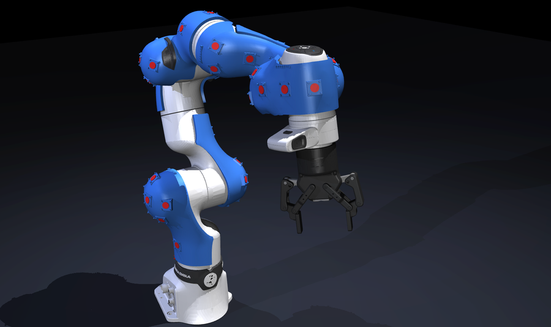
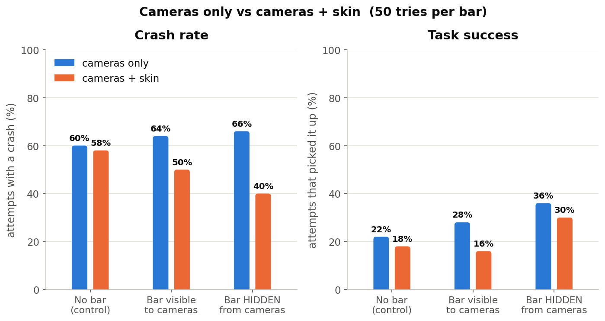
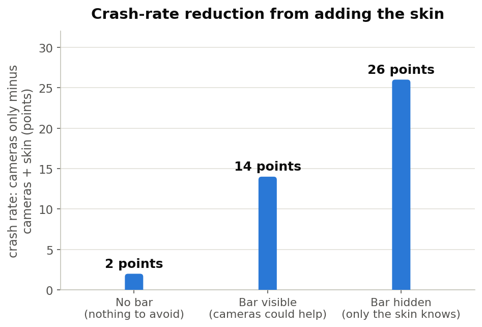
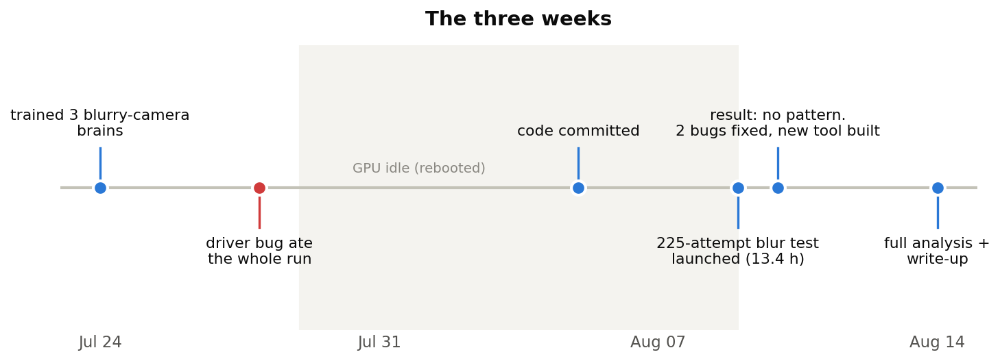
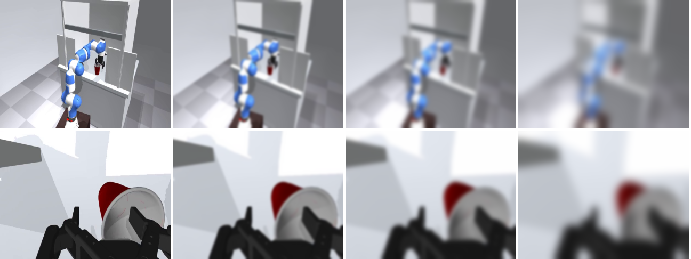
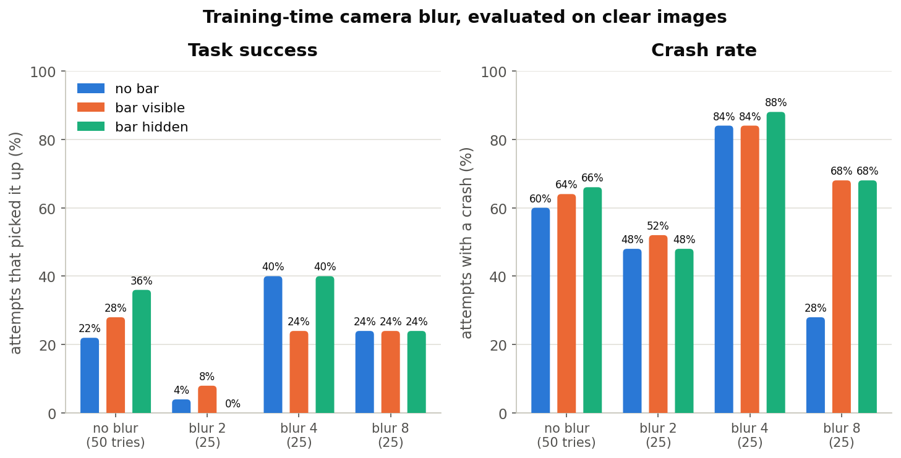
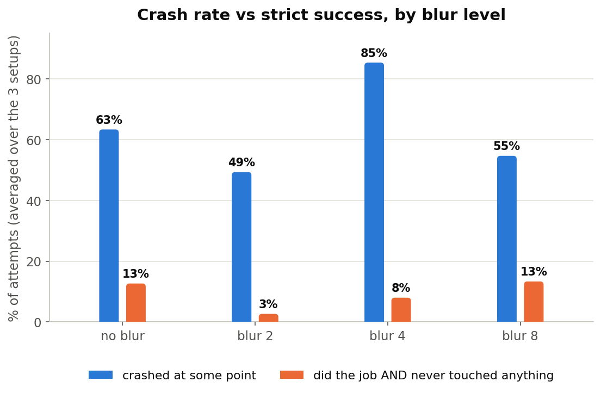
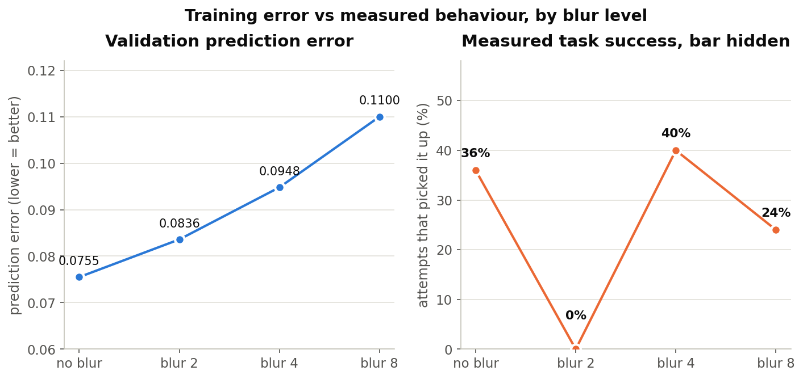
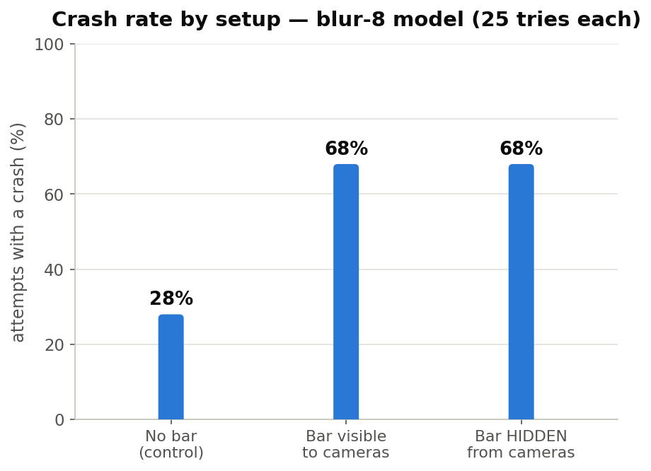

# Progress report — Jay Vakil

**Covers: July 24 – August 14, 2026** (weekly from here on)

**One line:** the main result held up and is figure-ready — a proximity skin cuts robot crashes from
66 out of 100 tries down to 40 when the cameras cannot see the obstacle. The last three weeks went into
a follow-up experiment that **did not work**, and the reason it failed changed how I plan to run the
next one.

*The arm we simulate: 40 small distance sensors (red dots) spread over the whole arm. Each one only
answers "how close is something, right here?" — no color, no shape. Like 40 parking sensors.*

---

## 1. The result that matters

We test in three setups: no obstacle, obstacle the cameras can see, and obstacle the cameras **cannot**
see (we hide it from the camera renderer only — the physics is unchanged, and the skin still feels it).

**Why I trust this:** the benefit lines up with how blind the cameras are — 2 points, then 14, then 26.
Luck does not sort itself into an order like that. Also worth noting: the camera-only robot crashes just
as much when the obstacle is **fully visible** to it (64% vs 66%). It never learned to avoid obstacles
from the cameras at all. So the skin is not a backup sense here — it is the only sense doing avoidance.

---

## 2. What I did in these three weeks

The plan was simple: if the story is "the skin matters because cameras fail," then break the cameras and
watch what happens. I trained three camera-only robots with every training image blurred, then tested
them on clear images.

*What the robot saw during training. Left to right: no blur, then increasing blur. Top row is the room
camera, bottom is the wrist camera.*

**It produced no usable pattern.** 225 test runs, 13.4 hours:

---

## 3. Lessons learned

These are the useful part of the three weeks.

**1. A low crash rate can mean "broken," not "careful."** The mildly-blurred robot has the fewest
crashes of any robot I have trained. It also almost never finishes the task. It learned to barely move.
Only the strict score — did the job **and** never touched anything — separates careful from broken.

**2. Training numbers did not predict what the robot did.** The prediction errors formed a perfect
ladder. The behaviour didn't. The robot with the second-worst score on paper was the best robot in the
room.

**3. 25 tries is not enough — and now I know exactly how much is luck.** One robot, three setups
differing only in whether an obstacle exists. Blur cannot cause the gap below, so a 40-point gap is
what luck looks like at 25 tries. Everything from now on uses 50 minimum.

**4. Two process lessons, each already cost a night.** A driver mismatch let all 25 runs fail silently
overnight; there is now a 2-second check that refuses to start. And a 13-hour job printed an empty
summary table because of a one-line file-matching bug in the part that runs *last* — test the summary
step before launching the long part.

---

## 4. Numbers

| | no obstacle | obstacle visible | obstacle hidden |
|---|---|---|---|
| **Crashes, cameras only** | 60% | 64% | 66% |
| **Crashes, cameras + skin** | 58% | 50% | **40%** |
| Task success, cameras only | 22% | 28% | 36% |
| Task success, cameras + skin | 18% | 16% | 30% |

50 tries per number. The 66% → 40% gap has p = 0.016. Success differences are all within noise (p ≥ 0.23).

| Other numbers | |
|---|---|
| Skin sensors | 40, each an 8×8 depth patch |
| Directions the skin can sense / the wrist camera can sense | 83% / 10% |
| Skin readings under blur and near-darkness | identical, bit for bit (cameras collapse) |
| Training demonstrations | 105 (wanted 200) |
| Prediction error: skin / cameras-only / processed-reflex version | **0.0595** / 0.0755 / 0.0830 |
| Test speed | 3.6 min per try → one 50-try number is 3 hours |
| Measured luck at 25 tries | ±40 points |
| Blur experiment | 225 tries, 13.4 h, no usable pattern |

---

## 5. Progress towards a paper

- **Two figures are done and real** (sections 1 and 3 above). The graded 2 / 14 / 26 pattern is the
  strongest evidence in the project and it is new this week.
- **The headline figure is now defined:** two crash curves as the cameras get worse — one flat and low
  (with skin), one flat and high (without) — while task success collapses underneath both. The argument
  it makes is the one a reviewer actually asks: *why add a skin if you have cameras?* Answer: cameras
  have a failure mode the skin does not, and it isn't exotic — fog, dim light, a dirty lens.
- **The tool for it is built and verified this week.** I can now blur the cameras at *test* time on a
  finished robot, leaving the skin untouched. That makes the comparison paired — same robot, same test
  scenarios, only the camera quality changes — which removes the exact problem that killed the blur
  experiment. First answer is 12 hours of GPU.
- **Still missing before it's submittable:** more than one training run per result, and a crash counter
  that can tell "hit the obstacle" from "brushed the wall."

## 6. Blockers

1. **The crash counter is too blunt.** It counts any contact with the environment. About 60 of those
   66 points are the arm brushing the tight space it was told to reach into; the obstacle itself only
   adds ~5 points. So I am measuring a small effect through a noisy instrument. The code already works
   out *what* it touched and then throws the name away — a ~5 line fix, but old runs can't be
   recovered, so it costs a re-run.
2. **One GPU, and tests can't run in parallel** (memory). At 3.6 min per try, one experiment is 12–47
   hours. This is the real limit on how many results I can support statistically.
3. **The dataset is stuck at 105 demonstrations** instead of 200 — 3 of 4 collection workers get killed
   for using too much memory. Fixable by running fewer workers, slowly.
4. **Every result is a single training run.** Three runs each would turn "promising" into "defensible",
   but that triples the GPU time.

## 7. Next week

1. Fix the crash counter so crashes are split by what was actually hit (~5 lines, then re-run).
2. Run the 12-hour version of the new experiment: same two robots, clear vs blurred cameras at test
   time, 50 tries each. Enough to see whether the two crash curves separate at all.
3. Start the repeat runs with different random seeds on the main result.

**One question for you:** limited GPU means I can do *either* repeat-runs of the existing result *or*
the new corruption experiment first, not both. My instinct is the new experiment, because it turns one
condition into a curve and that's the figure a paper needs — but repeat-runs are what makes the existing
number safe to publish. Which would you rather see first?
